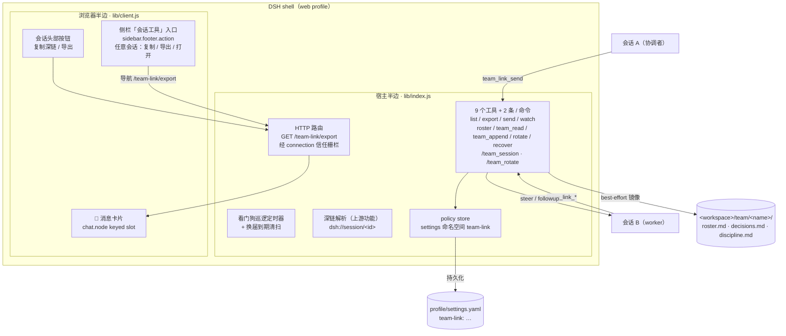
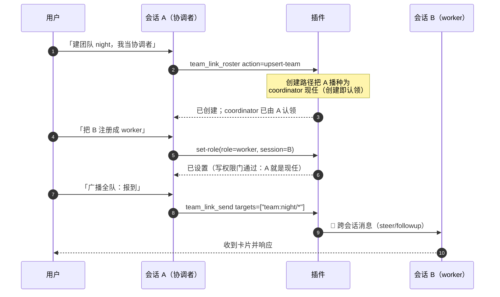
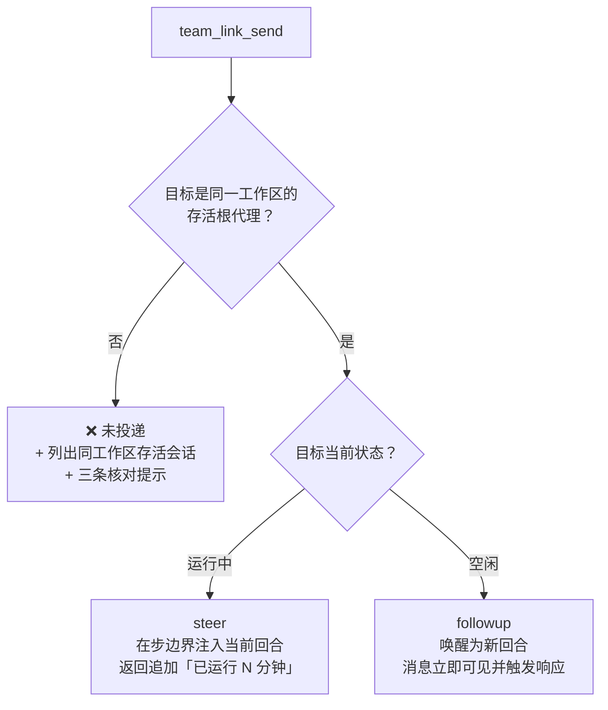
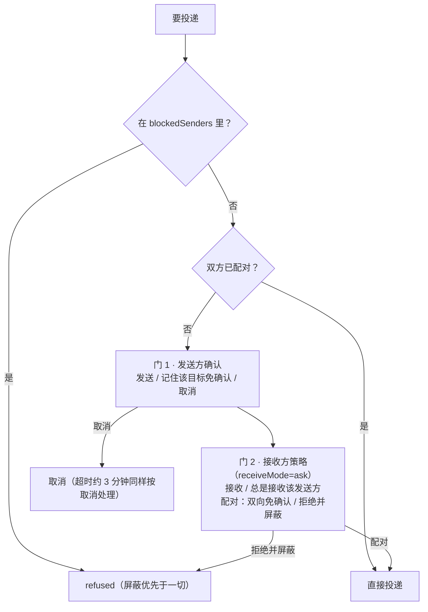
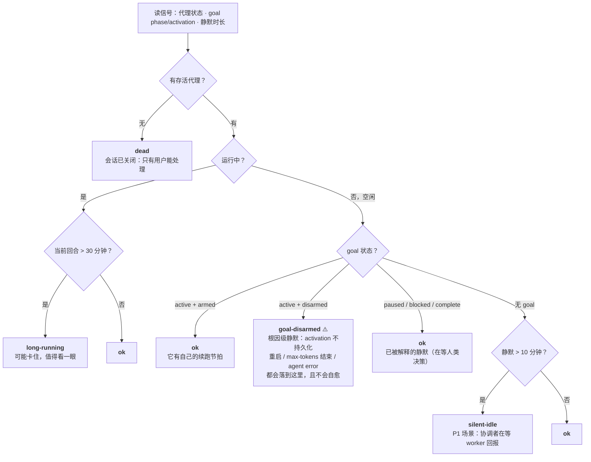
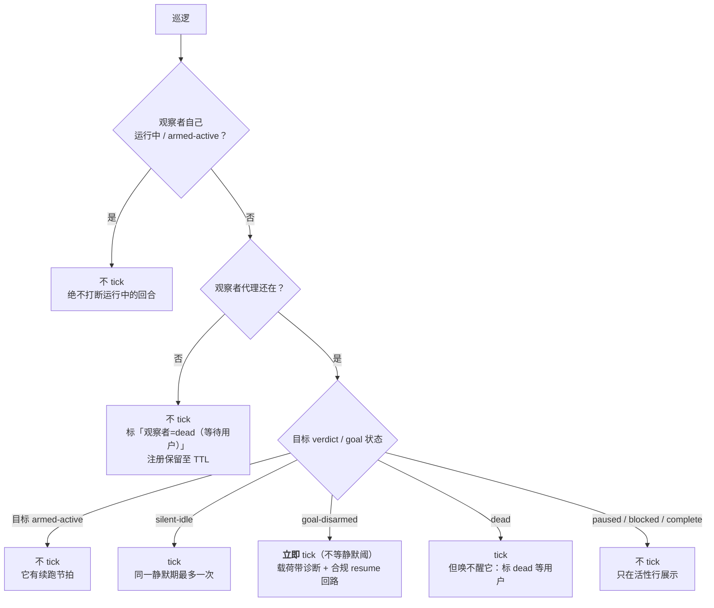
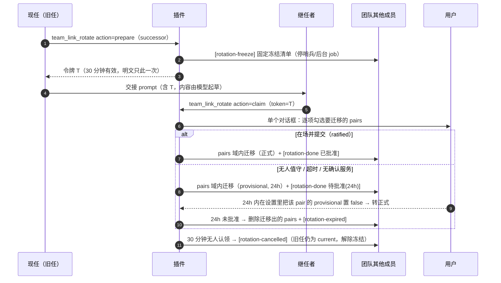

# dsh-team-link

> **DeepSeek Harness (DSH) 的「多会话协作」插件** —— 让同一个 DSH 实例里并行干活的多个会话**互相看得见、说得上话、交接得了班**。
>
> 原名 `dsh-session-link-pro`（0.2.4 及之前），**GitHub 仓库已于 2026-09-18 改名为 `dsh-team-link`**（旧地址由 GitHub 自动重定向）。历史会话日志里的旧工具名 `session_link_pro_*` 与消息 id 前缀 `slp-` 保持原样——它们是取证链，不做回写。

[](#十测试)
[](CHANGELOG.md)
[](#license)

Fork 自 [PwnKY/dsh-session-link](https://github.com/PwnKY/dsh-session-link)——深链复制、`/s/<id>` 打开器与深链上下文注入保留自上游；本仓库在其上长出了完整的多会话协作层。

---

## 目录

- [这是什么：三个痛点](#这是什么三个痛点)
- [架构](#架构)
- [快速开始](#快速开始)
- [工具一览](#工具一览)
- [一、跨会话消息](#一跨会话消息)
- [二、会话可视：列表 / 深链 / 导出](#二会话可视列表--深链--导出)
- [三、跨会话看门狗](#三跨会话看门狗)
- [四、团队：roster 与黑板](#四团队roster-与黑板)
- [五、团队换届 rotation](#五团队换届-rotation)
- [六、策略配置](#六策略配置)
- [七、服务获取与留痕（0.3.7 的关键修复）](#七服务获取与留痕037-的关键修复)
- [八、兼容性与字符串安全](#八兼容性与字符串安全)
- [九、安装](#九安装)
- [十、测试](#十测试)
- [设计文档索引](#设计文档索引)
- [Changelog](#changelog)
- [Credits](#credits) · [License](#license)

---

## 这是什么：三个痛点

在一个 DSH 实例里开多个会话干活（一个协调者 + 若干 worker）时，会话之间默认是**隔离**的：

| 痛点 | 表现 |
|---|---|
| **看不见** | 不知道别的会话在干嘛：跑着还是卡了？在等人还是已经静默十几分钟？ |
| **说不上话** | 没法把 A 会话的结论交给 B 会话继续；想归档一个会话只能翻 UI |
| **交不了班** | 会话上下文会疲劳，但把协调者换成另一个会话，意味着信任关系、团队身份全要人工重来 |

本插件补上这三层能力：

| 能力 | 说明 | 入口 |
| --- | --- | --- |
| 🔗 会话深链 | 复制 `dsh://session/<id>`，粘贴到任意会话即注入该会话只读快照（上游功能） | 会话头部按钮 / 粘贴链接 |
| 📋 会话列表 | 列出同工作区其他会话：主题、运行状态、最近消息摘要，以及**活性信号行**（verdict 五态 + goal 状态 + 静默时长 + 读数时效戳） | `team_link_list_sessions` |
| ⬇ 会话导出 | 全量事件导出为 markdown（可读）+ JSON（无损） | `team_link_export` / 会话头部 ⬇ 按钮 |
| 📨 跨会话消息 | 投递给另一会话，空闲目标自动唤醒为新回合；返回带 **busy 预判**；目标没活动代理时以 **`❌ 未投递`** 开头并列出同工作区存活会话 | `team_link_send` |
| 📣 广播 fan-out | 一次投多个目标：会话 id / `team:<name>/<role>` / `team:<name>/*`（全队，仅现任协调者）；**任一目标未投递则返回首行即 `❌ N 个目标未投递`** | `team_link_send` 的 `targets` |
| 🏷 信封 banner | 可选 `meta`（type / pri / ref）渲染进投递 banner 首行，审计一眼看清消息性质 | `team_link_send` 的 `meta` |
| 🔁 配对通道 | 双方各批准一次后，两个会话互发免确认 | 接收确认时选「配对」 |
| 🐕 跨会话看门狗 | 盯住别的会话：它失联而我空闲时，插件向我自己的会话投一条 tick | `team_link_watch` |
| 🎭 团队 roster | 团队 → 角色 → 会话的身份注册表，含**版本史**（退役≠删除）与写入策略 | `team_link_roster` |
| 📋 团队黑板 | `decisions.md`（只追加裁决账本）+ `discipline.md`（整文件替换，乐观锁） | `team_link_team_read` / `team_link_team_append` |
| 🔄 团队换届 | 两阶段交接：一次性令牌 + 域限定信任迁移 + 退役者对称吊销 + 24h 可回退 | `team_link_rotate` |
| 🚑 团队恢复 | 现任「有席位但无活代理」时的窄恢复路径：**恰两个封闭动词**（revive / reappoint），人在环 fail-closed（§11.9.4） | `team_link_recover` |

### 一条设计红线：绝不把「没投出去」说成「已发送」

这个插件里所有对外文案都遵循同一条纪律——**拒绝要刺眼、降级要留痕、不确定要如实标注**。三条具体体现（都是生产事故换来的）：

- 目标没有活动代理 → 首前缀是 **`❌ 未投递`**，并列出同工作区其他存活会话（有人真把「1 投递 / 2 拒绝」读成「已广播」）；
- 广播只要有一个目标没到 → **首行**就是 `❌ N 个目标未投递（M 个已投递）`，逐目标明细排在后面；
- 服务取不到时**必须留一行 warn**，绝不静默降级（见[第七节](#七服务获取与留痕037-的关键修复)——0.3.7 修的就是一次「静默降级了整整一天没人发现」）。

---

## 架构

插件是标准的 DSH **bundle 插件**，分宿主半边与浏览器半边：



要点：

- **宿主半边**拥有全部工具、`/team-link/export` 下载路由、看门狗巡逻定时器与换届到期清扫；所有模型可见输出都过 `wellFormed()`（字符串安全，见第八节）。
- **浏览器半边**只做两件事：把跨会话消息渲染成醒目卡片（影子替换 chat 包默认的灰字行，非本插件消息委托回原渲染器），以及会话头部的「复制深链 / 导出」按钮。
- **状态的事实源是 settings**（命名空间 `team-link`）；`<workspace>/team/<name>/*` 只是**人可读镜像**，写入失败只告警、不回滚设置（settings 始终是事实源）。
- 团队身份与信任关系（pairs）分开存：roster 管「谁是谁」，pairs 管「谁能免确认发给谁」——换届时两者都要动，但动作路径不同（见第五节）。

---

## 快速开始

**场景**：一个协调者会话 + 一个 worker 会话，同一个工作区目录。



**四步上手**：

1. **开两个会话**（同一个工作区目录）。协调者用强模型，worker 用 `flash` 即可；worker 的开场白一句话：「你是 worker，等主管派活」。
2. **建团队**（在协调者里说）：「创建团队 `night`，我当协调者，把 B 注册为 worker」。创建即认领，**不需要手改任何配置**。
3. **建信任通道**（可选，但推荐）：让 A 给 B 发一条消息 → 接收侧确认框里选「**配对：双向免确认**」→ 此后 A↔B 互发免确认。
4. **派活与记账**：「广播全队：……」/「这条记入裁决账本」/「更新纪律条款」。

**常用话术速查**：

| 想做什么 | 对模型说 | 背后工具 |
| --- | --- | --- |
| 看团队与活性 | 「现在团队状态如何 / 列一下其他会话」 | `team_link_list_sessions` |
| 广播 | 「广播全队：<内容>」（仅现任协调者） | `send` + `targets=["team:<n>/*"]` |
| 点对点 | 「发给 worker1：<内容>」 | `send` + `targets=["team:<n>/worker1"]` |
| 按优先级/性质发 | 「以 P0 裁决回复 W1，引用我上条消息」 | `send` 的 `meta` 信封 |
| 记账 | 「这条记入裁决账本」 | `team_link_team_append`（`decisions`） |
| 改纪律 | 「更新纪律条款」 | `team_link_team_append`（`discipline`，带 baseHash） |
| 盯人 | 「盯住 W1/W2，静默 15 分钟叫我」 | `team_link_watch` |
| 交班 | 「我下岗，让 session-X 接任」 | `team_link_rotate`（两阶段） |
| 归档 | 「导出这个会话」 | `team_link_export` / 头部 ⬇ |

---

## 工具一览

| 工具 | 一句话 |
| --- | --- |
| `team_link_list_sessions` | 同工作区其他会话 + 活性信号行（verdict 五态 / goal / 静默时长 / 读数时效戳） |
| `team_link_export` | 任意会话全量导出 md + JSON |
| `team_link_send` | 跨会话投递（单目标或 `targets` 广播 ≤8）；`meta` 信封；返回带 busy 预判；**发送方自己那一行渲染成卡片**（§10.1 A/D） |
| `team_link_watch` | 给自己注册跨会话看门狗（register / list / clear） |
| `team_link_roster` | 团队身份注册表（get / upsert-team / set-role / retire） |
| `team_link_team_read` | 一次读齐 roster + decisions 末 20 条 + discipline 全文 + 两个 baseHash |
| `team_link_team_append` | 写黑板：`decisions` 只追加 / `discipline` 整文件替换（乐观锁） |
| `team_link_rotate` | 两阶段换届（prepare / claim），一次性令牌 + 域限定迁移；`successor:"auto"` = 插件自建继任者 + 写交接文档 + followup 投递（§11.2） |
| `team_link_recover` | 角色恢复（**恰两个封闭动词**）：`revive`（复活当前现任那个会话本身，仅插件自建会话、**任意角色**，身份/信任零改动）／`reappoint`（人改任 = 人类对话授权的 prepare，候选 = 本队活成员 ∪ 常驻的「自建继任者（新建会话）」，由插件算出）。attended-only：无确认服务即 fail-closed，刻意没有无人值守变体（§11.9.4 / §4.2） |

> `team_link_export` 走 `sessionQuery` 读会话；`team_link_send` 走 `agents` 投递。两者都不需要目标会话正在被 UI 打开——但**目标必须有活动代理**（见第一节的 A4 诚实声明）。

---

## 一、跨会话消息

### 投递语义：steer 还是 followup



- 目标**运行中** → `steer`：在步边界注入其当前回合；
- 目标**空闲** → `followup`：唤醒目标会话，作为**新回合**处理（立即显示并触发 LLM 响应，不会静默排队）；
- 目标**没有活动代理** → 拒绝，且拒绝文案**自带自愈线索**：

  - 首前缀 **`❌ 未投递`**（不许被读成「已发送」）；
  - 保留原句「目标会话 `<id>` 没有活动代理」；
  - **新增同工作区存活会话列表**：每行 `id（运行中/空闲）`，上限 10 个，超出时注明「共 N 个，仅列前 10 个」；
  - **新增核对提示**：对照 id（最常见成因是转录错位）/ 刚重启 DSH 时在侧边栏打开目标会话一次使其恢复为活动代理 / 先调 `team_link_list_sessions`。

  该列表是**纯 agent 注册表读取**（`ctx.agents.list()`，不读会话日志、零 surface 读取、无性能代价），只列**根代理**、同 `cwd`、且非发起者自身——子代理不会被列为可投递目标。执行上下文没有会话身份时（插件内部通知路径）只知道「非自身」，此时跳过 cwd 过滤、列出力所能及的全部存活会话；无匹配时输出「当前工作区无其他存活会话。」

### 消息形状：为什么 `source` 必须恰好三个成员

投递的消息 `source = { kind: "agent-message", form: "relay", senderSessionId }`——**恰好这三个成员**。这不是风格选择：DSH 0.1.5 的会话日志迁移会逐条校验 `source`，白名单外的 `kind` 或成员多一个少一个，会让**整份会话日志**拒绝迁移（表现为「这个对话打不开」）。详见[第八节](#八兼容性与字符串安全)。

发送方、时间、插件名都写在**正文 banner** 里：

```
📨 [跨会话消息 · 来自会话「X」(session-x) · 2026-09-17 23:42:05 · type=ruling pri=P0 ref=slp-a1b2]
```

接收方模型可直接看到，并可用同一工具回发。消息 id 固定为 `slp-<uuid>`，UI 卡片靠它把自己的中继与上游相邻代理消息区分开。

**「三成员」有三个构造点，不是一个**（差异审计修复轮 🔵-3 的措辞修正）：本插件对 `{kind, form, senderSessionId}` 这个形状有 **3 处**字面构造——`relayUserMessage`（本插件**驱动**的那些中继：§10.2.3 启动任务、§11.4.5 交接投递、§11.2 命令指令共用的一处构造）、看门狗 tick（`tickMessage`，消息 id 前缀 `slp-wd-`、发送方是观察者自身）与 §3.4 的 `team_link_send` 投递（正文是信封 banner）。**三处都恰三成员**；`relayUserMessage` 的注释原先概括成「全模块唯一构造器」，那句**只对「本插件驱动的中继」成立**，对全模块不成立（已在注释里改成带范围的表述）。改这个形状要**三处一起改**——任何地方冒出第四处字面构造才是缺陷。

### 两道批准门与配对



- 接收方选「**配对**」→ 写入 `pairs: [{a, b, createdAt}]`，此后两会话**双向免确认**；
- 选「**拒绝并屏蔽**」→ 写入 `blockedSenders` 并**自动解除配对**——屏蔽始终优先于配对；
- 超时（约 3 分钟）按取消处理；确认服务不可用时**逐目标 fail-closed**（宁可不发，不默认放行）。

### 广播 fan-out（`targets`）

`targets` 与 `targetSessionId` **互斥**：两者都给是参数错误，都不给也是参数错误（单目标语义不变）。

| `targets` 项 | 解析 | 谁能用 |
| --- | --- | --- |
| `session-xxx` | 直达该会话（最高优先级） | 任何会话 |
| `team:<name>/<role>` | 该角色的现任会话 | 任何会话；角色空缺/不存在 → **`no-holder` 结果**（不算投递也不算失败） |
| `team:<name>/*` | 全队：该团队全部**在任且存活**的角色（不含发起者） | **仅该团队现任协调者**，否则整次调用拒绝 |

`team:<name>/*` 之所以收得这么紧：协调者的价值部分在于**策展每个 worker 看到什么**，而 flash worker 最稀缺的资源是上下文——全连通群播会让 worker 的上下文互相污染。

- 单次最多 **8** 个目标，超出即拒绝；团队不在 roster 或表达式形状非法 → **整次调用拒绝**（不做「半发」）；
- fan-out **不放宽任何门**：每个目标照走完整单目标路径（屏蔽检查 → 配对快路径 → 发送方确认 → 接收方策略 → steer/followup）。N 个未配对目标就是 N 次批准；
- 返回逐目标结果行：

  ```
  - session-b（via team:night/worker1） → delivered：已投递（目标已空闲，唤醒为新回合）
  - session-c（via team:night/worker2） → refused：接收方拒绝
  汇总：1 投递 / 1 拒绝 / 1 个重复目标已去重。
  ```

- **失败领先**：只要有一个目标不是 `delivered`，**第一行**就是 `❌ N 个目标未投递（M 个已投递）`（N 含 refused / no-agent / no-holder，用词是「未投递」而非「失败」，故与汇总里 no-holder 的独立桶不矛盾），其后才是 `广播 fan-out：…` 头行、逐目标行与汇总。**全部成功时文案形状一字不变**；
- 重复的会话 id（含不同表达式解析到同一会话）**去重后只投一次**，去重个数写在汇总里。

### 信封 banner（`meta`）

可选 `meta: { type?: 'ruling'|'receipt'|'report'|'ask', pri?: 'P0'|'P1'|'P2', ref?: string }` 渲染进 banner **首行**的紧凑字段，只出现调用方给的键：

```
📨 [跨会话消息 · 来自会话「X」(session-x) · 2026-09-17 23:42:05 · type=ruling pri=P0 ref=slp-a1b2]
```

- `ref` 超过 **16 字符**按**码点**截断（不会切半 emoji），并在返回文案里注明截断前后；
- 枚举外的 `type`/`pri`、未定义字段、非对象 `meta`、空 `ref`、含换行的 `ref` → **明确参数错误、整次调用拒绝**（不静默丢弃、不部分采用）；
- fan-out 时所有目标共享同一 `meta`；
- **`source` 仍是恰好三成员**：信封只走正文 banner，不扩 source、不做 sidecar 索引。

### busy 预判

投递成功的返回文案附带目标忙碌状态（fan-out 逐目标独立）：

- 目标**运行中** → 追加 `目标回合已运行 N 分钟（steer 注入当前回合）；需新回合语义请等其空闲`。`N` 取自活性行的「回合始于」，读不到该时间戳时只给 steer 语义、不给分钟数；
- 目标**空闲** → 保持原文案（已唤醒为新回合）。
- **发送方卡片上是同一读数的徽标形态**（不是上面那句机制文案）：`忙碌 · 已运行 N 分钟`，读不到回合起点时只说 `忙碌中`——见「发送方卡片」一节的「A 面逐目标行的措辞」。

### 消息卡片（浏览器侧）

接收方 UI 把跨会话消息渲染为醒目的 📡 卡片（📡 标题行 + 高亮左边条 + 发送会话 + 时间）：通过 `conversation.chat.node` keyed slot 以 `priority: -100` **影子替换** chat 包默认的折叠灰字行；非本插件消息（其他插件的 context 注入）经 `slots.entries()` 委托回原渲染器，显示不受影响。

判定条件不是「kind/form 命中」而是**本插件自己的消息**：`agent-message + relay` 正是上游相邻代理消息（`send_message`）用的形状，只按 kind/form 判断会把它们也渲染成卡片。因此卡片还要求命中本插件自己的特征之一——消息 id（在 chat node 上是 `node.id`，context 的 `data` 里没有 id）以 `slp-` 开头，或正文以 `📨 [跨会话消息` 开头；历史日志里的旧 `kind: "team-link"` 继续识别。卡片时间优先取旧日志的 `sentAt`，其次取 context node 自带的事件时间 `data.time`，最后才从正文 banner 里解析。

### 发送方卡片（`team_link_send` 自己那一行）

上面那张卡覆盖的是**接收方**；发送方过去只看到工具树里一行灰字。现在发送方也有卡，两条腿都在客户端：

**每一块信息只准出现一次**（§10.1.5 硬性条文，差异审计 F1 后写死）：两张卡的可见文本取**并集**后，任一语句**恰好出现一次**。判据由 `client-half.test.mjs` 的 F1 三条断言把守——把任意一块搬回另一面，它们当场变红。

| 腿 | 位置 | 槽位 | 承载（且只承载这些） |
| --- | --- | --- | --- |
| **A** | 工具调用**原地**（审计记录不动） | `tool.call.toolview`，key = **线上工具名 `team_link_send`**（逐字；typo 会静默回退通用工具行、不报错） | **极简标签**（`✦ 工具调用 · team_link_send · N 个目标`）+ **逐目标行**：每行「目标（`expr` 或短 id）+ **outcome 的一句人话短语**（从结构化字段渲染，见下「A 面逐目标行的措辞」）」，运行中的目标带 busy 徽标。**不渲染**标题/时间/正文/汇总，**也不渲染 `target.detail`**（那句是模型可见的报告句） |
| **D** | 会话流**顶层** | 本插件自己的 `uiConversation` definition（kind `team-link-send`）+ 同 kind 的 `conversation.chat.node`（`priority: -90`） | 标题 + 发送方/时间 + **正文** + **汇总计数**。**不渲染逐目标明细行**（目标身份归 A 的行）。与接收方的 `key: "context"` 卡片**kind 不同**，并存不冲突 |

**A 面逐目标行的措辞（2026-09-20 用户决定；设计 §10.1.5 修订 + §12.5）**：A 的每一行**不再原样搬运 `target.detail`**——那句是**模型可见的报告句**，带「已投递到 …」「目标处于空闲」「steer 注入当前回合」这类**投递机制**，对人看的卡片偏机制而非结论，且一个目标就占 2–3 行。改为**从结构化字段渲染一句人话**：

- `target.outcome` → 一句**固定短语**（客户端 `OUTCOME_PHRASES` 映射到 zh/en 两套 locale 键，**不是硬编码**）：`delivered` → 「已送达」、`refused` → 「未送达——接收方拒绝」、`no-agent` → 「未送达——目标会话没有活动代理」、`no-holder` → 「未送达——该角色当前空缺」；
- `target.busy` → **徽标**：「忙碌 · 已运行 N 分钟」（读不到回合起点时只说「忙碌中」，不编数字）；
- 目标身份 → `expr` 或**短 id**（不变）。

于是**一行 = 目标 + 一句结论 +（忙碌时）徽标**，长报告句（含机制、含 `busy` 的 steer 文案）继续留给**模型可见的文本**。**这不违反「一处事实」**：报告句与卡片短语是**同一批结构化字段的两种渲染**（`outcome` / `busy` / 身份），`target.detail` 仍**留在回执里**（模型可见文本的事实源 + 纯文本降级路径的兜底），只是不再是 A 的渲染输入。

| 实测对照（同一次投递，`team:night-shift/*` 广播；「改前」句取自 `client-half.test.mjs` 的旧期望值 fixture——那行 **80 字符**、卡片按 `pre-wrap` 折成 2–3 行，「改后」行 44 字符） | 文本 |
| --- | --- |
| **改前** A 面逐目标行 | `session-worker-a（via team:night-shift/*） 已投递 已投递到 session-worker-a：目标空闲，已唤醒目标会话。` |
| **改后** A 面逐目标行 | `session-worker-a（via team:night-shift/*） 已送达` |

**跨半边行为锁（取代 B1 的字符串等式）**：旧的「卡内行 == 报告首行」断言已**作废**（它钉的是一个已被设计替换的渲染，且同源化之后**由构造保证永不红**，§12.3 ⑤）。现在锁的是**行为**：宿主半边**能铸出的每个 `outcome` 枚举值都必须有客户端短语**——`host-half.test.mjs` 同时读 `lib/index.js` 与 `lib/client.js`，把宿主侧的字面量 token 集合与客户端 `OUTCOME_PHRASES` 的键**判等**；**新增一个枚举值而不给卡片短语 → 必红**（红相实测见「测试」一节的对应条目）。测试报告里会打印两侧的实测集合。

**数据来源是官方载体，不是解析返回文本**：宿主半边给 `team_link_send` 加了 `output.presentationMeta`，产出的结构化回执落在 `tool/result.meta` 里（durable——回放同一份日志会重建同一张卡）：

```
{ kind: "team-link-send", v: 1, at, senderSessionId,
  meta?: { type?, pri?, ref? },                 // 仅调用方给了信封才有
  message: { text, truncated, chars },          // chars = 原始码点数
  targets: [{ expr?, sessionId | null, outcome, detail, busy? }],
  targetsTruncated?: { shown, total },          // 仅 targets 真被裁到 24 行才有
  summary: { delivered, refused, noAgent, noHolder, deduped }, fanout }
```

- **体积纪律（两处上限，各自如实标注）**：
  - **正文**：`message.text` 上限 **2000 码点**，超出则取头 **1500** + 省略标记 **3 码点** + 尾 **400**（1903 码点，仍在限内）并置 `truncated: true`；`chars` 记**原始**码点数。裁剪与计数都按**码点**；
  - **逐目标行**：**宿主侧（权威）** `targets` 封顶 **24 行**（`SEND_CARD_ROW_LIMIT`，= §10.2.4 的每队成员上限，全队广播仍可整份渲染）。界是**行数**不是**表达式数**：输入侧 `resolveTargetList` 裁的是表达式（≤8），而**一个** `team:<name>/*` 就展开成该队全部在册存活成员，所以合法的行数可以超过 8——**持久化的卡必须有界**，`tool/result.meta` 里被烙进日志的正是卡的 `targets`。超出时卡内**显式标注** `targetsTruncated: { shown: 24, total }`（`shown` = 裁完实际呈现的行数——客户端 `sendRowsTruncated`「已截断——仅显示前 {shown} 行」的口径同样是**实际画出的行数**，良构宿主卡上两者同值；`total` 是这次投递真实的行数），而 **`summary` 计数仍覆盖全量**、**文本报告仍逐目标完整**——卡是**有界呈现**，报告是**全量档案**；
  - **客户端（防御 + 如实呈现；2026-09-19 收尾轮补齐跨轮读路径）**：A 面渲染期另设同值上限，因为 `meta` 核心不透明且**持久化**，手改日志或异构实现可塞进任意条数。**这条判据对宿主自产的卡永远不触发**（宿主已先裁到 24，行数恰好落在界上），所以 A 面**同时读宿主自己的 `targetsTruncated` 标注**：只要卡上有该标注，**或**行数确实超过本地上限，A 面就渲染 `sendRowsTruncated`「已截断——仅显示前 {shown} 行」——两类超限都在界面上看得出来。两处数字各有各的口径：`{shown}` 是**实际画出的行数**（不是标注里写的数字——手改的 `shown` 不得在那个句子里安一个假数字），标签的「N 个目标」取**真值**——有标注时是 `targetsTruncated.total`（30），无标注时是该卡自己的行数（外来卡的 30 行就是真值；而只画出的那 24 行**不得**当真值）。标注本身与其它 `meta` 字段同等不信任：形状不认（`shown` / `total` 非有限数）即**丢弃**并退回「按行数判超限」的防御路径，卡照常渲染。**无标注且 ≤24 行**的卡可见文本与加这条读路径之前**逐字一致**（不增删任何文本）；
- **良构（差异审计 F2 修正）**：**卡内的每一个字符串成员**——`message.text`、逐目标的 `sessionId` / `expr` / `detail`、`senderSessionId`、信封的 `ref`——都在制卡时过一遍孤立代理项修复。卡**不走** `textOutput.render`，模型可见出口盖不住它，所以这条线必须逐个字段自己守住；回归锁在同一声明的三条断言上（污染 `sessionId` / `expr` / `meta.ref` 后 `JSON.stringify(card)` 无孤立代理项）；
- **降级**：拿不到回执时（调用仍在飞、旧日志没有 `meta`、`meta` 形状不认识、其他工具的 meta）先走「文本重建」，重建不出来才回退**纯文本行**（三种情形的判定表见下面「三种情形」）；整次调用在**走到逐目标投递之前**就被拒（寻址互斥 / 无地址 / `meta` 非法 / 执行上下文没有可交互的活动代理）时**不产出卡**，客户端回退文本——绝不为没发生的投递编造回执。注意区分：**目标**无活动代理（`outcome: "no-agent"`）发生在投递阶段内，**照常出卡**，那一行就是那条 `❌ 未投递` 拒绝；
- **零日志改动**：A/D 都只**读**既有的 `tool/call` + `tool/result` 事件，**不新增任何日志事件类型**（§10.3 红线）；投递消息的 `source` 仍恰三成员；模型上下文无新增消息。

#### 三种情形：卡片 / 文本重建 / 纯文本行（§10.1.5，DEFECT-5）

A 面（`tool.call.toolview`）**逐块判定，顺序即优先级**：

| # | 情形 | 判据 | A 面呈现 |
| --- | --- | --- | --- |
| ① | **有结构化回执** | `tool/result.meta` 读得动（`kind: "team-link-send"`、`v: 1`、字段齐） | **卡片**，数据全部来自回执。文本重建在这一情形里**永不参与**（下面 ① 号锁） |
| ② | **无回执（或回执读不动），但文本认得** | 模型可见文本是我们自己产的两种形状之一 | **文本重建的最小卡**：目标身份 + 结果短语 + 汇总计数从**文本**解出；`at` / 发送方 / 正文 / `busy` / `detail` **不造**（文本里没有这些字段） |
| ③ | **两者都不成** | 在飞、无文本、认不出的句子、跨行/改写/自相矛盾的报告 | **纯文本行**：原样显示模型可见文本，一行不吞、一处不改 |

**② 什么时候会发生（实测定性，不是推断）**：`presentationMeta` 只在**一等工具调用**上投影（`dsh-tools/lib/types/index.js:1191` 的 `exec.parent === undefined`），所以**在 `run_code` 程序里发起的** `team_link_send` **永远没有** `tool/result.meta`——桥为那次派发记的是 `tool/ptc-dispatch`，其字段恰为 `{rootCallId, parentCallId, subCallId, name, arguments, isError, content}`（**没有 `meta`**），客户端 chat 包据此建的块（`childResult`）也不带 `meta`。**只读全量扫描**本机 1311 个会话日志：`team_link_send` 的 `ptc-dispatch` **733 次、带 `meta` 的 0 次**；同一批里 `tool/result` 带本插件回执的有 **11** 条（都来自一等调用）。⇒ 此前**从代码里发出的那一次投递永远是灰行**，而直接调用的一直有卡。

**② 认的两种形状（我们自己的渲染器逐字产出，`lib/index.js`）**：

- **单目标成功**：`已投递到 <sessionLabel>（<通道说明>）：<细节>`——`sessionLabel` 是 `id` 或 `「标题」(id)`，通道说明是配对 / provisional 两种之一（也可以没有）。解析时**按形状**剥掉这两层，不硬编码那两句提示语；
- **广播报告**：可选的 `❌ N 个目标未投递（M 个已投递）` 首行 + `广播 fan-out：N 个目标[（重复目标已去重 N 个）]` + 逐目标行 `- <目标> → <结果>：<细节>` + `汇总：N 投递 / N 拒绝[ / N 无活动代理][ / N 空缺目标（no-holder，不计入投递与失败）][ / N 个重复目标已去重]。` + 可选的 `注意：…` 尾注。逐目标行的 `<细节>` **可以跨行**（`no-agent` 的拒绝是一整段，自带缩进列表），那些续行属于**同一行**，不会变成额外的目标行。

**② 是「全有或全无」，并且自校验**：报告里的每个结构事实都要与其它事实**互相印证**才成卡——行数 == 表头声明的目标数、`汇总` 四个桶 == 逐行自己的计数、去重数（表头与汇总两处）一致、`❌` 首行**有且仅当**存在非 `delivered` 的行、且它复述的两个数字与逐行计数相同。任一处不符（含标签认不出、`outcome` 落在四种之外）⇒ **整条回落 ③**，而不是丢掉那一行或猜一个桶。理由就是「不伪造」：单目标**被拒**的句子（`未投递：…` / `发送失败：…`）**根本不含目标身份**，为它出卡就必须凭空造出「目标」这个字段——按设计那句话（`缺的字段不造`）它只能留在 ③。

**重建出来的卡只在 A 面**：D 的顶层节点由 `tool/result.meta` 的判别符经 definition `match` 驱动，所以**文本重建永远长不出顶层卡**。

**已知边界（如实声明）**：`presentationMeta` 只对**顶层**工具调用投影（`exec.parent === undefined`），所以从 `run_code` 程序里发出的 `team_link_send` 拿不到结构化回执——那一行走的是上面的**文本重建**（② 情形），重建不出来才是纯文本行；D 的顶层节点在 chat 包把「回合过程」折叠起来时可能随之被折进去（`tool-call` 节点本身也是这个待遇）——`tool/call` 滚出历史窗口、只剩 `tool/result` 时按 `context.matches` 回退重建，卡片不会在长会话里凭空消失。**客户端半边对 `uiConversation` 不是硬依赖**（审计 F3）：模块级 `inject` 只有 `slots`/`sessions`/`locale`，definition 走 `ctx.inject(["uiConversation"], …)` 动态注册，因此缺该服务的老壳**只丢 D 的顶层卡**——接收方卡片、工具行、复制/导出按钮、深链打开器全部照常；**四条槽位注册（header 按钮条 + 三条 §10.1）各自加护栏**（审计 B3；第四条为 round-1 🔵 #3 补齐），任一条被槽位拒绝也只丢那一行。

### 诚实声明（A4）

跨会话投递只能送达**有活动代理**的会话：目标已关闭、或刚重启 DSH 后尚未在侧边栏打开过，都没有任何机制能唤醒它。插件能做的只有**如实告知 + 给出恢复动作**，而不是假装发送成功。

---

## 二、会话可视：列表 / 深链 / 导出

### `team_link_list_sessions` 的活性信号

每个会话行带一条活性信号（读一次 surface + 一次 agent 查询，**纯服务调用，不解析日志**）。

**读取是有窗口的**：只有列表前 **12** 个会话（`PREVIEW_SESSIONS`，与主题/最近摘要同一个窗口）会被读 surface，且这 12 次读取**并行**发出。第 13 行及以后照旧列出（id / 运行状态 / 创建时间 / 读数时效戳——全是零日志成本的面），但活性行降级为 `活性：未读（超出快照窗口 12）……`：verdict / 静默时长 / goal / 主题 / 最近动态一律标为未判定。

> **为什么要有界**：一行 surface = 一次冷日志解压 + 一次表面投影。真实工作区实测（26 个会话）逐个串行读满 `LIST_LIMIT`（50）会直接超掉 60s 工具预算——0.3.5 修的就是这个（修前超时、修后约 15s）。这里选择**有界 + 并行 + 如实标注**，而不是编一个没读过的判定。

窗口内的字段：

| 字段 | 含义 |
| --- | --- |
| `verdict` | 五态判定（见下） |
| `代理` | `运行中` / `空闲` / `未运行`（读 agent 注册表） |
| `goal` | `<phase>/<activation>(<已用轮次>/<上限>)`；blocked 另带 ` blocked=<code>: <message>`；`none` = 当前无 goal；**`?` = goals 服务缺失**（降级运行，插件功能不受影响） |
| `静默` | `now - max(末条 assistant, 末条入站)`（分钟）；两侧时间戳都读不到时显示 `?` |
| 回合始于 / 末条助手 / 末条入站 | 绝对时间戳（本地时区） |

**verdict 五态**（阈值：静默 10 分钟、回合 30 分钟；`team_link_watch` 的 `silentMinutes` 只影响巡逻判定）：



`goal-disarmed` 是这个插件最想让你看见的状态：它看起来「空闲」，其实是**根因级静默**——goal 还是 durable-active，但驱动器不会再排队，除非人类（经模型转告后）显式 resume。插件**绝不代调** `goals.resume`（那是人类授权门），只负责把状态摆出来、并给出合规的恢复回路。

**读数带时间戳**：每行行尾是 `（读数 YYYY-MM-DD HH:mm:ss，>2min 作废）`——活性是快照，超过 2 分钟须重新读。

### 深链（上游功能）

复制 `dsh://session/<id>`，粘贴到任意会话即注入该会话的**只读快照**作为上下文。这是上游 `dsh-session-link` 的能力，本仓库保留其解析行为不变（`register-protocol.ps1` / `dsh-open.cmd` 负责协议注册与打开）。

**聚焦这一步**（打开之后真的切到那个会话）**0.3.9 起修复**：此前用的是 `ctx.sessions.open(id)`——会话服务上**没有**这个方法（同名的 `Session.open()` 是历史加载，另一回事），调用抛错被 `try/catch` 吞掉 ⇒ 静默空调用；见[侧栏「会话工具」入口](#侧栏会话工具入口039-起)一节的末段。

### `team_link_export`

任意会话全量导出：markdown（人可读，含信封首行）+ JSON（无损事件流）。同一个导出能力也挂在 `GET /team-link/export?session=<id>&format=md|json`（会话头部 ⬇ 按钮消费），路由与工具**共用同一个文件名安全不变式**（`fileSafeSessionId()`）。

**下载路由走平台的信任栅栏**（0.3.9 起）：路由只注册给**同时**拿到 `webServer` 与 `connection`（栅栏服务）的宿主，并且**每个请求**都先问一次 `connection.requestRejection(req)`——Host/Origin 栅栏（跨站/DNS rebinding → 403）与浏览器鉴权（未登录 → 401）都由平台裁决，裁决结果**原样写回**（响应体与官方的 RPC 通道一致：401 `unauthorized`、403 `forbidden`）；被拒时**不读会话**。栅栏取不到（服务缺席、没有 `requestRejection`、或它在挂载之后消失）⇒ **503 + 不吐数据**：宁可没有这条路由，也不要一条无门路由。非 GET 方法一律 405（`allow: GET`）。同源且已登录的浏览器下载**行为不变**。

### 侧栏「会话工具」入口（0.3.9 起）

侧栏底部（**同一 flex 行内**、位于消耗卡片**右侧** —— `order: 0` 升序 ⇒ 排在 `order: -10` 的消耗卡之后、【设置】之前）多一个入口，点开是**任意会话**的列表：**复制链接 / 导出会话 / 打开会话**——不必先进入那个会话。入口注册进官方槽位 `sidebar.footer.action`（**不改任何官方文件**）。**该位置已由 owner 在真机确认保持**（同一 flex 行、消耗卡右侧；「改到下方」物理上不可达 —— 见下表「为什么不是下方」）。

| 面 | 行为 |
|---|---|
| 位置与形态 | `id: team-link-session-tools`、`order: 0` —— **同一 flex 行内、位于消耗卡片 `order: -10` 的右侧**（`order: 0` 升序 ⇒ 排在它之后、【设置】之前）。**为什么不是「下方」**：官方 `.footerActions` 是 `display:flex`（方向默认 row），且官方 sidebar 全档 `flex-wrap` 出现 **0** 次 ⇒ **不换行**，而插件**无法从子元素侧改变父级换行**（改父级 = 改官方文件，违反设计档 §1.3 的红线 N5）；2026-09-21 真机读数（owner 截图）与之一致：入口渲染在消耗卡**右侧**。宽态=图标 + 文字「会话工具」，收起态（56px 轨道）**只渲染图标**，文字转 `aria-label`/`title` |
| 弹窗 | 官方 **`Modal`**（居中、挂 body——收起态轨道只有 56px，锚定面板会被裁切）：标题 + 当前计数 → 搜索框 → 会话列表（可滚动）→ 有界呈现标注 → 底部（范围切换 + 关闭） |
| 数据源 | `ctx.sessions.list` / `ctx.workspaces.list`：丢弃 `origin === 'subagent'`、丢弃已归档、丢弃 blank 行、**丢弃当前会话**（本面板的用途是「**其他**会话」——当前会话的复制/导出已在会话头部按钮上；丢弃它之后官方那条「blank 行只在它是当前会话时保留」自然退化为「blank 行一律丢」），按 `updatedAt` 倒序；当前会话 = `retainedBy.mainView > 0` 的那一行（官方同款约定，只用于**定位当前工作区**与**把它从列表里剔除**）；**默认范围 = 当前工作区**，底部可切「全部工作区」 |
| 列表行 | 状态点（**恰两态**：运行中 / 空闲，唯一数据源 `SessionSummary.running`）+ 标题（超长省略）+ 相对时间（切「全部工作区」时追加工作区名）；「复制链接」「导出会话」**默认隐藏，鼠标悬停该行或该行获得键盘焦点才浮现**；点行本身 = 打开该会话 |
| 三个动作 | **复制链接** = 剪贴板 `dsh://session/<id>`（与会话头部按钮**同一格式**）+ 短暂「已复制 ✓」+ `aria-live` 播报；**导出会话** = **导航** `GET /team-link/export?session=…&format=md`（同源自动带 cookie、天然过栅栏、零 CORS 面；参数必须编码）；**打开会话** = `ctx.uiWorkspace.openSession(id)` |
| 三种空态 | **三句不同的话**：读取中… / 没有匹配「xx」的会话 / 暂无其他会话（「还没读到」「搜不到」「真的没有」不许混） |
| 有界呈现 | 列表上限 **50** 行；超过时在列表末尾写明「**共 N 个，仅显示前 M 个（搜索可收窄）**」 |
| 服务缺失 | `sessions` / `workspaces` / `uiWorkspace`（以及 seed 模块的 `Modal`）缺任一项 ⇒ **入口不注册 + 一行 warn**，绝不渲染一个点了没反应的假按钮；其余面（深链、消息卡片、头部按钮）照常 |
| 键盘与无障碍 | Tab 进入、Enter/Space 打开；关闭（Esc / 关闭按钮 / 成功打开）**把焦点还给入口**；动作按钮带独立无障碍名（含会话标题）；尊重 `prefers-reduced-motion` |
| 边界 | 只做「看 / 复制 / 导出 / 打开」——**不做**会话写操作（改名 / 分叉 / 归档），不加右键菜单，不动会话行内菜单 |

**已知限制**：

1. **收起侧栏 + Windows 标题栏模式**（`[data-windows-titlebar]`）下，官方 CSS 会隐藏整个 `footArea`（连同【设置】）⇒ 本入口一并不可见；展开侧栏即可用。
2. 状态点**刻意只有两态**：第三态「无活动代理」是**宿主侧**事实（宿主半边读 `ctx.agents.get(id)`），而客户端公开面里 `SessionSummary` 没有 liveness 字段、`SessionProjectionMap` 的三个键也没有，且本插件浏览器半边**没有任何跨半边取数通道** ⇒ 画第三态只能靠编造读数，因此不画（官方侧栏自己的状态点同样不含 liveness，口径一致）。
3. 入口的可用性取决于三个客户端服务**都**在场（见 §九「浏览器半边的模块声明」）；缺席时按上表「服务缺失」降级。

**深链聚焦修复（§4.4，0.3.9 起）**：用 `dsh://session/<id>` 打开会话时，最后那步「切到该会话」此前**从未生效**——`lib/client.js` 调的是 `ctx.sessions.open(id)`，而会话服务（`ISessions` 公开面）**没有 `open` 方法**（同名的 `Session.open()` 是历史加载，另一回事），调用抛出的 TypeError 被外层 `try/catch` 吞掉 ⇒ **静默空调用**。现在改用公开导航面 `ctx.uiWorkspace.openSession(id)`，**运行时**经 `ctx.inject(["uiWorkspace"], …)` 取用（缺席只丢「聚焦」这一步，不阻断打开），「等会话出现在 `sessions.list` 再聚焦」的重试循环**原样保留**，失败只留一行痕。

---

## 三、跨会话看门狗

看门狗解决的是「我（协调者）在等 worker，但没人叫醒我」——它反过来：**盯住别人，别人失联且我空闲时叫醒我自己**。

### tick 策略



| 目标 goal 状态 | tick？ | 理由 |
| --- | --- | --- |
| `armed` + `active` | 永不 | 它有自己的续跑节拍，tick 只稀释节奏 |
| `active` + `disarmed` | **立即**（不等静默阈） | 根因级静默态；载荷带诊断与合规恢复回路（转告用户 → 用户授权 → 模型自己 `update_goal(action:"resume")`） |
| `paused` / `blocked` / `complete` | 不 tick | 在等人类决策 / 已完结 |
| 无 goal | 静默超阈才 tick | P1 场景 |

观察者侧：自己**运行中**或自身 **armed-active** 时不 tick；自己代理不存在时不 tick、不改注册（该会话在活性行里本来就是 `代理=未运行`，`watch list` 另标「观察者=dead」，注册保留到 TTL 到期自清——代理回来了就自然恢复投递）。

### 限制与实现约定

- `register` **只能给自己注册**（观察者 = `exec.agent.id`），且 `targets` 不能含自己（自指等于变相的自 tick 定时器）；
- 单会话最多 **3** 个注册；`silentMinutes >= 10`（默认 10）；`intervalMinutes >= 5`（默认 5）；`ttlHours <= 24`（默认 12，到点自动清理）；`clear` 幂等且只能清自己的；
- **source 三成员不变**：`{ kind: "agent-message", form: "relay", senderSessionId: <观察者自身> }`；消息 id 前缀 `slp-wd-`；
- **正文是插件常量模板**，只有状态字段插值（目标 id / 读数时间 / 静默时长）——注册参数不进入正文，**注册无法给观察者的下一回合夹带提示词**；
- **去抖**：同一目标「同一静默期最多一次 tick」，两次 tick 之间至少隔一个巡逻间隔。去抖状态是**进程内 Map，不持久化**——重启即忘，宁可多一次 tick，也不留会误判的持久状态；
- 巡逻定时器随插件 dispose 一起清理（`ctx.effect`）。

### 诚实声明（A4）

看门狗只能提醒**活着**的观察者。观察者或目标任一方已关闭时，没有任何机制能唤醒它——插件只在信号面标 `dead` 等用户处理。「活会话节奏维持」是真实覆盖面，「失联恢复」不是。

---

## 四、团队：roster 与黑板

### roster（`team_link_roster`）

`teams` 键是身份层的事实源：团队 → 角色 → 会话，带版本史。

```yaml
teams:
  - name: night-shift                # [a-z0-9-]+，工作区内唯一（也是黑板目录名）
    createdAt: 1700000000000
    workspace: D:/work/night         # 首次创建团队时从该会话的 agentCwd 捕获，之后不再改写
    policy: { writer: coordinator }  # coordinator | any
    roles:
      - role: coordinator            # 约定角色名；自定义角色（reviewer 等）由 set-role 按需创建
        current: session-abc         # 现任；null = 空缺
        pending: null                # M4 rotation 的继任槽位，M2 只原样保留
        history:                     # 版本史：一段任期一条，until: null 表示仍在任
          - { session: session-old, from: 1700000000000, until: 1700009999999, note: 交班 }
```

| action | 效果 | 写权限 |
| --- | --- | --- |
| `get` | 全体团队概要；指定 `team` 时给出详情（含 pending 与整段版本史） | 任何会话可读，无门 |
| `upsert-team` | 创建（默认 `policy.writer=coordinator`、workspace 取调用会话的 `agentCwd`，并把**调用会话播种为该团队 coordinator 现任**——**创建即认领**）或幂等更新 | 已存在的团队过写权限门；重复调用**不重置 roles / 版本史 / createdAt**，也不会再播种一次 |
| `set-role` | `current` 替换 + 版本史追加：旧任那条记 `until=now`（带 note），新任那条以 `until: null` 打开；角色不存在则本次指定即创建。指定的会话**正是某个在飞换届 pending 的继任者**时，该令牌当场作废（身份已由本次显式变更，claim 会报「没有 pending」） | 过写权限门；**不迁移 pairs**——信任迁移是 rotation 的专属动作 |
| `retire` | `current` 置空（vacant）+ 版本史记退役（`until=now`，带 note）。退役本身不动信任数据，随后弹**一个**确认对话框列出所有仍指向该会话的 `pairs` / `trustedSenders` / `rememberTargets`，选「清理」才删除 | **仅现任协调者会话**或用户发起（与 `policy.writer` 无关） |

#### 写权限与「创建即认领」

- `coordinator`（默认）：只有 `coordinator` 角色的**现任**会话可写（比对 `exec.agent.id`）；
- `any`：任何会话可写；
- 读永远开放；`policy` 本身只有用户能改（工具参数里没有 policy 槽位）。

**0.3.7 修掉的一个死锁**：`upsert-team` 的创建路径本来就不该过写权限门（否则没人能建第一个团队），但 `set-role` **必然**过门——而门在「`writer=coordinator` 且现任空缺」时拒绝一切会话路径。于是旧版本会出现：**模型能建出团队，却永远写不进首任协调者**，团队到手即只读。现在创建路径把调用会话直接播种为 coordinator 现任，**团队建完即可派活/写黑板**，不需要手改任何配置。手写出来的空缺行仍然全拒（那是用户显式表达的状态）。

### 自助引导（手写设置）

正常流程**不需要**这一步。手改 `settings.yaml` 只在两种场合需要：① 把某个**已存在**团队的现任换成别的会话，或把被手写成空缺的团队救回来（此时写权限门会拦下一切会话路径，工具走不通）；② 用户不在模型回路里时预先铺设团队。

直接编辑 profile 的 `settings.yaml`，在 `team-link:` 段下写入（键名与[第六节](#六策略配置)一致）：

```yaml
team-link:
  teams:
    - name: night-shift
      createdAt: 1700000000000
      workspace: D:/work/night
      policy: { writer: coordinator }
      roles:
        - role: coordinator
          current: session-abc         # 现任会话 id；null = 空缺（会话路径会全拒）
          pending: null
          history:
            - { session: session-abc, from: 1700000000000, until: null }
```

- **保存即生效**：`dsh-settings-file` 的 watcher 会热加载（2026-09-18 实测：外部删除 `team-link:` 段后，`team_link_roster action=get` 立刻回到 0 团队）；若个别环境不触发，**重启 DSH** 即可确定性地重新加载；
- 只写 `current` 不写 `history` 也能生效（任期起点退回 `createdAt` 显示）；补一条 `until: null` 的任期记录才让版本史自洽；
- 名字不合 `[a-z0-9-]+` 的团队行、没有 `role` 的角色行会被**归一化丢弃**，不会让整个命名空间失效（其余行照旧生效）；
- 该命名空间只有在插件**成功注册**后才存在；`settings.yaml` 里的 `team-link:` 段在**第一次真正写入**后落盘——注册失败或迟迟未挂载会在日志里留痕，见[第七节](#七服务获取与留痕037-的关键修复)。

### 黑板（`team_link_team_read` / `team_link_team_append`）

以 `team.workspace` 为根：

```
<workspace>/team/<name>/roster.md       # roster 镜像（插件同一事务内 best-effort 写；失败只告警，settings 是事实源）
<workspace>/team/<name>/decisions.md    # 裁决账本：只追加，每行 `seq | ISO 时间 | author-session-id | 正文`
<workspace>/team/<name>/discipline.md   # 纪律条款：整文件替换，必须携带 team_read 返回的当前 baseHash
```

- `team_link_team_read(team)` 一次读齐：roster 概要 + `decisions` 末 **20** 条 + `discipline` 全文 + 两个文件的 `baseHash`（sha256 前 16 位十六进制）。文件不存在按空处理并如实标注（含「空内容哈希」）；
- `team_link_team_append(team, file, line, baseHash?)`：`decisions` 只追加（无需 baseHash，正文必须单行）；`discipline` 整文件替换（baseHash 缺失或不匹配即拒绝并要求重新 `team_read`）。两者都受**单行 500 字符**上限（按码点计）；`file` 是白名单枚举，任何路径形状都会被拒；
- 黑板**没有写权限门**（任何会话可写）：写入者身份记在 `decisions` 行的 author 字段里，透明可审计；`discipline` 的整文件替换靠 baseHash 串行化。

**实现约定**（设计未明说、按既有约定裁决的细节）：

- `workspace` 只在**团队首次由会话创建**时捕获，过后永不改写。用户手工建的行若 `workspace` 为空，第一次会话侧 `upsert-team` 会补记它（唯一一次例外，否则该团队的黑板永远没有根）；
- 版本史按**任期**记：一段任期一条，`until: null` 标在任；`set-role` / `retire` 关掉旧条目并写 note。首次指派（无旧任）把 note 记在它打开的那条上，避免 note 丢失；
- 镜像里时间戳统一 `YYYY-MM-DD HH:mm:ss`（本地）；`decisions` 行里的时间是 `toISOString()`（UTC 带毫秒），便于排序与外部消费；
- 没有会话身份的写入仍被接受（黑板无门），author 记 `unknown`——**不编造身份**；
- `decisions` 写入是**读-算 seq-追加**（`appendFile`，不重写正文）：并发追加最坏只是两条同 seq，不会丢行。

---

## 五、团队换届 rotation

团队换人不是「改个 current」：新任会自动继承一条**绕过两道批准门**的免确认通道（`pairs`，连接收方的显式 reject 策略都覆盖），所以交接被拆成两个阶段 + 一次性令牌 + 域限定迁移 + 可回退的临时信任。



### prepare（Phase A，只能由该角色的现任会话发起）

- **前置**：`exec.agent.id === roles[role].current`；用户路径是设置 UI，不是工具调用；
- **速率限制**：同一 team+role 在 **10 分钟**内已有 pending 或刚完成过一次换届 → 拒绝（防换届风暴）；
- **令牌**：`randomUUID()`，绑定三元组 `(team, role, successor)`，**30 分钟**有效、成功认领即作废；
- **快照**：把 prepare 时刻的 `pairs` / `trustedSenders` / `rememberTargets` / roster 全量写进 `rotationBackup`（对称撤销的还原依据）；
- **广播**：向团队全部在任成员投递 `[rotation-freeze]` 冻结清单（停哨兵/后台 job → 确认无在飞动作 → 状态冻结回报 → 等待交接结果通知）；
- **返回**：令牌明文（**唯一一次**）+ 掩码形式 + 交接指引（30 分钟有效、「交接内容由模型起草，机制与判断分离」、上任首动作建议 `/goal resume` 或建新 goal、错峰默认、以及 **`successor:"auto"` 的自建路径**——§3.6.4 的手工兜底始终保留，见下一节）。

### claim（Phase B，只能由 pending 指定的继任者会话凭令牌发起）

- **前置**：`exec.agent.id === pending.session`（且 pending 未过期）；令牌精确匹配且三元组一致；
- **一个对话框**（多选）：把全部「退役者↔同 team 成员」的候选 pairs 列成一个多选问题——勾选 = 迁移，不勾选 = 随退役清理（今后该对端走正常首问门）。对端在团队外的 pairs **不进候选**但会在 detail 里被点名（透明）。候选**为空**时不弹框：没有可批准的东西，落定后状态词记 `无待迁移对` 而不是「已批准」；
- **在场确认 = ratified**；超时（3 分钟）/ 无确认服务 / 对话框失败 = **无人值守路径**：全部域内候选以 `provisional` 迁移并开 **24h 回退窗口**；
- **迁移与撤销**：
  - 迁移 = 删除退役者的旧 pair，新建 `{a: 新任, b: 对端, provisional, expiresAt}`；
  - **对称撤销** = 退役者**持有**的 pairs（全部）、`trustedSenders` 中指向它的项、`rememberTargets` 中指向它的项，一并清除——退役会话可能还活着，不吊销就是永久保送；
- **落盘顺序**：迁移 + 落定（`current` / 版本史 / 迁移标记）在**同一笔写入**里完成，随后才清除 `pending`。因此「pending 还在」且「`current` 已是继任者」只可能意味着上次 claim 没收尾；**幂等判据是 `current === pending.session`**，而不是「迁移清单是否非空」（域内没有候选、或每个候选对端都与继任者本已配对时，本次迁移本就不新建任何记录）；
- **幂等**：同一令牌重放 → 返回既有迁移清单、不重复迁移、不重复改信任数据，只补做收尾（清 pending、补写 `roster.md` 镜像、重发一次 `rotation-done` 避免 worker 因崩溃卡在冻结里）；成功之后令牌作废；
- **广播** `[rotation-done]`：`已批准` / `待批准(24h)` / `无待迁移对`。第三个词用于域内没有任何候选 pair 的换届：既然没弹过确认框，就不能谎称「已批准」。落定时该状态词一并记进 `roles[].rotationStatus`，重放直接读记录值——它不由 `provisional` / 迁移清单重推（「对话框答了但一条都没勾」是 ratified 且无迁移、无回退窗口，正是重推会失真的窄边缘）。

### 未批准路径与到期清扫

| 对象 | 期限 | 到点行为 |
| --- | --- | --- |
| `pending`（令牌） | 30 分钟 | 清除 pending + 广播 `[rotation-cancelled]`：**旧任仍为 current**、令牌过期未认领、解除冻结。若 `current` 已是继任者（上次 claim 只差最后一步收尾），则**静默清除 pending、不广播**——换届其实已经发生，「旧任仍为 current」与事实相反 |
| `provisional` pairs | 24 小时 | 删除迁移出的 pairs + 版本史追加 `provisional 未批准过期` + 广播 `[rotation-expired]`：**新任保持 current**（换届事实已成立，降格要用户显式操作），信任回退为正常过门。若该窗口迁移出的 pair 都已在设置 UI 补批准为正式通道（或本次迁移本就没新建通道），则**窗口静默关闭**：不记版本史、不广播——没有回退发生，「迁移的 pairs 已删除」会是假话 |

清扫有两个触发面：**看门狗的同一个巡逻定时器**（定时器随注册存在——一个看门狗都没注册时它不跑），以及**惰性检查**（每次 `roster` 触碰 / `rotate` 调用 / `team_read` 读取都会先扫一遍）。换言之：**只要团队里还有人读黑板/动 roster/走换届，过期 pending 与过期窗口就不会漏**；三者都没人碰时，冻结状态要等下一次触碰才解除。

**投递侧另有独立守门**：`expiresAt` 一到，该 pair 立刻不再算配对（`pairRecordBetween` 视过期 provisional 记录为无 pair），投递当场退回正常双门——不必等清扫真的删掉那一行。**过期 pairs 的删除也不依赖角色记账**：doomed pairs 的计算与删除排在角色记账判据之前，所以即使用户在设置 UI 手删了 `roles[].provisional` 窗口（甚至整行角色/团队），过期通道照样会被清除。

**补批准**入口是设置 UI：24h 内把该 pair 的 `provisional` 置为 `false` 即转正式（**唯一口径**——不要用删 `expiresAt` 的方式：那会留下 `provisional: true` 且永不过期的记录，可见面文案与通道事实不一致）；已回退后不再复得。补批准只改 pair、不改 `roles[].provisional` 窗口——窗口到点时若域内已无待回退的 pair，它就静默关闭。

### 自动换届（③）：`successor:"auto"`、交接文档与 `/team_rotate`

换届机制（令牌 / 域限定迁移 / 对称撤销 / 24h 回退 / 到期清扫）早已发布；③ 消掉的是它**唯一的人工前提**——继任者会话原本必须先在壳里建好。两条入口：

| 入口 | 谁发起 | 做什么 |
| --- | --- | --- |
| `team_link_rotate action=prepare, successor:"auto"[, handoff]` | 现任模型（工具调用） | 自建继任者 + 写交接文档 + 铸令牌 + 广播 freeze + **followup** 把令牌与交接正文投给继任者 |
| `/team_rotate <role> [team=<name>]` | 人类（命令） | 校验发起者确为该角色现任 → 向该会话 followup 一条指令（起草交接并调用上面的工具）→ 返回摘要给 UI |

`/team_rotate` **只做机制**：`CommandResult` 的文本由派发它的 UI 渲染、**进不了模型上下文**，所以命令**无法**自己产出交接正文——那必须由模型起草。命令也**不建任何会话**（零创建、零 `pending`、不改信任）；真正的新建 + 交班在工具侧，且**必过一次确认框**。命令与工具入口并存，工具入口是兜底。

**确认（§11.4.1）**：新建会话 + 交班是爆炸半径大的动作，工具路径在建会话之前必过一次 `userQuestions.ask`，框内写明**新建几个会话（`successor:"auto"` 每次恰 1 个，§11.2 逐角色）、新会话 id、cwd、模型情形（本路径没有 `model`/`provider` 参数 ⇒ 两半都由插件**解析并带上宿主缺省模型选择**（`agentDefaultModel.currentSelection()`，§10.2.2 模板第 ④ 步——**不是**「新会话继承默认选择」，那条判断已被真机推翻，见 DEFECT-3）；preset 取**宿主缺省**，缺省也解析并挂载，见 §10.2 的 DEFECT-1 修复）、保守成本口径、将触碰的信任面、取消 = 零副作用**。**无确认服务 → fail-closed**（不建、不铸令牌、不广播 freeze）。

**自建继任者（§11.4.2）**：与 `/team_session` 完全同源——**根会话**（`meta` 只放 `cwd` / `agentPreset`（缺省也解析出的那一个），`origin` / `parentSession` / `delegationDepth` / `parentAgent` 一律不写）、id 形如 `team-link-<team>-<role>-<uuid8>`、**从插件根 ctx 创建并由插件持有 handle**（所以 §10.2.5 的生命周期代价同样适用）；`cwd` 取**发起会话**的工作目录，取不到就拒绝——绝不用宿主进程的 `process.cwd()` 顶替。**这一条是 DEFECT-1 影响面最大的地方**：继任者与 worker 走的是**同一个** `createRootAgent`（原先只叫 `buildTeamSessionCreateOptions`），所以「缺省不挂 preset」在换届路径上意味着「令牌投给了一个跑不起来的持钥者、而旧任已冻结」。**DEFECT-2 的影响面同源**：同一个函数也负责**把会话挂进工作区**（`workspaceRegistry.create` → `meta.cwd = workspace.path` → `attachSession`），所以不修则换届后的新协调者在侧边栏里同样找不到。

**交接文档（§11.4.3 / §11.9.6）**：插件写 `<workspace>/team/<name>/handoff-<role>-<YYYYMMDD-HHmmss>.md`，三层结构——

| 层 | 谁写 | 内容 |
| --- | --- | --- |
| 头 | 插件 | `schema` / team / role / 前后任 id / `preparedAt` / `claimedAt` / **令牌掩码** / `rotationStatus` / 完整性判定 |
| 事实段 | 插件 | 与 **claim 返回文案同一事实源**（同一个构造器渲染迁移/未迁移/对称撤销行，同一常量给 freeze 正文，同一函数给 provisional 回退窗口）——「不可两处口径」 |
| 正文 | 旧任模型 | 五个硬节 + 软节 |

正文的**五个硬节**逐字为 `mission` / `in-flight` / `commitments` / `unknowns` / `task-and-goal`（软节 `first-actions` / `team-map` / `conventions`）。**缺项阶梯**（验证点在任何副作用之前）：

| 情形 | 处置 |
| --- | --- |
| `successor:"auto"` + 正文缺失/空 | **拒绝于工具入口**：零建会话、零令牌、零 freeze，错误文案给出五硬节脚手架 |
| 正文在场但硬节缺 / 空 | 拒绝并**点名**缺哪些节 |
| 软节缺 | 放行 + 警告（头部记录） |
| 显式 `successor` + 无正文 | 放行 + 警告（那个会话有自己的生命与上下文，M4 现语义不收紧） |
| 文档写入失败（auto 路径） | **abort-before-prepare**：不铸令牌、不广播 freeze，已建会话如实报为孤儿 |
| claim 时 | **不复验文档**（它是审计件，不是执行件） |

> **诚实原则（写在契约里）**：插件只把关**结构**（节在场 / 非空 / 有界），**不把关内容质量**——五个节全写 `TODO` 也能过。presence 门防**遗忘**，不防**敷衍**。

**投递（§11.4.5）**：令牌明文（**只此一次**，此后一律掩码）+ 交接正文 + 「立即 `claim`」用 `followup` 发给继任者（**不是 `inject`**——任务需要驱动），消息 `source` 仍**恰三成员** `{kind, form, senderSessionId}`。

**claim 一步未省（§11.6 红线）**：自动化**不得**跳过 claim / 令牌 / 域限定迁移 / 对称吊销——信任迁移仍要继任者在 claim 时逐项勾选（无人值守则 provisional + 24h 回退），本次确认框**不迁移任何 pairs**。

**失败与孤儿（§11.5）**：① 令牌 30 分钟未认领 → 既有 `rotation-cancelled`（旧任仍为 `current`、解除冻结），**并额外点名本次插件自建的那个继任者**（「仍存活但未认领，可收编或关闭」）——否则它会变成一个没人知道的孤儿；② 崩溃在 create 与 prepare 之间 → 复用 §10.2.6 的 `pending-create` 意图（TTL + 启动清扫 + 可收编清单）；③ **部分成功不回滚**：会话已在盘上、可能已被打开，一律如实报告。

> **写文档的时机（一处需要读者知道的设计张力）**：§11.9.6 要求「写文档失败 → 不铸令牌、不广播 freeze」，而头部又要带**令牌掩码**、事实段要带 **freeze 投递摘要**——后两者在写文档那一刻还不存在。本实现取前者**严格成立**：令牌**先在内存里铸出**（只为拿到掩码）→ 写文档 → 走 prepare（令牌落盘、freeze 广播、投出）；写文档失败时那次铸出的令牌**从不落盘、从不投出、prepare 不进入**，可观测意义上仍是「零令牌、零 freeze」。事实段里 prepare 之后才产生的类目（迁移清单、对称吊销明细、freeze 逐目标结果）**如实标为「待 claim 落定 / 本文件先于广播写入」**，落定后以 claim 返回为准——文档不追写。

### 现任无人时的恢复（§11.9.3–§11.9.5）：诊断面 + `team_link_recover`

**卡住的是身份与信任面，不是全瘫**（§11.9.1）：黑板写（`team_link_team_append`）与跨会话投递（`team_link_send`）都**不过** `writerGate`，团队照样能说话；写不进去的是 roster 变更、换届与建队登记。**硬死锁只有一格**：`policy.writer=coordinator`（默认）**且死的是 coordinator**——死 worker 时活协调者可以 `retire` + `set-role` 重建（丢信任拓扑但不死锁），`writer=any` 的队任何会话都能 `set-role` 补位。

**诊断面不新增任何持久状态**（§11.9.3）：liveness 是进程内、瞬态、**观察者相对**的事实，落盘即陈旧（一次插件重载会把全体插件自建会话同时写成 dead），而且**刻意空缺**与**死亡空缺**必须可分。于是两个词只在**读取时**派生、只在**活着的读面**出现：

| 词 | 含义 | 第一动作 |
| --- | --- | --- |
| `vacant` | `current=null`（`retire` 或用户经设置 UI 造出的**显式表达**） | 设置 UI 指定现任 / `team_link_recover action=reappoint` |
| `seated-dead` | `current` 非空但 `agents.get(current) === undefined`（悬空指针） | **在侧边栏重新打开那个会话**（同 id 复活，信任零手术） |

出现的地方：三道门（`writerGate` / `rotateGate` / `retireGate`）的**拒绝文案**（gate 本体保持**纯函数**，由有 `ctx` 的工具层富化——今天这道文案对死现任是**误导性**的）、`team_link_roster get` 的现任行、以及**启动清扫新增的一行**「各团队 current 无活代理的角色」。**`roster.md` 镜像刻意不加**：它是落盘文件，把读数瞬间烙进持久物会立刻陈旧。

**恢复工具 `team_link_recover`（§11.9.4）：恰两个封闭动词。**

| 级 | 动词 | 机制 | 何时用 |
| --- | --- | --- | --- |
| L1 | `revive` | `ctx.agents.resume` **复活同一个会话**（身份不变、roster 不动、信任零改动） | 死亡绝大多数是重载/重启假象 |
| L2 | `reappoint` | **人类对话授权的 prepare**：候选 = 插件从**本队活成员**算出的成员 **∪ 常驻的「自建继任者（新建会话）」** → 人类勾选 → 铸令牌绑定 `(team, role, successor)` → 逐字走既有 prepare（`rotationBackup` 快照 + `rotation-freeze` 广播）→ 继任者凭令牌 `claim`（**claim 一步不改，不新增令牌类型**） | 现任不会/不应再回来 |

**L1 的适用域**（`revive` 只对**插件自建**会话开放）：`resume` 的 `ownerCtx` 是**插件根 ctx**，复活后该代理的运行时所有权归插件、插件卸载即拆；对**人类自建**会话做 revive 会把它的生命周期从 UI 转给插件，**比现状更差**——所以人类自建的会话只输出深链指引（「请在侧边栏打开」）。插件自建的判定是**两半**：本进程仍持有它的 `AgentHandle`（`teamSession.hasHandle`），或它的 id 合 §10.2.2 的文法 `team-link-<team>-<role>-<uuid8>`——后半是**跨重载**的那半，而重载恰恰是 L1 最要紧的时刻（重载后 handle 表按构造就是空的）。`resume` 不可用（无 factory / 无 `sessionPersistence`）或抛错 → **fail-closed 报告**，零改动。

**八条硬约束（§11.9.5，每条都落成会红的断言）**：① 动词封闭（只 `revive`/`reappoint`），不接受任意 roster 字段写入、**不改 `policy.writer`**；② **attended-only**——必须有人在对话框里点一下，**刻意不设 provisional / 无人值守变体**，无确认服务即 fail-closed（与 claim 的不对称是刻意的：pair 迁移可被清扫自动回退，**incumbency 不可**）；③ **候选由插件计算**（活成员 ∪ 常驻合成候选「自建继任者（新建会话）」），模型只传 `team`（+可选 `role`），**不得指定继任者 id**（对话框选项就是候选，答案按 label 回读——合成候选连 id 都还没有，它由插件在人类勾选之后才铸）；④ `revive` 只绑**当前** `current`（不存在「复活任意历史会话」的动词）；⑤ `writerGate` 原样不动；⑥ **绝不把 `policy.writer` 降级为 `any` 当作「修复」**；⑦ 限速（与换届同一 10 分钟窗口）+ **三处留痕**（role 行的 `recoveries` 备注 `recovery(<verb>, vacant-due-to-death, requester=…)` / `roster.md` 镜像 / `decisions.md` 追加——黑板无门，死锁下也能落账）；⑧ 进入即先跑既有过期清扫。**另有一条不编号的发起域**（§11.9.5，见下「发起域」段）：发起者只能是本队现任成员或该角色最近一任前任——它**不**属于这八条，也不改任何一条。

**写时复检（TOCTOU）**：对话框横跨任意长的人工等待，所以条件由**宿主观测**、不由调用方主张——本轮跑两次 `agents.get(current) === undefined`（对话框弹出时、落笔前各一次），现任已复活则中止「现任已复活，无需恢复」；候选在确认期间死亡同样中止（否则原地再造一个死结）。

**角色面（两个动词都受理任意角色，差别在动词语义上）**：**`revive` 受理任意角色**（0.3.9 批次 2 §4.2 (a) 放开了原来的 coordinator 窄域）——重载拆掉的是**所有**插件自建会话，不只 coordinator 的；而 §11.9.1 只论证过「死的 coordinator 必须可救」，从未论证「死的 worker 不许救活」，那条窄域是**范围最小化选择、不是安全属性**。放开它不移动红线一寸：`revive` 是**身份不变**的操作——不写 roster、不铸令牌、不动 `pairs`/`trustedSenders`/`rememberTargets`、也不碰 `policy`。**所有权门原样不动**（只对插件自建会话开放）。**`reappoint`** 也受理任意角色——授权从不源自 coordinator 身份（唯一来源是对话框里人类那一下点击）。两者的差别在动词上：`revive` = 同一个会话复活（零写），`reappoint` = 换人（令牌 + 快照 + 冻结，走完整 M4）。不带 `role` 时只输出诊断（每角色一行：现任 + 活性 + 在飞令牌），**零副作用**。

**选「自建继任者」时发生什么（§4.2 (c)：链路的每一步都与既有机制同源，收尾的投递与 `successor:"auto"` 同一条）**：候选列表**常驻**一项「自建继任者（新建会话）」——宿主可编程创建会话时它**始终在列**，不是「只在没有活候选时才出现」（事故当场的候选长度是 **1 不是 0**，条件式触发根本不会激活）。**能力闸门只约束这条支路，不在动词入口**（0.3.9 批次 4 收窄）：宿主没有 `agents.create` ⇒ **弹框照开，只是候选里不出现「自建继任者」**（只列活成员——活成员改任不需要该服务），**仅当连一个活成员候选都没有**时才 fail-closed 报告且零弹框。选中后的链路一步不新造：按 §10.2.2 铸 id（`team-link-<team>-<role>-<uuid8>`，与 `/team_session`、`successor:"auto"` 同源）→ 交接文档由**插件从 roster 事实**生成五硬节（`mission` / `in-flight` / `commitments` / `unknowns` / `task-and-goal`；读不到的项**如实标未知**，不编造——`task-and-goal` 一节填的是 `goals` 服务的读数，读不到才标未知）→ `prepare` 逐字跑 → 审计行 `verb=reappoint` → **用 `followup` 把令牌与交接正文投给刚建出的继任者**（与 `successor:"auto"` 的投递同一条：不是 `inject`，任务需要驱动；消息 `source` 仍恰三成员）。**代价如实声明**：继任者是**空上下文的新会话**，历史不迁移；信任靠它本人 `claim` 时逐项勾选迁移。收敛性红利：此后每次恢复的终态都是插件自建 id，而插件自建 id 正是 `revive` 的适用域。

**发起域（§11.9.5 的「发起 ≠ 授权 ≠ 复权」）**：发起者只能是**该团队现任成员**或**该角色最近一任前任**（发起权不依赖信任、只依赖身份资格；旧任上下文最完整，「回聘旧任」本就是最自然的恢复）。域外的活会话被**拒绝**，拒绝文案点名现任成员集合、该角色的前任与调用会话，并指出**设置 UI（R2 级，用户在那里是超级写者）仍是永远可用的出口**——挡住的只是会话路径，不是人。**代价如实声明**：不属于本队的活会话（人类随手开的、没登记进 roster 的会话）**不能发起恢复**，这是有意的收窄；带 `role` 的诊断读态不受此限（它零写入）。

### 内部通知

四种通知（`rotation-freeze` / `rotation-done` / `rotation-cancelled` / `rotation-expired`）的**正文是插件常量**：只有团队名、角色名、会话 id、读数时间、状态词被插值，且每个插值都先过单行清洗——模型的 `note`、消息正文一律进不去（与看门狗 tick 同一条红线）。

- **免发送方审批**（正文是插件常量，不是模型可注入的载荷），但**接收方的 inbound 策略与 `blockedSenders` 照旧生效**；
- **发送方身份**：`prepare` / `claim` 用发起该动作的会话；清扫类通知用「该角色现任」（取消时是**旧任**，回退时是**继任者**）；现任空缺且无继任者时通知不发并如实报告，**绝不编造发送方**；
- **收件人并集**：`rotation-done` / `rotation-cancelled` 的收件人 = 团队在任成员 ∪ `rotationBackup.roster` 里该角色当时的旧任（仍存活且不是继任者本人时）——退役者在落定之后就不再是任何角色的 `current`，不并进来就永远收不到「换届完成」；
- **内部通知一律不弹确认框**：通知在工具调用或巡逻里逐个**串行**投递，接收方策略为 `ask` 时该目标记一行「不弹确认框」并跳过——几个 ask 成员各弹 3 分钟就会吃掉整个工具预算，弹框也会把巡逻阻塞 3 分钟；
- **provisional 可见面**（不下放给 `source`、也不加 `meta` 字段）：`send` 经 provisional 通道投递的返回文案后缀、`rotation-done` 的状态词、`roster get` 的 pending/provisional 行、`list_sessions` 会话行上的「provisional 配对 N 条」标记。

### 换届记账的结构（`teams` 键内）

```yaml
roles:
  - role: coordinator
    current: session-new        # 换届后 = 新任
    pending:                    # 仅在 prepare 与 claim 之间非空
      session: session-new      # 继任者；只有该会话能 claim
      token: 1a2b3c4d-...       # 一次性令牌（一切渲染都是掩码 tok-1a2b…9f0e）
      team: night-shift
      role: coordinator
      createdAt: 1700000000000
      expiresAt: 1700001800000  # = createdAt + 30min
      migratedPairs: []         # 上次 claim 已迁移的通道清单（重放时回显）；幂等判据不是它是否非空
      note: 交班                 # 可选：随 pending 带到 claim 的版本史备注
    rotationAt: 1700000000000   # 最近一次「完成」的换届（速率限制的另一半）
    rotationStatus: 已批准      # 最近一次落定换届的状态词；重放直接读它
    provisional:                # 未批准的 24h 回退窗口；ratified / 已回退时为 null
      at: 1700000000000
      expiresAt: 1700086400000
      session: session-new
rotationBackup:                 # prepare 时全量快照（撤销依据，永不自动清理）
  at: 1700000000000
  pairs: [...]                  # prepare 时刻的全部 pairs（副本）
  trustedSenders: [...]
  rememberTargets: [...]
  roster: {...}                 # prepare 时刻的团队记录快照（含旧任）
```

**错峰默认**：先换协调者 → 稳定 → 再换 worker，任何时刻保留一个活记忆；一次全换之前必须先跑冻结清单并把交接文档落盘。

---

## 六、策略配置

设置命名空间 **`team-link`**（设置 UI 可直接编辑；settings 服务不可用时降级为进程内记忆并留痕）：

| 键 | 类型 | 说明 |
| --- | --- | --- |
| `receiveMode` | `ask` / `accept` / `reject` | 默认 `ask`：逐条确认 |
| `trustedSenders` | `string[]` | 免确认接收的发送方会话 |
| `blockedSenders` | `string[]` | 拒收并屏蔽（**优先级最高**，压过配对） |
| `rememberTargets` | `string[]` | 发送方免确认的目标会话 |
| `pairs` | `{a, b, createdAt, provisional, expiresAt}[]` | 双向免确认配对通道。`provisional: true` = 由换届在无人值守路径上临时授予，`expiresAt` 到期未获批准即自动删除并回退为正常过门；正常配对 `provisional: false`、`expiresAt: 0` |
| `watchdogs` | `{id, team, watcherSession, targets, silentMinutes, intervalMinutes, expiresAt, createdAt}[]` | 跨会话看门狗注册（到点自动清理；手改时缺字段的条目会被丢弃，不会让整个命名空间失效） |
| `teams` | `{name, createdAt, workspace, policy:{writer}, roles:[{role, current, pending, rotationAt, provisional, rotationStatus, history}], rotationBackup}[]` | 团队 roster 与换届记账。`name` 必须 `[a-z0-9-]+`（它是黑板目录的路径段）；`workspace` 是团队首次创建时捕获的会话工作目录、也是黑板根；手改时非法团队名/无名角色会被丢弃 |

---

## 七、服务获取与留痕（0.3.7 的关键修复）

这一节只留**使用者要用的契约**；那次故障的完整调试历程（病灶代码、逐条修法、三个配套细节、红线与回归锁）已移到 [`docs/verification-log.md`](docs/verification-log.md)——README 是说明书，不是实验记录本。

**契约**：本插件对 `settings` / `webServer` / `connection` / `commands` / `agentPresets` / `workspaceRegistry` / `agentDefaultModel` / `sessionTitle` 等运行期服务**一律走可选获取**（模块级 `inject` 恒为 4 项，见 §八）——服务**缺席或迟到**时，受影响的只是一项能力，**插件本体与其余能力照常工作**；每一次降级都留一行**具名 warn**（点名缺了哪个服务、后果是什么）。**分界**：在决定**「会话能不能跑」**的地方（preset 源、模型选择）改为 **fail-fast**——宁可不建，也不建一个跑不起来的会话；只决定**呈现面**的地方（标题、卡片）则降级不阻断。
## 八、兼容性与字符串安全

### DSH 0.1.5 会话格式迁移

0.1.5 的会话日志迁移（V0→V3）逐条校验每条 message 的 `source`：白名单外的 `kind`、或成员多一个少一个，都会让**整份会话日志**拒绝迁移（`SessionFormatUnsupportedMigrationError`，表现为「这个对话打不开」），且拒绝时不会破坏原始日志。

旧版本插件写的是 `kind: "team-link"`，正是这种会被拒的形状——所以 0.2.3 起改用上游自己的中继形状 `{ kind: "agent-message", form: "relay", senderSessionId }`（白名单见 `@deepseek-ai/dsh-session-format-v2-to-v3` 的 `SOURCE_KINDS`；`agent-message` 的成员集合被锁死为恰好三项，多余信息只能进正文）。

已经在旧日志里的 `kind: "team-link"` 事件改不回来（`kind` 已烙在已发布的事件流里），需要外部工具改写原始日志或在导出前修复——修复方向即把 source 替换成上述三项形状。

### 字符串安全：孤立代理项

半截 emoji（孤立代理项，例如单独的 `U+D83D`）不是显示瑕疵。DSH 把工具结果**逐字**放进下一次模型请求的 JSON 体，非法 UTF-16 会让那次请求直接以 `400 INVALID_REQUEST` 失败；而这段文本已经写进调用方会话历史，于是**该会话此后每一条消息都以同一个 400 失败**（连 `test` 四个字母也一样），`INVALID_REQUEST` 又不在重试白名单里——会话永久不可恢复。

本地扫描 882 份会话日志，只有 5 份含真正的孤立代理项：走 deepseek-official 的 4 份**全部在下一次请求当场死亡**（0 条成功回复），走 qax 的 1 份存活。**诚实交代**：没有做重放实验（没有构造含孤立代理项的请求去打 API），这是观测相关性；但机制无争议，且「按码点截断」本来就是这两个函数应有的写法。

- **根因**：`preview()` / `truncate()` 用 `slice()` 按 **UTF-16 code unit** 截断，切割点落在代理对中间时只留下一半。凶器是列表工具的主题预览 `preview(topic, 90)`：emoji 恰好压在第 89 个 code unit 上；
- **修法一（不再制造）**：两个 helper 改为**按码点截断**（`[...str]` 迭代），限额与纯 BMP 文本的渲染结果完全不变；`truncate()` 的「已截断 N 字符」计数口径随之从 code unit 变成**码点**（更正确：原来一个 astral 字符被算作 2 个「字符」，却只输出一半）；
- **修法二（纵深防御）**：新增 `wellFormed()` 消毒**所有对外字符串**——列表工具正文、export 的 md 与 JSON、`send` 的两处批准提问正文、投递到目标会话的 banner（否则毒的是**接收方**会话）、拒绝文本里回显的目标 id、深链注入的会话快照、`team_link_send` 的**结构化回执**（`tool/result.meta`，见 §10.1——它不走 `output.render`，是唯一一条绕过模型可见出口的持久化路径），以及三个工具 `output.render` 这最后一道模型可见出口；
- **客户端同理**：`shortSessionId()` 的 `slice` 改为按码点切，卡片正文、发送方 id 与委托回退文本渲染前都过一遍 `wellFormed()`。这条路径只影响显示（浏览器 DOM 的 USVString 转换本就会把孤立代理项变成 `U+FFFD`，且不会再进入模型请求），属显示层加固；
- **验收不变量**：本插件返回的字符串里**永远不出现孤立代理项**——把 emoji 摆在任意切割位置上，输出要么完整包含它、要么完整丢弃它。**回执卡另有一条同样口径的不变量**（差异审计 F2）：卡内**每一个**字符串成员都过 `wellFormed()`，判据是 `JSON.stringify(card)` 上无孤立代理项。

---

## 九、安装

### 方式一：本地目录 + 热装配（开发常用）

依赖通过 junction 复用 DSH 检出目录的 `node_modules`（免下载）：

```powershell
$dir = "<克隆目标目录>"              # 换成你自己的路径，例如 D:\dsh-plugins\dsh-team-link
git clone https://github.com/shenhuanageshei/dsh-team-link.git $dir
cd $dir
$nm = "$(Get-Location)\node_modules"
$dsh = "<DSH checkout 路径>\node_modules"   # DSH 检出目录下的 node_modules
New-Item -ItemType Directory -Force "$nm\@deepseek-ai" | Out-Null
foreach ($p in @('schemastery', '@deepseek-ai\cordis', '@deepseek-ai\dsh-session-reference', '@deepseek-ai\dsh-tools')) {
  New-Item -ItemType Junction -Path "$nm\$p" -Target "$dsh\$p" | Out-Null
}
```

然后用 dsh-super-injector 热装配进运行中的 shell：

```
dev_install_package { dir: "<你的目录>/dsh-team-link", profile: "web" }
```

或手动装配：profile `package.json` 的 `dependencies` 写 `"dsh-team-link": "link:<本目录>"`，`dsh.profile.bundles` 数组加入 `"dsh-team-link"`，**重启 shell 生效**（bundle 层不会被 HMR 重载——这一点在 0.3.7 的验证里被实测确认过）。

### 方式二：npm / bundle 安装

`package.json` 声明了 `dsh.bundle.patch`（`cordis.patch.yml` 只插入本包自身一行），可按 DSH bundle 插件的标准流程从包管理器安装。

> 注意：`cordis.patch.yml` 有意**不**插入 `session-reference` 行——DSH 已自带该服务（loader id 已存在），重复插入会导致 duplicate loader entry 启动崩溃。

### 依赖声明：宿主包一律走 peerDependencies

`@deepseek-ai/dsh-session-reference`、`@deepseek-ai/dsh-tools`、`@deepseek-ai/dsh-client-locale`、`@deepseek-ai/dsh-client-ui-conversation`、`@deepseek-ai/dsh-client-ui-workspace`、`@deepseek-ai/dsh-api-session-controller`、`@deepseek-ai/dsh-api-workspace-controller`、`@deepseek-ai/cordis` 都由 shell 提供，因此声明为 **peerDependencies**（**八项**）——纪律一句话：**凡进 `dsh.client.inject` 的宿主包，一律同时进 `peerDependencies`**（`dsh.client.inject` 的五项逐个都在上面这份名单里；shell 的 seed 模块 `dsh-client-ui-primitives` 两边都不进，理由见本节末）。只有与 shell 无身份耦合的纯库 `schemastery` 留在 `dependencies`。写成 `dependencies` 会在全新安装时拉进**第二份**同一个包（版本还可能落后于 shell）。

版本区间写成 `^0.1.0-rc.6 || ^0.1.5-rc.1` 而不是单个 `^0.1.0-rc.6`：npm 的 semver 规定「预发布版本只有在区间里存在**同一 major.minor.patch** 的预发布比较符时才算满足」，所以 `^0.1.0-rc.6`（乃至 `*`）都匹配不到 `0.1.5-rc.1`——区间写窄了会在 0.1.5 上误报 unmet peer，甚至触发自动安装第二份。

### 依赖的宿主服务

| 服务 | 用途 | 缺失时 |
| --- | --- | --- |
| `session-reference` | 深链解析 | 必需（在 `inject` 数组里） |
| `user-questions` | 批准门 / 确认对话框 | 逐目标 fail-closed |
| `session-query` | 列表 / 导出 | 必需（在 `inject` 数组里） |
| `agents` | 投递 / 活性 | 必需（在 `inject` 数组里） |
| `goals` | 活性行的 goal 状态 | 降级：显示 `goal=?` |
| `settings` | 策略持久化 | **晚挂**取用，降级为进程内记忆 + 一行 warn |
| `webServer` | 导出下载路由 | **晚挂**取用，降级为「无路由，工具照常」+ 一行 warn |
| `connection` | 导出下载路由的**平台信任栅栏**（Host/Origin + 浏览器鉴权；`requestRejection`） | **晚挂**取用，且与 `webServer` **成对齐备**才注册路由：缺任一 ⇒ **不注册路由**（绝不注册一条无门路由）+ 一行 warn（点名缺的是哪一个）；导出工具照常 |
| `agentPresets` | §10.2.2 创建会话时的 preset 解析与挂载（**每个**新建会话都必须有 persona-prefix 组装源） | 创建时 `ctx.get` 取用；缺席 ⇒ **每个新建会话一行 warn**、会话照建（缺了组成源它可能跑不起来，DEFECT-1） |
| `workspaceRegistry` | §10.2.2 模板的另一半：建/取工作区 + 把新建会话**挂进**它（侧边栏按工作区分组，没有这份归属就列不出该会话） | 创建时 `ctx.get` 取用；缺席 ⇒ **每个新建会话一行 warn**（点名「未挂进工作区，可能不会出现在侧边栏」）、会话照建照驱动，只是不出现工作区归属（DEFECT-2） |

DSH 默认装配均有。

**浏览器半边的模块声明（`dsh.client.inject`）**：除既有的 `@deepseek-ai/dsh-client-locale` 与 `@deepseek-ai/dsh-client-ui-conversation`，0.3.9 起另声明三项——`@deepseek-ai/dsh-client-ui-workspace`（会话导航 `uiWorkspace.openSession`）、`@deepseek-ai/dsh-api-session-controller`（`ctx.sessions.list`）、`@deepseek-ai/dsh-api-workspace-controller`（`ctx.workspaces.list`）。三者都随已发布的 web 组合恒在，且都是**宿主包** ⇒ 与既有两个客户端模块同一条纪律：**同时**写进 `dsh.client.inject`（模块图）与 `peerDependencies`（沿用同款版本区间），防止全新安装时拉进第二份；**服务本身是否可用仍逐项运行时判定**：`ctx.inject(["sessions", "workspaces", "uiWorkspace"], …)` 齐备才注册侧栏入口，缺任一项 ⇒ 入口不注册 + 一行 warn（见 §二）。

纯 React 原子模块 `@deepseek-ai/dsh-client-ui-primitives`（弹窗用的官方 `Modal`、相对时间分桶、剪贴板写入）**不写进** `dsh.client.inject`：它是 shell 的 **seed 模块**（与 react 同级由 shell 注入），官方插件如 `dsh-better-sidebar` 引用它时同样不声明。

---

## 十、测试

**当前读数（实跑时点，一律取套件自报的那两行）**：`node host-half.test.mjs` → **964**（failed: 0）；`node client-half.test.mjs` → **269**（failed: 0）。

```
node host-half.test.mjs     # 宿主半边：工具面 / 策略 / 换届 / 恢复 / 红线锁
node client-half.test.mjs   # 浏览器半边：卡片渲染 / 降级路径 / 槽位注册
```

两条都是**自报计数**的脚本（结尾打印 `assertion total: N (failed: 0)` 并以退出码表态）；**不要**用 `node --test`（沙箱下 `spawn EPERM`）。

> **逐轮的 红相/绿相 证据账本已移到 [`docs/verification-log.md`](docs/verification-log.md)**——0.3.1 → 0.3.9 每一轮的审计变异、修复前必红读数，以及本仓库的「变异验证」验收文化。本节的定位是**面向读者**：怎么跑、现在多少条、红线是什么。

**红线由哪些断言把守**（宿主套件内的源码级与运行时锁）：模块级 `inject` 恒 4 项；投递 `source` 恰三成员；**不引入任何新的会话日志事件类型**；`PolicyConfig` 的键集；`writerGate` 函数体逐字节不变。
## 设计文档索引

| 文档 | 内容 |
| --- | --- |
| [`docs/team-upgrade-design-2026-09-17.md`](docs/team-upgrade-design-2026-09-17.md) | **实施级设计（v1.4）**：M1–M5 机制、伪代码与 schema、安全边界与红线、验收标准（U1–U11 + 集成演练）、§9 收尾修复设计、会诊 #27 与清单闭合台账 |
| [`docs/collab-enhancements-design-2026-09-19.md`](docs/collab-enhancements-design-2026-09-19.md) | **协作增强设计**：§10 ① 发送方可见性 **A+D**（已实施，U13–U15 见上）/ ② `/team_session` 自动建队（**已实现**，U16–U19 见上；**2026-09-21 真机缺陷修订见其 §10.2.8 —— 输入文法 ＋ 失败可见性 ＋ 确认框边界三条，判据 U30–U34，已落码（2026-09-22，commit `ee7c48a`）**）/ §11 ③a 自动换届主路径（**已实现**，U20–U24 / U28 见上）/ §11.9 ③b 团队恢复工具 `team_link_recover`（**已实现**，0.3.8 随 ③ 一批落地；0.3.9 批次 2 又把 `revive` 的角色面放开到任意角色、给 `reappoint` 加了常驻的「自建继任者」候选）。**发布与验证状态**：①（发送方可见性）0.3.8 已发布并经真机验证（§12.1）；② ③ 的宿主半边要等 DSH 重启窗口；H1/H3/H4 的结论见该档 §12。会诊 #37 纪要见 `docs/consult-minutes/2026-09-19-consult-37-minutes.md`，会诊 #43（§11.9 的裁定）见 `docs/consult-minutes/2026-09-20-consult-43-minutes.md` |
| [`docs/hardening-and-recovery-design-2026-09-21.md`](docs/hardening-and-recovery-design-2026-09-21.md) | **加固与恢复设计（v1，0.3.9）**：① 导出路由接入平台信任栅栏 · ② 恢复能力加宽（`revive` 角色面 / `reappoint` 自建继任者）· ③ 侧栏「会话工具」入口（§4.3 是本入口 UI/交互的唯一事实源）· ④ 深链聚焦修复（§4.4）；含 §5 红线 B1–B9、§6 判据 U1–U14、§9 假设与待验项、§11 分批。会诊 #62 纪要见 `docs/consult-minutes/2026-09-21-consult-62-minutes.md` |
| [`docs/team-upgrade-research-2026-09-17.md`](docs/team-upgrade-research-2026-09-17.md) | 调研：一次 16+ 小时真实多会话联调的复盘，与升级提案（**其 §5 已被设计取代**，以设计文档为准） |
| [`docs/consult-minutes/`](docs/consult-minutes/) | 多模型会诊纪要（含裁定层：逐条采纳/不采纳与理由、分歧父侧裁定、教训、不可验清单） |
| [`docs/verification-log.md`](docs/verification-log.md) | **验证账本**（证据，不是说明书）：0.3.1 → 0.3.9 逐轮的红相/绿相读数、审计变异矩阵、以及每次真机验证的原始取证（含 0.3.7 那次「静默失效一整天」的完整调试历程） |

---

## Changelog

完整变更史见 **[CHANGELOG.md](CHANGELOG.md)**——0.3.1 → 0.3.9 逐版条目，每版按「修了什么 → 为什么 → 怎么验证」组织，行为修复都附**变异验证**证据（修复前必红 / 修复后全绿）。

**最近一次发布：0.3.8（2026-09-20）**——发送方可见性（A/D 卡片）· `/team_session` 自动建队 · 自动换届交接（`successor:"auto"` + 交接文档契约）与团队恢复工具 `team_link_recover`，外加真机验证暴露的一批缺陷修复（DEFECT-1…5）。**逐轮红相/绿相读数**见 [`docs/verification-log.md`](docs/verification-log.md)。
---

## Credits

Fork 自 [PwnKY/dsh-session-link](https://github.com/PwnKY/dsh-session-link)——深链复制、`/s/<id>` 打开器、深链上下文注入均保留自上游，感谢上游工作。

## License

MIT
