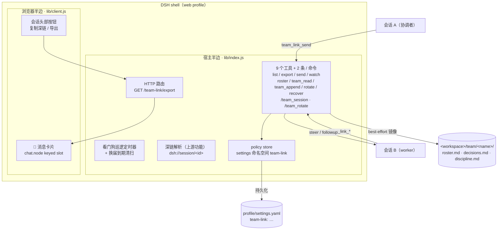
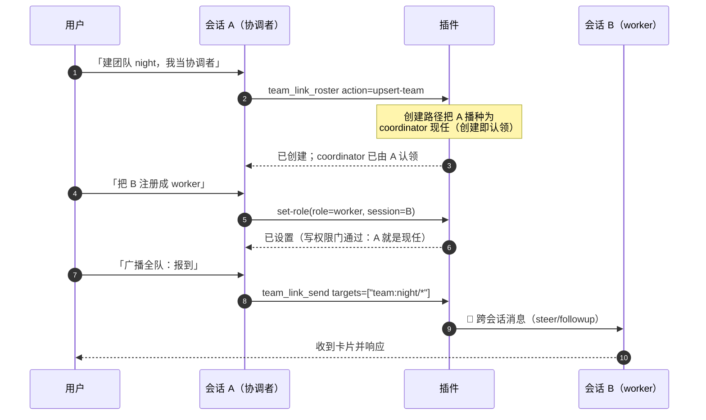
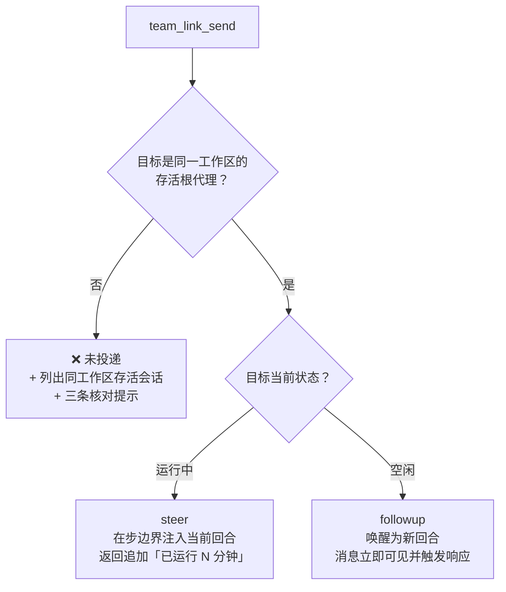
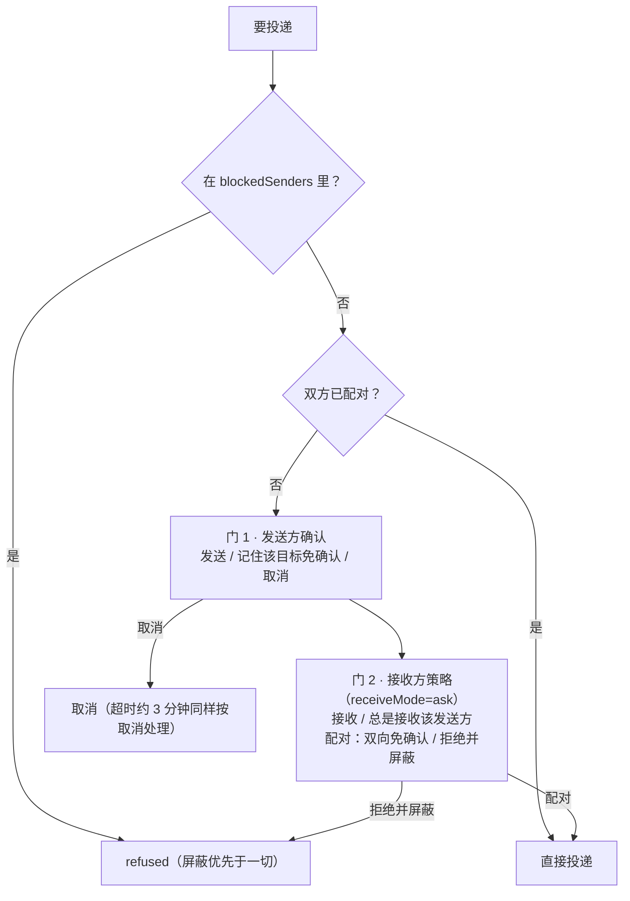
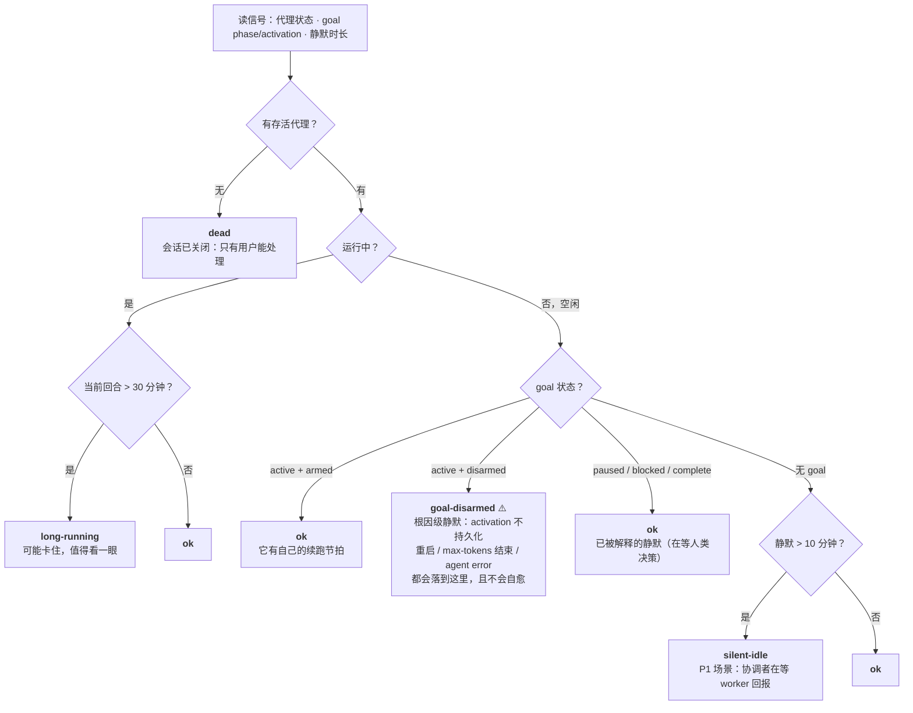
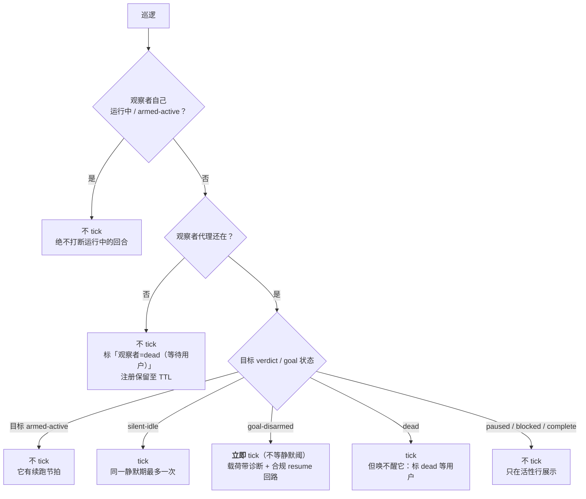
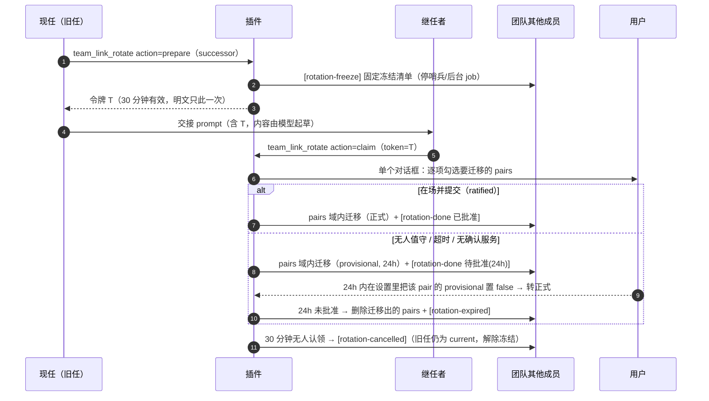
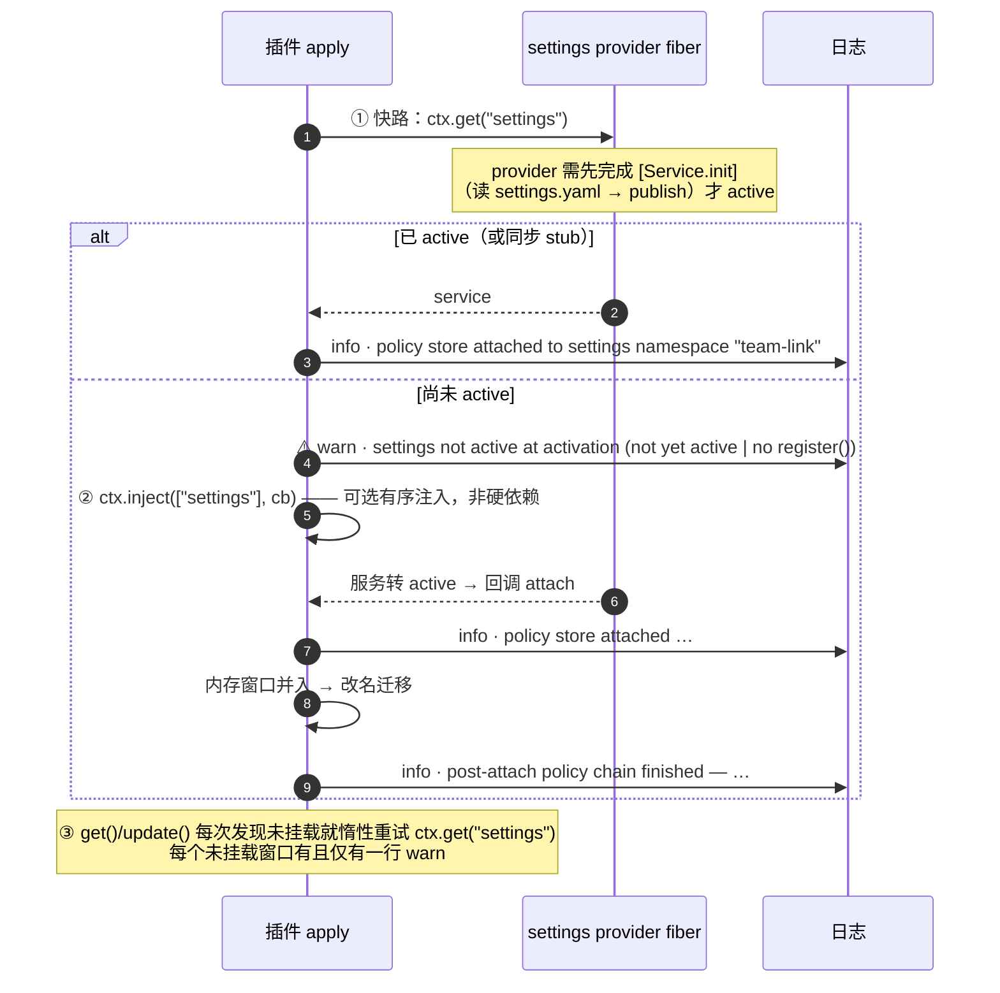

# dsh-team-link

> **DeepSeek Harness (DSH) 的「多会话协作」插件** —— 让同一个 DSH 实例里并行干活的多个会话**互相看得见、说得上话、交接得了班**。
>
> 原名 `dsh-session-link-pro`（0.2.4 及之前），**GitHub 仓库已于 2026-09-18 改名为 `dsh-team-link`**（旧地址由 GitHub 自动重定向）。历史会话日志里的旧工具名 `session_link_pro_*` 与消息 id 前缀 `slp-` 保持原样——它们是取证链，不做回写。

[](#十测试)
[](CHANGELOG.md)
[](#license)

Fork 自 [PwnKY/dsh-session-link](https://github.com/PwnKY/dsh-session-link)——深链复制、`/s/<id>` 打开器与深链上下文注入保留自上游；本仓库在其上长出了完整的多会话协作层。

---

## 目录

- [这是什么：三个痛点](#这是什么三个痛点)
- [架构](#架构)
- [快速开始](#快速开始)
- [工具一览](#工具一览)
- [一、跨会话消息](#一跨会话消息)
- [二、会话可视：列表 / 深链 / 导出](#二会话可视列表--深链--导出)
- [三、跨会话看门狗](#三跨会话看门狗)
- [四、团队：roster 与黑板](#四团队roster-与黑板)
- [五、团队换届 rotation](#五团队换届-rotation)
- [六、策略配置](#六策略配置)
- [七、服务获取与留痕（0.3.7 的关键修复）](#七服务获取与留痕037-的关键修复)
- [八、兼容性与字符串安全](#八兼容性与字符串安全)
- [九、安装](#九安装)
- [十、测试](#十测试)
- [设计文档索引](#设计文档索引)
- [Changelog](#changelog)
- [Credits](#credits) · [License](#license)

---

## 这是什么：三个痛点

在一个 DSH 实例里开多个会话干活（一个协调者 + 若干 worker）时，会话之间默认是**隔离**的：

| 痛点 | 表现 |
|---|---|
| **看不见** | 不知道别的会话在干嘛：跑着还是卡了？在等人还是已经静默十几分钟？ |
| **说不上话** | 没法把 A 会话的结论交给 B 会话继续；想归档一个会话只能翻 UI |
| **交不了班** | 会话上下文会疲劳，但把协调者换成另一个会话，意味着信任关系、团队身份全要人工重来 |

本插件补上这三层能力：

| 能力 | 说明 | 入口 |
| --- | --- | --- |
| 🔗 会话深链 | 复制 `dsh://session/<id>`，粘贴到任意会话即注入该会话只读快照（上游功能） | 会话头部按钮 / 粘贴链接 |
| 📋 会话列表 | 列出同工作区其他会话：主题、运行状态、最近消息摘要，以及**活性信号行**（verdict 五态 + goal 状态 + 静默时长 + 读数时效戳） | `team_link_list_sessions` |
| ⬇ 会话导出 | 全量事件导出为 markdown（可读）+ JSON（无损） | `team_link_export` / 会话头部 ⬇ 按钮 |
| 📨 跨会话消息 | 投递给另一会话，空闲目标自动唤醒为新回合；返回带 **busy 预判**；目标没活动代理时以 **`❌ 未投递`** 开头并列出同工作区存活会话 | `team_link_send` |
| 📣 广播 fan-out | 一次投多个目标：会话 id / `team:<name>/<role>` / `team:<name>/*`（全队，仅现任协调者）；**任一目标未投递则返回首行即 `❌ N 个目标未投递`** | `team_link_send` 的 `targets` |
| 🏷 信封 banner | 可选 `meta`（type / pri / ref）渲染进投递 banner 首行，审计一眼看清消息性质 | `team_link_send` 的 `meta` |
| 🔁 配对通道 | 双方各批准一次后，两个会话互发免确认 | 接收确认时选「配对」 |
| 🐕 跨会话看门狗 | 盯住别的会话：它失联而我空闲时，插件向我自己的会话投一条 tick | `team_link_watch` |
| 🎭 团队 roster | 团队 → 角色 → 会话的身份注册表，含**版本史**（退役≠删除）与写入策略 | `team_link_roster` |
| 📋 团队黑板 | `decisions.md`（只追加裁决账本）+ `discipline.md`（整文件替换，乐观锁） | `team_link_team_read` / `team_link_team_append` |
| 🔄 团队换届 | 两阶段交接：一次性令牌 + 域限定信任迁移 + 退役者对称吊销 + 24h 可回退 | `team_link_rotate` |
| 🚑 团队恢复 | 现任「有席位但无活代理」时的窄恢复路径：**恰两个封闭动词**（revive / reappoint），人在环 fail-closed（§11.9.4） | `team_link_recover` |

### 一条设计红线：绝不把「没投出去」说成「已发送」

这个插件里所有对外文案都遵循同一条纪律——**拒绝要刺眼、降级要留痕、不确定要如实标注**。三条具体体现（都是生产事故换来的）：

- 目标没有活动代理 → 首前缀是 **`❌ 未投递`**，并列出同工作区其他存活会话（有人真把「1 投递 / 2 拒绝」读成「已广播」）；
- 广播只要有一个目标没到 → **首行**就是 `❌ N 个目标未投递（M 个已投递）`，逐目标明细排在后面；
- 服务取不到时**必须留一行 warn**，绝不静默降级（见[第七节](#七服务获取与留痕037-的关键修复)——0.3.7 修的就是一次「静默降级了整整一天没人发现」）。

---

## 架构

插件是标准的 DSH **bundle 插件**，分宿主半边与浏览器半边：



要点：

- **宿主半边**拥有全部工具、`/team-link/export` 下载路由、看门狗巡逻定时器与换届到期清扫；所有模型可见输出都过 `wellFormed()`（字符串安全，见第八节）。
- **浏览器半边**只做两件事：把跨会话消息渲染成醒目卡片（影子替换 chat 包默认的灰字行，非本插件消息委托回原渲染器），以及会话头部的「复制深链 / 导出」按钮。
- **状态的事实源是 settings**（命名空间 `team-link`）；`<workspace>/team/<name>/*` 只是**人可读镜像**，写入失败只告警、不回滚设置（settings 始终是事实源）。
- 团队身份与信任关系（pairs）分开存：roster 管「谁是谁」，pairs 管「谁能免确认发给谁」——换届时两者都要动，但动作路径不同（见第五节）。

---

## 快速开始

**场景**：一个协调者会话 + 一个 worker 会话，同一个工作区目录。



**四步上手**：

1. **开两个会话**（同一个工作区目录）。协调者用强模型，worker 用 `flash` 即可；worker 的开场白一句话：「你是 worker，等主管派活」。
2. **建团队**（在协调者里说）：「创建团队 `night`，我当协调者，把 B 注册为 worker」。创建即认领，**不需要手改任何配置**。
3. **建信任通道**（可选，但推荐）：让 A 给 B 发一条消息 → 接收侧确认框里选「**配对：双向免确认**」→ 此后 A↔B 互发免确认。
4. **派活与记账**：「广播全队：……」/「这条记入裁决账本」/「更新纪律条款」。

**常用话术速查**：

| 想做什么 | 对模型说 | 背后工具 |
| --- | --- | --- |
| 看团队与活性 | 「现在团队状态如何 / 列一下其他会话」 | `team_link_list_sessions` |
| 广播 | 「广播全队：<内容>」（仅现任协调者） | `send` + `targets=["team:<n>/*"]` |
| 点对点 | 「发给 worker1：<内容>」 | `send` + `targets=["team:<n>/worker1"]` |
| 按优先级/性质发 | 「以 P0 裁决回复 W1，引用我上条消息」 | `send` 的 `meta` 信封 |
| 记账 | 「这条记入裁决账本」 | `team_link_team_append`（`decisions`） |
| 改纪律 | 「更新纪律条款」 | `team_link_team_append`（`discipline`，带 baseHash） |
| 盯人 | 「盯住 W1/W2，静默 15 分钟叫我」 | `team_link_watch` |
| 交班 | 「我下岗，让 session-X 接任」 | `team_link_rotate`（两阶段） |
| 归档 | 「导出这个会话」 | `team_link_export` / 头部 ⬇ |

---

## 工具一览

| 工具 | 一句话 |
| --- | --- |
| `team_link_list_sessions` | 同工作区其他会话 + 活性信号行（verdict 五态 / goal / 静默时长 / 读数时效戳） |
| `team_link_export` | 任意会话全量导出 md + JSON |
| `team_link_send` | 跨会话投递（单目标或 `targets` 广播 ≤8）；`meta` 信封；返回带 busy 预判；**发送方自己那一行渲染成卡片**（§10.1 A/D） |
| `team_link_watch` | 给自己注册跨会话看门狗（register / list / clear） |
| `team_link_roster` | 团队身份注册表（get / upsert-team / set-role / retire） |
| `team_link_team_read` | 一次读齐 roster + decisions 末 20 条 + discipline 全文 + 两个 baseHash |
| `team_link_team_append` | 写黑板：`decisions` 只追加 / `discipline` 整文件替换（乐观锁） |
| `team_link_rotate` | 两阶段换届（prepare / claim），一次性令牌 + 域限定迁移；`successor:"auto"` = 插件自建继任者 + 写交接文档 + followup 投递（§11.2） |
| `team_link_recover` | 角色恢复（**恰两个封闭动词**）：`revive`（复活当前现任那个会话本身，仅插件自建会话，身份/信任零改动）／`reappoint`（人改任 = 人类对话授权的 prepare，候选由插件从本队活成员算出）。attended-only：无确认服务即 fail-closed，刻意没有无人值守变体（§11.9.4） |

> `team_link_export` 走 `sessionQuery` 读会话；`team_link_send` 走 `agents` 投递。两者都不需要目标会话正在被 UI 打开——但**目标必须有活动代理**（见第一节的 A4 诚实声明）。

---

## 一、跨会话消息

### 投递语义：steer 还是 followup



- 目标**运行中** → `steer`：在步边界注入其当前回合；
- 目标**空闲** → `followup`：唤醒目标会话，作为**新回合**处理（立即显示并触发 LLM 响应，不会静默排队）；
- 目标**没有活动代理** → 拒绝，且拒绝文案**自带自愈线索**：

  - 首前缀 **`❌ 未投递`**（不许被读成「已发送」）；
  - 保留原句「目标会话 `<id>` 没有活动代理」；
  - **新增同工作区存活会话列表**：每行 `id（运行中/空闲）`，上限 10 个，超出时注明「共 N 个，仅列前 10 个」；
  - **新增核对提示**：对照 id（最常见成因是转录错位）/ 刚重启 DSH 时在侧边栏打开目标会话一次使其恢复为活动代理 / 先调 `team_link_list_sessions`。

  该列表是**纯 agent 注册表读取**（`ctx.agents.list()`，不读会话日志、零 surface 读取、无性能代价），只列**根代理**、同 `cwd`、且非发起者自身——子代理不会被列为可投递目标。执行上下文没有会话身份时（插件内部通知路径）只知道「非自身」，此时跳过 cwd 过滤、列出力所能及的全部存活会话；无匹配时输出「当前工作区无其他存活会话。」

### 消息形状：为什么 `source` 必须恰好三个成员

投递的消息 `source = { kind: "agent-message", form: "relay", senderSessionId }`——**恰好这三个成员**。这不是风格选择：DSH 0.1.5 的会话日志迁移会逐条校验 `source`，白名单外的 `kind` 或成员多一个少一个，会让**整份会话日志**拒绝迁移（表现为「这个对话打不开」）。详见[第八节](#八兼容性与字符串安全)。

发送方、时间、插件名都写在**正文 banner** 里：

```
📨 [跨会话消息 · 来自会话「X」(session-x) · 2026-09-17 23:42:05 · type=ruling pri=P0 ref=slp-a1b2]
```

接收方模型可直接看到，并可用同一工具回发。消息 id 固定为 `slp-<uuid>`，UI 卡片靠它把自己的中继与上游相邻代理消息区分开。

**「三成员」有三个构造点，不是一个**（差异审计修复轮 🔵-3 的措辞修正）：本插件对 `{kind, form, senderSessionId}` 这个形状有 **3 处**字面构造——`relayUserMessage`（本插件**驱动**的那些中继：§10.2.3 启动任务、§11.4.5 交接投递、§11.2 命令指令共用的一处构造）、看门狗 tick（`tickMessage`，消息 id 前缀 `slp-wd-`、发送方是观察者自身）与 §3.4 的 `team_link_send` 投递（正文是信封 banner）。**三处都恰三成员**；`relayUserMessage` 的注释原先概括成「全模块唯一构造器」，那句**只对「本插件驱动的中继」成立**，对全模块不成立（已在注释里改成带范围的表述）。改这个形状要**三处一起改**——任何地方冒出第四处字面构造才是缺陷。

### 两道批准门与配对



- 接收方选「**配对**」→ 写入 `pairs: [{a, b, createdAt}]`，此后两会话**双向免确认**；
- 选「**拒绝并屏蔽**」→ 写入 `blockedSenders` 并**自动解除配对**——屏蔽始终优先于配对；
- 超时（约 3 分钟）按取消处理；确认服务不可用时**逐目标 fail-closed**（宁可不发，不默认放行）。

### 广播 fan-out（`targets`）

`targets` 与 `targetSessionId` **互斥**：两者都给是参数错误，都不给也是参数错误（单目标语义不变）。

| `targets` 项 | 解析 | 谁能用 |
| --- | --- | --- |
| `session-xxx` | 直达该会话（最高优先级） | 任何会话 |
| `team:<name>/<role>` | 该角色的现任会话 | 任何会话；角色空缺/不存在 → **`no-holder` 结果**（不算投递也不算失败） |
| `team:<name>/*` | 全队：该团队全部**在任且存活**的角色（不含发起者） | **仅该团队现任协调者**，否则整次调用拒绝 |

`team:<name>/*` 之所以收得这么紧：协调者的价值部分在于**策展每个 worker 看到什么**，而 flash worker 最稀缺的资源是上下文——全连通群播会让 worker 的上下文互相污染。

- 单次最多 **8** 个目标，超出即拒绝；团队不在 roster 或表达式形状非法 → **整次调用拒绝**（不做「半发」）；
- fan-out **不放宽任何门**：每个目标照走完整单目标路径（屏蔽检查 → 配对快路径 → 发送方确认 → 接收方策略 → steer/followup）。N 个未配对目标就是 N 次批准；
- 返回逐目标结果行：

  ```
  - session-b（via team:night/worker1） → delivered：已投递（目标已空闲，唤醒为新回合）
  - session-c（via team:night/worker2） → refused：接收方拒绝
  汇总：1 投递 / 1 拒绝 / 1 个重复目标已去重。
  ```

- **失败领先**：只要有一个目标不是 `delivered`，**第一行**就是 `❌ N 个目标未投递（M 个已投递）`（N 含 refused / no-agent / no-holder，用词是「未投递」而非「失败」，故与汇总里 no-holder 的独立桶不矛盾），其后才是 `广播 fan-out：…` 头行、逐目标行与汇总。**全部成功时文案形状一字不变**；
- 重复的会话 id（含不同表达式解析到同一会话）**去重后只投一次**，去重个数写在汇总里。

### 信封 banner（`meta`）

可选 `meta: { type?: 'ruling'|'receipt'|'report'|'ask', pri?: 'P0'|'P1'|'P2', ref?: string }` 渲染进 banner **首行**的紧凑字段，只出现调用方给的键：

```
📨 [跨会话消息 · 来自会话「X」(session-x) · 2026-09-17 23:42:05 · type=ruling pri=P0 ref=slp-a1b2]
```

- `ref` 超过 **16 字符**按**码点**截断（不会切半 emoji），并在返回文案里注明截断前后；
- 枚举外的 `type`/`pri`、未定义字段、非对象 `meta`、空 `ref`、含换行的 `ref` → **明确参数错误、整次调用拒绝**（不静默丢弃、不部分采用）；
- fan-out 时所有目标共享同一 `meta`；
- **`source` 仍是恰好三成员**：信封只走正文 banner，不扩 source、不做 sidecar 索引。

### busy 预判

投递成功的返回文案附带目标忙碌状态（fan-out 逐目标独立）：

- 目标**运行中** → 追加 `目标回合已运行 N 分钟（steer 注入当前回合）；需新回合语义请等其空闲`。`N` 取自活性行的「回合始于」，读不到该时间戳时只给 steer 语义、不给分钟数；
- 目标**空闲** → 保持原文案（已唤醒为新回合）。
- **发送方卡片上是同一读数的徽标形态**（不是上面那句机制文案）：`忙碌 · 已运行 N 分钟`，读不到回合起点时只说 `忙碌中`——见「发送方卡片」一节的「A 面逐目标行的措辞」。

### 消息卡片（浏览器侧）

接收方 UI 把跨会话消息渲染为醒目的 📡 卡片（📡 标题行 + 高亮左边条 + 发送会话 + 时间）：通过 `conversation.chat.node` keyed slot 以 `priority: -100` **影子替换** chat 包默认的折叠灰字行；非本插件消息（其他插件的 context 注入）经 `slots.entries()` 委托回原渲染器，显示不受影响。

判定条件不是「kind/form 命中」而是**本插件自己的消息**：`agent-message + relay` 正是上游相邻代理消息（`send_message`）用的形状，只按 kind/form 判断会把它们也渲染成卡片。因此卡片还要求命中本插件自己的特征之一——消息 id（在 chat node 上是 `node.id`，context 的 `data` 里没有 id）以 `slp-` 开头，或正文以 `📨 [跨会话消息` 开头；历史日志里的旧 `kind: "team-link"` 继续识别。卡片时间优先取旧日志的 `sentAt`，其次取 context node 自带的事件时间 `data.time`，最后才从正文 banner 里解析。

### 发送方卡片（`team_link_send` 自己那一行）

上面那张卡覆盖的是**接收方**；发送方过去只看到工具树里一行灰字。现在发送方也有卡，两条腿都在客户端：

**每一块信息只准出现一次**（§10.1.5 硬性条文，差异审计 F1 后写死）：两张卡的可见文本取**并集**后，任一语句**恰好出现一次**。判据由 `client-half.test.mjs` 的 F1 三条断言把守——把任意一块搬回另一面，它们当场变红。

| 腿 | 位置 | 槽位 | 承载（且只承载这些） |
| --- | --- | --- | --- |
| **A** | 工具调用**原地**（审计记录不动） | `tool.call.toolview`，key = **线上工具名 `team_link_send`**（逐字；typo 会静默回退通用工具行、不报错） | **极简标签**（`✦ 工具调用 · team_link_send · N 个目标`）+ **逐目标行**：每行「目标（`expr` 或短 id）+ **outcome 的一句人话短语**（从结构化字段渲染，见下「A 面逐目标行的措辞」）」，运行中的目标带 busy 徽标。**不渲染**标题/时间/正文/汇总，**也不渲染 `target.detail`**（那句是模型可见的报告句） |
| **D** | 会话流**顶层** | 本插件自己的 `uiConversation` definition（kind `team-link-send`）+ 同 kind 的 `conversation.chat.node`（`priority: -90`） | 标题 + 发送方/时间 + **正文** + **汇总计数**。**不渲染逐目标明细行**（目标身份归 A 的行）。与接收方的 `key: "context"` 卡片**kind 不同**，并存不冲突 |

**A 面逐目标行的措辞（2026-09-20 用户决定；设计 §10.1.5 修订 + §12.5）**：A 的每一行**不再原样搬运 `target.detail`**——那句是**模型可见的报告句**，带「已投递到 …」「目标处于空闲」「steer 注入当前回合」这类**投递机制**，对人看的卡片偏机制而非结论，且一个目标就占 2–3 行。改为**从结构化字段渲染一句人话**：

- `target.outcome` → 一句**固定短语**（客户端 `OUTCOME_PHRASES` 映射到 zh/en 两套 locale 键，**不是硬编码**）：`delivered` → 「已送达」、`refused` → 「未送达——接收方拒绝」、`no-agent` → 「未送达——目标会话没有活动代理」、`no-holder` → 「未送达——该角色当前空缺」；
- `target.busy` → **徽标**：「忙碌 · 已运行 N 分钟」（读不到回合起点时只说「忙碌中」，不编数字）；
- 目标身份 → `expr` 或**短 id**（不变）。

于是**一行 = 目标 + 一句结论 +（忙碌时）徽标**，长报告句（含机制、含 `busy` 的 steer 文案）继续留给**模型可见的文本**。**这不违反「一处事实」**：报告句与卡片短语是**同一批结构化字段的两种渲染**（`outcome` / `busy` / 身份），`target.detail` 仍**留在回执里**（模型可见文本的事实源 + 纯文本降级路径的兜底），只是不再是 A 的渲染输入。

| 实测对照（同一次投递，`team:night-shift/*` 广播；「改前」句取自 `client-half.test.mjs` 的旧期望值 fixture——那行 **80 字符**、卡片按 `pre-wrap` 折成 2–3 行，「改后」行 44 字符） | 文本 |
| --- | --- |
| **改前** A 面逐目标行 | `session-worker-a（via team:night-shift/*） 已投递 已投递到 session-worker-a：目标空闲，已唤醒目标会话。` |
| **改后** A 面逐目标行 | `session-worker-a（via team:night-shift/*） 已送达` |

**跨半边行为锁（取代 B1 的字符串等式）**：旧的「卡内行 == 报告首行」断言已**作废**（它钉的是一个已被设计替换的渲染，且同源化之后**由构造保证永不红**，§12.3 ⑤）。现在锁的是**行为**：宿主半边**能铸出的每个 `outcome` 枚举值都必须有客户端短语**——`host-half.test.mjs` 同时读 `lib/index.js` 与 `lib/client.js`，把宿主侧的字面量 token 集合与客户端 `OUTCOME_PHRASES` 的键**判等**；**新增一个枚举值而不给卡片短语 → 必红**（红相实测见「测试」一节的对应条目）。测试报告里会打印两侧的实测集合。

**数据来源是官方载体，不是解析返回文本**：宿主半边给 `team_link_send` 加了 `output.presentationMeta`，产出的结构化回执落在 `tool/result.meta` 里（durable——回放同一份日志会重建同一张卡）：

```
{ kind: "team-link-send", v: 1, at, senderSessionId,
  meta?: { type?, pri?, ref? },                 // 仅调用方给了信封才有
  message: { text, truncated, chars },          // chars = 原始码点数
  targets: [{ expr?, sessionId | null, outcome, detail, busy? }],
  targetsTruncated?: { shown, total },          // 仅 targets 真被裁到 24 行才有
  summary: { delivered, refused, noAgent, noHolder, deduped }, fanout }
```

- **体积纪律（两处上限，各自如实标注）**：
  - **正文**：`message.text` 上限 **2000 码点**，超出则取头 **1500** + 省略标记 **3 码点** + 尾 **400**（1903 码点，仍在限内）并置 `truncated: true`；`chars` 记**原始**码点数。裁剪与计数都按**码点**；
  - **逐目标行**：**宿主侧（权威）** `targets` 封顶 **24 行**（`SEND_CARD_ROW_LIMIT`，= §10.2.4 的每队成员上限，全队广播仍可整份渲染）。界是**行数**不是**表达式数**：输入侧 `resolveTargetList` 裁的是表达式（≤8），而**一个** `team:<name>/*` 就展开成该队全部在册存活成员，所以合法的行数可以超过 8——**持久化的卡必须有界**，`tool/result.meta` 里被烙进日志的正是卡的 `targets`。超出时卡内**显式标注** `targetsTruncated: { shown: 24, total }`（`shown` = 裁完实际呈现的行数——客户端 `sendRowsTruncated`「已截断——仅显示前 {shown} 行」的口径同样是**实际画出的行数**，良构宿主卡上两者同值；`total` 是这次投递真实的行数），而 **`summary` 计数仍覆盖全量**、**文本报告仍逐目标完整**——卡是**有界呈现**，报告是**全量档案**；
  - **客户端（防御 + 如实呈现；2026-09-19 收尾轮补齐跨轮读路径）**：A 面渲染期另设同值上限，因为 `meta` 核心不透明且**持久化**，手改日志或异构实现可塞进任意条数。**这条判据对宿主自产的卡永远不触发**（宿主已先裁到 24，行数恰好落在界上），所以 A 面**同时读宿主自己的 `targetsTruncated` 标注**：只要卡上有该标注，**或**行数确实超过本地上限，A 面就渲染 `sendRowsTruncated`「已截断——仅显示前 {shown} 行」——两类超限都在界面上看得出来。两处数字各有各的口径：`{shown}` 是**实际画出的行数**（不是标注里写的数字——手改的 `shown` 不得在那个句子里安一个假数字），标签的「N 个目标」取**真值**——有标注时是 `targetsTruncated.total`（30），无标注时是该卡自己的行数（外来卡的 30 行就是真值；而只画出的那 24 行**不得**当真值）。标注本身与其它 `meta` 字段同等不信任：形状不认（`shown` / `total` 非有限数）即**丢弃**并退回「按行数判超限」的防御路径，卡照常渲染。**无标注且 ≤24 行**的卡可见文本与加这条读路径之前**逐字一致**（不增删任何文本）；
- **良构（差异审计 F2 修正）**：**卡内的每一个字符串成员**——`message.text`、逐目标的 `sessionId` / `expr` / `detail`、`senderSessionId`、信封的 `ref`——都在制卡时过一遍孤立代理项修复。卡**不走** `textOutput.render`，模型可见出口盖不住它，所以这条线必须逐个字段自己守住；回归锁在同一声明的三条断言上（污染 `sessionId` / `expr` / `meta.ref` 后 `JSON.stringify(card)` 无孤立代理项）；
- **降级**：拿不到回执时（调用仍在飞、旧日志没有 `meta`、`meta` 形状不认识、其他工具的 meta）一律回退**纯文本行**（显示模型可见的返回文案）；整次调用在**走到逐目标投递之前**就被拒（寻址互斥 / 无地址 / `meta` 非法 / 执行上下文没有可交互的活动代理）时**不产出卡**，客户端回退文本——绝不为没发生的投递编造回执。注意区分：**目标**无活动代理（`outcome: "no-agent"`）发生在投递阶段内，**照常出卡**，那一行就是那条 `❌ 未投递` 拒绝；
- **零日志改动**：A/D 都只**读**既有的 `tool/call` + `tool/result` 事件，**不新增任何日志事件类型**（§10.3 红线）；投递消息的 `source` 仍恰三成员；模型上下文无新增消息。

**已知边界（如实声明）**：`presentationMeta` 只对**顶层**工具调用投影（`exec.parent === undefined`），所以从 `run_code` 程序里发出的 `team_link_send` 没有卡，那一行显示纯文本；D 的顶层节点在 chat 包把「回合过程」折叠起来时可能随之被折进去（`tool-call` 节点本身也是这个待遇）——`tool/call` 滚出历史窗口、只剩 `tool/result` 时按 `context.matches` 回退重建，卡片不会在长会话里凭空消失。**客户端半边对 `uiConversation` 不是硬依赖**（审计 F3）：模块级 `inject` 只有 `slots`/`sessions`/`locale`，definition 走 `ctx.inject(["uiConversation"], …)` 动态注册，因此缺该服务的老壳**只丢 D 的顶层卡**——接收方卡片、工具行、复制/导出按钮、深链打开器全部照常；**四条槽位注册（header 按钮条 + 三条 §10.1）各自加护栏**（审计 B3；第四条为 round-1 🔵 #3 补齐），任一条被槽位拒绝也只丢那一行。

### 诚实声明（A4）

跨会话投递只能送达**有活动代理**的会话：目标已关闭、或刚重启 DSH 后尚未在侧边栏打开过，都没有任何机制能唤醒它。插件能做的只有**如实告知 + 给出恢复动作**，而不是假装发送成功。

---

## 二、会话可视：列表 / 深链 / 导出

### `team_link_list_sessions` 的活性信号

每个会话行带一条活性信号（读一次 surface + 一次 agent 查询，**纯服务调用，不解析日志**）。

**读取是有窗口的**：只有列表前 **12** 个会话（`PREVIEW_SESSIONS`，与主题/最近摘要同一个窗口）会被读 surface，且这 12 次读取**并行**发出。第 13 行及以后照旧列出（id / 运行状态 / 创建时间 / 读数时效戳——全是零日志成本的面），但活性行降级为 `活性：未读（超出快照窗口 12）……`：verdict / 静默时长 / goal / 主题 / 最近动态一律标为未判定。

> **为什么要有界**：一行 surface = 一次冷日志解压 + 一次表面投影。真实工作区实测（26 个会话）逐个串行读满 `LIST_LIMIT`（50）会直接超掉 60s 工具预算——0.3.5 修的就是这个（修前超时、修后约 15s）。这里选择**有界 + 并行 + 如实标注**，而不是编一个没读过的判定。

窗口内的字段：

| 字段 | 含义 |
| --- | --- |
| `verdict` | 五态判定（见下） |
| `代理` | `运行中` / `空闲` / `未运行`（读 agent 注册表） |
| `goal` | `<phase>/<activation>(<已用轮次>/<上限>)`；blocked 另带 ` blocked=<code>: <message>`；`none` = 当前无 goal；**`?` = goals 服务缺失**（降级运行，插件功能不受影响） |
| `静默` | `now - max(末条 assistant, 末条入站)`（分钟）；两侧时间戳都读不到时显示 `?` |
| 回合始于 / 末条助手 / 末条入站 | 绝对时间戳（本地时区） |

**verdict 五态**（阈值：静默 10 分钟、回合 30 分钟；`team_link_watch` 的 `silentMinutes` 只影响巡逻判定）：



`goal-disarmed` 是这个插件最想让你看见的状态：它看起来「空闲」，其实是**根因级静默**——goal 还是 durable-active，但驱动器不会再排队，除非人类（经模型转告后）显式 resume。插件**绝不代调** `goals.resume`（那是人类授权门），只负责把状态摆出来、并给出合规的恢复回路。

**读数带时间戳**：每行行尾是 `（读数 YYYY-MM-DD HH:mm:ss，>2min 作废）`——活性是快照，超过 2 分钟须重新读。

### 深链（上游功能）

复制 `dsh://session/<id>`，粘贴到任意会话即注入该会话的**只读快照**作为上下文。这是上游 `dsh-session-link` 的能力，本仓库保留其解析行为不变（`register-protocol.ps1` / `dsh-open.cmd` 负责协议注册与打开）。

### `team_link_export`

任意会话全量导出：markdown（人可读，含信封首行）+ JSON（无损事件流）。同一个导出能力也挂在 `GET /team-link/export?session=<id>&format=md|json`（会话头部 ⬇ 按钮消费），路由与工具**共用同一个文件名安全不变式**（`fileSafeSessionId()`）。

---

## 三、跨会话看门狗

看门狗解决的是「我（协调者）在等 worker，但没人叫醒我」——它反过来：**盯住别人，别人失联且我空闲时叫醒我自己**。

### tick 策略



| 目标 goal 状态 | tick？ | 理由 |
| --- | --- | --- |
| `armed` + `active` | 永不 | 它有自己的续跑节拍，tick 只稀释节奏 |
| `active` + `disarmed` | **立即**（不等静默阈） | 根因级静默态；载荷带诊断与合规恢复回路（转告用户 → 用户授权 → 模型自己 `update_goal(action:"resume")`） |
| `paused` / `blocked` / `complete` | 不 tick | 在等人类决策 / 已完结 |
| 无 goal | 静默超阈才 tick | P1 场景 |

观察者侧：自己**运行中**或自身 **armed-active** 时不 tick；自己代理不存在时不 tick、不改注册（该会话在活性行里本来就是 `代理=未运行`，`watch list` 另标「观察者=dead」，注册保留到 TTL 到期自清——代理回来了就自然恢复投递）。

### 限制与实现约定

- `register` **只能给自己注册**（观察者 = `exec.agent.id`），且 `targets` 不能含自己（自指等于变相的自 tick 定时器）；
- 单会话最多 **3** 个注册；`silentMinutes >= 10`（默认 10）；`intervalMinutes >= 5`（默认 5）；`ttlHours <= 24`（默认 12，到点自动清理）；`clear` 幂等且只能清自己的；
- **source 三成员不变**：`{ kind: "agent-message", form: "relay", senderSessionId: <观察者自身> }`；消息 id 前缀 `slp-wd-`；
- **正文是插件常量模板**，只有状态字段插值（目标 id / 读数时间 / 静默时长）——注册参数不进入正文，**注册无法给观察者的下一回合夹带提示词**；
- **去抖**：同一目标「同一静默期最多一次 tick」，两次 tick 之间至少隔一个巡逻间隔。去抖状态是**进程内 Map，不持久化**——重启即忘，宁可多一次 tick，也不留会误判的持久状态；
- 巡逻定时器随插件 dispose 一起清理（`ctx.effect`）。

### 诚实声明（A4）

看门狗只能提醒**活着**的观察者。观察者或目标任一方已关闭时，没有任何机制能唤醒它——插件只在信号面标 `dead` 等用户处理。「活会话节奏维持」是真实覆盖面，「失联恢复」不是。

---

## 四、团队：roster 与黑板

### roster（`team_link_roster`）

`teams` 键是身份层的事实源：团队 → 角色 → 会话，带版本史。

```yaml
teams:
  - name: night-shift                # [a-z0-9-]+，工作区内唯一（也是黑板目录名）
    createdAt: 1700000000000
    workspace: D:/work/night         # 首次创建团队时从该会话的 agentCwd 捕获，之后不再改写
    policy: { writer: coordinator }  # coordinator | any
    roles:
      - role: coordinator            # 约定角色名；自定义角色（reviewer 等）由 set-role 按需创建
        current: session-abc         # 现任；null = 空缺
        pending: null                # M4 rotation 的继任槽位，M2 只原样保留
        history:                     # 版本史：一段任期一条，until: null 表示仍在任
          - { session: session-old, from: 1700000000000, until: 1700009999999, note: 交班 }
```

| action | 效果 | 写权限 |
| --- | --- | --- |
| `get` | 全体团队概要；指定 `team` 时给出详情（含 pending 与整段版本史） | 任何会话可读，无门 |
| `upsert-team` | 创建（默认 `policy.writer=coordinator`、workspace 取调用会话的 `agentCwd`，并把**调用会话播种为该团队 coordinator 现任**——**创建即认领**）或幂等更新 | 已存在的团队过写权限门；重复调用**不重置 roles / 版本史 / createdAt**，也不会再播种一次 |
| `set-role` | `current` 替换 + 版本史追加：旧任那条记 `until=now`（带 note），新任那条以 `until: null` 打开；角色不存在则本次指定即创建。指定的会话**正是某个在飞换届 pending 的继任者**时，该令牌当场作废（身份已由本次显式变更，claim 会报「没有 pending」） | 过写权限门；**不迁移 pairs**——信任迁移是 rotation 的专属动作 |
| `retire` | `current` 置空（vacant）+ 版本史记退役（`until=now`，带 note）。退役本身不动信任数据，随后弹**一个**确认对话框列出所有仍指向该会话的 `pairs` / `trustedSenders` / `rememberTargets`，选「清理」才删除 | **仅现任协调者会话**或用户发起（与 `policy.writer` 无关） |

#### 写权限与「创建即认领」

- `coordinator`（默认）：只有 `coordinator` 角色的**现任**会话可写（比对 `exec.agent.id`）；
- `any`：任何会话可写；
- 读永远开放；`policy` 本身只有用户能改（工具参数里没有 policy 槽位）。

**0.3.7 修掉的一个死锁**：`upsert-team` 的创建路径本来就不该过写权限门（否则没人能建第一个团队），但 `set-role` **必然**过门——而门在「`writer=coordinator` 且现任空缺」时拒绝一切会话路径。于是旧版本会出现：**模型能建出团队，却永远写不进首任协调者**，团队到手即只读。现在创建路径把调用会话直接播种为 coordinator 现任，**团队建完即可派活/写黑板**，不需要手改任何配置。手写出来的空缺行仍然全拒（那是用户显式表达的状态）。

### 自助引导（手写设置）

正常流程**不需要**这一步。手改 `settings.yaml` 只在两种场合需要：① 把某个**已存在**团队的现任换成别的会话，或把被手写成空缺的团队救回来（此时写权限门会拦下一切会话路径，工具走不通）；② 用户不在模型回路里时预先铺设团队。

直接编辑 profile 的 `settings.yaml`，在 `team-link:` 段下写入（键名与[第六节](#六策略配置)一致）：

```yaml
team-link:
  teams:
    - name: night-shift
      createdAt: 1700000000000
      workspace: D:/work/night
      policy: { writer: coordinator }
      roles:
        - role: coordinator
          current: session-abc         # 现任会话 id；null = 空缺（会话路径会全拒）
          pending: null
          history:
            - { session: session-abc, from: 1700000000000, until: null }
```

- **保存即生效**：`dsh-settings-file` 的 watcher 会热加载（2026-09-18 实测：外部删除 `team-link:` 段后，`team_link_roster action=get` 立刻回到 0 团队）；若个别环境不触发，**重启 DSH** 即可确定性地重新加载；
- 只写 `current` 不写 `history` 也能生效（任期起点退回 `createdAt` 显示）；补一条 `until: null` 的任期记录才让版本史自洽；
- 名字不合 `[a-z0-9-]+` 的团队行、没有 `role` 的角色行会被**归一化丢弃**，不会让整个命名空间失效（其余行照旧生效）；
- 该命名空间只有在插件**成功注册**后才存在；`settings.yaml` 里的 `team-link:` 段在**第一次真正写入**后落盘——注册失败或迟迟未挂载会在日志里留痕，见[第七节](#七服务获取与留痕037-的关键修复)。

### 黑板（`team_link_team_read` / `team_link_team_append`）

以 `team.workspace` 为根：

```
<workspace>/team/<name>/roster.md       # roster 镜像（插件同一事务内 best-effort 写；失败只告警，settings 是事实源）
<workspace>/team/<name>/decisions.md    # 裁决账本：只追加，每行 `seq | ISO 时间 | author-session-id | 正文`
<workspace>/team/<name>/discipline.md   # 纪律条款：整文件替换，必须携带 team_read 返回的当前 baseHash
```

- `team_link_team_read(team)` 一次读齐：roster 概要 + `decisions` 末 **20** 条 + `discipline` 全文 + 两个文件的 `baseHash`（sha256 前 16 位十六进制）。文件不存在按空处理并如实标注（含「空内容哈希」）；
- `team_link_team_append(team, file, line, baseHash?)`：`decisions` 只追加（无需 baseHash，正文必须单行）；`discipline` 整文件替换（baseHash 缺失或不匹配即拒绝并要求重新 `team_read`）。两者都受**单行 500 字符**上限（按码点计）；`file` 是白名单枚举，任何路径形状都会被拒；
- 黑板**没有写权限门**（任何会话可写）：写入者身份记在 `decisions` 行的 author 字段里，透明可审计；`discipline` 的整文件替换靠 baseHash 串行化。

**实现约定**（设计未明说、按既有约定裁决的细节）：

- `workspace` 只在**团队首次由会话创建**时捕获，过后永不改写。用户手工建的行若 `workspace` 为空，第一次会话侧 `upsert-team` 会补记它（唯一一次例外，否则该团队的黑板永远没有根）；
- 版本史按**任期**记：一段任期一条，`until: null` 标在任；`set-role` / `retire` 关掉旧条目并写 note。首次指派（无旧任）把 note 记在它打开的那条上，避免 note 丢失；
- 镜像里时间戳统一 `YYYY-MM-DD HH:mm:ss`（本地）；`decisions` 行里的时间是 `toISOString()`（UTC 带毫秒），便于排序与外部消费；
- 没有会话身份的写入仍被接受（黑板无门），author 记 `unknown`——**不编造身份**；
- `decisions` 写入是**读-算 seq-追加**（`appendFile`，不重写正文）：并发追加最坏只是两条同 seq，不会丢行。

---

## 五、团队换届 rotation

团队换人不是「改个 current」：新任会自动继承一条**绕过两道批准门**的免确认通道（`pairs`，连接收方的显式 reject 策略都覆盖），所以交接被拆成两个阶段 + 一次性令牌 + 域限定迁移 + 可回退的临时信任。



### prepare（Phase A，只能由该角色的现任会话发起）

- **前置**：`exec.agent.id === roles[role].current`；用户路径是设置 UI，不是工具调用；
- **速率限制**：同一 team+role 在 **10 分钟**内已有 pending 或刚完成过一次换届 → 拒绝（防换届风暴）；
- **令牌**：`randomUUID()`，绑定三元组 `(team, role, successor)`，**30 分钟**有效、成功认领即作废；
- **快照**：把 prepare 时刻的 `pairs` / `trustedSenders` / `rememberTargets` / roster 全量写进 `rotationBackup`（对称撤销的还原依据）；
- **广播**：向团队全部在任成员投递 `[rotation-freeze]` 冻结清单（停哨兵/后台 job → 确认无在飞动作 → 状态冻结回报 → 等待交接结果通知）；
- **返回**：令牌明文（**唯一一次**）+ 掩码形式 + 交接指引（30 分钟有效、「交接内容由模型起草，机制与判断分离」、上任首动作建议 `/goal resume` 或建新 goal、错峰默认、以及 **`successor:"auto"` 的自建路径**——§3.6.4 的手工兜底始终保留，见下一节）。

### claim（Phase B，只能由 pending 指定的继任者会话凭令牌发起）

- **前置**：`exec.agent.id === pending.session`（且 pending 未过期）；令牌精确匹配且三元组一致；
- **一个对话框**（多选）：把全部「退役者↔同 team 成员」的候选 pairs 列成一个多选问题——勾选 = 迁移，不勾选 = 随退役清理（今后该对端走正常首问门）。对端在团队外的 pairs **不进候选**但会在 detail 里被点名（透明）。候选**为空**时不弹框：没有可批准的东西，落定后状态词记 `无待迁移对` 而不是「已批准」；
- **在场确认 = ratified**；超时（3 分钟）/ 无确认服务 / 对话框失败 = **无人值守路径**：全部域内候选以 `provisional` 迁移并开 **24h 回退窗口**；
- **迁移与撤销**：
  - 迁移 = 删除退役者的旧 pair，新建 `{a: 新任, b: 对端, provisional, expiresAt}`；
  - **对称撤销** = 退役者**持有**的 pairs（全部）、`trustedSenders` 中指向它的项、`rememberTargets` 中指向它的项，一并清除——退役会话可能还活着，不吊销就是永久保送；
- **落盘顺序**：迁移 + 落定（`current` / 版本史 / 迁移标记）在**同一笔写入**里完成，随后才清除 `pending`。因此「pending 还在」且「`current` 已是继任者」只可能意味着上次 claim 没收尾；**幂等判据是 `current === pending.session`**，而不是「迁移清单是否非空」（域内没有候选、或每个候选对端都与继任者本已配对时，本次迁移本就不新建任何记录）；
- **幂等**：同一令牌重放 → 返回既有迁移清单、不重复迁移、不重复改信任数据，只补做收尾（清 pending、补写 `roster.md` 镜像、重发一次 `rotation-done` 避免 worker 因崩溃卡在冻结里）；成功之后令牌作废；
- **广播** `[rotation-done]`：`已批准` / `待批准(24h)` / `无待迁移对`。第三个词用于域内没有任何候选 pair 的换届：既然没弹过确认框，就不能谎称「已批准」。落定时该状态词一并记进 `roles[].rotationStatus`，重放直接读记录值——它不由 `provisional` / 迁移清单重推（「对话框答了但一条都没勾」是 ratified 且无迁移、无回退窗口，正是重推会失真的窄边缘）。

### 未批准路径与到期清扫

| 对象 | 期限 | 到点行为 |
| --- | --- | --- |
| `pending`（令牌） | 30 分钟 | 清除 pending + 广播 `[rotation-cancelled]`：**旧任仍为 current**、令牌过期未认领、解除冻结。若 `current` 已是继任者（上次 claim 只差最后一步收尾），则**静默清除 pending、不广播**——换届其实已经发生，「旧任仍为 current」与事实相反 |
| `provisional` pairs | 24 小时 | 删除迁移出的 pairs + 版本史追加 `provisional 未批准过期` + 广播 `[rotation-expired]`：**新任保持 current**（换届事实已成立，降格要用户显式操作），信任回退为正常过门。若该窗口迁移出的 pair 都已在设置 UI 补批准为正式通道（或本次迁移本就没新建通道），则**窗口静默关闭**：不记版本史、不广播——没有回退发生，「迁移的 pairs 已删除」会是假话 |

清扫有两个触发面：**看门狗的同一个巡逻定时器**（定时器随注册存在——一个看门狗都没注册时它不跑），以及**惰性检查**（每次 `roster` 触碰 / `rotate` 调用 / `team_read` 读取都会先扫一遍）。换言之：**只要团队里还有人读黑板/动 roster/走换届，过期 pending 与过期窗口就不会漏**；三者都没人碰时，冻结状态要等下一次触碰才解除。

**投递侧另有独立守门**：`expiresAt` 一到，该 pair 立刻不再算配对（`pairRecordBetween` 视过期 provisional 记录为无 pair），投递当场退回正常双门——不必等清扫真的删掉那一行。**过期 pairs 的删除也不依赖角色记账**：doomed pairs 的计算与删除排在角色记账判据之前，所以即使用户在设置 UI 手删了 `roles[].provisional` 窗口（甚至整行角色/团队），过期通道照样会被清除。

**补批准**入口是设置 UI：24h 内把该 pair 的 `provisional` 置为 `false` 即转正式（**唯一口径**——不要用删 `expiresAt` 的方式：那会留下 `provisional: true` 且永不过期的记录，可见面文案与通道事实不一致）；已回退后不再复得。补批准只改 pair、不改 `roles[].provisional` 窗口——窗口到点时若域内已无待回退的 pair，它就静默关闭。

### 自动换届（③）：`successor:"auto"`、交接文档与 `/team_rotate`

换届机制（令牌 / 域限定迁移 / 对称撤销 / 24h 回退 / 到期清扫）早已发布；③ 消掉的是它**唯一的人工前提**——继任者会话原本必须先在壳里建好。两条入口：

| 入口 | 谁发起 | 做什么 |
| --- | --- | --- |
| `team_link_rotate action=prepare, successor:"auto"[, handoff]` | 现任模型（工具调用） | 自建继任者 + 写交接文档 + 铸令牌 + 广播 freeze + **followup** 把令牌与交接正文投给继任者 |
| `/team_rotate <role> [team=<name>]` | 人类（命令） | 校验发起者确为该角色现任 → 向该会话 followup 一条指令（起草交接并调用上面的工具）→ 返回摘要给 UI |

`/team_rotate` **只做机制**：`CommandResult` 的文本由派发它的 UI 渲染、**进不了模型上下文**，所以命令**无法**自己产出交接正文——那必须由模型起草。命令也**不建任何会话**（零创建、零 `pending`、不改信任）；真正的新建 + 交班在工具侧，且**必过一次确认框**。命令与工具入口并存，工具入口是兜底。

**确认（§11.4.1）**：新建会话 + 交班是爆炸半径大的动作，工具路径在建会话之前必过一次 `userQuestions.ask`，框内写明**新建几个会话（`successor:"auto"` 每次恰 1 个，§11.2 逐角色）、新会话 id、cwd、模型情形（本路径不指定 provider/model——新会话继承默认选择；preset 取**宿主缺省**，缺省也解析并挂载，见 §10.2 的 DEFECT-1 修复）、保守成本口径、将触碰的信任面、取消 = 零副作用**。**无确认服务 → fail-closed**（不建、不铸令牌、不广播 freeze）。

**自建继任者（§11.4.2）**：与 `/team_session` 完全同源——**根会话**（`meta` 只放 `cwd` / `agentPreset`（缺省也解析出的那一个），`origin` / `parentSession` / `delegationDepth` / `parentAgent` 一律不写）、id 形如 `team-link-<team>-<role>-<uuid8>`、**从插件根 ctx 创建并由插件持有 handle**（所以 §10.2.5 的生命周期代价同样适用）；`cwd` 取**发起会话**的工作目录，取不到就拒绝——绝不用宿主进程的 `process.cwd()` 顶替。**这一条是 DEFECT-1 影响面最大的地方**：继任者与 worker 走的是**同一个** `createRootAgent`（原先只叫 `buildTeamSessionCreateOptions`），所以「缺省不挂 preset」在换届路径上意味着「令牌投给了一个跑不起来的持钥者、而旧任已冻结」。**DEFECT-2 的影响面同源**：同一个函数也负责**把会话挂进工作区**（`workspaceRegistry.create` → `meta.cwd = workspace.path` → `attachSession`），所以不修则换届后的新协调者在侧边栏里同样找不到。

**交接文档（§11.4.3 / §11.9.6）**：插件写 `<workspace>/team/<name>/handoff-<role>-<YYYYMMDD-HHmmss>.md`，三层结构——

| 层 | 谁写 | 内容 |
| --- | --- | --- |
| 头 | 插件 | `schema` / team / role / 前后任 id / `preparedAt` / `claimedAt` / **令牌掩码** / `rotationStatus` / 完整性判定 |
| 事实段 | 插件 | 与 **claim 返回文案同一事实源**（同一个构造器渲染迁移/未迁移/对称撤销行，同一常量给 freeze 正文，同一函数给 provisional 回退窗口）——「不可两处口径」 |
| 正文 | 旧任模型 | 五个硬节 + 软节 |

正文的**五个硬节**逐字为 `mission` / `in-flight` / `commitments` / `unknowns` / `task-and-goal`（软节 `first-actions` / `team-map` / `conventions`）。**缺项阶梯**（验证点在任何副作用之前）：

| 情形 | 处置 |
| --- | --- |
| `successor:"auto"` + 正文缺失/空 | **拒绝于工具入口**：零建会话、零令牌、零 freeze，错误文案给出五硬节脚手架 |
| 正文在场但硬节缺 / 空 | 拒绝并**点名**缺哪些节 |
| 软节缺 | 放行 + 警告（头部记录） |
| 显式 `successor` + 无正文 | 放行 + 警告（那个会话有自己的生命与上下文，M4 现语义不收紧） |
| 文档写入失败（auto 路径） | **abort-before-prepare**：不铸令牌、不广播 freeze，已建会话如实报为孤儿 |
| claim 时 | **不复验文档**（它是审计件，不是执行件） |

> **诚实原则（写在契约里）**：插件只把关**结构**（节在场 / 非空 / 有界），**不把关内容质量**——五个节全写 `TODO` 也能过。presence 门防**遗忘**，不防**敷衍**。

**投递（§11.4.5）**：令牌明文（**只此一次**，此后一律掩码）+ 交接正文 + 「立即 `claim`」用 `followup` 发给继任者（**不是 `inject`**——任务需要驱动），消息 `source` 仍**恰三成员** `{kind, form, senderSessionId}`。

**claim 一步未省（§11.6 红线）**：自动化**不得**跳过 claim / 令牌 / 域限定迁移 / 对称吊销——信任迁移仍要继任者在 claim 时逐项勾选（无人值守则 provisional + 24h 回退），本次确认框**不迁移任何 pairs**。

**失败与孤儿（§11.5）**：① 令牌 30 分钟未认领 → 既有 `rotation-cancelled`（旧任仍为 `current`、解除冻结），**并额外点名本次插件自建的那个继任者**（「仍存活但未认领，可收编或关闭」）——否则它会变成一个没人知道的孤儿；② 崩溃在 create 与 prepare 之间 → 复用 §10.2.6 的 `pending-create` 意图（TTL + 启动清扫 + 可收编清单）；③ **部分成功不回滚**：会话已在盘上、可能已被打开，一律如实报告。

> **写文档的时机（一处需要读者知道的设计张力）**：§11.9.6 要求「写文档失败 → 不铸令牌、不广播 freeze」，而头部又要带**令牌掩码**、事实段要带 **freeze 投递摘要**——后两者在写文档那一刻还不存在。本实现取前者**严格成立**：令牌**先在内存里铸出**（只为拿到掩码）→ 写文档 → 走 prepare（令牌落盘、freeze 广播、投出）；写文档失败时那次铸出的令牌**从不落盘、从不投出、prepare 不进入**，可观测意义上仍是「零令牌、零 freeze」。事实段里 prepare 之后才产生的类目（迁移清单、对称吊销明细、freeze 逐目标结果）**如实标为「待 claim 落定 / 本文件先于广播写入」**，落定后以 claim 返回为准——文档不追写。

### 现任无人时的恢复（§11.9.3–§11.9.5）：诊断面 + `team_link_recover`

**卡住的是身份与信任面，不是全瘫**（§11.9.1）：黑板写（`team_link_team_append`）与跨会话投递（`team_link_send`）都**不过** `writerGate`，团队照样能说话；写不进去的是 roster 变更、换届与建队登记。**硬死锁只有一格**：`policy.writer=coordinator`（默认）**且死的是 coordinator**——死 worker 时活协调者可以 `retire` + `set-role` 重建（丢信任拓扑但不死锁），`writer=any` 的队任何会话都能 `set-role` 补位。

**诊断面不新增任何持久状态**（§11.9.3）：liveness 是进程内、瞬态、**观察者相对**的事实，落盘即陈旧（一次插件重载会把全体插件自建会话同时写成 dead），而且**刻意空缺**与**死亡空缺**必须可分。于是两个词只在**读取时**派生、只在**活着的读面**出现：

| 词 | 含义 | 第一动作 |
| --- | --- | --- |
| `vacant` | `current=null`（`retire` 或用户经设置 UI 造出的**显式表达**） | 设置 UI 指定现任 / `team_link_recover action=reappoint` |
| `seated-dead` | `current` 非空但 `agents.get(current) === undefined`（悬空指针） | **在侧边栏重新打开那个会话**（同 id 复活，信任零手术） |

出现的地方：三道门（`writerGate` / `rotateGate` / `retireGate`）的**拒绝文案**（gate 本体保持**纯函数**，由有 `ctx` 的工具层富化——今天这道文案对死现任是**误导性**的）、`team_link_roster get` 的现任行、以及**启动清扫新增的一行**「各团队 current 无活代理的角色」。**`roster.md` 镜像刻意不加**：它是落盘文件，把读数瞬间烙进持久物会立刻陈旧。

**恢复工具 `team_link_recover`（§11.9.4）：恰两个封闭动词。**

| 级 | 动词 | 机制 | 何时用 |
| --- | --- | --- | --- |
| L1 | `revive` | `ctx.agents.resume` **复活同一个会话**（身份不变、roster 不动、信任零改动） | 死亡绝大多数是重载/重启假象 |
| L2 | `reappoint` | **人类对话授权的 prepare**：候选由插件从**本队活成员**算出 → 人类勾选 → 铸令牌绑定 `(team, role, successor)` → 逐字走既有 prepare（`rotationBackup` 快照 + `rotation-freeze` 广播）→ 继任者凭令牌 `claim`（**claim 一步不改，不新增令牌类型**） | 现任不会/不应再回来 |

**L1 的适用域**（`revive` 只对**插件自建**会话开放）：`resume` 的 `ownerCtx` 是**插件根 ctx**，复活后该代理的运行时所有权归插件、插件卸载即拆；对**人类自建**会话做 revive 会把它的生命周期从 UI 转给插件，**比现状更差**——所以人类自建的会话只输出深链指引（「请在侧边栏打开」）。插件自建的判定是**两半**：本进程仍持有它的 `AgentHandle`（`teamSession.hasHandle`），或它的 id 合 §10.2.2 的文法 `team-link-<team>-<role>-<uuid8>`——后半是**跨重载**的那半，而重载恰恰是 L1 最要紧的时刻（重载后 handle 表按构造就是空的）。`resume` 不可用（无 factory / 无 `sessionPersistence`）或抛错 → **fail-closed 报告**，零改动。

**八条硬约束（§11.9.5，每条都落成会红的断言）**：① 动词封闭（只 `revive`/`reappoint`），不接受任意 roster 字段写入、**不改 `policy.writer`**；② **attended-only**——必须有人在对话框里点一下，**刻意不设 provisional / 无人值守变体**，无确认服务即 fail-closed（与 claim 的不对称是刻意的：pair 迁移可被清扫自动回退，**incumbency 不可**）；③ **候选由插件从活成员计算**，模型只传 `team`（+可选 `role`），**不得指定继任者 id**（对话框选项就是候选，答案按 label 回读）；④ `revive` 只绑**当前** `current`（不存在「复活任意历史会话」的动词）；⑤ `writerGate` 原样不动；⑥ **绝不把 `policy.writer` 降级为 `any` 当作「修复」**；⑦ 限速（与换届同一 10 分钟窗口）+ **三处留痕**（role 行的 `recoveries` 备注 `recovery(<verb>, vacant-due-to-death, requester=…)` / `roster.md` 镜像 / `decisions.md` 追加——黑板无门，死锁下也能落账）；⑧ 进入即先跑既有过期清扫。**另有一条不编号的发起域**（§11.9.5，见下「发起域」段）：发起者只能是本队现任成员或该角色最近一任前任——它**不**属于这八条，也不改任何一条。

**写时复检（TOCTOU）**：对话框横跨任意长的人工等待，所以条件由**宿主观测**、不由调用方主张——本轮跑两次 `agents.get(current) === undefined`（对话框弹出时、落笔前各一次），现任已复活则中止「现任已复活，无需恢复」；候选在确认期间死亡同样中止（否则原地再造一个死结）。

**角色窄域（两个动词的域不同）**：**`revive` 只受理 `coordinator`**——§11.9.1 的硬死锁只有一格（`writer=coordinator` 且死的是 `coordinator`），别的格子有既有的活路（`retire` + `set-role`，丢信任拓扑但不死锁）；**`reappoint` 受理任意角色**——授权从不源自 coordinator 身份（唯一来源是对话框里人类那一下点击），而「死的是 worker、活协调者又被写策略卡住」时，`reappoint` 正是那条人改任路径。不带 `role` 时只输出诊断（每角色一行：现任 + 活性 + 在飞令牌），**零副作用**。

**发起域（§11.9.5 的「发起 ≠ 授权 ≠ 复权」）**：发起者只能是**该团队现任成员**或**该角色最近一任前任**（发起权不依赖信任、只依赖身份资格；旧任上下文最完整，「回聘旧任」本就是最自然的恢复）。域外的活会话被**拒绝**，拒绝文案点名现任成员集合、该角色的前任与调用会话，并指出**设置 UI（R2 级，用户在那里是超级写者）仍是永远可用的出口**——挡住的只是会话路径，不是人。**代价如实声明**：不属于本队的活会话（人类随手开的、没登记进 roster 的会话）**不能发起恢复**，这是有意的收窄；带 `role` 的诊断读态不受此限（它零写入）。

### 内部通知

四种通知（`rotation-freeze` / `rotation-done` / `rotation-cancelled` / `rotation-expired`）的**正文是插件常量**：只有团队名、角色名、会话 id、读数时间、状态词被插值，且每个插值都先过单行清洗——模型的 `note`、消息正文一律进不去（与看门狗 tick 同一条红线）。

- **免发送方审批**（正文是插件常量，不是模型可注入的载荷），但**接收方的 inbound 策略与 `blockedSenders` 照旧生效**；
- **发送方身份**：`prepare` / `claim` 用发起该动作的会话；清扫类通知用「该角色现任」（取消时是**旧任**，回退时是**继任者**）；现任空缺且无继任者时通知不发并如实报告，**绝不编造发送方**；
- **收件人并集**：`rotation-done` / `rotation-cancelled` 的收件人 = 团队在任成员 ∪ `rotationBackup.roster` 里该角色当时的旧任（仍存活且不是继任者本人时）——退役者在落定之后就不再是任何角色的 `current`，不并进来就永远收不到「换届完成」；
- **内部通知一律不弹确认框**：通知在工具调用或巡逻里逐个**串行**投递，接收方策略为 `ask` 时该目标记一行「不弹确认框」并跳过——几个 ask 成员各弹 3 分钟就会吃掉整个工具预算，弹框也会把巡逻阻塞 3 分钟；
- **provisional 可见面**（不下放给 `source`、也不加 `meta` 字段）：`send` 经 provisional 通道投递的返回文案后缀、`rotation-done` 的状态词、`roster get` 的 pending/provisional 行、`list_sessions` 会话行上的「provisional 配对 N 条」标记。

### 换届记账的结构（`teams` 键内）

```yaml
roles:
  - role: coordinator
    current: session-new        # 换届后 = 新任
    pending:                    # 仅在 prepare 与 claim 之间非空
      session: session-new      # 继任者；只有该会话能 claim
      token: 1a2b3c4d-...       # 一次性令牌（一切渲染都是掩码 tok-1a2b…9f0e）
      team: night-shift
      role: coordinator
      createdAt: 1700000000000
      expiresAt: 1700001800000  # = createdAt + 30min
      migratedPairs: []         # 上次 claim 已迁移的通道清单（重放时回显）；幂等判据不是它是否非空
      note: 交班                 # 可选：随 pending 带到 claim 的版本史备注
    rotationAt: 1700000000000   # 最近一次「完成」的换届（速率限制的另一半）
    rotationStatus: 已批准      # 最近一次落定换届的状态词；重放直接读它
    provisional:                # 未批准的 24h 回退窗口；ratified / 已回退时为 null
      at: 1700000000000
      expiresAt: 1700086400000
      session: session-new
rotationBackup:                 # prepare 时全量快照（撤销依据，永不自动清理）
  at: 1700000000000
  pairs: [...]                  # prepare 时刻的全部 pairs（副本）
  trustedSenders: [...]
  rememberTargets: [...]
  roster: {...}                 # prepare 时刻的团队记录快照（含旧任）
```

**错峰默认**：先换协调者 → 稳定 → 再换 worker，任何时刻保留一个活记忆；一次全换之前必须先跑冻结清单并把交接文档落盘。

---

## 六、策略配置

设置命名空间 **`team-link`**（设置 UI 可直接编辑；settings 服务不可用时降级为进程内记忆并留痕）：

| 键 | 类型 | 说明 |
| --- | --- | --- |
| `receiveMode` | `ask` / `accept` / `reject` | 默认 `ask`：逐条确认 |
| `trustedSenders` | `string[]` | 免确认接收的发送方会话 |
| `blockedSenders` | `string[]` | 拒收并屏蔽（**优先级最高**，压过配对） |
| `rememberTargets` | `string[]` | 发送方免确认的目标会话 |
| `pairs` | `{a, b, createdAt, provisional, expiresAt}[]` | 双向免确认配对通道。`provisional: true` = 由换届在无人值守路径上临时授予，`expiresAt` 到期未获批准即自动删除并回退为正常过门；正常配对 `provisional: false`、`expiresAt: 0` |
| `watchdogs` | `{id, team, watcherSession, targets, silentMinutes, intervalMinutes, expiresAt, createdAt}[]` | 跨会话看门狗注册（到点自动清理；手改时缺字段的条目会被丢弃，不会让整个命名空间失效） |
| `teams` | `{name, createdAt, workspace, policy:{writer}, roles:[{role, current, pending, rotationAt, provisional, rotationStatus, history}], rotationBackup}[]` | 团队 roster 与换届记账。`name` 必须 `[a-z0-9-]+`（它是黑板目录的路径段）；`workspace` 是团队首次创建时捕获的会话工作目录、也是黑板根；手改时非法团队名/无名角色会被丢弃 |

---

## 七、服务获取与留痕（0.3.7 的关键修复）

这一节值得单独读：**0.3.7 修的是一次「静默降级了整整一天没人发现」的故障**。

### 病灶：`ctx.get` 是时点快照

`settings` 与 `webServer` 都是**运行期取**的服务（不在 `inject` 数组里，服务缺失时插件完整降级）。但 cordis 的 `ctx.get(name, strict = true)` 只返回**提供方 fiber 已 active** 的服务：

```
_getImpl(name, strict = true) {
  const impl = key && this.store[key];
  if (!impl) return;
  if (strict && impl.fiber.state !== 2) return;   // ← 只认已激活的提供方
  return impl;
}
```

而 settings provider 要**先完成 `[Service.init]`**（读 `settings.yaml` → publish）才 active。插件 `apply` 的那一刻它可能还没就绪——于是旧版本在这里**一次性取服务**，取不到就**静默**退回进程内存引擎：此后无重试、无日志，**teams / watchdogs / pairs / rotation 全部不落盘**，每次重启清零。

> **当时的实测取证**：`team_link_watch register` 返回成功、`list` 可见条目，但 `profile/settings.yaml` 的 mtime 与全文在写入前后**毫无变化**；日志里也从未出现本插件的任何 warn（另一条注册失败路径必留 warn，故也被排除）。盘上从来没有 `team-link:` 段——**自 0.2.x 起信任数据从未落盘**，所以「改名迁移已完成」这个结论当时是错的。

### 修法：可选有序注入 + 惰性重试 + 留痕



1. **立刻试一次**（提供方已 active，或有同步 stub：走快路，不引入任何异步延迟）；
2. 没拿到 → **留一行 warn**，并登记 `ctx.inject(["settings"], cb)`：provider 转为 active 时回调 attach。这是**可选有序注入**，不是硬依赖——服务永远不出现时插件照常加载并降级；`ctx.inject` 本身不可用时再留第二行 warn；
3. **运行期惰性重试**：`get()` / `update()` 每次发现未挂载就再试一次；成功即挂载并记一行 info。失败**不重复告警**——「未挂载告警」有**两条到达路径**（激活时未 active / active 但 `register()` 抛错），二者共用同一个一次性门，故**一个未挂载窗口有且仅有一行 warn**。

一次性改名迁移（`session-link-pro` → `team-link`）随之从 `apply` 当场移到 **attach 之后执行**（在 ③ 未修时它必然是空操作）。

**明确不采用**的做法：把 `settings` / `webServer` 加进 `inject` 数组。`inject` 是**硬依赖**——依赖缺失时 cordis 令整个插件 fiber 不激活，与「服务缺失时插件完整降级」这条红线相抵；而 `ctx.inject` 与 `inject` 在**确定性**上等价（同样等 provider 完成 `[Service.init]`），故取零功能回归者。

### 三个配套细节

**启动窗口的数据一致性**（防御性冗余）：attach 之前写进去的东西只会落在进程内存里，而这个窗口理论上不可达（那时还没有活动代理能调工具）。万一真发生，attach 时会把这些内存写入按与改名迁移同形的规则并入设置命名空间（**仅当**设置侧仍是默认值；settings 始终是事实源），并留一行 warn——不静默丢写。并入**先于**改名迁移执行，迁移的「当前命名空间已在用」判据因此看到的是最终状态。

**provider 生命周期归属**：晚挂拿到的 scope 与其**注入 fiber 同生共死**——挂载时用 `owner.effect(() => () => detach(), …)` 把释放挂到「取到服务的那个上下文」的 fiber 上（与 `webServer` 站点 `target.effect(() => webServer.register(…))` 同一条归属规则）。provider 的 fiber 被 dispose（配置变更 / 插件重载 / teardown）时，scope 归零并记一行 info，store 回到**未挂载态**，provider 回归时由惰性重试重新挂载。此前这里只有捕获、没有归属：scope 非 null 却已死，于是 `update()` 每次都抛错、而 `get()` **静默改答陈旧内存**——读写长期不一致。**快路（宿主自身 ctx）无需额外处理**：那里的 owner 就是本插件自己的 fiber，store、工具、巡逻定时器与这条 effect 同生共死。

**事后链留痕**：attach 之后的两步（内存窗口并入 → 改名迁移）各自返回结论，attach 结束时统一记一行 info：

```
post-attach policy chain finished — memory window: <none (no writes while unattached)
  | not folded (settings namespace already in use) | folded into settings | fold failed>;
  legacy migration: <no legacy namespace | legacy namespace refused (register failed)
  | legacy read failed | no legacy data | migrated | kept (current namespace in use) | failed>
```

「被拒」不再与「根本没有旧命名空间」同形；内存窗口旗标在结论记录后清零（所以后续窗口不会把同一份已解决的内存态**再并入一次**），只有 `fold failed` 保持置位——那些写入确实仍在内存里，下一次挂载必须重试。

### 红线与回归锁

**红线**：任何「未能立刻挂载」都必须留痕，**不得存在第二次静默回退**。

回归锁都在 `host-half.test.mjs`：**U9**（先 apply、之后 provider 才 active 的时序用例）、**U11**（settings 彻底缺失时全功能可用且**有且仅有一行** warn）、**F1**（provider 已 active 但 `register()` 恒抛错时，多次 `get`/`update` 后该窗口仍**恰一行** warn）；另有三组生命周期锁：provider 晚挂 → **dispose 其真实 cordis fiber** → 再回归（释放行、未挂载写走内存、重挂后读写都跟着新命名空间）；门**随窗口**复位（窗口 2 的拒绝自己留一行，窗口**内**的惰性重试仍只算一行）；事后链三态与 `refused` / `no legacy data` 的取值区分。

---

## 八、兼容性与字符串安全

### DSH 0.1.5 会话格式迁移

0.1.5 的会话日志迁移（V0→V3）逐条校验每条 message 的 `source`：白名单外的 `kind`、或成员多一个少一个，都会让**整份会话日志**拒绝迁移（`SessionFormatUnsupportedMigrationError`，表现为「这个对话打不开」），且拒绝时不会破坏原始日志。

旧版本插件写的是 `kind: "team-link"`，正是这种会被拒的形状——所以 0.2.3 起改用上游自己的中继形状 `{ kind: "agent-message", form: "relay", senderSessionId }`（白名单见 `@deepseek-ai/dsh-session-format-v2-to-v3` 的 `SOURCE_KINDS`；`agent-message` 的成员集合被锁死为恰好三项，多余信息只能进正文）。

已经在旧日志里的 `kind: "team-link"` 事件改不回来（`kind` 已烙在已发布的事件流里），需要外部工具改写原始日志或在导出前修复——修复方向即把 source 替换成上述三项形状。

### 字符串安全：孤立代理项

半截 emoji（孤立代理项，例如单独的 `U+D83D`）不是显示瑕疵。DSH 把工具结果**逐字**放进下一次模型请求的 JSON 体，非法 UTF-16 会让那次请求直接以 `400 INVALID_REQUEST` 失败；而这段文本已经写进调用方会话历史，于是**该会话此后每一条消息都以同一个 400 失败**（连 `test` 四个字母也一样），`INVALID_REQUEST` 又不在重试白名单里——会话永久不可恢复。

本地扫描 882 份会话日志，只有 5 份含真正的孤立代理项：走 deepseek-official 的 4 份**全部在下一次请求当场死亡**（0 条成功回复），走 qax 的 1 份存活。**诚实交代**：没有做重放实验（没有构造含孤立代理项的请求去打 API），这是观测相关性；但机制无争议，且「按码点截断」本来就是这两个函数应有的写法。

- **根因**：`preview()` / `truncate()` 用 `slice()` 按 **UTF-16 code unit** 截断，切割点落在代理对中间时只留下一半。凶器是列表工具的主题预览 `preview(topic, 90)`：emoji 恰好压在第 89 个 code unit 上；
- **修法一（不再制造）**：两个 helper 改为**按码点截断**（`[...str]` 迭代），限额与纯 BMP 文本的渲染结果完全不变；`truncate()` 的「已截断 N 字符」计数口径随之从 code unit 变成**码点**（更正确：原来一个 astral 字符被算作 2 个「字符」，却只输出一半）；
- **修法二（纵深防御）**：新增 `wellFormed()` 消毒**所有对外字符串**——列表工具正文、export 的 md 与 JSON、`send` 的两处批准提问正文、投递到目标会话的 banner（否则毒的是**接收方**会话）、拒绝文本里回显的目标 id、深链注入的会话快照、`team_link_send` 的**结构化回执**（`tool/result.meta`，见 §10.1——它不走 `output.render`，是唯一一条绕过模型可见出口的持久化路径），以及三个工具 `output.render` 这最后一道模型可见出口；
- **客户端同理**：`shortSessionId()` 的 `slice` 改为按码点切，卡片正文、发送方 id 与委托回退文本渲染前都过一遍 `wellFormed()`。这条路径只影响显示（浏览器 DOM 的 USVString 转换本就会把孤立代理项变成 `U+FFFD`，且不会再进入模型请求），属显示层加固；
- **验收不变量**：本插件返回的字符串里**永远不出现孤立代理项**——把 emoji 摆在任意切割位置上，输出要么完整包含它、要么完整丢弃它。**回执卡另有一条同样口径的不变量**（差异审计 F2）：卡内**每一个**字符串成员都过 `wellFormed()`，判据是 `JSON.stringify(card)` 上无孤立代理项。

---

## 九、安装

### 方式一：本地目录 + 热装配（开发常用）

依赖通过 junction 复用 DSH 检出目录的 `node_modules`（免下载）：

```powershell
$dir = "<克隆目标目录>"              # 换成你自己的路径，例如 D:\dsh-plugins\dsh-team-link
git clone https://github.com/shenhuanageshei/dsh-team-link.git $dir
cd $dir
$nm = "$(Get-Location)\node_modules"
$dsh = "<DSH checkout 路径>\node_modules"   # DSH 检出目录下的 node_modules
New-Item -ItemType Directory -Force "$nm\@deepseek-ai" | Out-Null
foreach ($p in @('schemastery', '@deepseek-ai\cordis', '@deepseek-ai\dsh-session-reference', '@deepseek-ai\dsh-tools')) {
  New-Item -ItemType Junction -Path "$nm\$p" -Target "$dsh\$p" | Out-Null
}
```

然后用 dsh-super-injector 热装配进运行中的 shell：

```
dev_install_package { dir: "<你的目录>/dsh-team-link", profile: "web" }
```

或手动装配：profile `package.json` 的 `dependencies` 写 `"dsh-team-link": "link:<本目录>"`，`dsh.profile.bundles` 数组加入 `"dsh-team-link"`，**重启 shell 生效**（bundle 层不会被 HMR 重载——这一点在 0.3.7 的验证里被实测确认过）。

### 方式二：npm / bundle 安装

`package.json` 声明了 `dsh.bundle.patch`（`cordis.patch.yml` 只插入本包自身一行），可按 DSH bundle 插件的标准流程从包管理器安装。

> 注意：`cordis.patch.yml` 有意**不**插入 `session-reference` 行——DSH 已自带该服务（loader id 已存在），重复插入会导致 duplicate loader entry 启动崩溃。

### 依赖声明：宿主包一律走 peerDependencies

`@deepseek-ai/dsh-session-reference`、`@deepseek-ai/dsh-tools`、`@deepseek-ai/dsh-client-locale`、`@deepseek-ai/dsh-client-ui-conversation`、`@deepseek-ai/cordis` 都由 shell 提供，因此声明为 **peerDependencies**；只有与 shell 无身份耦合的纯库 `schemastery` 留在 `dependencies`。写成 `dependencies` 会在全新安装时拉进**第二份**同一个包（版本还可能落后于 shell）。

版本区间写成 `^0.1.0-rc.6 || ^0.1.5-rc.1` 而不是单个 `^0.1.0-rc.6`：npm 的 semver 规定「预发布版本只有在区间里存在**同一 major.minor.patch** 的预发布比较符时才算满足」，所以 `^0.1.0-rc.6`（乃至 `*`）都匹配不到 `0.1.5-rc.1`——区间写窄了会在 0.1.5 上误报 unmet peer，甚至触发自动安装第二份。

### 依赖的宿主服务

| 服务 | 用途 | 缺失时 |
| --- | --- | --- |
| `session-reference` | 深链解析 | 必需（在 `inject` 数组里） |
| `user-questions` | 批准门 / 确认对话框 | 逐目标 fail-closed |
| `session-query` | 列表 / 导出 | 必需（在 `inject` 数组里） |
| `agents` | 投递 / 活性 | 必需（在 `inject` 数组里） |
| `goals` | 活性行的 goal 状态 | 降级：显示 `goal=?` |
| `settings` | 策略持久化 | **晚挂**取用，降级为进程内记忆 + 一行 warn |
| `webServer` | 导出下载路由 | **晚挂**取用，降级为「无路由，工具照常」+ 一行 warn |
| `agentPresets` | §10.2.2 创建会话时的 preset 解析与挂载（**每个**新建会话都必须有 persona-prefix 组装源） | 创建时 `ctx.get` 取用；缺席 ⇒ **每个新建会话一行 warn**、会话照建（缺了组成源它可能跑不起来，DEFECT-1） |
| `workspaceRegistry` | §10.2.2 模板的另一半：建/取工作区 + 把新建会话**挂进**它（侧边栏按工作区分组，没有这份归属就列不出该会话） | 创建时 `ctx.get` 取用；缺席 ⇒ **每个新建会话一行 warn**（点名「未挂进工作区，可能不会出现在侧边栏」）、会话照建照驱动，只是不出现工作区归属（DEFECT-2） |

DSH 默认装配均有。

---

## 十、测试

```
npm test                    # host 833 项 + client 146 项（合计 979 项）
node host-half.test.mjs     # 宿主半边，stub 风格（真 cordis Context）
node client-half.test.mjs   # 浏览器半边
```

断言总数由两个套件**各自在结尾打印**（`assertion total: 833 (failed: 0)` / `assertion total: 146 (failed: 0)`），文档里的计数即取自这两行——改测试后请同步本行、下面的徽章与 `CHANGELOG.md`。**不要从「上一版计数 ± 本轮新增条数」反推**：② 收口轮的 WIP 就被这样算成了 640，而那次提交自带的实测是 **639**（`506 + 133`）。

**覆盖地图**（按能力划分）：

| 领域 | 覆盖要点 |
| --- | --- |
| 上游深链 | 9 例解析用例 + 深链快照注入 |
| 工具面 | 注册 / 列表 / 导出 / 发送 / 配对全流程，含拒绝、取消、自发送、死目标守卫 |
| 活性信号 | verdict 五态判定表 + 两个阈值边界、goals 缺失降级、读数时效戳 |
| surface 读取窗口 | 只读前 12 行且调用次数**恰为 12**、12 次读取并行在飞、第 13 行起降级、窗口内一行不可读只降级该行 |
| 看门狗 | 注册校验全表、四态巡逻策略、tick source 三成员与正文常量化、去抖、TTL 自清、观察者 dead 分支、dispose 清理定时器 |
| roster / 黑板 | 写权限三态与现任比对、upsert-team 幂等与 workspace 捕获、set-role 版本史与「不迁移 pairs」、retire 的置空/版本史/两条清理对话框分支、镜像一致性与失败降级、团队名与 file 白名单、decisions seq 与行格式与 500 字符上限、discipline baseHash 乐观锁两路、末 20 条窗口 |
| **U16–U19 `/team_session` 自动建队（§10.2）** | 命令面：可选 `commands` 注入下注册 `/team_session`（descriptor + hint + `recordInput`），**服务缺席/迟到/无 `register()` 三种降级**都只丢这条命令且每个未挂载窗口恰一行 warn，模块级 `inject` 仍 4 项；参数文法（`n` / `count` / `team` / `roles` / `role` / `task` / `preset` / `model=<provider>/<model>` + 位置角色名）与逐类拒绝——**文法面的位置角色名真的进计划**（`bare` 折进 `roles`，不是只收集）、**`task=` 取到行尾/下一个 `key=` 边界**（`task=fix the bug` 不再截成 `fix` 并把 `the`/`bug` 丢进被忽略的桶）、**`key="value"` 剥引号**（`team="t"` / `task="fix the bug"`，半引号一律拒绝）、缺 `team=` 时明确报缺（两处都有**端到端**断言：真跑一条命令，读计划/创建/确认框/启动任务正文）；**两个代码常量**：N ≤ 8、每队成员 ≤ 24（含「恰 24 合法」「把团队顶过 24 拒绝并报两个计数」「同名角色在一批里重复拒绝」），并断言它们不在 settings schema 里；确认框正文含**数量 / 模型 / 预设 / cwd / 保守成本 / 配对授权**，选项恰为「创建 / 取消」，**取消 ⇒ 零创建零 pairs**、无确认服务 ⇒ fail-closed、N > 8 不进对话框；创建：`meta` **恰 `{cwd, agentPreset}`**（无 origin / parentSession / delegationDepth / isSeeded）、无 `parentAgent` / `seed`、id 形如 `team-link-<team>-<role>-<uuid8>`（含代理项与路径分隔符被剥离）、cwd 为调用者绝对路径；**生命周期**：handle 由**插件根 ctx** 的控制器持有（`controller.rootCtx === ctx`，别的 ctx 没有控制器），运行期由既有 registry 面寻址，`list_sessions` 对「盘上有会话但无活代理」读 `✕ 未运行 + verdict=dead`；**驱动**：kickoff 用 `followup`（非 `inject`）、`source` **恰三成员**、正文含团队/角色/任务/cwd/回报方式，且动作日志证明**全部 create 先于任何 followup**；**幂等**：整批重跑零创建零 pairs 且 roster/pairs 逐字节不变、混合批只建缺的角色；**失败即停**：第 k 个 create 失败停住、已建者保留并照常驱动、报告逐行列出每个角色的结局、pairs 只给真正建成的、首个即失败时零创建零 pairs 零 roster；**既有团队走既有 `writerGate`**（非现任在对话框之前就被拒）；**孤儿防护**：`pending-creates` 意图写于 create 之前、成功回填、失败留行，TTL 过期由**插件自身启动清扫**报告「可收编清单」（不判会话是否存在、不删会话、报告即记录）、healthy boot 零行；prepare 文案不再声称「本插件不能编程创建会话」 |
| **U19 红线回归（§10.3）+ 并发纪律（§10.2.6）** | **①/② 红线**：源码级锁定「**本模块自己不长出日志写入面**」——无 `ctx.session` 写入缝（`ctx.*` 的会话接触只有**读**面：`sessionQuery` 的**四个**读方法 `listSessions` / `readSession` / `readSurface` / `readTitleSnapshots`，外加 `sessionReferenceResolver` 与 `agents`），无 `session.append` / `appendEvent` / `writeEvent` / `logEvent` / `ctx.emit`；注意措辞的边界（差异审计修复轮 🔵-1）：插件对会话的写入面**是存在的**——`ctx.agents.create` 与 `agent.followup`——红线不破的理由是那两条路径产生的事件类型由**上游定义**，而这条源码断言**证明不了**事件类型（它证明的是本模块没有 append/emit 面；审计的变异 M6「往模块里放一个日志写入 API → 1 红」证明的正是这个锁会咬）。**导入面是六模块白名单**（新增依赖无法偷渡写入 API；`@deepseek-ai/dsh-session-reference` 是上游深链解析器，不是日志写入器）；客户端半边**零 import** ⇒ ① 同样到不了写入面；真跑一批（2 worker）后回放插件自己的 `agent/pre-step` 监听器 ⇒ 事件只剩**上游深链**一条，运行时状态**只落 settings 命名空间 + `agents.create` + `agent.followup`** 三个既有出口 ⇒ **不产生任何新的日志事件类型**（**旁证**而非判据：那条用例读的是**桩**，结构上观察不到新事件类型）；`source` 仍**恰三成员**（复用 U17 的 kickoff + 新跑一批各一条）；模块级 `inject` 仍 4 项且导出面恰 `apply`/`inject`/`__testing`/`name`；**既有 schema 与投递双门零改动**——policy 命名空间仍恰 8 键（② 自己那一个 `pendingCreates` + 先前七个）、`team_link_send` 参数面仍恰 `message`/`meta`/`targetSessionId`/`targets`（`required:["message"]`）、配对免双门、无配对时双门两次都在、接收方选项表逐字、**整批恰弹一次对话框**（§10.2.4 那个，pairs 而非新旁路）。**G2 并发**：在飞 `agents.create` 峰值由**提供方侧**计数（每次 create 故意加 20ms），断言 **≤2** 且**实测恰 1**（单条 `await` 串行循环；源码面同证：全模块 `agents.create(` 恰一处、无并行组合器） |
| 广播 fan-out | 寻址解析与通配仅协调者、逐目标独立过门与 fail-closed、≤8 上限与整次拒绝（**表达式**数；卡内**行数**另受 §10.1.2 的 24 行上限约束）、去重、no-holder、单目标/广播互斥 |
| 信封 banner | 枚举校验全表、ref 按码点截断并注明、首行格式与部分键、source 仍三成员、fan-out 共享 meta |
| busy 预判 | 运行中分钟数 / 时间戳不可读回退 / 空闲原文案 / fan-out 逐目标 |
| **U13 发送方回执（§10.1.2）** | `presentationMeta` 已声明且仍走 `textOutput` 文案（模型可见文本零改动）；单目标与 fan-out 两条路径的 kind/v/at/senderSessionId/targets/summary/fanout；正文 **2000/2001 边界**、头 1500 + 3 码点标记 + 尾 400、`chars` 记原始码点数、astral 切点无半截代理项、继承来的孤立代理项被修复；信封「给了才有」（含 `meta:{}` 不算）；no-holder 的 `sessionId:null` 与 `expr`；去重计数；**行数上限 24**（一个 `team:<n>/*` 合法展开出 30 行 → 卡内恰 24 行 + `targetsTruncated:{shown:24,total:30}` + 保留行是报告的前 24 行 + **summary 仍 30** + 文本报告仍 30 行 + 30 个目标都真收到；对照：恰 24 行**不**截断且卡与改动前逐键一致）；busy 三态（有分钟 / 读不到 / 空闲）；投递阶段之前的拒绝只投影 `{}`（降级）；**审计 F2**：`sessionId` / `expr` / `meta.ref` 三条路径分别污染 `\uD800` 后 `JSON.stringify(card)` 无孤立代理项（修复前 2 红、修复后全绿），对照组是同一次调用的**模型可见文本本已干净**；**审计 B1（2026-09-20 换锁）**：`meta.ref` 被截断时提示只进文本报告、不进卡内行；**`targets[].detail` 仍留在回执里**（模型可见事实源 + 纯文本降级兜底），只是**不再是 A 面的渲染输入**——取代旧「卡内行 == 报告首行」等式的是**跨半边行为锁**（见下一行） |
| **U14 发送方工具行（§10.1.1 A）** | 槽位 key **逐字** `team_link_send`（近形键不占该行）；有回执 → **A 面**（极简标签「工具名 + 目标数」+ 逐目标行「目标（`expr` 或短 id）+ **outcome 短语** + busy 徽标」——**不渲染 `detail`**，2026-09-20 修订），**且不含**标题/时间/正文/汇总/信封；空目标表仍出标签（0 个目标）；无回执（在飞 / 无 meta / 形状不认识 / 别的工具的 meta / 抛异常的 getter）→ 纯文本行并显示模型可见文案；12 种坏形状都不成卡且不抛错；**`targets` 超过 `SEND_CARD_ROW_LIMIT`（24）的回执照常成卡，但 A 面行数封顶 24 并在卡上标注「已截断——仅显示前 24 行」，标签的总数仍是真的**（round-1 🔵 #2；对照：恰 24 行全画且无标注、普通 3 目标卡不受影响）；**该渲染期判据的触发条件是回执自身超过 24 行，而宿主侧自 §10.1.2 修正轮起就在制卡时裁到 24，所以它现在只在异构实现或手改日志的 `meta` 上生效**；宿主自产的 24 行卡带 `targetsTruncated` 字段，A 面**读它**（2026-09-19 收尾轮补的跨轮读路径）——24 行 + `{shown:24,total:30}` 的宿主形回执照常出标注且标签显示**真值 30**，而标签永远显示的是**真值**、不是画出的行数；zh/en 字典键集一致，且**本轮改写没留下死键**（旧行用过的 `sendBusyMinutes` / `sendBusyUnknown` / `outcomeDelivered` / `outcomeRefused` / `outcomeNoAgent` / `outcomeNoHolder` 六键已从两本字典里消失、新行要用的六键都在两本里） |
| **U15 顶层节点（§10.1.3 D）** | 视图与接收方 `key:"context"` **同槽不同键**并存；definition 只认既有 `tool/call`（名字逐字）与带本插件回执的 `tool/result`，其余事件类型一律不认；顶层节点产出（key/kind/id/target/anchorSeq/location/visibility/data）；**D 面**（标题 + 发送方/时间 + 信封 + 正文 + 截断标注 + 汇总计数）**且无逐目标行、无目标身份**；**窗口截断回退**（tool/call 不在窗口仍出节点、别的工具的 meta 不出）；无回执 / 在飞 / 形状坏 → 不渲染；**审计 F1**：两面可见文本取并集后任一语句**恰好出现一次**（任一面把另一面的块搬回来即红）；**审计 F3**：模块级 `inject` 只有 `slots`/`sessions`/`locale` 三项，`uiConversation` 走 `ctx.inject` 动态注入——缺服务 / callback 从不触发 / ctx 无 `inject` 三种坏境下 `apply()` 都不抛、其余四条注册照常落地，**只丢顶层卡**；**审计 B3**：**四条**槽位注册（header 按钮条 + 三条 §10.1）各自加护栏，任一条 `slots.register`（或 `slots.inject`）抛错都只丢那一行、其余照常，且不牵连 definition——含 header 按钮条（round-1 🔵 #3：它跑在四条最前，未过护栏时一条拒绝会带走其后全部注册） |
| 换届 M4 | 令牌绑定与 TTL、rotationBackup 快照、速率限制、冻结清单、多选对话框逐项勾选、域限定迁移、对称撤销、落定与版本史、令牌掩码、四种拒绝、到期清扫与取消/回退、provisional 可见面、幂等重放、内部广播被屏蔽拦截、`goals.resume` **零调用**红线 |
| **§12.5 跨半边行为锁（outcome 枚举 ↔ 客户端短语，2026-09-20）** | 取代 B1 旧「卡内行 == 报告首行」等式的那把锁：`host-half.test.mjs` 同时读 `lib/index.js` 与 `lib/client.js`——宿主侧按两种**铸值形状**取字面量（`outcome: "…"` 直接构造 + `outcome === "…"` 的 `buildSendCard` 摘要四路分支，实测 **4** 个 token），客户端侧取 `OUTCOME_PHRASES` 字面量（实测 **4** 对），两条断言**判等集合**：① 宿主能铸的每个 token 都有客户端短语（缺一即红，红相报 `unphrased: no-queue`）；② 客户端不得给宿主铸不出的 token 配短语。**客户端半边**另有三条同向锁：映射是源码里的真字面量、键集逐字是那四个且两本字典都声明、每个键在渲染器里真被取用；运行时还钉住「映射外的 token 原样显示（新宿主不吞、不编）」。**这条锁的边界如实声明**：静态读看不到「token 经变量到达 `targets[].outcome` 而该变量不出现在任何字面量站点」的路径——今天不存在这样的路径，且一旦出现，它必然落在上面两种形状之一 |
| **§11 ③a 自动换届（U20–U24 / U28）** | **契约层（§11.9.6）**：五硬节 + 三软节的名单、脚手架、提示语与测试样例是**同一套名字**（名单改一个名字即红）；**同改锁（差异审计修复轮 🟡-3）**：那份完整名单在 `lib/index.js` 里**一处都不许手抄**（真源数组是唯一字面处），三处宣传面（工具 description / `handoff` 参数 / 投递正文）在**运行时**渲染出的就是真源那一份，且 `unknownz`/`missionz`/`inflight`/`taskandgoal`/`firstactions` 这类漏改变体一个都不许出现；**🟡-4**：`/team_rotate` 的**被宣传键集 == 被接受键集**（广告由 `TEAM_ROTATE_KEYS` 渲染），且任何不在广告里的键都被**解析器**拒绝并在文案里点名；**🟡-6**：拒绝文案的路径标签按当次调用的 successor 形态渲染（同一条「缺硬节」分支在 auto 下写 `successor:"auto"`、显式下写「显式 successor」）；标题层级/大小写/下划线/尾冒号都折成同一节名；**缺项阶梯逐条断言**——auto + 正文缺失/空 → 拒绝并给出脚手架；**五个硬节各缺一次、每次只点名缺的那个**；硬节在场但为空也拒绝；软节缺 → 放行 + 点名警告；五节全 `TODO` 也放行（**内容质量不被检查**，诚实原则写进断言）；显式 `successor` + 无正文 → 放行 + 警告。**文档三层**：头部九项字段齐全、只给掩码（明文令牌不进任何落盘文件）、`claimedAt` 位置写明「写于 prepare 之前 / claim 不复验 / 不追写」；事实段与 claim **同源**（freeze 正文用投出去的那条常量、迁移/未迁移/对称撤销行用同一个构造器、provisional 回退窗口用同一个函数，且**四类行模板在 `lib/index.js` 里各只出现一次**这一条由源码级断言锁住）；正文原样保留；时间戳文件名 → 第二份把上一份路径写进事实段；头部的完整性判定与校验器读数同源。**auto 编排**：确认框内容（id / cwd / 模型情形 / 保守成本 / 信任面 / 取消=零副作用 / 不迁移任何 pairs）；建出**根会话**（`meta` 恰 `{cwd, agentPreset}`——`agentPreset` 是 DEFECT-1 修复后**缺省也解析**出来的那一个、id 语法、handle 由插件持有）；令牌绑定到自建 id；文档落盘且头部指向前后任；冻结未被跳过；**followup（非 inject）**、正文含令牌明文 + claim 调用 + 文档路径 + 交接正文，`source` **恰三成员**；pending-create 意图回填；**auto + 空正文 → 零建会话/零令牌/零 freeze/零文档/连确认框都不弹**（读提供方侧的 `agents.create` 计数与 `pending`/成员投递数）；无确认服务 → fail-closed；取消 → 零副作用；**30 分钟未认领 → rotation-cancelled + 额外点名自建继任者**（并有一条对照：手工路径不点名；**🟡-2：点名判据跨激活成立**——持久证据优先（交接文档头部的 `successor:` 行，只认最新那一份 / 落盘的 `pending-create` 意图），内存 handle 只作附加佐证，且点名行自报判据来源；跨激活相用**全新 Context + 空注册表**跑同一次清扫，修复前必红）；create 失败 → 意图留在盘上并被启动清扫报进可收编清单；文档写失败 → **abort-before-prepare**（不铸令牌、不 freeze、会话如实报为孤儿）；**一次完整 auto → claim**：域限定迁移 + 对称吊销 + roster 落定 + `rotation-done`，且宿主动作日志只有 `create`/`followup` 两种（无新日志事件类型）。**`/team_rotate`**：可选 seam 注册（descriptor/hint/`recordInput`）、文法的四类拒绝、现任校验与点名、未知团队、同名角色多团队消歧、速率限制窗口不空转、**命令零副作用**（零创建 / 零 pending / 零 pairs）、投出的指令教的语法就是工具接受的那条（五硬节标题 + `successor="auto"` + `handoff=`）、H3 诚实面、无服务/迟到服务两种降级的行数与其余工具面 |
| **§11 ③b 恢复与诊断面（U25–U27 / U29）** | **诊断面（U25）**：三道门的**签名与返回形状一字未动**（`writerGate` 2 参 / `retireGate` 2 参 / `rotateGate` 3 参，且门本体拿不到 `ctx`）——富化全在有 `ctx` 的工具层；两个派生词 `vacant`（`current=null`，**刻意空缺上不加死亡诊断**）与 `seated-dead`（有席位无活代理）在读取时派生；`set-role` / `upsert-team` / `retire` / `prepare` 四条拒绝路径在死现任下都带「活性诊断 + 恢复梯子」，而**对照组**（现任活着、只是调用者不是他）一个诊断字都不多；`roster get` 的现任行（概要 + 详情各一次，同源）带注记而活着的角色行保持干净；**`roster.md` 镜像里一个活性词都没有**（同时保留 `vacant`——它是用户显式表达的持久状态，不是读数）；启动清扫**新增一行**列出各团队 `current` 无活代理的角色（跨团队、带 id 与梯子），**刻意空缺不误报**，全员活着时零行。**L1 `revive`（U26）**：工具恰两个封闭动词且参数面**只有** `action`/`team`/`role`（没有任何能承载继任者 id 的参数），第三个动词在**参数边界**就被拒（`ToolArgsError`）；插件自建会话（id 文法 `team-link-<team>-<role>-<uuid8>`，**重载后已无 handle**）→ `resume` 同一个 id，身份不变 / roster 不动 / 信任零改动 / `resumeCalls` 参数恰 `{resumeSessionId}`；复活出来的代理**真的进了同一个 `agents.get` 注册表**（`writerGate` 按 id 比对直接放行）；handle 归插件；人类自建会话 → **只给深链指引**（零 resume、零写入，并说清 `ownerCtx` 那条理由）；`resume` 缺失 → **fail-closed** 且零改动；无确认服务 → fail-closed 并点明「刻意没有 provisional」；现任已活着 → 幂等拒绝（连限速戳都不落）；**刻意空缺 ≠ 死亡空缺**（`current=null` 时 revive 说清「没有 id 可复活」）；非 coordinator 角色拒绝；不带 `role` 只输出诊断且零副作用；**三处留痕**逐条断言（role 行 `recoveries` 的 verb/from/to/at/by/note + 同一笔更新占用 `rotationAt`；`roster.md` 的恢复行且**无活性词**；`decisions.md` 的 seq/author/正文），`roster get` 同样呈现恢复记录；10 分钟窗口内的第二次恢复被拒；`policy.writer` 原样（**绝不降级为 any**）；在飞未过期令牌 → 不插队拒绝。**L2 `reappoint`（U27/U29）**：对话框选项就是**本队活成员**（排除死现任那个角色自己）、**单选**（③b 差异审计 B3：`multiSelect` 曾为 true 而调用方只取 `picked[0]`，人类勾的第二位会被静默丢弃——盒子不许承诺代码不会做的选择）、调用方无继任者 id 参数；确认框写清爆炸半径与八条边界；**逐字复用 prepare**（三元组绑定 + 30 分钟 TTL + `rotationBackup` 快照 + freeze 到其余成员）、明文令牌只出现一次且此后掩码；三处留痕（继任者具名）；对话框返回集外 label → 按「没有勾选任何候选人」拒绝；无确认服务 / 取消 → 零令牌零 freeze 零写入（承诺限定在**本次调用自身**——B2，入口清扫可能已真写）；**TOCTOU 两条**（对话框仍开着时现任复活 → 中止；候选死亡 → 中止并说「原地再造一个死结」），其中**身份**复检与**活性**复检**各说各的话**且各有一条只能由它回答的判据（③b Y3：身份复检被删 → 那条调用会一路铸出令牌，立即红）；全队皆死 → 候选集为空 + 三条出路 + 连确认框都不弹；`writer=any` 队照走同一套；`recovery` 行内字段**不改 policy 顶层键**（八项一个不多）。**③b 差异审计新增（Y1/Y2/Y4）**：`revive` 仅 coordinator、`reappoint` **任意角色**（描述与 README 双向锁 + 非 coordinator 角色真铸出令牌的行为锁）；**发起域**（现任成员 ∪ 该角色最近一任前任，域外拒绝并指向设置 UI，三半各有断言）；**入口 `rotation.sweep(...)` 的行为锁**（过期令牌必须在恢复自己的前置检查之前被清掉，短路入口即红——红线⑧） |
| **DEFECT-1 preset 解析与挂载（§10.2.2 模板）** | 真机缺陷 #1 的回归锁：`meta.agentPreset` 与 `agentPresets.mount` 的绑定**按会话 id 配对**（不按位置、不看「有没有建出来」）——**缺省也解析**（`resolve(undefined)` = 宿主 `defaultId`，断言读的是**提供方侧**的调用记录）、`meta` 里那一个与真被挂上的那一个**同源**、每个新建会话**恰挂一次**，且那条 mount 绑的 agentCtx 就是**该会话自己的** setup 上下文（fixture 用 `agentId` 顶替真服务的 `scopeOf(agentCtx)`）；显式 `preset=` 走**同一条**代码（不是第二个分支）；**唯一允许跳过 preset 面的分支**是 `agentPresets` 服务缺席 —— 该分支零 mount、`meta` 只剩 `cwd`、**每个新建会话恰一行 warn 且那行说清后果**（没有 persona-prefix 组装源）、会话照建照驱动；`preset=` 指了一个解析不出来的 id ⇒ **创建失败并如实报原因**（零创建），不静默降级成一个没有组成源的会话。③a 侧同批断言：`successor:"auto"` 建出的继任者**同样**满足上面每一条（含 auto → claim 全流程里「认领并落定的那个会话就是被挂载过 preset 的那个」），且服务缺席时换届不因此失败、仍恰留一行 warn |
| **DEFECT-2 工作区归属（§10.2.2 模板的时序）** | 真机缺陷 #2 的回归锁：判据不是「盘上有会话、cwd 也对」，而是**那份工作区的成员名单里有它**（侧边栏按工作区分组读的就是这个）——`workspaceRegistry.create` 每个新建会话**恰一次**（路径 = 调用会话的 cwd，绝对）、`attachSession` **恰一次**且 id 就是**该会话自己的** id、`meta.cwd` 取自 registry 归一化后的 `path`（模板 `:103`：让 registry 归一化出一个不同的路径，这个读数才可观测）；**唯一允许跳过 workspace 面的分支**是服务缺席 —— 该分支零 create / 零 attach、`meta.cwd` 回落调用方 cwd、会话照建照驱动，且**每个新建会话恰一行 warn** 点名「未挂进工作区，可能不会出现在侧边栏」；**回滚（模板 `:135-147`）**：attach 抛错 ⇒ `detachSession` 恰一次 + handle 被 dispose（代理不在注册表、无 controller handle）+ 批次如实报「创建失败」+ 零 followup + **原错误照抛**，且另有一条**半成品**对照（`attachSession` 已把会话写进成员名单之后才抛 ⇒ detach 仍被调用、名单里不留它——`attached` 标志在这里是 false，靠它就漏掉）；源码锁：全模块 `.attachSession(` / `.detachSession(` / `agents.create(` **各恰一处**。③a 侧同批：`successor:"auto"` 的继任者同样挂进工作区（同一条创建路径、同一份判据），服务缺席时换届不因此失败、仍恰留一行 warn |
| §9 收尾修复 | **U9** settings 时序回归锁（先 apply 后 active）、**U10** 创建即认领与不可劫持、**U11** 降级红线与「有且仅有一行」warn、**F1** 两条到达路径共用一次性门；**U9 扩展（差异审计修复轮 🟡-1）**：内存窗口并入的**写面完整性**——两个 provider 都迟到时，一批 `/team_session`（第 2 个 create 故意失败）在内存窗口内写完 roster + pair + `pending-create` 意图，attach 后并入必须**逐字段带上那条未回填的意图**（修复前必红：并入后 `pendingCreates` 消失），且并入恰是 policy 的**八个** key |
| 字符串安全 | emoji 走遍 0..120 **每一个**切割偏移（其中恰好一个偏移在旧代码上留下半截 emoji）、生产边界、预污染源、导出切点、两处批准提问、投递 banner、深链快照注入、poisoned targetId 回显、**回执卡的全部字符串成员**（正文 + `sessionId` / `expr` / `detail` + `senderSessionId` + 信封 `ref`，按 `JSON.stringify(card)` 判定） |

**两组容易复发的回归锁**，值得单独点名：

- `host-half.test.mjs` 里的 `AUDITED_SOURCE_KINDS` 断言是**迁移契约的回归锁**：它按 `dsh-session-format-v2-to-v3` 的白名单与「恰好三成员」规则检查投递出去的 `source`，改坏了会立刻红；
- `client-half.test.mjs` 锁定「上游相邻代理消息不得被误判成本插件卡片」这条边界。

**变异验证的证据文化**：本仓库的修复都要求给出「修复前必红、修复后全绿」的两次实测输出——例如 0.3.7 收尾修复轮：把 lib 的修复逐条回退后 `506 (failed: 4)`；把 `createPolicyStore` 换回真正的修复前形状则 `506 (failed: 16)`。没有这个证据的修复不算完成（本条自身也是照此执行：② 收口轮的 U19 断言先跑出 `656 (failed: 5)` 的红相再改绿，见下文；该本轮 U19 小节共 **17 条**断言，此前误记为 16，差异审计修复轮 🔵-4 已改）。

§10.1 A/D 轮（当次实测，逐条单点变异、改完全量回退后复跑基线 `543 (failed: 0)` / `104 (failed: 0)`）：**宿主**——去掉 `sendCardMessage` 的截断 → `543 (failed: 5)`；去掉结构化 busy → `543 (failed: 3)`；把 `presentationMeta` 改成恒返 `{}` → 套件当场崩（exit 1：客户端级断言读不到卡）；**客户端**——把 A 的槽位 key 改成近形 `team-link-send` → `104 (failed: 3)`；不读回执（回退恒赢）→ `104 (failed: 12)`；去掉窗口截断回退 → `104 (failed: 2)`；让 `match` 认领每个 `tool/result` → `104 (failed: 1)`；把 D 的内层降级护栏改成 rethrow → `104 (failed: 1)`。

**差异审计分歧修复轮**（当次实测，基线 `552 (failed: 0)` / `121 (failed: 0)`，单点变异跑完即逐条回退再复跑基线）：**宿主**——只把 `targets[].sessionId` 的修复回退 → `552 (failed: 1)`（F2 的 literal id 那条）；只把 `targets[].expr` 的修复回退 → `552 (failed: 1)`（F2 的 no-holder 那条，也就是审计插桩复现的两条路径）；把信封 `sendCardEnvelope` 回退成直传 `request.meta` → `552 (failed: 1)`（`meta.ref` 那条）；两条同时回退（该轮加 B1 断言之前的基线）→ `549 (failed: 2)`；**客户端**——把 A 面退回修复前的形状（head/body/summary/foot 也渲染）→ `121 (failed: 4)`，其中并集断言当场打印出被重复的 head / 正文 / 汇总三句。

**评审 round-1 🔵 收尾轮**（当次实测，逐条先插断言跑红、修完复跑基线）：基线 `552 (failed: 0)` / `121 (failed: 0)`；🔵 #3（header 按钮条并入 `guardedSlot`）——只插断言未修 → `123 (failed: 2)`（「其余三条照常落地」与「definition 不受牵连」两条同时红），修完 → `123 (failed: 0)`；🔵 #2（A 面行数渲染期封顶）——把 `SEND_CARD_ROW_LIMIT` 退回修复前的无界形状（`Infinity`，即原来的 `card.targets.map`）→ `130 (failed: 2)`（「行数有界」与「已截断标注」两条红，对照条仍绿），还原 → `130 (failed: 0)`；🔵 #1 是纯注释修正（`lib/index.js` 文件头的空闲投递语义由 `inject` 改为 `followup`），无断言可变异，其事实由同一文件的 `if (running) target.steer(message); else target.followup(message);` 与 README 的 followup 语义互为对照。

**宿主侧 `targets` 行数界轮（§10.1.2 2026-09-19 修正的收口）**（当次实测：先把 12 条新断言插进**无界**的宿主形状跑一次留证，再补上限复跑）：插入后未修 → `564 (failed: 3)`——「卡内恰 24 行」「卡自身带 `targetsTruncated` 标注」「标注紧跟 `targets`」三条同时红，而对照三条（「恰 24 行不截断」「≤24 行卡不多一个键」「≤24 行的计数与报告行数仍是 24」）与「summary 仍为全量」「文本报告仍 30 行」「30 个目标都真收到」当场全绿；补上 `SEND_CARD_ROW_LIMIT = 24` 的裁剪与标注后 → `564 (failed: 0)`，客户端 `130 (failed: 0)` 零改动零回归。红相里「保留行是报告的前 24 行」「卡仍是无损 JSON」两条本来就是绿的：前者在**无界**形状下对全部 30 行逐一比对了报告里的同一身份（有界后同一条断言只覆盖前 24 行，仍是同一条比较），后者与行数无关。

**跨轮交互缺口收尾轮（客户端读宿主的 `targetsTruncated`，§10.1.2 / U14）**（当次实测：先插 8 条断言、`lib/client.js` 一字未改跑红留证，再补客户端读路径复跑）：红相 → `138 (failed: 3)`——「A 面出截断标注（占位符 24）」「标签显示真值总数 30」「两类超限都能在界面上看出来」三条同时红（宿主自产的 24 行卡只画出 24 行，既不出标注、标签又把已画行数 24 当成了总数），而对照五条当场全绿（「宿主形回执照常成卡」「画出的恰是宿主保留的 24 行」「形状不认的标注被丢弃且不凭空出标注」「标注里的假 `shown` 不得进句子（句子报实际画出的 24）」「无标记且 ≤24 行的卡无标注且标签是自身行数」）；补上 `readTargetsTruncated`、`sendCardTargetTotal` 与 A 面按标注出标注后 → `138 (failed: 0)`，宿主 `564 (failed: 0)` 零改动零回归（本轮未触碰 `lib/index.js`，宿主侧行为零改动）。

**② 收口轮：U19 红线回归 + 并发纪律（§10.3 / §10.2.6，当次实测 `656 (failed: 0)` / `138 (failed: 0)`）**：本轮**只加断言，`lib/index.js` 一字未改**（G2 的约束已经写在树上）。**红相**：断言插入后首跑 → `656 (failed: 5)`，五条全是**断言自身写错**而非实现缺陷——`!/ctx\.session\b/` 被 `ctx.sessionQuery`（只有 `\b` 拦不住字母后缀）误伤；`import.meta.resolve("./lib/index.js")` 按**进程 cwd** 解析，写成相对路径会读到空内容（已改为 `fileURLToPath(new URL("./lib/index.js", import.meta.url))`，并按「换成别的 cwd 跑一次」验证它不再依赖启动目录）；导入面用**黑名单正则**判「无日志包」时误伤 `@deepseek-ai/dsh-session-reference`（上游深链解析器）——改为**六模块白名单**，顺带把「新增依赖偷渡写入 API」也堵上；统计 `参数名` 时按 `parameters.targets...` 取，而真实形状是 `parameters.properties.*`（键名是 `message` 不是 `text`、`required:["message"]`）；把「模块导出键」写成 `apply`/`inject`/`__testing` 三项，实测还有插件 `name`。五条据此逐条改正后 → `656 (failed: 0)`；`lib/index.js` 与 `client-half.test.mjs` 全程零改动，客户端 `138 (failed: 0)` 同期复跑确认零回归（本轮未触碰客户端两个文件，红相与绿相里它都照常全绿）。红相里另外 11 条**当场全绿**（三成员 `source`、`inject` 4 项、schema 8 键、双门三态、并发峰值恰 1），它们的作用是**把红线的判据本身钉住**，而不是重述 U16–U18 的实现断言：读的是**提供方侧**的读数（`agents` 服务桩的在飞计数、注册进去的命名空间 `base`、注册出来的工具 `parameters`），插件自报的形状改坏了也会红。

**并发纪律（§10.2.6「create 与 followup 串行（或 ≤2）」）**：本轮经实测确认该约束**已经在实现里**——`lib/index.js` 的 `createTeamSessions` 是**单条 `await` 串行循环**（全模块 `agents.create(` 恰一个调用点，先全部 create 完再逐个 `followup`），因此**没有新增任何有界队列/信号量**（那会是已绿实现的重复改造）。断言改为**从提供方侧测在飞峰值**：桩的每次 `create` 故意加 20ms，**实测峰值 1 ≤ 2**（若实现改成并行 fan-out，同一条断言会读到 2 而变红）；测试输出把这句读数原样打印出来（`measured peak 1 ≤ 2, N=2`），红相能直接说出它看到的数字，而不只是「越界了」。

**差异审计修复轮（🟡-1 的写面 + 全文计数与措辞，当次实测 `663 (failed: 0)` / `138 (failed: 0)`）**：这是**本仓库第一次在 `lib/index.js` 上做「同一事实两处写、只改了一处」的收口**。断言先落地、修复后补——**红相**（`adoptMemoryWindow` 的补丁仍是七键）→ `663 (failed: 3)`：三条同时红（「窗口内写下的 §10.2.6 意图并入后仍在」「并入的行逐字段完整」「并入恰是那八个 key」），而同组三条**前置**当场全绿——两个 provider 都迟到 ⇒ 整批在内存窗口内跑完；commands 迟到挂载不额外留行；worker-b 的 create 失败 ⇒ 它的意图未被回填。**前置全绿是这轮红相最有价值的部分**：它把「红色＝断言写错了」和「红色＝根本没走到那条路径」区分开。**绿相**：把 `pendingCreates` 补进那笔补丁 → `663 (failed: 0)`（宿主侧唯一改动），客户端 `138 (failed: 0)` 同轮无损。**基线是实测出来的、不是推出来的**：把新增的那一组断言整段从测试文件里摘掉再跑一次 → `656 (failed: 0)`，与 ② 收口轮自报的 656 一致；本轮新增**恰 11 条**（`674 − 663`），与「② 收口轮的 WIP = 640」这种算法无关。本节的分母（656）与分子（663）都取自套件自己在结尾打印的那一行。

**差值的来历（差异审计修复轮第 2 轮，🟡-1 的写面 + 全文计数与措辞）**：那轮新增断言恰 7 条（656 → 663）。**计数勘误（差异审计修复轮 🔵-4）**：本仓库此前的计数习惯是「上一版计数 ± 本轮新增条数」，这个习惯在 ② 收口轮算错过一次——**639 与 640 的差别**（`506 + 133 = 639`，而 `656 − 16 = 640`）就来自这里；那一轮 WIP 提交**自带的 README 记的是 639**（提交时内部自洽），640 只是事后从 656 反推出来的数。本轮起一律以 `assertion total:` 那一行为准；`check(` 调用点个数会略有出入（存在被注释掉或落在未执行分支里的调用点），**不作为计数来源**。

**文法面收尾轮（代码评审的 3 🟡 + 2 🔵，当次实测 `675 (failed: 0)` / `138 (failed: 0)`）**：两条 🟡 是**同一个文法面的两个缺口**，同批修——① `bare` 只收集不消费（`readTeamSessionCommand` 把位置参数收进 `value.bare`，`teamSessionPlan` 只读 `roles`/`n`/`team`，于是 hint / description / 报错文案宣传的「位置参数写角色名」端到端不可用：照着报错提示再输一次，会得到同一个报错）；② `task=` 的注释写「取到行尾」而实现按空白切分，未加引号的多词任务把 `the`/`bug` **静默丢进被忽略的 `bare`**（与 ① 叠加成静默丢数据），带引号的任务又把引号字符留在值里。**修复取「让位置参数真正生效」**（而不是删宣传）：`bare` 折进 `roles`，`team=` 仍是必需 key（首个裸 token **不**兼作团队名——否则「首 token 当团队名」与「用户忘了 team=」无法区分，宁可报错也不猜）；`task=` 的取值读到行尾，遇到下一个**已知 key=** 才收界（所以 `task=… model=… preset=…` 这个从旧版就在的次序照旧成立），整段加一对引号时以闭引号收界且**闭引号之后不得再有内容**（否则报错，不静默丢）；`key="value"` 统一剥引号（半引号一律拒绝）。扫描器的正则另有一处**必须是自己的组**的坑：`(?:a|b|c)+` 的 `+` 只作用于最后一支，`team="t"` 会被切成两个 token。**红绿证据**：把 HEAD 的 `lib/index.js` 导出到 `.test-tmp/old-grammar/`（`git show` 取原始字节，落在仓库内**已 gitignore** 的临时目录里，不碰工作树、不提交）用**同一组断言**对比——红相 `roles=undefined` / 计划报「需要角色列表」、`task="fix"` 且 `bare=["the","bug"]`、`task` 值是 `"fix the bug"`（含两个引号字符）、`team="t"` 原样带引号；绿相全部反转。新增断言 **恰 11 条**（`674 − 663`；那 674 是修好实现后套件的**首跑全绿**读数，此后只再补了 1 条 `plannedId` 的按 role 取 id 断言，终态 `675`）。两道禁令内的取舍：`CHANGELOG.md` 本轮**未同步**（任务明令不得改），计数同步只落 README 三处。

**§11 ③a 自动换届主路径轮（`successor:"auto"` + 交接文档契约 + `/team_rotate`，当次实测 `735 (failed: 0)` / `138 (failed: 0)`，基线 `675`）**：本轮新增 **60 条**断言（`735 − 675`），分三批落盘、每批跑完全绿再往下（交接文档契约 → auto 编排 → 命令与文档面）。**红相不藏**：契约批首跑 `696 (failed: 3)`，三条一次都没猜中——① 头部 `team:` 是 `undefined`、② freeze 正文里的团队名是空的——**两条根因其实是同一个**（`writeHandoffDocument` 没有把 `team.name` 注进渲染器），③ 「事实源锁」读到「对称撤销」前缀在 `rotationFactRows` 的两个分支里各出现一次（把共同前缀抽成 `revokedHead` 后计数=1）；auto 批首跑 `719 (failed: 2)`，两条也都是**测试自己写错**：预期 pairs 字符串把 `a`/`b` 顺序写反、以及另加的对端对压根没进 fixture。**本轮与既有断言的三处「同改」**（都是清单/计数随新面增长，逐条改并留证）：① 第二个命令走进**同一个 `commands` seam** 后，「迟到服务挂上一条命令」变为两条（`definitions.length === 1 → 2`）；② 同因导致 U19 的 info 行数从 3 变 4——那条断言顺势改成**按种类点名**（`attach,chain,cmd-rotate,cmd-session`），比原来的裸计数更紧：多出**任何一类**新 info 行仍会红；③ `rotateEnv` 转发 `omitCommands`/`lateCommands`/`failCreateAt` 三个 fixture 开关。**红线回归照旧全绿**：模块级 `inject` 仍 4 项、`source` 恰三成员、policy 命名空间仍恰 8 键、全模块 `agents.create(` 仍**恰一处**（auto 路径复用同一个 `createRootAgent`）、一次完整 auto → claim 的宿主动作日志只有 `create`/`followup`。**边界**：`CHANGELOG.md` 本轮未同步（任务明令不得改），**该缺口已在后续提交 `7236ce8` 补齐**——0.3.7 的三段未发布条目（① 发送方可见性 / ② `/team_session` / ③ 换届与恢复）现在都在仓库的 `CHANGELOG.md` 里，计数同步只落 README（徽章 + 测试节两处）。

**§11 ③b 恢复工具与诊断面轮（§11.9.3–§11.9.5 / U25–U27 / U29，当次实测 `783 (failed: 0)` / `138 (failed: 0)`，基线 `735`）**：新增 **48 条**断言（`783 − 735`，分三段：诊断面 10 条 / L1 revive 19 条 / L2 reappoint 17 条 + 文档面 2 条），三段落盘（诊断面 → L1 revive → L2 reappoint），每段跑完全绿再往下。**本轮的三处「同改」**（都是清单随新面增长，逐条改并留证，且都有断言锁住）：① `roleRecord` / `normalizeRoles` 新增角色行内字段 `recoveries`，**同一批**必须改到四个读面（`roleRecord`、`normalizeRoles`、`renderRosterMirror`、`roster get` 详情行）——锁是「恢复记录同时出现在镜像与工具读面上」两条断言；② 测试骨架的 `agents` 桩**新增 `resume` 面**（`resumeRecords` / `resumeCalls` / `resumedAgents`，且**复活要同时发布进注册表并解除 `hidden`**，否则「复活后 writerGate 直接放行」这条断言测不到真东西）；③ `rotateEnv` 转发 `omitResume` 与 `extraAgents` 两个 fixture 开关（`REAP_DEAD` 必须先**注册**再隐藏——隐藏一个未注册的 id 是 no-op，`hidden` 只会对真存在的注册项生效）。**红相不藏（本轮实测到的四个）**：① 三处 gate 富化在**第一版只改了调用点、没改 rotate 的入口**——`rotateGate` 的富化没生效，`diagPrepare` 一条诊断字都没有（红后补 `withLiveGateDiagnostic` 到 prepare 的拒绝路径）；② `revive` 的 roster 镜像**读的是 pre-write 的 roster**，于是刚写下的 `recoveries` 在落盘文件里凭空消失（红后改为从**写入后的** roster 渲染）；③ `version-note` 原本把英文的 `seated-dead` 烙进 `roster.md`，与 U25 的「镜像里一个活性词都没有」直接对撞——改成设计自己的理由词 `vacant-due-to-death`（§11.9.5⑦ 原文），活性读数只留在 `decisions.md` 与工具答复这两个**事件面**；④ `reappoint` 走既有 `prepare` 时被 `rotateGate` 挡在门外（死现任的会话不是调用者），红后按 §3.6.2 原文的 `|| userInitiated` 给 `prepareAdmission` 加了 `userInitiated` 开关——**只跳过那一项授权检查，其余（self-succession、速率限制、团队/角色存在）照跑**。**红线回归照旧全绿**：模块级 `inject` 仍 4 项、`source` 恰三成员、policy 顶层键仍八项、`writerGate` 原样、`claim` 一字未改（`reappoint` 复用它，不新增令牌类型）、全模块 `agents.create(` 仍恰一处、恢复路径的宿主动作日志只有既有的 `create`/`followup`/`resume` 三种。**边界**：`CHANGELOG.md` 本轮未同步；真机验证（H1/H4 + ③a 的 H3 + 演练 10）仍未做，与设计 §11.9.9 的「本节不可验项」一致。

---

**DEFECT-1：真机缺陷 #1「会话建得出、跑不起来」修复轮**（真机现象 `本轮运行失败 / prompt variable "{{model}}" has no value for this assembly (section "deployment:persona-prefix")`；当次实测 `793 (failed: 0)` / `138 (failed: 0)`，基线 `783`）：
**根因**：`buildTeamSessionCreateOptions` 只在 `plan.preset !== undefined` 时才写 `meta.agentPreset` 并 `agentPresets.mount(...)` ⇒ 不传 `preset=`（`/team_session` 的默认）时**整条 preset 路径被跳过**，新建 agent **没有任何 persona-prefix 组装源**，首回合起不来。官方模板 `dsh-webhook` 的 `createWebhookSession` 不是这么做的：它 `await ctx.agentPresets.resolve(resolved.agentPreset)` → `standingKeyFor(preset.id)` → `meta:{ cwd, agentPreset: preset.id }` → `setup` 里 `mount(agentCtx, preset.id)`，**总是解析出一个 preset（缺省也解析）并挂载**；本插件把它做成了「有才挂」。
**修法**：按模板改为**缺省也解析**（`resolve(plan.preset)`，`undefined` 即宿主的 `defaultId`）→ `standingKeyFor` → `meta.agentPreset` → `setup` 里 `mount(agentCtx, preset.id)`；`buildTeamSessionCreateOptions` 因此变成 `async`（`meta` 必须在 `agents.create` **之前**拿到真实 preset id），两个调用点同批加 `await`。**唯一允许跳过 preset 面的分支是服务缺席**（仍降级为**每个新建会话一行 warn**，且那行点名「没有 persona-prefix 组装源」）；服务在、`resolve` 抛错（未知 id / 组成装不上）一律**传播**：批次如实报「创建失败」且零创建 —— 宁可不建，也不建一个没有组成源的会话。
**影响面（同批修）**：③a `successor:"auto"` 复用同一个函数 ⇒ 不修则换届会失败在「继任者跑不起来 ⇒ 无法 claim」，而令牌已经投给它、旧任已经冻结（信任迁移路径上的失败）。本轮对 ② 与 ③a 两条路径都补了「不是『建出来了』，而是**同一个会话既在 `meta` 里记着某个 preset、又真被挂到那个 preset 的组成上、且恰一次**」的判据。
**红绿证据（断言先落地、修复后补）**：新增 **11 条**断言、摘掉 **1 条**旧断言（旧的「U18 降级: 无 agentPresets ⇒ 会话照常可用」的前提正是被真机推翻的那句话，由新的降级组取代），净 **+10**（`783 → 793`）。**红相**：断言插入后、`lib/index.js` 一字未改 → `789 (failed: 7)`，七条一次全中（`U20 自建继任者` 的 `meta` 断言 + 缺省解析 / 总是挂载 / 判据是「能用」/ 显式 `preset=` 同一条代码 / 降级分支 / 未知 preset 不静默降级）；**其中「降级那行 warn 说清后果」一条在红相里空转通过**（零条 warn 时 `every()` 恒真）——当场给它补上「恰 2 条」的计数前置条件，红相里它是 0 ≠ 2，同一处判据不再可能空过。**绿相**：修完 `lib/index.js` → `789 (failed: 0)`（② 段），再补 ③a 的四条 → `793 (failed: 0)`（客户端 `138` 全程未触碰）。
**本轮的三处「同改」**（都由同一条事实驱动，逐条改并写进断言）：① `U20 自建继任者` 的 `meta` 断言由 `["cwd"]` 改为 `["agentPreset","cwd"]` —— 设计 §11.4.2 本来就写的是 `meta` 只放 `{cwd, agentPreset}`，是断言跟着当时的实现写窄了；② 测试骨架的 `setup()` **新增 `agentPresets` 服务桩**（默认提供，与 `commands` 同款：`resolve` 把 `undefined` 当宿主 `defaultId`、`mount` 拒绝无身份的上下文并记录 `(agentId, id)` **绑定对**）与 `omitAgentPresets` 降级开关，`teamSessionEnv` / `rotateEnv` 各自转发该开关；`makeAgents` 交给 `setup` 的上下文带上 `agentId`（真服务用 `scopeOf(agentCtx)` 认 agent，桩用同一处身份回答「哪个 agent 被哪个 preset 组成」）；③ 两处确认框文案同改——`teamSessionDialogText` 与 `rotationAutoDialogText` 的「模型/预设」一行在缺省时不再什么都不说，而是写明「宿主缺省 agentPreset（缺省也解析并挂载）」。
**边界**：`CHANGELOG.md` 本轮未同步（任务明令不得改）；`docs/` 由父代理同步；真机复验（按缺陷记录第七节的四步复现）仍需一次用户批准的窗口。

---

**DEFECT-2：真机缺陷 #2「编程创建的会话未挂进工作区」修复轮**（真机现象：H1 探针建的 `team-link-h1-probe-worker-1-<8hex>` **在盘上存在、`cwd` 也对**，但用户在侧边栏看不到，得手动切工作区才找得到；当次实测 `806 (failed: 0)` / `138 (failed: 0)`，基线 `793`）：
**根因**：§10.2.2 的模板引用只给了**形状**（`meta` 只放 `{cwd, agentPreset}`），没给**时序**。`dsh-webhook` 的 `createWebhookSession` 是一串**创建后动作**：`workspaceRegistry.create(path)`（`:96`）→ `meta.cwd = workspace.path`（`:103`）→ `agents.create` → `workspace.attachSession(sessionId)`（`:115`）→（失败）`detachSession` + `dispose`（`:135-147`）。本插件只做了 `meta`，全库 **0 处** `attachSession` ⇒ 会话没有工作区归属，侧边栏按工作区分组时列不出它。与 DEFECT-1 是**同一个成因模式**（模板有一组创建后必须做的事，我们只做了一部分）。
**修法**：把模板时序落成**一个函数**（`createRootAgent(ctx, rootCtx, plan, entry, cwd)` —— 全模块唯一的创建落点，② 与 ③a 共用）：`openTeamSessionWorkspace`（`ctx.get("workspaceRegistry")`，与 `agentPresets` 同款的创建时取用）→ `meta.cwd = workspace.path` → `agents.create` → `attachTeamSession`（attach + 模板回滚）。服务缺席是**唯一**允许跳过 workspace 面的分支，且**每个新建会话恰留一行 warn** 点名「未挂进工作区，可能不会出现在侧边栏」；服务在而 `create` 抛错则**传播**（批次按「失败即停」如实报，零创建）。
**与模板的一处有意差异（已写进代码注释）**：模板用 `attached` 标志门着 detach，这里**无条件**调 `detachSession`（幂等）。理由：真实 `attachSession` 先 `host.rememberSessionPath()` 再写记录，写记录抛错时 `attached` 仍是 false，而会话已在 registry 的路径索引里——那个标志会跳过真正需要的回滚。判据里因此专设一条**半成品**对照（已写进成员名单之后才抛 ⇒ detach 仍被调用、名单里不留它）。
**本轮的「故意不做」清单（模板有、我们不做的每一步与理由，交设计裁定）**：`permissionPresets.resolve/set`（`/team_session` 没有权限档参数，设计契约里也没有——不替用户选档）、`sessionTitle.rename`（设计逐字契约里没有标题，三个 worker 该叫什么属于用户可见的交互决定，不自造）、`agentDefaultModel.currentSelection()`（缺省模型由宿主自己决定，命令确认框写的就是「（本会话默认）」；我们只在调用方给了 `model=` 时才装 `agent/request` 钩子）、`signal.throwIfAborted()`（webhook 注册生命期语义，本路径在一条命令内完成；补它要改两处调用点签名与断言面，属另一轮）、`snapshotDelivery` 与 `WebhookRuntime` 的 6 项 `inject`（webhook 投递侧与本插件的红线——模块级 `inject` 仍 4 项）。
**红绿证据（断言先落地、修复后补；红相在 `%TEMP%` 的独立 harness 里跑「新断言 × 修复前的 `lib/index.js`」快照，绿相在仓库树上跑）**：新增 **13 条**断言（`793 → 806`），**红相** `806 (failed: 11)` —— 11 条一次全中（② 的 create/attach/成员名单/`meta.cwd` 来源/降级 warn + ③a 的继任者与降级 + 回滚两条 + 半成品 + 源码锁），**另外 2 条在红相里就是绿的**（② 的「服务缺席降级不阻断创建」与 ③a 的「同一份判据」——它们描述的是**降级与同源**这两个不变量，修复前的树本来就满足，作用是把判据钉住而不是复述实现），且**修复前的树上 795 条既有断言全绿**（新 fixture 零回归）；**绿相** `806 (failed: 0)`；客户端 `138 (failed: 0)` 全程未触碰。第一版绿相曾 `806 (failed: 2)`：两条**源码级**锁（`.attachSession(` 计数、U19 的 `agents.create(` 计数）被我自己新写的注释文本误伤（注释里写了 `agents.create(...)` 与 `workspace.attachSession(sessionId)`）——改注释措辞而不是放宽锁，锁的严格度不动。
**本轮的三处「同改」**（都由同一条事实驱动）：① 测试骨架新增 `workspaceRegistry` 服务桩（默认提供：`create` 记录路径并返回带 `sessionIds` 成员名单的 workspace、`attachSession`/`detachSession` 记录并改名单；`omitWorkspaceRegistry` 降级开关 + `workspaceRegistryOptions` 透传 `refuseAttach` / `registerThenRefuse` / `normalize` 三种 fixture），`teamSessionEnv` / `rotateEnv` 各自转发；② 新的读数 `workspaceBindingOf` / `workspaceBoundOnce` 按**会话 id** 配对（不按位置），② 与 ③a 共用同一份判据；③ 源码锁从「一处 `agents.create(`」扩到「`.attachSession(` / `.detachSession(` / `agents.create(` 各恰一处」。
**边界**：`CHANGELOG.md` 与 `docs/` 本轮未同步（任务明令不得改；§10.2.2 的「模板完整时序」由父代理写进设计）；真机复验（重启后建一个 worker，看它是否**直接**出现在调用会话所在工作区的侧边栏里，无需手动切）需要一次用户批准的窗口。

**③a 差异审计分歧修复轮（宿主侧 🟡-2/🟡-3/🟡-4/🟡-6 + 🔵-1/🔵-3，当次实测 `820 (failed: 0)` / `138 (failed: 0)`，基线 `806`）**：本轮新增 **14 条**断言（`820 − 806`），逐条对应审计的处置清单（`.goal/round-26-3a-audit-dispositions.md`）。
**🟡-2（唯一实质项）「§11.5 点名插件自建继任者」原来只在一个激活窗口内成立**：判据是内存态 `hasHandle`，而**插件重载会清空 handle 注册表**——盘上的 pending 仍在、清扫照跑、点名行却静默消失（审计实测同窗口 4 行 → 换激活后 3 行），而那**正是设计要防的「没人知道的孤儿」窗口**。修法：判据改为**持久证据优先**——① 交接文档头部 `successor:` 行（读目录，重载不动；**只认最新那一份**，因为一个 token 若还 pending，它必然是最后一次 prepare 的，旧文档里的同名 id 属于已被取代的换届）→ ② 落盘的 `pending-create` 意图（创建前写、prepare 成功后才删；它还在说明收尾那步失败了）→ ③ `hasHandle`（本激活的读数，降为**附加佐证**）。点名行还会**自报判据来源**（「判据取自落盘的交接文档头部 successor 行 / 落盘的 pending-create 意图 / 本激活窗口的 AgentHandle 注册表」），读者一眼能分清耐久证据与内存读数。
**红相（跨激活，修复前必红，实测留证）**：把「持久证据优先」那一支临时短路（其余一字不动）→ 跨激活断言红，报 `{snapshotHadPending:true, documentOnDisk:true, cancelled:1, naming:0, pendingCleared:true, currentKept:true}`——**pending 被正常取消、`rotation-cancelled` 照发、旧任仍为现任，唯独点名行消失**，与审计描述的失败形状（同窗口 4 行 → 换激活后 3 行）逐字一致；恢复后绿。同一红相里「三层来源各司其职」那条也红（`document.evidence` 从 `handoff-document` 掉到 `none`，`handle` 顶上来当了唯一来源——那正是修复前的行为）。
**🟡-3 五个硬节名「一处名字、四处写」，其中两处宣传面无断言**：把真源 `HANDOFF_HARD_SECTIONS` **上提到 §11.2 段首**（`handoffDeliveryMessage` 与 `team_link_rotate` 的 description 都在那一段里读它），并让**投递正文**与**工具 description / handoff 参数**全部经 `handoffSectionsInline()` 渲染。锁是双向的：源码里那份完整名单**一处都不许手抄**（实测 0 处）+ 三处宣传面**运行时**渲染出的就是真源那一份 + `unknownz`/`missionz`/`inflight`/`taskandgoal`/`firstactions` 这类漏改变体一个都不许出现。**红相**：把 `handoff` 参数 description 里的 `unknowns` 改成 `unknownz` → 「三处宣传面」与「没有第二个拼法」两条同时红（修复前这种变异**全绿**）。
**🟡-4 键表只锁单向**：`TEAM_ROTATE_KEY_HINT` 现在**从 `TEAM_ROTATE_KEYS` 渲染**（`TEAM_ROTATE_KEY_HELP` 是每键的说明表），并在测试里加**操作性**的反向锁——任何不在广告里的键都必须被**解析器**拒绝、且拒绝文案印的就是广告那一份。**红相**：给 `TEAM_ROTATE_KEYS` 加一个 `shard`（审计的 M5b 变异）→ `unknownRefused:false` 当场红。**这一轮的红相还暴露了我自己第一版锁的弱点**：只比「广告集合 == 接受集合」是**同义反复**（广告是渲染出来的），所以反向锁必须落在**解析器行为**上，这条修正是本轮值得记下的教训。
**🟡-6 拒绝文案把显式 successor 误标成 `successor:"auto"`**：文案里的路径标签改为**按当次调用的 `successor` 形态渲染**（`options.auto` → `successor:"auto"` / `显式 successor`）。两处阶梯的**缺硬节**那条同时服务两种形态，所以它是这条修正的真判据：auto 下写 `successor:"auto"`、显式下写「显式 successor」，都不被标成对方；而**正文缺失**那条今天只有 auto 会产出拒绝（显式 successor + 无正文 = 放行 + 警告，§11.9.6），这一点也单独断出来，免得把「显式形态在这条上没有拒绝」误读成修正没生效。
**🔵-1 一次改名就让套件崩溃**：`readHandoffArgument(handoffBody(["team-map"]))` 在名单改名后返回 `{error}`（没有 `warnings`），而断言直接读 `.warnings.join()` → `TypeError` 中止进程、**连 `assertion total` 都不打印**（掩盖后续断言）。修法：该处改为对 `undefined` 安全（`(parsed.warnings ?? []).join()`），并**另加一条对照断言**把同一个状态单独说清（「改名后那份正文是缺硬节而不是缺软节」），免得护栏把崩溃变成空过。同一轮里还有三处「红相不是干净红」被一并钉住：`tokenOf` 在无令牌时返回 `""`（原来返回 `undefined`，而工具调用桥不接受 `undefined` 参数——`INVALID_ARGS` 把 FAIL 变成崩溃）、`U21 红线` 与 `U20 意图闭环` 加了判据前置、诊断渲染统一走 `show()`（`JSON.stringify(undefined)` 返回 `undefined`，同样会让 harness 抛 `INVALID_ARGS`）。**红相**：把 `unknowns` 整处改名 → `820 (failed: 41)`，套件**跑到底并打印 `assertion total`**（修复前是 7 条红后 `TypeError` 中止）。
**🔵-3「全模块唯一构造器」措辞偏大**：实测 `{kind:"agent-message", form:"relay"}` 有 **3 处**字面构造（`relayUserMessage` / 看门狗 `tickMessage` / §3.4 `team_link_send` 投递），**三处都恰三成员**。代码注释 `relayUserMessage` 的原文「every relay this plugin **drives**」是准确的，但容易被读成全模块唯一——已改成**带范围**的表述并列出另外两处及其各自不能共用该构造器的理由；README 的「消息形状」一节同批补了同一句话（三处一起改，冒出第四处才是缺陷）。
**本轮的「同改」清单（该类缺陷今晚已出现五次，逐条留证）**：① 真源数组**上提**到 §11.2 段首（读者与真源同段，否则 §11.5 段首的 `handoffDeliveryMessage` 读不到它）；② 两处宣传面由手抄改为**渲染自真源**，连带删掉 `readHandoffArgument` 警告行里那份手抄的 `HANDOFF_HARD_SECTIONS.join(" / ")`；③ `TEAM_ROTATE_KEY_HINT` 由字面量改为**渲染自钥表**；④ 测试骨架新增「重载窗口」最小上下文 fixture（**不能复用 `rotateEnv`**：它的 settings 存根把 `register(namespace)` 与「种入 state」绑在一起，而新策略存储自己会再 register 一次 ⇒ state 被重置成空，那样测的是「另一个空命名空间」而不是「重载后还认不认得」）；⑤ README 计数（徽章 + `npm test` 行 + 判定行）按当次实测同步为 `820`。

**③b 差异审计分歧修复轮（Y1/Y2/Y3/Y4/Y7 + B1/B2/B3/B5/B6/B7，当次实测 `831 (failed: 0)` / `138 (failed: 0)`，基线 `820`）**：本轮新增 **11 条**断言（`831 − 820`），逐条对应 `.goal/round-3b-audit-dispositions.md`。

- **Y1 宣传面 vs 实现面**：工具描述与 README 曾写「本工具**只受理 coordinator**」，而 `reappoint` 接受**任意角色**（窄域检查只在 `reviveIncumbent`）。裁定是**改描述、不改行为**（授权从不源自 coordinator 身份，唯一来源是对话框里人类那一下点击）。两处改成诚实口径（「`revive` 仅 coordinator；`reappoint` 受理任意角色」），并加**一条双向锁**：非 coordinator 角色在 `reappoint` 下真铸出三元组令牌 + 真落 `rotationBackup` + 真广播 freeze（有人给它加回 coordinator 守卫即红），同一角色走 `revive` 仍被窄域拒。
- **Y2 发起域（§11.9.5 正文 469 行）原来是空的**：`caller` 只用于留痕，**与团队无关的活会话、甚至没有会话身份的调用者**都能发起并铸令牌。现在落成硬集合：发起者 ∈ {该角色**最近一任前任**} ∪ {团队**现任成员**}，域外拒绝并**点名现任成员集合 / 该角色前任 / 调用会话**，且指出**设置 UI（R2 级，用户在那里是超级写者）仍是永远可用的出口**。三半各有一条断言（非成员活会话被拒、无身份被拒、前任可发起），`role` 缺省诊断读态不受此限（零写入）。**代价如实声明**：不属于本队的活会话不能发起恢复——有意的收窄。
- **Y3 空锁（该类缺陷第七次出现）**：把 `reapIncumbent` 的**身份**复检删掉曾是 820 全绿——同一句「现任已复活，无需恢复」由幸存的**活性**复检产出。现在两条路径**各说各的话**（身份：「该角色的现任已不是 X（现在是 Y）——本次的身份主张已过期」；活性：「已经有活动代理了——现任已复活，无需恢复」），并加一条**只能由身份复检回答**的判据：现任 id 变了但**新现任是死的**（活性复检对它为假），把身份复检删掉那次调用会一路铸出令牌。
- **Y4 红线⑧ 没有断言咬住**：入口 `rotation.sweep(...)` 换成 `{lines: []}` 曾是 820 全绿。现在有一条**行为**锁：过期的 pending 必须在恢复**自己**的前置检查之前被清扫——断言读「恢复没有被那句『已有在飞的换届令牌』误拒」+「答案里带着清扫自己的取消行」+「盘上那枚过期令牌真的被这一趟清掉了」。
- **Y7 脏红**：`revivePost.recoveries.length` 缺 `?? []` ⇒ 一处 break 就在该行崩、**无 `assertion total`**。补护栏，并**扫了一遍同类未护栏的访问**（`.length` / 下标取值 / `.join`），新增 `at()` 助手把 9 处深链访问收进断言：任何 break 之后套件都跑到底并打印总数。
- **B1**：`recoveryRateLimited` 的后半段与 `rotationRateLimited` 的 `rotationAt` 支**条件完全重合、永不触发**（`RECOVERY_RATE_LIMIT_MS === ROTATION_RATE_LIMIT_MS`）⇒ 删除重复实现，改为委托同一个函数（一条规则一处实现）。**B2**：恢复的拒绝文案写「零写入」，但入口 sweep 可能已真取消过期令牌并写 settings/广播 ⇒ 与 §11.9.6 同款收窄为「**本次恢复调用自身**零写入」。**B3**：候选对话框 `multiSelect: true` 而调用方只取 `picked[0]` ⇒ 改**单选**（盒子不许承诺代码不会做的选择）。**B5**：多处注释称「未声明的字段会被 settings provider 剥掉」——**实测不成立**（`schemastery` 不做 strip，这正是 `recoveries` 能存活的原因），注释按实改准。**B6**：导出块的 `.test-tmp/` 并入收尾清理（此前每跑一次留 2 个文件）。**B7**：README 的「`CHANGELOG.md` 本轮未同步」在 HEAD 已不成立（`7236ce8` 已补）。
- **红/绿证据（实测）**：`reappoint` 加 coordinator 守卫 + 发起域改成恒真 ⇒ `831 (failed: 3)`（Y1 一条 + Y2 两条，对照组全绿）；删身份复检 + 入口 sweep 短路 ⇒ `831 (failed: 2)`（Y3/Y4，套件跑到底并打印总数）；恢复审计行整段摘掉 ⇒ `831 (failed: 7)`。Y7 的护栏另用独立 harness 对照**同一失败状态**两种写法：无护栏 → `TypeError` 中止、**连输出都没有**；有护栏 → 跑到底并打印 `assertion total: 3 (failed: 1)`。恢复首跑全绿（`831 (failed: 0)`）。

**A 面逐目标行措辞轮（2026-09-20 用户决定：改从结构化字段渲染一句人话，设计 §10.1.5 修订 + §12.5；当次实测 `833 (failed: 0)` / `146 (failed: 0)`，打印合计 **979**，基线 `831` / `138`）**：本轮**只改客户端**——`lib/client.js` 的 A 面行从「目标 + outcome + **`target.detail`**」改为「目标 + **outcome 的一句人话短语** + busy 徽标」，`detail` 仍留在回执里；`lib/index.js` **一字未改**（只在红相里被临时注入过一个字面量，见下）。**红相（跨半边锁的「新增枚举值 → 必红」）**：往 `lib/index.js` 的 `buildSendCard` 摘要分支里注入一行 `if (target.outcome === "no-queue") …`（一个**宿主能铸、客户端无短语**的新枚举值，正是「A 面没有它的短语就必须红」的字面场景），实跑 → `833 (failed: 3)`：三条 §12.5 断言同时红，且**报出判据本身而不只是「不等」**——`both halves were really read (host mints 5 literal outcome tokens, the client phrases 4)`、`every outcome token the host can mint has a client phrase — a new enum value without one is RED (unphrased: no-queue; host: delivered,no-agent,no-holder,no-queue,refused; client: delivered,no-agent,no-holder,refused)`、`… the two sets are EQUAL, so neither half can drift alone`；**注入行已逐字回退**（`Select-String` 实测 `no-queue` 0 处）。**绿相**：回退后复跑 → `833 (failed: 0)` / `146 (failed: 0)`。**本轮换掉的锁（不是新增一条空锁）**：B1 那轮钉的「卡内行 == 报告首行」**等式作废**（它锁的是一个已被设计替换的渲染，而且在「同源化」之后**由构造保证永不红**，§12.3 ⑤），换成上面那把**跨半边行为锁**——「新增/改一个 outcome 枚举值而不给客户端短语 → 必红」，红相里它是真的红了。**新增断言（客户端 +8、宿主 +2）**覆盖：行文本逐字改为「已送达 / 未送达——接收方拒绝 / 未送达——该角色当前空缺」且**不含 `detail` 句**；四个 outcome 短语键各不相同、两本字典都声明、键名不漏成文本；**降级路径零回归**（无 meta / 旧形状 / 12 种坏形状 / 抛异常的 getter 仍回退纯文本行）；字典键集一致且**旧行用过的六键已从两本字典消失**（不留死键）；busy 徽标两态（「忙碌 · 已运行 7 分钟」/「忙碌中」）且**不再出现 steer 机制文案**；F1 两面信息分工的并集断言照常全绿（`rowStatements.length === 4` 未变——行仍是一行、明细没回来）。**对照的逐目标行文本（本机实测）**：

```
改前  session-worker-a（via team:night-shift/*） 已投递 已投递到 session-worker-a（已配对通道，免确认自动投递）：目标空闲，已唤醒目标会话并作为新回合处理。
改后  session-worker-a（via team:night-shift/*） 已送达

改前  session-worker-b（via team:night-shift/*） 被拒绝 未投递：目标会话用户未确认接收。
改后  session-worker-b（via team:night-shift/*） 未送达——接收方拒绝

改前  team:night-shift/reviewer 空缺目标 该角色当前空缺
改后  team:night-shift/reviewer 未送达——该角色当前空缺
```

**边界（如实声明）**：`CHANGELOG.md` 本轮**未同步**（它不在本轮允许改动的文件清单里）——其「未发布 · A」条仍把 A 面写成「逐目标 outcome / detail / busy」，与改后的渲染不符，**待父侧决定**是否补一行（README 侧的计数与描述已同步）。

---

## 设计文档索引

| 文档 | 内容 |
| --- | --- |
| [`docs/team-upgrade-design-2026-09-17.md`](docs/team-upgrade-design-2026-09-17.md) | **实施级设计（v1.4）**：M1–M5 机制、伪代码与 schema、安全边界与红线、验收标准（U1–U11 + 集成演练）、§9 收尾修复设计、会诊 #27 与清单闭合台账 |
| [`docs/collab-enhancements-design-2026-09-19.md`](docs/collab-enhancements-design-2026-09-19.md) | **协作增强设计**：§10 ① 发送方可见性 **A+D**（已实施，U13–U15 见上）/ ② `/team_session` 自动建队（**已实现**，U16–U19 见上）/ §11 ③a 自动换届主路径（**已实现**，U20–U24 / U28 见上；③b 的恢复工具 `team_link_recover` 见 §11.9.4，**未实施**）——**三项都未发布、未真机验证**（宿主半边与 H1/H3/H4 要等 DSH 重启窗口）。会诊 #37 纪要见 `docs/consult-minutes/2026-09-19-consult-37-minutes.md`，会诊 #43（§11.9 的裁定）见 `docs/consult-minutes/2026-09-20-consult-43-minutes.md` |
| [`docs/team-upgrade-research-2026-09-17.md`](docs/team-upgrade-research-2026-09-17.md) | 调研：一次 16+ 小时真实多会话联调的复盘，与升级提案（**其 §5 已被设计取代**，以设计文档为准） |
| [`docs/consult-minutes/`](docs/consult-minutes/) | 多模型会诊纪要（含裁定层：逐条采纳/不采纳与理由、分歧父侧裁定、教训、不可验清单） |

---

## Changelog

完整变更史见 **[CHANGELOG.md](CHANGELOG.md)**。未发布内容（六条）与最近一次发布：

- **0.3.7**（当前版本）— 修两个在真实部署中**实测**到的功能性阻塞：**settings 持久化静默失效**（团队状态一直在进程内存里，从未落盘）与**建队引导死锁**（团队建了却永远写不进首任协调者）。前者是本次最贵的教训：它**静默了整整一天**，还让「改名迁移已完成」这个错误结论进了交付报告。
- **未发布 · §10.2 ② `/team_session` 自动建队** — 一条命令建 N 个 worker 根会话（N ≤ 8、每队成员 ≤ 24，**代码常量**，刻意不进 settings）、驱动、按 role 幂等登记进 roster、并与主会话建立 pairs 双向免确认通道；批量动作前有一次写明**数量 / 模型 / cwd / 成本口径 / 将建立的信任**的确认框，取消即零创建零 pairs。命令走**可选** `ctx.inject(["commands"])`（模块级 `inject` 仍 4 项），创建的会话是**根会话**（`meta` 只放 `cwd`/`agentPreset`，`origin` / `parentSession` / `delegationDepth` / `parentAgent` 一律不写），创建后**挂进工作区**（`workspaceRegistry.create` → `meta.cwd = workspace.path` → `attachSession`；没有这份归属，侧边栏按工作区分组就列不出它——DEFECT-2），`AgentHandle` 由插件自身持有。prepare 的「本插件不能编程创建会话（V9 未验证）」文案同批改为「`agents.create` 公开可用；ownership 语义见 §10.2.5」。
- **未发布 · 同一轮的唯一 schema 新增与「谓词 / 写面同批」修复** — ② 新增**一个**持久化 key：`PolicyConfig.pendingCreates`（§10.2.6 的 pending-create 意图）。没有它，意图只活在内存里、重启后的启动清扫永远扫不到东西；它是本设计**唯一**允许的新增 key，§10.3 原文「schema 均不改」已改准为「**既有 key 的语义与形状不改；新增须为设计明确要求的闭环所需并在设计文档与 CHANGELOG 记录**」（既有八个 key 的名字、形状与语义一字未动）。**同一轮修掉一个同源缺陷**：许可「整份写入当前命名空间」的谓词 `policyIsAtDefaults` 加上了 `pendingCreates`，而**兄弟写面**——内存窗口并入（`adoptMemoryWindow`）交给 `update()` 的那笔补丁——仍是先前七个 key，于是**在启动窗口内写下的 pending-create 意图在并入时被丢掉**，下一次启动的清扫清单里就没有这条本该被交还给人的孤儿记录。判据是「**谓词与它许可的整份写入必须同名同一批 key**」：谓词说「命名空间是空的」，写面就写**全部八个**。修复前必红、修复后全绿（见「测试」一节的实测）。
- **未发布 · §10.2.5 生命周期：插件卸载/重载 = 全队 teardown，恢复路径是「在侧边栏逐个打开」** — 这是设计**明确要求写进文档**的事实，不是事故：`/team_session` 建的会话，其 `AgentHandle` 由插件持有（§10.2.5），所以**卸载或重载本插件会连同这些代理一起拆掉，而会话本身仍在盘上**。恢复路径（三步，不新增任何机制）：① `team_link_list_sessions` 会把「盘上有会话但无活代理」如实读成 `✕ 未运行` + `verdict=dead`（对齐公理 A4，与既有巡检面同源）；② 在侧边栏**逐个打开**这些会话，把它们拉回活的代理；③ 再用 `team_link_roster action=set-role` 按 roster 重新登记。命令的汇总输出里也有同一条提示（`/team_session` 返回文案的「生命周期（§10.2.5）」一行）。同一事实对**插件重载**同样成立：重载后这些会话不会自动复活。
- **未发布 · §11 ③a 自动换届主路径（`successor:"auto"` / 交接文档契约 / `/team_rotate`）** — 一次显式发起完成「自建继任者 → 写交接文档 → 令牌 → 投递 → 它 claim → 旧任退场」，消掉换届**唯一的人工前提**（继任者会话必须先存在）。工具侧 `successor:"auto"`：确认框（fail-closed，无服务不执行）→ 写 `<workspace>/team/<name>/handoff-<role>-<时间戳>.md`（头部 + 事实段 + 正文三层，事实段与 claim 返回**同一事实源**）→ 走既有 prepare 全套（令牌 / rotationBackup / freeze / 速率限制，**一步未省**）→ 用 `followup` 把令牌明文与交接正文投给继任者（**非 inject**，`source` 仍恰三成员）。交接正文的**五个硬节**（`mission` / `in-flight` / `commitments` / `unknowns` / `task-and-goal`）是 auto 路径的硬门槛：正文缺失/空、或硬节缺/空 → **拒绝于工具入口（零建会话零令牌零 freeze）**；软节缺只警告；文档写失败 → abort-before-prepare。`/team_rotate <role> [team=<name>]` 是人的入口，**只做机制**（校验现任 → followup 指令 → 回摘要），命令本身零创建、正文由模型起草。30 分钟未认领 → 既有 `rotation-cancelled` **并额外点名插件自建的继任者**；崩溃窗口复用 `pending-create` 意图；部分成功不回滚。**③b（`team_link_recover`，§11.9.4）本轮不做**；**H3（命令 handler 驱动自身会话）与 H1/H4 的真机验证排在同一次重启窗口**。
- **未发布 · DEFECT-2 真机缺陷 #2 修复：新建会话「有会话、没工作区归属」** — 真机现象：`/team_session` 建的 worker 会话**在盘上、`cwd` 也对**，但用户**在侧边栏看不到**，要手动切工作区才找得到。根因：设计 §10.2.2 只引用了模板的**形状**（`meta` 只放 `{cwd, agentPreset}`），没引用模板的**时序**——`dsh-webhook` 的 `createWebhookSession` 还做 `workspaceRegistry.create(path)`（`:96`）→ `meta.cwd = workspace.path`（`:103`）→ `workspace.attachSession(sessionId)`（`:115`），失败时 `detachSession` + `dispose` 回滚（`:135-147`）；本插件只做了 `meta`，**全库 0 处 `attachSession`**，于是会话没有工作区归属、侧边栏按工作区分组列不出它（与 DEFECT-1 同一个成因模式：模板有一组创建后必须做的事，我们只做了一部分）。修法：把整条时序落成**一个函数** `createRootAgent`（② 与 ③a 共用的唯一创建落点）——`workspaceRegistry` 走 `ctx.get`（模块级 `inject` 仍 4 项）、`meta.cwd` 用 registry 归一化后的 `path`、创建后 `attachSession`，失败按模板回滚（detach → dispose → 原错误照抛，各失败一行 warn）；服务缺席是唯一允许跳过的分支，且每个新建会话恰留一行 warn 点名「未挂进工作区，可能不会出现在侧边栏」。**影响面同批修**：③a `successor:"auto"` 复用同一个函数 ⇒ 不修则换届后的新协调者在侧边栏里同样找不到。回归锁与红绿实测见「测试」一节的 DEFECT-2 条目（红相 `806 (failed: 11)` → 绿相 `806 (failed: 0)`）；§10.2.2 的「模板完整时序」由父代理补进设计文档。
- **未发布 · DEFECT-1 真机缺陷 #1 修复：新建会话「可建不可用」** — 真机现象：`/team_session` 建的 worker 会话打得开、跑不起来，首回合报 `本轮运行失败 / prompt variable "{{model}}" has no value for this assembly (section "deployment:persona-prefix")`。根因：`buildTeamSessionCreateOptions` 只在调用方给了 `preset=` 时才写 `meta.agentPreset` 并 `agentPresets.mount(...)`，不传时**整条 preset 路径被跳过** ⇒ 新建 agent 没有任何 persona-prefix 组装源。修法对齐官方模板 `dsh-webhook` 的 `createWebhookSession`：**缺省也解析**（`resolve(undefined)` = 宿主 `defaultId`）→ `standingKeyFor` → `meta.agentPreset` → `setup` 里 `mount`；`agentPresets` 服务缺席是**唯一**允许跳过 preset 面的分支，且每个新建会话恰留一行 warn（点名「没有 persona-prefix 组装源」）；`preset=` 解析不出来则**创建失败并如实报原因**（零创建），不静默降级成一个没有组成源的会话。**影响面同批修**：③a `successor:"auto"` 复用同一个函数 ⇒ 不修则换届会失败在「继任者跑不起来 ⇒ 无法 claim」，而令牌已经投给它、旧任已经冻结（信任迁移路径上的失败）。两处确认框文案同批改准（缺省时写明「宿主缺省 agentPreset」）。回归锁与红绿实测见「测试」一节的 DEFECT-1 条目（红相 `789 (failed: 7)` → 绿相 `793 (failed: 0)`）。

---

## Credits

Fork 自 [PwnKY/dsh-session-link](https://github.com/PwnKY/dsh-session-link)——深链复制、`/s/<id>` 打开器、深链上下文注入均保留自上游，感谢上游工作。

## License

MIT
