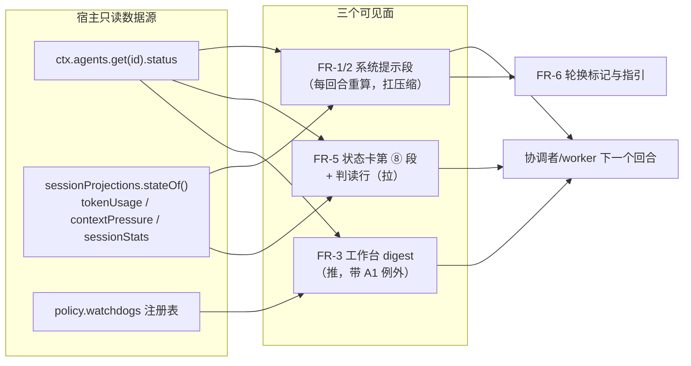
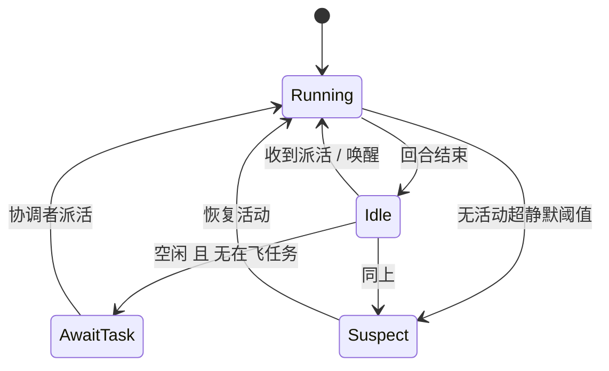
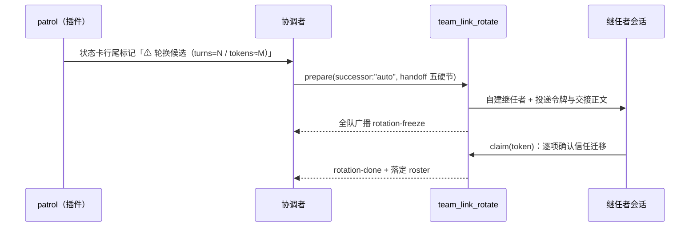

# 设计档 · 团队自治与资源真值（dsh-team-link）

> **状态**：**v1.4（2026-10-09 收口）** —— 12 条用户裁定已并入 §12；**批 1/2/3 已交付并推送**（提交 `69b9c06` / `3885824` / `2c7f9d8`，各批均经「独立复核（含定向变异反证）+ 交付代码评审」两道门）；本档经**两轮设计评审通过**（第二轮针对 v1.4 判 PASS）。配套需求档：`docs/2026-10-09-team-autonomy-requirements.md`。
> **章节口径**：`METHODOLOGY.md`「设计文档的成文流程与必备章节」（事实源见全局 `~/.dsh/AGENTS.md` 第三节）。
> **两批合并**：consult #26（角色/活性）+ consult #28（资源真值/轮换）。
> **行号约定**：全部为 **as-of 2026-10-09** 的 `lib/index.js`（12053 行）读数，只作定位，不承诺永久有效。

## §0 三句话结论（白话）

1. **这事是什么**：给团队加三层「**看得见**」——协调者每回合看得见自己的岗位说明；每个会话每回合看得见自己的资源余量；协调者不轮询就能看见"谁在跑/谁闲/谁该换"。
2. **对用户意味着什么**：不用再反复提醒它"你是主管"；worker 再也编不出"我预算耗尽了"（那句话会被一行读数当场证伪）；会话太长时你看得见标记并有现成换人命令。
3. **建议怎么办**：本批**只读 + 注册**，不新增任何写路径与事件类型；分 3 批实施，每批先红后绿。**12 个决策点在本档 §11，逐条给了前因后果与建议**。



## §1 背景

- **事实 1**：团队 `2026-10-08`（1 协调者 + 4 worker）跑了一天一夜，用户先后**三次**纠正协调者"你只负责管理，不要自己实施"。实测基线：协调者会话 225 次工具调用里**自己实施 29 次**、派活记账 138 次、**看 worker 状态只有 5 次**（16:00 之后 2 小时 44 分零状态读；专用状态卡 `team_link_status` **一次都没调过**）。另一支队 `pulsethreat-1008` 更极端：自己实施 120 次 vs 派活 32 次。
- **事实 2**：worker 会话 `team-link-2026-10-08-worker-4` 在 2026-10-09 10:49 向协调者报告「**②四档现场读全、实现未动——预算收口，交接防半成品**」；协调者采信，此后无人再派活。同一时刻它的实测用量是 **131,056,092 累计 token / 32 轮 / 303 步**。
- **事实 3**：这套插件从来没有向**任何**会话注入过角色或资源读数（唯一的角色文本发给新建 worker 的 kickoff，一次性、会被压缩冲淡）。

## §2 问题（现象 + 根因，带 `file:line`）

### 2.1 现象域 A：协调者失位与活性盲区

| # | 根因 | 证据（as-of 2026-10-09） |
| --- | --- | --- |
| A1 | **协调者没有任何角色注入**：worker 新建时会收到 kickoff（角色、向谁汇报、不要静默等待），协调者是用户手工建的会话，插件只在 roster 里把"创建者"登记成 coordinator，**从不向它注入任何角色文本** | kickoff：`lib/index.js:7215-7249`；创建者自举：`:3223-3231`；建队只回一行「下一步」：`:4138` |
| A2 | **权限拦不住实施**：写门只约束 roster/黑板这类**插件写操作**；git、改源码、跑测试不属它管辖 | `writerGate` `lib/index.js:3161-3177` |
| A3 | **活性只能"拉"**：运行中/空闲/静默时长/最近一句都在状态卡与 `list_sessions` 里，没有机制自动送到协调者眼前 | 状态卡会话面 `:11147-11170`；活性行 `:11033-11044` |
| A4 | **唯一的"推"只在"已失联"时响**：只对 `silent-idle` / `goal-disarmed` / `dead` 发 tick；worker 正常在跑 = 零信号；且必须**手动注册**（全仓唯一启动定时器处） | `TICKABLE_VERDICTS` `:246`、`:2406`；唯一 `watchdog.schedule` 调用 `:11346` |
| A5 | **它自己一忙，tick 反而被掐掉** | patrol 观察者门 `:2393-2395` |
| A6 | **tick 文案把"空闲待派"写成"失联征兆"** | `:2265` |
| A7 | **既有缺陷**：持久化在 policy 里的看门狗注册，**DSH 重启后是哑的**（没有任何定时器被重挂） | `schedule()` 仅 `:11346` 一处调用；`patrol()` 只被定时器回调调用（`:2314-2318`） |

### 2.2 现象域 B：资源真值缺失 ⇒ "预算耗尽"幻觉

| # | 根因 | 证据 |
| --- | --- | --- |
| B1 | **全 harness 不向模型注入任何预算文本**（不是 worker 特有） | 父侧与两份独立会诊复验：worker-2 会话 `system/message` 与 `request/context` 中预算字样 **0 命中**；唯一数字是 `contextWindow: 1000000` |
| B2 | **压缩阈值是估算口径**：`threshold = floor(min(window×0.8, window − maxTokens − headroom))`；qax 路由代入 = `min(800000, 1000000−393216−65536)` = **541,248** | `dsh-compaction-basic` 的 `resolveCompactSpec`（as-of 2026-10-09） |
| B3 | **本地估算器对中文系统性低估**（一手事件）：同一条压缩事件里 `shadowedTokenCount = 205,127`，而同操作的 API 实际 `cacheReadTokens = 387,200` ⇒ **≈1.89×** | worker-2 解码会话 `compaction` 事件（父侧 2026-10-09 11:3x 复核） |
| B4 | **溢出救援接不上**：失败码全是 `pi-ai stream idle timeout after 300000ms` / `TRANSPORT`，而溢出分支只认 `CONTEXT_WINDOW_EXCEEDED` ⇒ 救援一次都没触发（5 次重试后回合失败） | worker-2 会话：`CONTEXT_WINDOW_EXCEEDED` **0 次**；`llm/retry` 5 次 |
| B5 | **没有任何人可证伪"预算耗尽"**：状态卡七段里**没有**资源读数，协调者只能采信 | `team_link_status` 描述 `lib/index.js:11070` |
| B6 | **轮换没有触发者**：`team_link_rotate` 本就支持任意角色 + `successor:"auto"`（自建继任者 + 五硬节交接 + 令牌 + freeze），但没有任何"该换人了"的信号 | `lib/index.js:4953-4969` |

> **父子关系的诚实表述**：**"预算耗尽"这个词是模型自己编的**（环境无据）；但**触发它的痛是真的**（B2–B4：真实请求体已达 39 万–百万 token、网关 300s 不出字、重试失败、有一次 `kind=max-tokens` 回合死亡）。
> 结论：**错误的解释 + 真实的痛**。设计要同时治两件事——把痛读数化，并让错误的解释当场可证伪。

## §3 目标 / 非目标

**目标**：US-A1…A8、US-B1…B7（见需求档 §二）全部有对应 FR 与可失败判据。
**非目标**：见需求档 §四（硬墙 / 自动轮换 / worker 提示瘦身 / 团队级成本账 / 改宿主 / 部署配置修改）。

## §4 决策与理由（每条含被否决的备选）

| # | 选定 | 为什么 | 被否决的备选及否决理由 |
| --- | --- | --- | --- |
| D1 | 角色与资源都做成**按会话作用域的系统提示段**（`agent.ctx.systemPrompt.section`，**函数型 text**） | 每回合重算 ⇒ 扛压缩、零消息成本；宿主自家 Agent Teams 用同一条路；本机另有三个用户插件先例 | ① 写进仓库 `AGENTS.md`——worker 也读，会错套到自己头上；② 走 kickoff 再投一次大文本——一次性、仍会被压缩冲淡，且**教模型说预算**（反向效果） |
| D2 | 自动注册挂在 **`/team_session` 建队成功处** | 那是天然写盘时刻，且注册要求 `exec.agent.id` | 挂在 `team_link_status` 里"懒自愈"——该卡合同写着「**全只读**：调用前后 settings 与磁盘逐字节不变」（`:11070`），写操作进去＝自破合同 |
| D3 | 工作台 digest **在观察者 running 时也投**（穿透 A1 抑制） | 事故根因正是"它一边实施一边收不到提醒"；宿主语义本就支持注入当前回合 | 保留原抑制——等于把提醒掐在最有用的时刻；**但这是改一条已审计行为，列 D-A1 交用户** |
| D4 | 轮换＝**标记 + 指引**，命令复用 `team_link_rotate` | 轮换会广播 freeze、建新会话，本质是人的一次决策；命令本就存在 | 自动轮换——会打断在飞的活、且与"看门狗只管报警"的边界冲突 |
| D5 | 撞墙判据用**引擎同源公式**；轮换线用**绝对刻度** | 两者回答不同问题："下一步会不会被压缩/撞墙" vs "这个会话该不该换人" | 只用绝对刻度（会与真实压缩行为脱节）／只用窗口分数（1M 是市场数字，与真实窗口关系未知） |
| D6 | **"预算耗尽"只允许出现在判读行，且只能是"不成立"** | 把模型自述降级为可核对行；同时避免插件文案"教"模型说这个词 | 在 kickoff 里写"别说预算耗尽"——等于把词喂给它 |
| D7 | 本批**不做**硬墙（`tools.restrict`） | 技术可行（已实读源码），但会连带堵死"用户让它自己做"；且 PTC **内层**解析是否吃 `restrict` 未实测 | 现在就做——三个前置未测，做错等于把团队工具一起废掉（`run_code` 是工具总线） |

## §5 方案（FR-x）

| FR | 交付单元 | 落点 | 覆盖用户故事 |
| --- | --- | --- | --- |
| **FR-1** | **协调者宪章段**（每回合重算） | `agent.ctx.systemPrompt.section({name:"team-link:role", order: sp.getSectionOrder("TEAM_POLICY"), text: fn})`（**以 §6 的探测写法为准**：order 一律取 `getSectionOrder(...)`，不用裸常量），只对 roster 现任 coordinator 注册 | US-A1/A2 |
| **FR-2** | **会话资源段**（worker 自见；与 FR-1 **合并为一次注册**） | 同一函数型 text：coordinator 版＝宪章＋资源；worker 版＝资源＋汇报义务。**注册钩子两条路径（评审 #5 钉死）**：① `upsert-team` 的 **worker 角色创建分支**；② **`attach` 时扫 roster 成员重建**（覆盖重启后的既有 worker）。两条都只对**活代理**注册，缺席即跳过并如实标注 | US-A7/B2 |
| **FR-3** | **工作台 digest**（推） | 看门狗升级：自动注册 + 事件化（E1 运行→空闲 / E2 空闲且无在飞任务 / E3 失联）+ 分组摘要 + 语义分离文案 | US-A3/A4/A5 |
| **FR-4** | **工具返回面重钉** | `upsert-team` 创建分支 / `/team_session` 完成回报 / `team_link_status` 第 2 行（仅现任协调者）/ digest 脚注 | US-A2 |
| **FR-5** | **状态卡第 ⑧ 段「资源/预算」+ 判读行** | `team_link_status` 追加一段（复用既有有界读窗，**纯读**） | US-B1/B3 |
| **FR-6** | **轮换标记与指引** | 第 ⑧ 段行尾 `⚠ 轮换候选（turns=N / tokens≈M）` + 一句现成命令 | US-B4/B5 |
| **FR-7** | **attach 重挂**（既有缺陷修复） | 插件 attach 时遍历 `policy.watchdogs` 逐个 `schedule()` | US-A6 |
| **FR-8** | **文档同步** | 状态卡描述「七段→八段」同次编辑；README 服务表加 `sessionProjections`（晚挂/降级）；CHANGELOG；工具一览 | NF-4 |
| **FR-9** | **总开关**（评审 #1 补） | 新增策略键 `policy.sections = { role: bool, resources: bool }`（缺省 true）：`role=false` ⇒ 不注册宪章段；`resources=false` ⇒ 资源行在段 / ⑧ 段 / digest 脚注**三处全缺**。digest 侧关断＝既有 `team_link_watch clear` ＋ 进程内抑制标记（防 auto 自愈复活） | US-A8 |

| **FR-10** | **attach 按队补挂 auto 工作台注册（批 5）** | attach 后置链里，对 roster 的**每个队** ensure 一条 `origin:"auto"` 注册（`watcher` ＝该队现任协调者，`targets` ＝全队成员去掉 watcher；幂等键 `(origin,watcher,team)`）。**缺失才写**（单写落点 `policy.update({watchdogs})`）；现任不 live 也照写（注册与"谁能收"无关）。除 watcher 外无成员 ⇒ 按 `planAutoWatchdog` 既有语义跳过并留一行读数。**失败 fail-open**：只留一行 warn，绝不拖 attach 链 | US-A3/A4 |
| **FR-11** | **patrol 每轮轻量段同步（批 5）** | 每轮巡逻顺带一次 `sections.sync()`：纯读名册 + 活代理表，**仅当计划变化才写注册表**（进程内）；不写 policy、不进 `team_link_status` ⇒ 只读合同不破。使命＝覆盖"**现任协调者晚启动**"（最多等一个巡检间隔）。前置：该队必须有注册（由 FR-10 保证） | US-A1 |
| **FR-12** | **`team_link_watch action="arm-team"`（批 5）** | 现任协调者一条命令**幂等补挂自己队**的工作台注册（复用 FR-10 的 ensure 逻辑）；非现任 / 队不在名册 ⇒ **拒绝**并点名原因；writer gate 语义沿用（policy.writer=coordinator 时只有现任可动） | US-A3 |
| **FR-13** | **卡的三段读窗按团队 workspace（批 5）** | 段④/⑤/⑧ 的读窗**优先按 `team.workspace` 取**——实现面＝`ctx.sessionQuery.filterSessions([{kind:"cwd",values:[team.workspace]}], signal)`（**特性探测**；宿主无该面 ⇒ 「就地过滤 + 段头如实标注」支，fail-visible），**绝不**把调用方工作区的会话当成该队会话。**测试桩必须镜像宿主真签名**（`listSessions(signal)` / `filterSessions(clauses, signal)`）——否则「传错参数被 catch 吃掉、静默退化成降级支」这类断层套件看不见（本仓 `AGENTS.md` §四同款事故）。U23 **两条支都要钉**（优先支可达 / 降级支标注） | US-B1 |
| **FR-14** | **判读行的范围界定（批 6）** | 第 ⑧ 段判读行在既有白名单句之后补一句**逐字**范围界定：`（本节只判上下文/预算；宿主工具闸门——如写入自动评审 429——属另一类，见工具报错原文，不在本节口径内。）`。**只加这一句**，不改既有两句；新增句**不得**引入禁词（`预算耗尽` / `收口` / `阈值` 的出现次数与位置约束原样）。使命＝把「哪类结论由本节担保」说清楚：真机实测（2026-10-10）有人把宿主 `auto-review 429`（写入被拦，报文原文见 `verification-log`）**当成了插件的预算幻觉**——两类不同的东西，混一次就会既误判真事、也放过真幻觉 | US-B3/B5 |

### 5.1 状态迁移（成员状态 → 推送判定）



> 图例：**E1**＝`Running → Idle`（"刚干完"）；**E2**＝`Idle → AwaitTask`（"空闲待派"，措辞与"失联"严格分离）；**E3**＝`→ Suspect`（走原有告警 tick，A1 抑制原样）。
>
> **E2 门槛口径（2026-10-09 doc-sync，评审 #1 + 复核 🟡1 收敛）**：E2 的条件**只有**「空闲 ∧ 无在飞任务」——**不带静默门槛**。
> **E2 的「无在飞任务」只读 goal 那一半（2026-10-09 v1.4）**：实现判 `goal === null || goal.phase !== "active"`（paused/blocked/complete/无 goal 都算空闲待派）。consult #26 §4.3 的另一个半（tasks.md 里该成员未收口行）**本批未接入**，台账那一半登记为后续批——这是**已披露的简化**，不是静默降级（代码注释同处声明）。
>
> 为什么删掉原先图上的「静默 > 10min」：一旦静默 ≥ `silentMinutes`（默认 10），该目标先被判 `silent-idle` 进 **alarm 组**（优先级更高），`idleAwait` 会**恒空、E2 永不可达**。
> ⇒ **E2 与 E3 的互斥由 alarm 优先级保证**（不是靠门槛）；投递侧的 ≥10min 去抖仍由 §6 的 `debounced(entry, now)` 承担。**本项改档不改码**。

### 5.2 轮换时序（标记 → 人工发起 → 两阶段交接）



## §6 机制伪代码（签名 + 前置/后置）

```js
/** FR-1/FR-2：给一个活代理注册角色/资源段。前置：agent 为活代理对象。
 *  后置：返回 disposer（幂等）；无 systemPrompt 面 ⇒ 返回 no-op + 一行 warn（fail-visible）。 */
function registerRoleSection(ctx, agent, charterText) {          // charterText: coordinator 版含宪章；worker 版为 null
  const sp = agent?.ctx?.systemPrompt;
  if (typeof sp?.section !== "function") return warnAndNoop("systemPrompt.section 缺席");
  const text = (assembly) => renderRoleAndResources(ctx, assembly?.agent, charterText);
  return sp.section({ name: "team-link:role", order: sp.getSectionOrder("TEAM_POLICY"), text });
}

/** 函数型 text 的渲染体：必须同步、必须恒返回字符串（返回 undefined 会让整次装配抛错）。 */
function renderRoleAndResources(ctx, agent, charterText) {
  const lines = [];
  if (charterText) lines.push(charterText);                       // FR-1
  const line = renderResourceLine(ctx, agent);                    // FR-2
  if (line !== "") lines.push(line);
  return lines.join("\n");
}

/** FR-2：一行资源读数。前置：agent?.session 可取；投影服务可能缺席。
 *  后置：恒返回字符串（不可读 ⇒ 明说不可读，绝不编数）。纯读，零写入。 */
function renderResourceLine(ctx, agent) {
  const sp = ctx.get?.("sessionProjections");
  if (typeof sp?.stateOf !== "function") return "[team-link 会话资源] 不可读（sessionProjections 缺席）";
  const p = sp.stateOf(agent.session, "contextPressure");         // { contextWindow?, pressureTokens?, surfaceTokens }
  const u = sp.stateOf(agent.session, "tokenUsage");              // { totals{...}, last{turn,step} }
  if (p === undefined && u === undefined) return "[team-link 会话资源] 不可读（投影未注册）";
  return `[team-link 会话资源] 窗口 ${fmt(p?.contextWindow)} · 压力 ${pct(p)}% · 压缩阈值 未知（宿主投影不含该读数） · 累计 ≈${fmt(sum(u))} · 第 ${u?.last?.turn ?? "?"} 轮`;
}

/** FR-5：判读行——「预算耗尽」只允许出现在这里，且只能是"不成立"。 */
function verdictLine(readings) {   // 2026-10-09 父侧裁定：宿主投影不含压缩阈值 ⇒ 不做「低于阈值」比较
  if (readingsUnavailable) return "预算判读：读数不可得，不作判读。";
  return "预算判读：未见收口理由——本系统按压力自动压缩，结构上不存在「预算耗尽」；确需换人请走 team_link_rotate。";
}

/** FR-3：patrolOne 的扩展（尾段）。前置：entry 为注册项；watcher 可能是 running。
 *  后置：至多投一条 digest；无"可行动内容"⇒ 零投递；告警类 tick 走原路径不变。 */
async function patrolOneWithDigest(entry, now) {
  const alarm = await patrolOneAlarmPath(entry, now);              // 原样保留 A1 抑制 + 去抖
  if (watcherNotLive(entry)) return;                               // A4：无处落
  const groups = classifyTargets(entry, now);                      // running / idleAwait / justFinished / alarm
  if (!actionable(groups)) return;                                 // 全队 ok 且无迁移 ⇒ 零投递
  if (debounced(entry, now)) return;                               // ≥10min 且状态未变
  watcher.followup(relayUserMessage(renderDigest(entry, groups))); // 沿用既有三成员 source
}
```

## §7 状态与 schema（谁写谁读）

### 7.1 持久化：`policy.watchdogs[]`（既有键的**加性**扩展）

| 字段 | 类型 | 谁写 | 谁读 | 说明 |
| --- | --- | --- | --- | --- |
| `id` / `watcherSession` / `targets` / `silentMinutes` / `intervalMinutes` / `expiresAt` / `createdAt` | 既有 | watch 工具 / auto 注册 | patrol / status 卡 / watch list | **形状不变** |
| `team` | 既有（此前恒 null） | auto 注册填团队名 | digest 文案 / status 卡 | 复用既有字段 |
| `origin` | `"manual" | "auto"`（缺省视为 manual） | 注册方 | 额度判定 / status 卡 | **新增**：`origin:"auto"` 不占手工 3 条额度（`:249`） |

> 落点纪律：仍走 `policy.update({watchdogs})`（单写落点，`AGENTS.md` §七）；**不新增任何持久化文件**。

> **`createdAt` 语义（2026-10-09 doc-sync，复核 🔵6）**：auto 行在**顺延（二次 arm）时会被重写为当次时刻** ⇒ 它表示「**最近一次 arm 时刻**」，不是「首次创建时刻」；TTL 顺延与状态卡显示都按这个语义用。若要「首次创建」需另加字段（本批不做）。

### 7.2 进程内（不落盘，重启即失——与既有 `ticked`/`deadWatchers` 同款取舍）

| 结构 | 谁写 | 谁读 | 说明 |
| --- | --- | --- | --- |
| `sections: Map<sessionId, disposer>` | 注册器 | 注销器 / attach 清扫 | 段注册句柄 |
| `lastAgentState: Map<regId+target, "running"|"idle">` | patrol | patrol | 判"刚转空闲" |
| ~~`pulseCache`~~（**2026-10-09 删除**） | —— | —— | 评审判定它与「函数型 text 直读 `stateOf`」是两套并存的同步可读机制；裁定＝**直读、零缓存**（实现见 lib/index.js:2909 区注释），本行留痕见 §13 v1.4 |
| `digested: Map<regId+target, { at, signature }>` | patrol（投递成功才记；失败记 `signature: null`） | patrol / 判据 U9 | 投递去抖的**状态指纹**闸；失败那支记 null ⇒ 下个窗口重投（t-5 补判别力断言） |

### 7.3 只读投影（宿主）

`ctx.sessionProjections.stateOf(session, key)`：`tokenUsage`（v2）/ `contextPressure`（v5）/ `contextBreakdown`（v5）/ `sessionStats`（含 `turns`，**批 2 夹具先行核实** —— 缺席时按 §9「读数缺席（turns）」降级，评审 #3）。
**只读**：不写、不缓存、不改宿主状态。

### 7.4 开关（新增策略键 —— 本批唯一触碰红线的点）

| 字段 | 类型 | 谁写 | 谁读 | 说明 |
| --- | --- | --- | --- | --- |
| `policy.sections.role` | boolean（缺省 true） | 用户（设置 UI / `policy.json` 超级写者） | 注册器 | false ⇒ 不注册宪章段 |
| `policy.sections.resources` | boolean（缺省 true） | 同上 | 段渲染 / 第 ⑧ 段 / digest 脚注 | false ⇒ 资源行**三处全缺** |

> **红线代价（如实）**：README §十 的红线之一是「`PolicyConfig` 的键集」被断言钉住；新增这两个键**必须同批更新那条断言与 README 的键集描述**，并由 **U17** 覆盖 —— 这是本批**唯一**触碰红线的改动。
> digest 的关断**不新增键**：沿用既有 `team_link_watch clear` ＋ 进程内抑制标记（clear 掉的 auto 注册在同进程内不再自愈；重启后复活 —— 与既有 `ticked`/`deadWatchers` 同款取舍）。

## §8 防偏离（可失败的机械判据）

| # | 判据（可 grep、可失败） | 归属 |
| --- | --- | --- |
| U1 | 无 `agent.ctx.systemPrompt` ⇒ **零注册 + 恰好一行 warn**，不抛错 | FR-1/2 |
| U2 | 注册参数逐字：name/order(=TEAM_POLICY)/text 为函数；**只**对 roster 现任 coordinator 注册宪章 | FR-1 |
| U3 | 换届后旧会话段被 dispose、新会话被挂上（零残留） | FR-1 |
| U4 | 代理消失 ⇒ disposer 被调用（不泄漏） | FR-1 |
| U5 | 函数型 text **同步**且恒返回字符串；异常被吞并降级为空串（**不得**让装配抛错） | FR-1/2 |
| U6 | 资源行与 `stateOf` 一致（**窗口/压力/累计/轮次**逐项；压缩阈值**不参与逐项比对**，它恒显示「未知（宿主投影不含该读数）」）；缺字段 ⇒ 显示「未知」而非 NaN | FR-2 |
| U7 | **白名单（逐字；判读行恒由「结论句 + 范围句」组成）**，结论句只允许两种之一：① `预算判读：读数不可得，不作判读（原因：<原因码>）。`（`<原因码>` 为三档之一：`sessionProjections 缺席` / `投影未注册` / `非活动会话`）；② `预算判读：未见收口理由：本系统按压力自动压缩，结构上不存在『预算耗尽』。` —— 两句之后**恒接** FR-14 的逐字范围句（第三句）。**禁词纪律（2026-10-10 v1.8 按实现口径精确化）**：(a) 判读行**内** `预算耗尽` 与 `收口` 各至多一次、且只出现在②句的白名单短语里；(b) 判读行内 `阈值` **零命中**；(c) 判读行**以外**的卡面，落进上述禁词模式的次数为 0（指纹前后一致，读数写进断言名）。**边界如实**：`阈值` 一词在**有看门狗的卡**上由段③ 合法打印（`阈值：静默 …`，指看门狗阈值、非压缩阈值）⇒ 禁词面按「判读行内 + 白名单外」界定，**不做**整卡硬零命中 | FR-5 |
| U8 | 轮换标记四边界（99/100/101 轮；199.9M/200.0M/200.1M）只在一侧出现 | FR-6 |
| U9 | digest 只在"有可行动内容"时投；全队 ok 且无迁移 ⇒ **零投递** | FR-3 |
| U10 | digest 在观察者 running / **armed-active** 时**仍投**（D-A1 已裁定『准』，条件已生效）；告警类 tick 的 A1 抑制**原样** | FR-3 |
| U11 | auto 注册不占手工额度；手工 ≥3 条后仍可 auto | FR-3 |
| U12 | attach 重挂：重启后 `policy.watchdogs` 每项都有定时器（**红相**＝摘掉重挂 ⇒ 断言红） | FR-7 |
| U13 | 零写入：第 ⑧ 段在场时「调用前后 settings 与磁盘逐字节不变」原断言仍绿 | FR-5 |
| U14 | 不新增事件类型；投递 `source` 恰三成员（`host-half.test.mjs:1536/1539` 原样绿；as-of 2026-10-09） | NF-1 |
| U15 | 模块级 `inject` 恒 4 项；`writerGate` 函数体逐字节不变 | NF-2/3 |
| U16 | 状态卡首行仍是 placementLine（`:11131`）；"七段"描述同次编辑改"八段" | FR-8 |
| U17 | **总开关**：`sections.role=false` ⇒ 零段注册**且工具返回面零重钉行**；`sections.resources=false` ⇒ 资源行**三处全缺**；`watch clear` 掉的 auto 注册**同进程内不自愈**；**且 `PolicyConfig` 键集断言与 README 红线描述同批更新**（本批唯一触碰红线的点） | FR-9 |
| U18 | **FR-4 四处重钉面**：调用方是现任协调者时含宪章行，非现任/队不在名册时缺席（四处逐点，含「队在场 + 现任是别人」的判别夹具） | FR-4 |
| U19 | **行数预算与零新增周期读（NF-5）**：宪章段 ≤8 行 · 资源行**恰 1 行** · 第 ⑧ 段 ≤12 行 · 协调者整段恰 8 行；**不新增周期性日志读**（负向：既有有界读窗的调用次数不变） | NF-5 |
| U20 | **attach 按队补挂**：名册里一个**无 auto 注册**的队 ⇒ attach 后恰有一条 `origin:auto`（watcher=现任、targets=队员）；**再 attach 一次不新增**（幂等）。红相＝摘掉补挂 ⇒ 断言红 | FR-10 |
| U21 | **patrol 每轮段同步**：现任协调者的代理**在 attach 之后**才出现 ⇒ **一个巡检间隔内**拿到段（晚启动覆盖）。红相＝摘掉那一句 sync ⇒ 断言红 | FR-11 |
| U22 | **arm-team**：现任可用且幂等（第二次不新增）；**非现任 / 队不在名册 ⇒ 拒绝**且文案点名原因。红相＝放行非现任 ⇒ 断言红 | FR-12 |
| U23 | **跨工作区读窗**：调用方工作区 ≠ 团队工作区时，段④/⑤/⑧ **不得**把调用方工作区的会话列为该队会话（要么按 `team.workspace` 取窗，要么显式标注窗口所属工作区）。红相＝把调用方窗口当成团队窗口 ⇒ 断言红 | FR-13 |
| U24 | **判读行范围界定**：判读行含 FR-14 的逐字范围句；且该句**不引入**禁词（`预算耗尽`/`收口`/`阈值` 的次数与位置约束与原白名单一致）。红相＝删掉那句 ⇒ 断言红；红相②＝把该句改写成与本节口径矛盾的措辞 ⇒ 断言红 | FR-14 |

**负向断言（必须存在）**：U1（缺席不许抛）、U5（渲染异常不许冒泡）、U7（禁用词按白名单）、U9（无事不许打扰）、U12（不许只在注册时挂定时器）、U18（非现任不许重钉）。

> **四条正文口径（2026-10-09 v1.4 折入正文，回应设计评审 🟡#6；变更记录只留指针）**：
> ① **FR-9 连带关断**：`sections.role=false` ⇒ 除不注册宪章段外，**工具返回面的重钉行也一并关闭**（upsert-team / `/team_session` 回报 / 状态卡第 2 行 / digest 脚注四处）——「关了开关却还在工具返回里提醒」自相矛盾（见 U17 行）。
> ② **注册面口径**：一个会话同时属多队/多角色时**只挂一段**（协调者版优先，名册序决定）；worker 义务行点名**角色**并给**角色寻址**（`team_link_send` 用 `team:<team>/coordinator`，投递时按当时现任解析）⇒ 换届零 churn、文字永不过期。
> ③ **sync 触发面**：`attach` 后置链 + **五处名册写入点**（roster upsert-team / set-role / retire、`/team_session` 建队、换届 claim）；`/team_session` 的「全部已登记 ⇒ 无需创建」早退支**不触发**（与批 1 登记的同一条边界）。
> ④ **第 ⑧ 段会话集合**：调用方自己 + 既有有界读窗（≤12）截到 **≤10 行**；段头与判读行恒在场。

## §9 边界

| 面 | 情形 | 行为（失败方向） |
| --- | --- | --- |
| 空集 | 无 worker / roster 无现任协调者 / 无投影服务 / 无 watchdogs | 不注册、不推送、读数行明说「不可读」；**fail-visible（如实标注），不 fail-closed，也不编数** |
| 畸形 | `contextWindow` 缺失、`pressureTokens` 非数、target 会话已被删 | 显示「未知」；被删会话的 target **不跳过**——它会被读成 dead 并**列进「需处置」**，在 digest 里如实标注（2026-10-09 改口径，复核 🔵8） |
| 并发 | 两个注册同时写 `policy.update`；patrol 与换届清扫同刻 | 沿用既有 read-modify-write 与去抖；注册失败 ⇒ 返回失败文案、**不静默** |
| 重启 | policy 里的注册、进程内的 `sections`/`lastAgentState`/`digested` 全失（`pulseCache` 已于 v1.4 删除） | **FR-7 重挂定时器**（**重挂前按 `expiresAt` 过滤**：过期条目不挂巡逻定时器；全过期时留**一个**清扫定时器并在 `removeWatchdog` 尾部幂等 `rearm` 接棒——2026-10-09 批 2/3 落地）；段注册在代理出现时重建；投影由宿主重建 |
| 读数缺席（turns） | `sessionStats` 未注册或 `turns` 不可读（批 2 夹具先行核实，见 §7.3） | 第 ⑧ 段落为「轮次未知」，FR-6 **只按 tokens 标记**（轮次判据挂起）；如实标注，**不编数** |
| 开关关闭 | `sections.*=false` 或用户 `watch clear` | 零段注册 / 资源行三处全缺 / auto 注册不自愈；**不抛错、不静默改回** |
| 升级 | 宿主换代（API 改名/面消失） | 全部新面**特征探测**；缺失 ⇒ 降级到"工具返回重钉"路径 + 一行 warn（沿 preset 换代两次翻车的教训） |
| 失败方向 | 段注册失败 / digest 投递失败 / 投影读取抛错 | 段：warn + 不注册（会话照常跑）；digest：warn + 不重试（下个巡逻窗口再说）；投影：行内标「不可读」 |

| 补挂失败（FR-10/FR-12） | policy 写失败 / planAutoWatchdog 报错（除 watcher 外无可盯成员） | **fail-open**：attach 链与命令本身不受影响，只留一行具名读数；下一次 attach/patrol 会再试 |
| 跨工作区读窗（FR-13） | 团队 workspace ≠ 调用方 workspace；宿主不支持按工作区取窗 | **优先按 team.workspace 取**；取不到 ⇒ **如实标注**窗口所属工作区，**绝不**把调用方工作区的会话当成该队会话（fail-visible 不 fail-silent） |

## §10 实施批次（每批先红后绿 + 独立复核）

| 批 | 内容 | 判据 |
| --- | --- | --- |
| **批 1** | FR-3 最小改造（auto 注册 + E1/E2 事件 + digest 文案分离）+ **FR-7 重挂缺陷修复** | U9–U12、U14、U15 |
| **批 2** | FR-1/FR-2 提示段（合并注册，含生命周期与降级）＋ **核实 `sessionStats.turns` 投影**（夹具先行；缺席则按 §9 降级行落地） | U1–U6、U15 |
| **批 3** ✅ | FR-5/FR-6 第 ⑧ 段 + 判读行 + 轮换标记；FR-4 工具返回重钉；FR-8 文档同步；**FR-9 总开关**；**D-B6 三条宿主缺陷登记** | U7、U8、U13、U16、U17、**U18、U19** |
| **批 5**（2026-10-10，用户裁定「按这 3+1 点做」） | **让既有团队也吃到**：FR-10 attach 按队补挂 auto 工作台注册 · FR-11 patrol 每轮轻量段同步（覆盖「现任晚启动」）· FR-12 team_link_watch action=arm-team · FR-13 卡的三段读窗按团队 workspace | U20、U21、U22、U23 |
| **批 6**（2026-10-10，用户裁定「可以立项」） | FR-14 判读行范围界定（一句话，避免把宿主工具闸门与上下文预算混为一谈） | U24、U7（白名单扩到三句） |

## §11 十二个决策点（人话版：前因后果 + 建议）

> **已裁定（2026-10-09，用户）**：D-A1 准 · D-A2 先落 · D-A3 接受 · D-A4 准 · D-A5 同批 · **D-A6 挂起**（保留协调者现有的动手能力）·
> D-B1 准 · D-B2 合并 · D-B3 只标记 · D-B4 并入 · **D-B5 做** · D-B6 登记。
> 逐条裁定与实施口径见 §12。

### 批次 A（consult #26）

**D-A1｜它自己忙着的时候，插件要不要也把提醒发进去？**
前因后果：现在有条老规矩——协调者正跑着就不打扰（当年为了防打断）。可你要治的恰恰是"它忙着干不该它干的活"，提醒在最该出现的时刻被这条规矩掐掉了。
建议：**准**。配套（只在有可行动信息时发、≥10 分钟去抖、可 clear、TTL）。代价：改一条已审计行为，可能打断它的思路。

**D-A2｜先上一套不改代码的止血？**
前因后果：宪章段与自动注册都要写代码，而你现在每次还在手动提醒它派活。
建议：**先落**——把宪章原文粘进协调者会话的 instructions（会话级、只对它生效），再手工注册一条覆盖全队的看门狗。代价：① 只对该会话生效；② 看门狗有重启即哑的老毛病（FR-7 修）。

**D-A3｜"你是协调者"写进这个会话的系统提示段？（宿主内部面）**
前因后果：写对话里会被压缩冲掉；写系统提示段则每回合重算。这条依赖宿主的 `agent.ctx.systemPrompt`。
建议：**接受**。理由：本机已有三个用户插件在用（其中给本会话提供工具的 thincoder 就是按 agent 作用域挂段，连"接口不在就降级"的守卫都一样）；代价：换代要跟着改，有降级路径兜底。

**D-A4｜自动注册挂哪儿？**
前因后果：有人提议挂在"它调用状态卡"时顺手注册；但那张卡承诺"全只读，调用前后磁盘一字节不变"。
建议：**准**——挂 `/team_session` 建队成功处（本来就是写盘时刻）。代价：无。

**D-A5｜worker 的角色义务段同批做？**
前因后果：worker 的 kickoff 同样会被压缩冲淡，久了就不汇报（"干完不吭声"的另一半原因）。
建议：**同批**（同一机制、边际成本≈0）。代价：无。

**D-A6｜要不要做"硬墙"（直接摘掉它跑命令/改文件的工具）？**
前因后果：**我要更正上一轮**——我照抄会诊说"宿主没有否决钩子"，实读源码后**否证**：`tools.restrict({deny})` 在 agent 作用域可用、还能撤销。但两个坑：本部署工具调用走 `run_code` 总线，能否拦到**内层**未实测；硬墙也会把"你偶尔让它自己做"一起堵死。
建议：**本批不做**，登记为可选特性 + 三条待实测。代价：只靠软约束。

### 批次 B（consult #28）

**D-B1｜"预算耗尽"这个词在工具文案里怎么处理？**
前因后果：worker 编了这个词，协调者只能采信——因为没有任何一行读数能戳穿它。
建议：**准**——该词只允许出现在判读行、且只能是"不成立"；其余文案一律用"压力/阈值"说话。代价：无。

**D-B2｜资源段与宪章段合并注册？**
前因后果：两段都靠同一套"按会话作用域注册 + 生命周期"，拆两套要两次特征探测、两套 dispose。
建议：**合并**（一次探测、一套生命周期、一个开关）。代价：无。

**D-B3｜轮换是自动还是标记？阈值用 > 还是 ≥？**
前因后果：轮换会广播 freeze、建新会话，本质是人的一次决策；自动做会打断在飞的活。
建议：**只做标记 + 指引**（不自动）；阈值用 **`>`**（200M 整、100 轮整不算候选），实现前定死并钉进判据 U8。代价：需要你或协调者手动发一条命令。

**D-B4｜预算推送要不要单独做一条？**
前因后果：预算不是"事件性问题"（不像失联），而拉 + 自见两面已经闭环。
建议：**并入** D-A1 的工作台 digest（若批），本批不单独做。代价：无。

**D-B5｜部署配置要不要现在改？（不在本仓）**
前因后果：qax 路由的压缩阈值是 541,248（**估算口径**），而实测低估 ≈1.89× ⇒ 真实约 80 万–100 万才触发压缩，正好撞网关声明的 1M 窗口；真出事时失败码是超时，溢出救援接不上。
建议：**建议立刻做**——给 qax 两条路由配 `compaction-basic.modelPolicies`（降 `thresholdRatio` 或加 `headroomTokens`），并把声明的 1M 改成网关实测值。代价：改部署配置需要你点头（我可以给具体补丁片段）。

**D-B6｜宿主缺陷怎么办？**
前因后果：中文估算低估 ≈1.9×、大包超时没被识别为"疑似溢出"、真实 usage 没回灌压力环——这三条都长在宿主，不在本仓。
建议：**登记 + 上报**，不在本仓修（本仓修不了，也不该修）。代价：无。

## §12 决策裁定结果与实施口径（2026-10-09）

| # | 裁定 | 实施口径（本档如何落） |
| --- | --- | --- |
| D-A1 | **准** | FR-3：digest 在观察者 running / armed-active 时**照投**；告警类 tick 的 A1 抑制**原样不动**。判据 U10 钉这两半。 |
| D-A2 | **先落** | 批 0（零代码）：① 宪章原文粘进协调者会话 instructions；② 手工注册一条覆盖全队的看门狗。**不进代码改动面**，由用户在会话里执行。 |
| D-A3 | **接受** | FR-1/FR-2 走 `agent.ctx.systemPrompt.section`；**必须**特征探测 + 降级（U1），并在 README 服务表登记为"晚挂/缺席降级"。 |
| D-A4 | **准** | FR-3 的自动注册挂 `/team_session` 建队成功处；**禁止**放进 `team_link_status`（其"全只读"合同是红线，判据 U13）。 |
| D-A5 | **同批** | FR-2 的 worker 版文本（资源行 + 汇报义务）与宪章段**同一次注册**（D-B2 合并）。 |
| D-A6 | **挂起（保留能力）** | 本批**不做** `tools.restrict` 硬墙；**不削弱协调者现有的任何工具**。设计保留为"可选特性（默认关）"，三条待实测（PTC 内层解析 / disposer 可撤销性 / 与 scoped 注册的交互）留在 §4-D7 与本行。 |
| D-B1 | **准** | FR-5 判读行；"预算耗尽／收口"只允许出现在判读行且只能是"不成立"（U7）。 |
| D-B2 | **合并** | FR-1 与 FR-2 共用一次特征探测、一个 `section`、一套 disposer（U2/U4 同批钉）。 |
| D-B3 | **只标记** | FR-6 只做行尾标记 + 指引；阈值符号取 **`>`**（200M 整 / 100 轮整**不算**候选），钉进 U8。 |
| D-B4 | **并入** | 资源行随 digest 脚注出现；**不新增**独立推送支路（U9/U10 不变）。 |
| D-B5 | **做** | 部署面（**不在本仓**）：给 profile 的 `compaction-basic` 加 `config.modelPolicies` 校准 qax 两条路由；补丁片段见实施计划 §4。属"用户侧配置变更"，需单独确认后落地。 |
| D-B6 | **登记** | 三条宿主缺陷写入 `docs/verification-log.md` 的登记面（CJK 估算低估 / 大包 idle-timeout 未识别为疑似溢出 / 真实 usage 未回灌压力环），**不在本仓修**。**实施口径（评审 #4）**：登记动作挂在**批 3**（与 FR-8 文档同步同批）。 |

## §13 变更记录

| 日期 | 变更 |
| --- | --- |
| 2026-10-10 | **v1.8（批 6 落地 + 档面同步）**：批 6 的 FR-14/U24 已实现（判读行两支末尾**恒接**逐字范围句）。本行同时**纠正一处档面漂移**（实施者发现、由我改档）：**U7 行原写的是旧措辞** —— ①缺原因码、②用「——」与「」且带尾句 `确需换人请走 team_link_rotate`，而实现按父侧裁定落地（现为 `：` 与『』、无尾句、带原因码）⇒ 已改为**与实现逐字一致**并把「只允许这两句之一」改成**三句**；另把禁词面的边界写实（`阈值` 在段③ 指看门狗阈值，不做整卡硬零命中）。 |
| 2026-10-10 | **v1.7（批 6 立项）**：新增 **FR-14**（判读行范围界定）+ 判据 **U24**（含 U7 白名单扩到三句）。起因＝真机核对：宿主 `auto-review 429`（`{"code":"1310","message":"您已达到每周/每月使用上限…2026-10-14 00:27:38 重置"}`，**工具本体未执行**）是真实存在的写入闸门，而第 ⑧ 段/判读行只担保「上下文/预算」这一档 ⇒ 两类混谈会**既误判真事、也放过真幻觉**（本轮用户即把它当成了配额幻觉）。 |
| 2026-10-10 | **v1.6（批 5 立项）**：真机复跑暴露两处**结构性缺口** —— ① 工作台摘要只在 `/team_session` 建队路径挂（`armTeamWatchdog` 全仓唯一调用点），**10-08 前建的老团队永远没有摘要**（`policy.watchdogs` 实测只有一条取证用 manual 注册）；② `sections.sync()` 的触发点只有 attach 扫描 + 五处名册写入，**没有「代理晚启动」钩子**（全仓 `agents.on`/`onAgentCreated`/`agents.subscribe` 命中 0）。⇒ 新增 **FR-10/FR-11/FR-12/FR-13** 与判据 **U20–U23**（含 §9 两条边界行），经用户裁定「批 5 就按这 3+1 点做」 |
| 2026-10-09 | **v1.5（设计评审第二轮修正，同日）**：① 头部状态刷新为 v1.4/已交付（评审 🟡#1）；② U6 收敛（压缩阈值不参与逐项比对，恒「未知」；评审 🟡#3）；③ U7 改为**逐字白名单 + 禁词模式**（原谓词自指含混；评审 🟡#4）；④ §8 判据序修正 U17→U18 并**新增 U19（行数预算与零新增周期读，NF-5）**（评审 🟡#2/#7/#11）；⑤ §6 伪代码去掉未定义的 `threshold(p)`；⑥ **四条正文口径折入正文**（FR-9 连带关断 / 注册面口径 / sync 触发面 / 第⑧段会话集合；评审 🟡#6）；⑦ §10 批 3 判据补 U18/U19（评审 🟡#7）；⑧ 需求档 NF-1 行号刷新为 `:1536/1539`、NF-5 补 U19 指针（评审 🟡#5）；⑨ 实施计划 §3 批 3 判据同步补 U18/U19 |
| 2026-10-09 | **v1.4（doc-sync 第二轮，批 1–3 收口）**：① E2 的「无在飞任务」明确＝**只读 goal 那一半**（台账一半延后）；② 删 §7.2 `pulseCache` 行、§6 伪代码的压缩阈值改成「未知（宿主投影不含该读数）」；③ **判读行口径（父侧裁定）**：不做「低于阈值」比较，只给「压力/窗口/累计/轮次」四项 + 结论二选一，「预算耗尽」只允许以**否定式**出现在判读行；④ 第 ⑧ 段的**会话集合**＝调用方自己 + 有界读窗（≤10 行），且**没有**「来源（manual/auto）」格（那是看门狗属性，会话没有）；⑤ `sections.role=false` 时工具返回面的**重钉行也一并关闭**；⑥ §8 补 **U18**（四处重钉面）与行数预算判据（宪章 ≤8 / 资源行 1 / 第⑧段 ≤12）；⑦ U10 的悬置条件删除（D-A1 已准）、U14 的 as-of 行号刷新；⑧ §9 重启行写明**重挂按 expiresAt 过滤 + 全过期接棒**；⑨ FR-1/FR-2 的**注册面口径**（一会话只挂一段、协调者版优先）与 **sync 触发面**（attach + 5 处名册写入点；`/team_session` 全已登记早退支不触发）登记在案 |
| 2026-10-09 | **v1.3（doc-sync 窗口）**：① §5.1 E2 门槛口径澄清（去静默门槛 + E2/E3 互斥由 alarm 优先级保证，改档不改码）；② §7.2 补 `digested` 行；③ 新增 `createdAt` 语义（最近一次 arm 时刻）；④ §9「跳过 target」措辞改为「列进需处置」；⑤ 实施计划同步 N1/N2（版本引用、批 3 判据补 U17）；⑥ verification-log 记批 1 交付读数与"同树并发跑 check 会假红"纪律 |
| 2026-10-09 | **v1.2（评审 advisor-dsh-46 后按「全按建议改」修订）**：FR-9 总开关＋U17（#1）· 行数预算口径（#2）· turns 降级与批 2 先行核实（#3）· D-B6 派批 3（#4）· worker 注册钩子两条路径（#5）· §13→§12 章节重排与 order 写法统一（#6/#7）。**审判 token 对 v1.1 签发，本条修订全部采纳评审员自己的建议，口径未扩大** |
| 2026-10-09 | **v1.2 的副作用（事故）**：父侧在评审 PASS 后直接改了被审文档且未重审 ⇒ 令牌的文档集指纹失配（`0a503b5c…` → `e5e216ca…`）⇒ 批 1 派单秒级失败（`eng-dsh-29`，子会话只有 header、工作区零改动）。处置＝重审取新 token 后重派；纪律已写入实施计划 §6 |
| 2026-10-09 | **v1.1**：并入用户对 12 个决策点的裁定（§12）；D-A6 由「本批不做」改记「**挂起（保留协调者动手能力）**」；D-B5 由「建议」改记「**做**」（部署面，另附补丁片段） |
| 2026-10-09 | v1.0 首次成文（按 `METHODOLOGY.md` 必备九章重写；两批合并；含 12 决策点人话版） |
