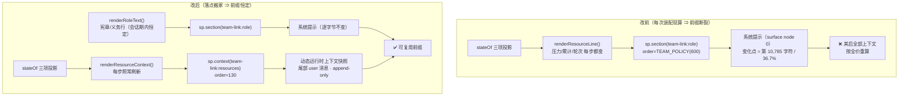

# 设计档 · 提示缓存保真（dsh-team-link 批 C）

> **状态**：**设计评审已通过**（2026-10-10 第二轮 `VERDICT: PASS`，design token 已签发）；评审遗留 1 🟡 + 4 🔵 已全部折叠进本档（FR-7 / §0.1 口径 / U4 / U8 前置）；用户已于 2026-10-10 签字，实施已派 `eng_coder`。
> **v1.1 修订（2026-10-10，首次交付的差异审计之后，父侧 architect 亲改）**：① §6.1 的 `renderRoleText` 签名补 `onError` —— 抛错**仍吞掉返回空串**（热路径不失败），但必须经 `onError` **留一行痕**（恢复批 2 的可见性；原「静默 `catch {}`」与 §9 fail-visible 矛盾）；② §8 U6 从四段降级扩为**五段**，补「两面都缺 ⇒ 合计至多两行」的夹具要求。**两处都是审计发现的、原设计自身的缺口，不是新功能。** 配对需求档 `docs/2026-10-10-prompt-cache-requirements.md`。
> 章节口径＝`METHODOLOGY.md`「设计文档的成文流程与必备章节」（事实源见全局 `~/.dsh/AGENTS.md` 第四节）。
> 诊断证据（原始读数、脚本、逐会话明细）＝`.investigations/prompt-cache-hit-rate-2026-10-10/结论.md`。
> **文字与图冲突时以文字为准并修图。**

---

## §0 给用户：三句话 + 一张图 + 已拍板的一条

> 本节是**白话入口**（全局规范「双读者」：用户读得懂 / agent 读得全）。技术内容从 §1 开始。
> 会诊意见的白话读本见 [`2026-10-10-prompt-cache-consult-report.md`](2026-10-10-prompt-cache-consult-report.md)。

### 0.1 三句话

1. **这事是什么**：本插件把一行「每次都在变的数字」（会话压力 / 累计用量 / 第几轮）写进了 AI 对话的**开头**。
   AI 服务商是按「开头有没有变」给缓存打折的 —— 开头一变，后面几万到几十万字的记录**全部按全价重算**。
2. **对你有什么影响**：实测 **10 个团队会话**，其中 **9 个**曾带这行数字；**glm-5.3 那 7 个**命中率 **0.5%–8.7%**，
   同一批会话**不带**它时是 **96%–99%**（另 2 个跑在 deepseek-flash 上，因路由声明不同，本来就只有 81.6%/96.3% —— 见 §2.3）。
   glm-5.3 一侧约 **3.6 亿 token** 从打折价变成了全价。（已完成止血：先把这行整个关掉。）
3. **建议怎么办**：把这行数字**从开头挪到末尾**（末尾本来就是每回合新增的内容，挪过去不碰可复用前缀），
   **功能一条不减**。本批就是把它在安全的位置上放回来。

### 0.2 一张图：为什么「开头变了」这么贵

```
AI 收到的内容 = [ 开头：系统提示 ][ 中间的聊天记录 ][ 本次的新消息 ]
                        ↑
              缓存就是从这里往后比对的

便宜的算法：从头一个字一个字对，遇到第一个不一样的地方 —— 从那往后全部作废，按全价重算

【改之前】数字写在开头里，每个回合都变：
  [ 开头 ……第 10785 个字处写着"压力 398.1K" ][ ← 从这里往后，几万到几十万字全部作废 → ]
                    ↑ 每回合都变

【改之后】开头永远不变，数字挪到末尾：
  [ 开头（永远不变）→ 缓存全中 ][ 聊天记录 → 缓存全中 ][ 本次新消息 + 一行数字 ]
                                                          ↑ 只有这一小块是新的
```

**一句话**：不是插件「坏了」，是它把**会变的东西**放到了**必须保持不变才能省钱**的位置上。

### 0.3 已拍板（用户 2026-10-10 裁定：**A —— 每步刷新**）

| 选项 | 做法 | 好处 | 代价 |
| --- | --- | --- | --- |
| **A ← 用户已选定** | 数字**每一步都刷新** | 长回合里压力一路涨，模型**当场看得见**（这正是当初加这行的原因：防它自己瞎报「预算用完了」） | 会话历史按步数变长（每步多一条约 60–400 字的小消息）；但这些消息静态可缓存、压缩可折，**不是全价开销** |
| B（未采纳，记录在案） | 数字**每个回合只刷新一次** | 历史增长降一个量级 | **回合内读数变陈**（跑了 20 步的回合，看到的还是回合开始时的旧压力）；且要放开本档 §6.2「纯读、不缓存」那条约束 |

**为什么选 A**：这行数字的作用就是让模型**当场**知道自己还剩多少余量；B 会在这个最需要它的时刻把它冻住。
**代价可控**：A 生效后加一条观测（U10）；若实测「每 3 步就多一条」，再另立小批评估 B —— **A 不是不可逆的**。

**裁定记录**：用户 2026-10-10 在看过会诊白话读本（[`2026-10-10-prompt-cache-consult-report.md`](2026-10-10-prompt-cache-consult-report.md) §五）后明确选择 **A**。
B 作为**未采纳选项**保留在上表（含其代价），并在 §9.2 记账 —— 它日后若要启用，走「另立小批 + 设计档更新」的正规路径，不静默改。

---

## §1 背景

2026-10-09 的团队自治批（`docs/2026-10-09-team-autonomy-design.md`）为解决「worker 自述预算耗尽」的幻觉，
加了 **FR-2 会话资源段**：一行随每次装配现算的读数（窗口 / 压力 / 累计 / 轮次），挂在
`agent.ctx.systemPrompt.section()` 上，与 **FR-1 协调者宪章段合并为一次注册**。

2026-10-10 用户实测发现会话 `team-link-2026-10-08-coordinator-d7ca53f8` 缓存命中率异常低，
委托排查。诊断结论（证据见 §2）：**这一行就是原因**，且代价是「每次它一变，该位置之后的整个上下文
按全价重算」。同批诊断覆盖 **10 个会话**（9 个曾带该段、1 个从未注册）、**3 支团队**、**2 个 provider**，聚合读数见 §2.2。

用户已裁定走**「真修」路线**（改落点、不减功能；在**诊断档**里它叫「B 方案」——注意与 §0.3 的 A/B 是**两个不同决策**，
评审 🔵#9 已指出字母撞名，此处改用不带字母的措辞），并已先执行**止血**
（`policy.sections.resources=false`，2026-10-10 17:37 落地、17:43 重启后验证生效；`team_link_status` 第 ⑧ 段已不再出现）。

---

## §2 问题

### 2.1 根因（带 `file:line`，全部为实读，非推测）

| # | 环节 | 证据 |
| --- | --- | --- |
| 1 | 资源行**每次装配现算**，其中三项随步前进 | `lib/index.js:3125-3153` `renderResourceLine()`：`压力`（`pressureTokens`）/ `累计`（`tokenUsage.totals` 四桶和）/ `第 N 轮`（`sessionStats.turns`） |
| 2 | 它以**函数型 `text`** 注册进**系统提示段** | `lib/index.js:3573-3579` `sp.section({ name: "team-link:role", order: sp.getSectionOrder("TEAM_POLICY"), text: (assembly) => renderRoleAndResources(...) })` |
| 3 | 该段在系统提示里**很靠前** | 宿主 `@deepseek-ai/dsh-system-prompt` 的 `SECTION_ORDERS`：`TEAM_POLICY = 600`，34 段里排第 4（前有 `HARNESS_IDENTITY -1000` / `DEPLOYMENT_PERSONA_PREFIX 0` / `PLAN_POLICY 500`） |
| 4 | 段一变 ⇒ 前缀缓存从该点起全部失效 | 宿主 `dsh-agent-loop/runtime-context.js` 把系统提示描述为「surface node 0 **及任何 in-history 替换**」——替换即断前缀 |

**实测佐证（同一会话）**：连续两次系统提示的**公共前缀 = 10,785 / 29,383 字符（36.7%）**，
差异区**只有 42–44 字符**，且**全部落在 `[team-link 会话资源]` 那一行内**；
所有 miss 请求的 `cacheReadTokens` 被钉在 **37,312 / 37,376 / 37,632** 三个常数上
（= 变化点之前的稳定前缀：工具定义 + 系统提示前 10,785 字符）。

### 2.2 现象（实测 **10 个会话**，其中 **9 个**曾带该段、1 个从未注册；「带该段」vs「不带该段」是同一批会话的两个区间）

| 会话 | 模型 | 带该段：请求 / 命中率 | 不带该段：请求 / 命中率 |
| --- | --- | --- | --- |
| mal · coordinator d7ca53f8 | glm-5.3 | 116 / **7.6%** | 207 / 96.2% |
| mal · worker-1 | glm-5.3 | 145 / **0.5%** | 625 / 99.0% |
| mal · worker-2 | glm-5.3 | 96 / **0.5%** | 1036 / 99.4% |
| mal · worker-3 | glm-5.3 | 110 / **6.5%** | 361 / 97.1% |
| mal · worker-4 | glm-5.3 | 10 / **8.2%** | 388 / 96.7% |
| mal · 旧任（**从未注册**） | — | 0 / — | 607 / 99.1% |
| pulse · coordinator | glm-5.3 | 102 / **7.8%** | 399 / 98.4% |
| pulse · worker-1 | glm-5.3 | 246 / **8.7%** | 1179 / 99.1% |
| bac · coordinator | deepseek-flash | 202 / 81.6% | 4 / 77.5% |
| bac · worker-1 | deepseek-flash | 141 / 96.3% | 622 / 99.1% |

> **口径（防三面对不上）**：表 **10 行 = 实测 10 个会话**；其中 **9 个**曾带该段（上表除「旧任」外），
> **7 个**跑在 glm-5.3 上（`116+145+96+110+10+102+246 = 825` = §2.2 下方聚合的请求数）、**2 个**跑在 deepseek-flash 上。

- glm-5.3 侧聚合：**825 个带段请求，prompt 389,680,612 token，命中 5.8%**；按同会话无段基线 98.2% 推算，
  约 **3.60 亿 token** 从"缓存命中价"变成"全价"。
- 切片（本会话全会话，n=323）：请求前系统提示**变过** ⇒ 119 次 / **7.7%**；**没变** ⇒ 204 次 / **97.2%**。
- **触发点**：该段在第 64 轮才被补挂上——`seq 1515` 一条要求跑 `team_link_roster action=upsert-team`
  的 inbox 消息（名册写入是一个 sync 触发点）→ `seq 1519` 系统提示首次出现该段 → `seq 1523` 该请求命中 6.5%。

### 2.3 附带的差异：**路由属性**，不是 provider 好坏（会诊 #34 后已闭环）

`deepseek-official/deepseek-flash` 上同一动态块的代价显著更小（bac 两例 81.6% / 96.3%）。本轮已闭环，双证：

1. **宿主文档原文**（桌面 `resources\app.asar` 实读）：
   > …a system node in place makes the request differ from that node's first token — in full when the node is node 0 —
   > so the provider **prefix cache misses from there**; when the prepared call declares `systemPromptUpdate: 'in-history'`,
   > a non-empty prompt change inside a continuing request series is **appended after the cached history**,
   > so the prefix through that history stays reusable.

   前半句正是本批**根因的宿主原话**；后半句解释差异。
2. **本会话 `request/context` 实测**：`seq 15` = `deepseek-official/deepseek-flash`，`systemPromptUpdate:"in-history"` **在场**；
   `seq 36` = `zai-coding-cn/glm-5.3`，该字段**缺席**。

⇒ `glm-5.3` 路由走「**原地替换 node 0**」⇒ 变化点起前缀全断（实测 0.5%–8.7%）；
`deepseek-flash` 路由声明 `in-history` ⇒ 提示变更**追加在缓存历史之后** ⇒ 前缀仍可复用（实测 81.6%–96.3%）。
**本批方案对两种路由都正确**，且在 glm 类路由上是数量级收益。

---

## §3 目标

### 3.1 做完之后什么变了

1. `team-link:role` 段在**整个会话期内逐字节恒定**（US-C3），系统提示不再逐回合变化；
2. 资源读数**仍然每回合刷新、仍在模型上下文里**（US-C2），一条不减；
3. 缓存命中率回到同会话无段基线水平（glm-5.3 上约 **98%–99%**）；
4. `sections.{role,resources}` 开关语义**逐字不变**（US-C4）。

### 3.2 非目标

见需求档 §三（NF-1…NF-5）：不修可达性缺口、不动 role 语义与另两处落点、零新增开关/schema/工具、不改宿主、
不做"取整降频"折中。

---

## §4 决策与理由

### 4.1 选定方案：资源行改挂 `systemPrompt.context()`（宿主的**动态运行时上下文**通道）

宿主有**两条**并列的提示贡献通道，`runtime-context.js` 自己把它们并列为「两条 loop-owned surface message」：

| 通道 | 注册 API | 宿主的描述 | 落点（实测） |
| --- | --- | --- | --- |
| 有序 **section** | `systemPrompt.section({name, order, text})` | 「surface node 0 及任何 **in-history 替换**」 | 系统提示（**前缀**） |
| 有序**动态上下文** | `systemPrompt.context({name, order, text})` | 「dynamic runtime-context **snapshot**」 | **尾部 user 消息**（append-only） |

**实测落点证据**：在本次被查会话里，宿主自己的动态上下文块
（`Current runtime context. This snapshot supersedes earlier runtime-context snapshots. …`）
出现在 `seq 11 / seq 33`，事件类型是 **`user/message`**，位置在真实用户消息之后、`request/header` 之前
——**根本不在系统提示里**。宿主自带的 sandbox / approval / subagent 三个贡献都走这条通道
（`CONTEXT_ORDERS = { SANDBOX_POLICY: 110, APPROVAL_POLICY: 115, SUBAGENT_DELEGATION: 120 }`）。

⇒ 把资源行从 `section()` 改挂到 `context()`，是**落点搬家、语义不动**，正好对上需求档 US-C2 + US-C4。

### 4.2 被否决的备选（逐条给否决理由）

| 备选 | 内容 | 否决理由 |
| --- | --- | --- |
| A′ | 并入既有 workbench digest 脚注（`digestFooters`，`lib/index.js:3465-3476`） | digest 有 FR-3b 的**去抖 + 签名门**（同一注册两条至少隔 10min、且只在有可行动内容时投）⇒「每回合自见压力」退化成「每 10 分钟可能见一次」，等于**偷偷砍掉 FR-2 的价值**，与 US-C2 冲突 |
| B′ | 用 `agent.followup()` 每回合注入一条资源行消息 | ① 需要「回合开始」触发点，**插件没有该钩子**（现有 followup 都由工具调用或看门狗定时器驱动）；② 每回合凭空多一条用户消息，污染对话记录；③ 与宿主自己的 time-context 机制**重复造轮子**，而那条轮子已经存在且带 `refreshIntervalMs` 节流 |
| C′ | 数字取整 / 降频后仍留在段里（原「C 折中」） | 只要那行**还会变**，每次变照样全量重读；且行为取决于变化频率，**不可证伪**（需求档 NF-5） |
| D′ | 整个段删掉，只靠工具返回重钉（U1 既有降级路径） | 等于放弃 FR-1（宪章每回合在场）——**代价大于收益**，且与本批「不减功能」的硬约束冲突 |
| E′ | 把资源行**重排到系统提示末尾**（调大 order） | **order 调不动这个账**：系统提示整体位于**全部历史之前**，就算排在最后一段，变化点之后仍是几十万 token 的历史（诊断里 `cacheRead` 钉在 37,312 已证明前缀结构是「工具 + 系统提示 + 历史」）。**会诊 #34 三方一致独立指出，必须显式关闭。** |
| F′ | 用 `variable()` 把读数插值到渲染期 | 变量是**插值进 section 文本**的（宿主 `PromptSection.interpolate`）⇒ 落点仍在系统提示，**同病** |
| G′ | 自建 `agent/pre-step` 监听器往尾部塞消息（time-context 的做法） | 缓存性质与 `context()` 等价，但**没有去重**（每步无条件发，需自带节流），且绕过宿主快照框架（排序 / supersedes 导语 / 压缩后重发感知）⇒ `context()` 严格更优。**会诊 #34 补入。** |

### 4.3 `order` 用字面常量：**宿主契约的规定用法**，不是本仓的破例

**会诊 #34 改判**：本档原先把它写成「一次经申报的例外」——**这是错的**。宿主 README 原文（桌面 `app.asar` 实读）：

> Repository-owned contributors resolve centrally allocated positions through `ctx.systemPrompt.getSectionOrder(name)`;
> runtime-context contributors use `getContextOrder(name)`. **External contributions may use any finite order.**

即 `CONTEXT_ORDERS`（110/115/120）是给**仓库自有贡献方**的中心分配表；**外部插件用任意有限 order 就是契约规定的用法**。
旁证：宿主自家包上一代就用字面量（`dsh-sandbox-policy` order 110 / `dsh-user-approval` 115 / `dsh-subagent` 120）。
校验确实只有 `Number.isFinite(order)`（`app.asar` 实读，与本节原引 `@58975105` 一致）。

- 取值：**`RESOURCE_CONTEXT_ORDER = 130`**。会诊建议改值：110/115/120 的下一个自然数**正是 125**，
  取 130 给宿主未来内置键留位（撞值本身无害——`contexts` 按 `a.order - b.order` 排、等值按注册序稳定——但没必要撞）。
- 纪律：这是本仓**唯一一处裸 order 常量** ⇒ 代码注释必须引上面那句宿主契约原文、登记在本档 §7.2、并由 U3 钉死 `order === 130`。
- **同步修一处矛盾**：`lib/index.js:3091-3093` 现有注释「order 一律取 `getSectionOrder(...)`，不用裸常量」说的是 **section** 面，
  但读起来像全称 —— 本批实施时同改该注释，点名 section / context 两面的区别（文档卫生第 5 条：描述面与实现一致）。

---

## §5 方案（FR-x）

| FR | 交付单元 | 落点 | 验收 |
| --- | --- | --- | --- |
| **FR-0** | **宿主面预检**（评审 🟡#7；纪要 G-opt 的裁定进设计档） | 实施第一步：在桌面 0.2.0-rc.1 宿主上确认 `typeof sp.context === "function"`、`typeof sp.getContextOrder === "function"`、`CONTEXT_ORDERS` 仍为三键（110/115/120）、130 未被占用。**静态实读已做过**（`app.asar` 文本），本步要的是**运行时 real call** | U0 |
| **FR-1** | **段去动态化** | `lib/index.js` 的 `renderRoleAndResources` 拆为 `renderRoleText(plan)`：只产宪章 / 义务行；资源行**从段里消失** | U1 / U2 |
| **FR-2** | **资源行改挂上下文通道** | 新增 `renderResourceContext(ctx, agent, onError)`（内容逐字沿用现 `renderResourceLine`）+ 在 `registerOne` 里加 `sp.context({ name: "team-link:resources", order: 130, text: fn })`（常量名与取值见 §4.3 / §7.2） | U3 / U4 |
| **FR-3** | **独立降级 + 生命周期** | 两个面**各自**探测、各自一次性 warn、**互不牵连**；两个 disposer 同表管理（代理消失即双释放） | U5 / U6 / U7 |
| **FR-4** | **开关语义保持** | `sections.resources=false` ⇒ 段里没有资源行、上下文通道也**不注册**；`role=false` ⇒ 段不注册、上下文照常 | U5 |
| **FR-5** | **夹具与判据同步** | `host-half.test.mjs` 的 `makeSystemPrompt` 桩加 `context()` **和 `getContextOrder()`**（**会诊 #34 K3**：桩镜像的是**宿主面**、不是自家调用面 —— AGENTS.md §四原文要求，本仓正是踩这个坑才漏过宿主改名）+ 上下文记录器与 `liveContexts()`；U6 系列断言改成读上下文记录 | U1–U11 全绿 |
| **FR-6** | **文档与变更史** | 同批改 `README.md`（服务表 + FR-2 描述）、`CHANGELOG.md`、自治批设计档 §5/§6 的资源行落点标注、`docs/verification-log.md` 追加本批读数 | NF-4 / 文档纪律 |
| **FR-7** | **止血回退 + 验收前置**（评审 🟡#1，**必须做**） | 实施完成后把 `policy.sections.resources` **恢复为 `true`**（撤销 A 止血），`sync()` 翻转即重挂，无需改注册代码。**不恢复就会让 U8 空转通过**：资源行整条缺席时命中率天然 ~99%，测的是「没这行」，不是「这行搬家成功」 | U8 前置 |

### 5.1 数据流（改前 / 改后）



---

## §6 机制伪代码（签名 + 前置 / 后置）

```js
/** §6.1 段渲染体：只产**会话期内恒定**的文本。
 *  前置：plan.switches 已由 sectionsView() 归一（缺省视为 true）。
 *  后置：同一会话连续两次调用返回值**逐字节相等**（本批核心不变量 U1）；
 *        任何输入下恒返回字符串（可能为空串），**不抛**。
 *  ★ v1.1 修订（差异审计 🔵⑦）：签名补 `onError` —— 抛错时**仍然吞掉并返回空串**（热路径绝不让装配失败），
 *    但必须经 `onError` **留一行痕**（一次性门），与 §6.2 对称，并恢复批 2 的可见性。
 *    **不许静默吞**：§9 的失败方向是 fail-visible，静默 `catch {}` 与它矛盾。 */
function renderRoleText(plan, onError)                 // 取代 renderRoleAndResources 的角色那一半
// try {
//   if (!plan.switches.role) return "";
//   return plan.kind === "coordinator" ? renderCharterLines(plan.team, plan.sessionId)
//                                      : renderWorkerDutyLine(plan.team, plan.role);
// } catch (error) { onError?.(error); return ""; }

/** §6.2 上下文渲染体：每回合现算，落点在尾部。
 *  前置：ctx 可用；agent **由注册时闭包捕获**（见下方「会诊 #34 更正」）。
 *  后置：恒返回字符串；任一项读不出来 ⇒ 「不可读（<原因码>）」，**绝不编数**（沿用 FR-2 原口径）；
 *        纯读：不写、不缓存、不改宿主状态；抛错则吞掉 + 一次性留痕，返回空串。
 *
 *  ★ 会诊 #34 更正：宿主 `AssembleContext = { scope?, signal? }` —— **没有 `agent` 字段**（`app.asar` 实读），
 *    所以 `assembly?.agent` **恒为 undefined**。现行 `lib/index.js:3578` 同病，
 *    只因后面有 `?? agent` 兜底才一直没炸。实现直接闭包捕获注册时的 agent，**不要写这条死路径**。 */
function renderResourceContext(ctx, agent, onError)    // 内容逐字沿用现 renderResourceLine
// try { return renderResourceLine(ctx, agent); } catch (e) { onError?.(e); return ""; }

/** §6.3 注册（改后）。
 *  命名（评审 🟡#4 统一）：`effective` = 由 `plan` 归一而来的注册计划（`{ ...plan, switches }`，与现行实现同名，
 *    下文一律用它，不再出现裸 `plan`）；`warnRender` / `warnSectionFace` / `warnContextFace` = 三个**各自独立**的
 *    一次性留痕门（`warnRender` 就是 §6.2 那个 `onError` 实参——同一个函数的两个名字，实现时统一为 `warnRender`）。
 *  失败方向（评审 🟡#5 澄清）：任一面缺失 ⇒ **该面**零注册 + **该面恰一行** warn，另一面照常注册
 *    ⇒ 两面都缺时合计**至多两行**（不是一行）；连 `sp` 都拿不到时才走 `warnUnsupported` 的**恰一行**（既有口径原样保留）。 */
function registerOne(plan, switches) {
  if (!switches.role && !switches.resources) return false;         // 原样
  const effective = { ...plan, switches };                          // ← 归一，闭包捕获这一份
  const agent = ctx.agents.get(effective.sessionId);
  if (agent === undefined) return false;                           // 原样：只对活代理
  const sp = agent.ctx?.systemPrompt;
  if (sp == null) { warnUnsupported("宿主没有 agent.ctx.systemPrompt"); return false; }  // 恰一行（整面缺席）
  const disposers = [];
  if (switches.role) {                                             // 面：section + getSectionOrder
    if (typeof sp.section !== "function" || typeof sp.getSectionOrder !== "function")
      warnSectionFace();                                           // 一次性，恰一行
    else disposers.push(sp.section({ name: ROLE_SECTION_NAME,
                                     order: sp.getSectionOrder(ROLE_SECTION_ORDER_KEY),
                                     text: () => renderRoleText(effective, warnRender) }));   // ← v1.1：段面也要 onError 留痕（评审 🔵#3 补）
  }
  if (switches.resources) {                                        // 面：context（独立探测）
    if (typeof sp.context !== "function")
      warnContextFace();                                           // 一次性，恰一行（新文案）
    else disposers.push(sp.context({ name: RESOURCE_CONTEXT_NAME,
                                     order: RESOURCE_CONTEXT_ORDER, // = 130，见 §4.3（宿主契约允许任意有限 order）
                                     text: () => renderResourceContext(ctx, agent, warnRender) }));  // ← 闭包捕获 agent（§6.2 更正）
  }
  if (disposers.length === 0) return false;
  registered.set(effective.sessionId, { ...effective, disposers }); // ← 「disposer」改数组
  return true;
}

/** §6.4 释放（U7）：两个面一起释放。 */
function disposeOne(sessionId) {
  const entry = registered.get(sessionId); if (entry === undefined) return false;
  registered.delete(sessionId);
  for (const disposer of entry.disposers) { try { disposer(); } catch (e) { warn(e); } }
  return true;
}
```

**`sync()` 的「同一条」判据**（`lib/index.js:3604-3605`）**原样适用**：开关翻转仍触发 dispose + 重注册，
所以 `sections.resources` 从 false 翻回 true 时，上下文通道会被**重新挂上**（不需要重启）。

---

## §7 状态与 schema

### 7.1 持久化：**零变更**

沿用 `policy.sections = { role: bool, resources: bool }`（缺省 true）。**不新增任何字段、不新增文件。**

### 7.2 进程内状态（`createSections` 的闭包）

| 名字 | 改前 | 改后 | 谁写 / 谁读 |
| --- | --- | --- | --- |
| `registered: Map<sessionId, entry>` | `entry.disposer: fn` | `entry.disposers: fn[]`（至多 2） | 写：`registerOne` / `disposeOne`；读：`sync`（同一条判据）、`__testing.sectionsFor` |
| `unsupportedWarned` | 一个一次性门 | **两个**一次性门（段面 / 上下文面），语义各自独立 | 写：对应 warn 函数；读：`warnState()` |
| `ROLE_SECTION_NAME` | `"team-link:role"` | 不变 | — |
| `RESOURCE_CONTEXT_NAME` | — | **`"team-link:resources"`**（新） | 注册用 |
| `RESOURCE_CONTEXT_ORDER` | — | **`130`**（新；§4.3 —— 宿主契约允许外部贡献方用任意有限 order） | 注册用 |

**没有第三处落点**：资源行的其它两个出口（workbench digest 脚注 `digestFooters`、`team_link_status` 第 ⑧ 段）
**本批一字不动**。

★ **会诊 #34 补**：worker 的**合并快照**比协调者多一条 `subagent:delegation`（order 120，宿主在 worker 的 scoped ctx 上注册，
真机可证 worker 收到 4 份快照）。资源行每步变 ⇒ 整条合并快照（含 delegation 句）每步重发
⇒ **worker 侧每步新增历史略大于协调者**。这条必须与「没有第三处落点」并列点出（详见 §9 的历史增长边界）。

---

## §8 防偏离（怎么被机械验证）

| # | 判据（断言名以落地为准） | 红相构造（必须**先红后绿**） | 落点（评审 🔵#12） |
| --- | --- | --- | --- |
| **U0** | **宿主面预检**（FR-0）：桌面 0.2.0-rc.1 上 `typeof sp.context === "function"`、`typeof sp.getContextOrder === "function"`、`CONTEXT_ORDERS` 仍为三键、130 未被占用 | 任一条不成立 ⇒ 停，走 §9 换代复核路径（不硬改） | 实施前手工 real call（非测试文件） |
| **U1** | **段文本跨步恒定**：同一会话连续两次装配，`section` 记录的 `text()` 返回值**逐字节相等**（`===`，非 trim、非包含） | 把资源行塞回段渲染体 ⇒ 两次装配（投影读数改一次）不等 ⇒ 红 | `host-half.test.mjs` |
| **U2** | 段文本**零命中**：`"[team-link 会话资源]"` 字面量，以及 `压力` / `累计` / `第 <数字> 轮` 三个模式。**禁止**用裸 `轮` 做模式（宪章文本含「轮询」会假红 —— 评审 🔵#11，已用真实文本核对见下） | 同上 | `host-half.test.mjs` |
| **U3** | 资源行**走 `context()` 通道**：记录 name=`team-link:resources`、`order === 130`、`typeof text === "function"` | 不注册 / 挂回 section ⇒ 红 | `host-half.test.mjs` |
| **U4** | 上下文渲染出的资源行与 `stateOf` 读数**逐项一致**：四项展示值（窗口 / 压力含百分比 / 累计 / 轮次）← 三个 key（`contextPressure` / `tokenUsage` / `sessionStats`），且**只读**这三个 key；**且渲染结果是单行**（不含换行 —— NFR-4 的判据落在这里，评审 🔵#4） | 照搬原 U6 的红相（改桩读数 ⇒ 行不跟着变）；渲染体若拼进换行 ⇒ 单行断言红 | `host-half.test.mjs` |
| **U5** | `resources=false` ⇒ **段里没有**资源行 **且**上下文通道**零注册**；`role=true` 时段仍在（宪章在场） | 把开关只接到其中一处 ⇒ 红 | `host-half.test.mjs` |
| **U6** | 面缺失的**五段降级**（评审 🟡#5 补对称分支；差异审计 🔵⑥ 补第五支）：① 没有 `sp` ⇒ 零注册 + **恰一行**；② 有 `section` 无 `context` ⇒ 段**仍注册**、上下文零注册、**恰一行**新文案，**无连带**；③ 有 `context` 无 `section` ⇒ 对称：上下文**仍注册**、段零注册、恰一行；④ `context` 注册抛错 ⇒ 同 ② 且不抛到调用方；⑤ **两面都缺**（`sp` 在但 `section`/`getSectionOrder`/`context` 都不是函数）⇒ **零注册**且**两面各恰一行**（合计**至多两行**，不是一行）—— 此输入原先**无夹具**，「两面共用一个门 / 短路成一行」的变异打上去套件不响 | 让两处共用一个 warn 门 / 让 `context` 缺失牵连段 / 两面都缺时只报一行 ⇒ 红 | `host-half.test.mjs` |
| **U7** | 代理消失 ⇒ 注册表清空 **且两个** disposer **各被调用一次**（两个记录各自的计数 `=== 1`，合计 `2`；实现若用单一数组计数则断言 `=== 2`） | 只释放一个 ⇒ 合计 1 ≠ 2 ⇒ 红 | `host-half.test.mjs` |
| **U8** | **真机验收（本批最终判据，可证伪）· 双读数**（会诊 #34 ④-2/K5 要求）：改后**至少一名协调者会话 + 至少一名 worker 会话**（glm-5.3）各自缓存命中率 **≥ 95%**；两类会话的系统提示都**不再逐回合变化**。worker 必须单列 —— 诊断里 worker 带段命中率（0.5%）比协调者（7.6%）**更差**，只量协调者会漏掉最受伤的一类。**★ 前置（评审 🟡#1，防空转）**：跑之前必须先做 **FR-7**（恢复 `resources=true`），并断言被测会话的快照里**实际含** `team-link:resources`（与 U11 同一手法）—— 否则测的是「资源行缺席」，命中率天然 ~99%，U8 会假绿 | 改后命中率仍 <95% ⇒ **本方案证伪**，执行 §9 退路；资源行缺席而 U8 绿 ⇒ 判为**空转**，不成立 | 真机：解码新会话日志（脚本见 `.investigations/…/scripts/`） |
| **U9** | **两类会话同覆盖**（用户 2026-10-10 明确要求）：夹具同时种 coordinator 与 worker 两个现任，断言**两者**都拿到 `context` 注册（name/order 相同）、**两者**的段文本都逐字节恒定、worker 的段文本仍含义务行且**不含**资源行 | 只给协调者挂 context（或让 worker 走旧路）⇒ worker 那条红 | `host-half.test.mjs` |
| **U10** | **快照账辅助读数**（会诊 #34 D3/K2）：统计每会话 owned 快照条数 ÷ 请求数，以及该比值带来的历史 token 增量 | 只观测**不设阈值**；若实测 >1 条/3 请求，另立小批加「回合门」（§9 的 B 选项） | 真机：会话日志统计 |
| **U11** | **压缩后仍在**（会诊 #34 K5）：一次**全量压缩之后**发出的快照，其 `sections` 数组里仍可 grep 到 `team-link:resources` | 压缩把已注册的贡献一起折掉 ⇒ 红 | 真机：会话日志 grep |

**🔵#11 的核对读数（评审员自认未读代码，本条由本轮补齐）**：宪章 `renderCharterLines()`（`lib/index.js:3160-3170`）
与义务行 `renderWorkerDutyLine()`（`lib/index.js:3182-3184`）的**真实文本**里，`"[team-link 会话资源]"` / `压力` / `累计` / `第 <数字> 轮`
**四个模式全部零命中**；文本里唯一含「轮」的是第 3 条宪章的「不必**轮询**」—— 所以禁词模式**必须**写成 `第 <数字> 轮` 而非裸 `轮`，
否则会假红。**结论：U2 不需要放宽，需要把模式写准。**

**锚测试**：U1 是本批的锚 —— 它不依赖任何新机制，只断言"段文本不随步变化"，
所以它同时对**未来任何**把动态内容塞回段里的改动报警。

**复核纪律**（AGENTS.md 一）：修复必须给「修复前必红 / 修复后全绿」两次实测读数；
`node host-half.test.mjs` 与 `node client-half.test.mjs` 各自贴首尾行。

---

## §9 边界

| 面 | 行为 |
| --- | --- |
| **空集** | 没有团队 / 会话不是任何角色持有者 ⇒ `planSections` 不产出 ⇒ 零注册（原样） |
| **畸形输入** | 投影读不出 / 抛错 ⇒ 资源行照旧渲染「不可读（<原因码>）」，**不编数**（原口径，U4 迁移覆盖） |
| **并发** | 渲染体同步、纯读、不抛（宿主装配是热路径）；`sync()` 幂等；两条通道互不牵连 ⇒ 一处失败不会让段跟着消失 |
| **重启** | 注册表是进程内 ⇒ 重启后由 attach 重建（原样）。**本批不修可达性缺口**（NF-1）：重启后若某会话一直没被 sync 到，它既没有段也没有资源行 —— 安全方向（不会击穿缓存），且另立批次处理 |
| **升级（宿主换代）** | 宿主若把 `context()` 改名 / 移除 ⇒ 走 U6 ③ 降级：**段不受牵连**，资源行退到 digest 脚注 + 状态卡第 ⑧ 段。按 AGENTS.md §四，换代复核时**必须**把 `context` / `getContextOrder` 加进核对清单 |
| **失败方向** | **fail-visible**：任一面缺失 ⇒ 该面零注册 + 恰一行 warn；**绝不**让任何会话的提示装配因为本插件失败 |
| **历史增长（快照追加）** | 会诊 #34 三方**独立**指出的**二阶代价**：`RuntimeContextProjection.project()` 按**整条合并快照文本**去重（`if (this.retained?.text === snapshot) return`），资源行每步变 ⇒ **每步往历史追加一条持久化 owned `user/message`**（`surfaceOp:"append"`，旧快照不删，直到被压缩 shadow）。三方估算 60–400 tok/条（取值待实测，见 U10）；500 步 ≈ 3–6 万 token。**这些消息一旦追加即静态、全部可缓存**，且会被压缩折掉 ⇒ 代价是**历史膨胀**，不是缓存击穿 |
| **读数自反馈** | 资源行报的「压力/累计」把快照消息自身也计入 ⇒ 读数每步被自己抬高一点点（每条 ≈ 窗口 0.02%，收敛）。如实标注，免得 U4 的「逐项一致」判读被「为什么压力永远在涨」纠缠 |
| **抑制器（静默失效）** | 会诊 #34 补：任何 persona / preset 行设 `includeRuntimeContext:false` ⇒ 调 `suppressRuntimeContext()` ⇒ 该 agent 作用域的**全部** context 贡献被整列清空。此时本插件**注册照常成功但不显示**，且 **FR-3 的面探测抓不到**（API 上查不到抑制状态）⇒ 资源行静默退到 digest 脚注 + 状态卡第 ⑧ 段（**这两处不受抑制器影响，是天然兜底**）。本部署实测**未被抑制**（worker-2 实收 4 份快照） |
| **lineage seed** | worker 会话可从父会话 fork 种子历史（`childSessionMeta.seedLength`）；快照仍追加在**子会话尾部**，种子历史不受影响，无特殊处理 |
| **order 撞值** | 宿主日后新增内置 context 恰好取 130 ⇒ 两条独立上下文行的**相对顺序**漂移，但两者照常渲染、无功能损害（`contexts` 按 `a.order - b.order` 排、等值按注册序稳定排序） |

### 9.1 落点的缓存性质：**已证机制**（会诊 #34 后从「待测假设」升格）

**结论**：`systemPrompt.context()` 的落点是**追加式**的 ⇒ 变化点从「系统提示 36.7% 处」移到**请求尾部**，
失效区间从「系统提示后缀 + 全部历史」缩到「快照消息 + 当前用户消息」。

**措辞更正（会诊 #34 D2）**：不是「不使 KV Cache 失效」——任何变化都会使**变化点之后**失效；
本方案的收益是**把变化点搬到尾部**。

**四条独立证据**（三条会诊回复各自独立给出，加本档自证）：

| # | 来源 | 证据 |
| --- | --- | --- |
| 1 | kimi-k3（**一手真机**） | worker-2 会话日志：**1575 处 `surfaceOp` 全部是 `append`**，零 replace/remove/update/patch；4 份 runtime-context 快照（seq 11/104/1539/2835）**全部留存**、无移除事件；37 条 time-context 尾部追加与 **92%–99.8% 命中**共存 —— 这就是「每步往尾部塞变化文本不击穿缓存」的实测定理 |
| 2 | glm-5.3（宿主源码链） | `assemble` 把 contexts 独立于系统提示产出 → `project()` 按文本去重 → 变化时以 `surfaceOp:"append"` 提交 owned `user/message`；宿主 `dsh-session` 文档原话：**「Appended surface entries preserve reusable prefixes. A `replace` operation invalidates reuse from the first shadowed message.」** |
| 3 | deepseek-v4-pro（宿主源码链） | `preStep` → `assemble()` → `joinContextSections` → `runtimeContext.project()`；快照以 `user/message` + `surfaceOp:"append"` 追加在**已认领消息之后、本步执行之前**（请求尾部倒数第二） |
| 4 | 本档自证 | 被查会话 `seq 11/33` 的快照是 `user/message`，位于真实用户消息之后、`request/header` 之前 |

**U8 仍保留**：机制对 ≠ 部署对 —— 端到端命中率必须在真机上按 U8 量（并保留退路）。

- **退路（若 U8 红）**：资源行退回 **digest-only**（删掉 `context()` 注册，功能收窄为「workbench digest 脚注
  + 状态卡第 ⑧ 段」），并把 FR-2 的原始意图（每回合自见）作为已知损失登记进设计档与 README。
  **退路不包含**任何「再塞回系统提示」的选项（那等于把 §2 的缺陷重新引入）。

### 9.2 二阶代价的两种处置（会诊 #34 B-opt；**用户 2026-10-10 裁定：A**）

| 选项 | 做法 | 代价 |
| --- | --- | --- |
| **A ← 用户已选定，本批发货** | 照设计走：每步渲染、插件侧零缓存；只在 §9 记账 + U10 观测 | 会话历史按步数增长（静态可缓存、压缩可折） |
| **B（未采纳，记录在案）** | 渲染体按 `sessionStats.turns` 门控：同一回合内返回上一条字符串，回合号前进才现算 | 更贴 US-C2「每回合」字面、历史增长降一个量级；但违背 §6.2 自设的「纯读、不缓存」约束（需改写该约束），且**回合内读数变陈** —— 长回合里压力增长恰恰是最该看见的时刻 |

**判据**：U10 若实测 >1 条/3 请求，另立小批评估 B（届时须先提设计档更新，经用户确认，不静默改）。
