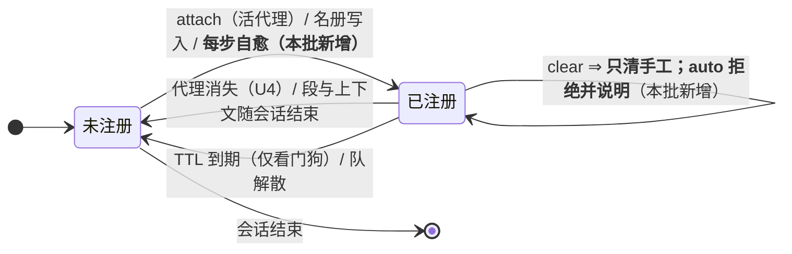
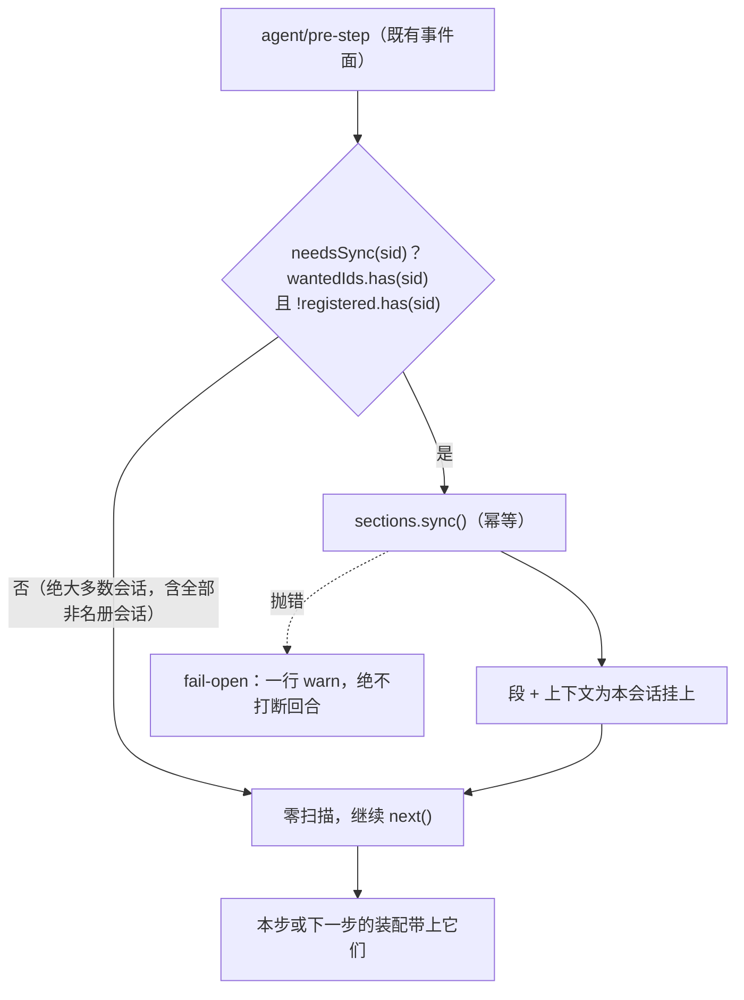

# 设计档 · 注册生命周期与自动提示（dsh-team-link 批 D）

> **状态**：待用户确认（2026-10-10 立项）。配对需求档 `docs/2026-10-10-registration-lifecycle-requirements.md`。
> 章节口径＝`METHODOLOGY.md`「设计文档的成文流程与必备章节」（事实源见全局 `~/.dsh/AGENTS.md` 第四节）。
> **文字与图冲突时以文字为准并修图。**

---

## §0 给用户：三句话 + 一张图 + 一个待拍板项

### 0.1 三句话

1. **这事是什么**：插件的三类注册（角色段 / 资源读数 / 工作台摘要）各有各的「一生」，本批修的是它们的**两头** ——
   **该在的时候没在**（重启后不会自动挂上，要人肉跑命令）、**不该丢的时候被丢了**（协调者一句普通命令就能把全队摘要清掉）。
2. **对你有什么影响**：前者让你每次重启后都得手动「踢一脚」，否则插件等于半哑；后者会让某个队的自动提示**静默消失**，
   而且**这个坑今天已经踩过两轮**（17:43 建的那条在 22:47 前就没了，attach 只好重建一条）。
3. **建议怎么办**：让注册**自己长回来**（挂在每步的廉价检查上，非团队会话零代价），并让 `clear` **只清手工注册**；
   顺带把那条「教人 clear」的脚注文案改准。

### 0.2 一张图：三类注册的一生（改后）



### 0.3 已拍板：**A —— 做掉 D-3**（用户 2026-10-10 确认）

| 选项 | 做法 | 代价 |
| --- | --- | --- |
| **A ← 已选定** | **做掉 D-3**：资源读数按「回合」门控，同一回合内返回上一条 | 违背 `docs/2026-10-10-prompt-cache-design.md` **§6.2** 自设的「纯读、不缓存」约束（本档 §4.3 已改写为「允许一份进程内门控缓存，随注册生命周期释放」）；回合内读数变陈 |
| B（未采纳，记录在案） | **判定为「不做」**并把实测读数登记进验证账本 | 每步多一条 ~140 token 的持久化快照（实测 **0.02%** 量级） |

**背景**：批 C 实测快照 **0.93 条/请求**，越过批 C 设计档 §9.2 的触发线（>1 条/3 请求）⇒ 按该节应评估。
量级是 140 token 对 ~70 万 token = **0.02%**，且那些消息追加后即静态、照走缓存价 —— 所以 B 曾是合理选项。
**裁定记录**：用户 2026-10-10 原话「OK， 走工程模式 评审-实施」⇒ 按本档原建议取 **A**。

### 0.4 v1.1 修订（父侧，2026-10-11 · 首次交付与差异审计之后）

| # | 改了什么 | 为什么 |
| --- | --- | --- |
| ① | §6.5 的拒绝回执**补「该注册未清除」** | 本档 §8 的 **U6 判据要求回执含「未清除」**，而 §6.5 的伪代码**没写** ⇒ **判据与规格打架**（与批 C 的 order 125/130 **同类**）；实现按伪代码写 ⇒ 交付态 **2 条红** |
| ② | **FR-2 扩到告警 tick 正文**（`lib/index.js:2635`）+ 新增 **§6.7** | 审计 D1 **用代码核实**：auto 观察者**确实会收到告警 tick**（`:2946-2962` 的 `if (suppressed && !workbench) return;`）⇒ 而该正文仍建议「不再需要盯人可用 `team_link_watch clear`」—— 与 §0.1 的目标（**不得教人做坑全队的事**）同族，**本档原漏了这个面**；交付方称「tick 只投手工观察者」的豁免理由**不成立** |

**两条都是本档自身的缺口，不是新功能。**

---

## §1 背景

批 C（`docs/2026-10-10-prompt-cache-design.md`）把资源行从系统提示段搬到动态上下文通道，真机验收通过
（协调者稳定区间 99.90%、worker-1 99.55%，读数见 `docs/verification-log.md` 的「2026-10-10 · 批 C **真机验收**」与「2026-10-10 · **D-2 取证**」两节）。
**验收过程当场踩到两处与批 C 无关、但影响面更大的缺陷**（D-1/D-2）；D-3 则是批 C 设计档 §9.2 写明的既定后续。
三者同属「注册的生命周期」这一族，故合为一批。

---

## §2 问题

### 2.1 D-1：重启后不会自动补挂（可达性）

**根因（实读）**：`createSections` 的 `sync()`（`lib/index.js:3592` 起）只有两个调用面 ——
① `policy.onAttach`（attach 后置链）；② 五个名册写入点。而 `registerOne`（`:3645` 起）**只对活代理注册**
（`ctx.agents.get(sessionId) === undefined ⇒ return false`）。
⇒ 重启时若**没有任何会话活着**，attach 扫到的活代理集为空 ⇒ **注册 0 个**；此后某个会话被打开（成为活代理）
**不触发任何 sync** ⇒ 它永远拿不到段与上下文，直到下一次名册写入或下一次 attach。

**真机读数（2026-10-10，团队 2026-10-08）**：

| 时刻 | 事件 | 读数 |
| --- | --- | --- |
| 23:02:44 | 重启 attach | 段同步「计划变化 0 项；**在场 0 个段**」 |
| 23:41:22 / 23:41:51 | worker-1 跑了两步 | 系统提示**无**义务行（`不要静默等待`/`职责边界` 皆 false）、快照**无**资源行 |
| 23:46:41 | 协调者跑 `upsert-team`（名册写入） | 触发 sync |
| 23:46:40 起 | worker-1 再跑一步 | 系统提示 `28855 → 28993`（**+138 字符 = 义务行**）、快照出现 `[team-link 会话资源]` 行 |

⇒ **同一会话、同一份代码，差别只在是否有人跑过一条名册写入。** 这就是 2026-10-10 第 64 轮
「角色文本没同步」的同一根因（批 C 的触发点即由此而来）。

### 2.2 D-2：一句普通命令就能丢掉全队的工作台摘要（所有权）

**根因（实读）**：`team_link_watch action=clear`（`lib/index.js:12730`）取 `own` ＝**调用方会话的全部注册**，
**不分 `origin`** ⇒ 现任协调者一句 `clear` 就把 `watcher = 自己` 的那条 **auto 工作台注册**一起删掉。
而工作台摘要的脚注（`:2724`）**主动建议**这么做：
> （同一注册两条摘要至少隔 10min，只在有可行动内容时投；**不需要盯人可 team_link_watch clear —— 不带 id 即清掉自己的全部注册**。）

—— **脚注的收件人正是协调者，而它要清的「自己的注册」里包含全队资产。**

**真机读数（2026-10-10）**：

| 时刻 | 事件 | 读数 |
| --- | --- | --- |
| 23:32:44 | 工作台摘要投给协调者 | 脚注含上面那句 |
| **23:32:55** | **协调者调用 `team_link_watch {"action":"clear"}`（无 id）** | 会话日志 `tool/call` 逐字 |
| 23:46:48 | 插件下一次写盘 | `policy.watchdogs` **8 → 7**，`2026-10-08` 消失 |
| — | 被删那条的 `expiresAt` | `2026-10-11 10:47:44`（**未到期**） |

**排除自动路径**：`removeWatchdog`（`:2791`）全仓**唯一**调用者是 `patrolOne` 的 TTL 自清（`:2930 if (now > entry.expiresAt)`）；
`armTeamWatchdog`（`:2573-2587`）的写入是 `[...current, entry]` / map 刷新，**从不丢条目**；`ensureTeamAutoWatchdogs`（`:2471`）是「缺失才写」。
⇒ 只剩 clear 一条路，与会话日志逐字吻合。

**同一坑已踩两轮**：17:43 attach 建的 `wd-1b434115`（17:46 还在、到期 10-11 05:43）到 22:47 已不在 ⇒
22:47 attach 又建了 `wd-eb183fac`（22:47:44 建、到期 10-11 10:47）⇒ 23:32 又被 clear 掉。

### 2.3 D-3：每步一条持久化快照

**读数**：协调者重启后 **13 条快照 ÷ 14 个请求 ≈ 0.93 条/请求**；worker-1 注册后 1 ÷ 1 = 1.0。每条 483 字符（≈140 token）。
机制：宿主的 `RuntimeContextProjection.project()` 按**整条快照文本**去重，而资源行的「累计」每步都变 ⇒ 每步追加一条 owned `user/message`。
**量级**：140 token 对 ~70 万 token 上下文＝**0.02%**；追加后即静态、照走缓存价、会被压缩折掉。

---

## §3 目标

### 3.1 做完之后什么变了

1. 重启后打开任一团队会话，**该步（或最迟下一步）**就带着角色文本与资源读数，且**全程不需要人肉跑命令**（US-D1）；
2. `clear` **再也拿不走** auto 工作台注册，且拒绝时**说清原因**（US-D4/US-D6）；
3. 摘要脚注的文字与 `clear` 的真实作用域**逐字一致**（US-D5）；
4. 自愈是 **O(1)** 的：非名册会话每步零扫描（US-D2 / NFR-2）。

### 3.2 非目标

见需求档 §三（NF-1…NF-5）：不新增用户可见动词、不改 attach 链、不改看门狗 TTL/去抖/阈值、D-3 可被判定为不做、不碰 digest 形态与状态卡第 ⑧ 段。

---

## §4 决策与理由

### 4.1 D-1 选定：**事件驱动的廉价自愈**（挂在既有 `agent/pre-step` 面）

- **为什么不是轮询**：定时器方案（备选 b）要把「半哑窗口」设成一个周期，且给每个部署加一个常驻定时器；
  本仓既有取舍一贯是**事件优先**。
- **为什么不赌「代理诞生」事件**（备选 c）：本仓 `ctx.on` 至今只用到 `agent/pre-step`（`:360`）与 `agent/request`（`:8608`），
  **未验证**存在代理诞生事件 ⇒ 不把设计押在未核实的宿主面上。
- **为什么不做「全局一次注册」**（备选 d）：段面本来就按会话分叉（协调者宪章 / worker 义务行），全局注册仍需 per-agent 渲染；
  而会诊 #34 对 `AssembleContext` 是否带 `agent` 字段**存疑**（宿主自带的 sandbox 包用 `context.agent`，但类型声明里未见该字段）
  ⇒ **不作为主路**（本档不假装它已被排除，只声明「不确定 ⇒ 不用」）。

### 4.2 D-2 选定：**收窄 `clear` 的作用域**（auto 不可手工清除）

- **为什么不是「可自愈」**（备选乙：清了就清了，下次 attach/巡逻补挂）：`clear` 会变成「暂时静音」，
  与脚注「不需要盯人」的直觉不符，且半哑窗口不可预期。
- **为什么本批不加 `disarm-team` 这类显式关闭动词**（备选丙）：新增用户可见动词要自己的设计档与判据面 ⇒ 记为后续项（NF-1）。

### 4.3 D-3 选定：**做回合门**（用户 2026-10-10 拍板 A，见 §0.3）

- **为什么不是 B（判定不做）**：批 C 设计档 §9.2 把「>1 条/3 请求」写成触发线，实测 **0.93 条/请求已越线** ⇒
  若判定不做，就必须**同批**把那条阈值连同「为什么它不再适用」一起改掉，否则档里会留一条永远为真的悬空判据。
  两相比较，**把门做出来**比**改判据**更省事，也更符合该节原意。
- **代价如实声明**：本批把 `docs/2026-10-10-prompt-cache-design.md` **§6.2** 的「纯读、不缓存」**改写**为「**纯读宿主状态**；允许一份**进程内、只用于门控**的
  字符串缓存，随注册生命周期释放（U8）」。回合内读数变陈是**设计上接受的**代价（长回合里压力增长看不见）；
  若日后证明这是真损失，走「另立小批 + 设计档更新」。

---

## §5 方案（FR-x）

| FR | 交付单元 | 落点 | 验收 |
| --- | --- | --- | --- |
| **FR-1** | **自愈触发**：`createSections` 暴露 `needsSync(sessionId)`（两个 O(1) 查表）与「期望注册集」缓存；注册一条 `agent/pre-step` 监听器，命中才 `sync()` | `lib/index.js` 的 `createSections`（`:3497` 起）+ 新增监听器 | U1 / U2 / U3 |
| **FR-2** | **`clear` 只清手工**：`removable` 过滤掉 `origin === "auto"`；命中 auto 时拒绝并给一句点明归属的回执（**含「未清除」字样** —— v1.1 修订，见 §0.4）；**同步改两处文案**：摘要脚注（`:2724`）**与告警 tick 正文**（`:2635`，**v1.1 修订**：审计 D1 用代码核实 auto 观察者**也会**收到告警 tick，交付方原称「只投手工」的豁免理由**不成立**，见 §6.7） | `lib/index.js:12730` 起 + `:2724` + `:2635` | U4 / U5 / U6 |
| **FR-3** | **回合门**：`renderResourceContext` 按 `sessionStats.turns` 门控，同一回合内返回上一条（**用户 2026-10-10 拍板，见 §0.3/§4.3**）。★ 连带（评审 🟡#3）：**必须同批改写**批 C 已落地、会与回合门相撞的既有断言 —— 清单见 **§5.2** | `lib/index.js:3270` 起 | U7 / U8 + **§5.2 全绿** |
| **FR-4** | **文档与判据同步**（评审 🟡#1/#2/#6 折入）：① README 的能力/用法描述；② CHANGELOG；③ `docs/verification-log.md` 追加真机读数 **＋ D-2 的取证小节**（原指针为空）；④ **`docs/2026-10-10-prompt-cache-design.md` §6.2 的就地 as-of 改写注记** —— 本批 §4.3 改写了它的「纯读、不缓存」约束，不改就会两档各执一词；⑤ **`AGENTS.md` §四 追加一段**（**本批决定动它**）：点名 `agent/pre-step` 为换代复核项（内容由父侧给定、任务书指名落笔） | 同名五档 | NF-4 / 文档纪律 |

### 5.1 数据流（D-1 自愈）



### 5.2 既有断言的**语义改写清单**（评审 🟡#3 · FR-3 的连带，必须同批做）

回合门生效后，「资源行**每一步**都跟着读数变」不再成立 ⇒ 批 C 已落地、按该性质写的断言会转红。
**纪律：改写而不是删除，逐条留证**（批 2 的先例）—— 每条都保留原判据的**意图**，只把「步」换成「回合」。

| 既有断言（批 C 落地，见 `docs/verification-log.md` 的批 C 各节） | 原意图 | 改写为 |
| --- | --- | --- |
| `批 C · U4` 族（资源行四项 ← 三个 key；红相＝「改桩读数 ⇒ 行不跟着变」） | 读数**驱动**渲染 | **同一 `turns` 内**改桩读数 ⇒ 行**不变**（门控生效）；**推进 `turns` 后**再改读数 ⇒ 行**跟随**（原意图仍在） |
| `批 C · U9` 里「资源行随读数变」的子句（两类会话同覆盖） | 同上 | 同上：先推进 `turns`，再断言跟随 |
| 任何隐含「连续两次渲染必不同」的前提 | — | 一律改为「**跨回合**必不同；**同回合**必相同」（与 U7 同源） |

**落地要求**：改写的每条断言，其名字或注释里**保留** `批 C · ` 前缀与原断言名；交付报告逐条列出
「原名 ⇒ 新名 ⇒ 保留了哪个意图」。

---

## §6 机制伪代码（签名 + 前置 / 后置）

```js
/** §6.1 期望注册集（进程内、由 sync() 每次执行时刷新）。
 *  前置：无。后置：恒为一个 Set<string>；sync() 未跑过时为「上次快照」或空集。 */
let wantedIds = new Set();              // createSections 的闭包变量

/** §6.2 自愈判据（O(1)）。前置：无。后置：非名册 / 空 id / 已注册 ⇒ false；余下 ⇒ true。 */
function needsSync(sessionId) {
  return typeof sessionId === "string" && sessionId !== ""
      && wantedIds.has(sessionId)        // ← 第一道：非名册会话（绝大多数）在此短路
      && !registered.has(sessionId);     // ← 第二道：已挂上就不再 sync
}

/** §6.3 pre-step 自愈钩子。前置：宿主允许多个 pre-step 监听器共存（U1 的核实项）。
 *  后置：无论成功失败，**绝不改变** next() 的决定；失败只经一次性门留一行 warn（NFR-3）。 */
ctx.on("agent/pre-step", async ({ agent }, next) => {
  try {
    if (needsSync(agent?.session?.header?.id)) sync();
  } catch (error) {
    warnSelfHealOnce(error);            // 一次性门，热路径不刷屏
  }
  return next();                        // 既有 registerDeepLinks 的监听器不受影响
});

/** §6.4 sync() 追加一行（既有函数原样，只在末尾刷新缓存）。 */
function sync() {
  const wanted = planSections(policy.get().teams);
  wantedIds = new Set(wanted.keys());   // ← 本批唯一新增的一行
  ...                                    // 其余（释放 / 注册 / 返回计数）逐字不动
}

/** §6.5 clear 只清手工（FR-2）。前置：current 为当前注册表，caller 为调用会话 id。
 *  后置：auto 注册**一个都不动**；拒绝时说清归属与出口。 */
if (action === "clear") {
  const own = current.filter((entry) => entry.watcherSession === caller);
  const autoOwn = own.filter((entry) => entry.origin === WATCHDOG_ORIGIN_AUTO);
  const manualOwn = own.filter((entry) => entry.origin !== WATCHDOG_ORIGIN_AUTO);
  const wanted = typeof args.id === "string" && args.id !== "" ? args.id : undefined;
  if (wanted !== undefined && autoOwn.some((entry) => entry.id === wanted)) {
    return wellFormed(`清除失败：${wanted} 是**全队工作台**的自动注册（不是你的私人订阅）—— 它随团队存在，`
      + `只能靠 TTL 到期或团队解散消失；**该注册未清除**。`
      + `可清除的是你自己手工注册的那些（当前 ${manualOwn.length} 个）。`);
  }
  const removable = wanted === undefined ? manualOwn : manualOwn.filter((entry) => entry.id === wanted);
  // ...（其余逐字沿用既有实现：幂等语义、cancel、回执）
  const note = autoOwn.length > 0
    ? `（另有 ${autoOwn.length} 个自动注册属于全队工作台，未清除。）` : "";
}

/** §6.6 摘要脚注文案（FR-2 同批改）。前置：无。后置：只建议清**手工**注册。 */
lines.push(`（同一注册两条摘要至少隔 ${WATCHDOG_DIGEST_DEBOUNCE_MS / 60000}min，只在有可行动内容时投；`
  + `想停掉**你自己手工注册**的盯人可 team_link_watch clear —— 它的注册属于你个人。`
  + `本条摘要来自**全队工作台**的自动注册，不会被 clear 清掉，也不需要你维护。）`);

/** §6.7 告警 tick 正文（FR-2 v1.1 修订）。
 *  前置：调用方**必须把注册的 origin 带进来** —— 现签名 `tickMessage(watcherSession, target, signal, now)`
 *         **没有** origin（`lib/index.js:2635`、调用点 `:2956`）⇒ 需扩参。
 *  后置：**auto 观察者收到的 tick 不得建议 `clear`**（它清不掉 auto，且那句话会教人坑全队）；
 *         手工观察者那句**原样保留**（对它准确，且有断言钉住）。
 *  文案不作逐字规定，但必须满足后置里的两条否定/肯定条件（判据见 U5）。 */
function tickMessage(watcherSession, target, signal, now, origin) {
  const tail = origin === WATCHDOG_ORIGIN_AUTO
    ? "本条来自**全队工作台**的自动注册（`clear` 清不掉它）；误报可忽略，是否保留该工作台由团队决定。"
    : "误报或不再需要盯人可用 team_link_watch clear（它**只清你手工注册的那些**）。";
  // ...
}
```

---

## §7 状态与 schema

### 7.1 持久化：**零变更**

`policy.watchdogs` / `policy.sections` 的 schema 一个字段都不加、不改。

### 7.2 进程内状态

| 名字 | 改前 | 改后 | 谁写 / 谁读 |
| --- | --- | --- | --- |
| `registered: Map<sessionId, entry>` | 有 | 原样 | 既有 |
| `wantedIds: Set<string>` | — | **新增**（`createSections` 闭包） | 写：`sync()` 末尾；读：`needsSync()` |
| 自愈的一次性 warn 门 | — | **新增**（一个布尔） | 写：`warnSelfHealOnce`；读：`warnState()` |
| 门控缓存（仅 D-3 选 A 时） | — | `Map<sessionId, { turn, text }>`，随 `disposeOne` 释放 | 写/读：`renderResourceContext` |

---

## §8 防偏离（怎么被机械验证） | 落点

| # | 判据 | 红相构造 | 落点 |
| --- | --- | --- | --- |
| **U1** | **自愈可达**：夹具里名册有现任、但注册时该会话**尚无活代理**（＝重启后现场）；随后它「变活」并跑一步 ⇒ 段与上下文**都被挂上**（`registered` 含它、`live()`/`liveContexts()` 各 1） | 去掉自愈钩子 ⇒ 恒不注册 ⇒ 红 | `host-half.test.mjs` |
| **U1b** | **错误路径 fail-open**（评审 🟡#4；NFR-3 的判据面）：`sync()` 桩抛错时 ⇒ **恰一行** warn、`next()` 的决定**逐字不变**、且**后续步不再刷屏**（一次性门） | 让自愈 rethrow ⇒ 回合失败 ⇒ 红 | `host-half.test.mjs` |
| **U2** | **O(1) 且零扫描**：非名册会话连跑 N 步 ⇒ `sync()` 调用次数恒 **0**（对 `sync` 打桩计数）；名册且已注册 ⇒ 同样 **0**；名册且未注册且**注册成功** ⇒ **恰好 1**。★ 限定（评审 🔵#7）：若注册**持续失败**（如宿主没有 `systemPrompt` 面）⇒ 允许**每步一次幂等重试**，**不得**加一次性闩锁（那会让瞬时失败后永不自愈）；刷屏由 warn 的一次性门挡住 | 判据放宽成「只要 `!registered.has`」⇒ 非名册会话每步触发 ⇒ 计数 >0 ⇒ 红 | `host-half.test.mjs` |
| **U3** | **边界不变**：仍只对**活代理**（缺席 ⇒ 零注册）、仍只对**名册现任**（非现任 ⇒ 零注册）—— 与批 C 的 U9 同表 | 让自愈绕过 `ctx.agents.get` ⇒ 红 | `host-half.test.mjs` |
| **U4** | **`clear` 拿不走 auto**：注册表含 1 条 auto + 1 条 manual（watcher 都是调用方）⇒ `clear`（无 id）后 **auto 仍在**、manual 被清 | 不过滤 origin ⇒ auto 被一起清 ⇒ 红（**本批核心判据**） | `host-half.test.mjs` |
| **U5** | **两处文案口径一致**（v1.1 扩到 tick）：① 摘要脚注**不含**「清掉自己的全部注册」这类全称措辞，且含「手工」限定词；② **auto 观察者收到的告警 tick 正文不含「可用 … clear」这类建议**（它做不到、且会教人坑全队），并点明该注册来自**全队工作台**；③ 手工观察者的 tick 正文**保留**那句建议（对它准确） | 不改文案 ⇒ 与 U4 的行为矛盾 ⇒ 红（文案比对） | `host-half.test.mjs` |
| **U6** | **拒绝可见**：`clear id=<auto 的 id>` ⇒ 回执含「全队工作台」「未清除」，且注册表**逐条不变** | 静默跳过 ⇒ 红 | `host-half.test.mjs` |
| **U7** | **回合门**：同一 `turns` 值内连续两次渲染 ⇒ 逐字节**相同**；`turns` 前进 ⇒ 重新现算（读数变化可见） | 去掉门控 ⇒ 两次不同 ⇒ 红 | `host-half.test.mjs` |
| **U8** | **门控缓存释放**：代理消失 ⇒ 该会话的门控缓存被清（无泄漏），注册表同批清空 | 只清注册不清缓存 ⇒ 红 | `host-half.test.mjs` |
| **U9** | **真机验收（可证伪）**：重启 DSH → **不跑任何命令**、只打开一个团队会话并让它跑一步 ⇒ 该步/下一步系统提示含角色文本、快照含 `[team-link 会话资源]`；随后在协调者里跑一次 `clear` ⇒ `watch list` 里该队 auto 注册**仍在** | 任一不成立 ⇒ 本方案证伪 | 真机：解码会话日志（脚本见 `.investigations/…/scripts/`） |

**核实项（U1 前置，写进实施第一步）**：宿主是否允许同一 `agent/pre-step` 事件上**多个监听器共存**。
核实方式：注册后跑既有深链判据（`host-half.test.mjs` 的深链一节）必须**仍全绿**；不通过则改为在 `registerDeepLinks` 的既有监听器里**回调注入**（不改判据）。

---

## §9 边界

| 面 | 行为 |
| --- | --- |
| **空集** | 名册无该会话 / 会话 id 为空 ⇒ `needsSync` 恒 false，零副作用（原样） |
| **畸形输入** | `agent.session` 缺失 ⇒ 取到 undefined ⇒ false（不抛）；`sync()` 抛错 ⇒ fail-open 一行 warn |
| **并发** | `sync()` 幂等（既有语义）；自愈与名册写入可能同时触发 ⇒ 两次 `sync()` 的结果一致（注册表按 sessionId 记账，重复注册被 `registered.has` 挡住） |
| **重启** | 本批修的**正是**重启后的可达性：重启 → 打开会话 → 自愈在该步或下一步生效 |
| **升级（宿主换代）** | 若宿主改掉 `agent/pre-step` 的事件名/形状 ⇒ 自愈静默失效（**回到今天的行为**，不是更差）；按 AGENTS.md §四，换代复核清单里点名 `agent/pre-step` |
| **失败方向** | **fail-open**：自愈任何失败都不改变 `next()` 的决定、不加任何用户可见噪音（一次一行 warn） |
| **D-2 的出口** | 本批**不提供**「关掉某队自动摘要」的显式出口（NF-1）；自动化消失仍可由 TTL（12h）与团队解散触发 |

### 9.1 本批**不修**但已如实登记的两项

1. **auto 注册的 TTL 是 12h、且 `ensureTeamAutoWatchdogs` 对已存在的注册不续期** ⇒ 每 12 小时会有一个「无注册窗口」，
   下一次 attach 才补。**本批不动它**（属 NF-3）；但它是 D-1 自愈之外的第二条「半哑」来源，登记在此备查。
2. **`clear` 的幂等回执**：清 0 个时既有文案已幂等（`已清理 0 个注册`），本批不改。
