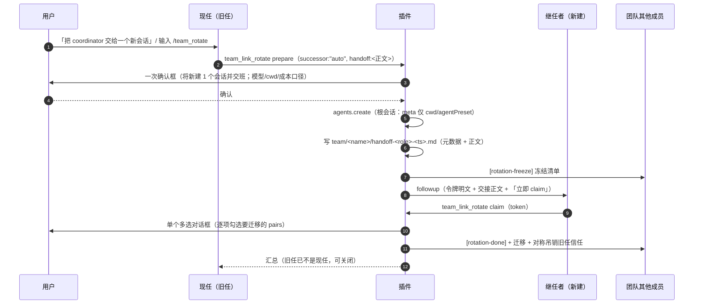

# dsh-team-link 协作增强设计（2026-09-19）

> **这是独立文档**：本文原本是 `team-upgrade-design-2026-09-17.md` 的 §10，因「已发布的行为」与「尚未实施的设计」混在一份文档里难以分辨，于同日**拆分独立**。
>
> **状态（按节）**：**§10.1 ① 发送方可见性 = 已实现**（本轮交付并通过差异审计，U13/U14/U15；**未发布、未真机验证**——宿主半边要等 DSH 重启批准）；**§10.2 ② = 未实施**；**§11 ③ = 未实施**。**全部内容都还不在已发布的 0.3.7 里。**
>
> **本文含两节**：**§10** 协作增强两项（① 发送方可见性 A+D；② `/team_session` 自动建队）；**§11** 自动换届交接（③）。
>
> **节号约定**：本文节号**沿用主设计文档的 §10.x 原样**（§10.0–§10.7）。这样做是为了让所有既有引用——主文档 §5 的「U13–U19 定义在 §10.4」、会诊纪要里的「落点」引用——**无需改写即可继续解析**。阅读时把 §10.x 当成本文档自己的节号即可。
>
> **与主文档的关系**：背景/痛点/目标见主文档 §1–§2；**红线 §4 与 §9.3 对本设计同样有效**；本设计新增的红线见 §10.3。会诊 #37 的裁定见 `consult-minutes/2026-09-19-consult-37-minutes.md`（2/4 交付）。

---

## 10. 协作增强两项设计（2026-09-19，v1.5）— 🟡 **① 已实现 · ② 已实现（审计修复中）· 均未发布**

> **状态**：**①（§10.1：A/D 发送方卡片 + `presentationMeta`）已实现**——差异审计 + 代码评审 **PASS**（U13/U14/U15）；**②（§10.2：`/team_session` 自动建队）已实现**（U16–U19）——差异审计 **0 🔴 / 4 🟡 / 7 🔵**、修复轮已收口（`9f3a5b6`，host `663` / client `138` 全绿）、代码评审 **PASS**（3 🟡 + 2 🔵，收口中）；**③a 主路径已实现**（`successor:"auto"` + 三层交接文档契约（5 硬节 + 缺项阶梯）+ `/team_rotate`；提交 `d3cbb56`，host **735** / client **138** 全绿）——**差异审计与代码评审收口中**；**③b 恢复工具 `team_link_recover`（§11.9.4）尚未开始**。设计已过会诊 #43 裁定并增补 §11.9，见 `docs/consult-minutes/2026-09-20-consult-43-minutes.md` §2–§5。两者**均未发布**；真机验证（演练 8 / 9 / 10）排在用户批准的**同一次重启窗口**。已发布部分的说明书在**主文档** `team-upgrade-design-2026-09-17.md` 的 §1–§9（其文首有「文档地图与状态」表）。

> **本节定位**：① 发送方可见性（自己发出的跨会话消息在**发送方**会话里的呈现）；② `/team_session` 自动建队（一条命令建 N 个 worker 会话并登记进 roster）。会诊 #37 的逐条裁定与原始层见 `docs/consult-minutes/2026-09-19-consult-37-minutes.md`（**2/4 交付**，两条独立收敛）。**§1–§9 一字不动**，本节只做增量。

### 10.0 现状与根因（先现象，后归因）

| # | 现状（实测/截图取证） | 根因（已核实） |
|---|---|---|
| ① | 接收方的跨会话消息是**带左色条与底色的卡片**；而**发送方自己**只看到一行藏在可折叠工具树**第 3 级缩进**的灰色 `✦ 工具调用 · team_link_send · session-<id>`（无底色、无边框、可能被折叠而完全不在视线上） | 客户端半边只在 `conversation.chat.node` 的 **`key:"context"`** 上注册了卡片渲染器——那只覆盖**接收方日志里的 context 消息**；插件**从未注册 `tool.call.toolview` 键**，于是发送方的工具调用落回通用工具行。**这不是渲染 bug，是能力缺口** |
| ② | 建队要人工开会话 → 复制深链 → 逐个登记；`lib/index.js` 的 prepare 文案至今写着「本插件不能编程创建会话（V9 未验证）」 | 插件零编程建会话实现；而该 API 在 0.1.5 **公开可用**（`ctx.agents.create` / `CreateAgentOptions`），该句**现已证伪**（§10.2.7 同批修正） |

### 10.1 ① 发送方可见性：A + D

**设计决定**：**A + D 组合**。A 让工具树里那一行本身变成卡片（**审计记录留在原位**）；D 让同一件事在会话流**顶层**再多一条可见记录。**B 与 C 明确不做**（理由见 §10.1.4）。

#### 10.1.1 A：工具调用视图（`tool.call.toolview`）

```js
// client.js —— 按「线上工具名」接管工具调用渲染；键域开放、对自己工具是 additive
ctx.slots.inject("tool.call.toolview", () => ctx.slots.register({
	name: "tool.call.toolview",
	key: "team_link_send",          // ⚠ 必须逐字等于线上工具名：typo = 静默回退通用行（无报错）
	locale: "dsh-team-link"
}, function SendToolCallView(props) {
	// props.block: ToolCallBlock —— running 时是 { kind:'tool-call', call:{ name, argsRaw, content } }
	//                             settled 时是 { kind:'tool-result', … , meta?: unknown }
	// settled 且有 meta → 用结构化回执渲染卡片；无 meta → 回退到模型可见文本（降级）
	var card = readSendCard(props.block);   // 见 §10.1.2；无法解析时返回 null
	return React.createElement(card === null ? PlainRow : SendCard, { ...props, card: card });
}));
```

#### 10.1.2 数据链：`presentationMeta`（官方结构化载体，不是 regex 解析）

`team_link_send` 现在用 `output: textOutput()`，卡片只能靠解析返回文本——脆弱。改用官方载体：**`output.presentationMeta(args, value): JsonValue`**，其产物持久化在 `tool/result.meta` 里（对核心不透明、JSON 校验、**durable 回放能复现同一张卡**）。第一方先例：`dsh-tool-fs-search` 用它持久化结构化搜索结果，并对序列化体积设上限。

```ts
// tool/result.meta 的目标形状（本节定义；v 供未来演进分支）
type TeamLinkSendCard = {
	kind: "team-link-send";          // 自带判别符，避免与其它工具的 meta 混形
	v: 1;
	at: number;                       // 投递时刻（ms）
	senderSessionId: string;          // 发送方（= 这条记录所在会话）
	meta?: { type?: string; pri?: string; ref?: string };   // 信封（仅调用方给了才有）
	message: { text: string; truncated: boolean; chars: number };  // 正文（设上限，见下）
	targets: Array<{
		expr?: string;                  // 若来自寻址表达式（team:<n>/<role>、team:<n>/*）
		sessionId: string | null;       // 直达 id；no-holder 时 null
		outcome: "delivered" | "refused" | "no-agent" | "no-holder";
		detail: string;                 // 一行摘要（与既有逐目标结果行同源）
		busy?: { running: boolean; minutes?: number };   // busy 预判（读不到时间戳则只有 running）
	}>;
	targetsTruncated?: { shown: number; total: number };   // §10.1.2 行数界：**宿主裁过才有**；`total` 是真值总数，客户端标签据此显示真值，客户端的渲染期界是独立的第二道防御
	summary: { delivered: number; refused: number; noAgent: number; noHolder: number; deduped: number };
	fanout: boolean;                    // 单目标 vs fan-out（决定卡片布局）
};
```

**体积纪律（具体数值，可断言）**：`message.text` 上限 **2000 码点**（超出则取头 1500 + 尾 400 + 省略标记 3 码点，并置 `truncated: true`；`chars` 记**原始**码点数）。理由是 `dsh-tool-fs-search` 的同款做法——**持久化的卡片必须有界**，否则一份长消息会被原样烙进会话日志。

**`targets` 的界是「行数」，不是「表达式数」（本节 2026-09-19 修正）**：输入侧的上限确实是对齐既有 fan-out 的 **≤8**（`FANOUT_MAX_TARGETS`），但那只约束**输入表达式**——同一个 `team:<name>/*` 会在宿主侧被展开成该队**全部在册存活成员的行**，故**行数可合法超过 8**。于是行数有**自己的界**：

- **宿主侧（权威）**：`buildSendCard` 对 `targets` 封顶 **24 行**（与 §10.2.4 的每队成员上限同值），超出时在卡内**显式标注**「已截断——仅显示前 24 行」，且**汇总计数仍覆盖全量**——即「有界呈现 + 如实标注」，与 `message.text` 的 2000/1500+3+400 同款纪律；文本报告仍**逐目标完整**（卡是有界呈现，报告是全量档案）。
- **客户端（防御 + 如实呈现）**：`readSendCard` 侧再设一道同值上限——因为回执来自**持久化的 `tool/result.meta`**，对核心不透明，可能被手改或异构实现写入；客户端不信任该数组的长度。**并且必须读宿主的 `targetsTruncated` 标注在界面上如实呈现**——只靠「自己数行数是否 >24」判超限是**空转的**：宿主已先裁到 24 行，自产卡永远不会触发该判据（2026-09-19 收尾轮实测到这个跨轮交互缺口，见 U14）。

这三个数值（2000 / 1500+3+400 / 24）都是**契约**（U13/U14 按它们断言），实施时若要改，改的是本节与验收，而不是随手在实现里挑一个数。

#### 10.1.3 D：客户端升格为顶层可见节点

原理：注册一个**自己的 conversation node definition**，`match` 命中发送方会话里**已有的** `tool/call`（`name === "team_link_send"`）与 `tool/result`，产出一个**顶层**节点；再用同 kind 的 `conversation.chat.node` 视图渲染成与接收方同款卡片。**不写任何日志事件，不动模型上下文。**

```js
// client.js
const KIND = "team-link-send";        // 全局唯一，带插件前缀（registry 要求 uniquely named）
ctx.inject(["uiConversation"], (c) => c.uiConversation.events.register({
	kind: KIND,
	match(event) { /* tool/call: data.name === "team_link_send"；tool/result: 按 callId 配对 */ },
	// …按 chat 包自家 definition 的形状补全 buildLocationData / update…
}));
ctx.slots.inject("conversation.chat.node", () => ctx.slots.register({
	name: "conversation.chat.node", key: KIND, priority: -90, locale: "dsh-team-link"
}, TopLevelSendCard));                // 与接收方的 key:"context" 并存（kind 不同，不冲突）
```

**为什么可行（会诊两条独立确认 + 我复核）**：注册引擎按 **kind 唯一**，但**允许多个 definition 匹配同一事件**、各自发布自己的 location key（只有**同 key**才拒）；chat 包自己的 `toolDefinition` 正是「match `tool/call`+`tool/result` → 顶层 `tool-call` 节点」。`ChatNodeDataMap` 的注释原文即「**Public merge surface for Chat renderer payloads contributed by other plugins**」。

#### 10.1.4 取舍：为什么不做 B / C

| 方案 | 否决理由（都是源码级） |
|---|---|
| **B**：顶层 `inject` 一条消息 | `followup` / `steer` / `inject` 投递的都是 `user/message`，而 `user/message` 是 **surface 事件**、必然投影进模型上下文。也就是说**不存在**「顶层可见但不进模型」的 B；而且一条「来自自己」的消息会诱发自回环。**另注**：发送方模型本来就看得见 tool 参数与结果，所以「模型知道自己发过什么」并非新增暴露——可见性补在**客户端**才是正解 |
| **C**：顶层 log-only 新事件 | 三层扩展点里**写入面是断的**：`Session.append` 构造事件信封时只放 `{type, seq, time, data, ...surfaceMetadata}`，`surfaceMetadata` 只可能带 `sourceEventSeqs`/`surfaceOp`——**没有任何途径打 `ignorable`**（已逐行复核 `dsh-session/lib/index.js:1237-1255`）；而 KNOWN 清单由**仓库内**声明生成，外部插件的接口合并不进清单。后果是**延迟引爆**：append 当场不报错（运行时**不校验**词表），下次 restore 才以「unknown event, not marked ignorable」**拒掉整本会话日志**——与历史 `kind:"team-link"` 事故同形 |
| **搭车第一方事件** | `dsh-experimental-agent-team` 的 `team/*` 事件正是「发送侧 log-only 协作记录」的第一方实现，但外部插件直接 append = **伪造它的状态机输入**。**明令禁止** |

> **事实修正（父侧自纠）**：本设计早前引用的「Unknown events, even ignorable ones … are refused」是 `dsh-session-format-v2-to-v3` **迁移**文档的封闭清单措辞；在 **restore/持久化读路径**上，「未知但标了 `ignorable`」的事件是**保留**的，`ignorable` 正是官方为仓外插件事件设计的兼容机制（事件名注册被明确否决）。**但这不改变 C 的结论**：没有 live-write API 能打该标记 ⇒ C 仍不可安全实施。已登记为**给上游的 feature request**（`append` 暴露 `ignorable`）。

#### 10.1.5 边界与降级（A + D）

- **键必须逐字等于线上工具名**（`team_link_send`）；写错了静默回退通用行、无任何报错——验收里要有「渲染确为卡片」的断言而不是「注册没报错」；
- **窗口截断回退**：`tool/call` 滚出历史窗口、只剩 `tool/result` 时，按 `context.matches` 回退（照 chat 包自家 fallback 的模式）——否则顶层卡片会在长会话里消失；
- **两面的信息分工（硬性；差异审计 F1 之后写死）**：**每一块信息只准出现一次**——
  - **顶层卡片（D）承载**：标题 + 发送方/时间 + **正文** + **汇总计数**（delivered/refused/noAgent/noHolder/deduped）；**不渲染逐目标明细行**；
  - **工具树卡片（A）承载**：极简标签（工具名 + 目标数）+ **逐目标行**（目标（`expr` 或短 id）+ outcome + detail + busy）；**不渲染标题/时间/正文/汇总**；
  - **判据**：把两张卡的全部可见文本取并集，任一语句**恰好出现一次**。交付轮曾把 head/body/summary/foot 在两张卡上逐字重复（审计 F1，`lib/client.js:445-472` 只有 `rows` 按 `detail` 分支），本轮按此条改正，并把与该条相矛盾的代码注释一并改掉；
- **降级优先**：definition / registry 属较新的公开面；它们坏掉只应导致「不渲染」而**不得**影响会话（客户端失败不得炸 UI）；
- **正文截断**：卡片正文按 §10.1.2 的上限截断并显式标注；
- **不得引入新的日志事件类型**（见 §10.3 红线）；
- **不采纳「追加进黑板 `decisions.md`」这条审计路径**（会诊 D9 的子项）：① 的审计记录**已经**由工具树卡片承担（A 把它渲染成卡片，仍在原位），换届的审计由 §11.4.3 的交接文档承担——再往团队账本里追加一份是重复留痕；**评审要求把这条落点对齐**，故在此显式声明「未采纳」，而不是让它悬在纪要里。

### 10.2 ② `/team_session` 自动建队

**目标**：在协调者会话里一条命令 → 创建 N 个 **worker 根会话** → 每个被告知自己的角色与任务 → 全部登记进 roster。用户只需下指令。

#### 10.2.1 命令契约与「顶层可见是免费的」

```js
ctx.commands.register({
	name: "team_session",
	input: { /* n / roles / model / preset / task / team —— 形状在实施时对齐 CommandInputDescriptor */ },
	async handler(invocation) {
		// 1) 解析参数 → 2) 上限检查（§10.2.4）→ 3) 一次性确认框（§10.2.4）
		// 4) 逐个创建（§10.2.2）→ 5) create resolve 后投递启动任务（§10.2.3）
		// 6) 登记 roster（按 role 幂等）→ 7) 汇总回报（含失败清单）
	}
});
```

**服务获取方式（受 §10.3 红线约束的实现决定）**：`commands` **不进**模块级 `inject`——§10.3 的红线是「既有 `inject` 数组（4 项）不改」。改用与收尾修复 ③ 同款的**可选有序注入** `ctx.inject(["commands"], cb)`：服务永不出现时插件照常加载并**降级**（只是没有这条命令，其余工具面不受影响），并留**一行 warn**（沿用「每处降级都要留一行日志」的红线）。**可选依赖一律走 `ctx.inject`，不得为了新功能把模块级 `inject` 撑大。**

**顶层可见是免费的**（会诊 D9）：命令本身会产生 `command/run` + `command/done` 两个**已知** log-only 事件，而客户端有**原生 CommandNode 顶层行**——`/team_session` 这条命令天然在会话里留下一条顶层可见记录，不需要额外造轮子。

#### 10.2.2 创建根会话（模板 = `dsh-webhook` 的 `createWebhookSession`）

```js
const handle = await ctx.agents.create({          // ⚠ 必须从【插件根 ctx】创建，见 §10.2.5
	sessionId: `team-link-${team}-${role}-${uuid8}`, // 自造、带前缀、避免 id 冲突
	meta: { cwd: absoluteCwd, agentPreset: presetId },  // ⚠ 只放 cwd/agentPreset
	//  ——— 血统字段一律【不写】：origin / parentSession / delegationDepth / parentAgent ———
	agentOptions: resolved.agentOptions,
	setup: async (agentCtx) => { /* 挂 preset / 初始模型选择（同 webhook 模板） */ }
});
```

**为什么「全省略」就是根会话**：`meta.origin` 的类型是 `'subagent' | undefined`，且运行时校验 `origin !== undefined && origin !== 'subagent'` 抛错 ⇒ **`undefined` 是唯一合法的非子代理取值**；不写 `parentAgent` 即无父。两个官方先例（`dsh-webhook` 的 `createWebhookSession`、UI 自身的 `createOrAdopt`）都只放 `cwd`/`agentPreset`。

> **⚠️ 模板的完整动作时序（2026-09-20 补：真机因此暴露过两个缺陷）**
>
> **引用模板不能只引它的形状。** 上面那段伪代码只展示了 `agents.create` 的**参数形状**，而 `createWebhookSession` 实际做的是一**串**动作。2026-09-20 的真机验证里，实现「照形状逐字写对」却**漏了两步**，各自造成一个真机缺陷（§12）：

| # | 模板动作（`dsh-webhook/lib/index.js`） | 漏掉的后果 |
|---|---|---|
| 1 | `ctx.workspaceRegistry.create(绝对路径)`（`:96`） | — |
| 2 | `cwd: workspace.path`（cwd 取自 registry，而非裸字符串）（`:103`） | — |
| 3 | `agentPresets.resolve(...)` + `standingKeyFor(preset.id)`——**缺省也解析**（`:93-94`） | **DEFECT-1**：没有 persona-prefix 组装源 ⇒ 首回合报 `{{model}} has no value`，**会话跑不起来** |
| 4 | `ctx.agents.create({ sessionId, meta, agentOptions, setup })`（`:99-111`） | — |
| 5 | `setup` 里 `await agentPresets.mount(agentCtx, preset.id)`——**无条件挂载**（`:108`） | 同 DEFECT-1 |
| 6 | **`await workspace.attachSession(sessionId)`**（`:115`） | **DEFECT-2**：会话没有 workspace 归属 ⇒ **侧边栏看不到** |
| 7 | 失败回滚：`await workspace.detachSession(sessionId)`（`:137`） | 半成品残留 |
| 8 | `permissionPresets.resolve/set`、`sessionTitle.rename`、`followup(prompt)`（`:92/:118-120`） | 权限/标题/首回合缺失 |

>
> **实现要求（通用纪律）**：凡在本设计中「采用某模板」，实现前必须把该模板函数**通读并列出它的全部动作**，逐条标注「已做 / 不做（附理由）」；**漏步必须显式声明，不许静默跳过**。设计侧的教训见 §12.3。

**模板中「故意不做」的步骤（2026-09-20 由实现方逐条列出，父侧裁定后写在此，不留白）**：

| 模板步骤 | 为什么不做 |
|---|---|
| `agentDefaultModel.currentSelection()` 缺省解析（`:16-62`） | 缺省时**宿主自己的 defaultModel 已生效**，弹框文案写的就是「（本会话默认）」——替用户选一个反而是越权 |
| `permissionPresets.resolve/set`（`:92`/`:118`） | `/team_session` **没有权限档参数**，设计契约里也没有；不替用户选档 |
| `signal.throwIfAborted()`（`:95` 等） | signal 是 webhook 的**注册生命期**；本路径在一条命令内跑完，abort 由确认框的 signal 承担。补它要改两处调用点签名与断言面（列为后续可跟进项，非缺陷） |
| `sessionTitle.rename`（`:119`） | 设计逐字契约里没有 title，而命名是**用户可见的交互决定**（三个 worker 该叫什么？）——设计没给就不自造；会话 id 自带 team/role |
| delivery 快照校验（`:180-188`） | webhook 的投递侧概念（provider kind / deliveryId），本插件没有 provider delivery |
| 模块级 `inject` 含 `workspaceRegistry`（`:197`） | §10.3 红线：模块级 `inject` **仍 4 项** ⇒ 走 `ctx.get("workspaceRegistry")`，缺席时降级为一行 warn |

**本设计的实际创建落点（与上面的伪代码同批改准）**：`createRootAgent(ctx, rootCtx, plan, entry, cwd)` 是**唯一**的创建入口，它把模板的完整时序收成一处：① `workspaceRegistry.create(cwd)` → ② `meta.cwd = workspace.path`（**registry 归一化后的路径**，因为 attach 会拿它校验）→ ③ `agents.create(...)` → ④ `attachSession(sessionId)` → ⑤ 失败则 `detachSession` + `dispose` + 原错误照抛（各步失败一行 warn）。**② 批量建队与 ③a 自建继任者共用它**，所以两条路径的工作区归属一致。

> **一处待跟进的同源风险（实现方主动上报）**：roster 的 `team.workspace` 仍取自调用方的**原始 cwd**，而会话 `meta.cwd` 现在用 registry **归一化**后的路径 ⇒ 若真实 registry 会归一化（realpath / 大小写 / 尾斜杠），**黑板的落点与工作区记录可能不同源**。这正是今晚反复出现的那类「同一事实两处各自计算」——列为下一轮的核查项。

#### 10.2.3 启动任务：`create` resolve 之后 `followup`

```js
await createAll();                               // 全部 create 完成（或失败即停，见 §10.2.6）
handle.agent.followup(createUserMessage({
	content: [{ type: "text", text: kickoffText }],
	source: { kind: "agent-message", form: "relay", senderSessionId: coordinatorSessionId }
}));                                             // ⚠ 恰好三成员（V10 红线）
```

规范原文是「**Setup composes, it never drives** — drive the agent only after creation resolves」，所以**先 create、后驱动**；且**不要用 `inject`**（那是「投递不唤醒」的上下文注入，启动任务需要驱动）。

**首条的接收门口径（需在设计评审确认）**：新建 worker 的 `receiveMode` 默认 `ask`，若照走接收门，会在一个用户未必打开过的新会话里弹确认框。**两种可选设计**：

- **(i) 预置配对**：确认框（§10.2.4）里**明确写出**「将为每个 worker 与主会话建立配对（双向免确认）」，用户勾选即视为一次性授权，插件据此写入 `pairs`；此后 worker 回报也免门。**代价**：信任授予从「接收方点配对」变成「命令发起方一次授权」——必须写在确认框正文里，不能默默发生。
- **(ii) 不预置**：首条照走接收门，用户在每个新会话里点一次「配对」。**代价**：回到人工 N 次点击，与本节目标相抵。

**本节取 (i)**，并把确认框正文作为该项授权的记录。

#### 10.2.4 上限与授权（两层常量 + 一个框）

| 层 | 上限 | 存储 |
|---|---|---|
| 命令语法硬顶 | **N ≤ 8** | **代码常量**（与既有 fan-out ≤8 同一约定，用户已有直觉） |
| 每队成员总数 | **≤ 24** | **代码常量**——**刻意不进 settings**：不为一个没人要的旋钮改 `team-link` 的 schema（§10.3 声明 schema 不改）；将来真需要再把它提升为设置键 |

**确认框**放**命令 handler 层**（不是工具层）：`CommandInvocation` 带确切的 `agent`，复用插件已在 `send` 里用的同一 `ctx.get("userQuestions").ask({ ..., agent: invocation.agent })`。框内必须写明：**将创建几个会话、每个用什么模型/预设、cwd、保守成本口径、以及（取 (i) 时）将建立哪些配对**。命令本身是人类指令，门 1 天然满足；这个框补的是**批量爆炸半径的知情**。

> **既有 team 的权限（评审 #4 补）**：对**已存在**的 team 登记 worker，仍走既有 `writerGate`（`policy.writer=coordinator` 时非现任会话一律拒绝）；建**新** team 的分支走 `upsert-team` 的「创建即认领」自举。**`/team_session` 不新增任何旁路。**

#### 10.2.5 生命周期与恢复（本节最大的坑）

- **必须从插件根 ctx 创建**，并**由插件持有全部 `AgentHandle`**。用命令 handler 的**临时 ctx** 创建 → handler 结束可能连带拆掉刚建的 agent（会诊 G14①）。归属表述的另一半（会诊 D12）：`dsh-webhook` 文档写明「the Agent remains lifecycle-owned by `ctx` and follows normal Session behavior」——两者一致：**agent 属于你创建它时用的那个 ctx**。
- **显式代价**：插件卸载/重载 = **全队 teardown**（会话仍在盘上，agent 不在）。这不是事故，是生命周期事实，必须写进文档并给出恢复路径：
  - roster 把「盘上有会话但无活代理」如实标 **dead**（对齐公理 A4）；
  - 插件重载后提供**收编/恢复引导**（提示可在侧边栏逐个打开把会话拉回来，再按 roster 重新登记）；
  - 巡检面（`list_sessions`）已有的 `dead` 判定天然覆盖该状态，不新增机制。

#### 10.2.6 失败与孤儿

- **部分失败：失败即停**（第 k 个 create 失败），**已建者保留**并如实报告清单——不静默回滚（回滚会删掉可能已被用户看到的会话）；
- **按 role 幂等**：同 team 同 role 已存在则跳过（命令可安全重试）；
- **孤儿防护**：先写 `pending-create` 意图（含 TTL）到 roster，成功回填、失败或超时由插件启动时的清扫报告「可收编清单」；**实现落为 `PolicyConfig.pendingCreates`**（roster 侧的顶层兄弟键——本项目 roster 与 policy 同属 `team-link` 命名空间）。它是本设计**唯一允许的 schema 新增 key**，见 §10.3 的措辞修正；
- **并发**：create 与 followup 串行（或 ≤2）——N 个 agent 同时首回合 = 成本峰值；
- **cwd 必须绝对路径**（会话边界会校验）。

#### 10.2.7 与 roster / policy 的关系，以及文档漂移修正

**「只听从主会话指挥」不是会话 header 能表达的语义**（会诊 G10）。worker 的「服从」来自两处：**启动 prompt 的职责说明** + **roster 的写权限**（既有 `policy.writer` 机制）。**不得**用 `delegationDepth` / `origin` 去编码指挥关系——那是血统字段，不是权限字段。

**同批修正文档漂移**：`lib/index.js` 的 prepare 文案（「本插件不能编程创建会话（V9 未验证）」）与 §3.6.4 的半自动兜底描述一并更新为「`agents.create` 公开可用；ownership 语义见 §10.2.5」。

### 10.3 边界与防偏离（新增红线，接 §4 / §9.3）

- **不得引入新的会话日志事件类型**（§10.1.4 C 的教训）：客户端可见性一律走「match 既有事件 + 客户端节点」；
- **不得伪造第一方事件**（`team/*` 等仓库内包的领地）；
- **批量动作必须有一处人类确认**，且确认框必须写明**数量、模型、cwd、成本口径与将建立的信任**；
- **客户端失败不得影响会话**：definition/registry 坏了只应「不渲染」；
- 既有的 `inject` 数组（4 项）、投递门、`source` 三成员语义**均不改**；**既有 schema key 的语义与形状也不改**——但**新增持久化 key 是允许的**，条件是：① 由设计明确要求的闭环所需；② 在设计文档与 CHANGELOG 中记录；③ 不改变任何既有 key 的含义。**本轮的实际新增只有 §10.2.6 的 `pendingCreates`**——它是「重启后仍能清扫孤儿意图」的必要条件：没有它，`pending-create` 只会活在内存里、启动清扫永远扫不到东西。

  > **措辞修正（2026-09-20，② 收口轮触发）**：本条原文写「schema 均不改」。实现方按 §10.2.6 落了 `pendingCreates` 后**主动上报了这个矛盾**（而不是悄悄绕过）。父侧判定：原文措辞过宽，**真实意图是「既有 key 不被破坏」**，不是「禁止一切新增」；已按上款改准，并**不回退实现**（回退会破坏 U18 的 pending-create 闭环）。
- ② 创建的会话**不得**标 `origin: 'subagent'`（用户明确要求：算根会话）。

### 10.4 验收增量

| # | 断言 | 覆盖 |
|---|---|---|
| U13 | `presentationMeta` 形状：逐目标 outcome/summary 与返回文本一致；**正文超限被截断且标注**；**`targets` 行数按 §10.1.2 封顶 24 行并带 `targetsTruncated{shown,total}` 标注**（裁的是**呈现**：`summary` 计数与文本报告仍**全量**） | §10.1.2 |
| U14 | 客户端 A：注册 `key:"team_link_send"` 后渲染为卡片；**无 meta 时回退纯文本**；键写错时回退通用行（不抛错）；**读宿主的 `targetsTruncated` 在 A 面显式标注「已截断——仅显示前 N 行」并让标签显示真值总数**；对外来/手改 meta 的超限 `targets` 仍按 24 行有界渲染（防御性）；D 面汇总覆盖全量 | §10.1.1 / §10.1.2 |
| U15 | 客户端 D：definition match 到 tool/call+tool/result；**顶层节点产出**；与接收方 `key:"context"` 并存不冲突；`tool/call` 缺位时按回退路径仍出节点 | §10.1.3 |
| U16 | ② 参数与上限：N>8 拒绝、每队成员 >24 拒绝（均为代码常量）；确认框取消 → **零创建**；**确认后 `pairs` 按声明写入（与主会话双向）**，且确认框正文含配对授权文案 | §10.2.4 / §10.2.3 |
| U17 | ② 幂等与失败：同 role 已存在则跳过；第 k 个 create 失败 → 已建者保留 + 报告清单 + 失败即停 | §10.2.6 |
| U18 | ② 血统与生命周期：新建会话 `meta` **不含** origin/parentSession/delegationDepth/parentAgent；handle 由插件持有；`pending-create` 超时被清扫并进「可收编清单」 | §10.2.2 / §10.2.5 / §10.2.6 |
| U19 | 红线回归：整个 ①/② **不产生任何新的日志事件类型**；`source` 仍恰三成员；既有断言零回归 | §10.3 |

**集成演练**：

- **演练 8（①）**：真机发一条跨会话消息 → 发送方**工具树内是卡片**且**顶层多一条摘要卡**。零日志改动的**准确判据**（评审 #1 修正——原措辞「md/JSON 逐字一致」与 §10.1.2 的 `presentationMeta` 自相矛盾，那条判据永远不可能通过）：**① 无任何新的日志事件类型；② 投递消息的 `source` 仍恰三成员；③ 导出 md 正文逐字不变；④ 导出 JSON 只允许 `team_link_send` 的 `tool/result` 多出 `meta` 字段，其余逐字节不变**；另外发送方**下一回合的模型上下文无任何新增消息**；
- **演练 9（②）**：`/team_session` 建 2 个 worker → 侧边栏**顶层可见**、可打开、可被 `team_link_send` 寻址 → 各 worker 收到启动任务并回报 → 插件重载后 roster 正确标 **dead**、盘上会话可被重新打开收编。

### 10.5 显式假设与待验项（不当作已知事实）

- **H1**：编程创建的会话在 web 壳里「点开」时**复用** agents store 里的既有 live agent 实例（而非另行 resume 撞上单写者拒绝）。**验证步骤**：`/team_session` 建 1 个 → 在侧边栏点开它 → 观察是否出现错误或第二个实例。**失败回退**：若壳层试图 resume，改由插件在创建后即 attachSession 并在文档里写明「新会话需在侧边栏打开一次」。
  > **真机进展（2026-09-20）**：探针**执行了**，但它**问在一个不成立的前提上**——会话根本**没出现在该工作区的列表里**（那是 **DEFECT-2**，已修）。所以「点开是否复用 live agent」这个问题**仍未被回答**，它要等 DEFECT-2 的修复生效后重跑（下一次重启窗口）。**教训**：探针的前置条件本身也要被验证（见 §12.2 末段）。另注：H1 原本写的回退方案「创建后即 attachSession」现已**成为既定实现**（§10.2.2 的模板时序第 ④ 步），不再是回退项。
- **H2**：外部客户端 bundle 能 `require` 到 chat 包的 `chatNode` / `contextLocation` helper，且 `ctx.uiConversation.events.register` 接受**外部** definition。**验证步骤**：注册一个最小 definition，观察顶层节点是否出现。**失败回退**：按公开形状手工构造节点字面量（会诊 D10 给出的退路）。
- **H4**（评审 #7 补，承主文档 §7-1 残留 (a)）：**运行时是否已注册 agent 工厂**（`agents.setFactory`）、以及 `agents.create` 派生出的 headless 会话是否真的可用。**验证步骤**：`/team_session` 建 1 个会话，观察其是否真的产生一个可投递的活动代理。**失败回退**：② 与 §11 的自动创建整体停用，退回主文档 §3.6.4 的半自动兜底（手工建会话 + 传 id）。
  > **真机结论（2026-09-20）：已被推翻。** 会话**建得出**，但**跑不起来**（缺 persona-prefix 组装源 ⇒ 首回合报 `{{model}} has no value` = **DEFECT-1**）；同一次探针还顺带暴露 **DEFECT-2**（会话未挂进工作区 ⇒ 侧边栏看不到）。**实际选择的是「修」而不是回退**——两个缺陷的修法都是**对齐官方模板**（缺省也解析 preset；`workspaceRegistry.create` + `attachSession`），改动局部且与模板一致。**这条假设的教训**：原验证步骤只问「是否产生一个可投递的活动代理」，而真机暴露的是**更前置**的两件事（组装源、工作区归属）——**「建成」与「能用」之间隔着模板的其余时序**（见 §10.2.2 的时序清单与 §12.2）。
- 客户端 def/registry 属较新公开面，**升级有跟随成本**——按「坏了只是不渲染」定级，不进红线。

### 10.6 本节明确不做（范围声明）

- **不做 C**（新日志事件）——转上游 feature request，理由与证据见 §10.1.4；
- **不做 B**（顶层 inject）——自回环 + 污染模型上下文；
- **不做批量换届**——③ 保持逐角色（错峰是刻意约束）；
- **不做 `presentResult` 的通用卡片**——官方词汇但 union 封闭，定制度不如 `tool.call.toolview`。

### 10.7 会诊 #37 意见处置

会诊 #37（4 模型并行只读，2026-09-19）：**2/4 交付**（glm-5.3 / deepseek-v4-pro，两条均为源码级完整答案且独立收敛；kimi-k3 / codex-cli:gpt-6-astra 超时无内容）。逐条裁定见 `docs/consult-minutes/2026-09-19-consult-37-minutes.md` §2（**28 行：27 采纳 / 1 failed**——G1–G15 + D1–D12 + F1），分歧与父侧裁定见其 §3。

对本文的落点：

| 会诊要点 | 处置 | 落点 |
|---|---|---|
| A（toolview）确定可行、零风险（G1/D2/D8） | 采纳 | §10.1.1 |
| **D 是最佳主路径**（G2/D4） | 采纳（**推翻父侧上轮的 C 倾向**） | §10.1.3 |
| C 的写入面断点（G4/G5/D6）+ `ignorable` 的适用域修正（D7） | 采纳 + **父侧自纠一处事实** | §10.1.4 与其事实修正段 |
| B 否决（自回环 + 污染上下文）（G3/D5） | 采纳 | §10.1.4 |
| 不得伪造第一方事件（G6） | 采纳（升为红线） | §10.3 |
| `tool/result.meta` + `presentationMeta` 官方载体（D3） | 采纳 | §10.1.2 |
| slash 命令自带原生顶层行（D9） | 采纳 | §10.2.1 |
| 根会话 = 全省略血统字段（G9/D11） | 采纳 | §10.2.2 |
| 「服从」不靠血统（G10） | 采纳（重要修正） | §10.2.7 |
| 启动任务 = create 后 followup、不用 inject（G11） | 采纳 | §10.2.3 |
| 三层上限 + 命令层确认框（G13） | 采纳 | §10.2.4 |
| 所有权/生命周期 + 恢复路径（G14①/D12） | 采纳（调和见纪要 §3(b)） | §10.2.5 |
| 失败即停 / 幂等 / 孤儿防护（G14②③④⑤） | 采纳 | §10.2.6 |
| 文档漂移（G15/D11） | 采纳 | §10.2.7 末段 |
| 两条 failed（kimi / codex） | 无内容可处置 | 纪要 §2 F1 |

---

## 11. 自动换届交接（2026-09-19 补遗；**2026-09-20 经会诊 #43 裁定并增补 §11.9**）— 🚧 **设计完成，尚未实施**

> **状态**：设计完成、待评审、未实施。**前置**：换届的**机制**已发布（主文档 §3.6，0.3.4）；本节补的是它的**自动化**部分。
>
> **用户决策（2026-09-19）**：① 触发方式 = **只做显式发起**（不做传感器自动触发）；② 交接文档**落黑板留档**。

### 11.0 缺口与成因

| 部分 | 状态 |
|---|---|
| 换届**机制**（两阶段令牌 / 域限定迁移 / 对称吊销 / 24h 可回退 / 到期清扫） | ✅ **已实现并发布**（0.3.4，随 0.3.7）——主文档 §3.6 |
| 换届的**人工前提**：继任者会话必须先存在 | ⚠ 仍是手工（prepare 返回文案让操作者「先在壳里新建会话、取 id 后重新 prepare」） |
| 换届的**半自动兜底** | 只到「准备一份预填交接 prompt + 深链打开指引，你只点创建」（主文档 §3.6.4） |
| **自动创建继任者 + 自动交接** | ❌ **此前没有设计**（本节补） |

**成因（如实列）**：① §3.6.4 是按「插件不能编程建会话（V9 未验证）」写的前提，所以只设计了半自动；② §7-1 在 API 已证实可用之后仍写「本轮不升级为全自动」（当时合理的保守，但**没销账**）；③ §10.6 的「不做批量换届」措辞把**批量**与**自动**混为一谈——它的本意只是「不要一键把全队同时换掉」。

**为什么现在便宜**：§10.2 的 `agents.create` 恰好消掉了换届**唯一的手工前提**（继任者会话必须先存在）。

### 11.1 目标与非目标

**目标**：**一次显式发起**完成「自建继任者 → 写交接文档 → 令牌 → 投递给继任者 → 它 claim → 旧任退场」。

**非目标（v1 明确不做）**：

- **传感器自动触发**（上下文水位 / `goal-disarmed` / 运行时长）——它意味着**模型能把自己换掉**，需要单独一轮带专门安全设计的版本；
- **fork / seed 交接**——V9 已定：换届选 `create` + 交接文档，不选 fork（fork 背 16h 全量历史，违背换届初衷）；
- **批量一键全换**——错峰是刻意约束（任何时刻至少留一个活记忆）；逐角色重复执行本流程即可；
- **自动关闭旧会话**——插件只提示「可关闭」，关闭是人的动作。

### 11.2 入口（两个，能力边界不同）

| 入口 | 谁发起 | 做什么 |
|---|---|---|
| `team_link_rotate action=prepare, successor: "auto"[, handoff]` | **现任模型**（工具调用） | 插件自建继任者 + 写交接文档 + 走既有 prepare 全套；**模型提供判断（`handoff` 正文），插件提供机制** |
| `/team_rotate <role>`（便捷命令，可选） | 人类（命令） | handler 校验发起者确为该角色现任 → 向该会话 `followup` 一条指令（「起草交接并调用上面的工具」）→ 返回 `CommandResult` 摘要给 UI |

**依据（已核实）**：`CommandResult` 只有 `{kind:'success'|'error', text}`，文档原文 "rendered directly by the dispatching UI"——**命令的返回值进不了模型上下文**，所以命令**无法自己产出交接正文**（那必须由模型起草）；而 `CommandInvocation.agent` 是完整 `Agent`（含 followup/steer），命令只能把会话**推一把**。

> **H3（待验）**：命令 handler 驱动自身会话的 `followup` 是否被允许、回合语义是否符合预期，需一次冒烟验证。**失败回退**：v1 只保留工具入口（人类用自然语言触发，例：「你该交班了，把 coordinator 交给一个新会话」）。

### 11.3 时序



### 11.4 各步机制

- **11.4.1 确认（爆炸半径）**：创建会话 + 交班是大动作，**必须过一次 `userQuestions.ask`**（沿用 M4 claim 的同一服务与形态）。**无确认服务 → fail-closed**（不建、不 prepare）。
- **11.4.2 自建继任者**：完全复用 §10.2.2——**根会话**、`meta` 只放 `{cwd, agentPreset}`、id 形如 `team-link-<team>-<role>-<uuid8>`；**从插件根 ctx 创建、handle 由插件持有**（§10.2.5 同款生命周期与代价）。
- **11.4.3 交接文档**：插件写 `team/<name>/handoff-<role>-<ISOts>.md` = 头部元数据（team / role / 前后任 id / 时间 / 令牌**掩码**）+ 模型提供的 `handoff` 正文。**由插件写**（不新增模型可调的黑板写入口，避免扩大写面）；因是**整文件写**，既有黑板「单行 500 码点」上限**不适用**；文件名带时间戳，天然不冲突，故**不需要** baseHash 乐观锁。**发现路径（评审 #8 补）**：这些文件是**审计与人类可读**用途——路径由 `team_link_rotate` 的返回文案给出、并记进换届汇总；**`team_link_team_read` 刻意不呈现它们**（那是给 agent 的读面，交接正文已由 §11.4.5 直接投给继任者，不必再扩大读面）。这是**显式的范围选择**，不是遗漏。
- **11.4.4 prepare**：沿用主文档 §3.6.2 全量语义（令牌绑定 `(team, role, successor)`、30 分钟 TTL、`rotationBackup` 快照、freeze 广播、10 分钟速率限制）。
- **11.4.5 投递令牌与交接**：插件用 `handle.agent.followup(...)`（**不是 `inject`**——任务需要驱动）把令牌明文（**只此一次**）+ 交接正文 + 「立即 `claim` 认领」发给继任者；消息 `source` 仍**恰好三成员**（V10 红线）。
- **11.4.6 claim**：继任者模型调 `team_link_rotate action=claim` → 用户一次多选确认（或无人值守 → provisional + 24h 回退）→ 域限定迁移 + **对称吊销**旧任信任 + 落定 roster + 广播 `rotation-done`。
- **11.4.7 旧任退场**：返回文案明示「旧任已不是现任，可关闭」；**插件不自动关闭任何会话**。

### 11.5 失败与孤儿

- **令牌 30 分钟未认领** → 既有 `rotation-cancelled` 照常（旧任仍为现任，团队不会卡死）；**插件必须额外报告它自建的那个继任者会话**（「本次换届新建的会话 `<id>` 仍存活但未认领，可收编或关闭」）——否则那会变成一个没人知道的孤儿；
- **崩溃在 create 与 prepare 之间** → 复用 §10.2.6 的 `pending-create` 意图（TTL + 启动清扫 + 可收编清单）；
- **部分成功不回滚**：会话已经存在于盘上、可能已被打开，一律**如实报告**而不是静默删除。

### 11.6 与既有设计的关系

- **复用**：主文档 §3.6（令牌/迁移/吊销/清扫）、§10.2.2（根会话创建）、§10.2.5（生命周期）、§10.2.6（孤儿防护）；
- **不变量（红线）**：信任迁移**仍必须**走 claim 与令牌——**不得**因自动化而跳过域限定或对称吊销；`source` 仍恰三成员；**不引入新的日志事件类型**（§10.3）；
- **同批修正**：`lib/index.js` 里 prepare 的「本插件不能编程创建会话」文案改为「`successor` 可省略（`"auto"`）由插件自建」。

### 11.7 验收增量

| # | 断言 | 覆盖 |
|---|---|---|
| U20 | `successor:"auto"` 建出**根会话**（`meta` 不含 origin/parentSession/delegationDepth/parentAgent）、写出交接文档、令牌绑定到新 id | §11.4.2/§11.4.3 |
| U21 | 继任者被 **followup（非 inject）** 驱动，正文含令牌与交接正文；`source` 恰三成员 | §11.4.5 |
| U22 | 确认框取消 → **零创建、零 prepare**；无确认服务 → fail-closed | §11.4.1 |
| U23 | 30 分钟未认领 → `rotation-cancelled` **且报告自建继任者**；崩溃窗口的 `pending-create` 被清扫并进可收编清单 | §11.5 |
| U24 | 红线回归：未跳过 claim / 令牌 / 对称吊销；全流程**不产生新日志事件类型** | §11.6 |
| 演练 10 | 真机：现任说一句 → 自动建继任者 + 落交接文档 + 令牌投递 → claim 完成 → 旧任收到 done 且可关闭 | §11.3 |

### 11.8 显式假设

- **H3**：命令 handler 驱动自身会话（`followup`）是否被允许、回合语义是否符合预期——需一次冒烟验证；失败则 v1 仅保留工具入口（见 §11.2 的 H3 注）。

---

## 11.9 会诊 #43 裁定：现任无人的恢复、交接文档契约、H3 的处置（2026-09-20）

> 来源：`docs/consult-minutes/2026-09-20-consult-43-minutes.md`（**3/4 交付**；glm-5.3 / deepseek-v4-pro / kimi-k3，codex 进程失败）。**三条回复各自纠正了父侧的题设**。本节把合并后的裁定写成可实施规格，**优先于 §11.2–§11.5 中与之冲突的表述**。

### 11.9.1 死锁的精确边界（**纠正父侧原题设**）

父侧原题设写成「团队卡死」——**过宽**。精确表述：

- **通讯面仍通**：黑板写**不过** `writerGate`（`lib/index.js:2270` / `:2333-2364`），`team_link_send` 走正常门 ⇒ 锁住的是**身份与信任面**，不是全瘫。
- **锁住的是**：roster 变更（`set-role` / `retire` / 既有 team 的 upsert）、换届（prepare/claim）、`/team_session` 登记。
- **硬死锁只有一格**：`policy.writer = coordinator`（默认）**且死的是 coordinator**。死 worker 时活协调者可 `retire` + `set-role` 重建（丢信任拓扑但不死锁）；`writer = any` 时任何会话可 `set-role` 补位。
- **诊断文案必须说出这个差别**（「能通讯、不能改身份」），否则成员会误判为全瘫。

### 11.9.2 关键重框定：死亡 ≠ 需要信任手术

`roster.current` 是**会话 id**，pairs 亦按会话 id 键控 ⇒ **在侧边栏重开该会话 = 原 id 复活 = 全部信任通道原样回来**，**零信任手术**。因此恢复**分两级**，最便宜的路径优先。

### 11.9.3 诊断面（**不新增持久状态**）

**不加**「vacant-due-to-death」持久状态。理由（三家独立一致）：liveness 是进程内、瞬态、**观察者相对**的事实（DSH 原话 "Ambient presence is neither liveness proof nor authorization"）；持久化后**没有可靠的清除者**；插件重载会让**全体**自建会话同时变 dead（§10.2.5），一次重载就写出一批陈旧标记；且 `current=null`（刻意空缺）与「悬空指针」语义必须可分。

活性只出现在**活着的读面**（`roster.md` 是**落盘文件**，**刻意不加**——把读数瞬间烙进持久物会立即陈旧）：

| 读面 | 加什么 |
|---|---|
| `team_link_roster get` 的现任行 | 现任无活代理时一行注记 + 恢复指引 |
| 三道门（`writerGate` / `rotateGate` / `retireGate`）的**拒绝文案** | **gate 本体保持纯函数**，由**有 ctx 的工具层**富化：把「只有现任 X 可写」改成「现任 X **无活代理**——恢复梯子见 …」。今天这道文案对死现任是**误导性**的 |
| 启动清扫报告 | 新增一行：各团队「current 无活代理」的角色清单 |
| （派生**诊断词**，**不新增持久字段**） | `vacant` = current 为 null；`seated-dead` = current 非空但 `agents.get(current) === undefined`。**澄清（③b 审计 B8/Y5 后改准）**：设计要求的是「**不落盘新的状态字段**」+「镜像里**不出现当前的活性读数**」——而 `vacant` 这个**既有事实**（`current=null`）本来就在盘上、`roster.md` 自 M2 起一直渲染「空缺（vacant）」；同理，恢复记录里的**理由词** `vacant-due-to-death` 可以出现在镜像里，因为它是**当时的事实**（为什么恢复），不是**当前的读数**（现在的活性）。**判据**：镜像里可以有「为什么变成这样」，不可以有「现在是什么样」。 |

**明确否决「巡逻主动告警 coordinator 死亡」**：插件重载 = 全队代理同时死亡 ⇒ 巡逻一告警就是**每次重载一场误报风暴**；且 `broadcastNotice` 对无发送方身份的通知按设计不发送。

### 11.9.4 恢复机制：`team_link_recover`，**恰两个封闭动词**

| 级 | 动词 | 机制 | 何时用 |
|---|---|---|---|
| **L1** | `revive` | `ctx.agents.resume` **复活同一会话**（身份不变、roster 不动、信任零改动） | 死亡绝大多数是重载/重启假象 |
| **L2** | `reappoint` | **人类对话授权的 prepare**：铸令牌绑定 `(team, role, successor)` → 逐字走 prepare（`rotationBackup` 快照 + freeze 广播）→ 继任者凭令牌 claim（**claim 逐字不动**）⇒ 两道人类关卡 + 24h 回退网 | 现任不会/不应再回来 |

**L1 的适用域（会诊 D7，父侧原设计完全没想到）**：`resume` 的 ownerCtx 是**插件根 ctx** ⇒ 复活后该代理的**运行时所有权归插件**，插件卸载即拆。对**人类自建**会话做 revive 会让它的生命周期**从 UI 转给插件、比现状更差**。⇒ **v1 的 `revive` 只对插件自建会话**（§11.4.2 自建的那些本来就是插件所有）；人类自建会话改为输出**深链指引**「请在侧边栏打开」。

> **适用域的实现扩展与独立核验（2026-09-20）**：单用 `teamSession.hasHandle(id)` 在**本轮最要紧的场景里恒为 false**——它读的是**本激活**的 handle 注册表，而 L1 存在的理由恰恰是「插件重载把 handle 表清空」（§10.2.5）；照字面实现，重载后 `revive` 会对**每一个**插件自建会话说「这不是本插件建的」，**与设计意图相反**。故实现取 `hasHandle(id) || pluginSessionIdMatches(team, role, id)`（后者按 §10.2.2 的 id 文法）。
>
> **③b 差异审计独立核实其不越授权面**（审计原始结论）：DSH 侧**人类可达**的会话 id 文法是 `session-<uuid>`（UI/人类，`dsh-api-session-controller:575`；子代理 `:693`）、`session-<n>`（`dsh-session:1465`）、`webhook-<uuid>`（`dsh-webhook:98`）——**没有任何人类可达路径能造出 `team-link-<team>-<role>-<8hex>`**；该 id 由插件自铸（`teamSessionId`），真机盘上确实存在（`team-link-h1-probe-worker-1-92796b16`）。残余风险只剩两点：「命名文法是**推断**而非存证」与「超写者手改 settings 把 current 指到同形 id」——**两者都不构成「人类自建会话被插件接管」的路径**。⇒ **本节接受该扩展，并把这条论证作为它的正当性依据。**

**入口为什么是独立工具**：演员与前置条件都与 `rotate` / `roster` 不同；而「两个封闭动词」这条反后门性质需要**单一可审计落点**。**不新增令牌类型**——L2 用的就是 `pending`/token 本身。

### 11.9.5 发起、授权与防滥用（回答「会不会变成后门」）

**三权分开**：**发起** ≠ **授权** ≠ **复权**。

- **授权**唯一来源 = **人类在对话框里那一下点击**（`userQuestions`，fail-closed）。骨架论证：**任何由人类确认框把关的动作，其权限上界就是设置 UI 超级写者**——后者本来就能改一切且无审计 ⇒ 恢复只是把既有人类权限收窄成**更窄、更可审计**的形式，**不可能新增**后门；后门只可能来自**绕开人类**的那部分。
- **发起**：{该角色**最近一任前任**} ∪ {团队**现任成员**}。旧任**可以发起**（发起权不依赖信任、只依赖身份资格；它上下文最完整，「回聘旧任」是最自然的恢复）——但**授权仍必须由人类给出**；它若被选为继任者，走的是 M4 claim 的**域限定迁移**（从死亡继任者的遗存重建），**被第一次换届丢弃的旧 pairs 一律不复活**。

  > **三条实现侧补充（2026-09-20，③b 审计修复轮上报，父侧采纳）**：
  > 1. **这条发起域与下面的「八条硬约束」并列，不计入那八条**——所以 README 里「八条」的说法不必改为九条，但描述/README 必须以「另一条不编号的发起域」显式声明它（否则读者会以为只有八件且都已断言）。
  > 2. **域外拒绝必须零副作用**：拒绝发生在**任何写之前**（不建会话、不铸令牌、不 freeze），且**连确认框都不弹**——判据可断言：`resumeCalls === 0 && rotationAt 未落 && uq.requests === 0`。拒绝文案要点名现任成员集合 / 该角色前任 / 调用会话，并指出**设置 UI（R2 级）仍是永远可用的出口**。
  > 3. **代价如实写进 README**：非成员的活会话**不能**发起（会把一部分人类会话挡在门外，这是有意的）。
- **不需要「临时复权令牌」**（三家独立一致）：令牌只在**无人值守**场景换得价值，而恢复**必须有人在场**；一个绕过 `writerGate` 且无人类门的 bearer capability 恰好是后门的形状。
- **八条硬约束**：① 封闭动词（只 `revive`/`reappoint`），不接受任意 roster 字段写入、不改 `policy.writer`；② **attended-only**，**刻意不设 provisional 无人值守变体**（与 claim 的关键不对称：pair 迁移可被 sweep 自动回退，**incumbency 不可自动回退**——错误现任写下的黑板/roster 已成事实）；③ **候选由插件从 live 成员计算**，模型只传 `team`（+可选 `role`），**不得指定继任者 id**；④ `revive` 只绑**当前** `current`（不存在「复活任意历史会话」的动词，否则吊销形同虚设）；⑤ `writerGate` 原样不动；⑥ **绝不把 `writer` 降级为 `any` 当作「修复」**（那是对团队的静默弱化）；⑦ 速率限制 + 三处留痕（**role 行的 `recoveries` 字段**（= `recovery(<verb>, vacant-due-to-death, requester=…)`；**`history`（版本史）一字未动**——③b 审计 Y6 已**独立验证它会被持久化**：真 `PolicyConfig` 往返存活 + `dsh-settings` 的 `persist` 落原始 section + **真机 `profile/settings.yaml` 的 role 行确实带 `recoveries: []`**）/ `roster.md` 镜像 / `decisions.md` 追加——黑板无门，死锁下也能落账）；⑧ 进入即先跑既有过期清扫。
- **写时复检（TOCTOU）**：条件由**宿主观测**、不由调用方主张——对话框弹出时**与**落笔写入前**各重查一次 `agents.get(incumbent) === undefined`；现任已复活则中止（「现任已复活，无需恢复」）。

### 11.9.6 交接文档契约（会诊 Q2 裁定）

**先诚实声明原则**：插件只能把关**结构**（节在场 / 非空 / 有界），**不能**把关**内容质量**。presence 门防**遗忘**，**不防敷衍**——这句必须留在设计里。

**三层结构**：**头（插件写 YAML）** + **事实段（插件写，与 claim 返回文案同一事实源——「不可两处口径」）** + **正文（旧任模型写）**。

- **头**：`schema` / team / role / 前后任 id / `preparedAt` / `claimedAt` / **令牌掩码** / `rotationStatus` / 完整性判定。
- **事实段**：迁移的 pairs 清单（含 provisional 与到期）/ 未迁移与随退役清理清单 / 对称吊销明细 / freeze-done 广播摘要（**含 no-agent 未投递名单**）/ provisional 回退窗口与补批准路径 / 上下一份交接文档路径。

  > **⚠️ 这一项与 §11.3 的次序自相矛盾（2026-09-20 消解，不再留给实现去背）**：§11.3 要求文档**先于** freeze 广播写入，而 freeze 的逐目标结果**只可能在广播之后**才有。⇒ **契约改为**：文档在 freeze 前写入，因此**只携带指针**（「本文件先于广播写入，逐目标结果在 prepare / claim 的返回里，本文件不追写」），**逐目标结果与 no-agent 名单以 `prepare` / `claim` 的返回为准**。实现已按此落地（`lib/index.js` 的事实段渲染），本条即其契约依据。**claim 时不再复验、不追写文档。**
- **正文（5 个硬节）**：`mission`（角色对团队负责什么）、`in-flight`（在飞工作：事项/相关成员/状态/下一步）、`commitments`（未兑现承诺）、`unknowns`（**负面空间声明**——把沉默变成信息）、**`task-and-goal`**（当前目标与 goal 相位/armed——**继任者的第一个动作就是 `/goal resume`，文档必须说清有没有 goal 可续**）。
- **软节（缺则警告）**：`first-actions` / `team-map` / `conventions` / 信任现状的「为什么」部分。

**缺项阶梯（验证点必须在**本调用自身**的任何副作用之前）**：

> **措辞修正（2026-09-20，③a 审计 🟡-1）**：原文写「任何副作用之前」，**字面不成立**——工具入口的**惰性过期清扫**（每个工具共用的既有机制）在阶梯**之前**执行，它会对**别的**过期 pending 真取消、真写 settings、真广播。实质要求（**本调用不得在建会话 / 铸令牌 / freeze 之前完成校验**）仍然成立且已实测（拒绝时零创建、零令牌、零 freeze），故**收窄措辞而不改行为**。

| 情形 | 处置 |
|---|---|
| `successor:"auto"` + 正文缺失/空 | **拒绝于工具入口**（零建会话、零令牌、零 freeze），错误文案给出**五硬节脚手架**。理由：auto 路径造出的是零上下文的新根会话，正文是它得到的**全部**；空正文的自动换届 = 造一个失忆的持钥者 |
| 正文在、硬节缺 | 拒绝并**点名缺哪些节** |
| 软节缺 | 放行 + `prepare` 返回列警告，头部记录 |
| **显式 successor + 无正文** | **放行 + 警告**（M4 现语义不回收紧：那个会话有自己的生命与上下文） |
| 文档写入失败（auto 路径） | **abort-before-prepare**：不铸令牌、不广播 freeze，已建会话按 §11.5 如实报为孤儿 |
| claim 时 | **不复验文档**（它是审计件不是执行件） |

### 11.9.7 H3 的处置（会诊 Q3 裁定）

**H3 的风险面比 §11.2 写的窄**：`Agent.followup` 接口层**没有 self 禁令**，且「A wake submitted while already idle always opens its turn boundary」——悬念不在「允不允许」，而在**回合与来源语义**。**结论：照 §11.2 实施 H3**（命令入口 + 工具入口并存），冒烟验证放在重启窗口。

**父侧原本设想的退路被否决**：「命令只做机械部分、正文由旧任在下一回合补」**依赖一个唤醒信道**，而信道只有 self-followup（**就是 H3 本身，循环依赖**）或人类粘贴——**不构成退路**。若 H3 冒烟失败，退路就是 §11.2 的工具入口（人类用自然语言触发）。

**先例**：命令 handler 做机械大件**已被 ② 实证**（`/team_session` 在 handler 里完成确认框 + `agents.create` + roster 登记 + pairs 写入，并用 `invocation.agent.id` 过 `writerGate`）。

### 11.9.8 验收增量（会诊裁定新增）

| # | 断言 | 覆盖 |
|---|---|---|
| U25 | **诊断面**：三道门的拒绝文案在「现任无活代理」时给出命名诊断与恢复指引；`roster.md` **不含**活性；启动清扫列出 dead 现任 | §11.9.3 |
| U26 | **L1 revive**：仅对插件自建会话开放；人类自建只输出深链指引；`resume` 失败（无 factory/persistence）fail-closed 报告 | §11.9.4 |
| U27 | **L2 reappoint**：候选由插件从 live 成员计算、模型不可指定；无确认服务 → fail-closed 且**不写任何状态**；写前复检（现任复活则中止）；claim 全套未被跳过 | §11.9.4 / §11.9.5 |
| U28 | **交接文档阶梯**：auto + 空正文 → **零建会话零令牌零 freeze**；硬节缺 → 拒绝点名；软节缺 → 放行带警告；文档写失败 → abort-before-prepare | §11.9.6 |
| U29 | **红线回归**：恢复路径**不新增日志事件类型**、不改 `policy.writer`、不改 schema（除既有唯一新增 `pendingCreates`） | §11.9.5 |

### 11.9.9 本节不可验项

- `ctx.agents.resume` 真机行为（**尤其 ownerCtx 归插件**这条——D7 据它限定 `revive` 的适用域）；
- 三道门拒绝文案的「调用方富化」是否覆盖全部三条门路径；
- L2 复用 prepare/claim 后，`rotationBackup` 里那份「死亡现任的信任遗存」在对称吊销时是**纯清理**（逻辑成立，**未实测**）；
- **`revive` 侧的身份复检仍是一条「半空锁」（2026-09-20，③b 审计修复轮发现并上报）**：`reappoint` 的身份复检已在修复轮落成**行为锁**（删掉它必红），但 **`revive` 侧那条身份复检没有任何断言单独咬住它**——它对「被改任给活会话」同样为假，所以删掉它现有断言可能仍是绿的。设计只点名了 `reappoint`（Y3），**这是一个尚未闭合的同类项**，需要一条对称判据或收窄措辞。**交由代码评审与下一轮处理**；
- 全部真机项（与演练 8 / 9 / 10 同一重启窗口）。

---

## 12. 真机验证结果与它暴露的两个缺陷（2026-09-20）

> DSH 重启后（用户批准）首次真机验证。**单元测试 783 条全绿的情况下，真机仍然暴露了两个缺陷**——这一节把它们与设计侧的教训固化下来。

### 12.1 演练 8（① 发送方可见性）：**通过**

真机实测（用户发起 + 父代理用原生视觉读截图 + 结构化自证）：

| 判据 | 结果 |
|---|---|
| A 面（工具行） | ✅ **是卡片**（圆角 + 独立底色），不再是那行灰字 |
| D 面（顶层摘要卡） | ✅ **存在**（左色条 + 「已发送跨会话消息」+ 会话 id + 时间 + 正文） |
| F1 信息分工 | ✅ 顶层卡承载**正文 + 汇总计数**；工具行承载**逐目标明细**——**同一块信息未重复** |
| 零日志改动 | ✅ 导出 3611 事件：类型全为上游定义（**无插件自创**）；中继 `source` **恰三成员** |

**① 至此全链闭合**：代码 + 差异审计 + 代码评审 + 真机演练。

### 12.2 H1/H4：**假设被真机推翻**，暴露两个缺陷

| # | 缺陷 | 根因 | 记录 |
|---|---|---|---|
| **DEFECT-1** | 编程创建的会话**跑不起来**：`prompt variable "{{model}}" has no value … (section "deployment:persona-prefix")` | `buildTeamSessionCreateOptions` 只在 `plan.preset !== undefined` 时才写 `meta.agentPreset` 并 mount ⇒ 不传 `preset=` 时**没有 persona-prefix 组装源**。**模板 `createWebhookSession` 是「总是 resolve（缺省也解析）并 mount」** | `.goal/DEFECT-1-created-session-cannot-run.md` |
| **DEFECT-2** | 编程创建的会话**未挂进工作区** ⇒ 侧边栏看不到（用户须手动切工作区） | 模板在建完会话后调 `await workspace.attachSession(sessionId)`（`dsh-webhook/lib/index.js:115`），我们**全库 0 处** | `.goal/DEFECT-2-created-session-not-attached-to-workspace.md` |

**两个缺陷是同一个模式**：**模板有一组「创建后必须做的事」，实现只做了一部分**（DEFECT-1 漏了 preset 解析/挂载，DEFECT-2 漏了 workspace 挂载）。

**H4 的真机结论**：原假设是「`agents.create` 派生出的会话是否真的可用」——**被推翻**（会话建得出，但**跑不起来**）。⇒ 按 §10.5 的既定回退本应「整体停用自动创建」；实际选择了**修**（对齐模板），因为修法与模板一致、改动局部。

**H1 的探针设计不足（本节要记的教训）**：H1 原问「点开编程创建的会话是否复用 live agent」，它**默认了会话已经能被看到**——而真机暴露的是更前置的问题（**它根本不在该工作区的列表里**）。⇒ **探针的前置条件本身也要被验证**，否则探针会在一个不成立的前提下问一个无关的问题。

### 12.3 对设计正文的修订（本节即修订依据）

1. **§10.2.2 的表述缺口**：它说「模板 = `createWebhookSession`」，却只写了 `meta` 的形状（`{cwd, agentPreset}`），**没有列模板的完整动作时序**。实现照着形状逐字写对，却漏了后面的 `workspaceRegistry.create` / `attachSession` / `detachSession`。⇒ **模板引用必须带「时序清单」，不能只引形状。**
2. **§10.5 的 H1/H4 状态更新**：H4 **已被真机推翻**（见 12.2）；H1 的探针前提不成立（见上文末段）。
3. **父代理的一次误判也要记**：DEFECT-2 我先判成「不是缺陷（侧边栏过滤）」，依据是「cwd 落盘路径正确」。**错在用一处的证据推断另一处的行为**（cwd 正确 ≠ 已挂进 registry）——与今晚反复出现的那类「分叉」缺陷同源，只是这次发生在父代理的推理里。
4. **「断言可能成为缺陷的同谋」**：DEFECT-1 的修复删掉了一条旧断言「**无 `agentPresets` ⇒ 会话照常可用**」——它把缺陷固化成了期望行为。⇒ 验收断言要对着**「能用」**，而不是**「建出来了」**。
5. **「同源化」会把锁变成空锁（2026-09-20，③a 审计修复轮**自己**发现）**：把「两处各自写」改成「一处渲染、另一处引用」之后，任何形如「两处相等」的断言就**由构造保证、永远不会红**——修复轮第一版的键表**反向锁**正是如此（变异加一个「能被解析却从不被宣传」的键，断言照样全绿，它在自己的红相里当场看穿并改掉）。⇒ **同源化之后，锁必须落在行为上**（例：不在广告里的键**必须被解析器拒绝**，且拒绝文案点名），而不是落在两个同源产物之间的相等关系上。
   **这是「同源」缺陷类的第六次出现，也是最隐蔽的一次**：前五次是「**同一事实两处写**」，这一次是「**修掉它之后，验证它的那把锁失效了**」——即修复动作本身会削弱检测能力。**凡是把两处合并为一处时，必须同时检查：原来锁着这件事的断言还在咬人吗？**

### 12.4 真机验证的剩余队列

- **DEFECT-1 的真机复验**：修复已提交（`e40c3c6`），但插件是 **bundle 层**（无 HMR）⇒ **需下一次重启窗口**才能复验；
- **DEFECT-2**：修复轮进行中；
- **演练 9（② `/team_session`）**：需在 DEFECT-1/2 修复生效后重跑；
- **演练 10（③ 换届）**：涉及真实信任迁移，放在最后，且建议先用一个探针团队；
- **H3**（命令 handler 驱动自身会话）：需用户在会话里输入 `/team_rotate <role>`。

### 12.5 待用户决定：发送方卡片里「逐目标行」的措辞（2026-09-20 用户提出）

**用户观察**：发送消息给隔壁会话时，发送方卡片的样式（截图，916×172）——中间的卡片含 3 行内容。

**父侧的取证**（读了产生那三行的代码，`lib/client.js` 的 A 面）：

- 结构**符合 §10.1.5**：卡片形态（左色条 + 圆角 + 底色）✓；行首是极简标签（工具调用 · 工具名 · N 个目标）✓；每目标一行（目标 + `detail` + 结果标签）✓。
- **视觉桥曾报「三行都在右边缘被截断」——判为截图裁切假象**：卡片行文本的 CSS 是 `white-space: pre-wrap; word-break: break-word`，**会换行、不会截断**。
- **值得重新审视的一点**：每行把 **`target.detail`**——即**模型可见的那句报告**——原样搬上了卡片。那句话含**投递机制的电报**（「已投递到 …」「目标处于空闲」「steer 注入当前回合」「awaken 注入当前回合」），对一个**人看的卡片**偏向机制而非结论，且长到让一个目标就占 2–3 行。

**父侧建议**：卡片**别渲染那句预拼好的句子**，改从**结构化字段**（`target.outcome` / `target.busy` / 目标）渲染一句人话；**长句继续留给模型可见的报告**。这样**不违反「一处事实」**（§10.1.2 的 `detail` 定义仍是报告那一句），只是**换一种渲染**——但 §10.1.2 目前把它写成了「卡内行 == 报告首行」（B1 那轮的裁定钉的断言），所以这是**一次真正的设计选择**，需要用户点头才能改。

**状态**：**待用户决定**（保持现状 / 改成结构化短句）。未实施。

### 12.6 顺带记录的**工具缺陷**（非本插件，来自父侧的真机取证过程）

`vision_glance`（DSH 视觉插件的桥）有两处**真实缺陷**，在父侧用原生视觉读截图时复现：

1. **遇到 `✦`（U+2726）会崩**：`UnicodeEncodeError: 'gbk' codec can't encode character '\u2726'`——它把返回文本写进 **GBK** 管道，而工具行标签里正好以 `✦` 开头；
2. **中文返回全乱码**（`ͼ���Ӿ�…`）——请求/响应两侧编码不一致；**英文提问时英文部分完全可用**（所以仍能拿到结构性读数，但逐字转录不可用）。

**影响**：任何依赖「读中文截图文字」的自动化取证都会失败或读到垃圾。**建议单独修**（不在本期范围）。
