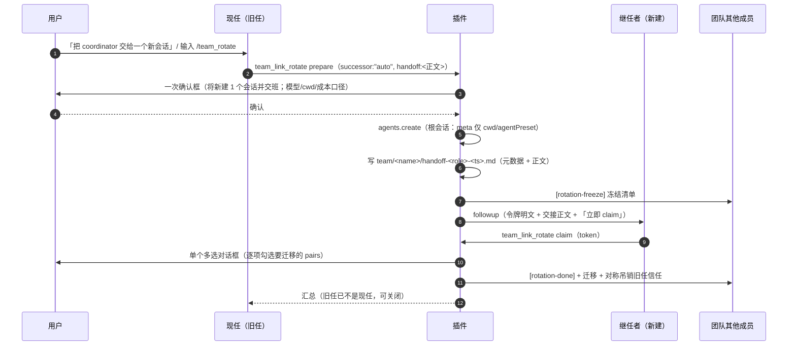

# dsh-team-link 协作增强设计（2026-09-19）

> **这是独立文档**：本文原本是 `team-upgrade-design-2026-09-17.md` 的 §10，因「已发布的行为」与「尚未实施的设计」混在一份文档里难以分辨，于同日**拆分独立**。
>
> **状态（按节）**：**§10.1 ① 发送方可见性 = 已实现**（本轮交付并通过差异审计，U13/U14/U15；**未发布、未真机验证**——宿主半边要等 DSH 重启批准）；**§10.2 ② = 未实施**；**§11 ③ = 未实施**。**全部内容都还不在已发布的 0.3.7 里。**
>
> **本文含两节**：**§10** 协作增强两项（① 发送方可见性 A+D；② `/team_session` 自动建队）；**§11** 自动换届交接（③）。
>
> **节号约定**：本文节号**沿用主设计文档的 §10.x 原样**（§10.0–§10.7）。这样做是为了让所有既有引用——主文档 §5 的「U13–U19 定义在 §10.4」、会诊纪要里的「落点」引用——**无需改写即可继续解析**。阅读时把 §10.x 当成本文档自己的节号即可。
>
> **与主文档的关系**：背景/痛点/目标见主文档 §1–§2；**红线 §4 与 §9.3 对本设计同样有效**；本设计新增的红线见 §10.3。会诊 #37 的裁定见 `consult-minutes/2026-09-19-consult-37-minutes.md`（2/4 交付）。

---

## 10. 协作增强两项设计（2026-09-19，v1.5）— ✅ **① 已实现并通过真机演练 8 · ② 已实现（审计与评审均已收口）· 均未发布**

> ⚠ **2026-09-21 真机缺陷修订（②，**已落码 2026-09-22 · commit `ee7c48a`／`755665a`**）**：`/team_session` 收到**三条**真机缺陷——**① 输入文法**（自由正文被当参数）、**② 失败可见性**（界面上什么都不显示）、**③ 确认框无界**（正文过长时底部动作够不着）。根因、修订后的文法（方案 A「参数可省」）与修法见 **§10.2.8**，判据 **U30–U34**。**同时更正 §10.2.1 那句「顶层可见是免费的」——真机已推翻。** **延迟的真机归因（27.4s 是确认框、130ms 是插件、85s 是不驱动调用会话）见 §10.2.8.8。** 另有一条**观察项**（非判据）：角色语义的**指引缺口**——用户要的是「新会话接替座位」，而 `/team_session` 的契约是建 **worker**、调用者才是 coordinator（见 **§10.2.8.7**，含两条待裁定）。

> **状态（2026-09-20 更新）**：
> - **①（§10.1：A/D 发送方卡片 + `presentationMeta`）**：已实现 → 差异审计 → 代码评审 PASS → **真机演练 8 通过**（卡片形态、F1 信息分工、零日志改动四条判据均已实测）；**未发布**。
> - **②（§10.2：`/team_session` 自动建队）**：已实现（U16–U19）→ 差异审计（0 🔴 / 4 🟡 / 7 🔵）→ 修复轮 → 代码评审 PASS（3 🟡 + 2 🔵）→ 评审修复轮；**全链闭合**。
> - **③a 主路径与 ③b 恢复工具**：均已实现，各自的差异审计与修复轮均已收口（见 §11 的状态行）。
> - **真机待办**：DEFECT-1（preset 源）与 DEFECT-2（工作区挂载）的修复**需下次重启才生效** ⇒ **演练 9 / 10 + H1 / H3** 排在用户批准的**下一次重启窗口**（见 §12.4）。
> - 现测：host **836** / client **146** 全绿（0.3.8 收口时点）。已发布部分的说明书在**主文档** `team-upgrade-design-2026-09-17.md` 的 §1–§9（文首有「文档地图与状态」表）。

> **本节定位**：① 发送方可见性（自己发出的跨会话消息在**发送方**会话里的呈现）；② `/team_session` 自动建队（一条命令建 N 个 worker 会话并登记进 roster）。会诊 #37 的逐条裁定与原始层见 `docs/consult-minutes/2026-09-19-consult-37-minutes.md`（**2/4 交付**，两条独立收敛）。**§1–§9 一字不动**，本节只做增量。

### 10.0 现状与根因（先现象，后归因）

| # | 现状（实测/截图取证） | 根因（已核实） |
|---|---|---|
| ① | 接收方的跨会话消息是**带左色条与底色的卡片**；而**发送方自己**只看到一行藏在可折叠工具树**第 3 级缩进**的灰色 `✦ 工具调用 · team_link_send · session-<id>`（无底色、无边框、可能被折叠而完全不在视线上） | 客户端半边只在 `conversation.chat.node` 的 **`key:"context"`** 上注册了卡片渲染器——那只覆盖**接收方日志里的 context 消息**；插件**从未注册 `tool.call.toolview` 键**，于是发送方的工具调用落回通用工具行。**这不是渲染 bug，是能力缺口** |
| ② | 建队要人工开会话 → 复制深链 → 逐个登记；`lib/index.js` 的 prepare 文案至今写着「本插件不能编程创建会话（V9 未验证）」 | 插件零编程建会话实现；而该 API 在 0.1.5 **公开可用**（`ctx.agents.create` / `CreateAgentOptions`），该句**现已证伪**（§10.2.7 同批修正） |

### 10.1 ① 发送方可见性：A + D

**设计决定**：**A + D 组合**。A 让工具树里那一行本身变成卡片（**审计记录留在原位**）；D 让同一件事在会话流**顶层**再多一条可见记录。**B 与 C 明确不做**（理由见 §10.1.4）。

#### 10.1.1 A：工具调用视图（`tool.call.toolview`）

```js
// client.js —— 按「线上工具名」接管工具调用渲染；键域开放、对自己工具是 additive
ctx.slots.inject("tool.call.toolview", () => ctx.slots.register({
	name: "tool.call.toolview",
	key: "team_link_send",          // ⚠ 必须逐字等于线上工具名：typo = 静默回退通用行（无报错）
	locale: "dsh-team-link"
}, function SendToolCallView(props) {
	// props.block: ToolCallBlock —— running 时是 { kind:'tool-call', call:{ name, argsRaw, content } }
	//                             settled 时是 { kind:'tool-result', … , meta?: unknown }
	// settled 且有 meta → 用结构化回执渲染卡片；无 meta → 回退到模型可见文本（降级）
	var card = readSendCard(props.block);   // 见 §10.1.2；无法解析时返回 null
	return React.createElement(card === null ? PlainRow : SendCard, { ...props, card: card });
}));
```

#### 10.1.2 数据链：`presentationMeta`（官方结构化载体，不是 regex 解析）

`team_link_send` 现在用 `output: textOutput()`，卡片只能靠解析返回文本——脆弱。改用官方载体：**`output.presentationMeta(args, value): JsonValue`**，其产物持久化在 `tool/result.meta` 里（对核心不透明、JSON 校验、**durable 回放能复现同一张卡**）。第一方先例：`dsh-tool-fs-search` 用它持久化结构化搜索结果，并对序列化体积设上限。

```ts
// tool/result.meta 的目标形状（本节定义；v 供未来演进分支）
type TeamLinkSendCard = {
	kind: "team-link-send";          // 自带判别符，避免与其它工具的 meta 混形
	v: 1;
	at: number;                       // 投递时刻（ms）
	senderSessionId: string;          // 发送方（= 这条记录所在会话）
	meta?: { type?: string; pri?: string; ref?: string };   // 信封（仅调用方给了才有）
	message: { text: string; truncated: boolean; chars: number };  // 正文（设上限，见下）
	targets: Array<{
		expr?: string;                  // 若来自寻址表达式（team:<n>/<role>、team:<n>/*）
		sessionId: string | null;       // 直达 id；no-holder 时 null
		outcome: "delivered" | "refused" | "no-agent" | "no-holder";
		detail: string;                 // 一行摘要（与既有逐目标结果行同源）
		busy?: { running: boolean; minutes?: number };   // busy 预判（读不到时间戳则只有 running）
	}>;
	targetsTruncated?: { shown: number; total: number };   // §10.1.2 行数界：**宿主裁过才有**；`total` 是真值总数，客户端标签据此显示真值，客户端的渲染期界是独立的第二道防御
	summary: { delivered: number; refused: number; noAgent: number; noHolder: number; deduped: number };
	fanout: boolean;                    // 单目标 vs fan-out（决定卡片布局）
};
```

**体积纪律（具体数值，可断言）**：`message.text` 上限 **2000 码点**（超出则取头 1500 + 尾 400 + 省略标记 3 码点，并置 `truncated: true`；`chars` 记**原始**码点数）。理由是 `dsh-tool-fs-search` 的同款做法——**持久化的卡片必须有界**，否则一份长消息会被原样烙进会话日志。

**`targets` 的界是「行数」，不是「表达式数」（本节 2026-09-19 修正）**：输入侧的上限确实是对齐既有 fan-out 的 **≤8**（`FANOUT_MAX_TARGETS`），但那只约束**输入表达式**——同一个 `team:<name>/*` 会在宿主侧被展开成该队**全部在册存活成员的行**，故**行数可合法超过 8**。于是行数有**自己的界**：

- **宿主侧（权威）**：`buildSendCard` 对 `targets` 封顶 **24 行**（与 §10.2.4 的每队成员上限同值），超出时在卡内**显式标注**「已截断——仅显示前 24 行」，且**汇总计数仍覆盖全量**——即「有界呈现 + 如实标注」，与 `message.text` 的 2000/1500+3+400 同款纪律；文本报告仍**逐目标完整**（卡是有界呈现，报告是全量档案）。
- **客户端（防御 + 如实呈现）**：`readSendCard` 侧再设一道同值上限——因为回执来自**持久化的 `tool/result.meta`**，对核心不透明，可能被手改或异构实现写入；客户端不信任该数组的长度。**并且必须读宿主的 `targetsTruncated` 标注在界面上如实呈现**——只靠「自己数行数是否 >24」判超限是**空转的**：宿主已先裁到 24 行，自产卡永远不会触发该判据（2026-09-19 收尾轮实测到这个跨轮交互缺口，见 U14）。

这三个数值（2000 / 1500+3+400 / 24）都是**契约**（U13/U14 按它们断言），实施时若要改，改的是本节与验收，而不是随手在实现里挑一个数。

#### 10.1.3 D：客户端升格为顶层可见节点

原理：注册一个**自己的 conversation node definition**，`match` 命中发送方会话里**已有的** `tool/call`（`name === "team_link_send"`）与 `tool/result`，产出一个**顶层**节点；再用同 kind 的 `conversation.chat.node` 视图渲染成与接收方同款卡片。**不写任何日志事件，不动模型上下文。**

```js
// client.js
const KIND = "team-link-send";        // 全局唯一，带插件前缀（registry 要求 uniquely named）
ctx.inject(["uiConversation"], (c) => c.uiConversation.events.register({
	kind: KIND,
	match(event) { /* tool/call: data.name === "team_link_send"；tool/result: 按 callId 配对 */ },
	// …按 chat 包自家 definition 的形状补全 buildLocationData / update…
}));
ctx.slots.inject("conversation.chat.node", () => ctx.slots.register({
	name: "conversation.chat.node", key: KIND, priority: -90, locale: "dsh-team-link"
}, TopLevelSendCard));                // 与接收方的 key:"context" 并存（kind 不同，不冲突）
```

**为什么可行（会诊两条独立确认 + 我复核）**：注册引擎按 **kind 唯一**，但**允许多个 definition 匹配同一事件**、各自发布自己的 location key（只有**同 key**才拒）；chat 包自己的 `toolDefinition` 正是「match `tool/call`+`tool/result` → 顶层 `tool-call` 节点」。`ChatNodeDataMap` 的注释原文即「**Public merge surface for Chat renderer payloads contributed by other plugins**」。

#### 10.1.4 取舍：为什么不做 B / C

| 方案 | 否决理由（都是源码级） |
|---|---|
| **B**：顶层 `inject` 一条消息 | `followup` / `steer` / `inject` 投递的都是 `user/message`，而 `user/message` 是 **surface 事件**、必然投影进模型上下文。也就是说**不存在**「顶层可见但不进模型」的 B；而且一条「来自自己」的消息会诱发自回环。**另注**：发送方模型本来就看得见 tool 参数与结果，所以「模型知道自己发过什么」并非新增暴露——可见性补在**客户端**才是正解 |
| **C**：顶层 log-only 新事件 | 三层扩展点里**写入面是断的**：`Session.append` 构造事件信封时只放 `{type, seq, time, data, ...surfaceMetadata}`，`surfaceMetadata` 只可能带 `sourceEventSeqs`/`surfaceOp`——**没有任何途径打 `ignorable`**（已逐行复核 `dsh-session/lib/index.js:1237-1255`）；而 KNOWN 清单由**仓库内**声明生成，外部插件的接口合并不进清单。后果是**延迟引爆**：append 当场不报错（运行时**不校验**词表），下次 restore 才以「unknown event, not marked ignorable」**拒掉整本会话日志**——与历史 `kind:"team-link"` 事故同形 |
| **搭车第一方事件** | `dsh-experimental-agent-team` 的 `team/*` 事件正是「发送侧 log-only 协作记录」的第一方实现，但外部插件直接 append = **伪造它的状态机输入**。**明令禁止** |

> **事实修正（父侧自纠）**：本设计早前引用的「Unknown events, even ignorable ones … are refused」是 `dsh-session-format-v2-to-v3` **迁移**文档的封闭清单措辞；在 **restore/持久化读路径**上，「未知但标了 `ignorable`」的事件是**保留**的，`ignorable` 正是官方为仓外插件事件设计的兼容机制（事件名注册被明确否决）。**但这不改变 C 的结论**：没有 live-write API 能打该标记 ⇒ C 仍不可安全实施。已登记为**给上游的 feature request**（`append` 暴露 `ignorable`）。

#### 10.1.5 边界与降级（A + D）

- **键必须逐字等于线上工具名**（`team_link_send`）；写错了静默回退通用行、无任何报错——验收里要有「渲染确为卡片」的断言而不是「注册没报错」；
- **窗口截断回退**：`tool/call` 滚出历史窗口、只剩 `tool/result` 时，按 `context.matches` 回退（照 chat 包自家 fallback 的模式）——否则顶层卡片会在长会话里消失；
- **两面的信息分工（硬性；差异审计 F1 之后写死）**：**每一块信息只准出现一次**——
  - **顶层卡片（D）承载**：标题 + 发送方/时间 + **正文** + **汇总计数**（delivered/refused/noAgent/noHolder/deduped）；**不渲染逐目标明细行**；
  - **工具树卡片（A）承载**：极简标签（工具名 + 目标数）+ **逐目标行**（目标（`expr` 或短 id）+ **从结构化字段渲染的短句** + 结果标签 + （忙碌则）忙碌徽标）；**不渲染标题/时间/正文/汇总**；
    > **2026-09-20 修订（用户决定）**：A 面**不再原样渲染 `target.detail`**（那是**模型可见的报告句**，含「已投递到 …」「目标处于空闲」「steer 注入当前回合」这类**投递机制电报**，让人看的卡片偏机制而非结论，且一个目标就占 2–3 行）。改为**从结构化字段渲染一句人话**：`target.outcome` → 固定短语、`target.busy` → 忙碌徽标、目标身份 → 短 id。
    > **为什么这不违反「一处事实」**：报告句与卡片短句**都是同一批结构化字段的渲染**（`outcome` / `busy` / 身份），只是**两种渲染**；**不得**为卡片另写一套「字段 → 短语」的映射而不与报告共享那份字段枚举。⇒ **B1 那轮钉的「卡内行 == 报告首行」断言作废**，替换为**行为锁**：**新增一个 `outcome` 枚举值而不给卡片短语 → 必须红**。
    > `target.detail` **保留在 meta 里**（它是模型可见文本的事实源、也是客户端降级路径的兜底），只是**不再作为 A 面的渲染输入**。
  - **判据**：把两张卡的全部可见文本取并集，任一语句**恰好出现一次**。交付轮曾把 head/body/summary/foot 在两张卡上逐字重复（审计 F1，`lib/client.js:445-472` 只有 `rows` 按 `detail` 分支），本轮按此条改正，并把与该条相矛盾的代码注释一并改掉；
- **降级优先**：definition / registry 属较新的公开面；它们坏掉只应导致「不渲染」而**不得**影响会话（客户端失败不得炸 UI）；
- **无结构化回执时的「文本重建」（2026-09-20 用户决定，DEFECT-5）**：客户端在**拿不到 `meta`**（或 `meta` 不可读）时，**先尝试按我们自己的文本形状把回执重建**成一张**最小卡**（目标 + 结果短语 + 汇总），**只有当文本也解析不出来时**才回落到纯文本行。
  - **触发场景（实测定性，不是推断）**：工具调用若是在**代码执行工具内部**发起的，宿主**不会**为该调用投影 `presentationMeta`（它只对**一等工具调用**调用，见 `dsh-tools/lib/types/index.js:1191`）；发送结果被**打包进代码工具的那个 JSON 对象**里，于是那条调用**永远没有** `tool/result.meta`。**实测对照**：直接调用 `team_link_send` 的会话（父侧本条会话）日志里有 `"kind": "team-link-send"`、卡片正常；**在 `run_code` 里调用的**那个会话（57 次 `run_code`、0 次一等 `team_link_send` 调用）日志里带 `meta` 的结果 **0 条**，于是 UI 只能显示模型可见文本。**注意**：这**不是**子代理特有（那个会话是**根会话**），也**不是**卡片坏了。
  - **硬约束**：**有 `meta` 时永远走结构化路径**——重建**只在无 `meta`（或 `meta` 不可读）时**兜底；两条路径不得互相覆盖，也不得让重建结果"改写"结构化字段。
  - **判据（锁住唯一风险：文本形状漂移）**：解析器必须**能往返我们自己的文本**——把**我们自己渲染出的**每条目标结果串喂回去，解出的目标身份与结果短语必须与**同一份结构化字段**一致。文本形状一旦改坏，这条即红。
  - **仍然是降级**：解析失败 ⇒ 纯文本行；**不抛错、不吞行、不伪造**（认不出的行原样显示）。
- **正文截断**：卡片正文按 §10.1.2 的上限截断并显式标注；
- **不得引入新的日志事件类型**（见 §10.3 红线）；
- **不采纳「追加进黑板 `decisions.md`」这条审计路径**（会诊 D9 的子项）：① 的审计记录**已经**由工具树卡片承担（A 把它渲染成卡片，仍在原位），换届的审计由 §11.4.3 的交接文档承担——再往团队账本里追加一份是重复留痕；**评审要求把这条落点对齐**，故在此显式声明「未采纳」，而不是让它悬在纪要里。

### 10.2 ② `/team_session` 自动建队

**目标**：在协调者会话里一条命令 → 创建 N 个 **worker 根会话** → 每个被告知自己的角色与任务 → 全部登记进 roster。用户只需下指令。

#### 10.2.1 命令契约与「顶层可见是免费的」

```js
ctx.commands.register({
	name: "team_session",
	input: { /* n / roles / model / preset / task / team —— 形状在实施时对齐 CommandInputDescriptor */ },
	async handler(invocation) {
		// 1) 解析参数 → 2) 上限检查（§10.2.4）→ 3) 一次性确认框（§10.2.4）
		// 4) 逐个创建（§10.2.2）→ 5) create resolve 后投递启动任务（§10.2.3）
		// 6) 登记 roster（按 role 幂等）→ 7) 汇总回报（含失败清单）
	}
});
```

**服务获取方式（受 §10.3 红线约束的实现决定）**：`commands` **不进**模块级 `inject`——§10.3 的红线是「既有 `inject` 数组（4 项）不改」。改用与收尾修复 ③ 同款的**可选有序注入** `ctx.inject(["commands"], cb)`：服务永不出现时插件照常加载并**降级**（只是没有这条命令，其余工具面不受影响），并留**一行 warn**（沿用「每处降级都要留一行日志」的红线）。**可选依赖一律走 `ctx.inject`，不得为了新功能把模块级 `inject` 撑大。**

**⛔ 顶层可见是免费的（会诊 D9）—— 2026-09-21 真机推翻**：原判断是「命令本身会产生 `command/run` + `command/done` 两个**已知** log-only 事件，而客户端有**原生 CommandNode 顶层行**——`/team_session` 这条命令天然在会话里留下一条顶层可见记录，不需要额外造轮子」。**真机事实相反**：一次真机上连续 5 次发送，**5 条 `command/done kind=error` 都写进了会话日志（逐字带中文错误文案），而用户界面上一行都没显示** ⇒ 「log-only」的含义就是**永不进模型面**，而 error 文案的落点只在**发命令的那个输入框**、实测**没留下可见痕迹** ⇒ **「不需要额外造轮子」不成立**。修法与取证见 **§10.2.8**。

#### 10.2.2 创建根会话（模板 = `dsh-webhook` 的 `createWebhookSession`）

```js
const handle = await ctx.agents.create({          // ⚠ 必须从【插件根 ctx】创建，见 §10.2.5
	sessionId: `team-link-${team}-${role}-${uuid8}`, // 自造、带前缀、避免 id 冲突
	meta: { cwd: absoluteCwd, agentPreset: presetId },  // ⚠ 只放 cwd/agentPreset
	//  ——— 血统字段一律【不写】：origin / parentSession / delegationDepth / parentAgent ———
	agentOptions: resolved.agentOptions,
	setup: async (agentCtx) => { /* 挂 preset / 初始模型选择（同 webhook 模板） */ }
});
```

**为什么「全省略」就是根会话**：`meta.origin` 的类型是 `'subagent' | undefined`，且运行时校验 `origin !== undefined && origin !== 'subagent'` 抛错 ⇒ **`undefined` 是唯一合法的非子代理取值**；不写 `parentAgent` 即无父。两个官方先例（`dsh-webhook` 的 `createWebhookSession`、UI 自身的 `createOrAdopt`）都只放 `cwd`/`agentPreset`。

> **⚠️ 模板的完整动作时序（2026-09-20 补：真机因此暴露过两个缺陷）**
>
> **引用模板不能只引它的形状。** 上面那段伪代码只展示了 `agents.create` 的**参数形状**，而 `createWebhookSession` 实际做的是一**串**动作。2026-09-20 的真机验证里，实现「照形状逐字写对」却**漏了两步**，各自造成一个真机缺陷（§12）：

| # | 模板动作（`dsh-webhook/lib/index.js`） | 漏掉的后果 |
|---|---|---|
| 1 | `ctx.workspaceRegistry.create(绝对路径)`（`:96`） | — |
| 2 | `cwd: workspace.path`（cwd 取自 registry，而非裸字符串）（`:103`） | — |
| 3 | `agentPresets.resolve(...)` + `standingKeyFor(preset.id)`——**缺省也解析**（`:93-94`） | **DEFECT-1**：没有 persona-prefix 组装源 ⇒ 首回合报 `{{model}} has no value`，**会话跑不起来** |
| 4 | `ctx.agents.create({ sessionId, meta, agentOptions, setup })`（`:99-111`） | — |
| 5 | `setup` 里 `await agentPresets.mount(agentCtx, preset.id)`——**无条件挂载**（`:108`） | 同 DEFECT-1 |
| 6 | **`await workspace.attachSession(sessionId)`**（`:115`） | **DEFECT-2**：会话没有 workspace 归属 ⇒ **侧边栏看不到** |
| 7 | 失败回滚：`await workspace.detachSession(sessionId)`（`:137`） | 半成品残留 |
| 8 | `permissionPresets.resolve/set`、`sessionTitle.rename`、`followup(prompt)`（`:92/:118-120`） | 权限/标题/首回合缺失 |

>
> **实现要求（通用纪律）**：凡在本设计中「采用某模板」，实现前必须把该模板函数**通读并列出它的全部动作**，逐条标注「已做 / 不做（附理由）」；**漏步必须显式声明，不许静默跳过**。设计侧的教训见 §12.3。

**模板中「故意不做」的步骤（2026-09-20 由实现方逐条列出，父侧裁定后写在此，不留白）**：

| 模板步骤 | 为什么不做 |
|---|---|
| ~~`agentDefaultModel.currentSelection()` 缺省解析~~ → **必须做（2026-09-20 真机推翻「不做」的判断）** | 曾以「缺省时宿主自己的 defaultModel 已生效」为由判为不做，**该理由不成立**：宿主默认是在**它自己的装配流程**里生效的，而**由插件 `agents.create` 造出、不带 `agentOptions` 的 agent** 走不到那个默认 ⇒ `deployment:persona-prefix` 里的 `{{model}}` **无值**、首回合直接失败（**真机复现**，见 `.goal/DEFECT-3-model-selection-missing.md`）。**现在必须**：`provider`/`model` 均未给时用 `ctx.agentDefaultModel.currentSelection()` 解析缺省并写进 `agentOptions`（与 `dsh-webhook` 的 `resolveRequest:30-36` 逐字对齐），并把它传给 `setup` 的初始模型选择安装 |
| `permissionPresets.resolve/set`（`:92`/`:118`） | `/team_session` **没有权限档参数**，设计契约里也没有；不替用户选档 |
| `signal.throwIfAborted()`（`:95` 等） | signal 是 webhook 的**注册生命期**；本路径在一条命令内跑完，abort 由确认框的 signal 承担。补它要改两处调用点签名与断言面（列为后续可跟进项，非缺陷） |
| ~~`sessionTitle.rename`~~ → **必须做（2026-09-20 真机推翻「不做」的判断，DEFECT-4）** | 曾以「命名是**用户可见的交互决定**，设计没给就不自造」为由判为不做。**该理由不成立**：不设标题**不等于**不替用户决定——**默认值（工作区名）本身就是一个很糟的决定**，真机上新建的 worker **全叫 `dsh-session-link-pro`**、在侧边栏里**互相无法区分**。**现在必须**：按**已有的结构化信息**派生可区分的默认标题（`<team> · <role>`；只有 team ⇒ `<team>`；否则会话 id 前缀），走 `ctx.get("sessionTitle")`；服务缺席或 rename 抛错 ⇒ **一行具名 warn、不阻断创建**（与 preset/模型选择的 fail-fast **口径不同且是有意的**：那两处决定会话**能不能跑**，标题只决定它**长什么样**） |
| delivery 快照校验（`:180-188`） | webhook 的投递侧概念（provider kind / deliveryId），本插件没有 provider delivery |
| 模块级 `inject` 含 `workspaceRegistry`（`:197`） | §10.3 红线：模块级 `inject` **仍 4 项** ⇒ 走 `ctx.get("workspaceRegistry")`，缺席时降级为一行 warn |

> **⚠️ 给「故意不做」清单加的纪律（2026-09-20，DEFECT-3 之后）**：上表每一条「故意不做」都是**一条判断**，与代码一样需要被判据支撑——**「我认为宿主会兜底」不是判据**。⇒ 凡列入本清单的条目，必须**在真机上被证伪过**（即：确实不做也正确），否则必须显式标注为「**未验证的假设**」并给出验证步骤。**DEFECT-1（preset 源）与 DEFECT-3（模型选择）是同一份清单上的同一次失误的两次爆发**：都写在「故意不做」里，都在真机上炸了。

**本设计的实际创建落点（与上面的伪代码同批改准）**：`createRootAgent(ctx, rootCtx, plan, entry, cwd)` 是**唯一**的创建入口，它把模板的完整时序收成一处：① `workspaceRegistry.create(cwd)` → ② `meta.cwd = workspace.path`（**registry 归一化后的路径**，因为 attach 会拿它校验）→ ③ **preset：缺省也 `resolve` + `standingKeyFor` + 写 `meta.agentPreset`** → ④ **模型选择：未给（或只给了一半）时用 `ctx.agentDefaultModel.currentSelection()` 解析/补齐，写进 `agentOptions`** → ⑤ `agents.create(...)` → ⑥ `setup` 里 `agentPresets.mount` **无条件**执行 + 把同一份模型选择交给 `installTeamSessionModelSelection`（模板第 9 步）→ ⑦ **命名：`ctx.get("sessionTitle").rename(session, teamSessionTitle(plan, entry))`**（模板第 ⑧ 步；可区分默认标题，见上表的 DEFECT-4 行）→ ⑧ `attachSession(sessionId)` → ⑨ 失败则 `detachSession` + `dispose` + 原错误照抛（各步失败一行 warn）。**② 批量建队与 ③a 自建继任者共用它**，所以两条路径的工作区归属、preset、模型选择与标题都一致。

> **这两步（③ preset、④ 模型选择）都曾是「故意不做」，也都在真机上炸了**：DEFECT-1（缺 preset ⇒ 缺 persona-prefix 组装源）与 DEFECT-3（缺模型选择 ⇒ `{{model}}` 无值）。**DEFECT-3 的机制证明**：`{{model}}` 的值来自 **agent 自己的 `options.model`**（`dsh-agent-loop/lib/index.js:1534` 的 `ctx.systemPrompt.variable("model", (context) => context.agent?.options.model)`），**宿主缺省根本不在那条路径上**——「宿主会兜底」在机制上就不可能成立。

> **一处待跟进的同源风险（实现方主动上报）**：roster 的 `team.workspace` 仍取自调用方的**原始 cwd**，而会话 `meta.cwd` 现在用 registry **归一化**后的路径 ⇒ 若真实 registry 会归一化（realpath / 大小写 / 尾斜杠），**黑板的落点与工作区记录可能不同源**。这正是今晚反复出现的那类「同一事实两处各自计算」——列为下一轮的核查项。

#### 10.2.3 启动任务：`create` resolve 之后 `followup`

```js
await createAll();                               // 全部 create 完成（或失败即停，见 §10.2.6）
handle.agent.followup(createUserMessage({
	content: [{ type: "text", text: kickoffText }],
	source: { kind: "agent-message", form: "relay", senderSessionId: coordinatorSessionId }
}));                                             // ⚠ 恰好三成员（V10 红线）
```

规范原文是「**Setup composes, it never drives** — drive the agent only after creation resolves」，所以**先 create、后驱动**；且**不要用 `inject`**（那是「投递不唤醒」的上下文注入，启动任务需要驱动）。

**首条的接收门口径（需在设计评审确认）**：新建 worker 的 `receiveMode` 默认 `ask`，若照走接收门，会在一个用户未必打开过的新会话里弹确认框。**两种可选设计**：

- **(i) 预置配对**：确认框（§10.2.4）里**明确写出**「将为每个 worker 与主会话建立配对（双向免确认）」，用户勾选即视为一次性授权，插件据此写入 `pairs`；此后 worker 回报也免门。**代价**：信任授予从「接收方点配对」变成「命令发起方一次授权」——必须写在确认框正文里，不能默默发生。
- **(ii) 不预置**：首条照走接收门，用户在每个新会话里点一次「配对」。**代价**：回到人工 N 次点击，与本节目标相抵。

**本节取 (i)**，并把确认框正文作为该项授权的记录。

#### 10.2.4 上限与授权（两层常量 + 一个框）

| 层 | 上限 | 存储 |
|---|---|---|
| 命令语法硬顶 | **N ≤ 8** | **代码常量**（与既有 fan-out ≤8 同一约定，用户已有直觉） |
| 每队成员总数 | **≤ 24** | **代码常量**——**刻意不进 settings**：不为一个没人要的旋钮改 `team-link` 的 schema（§10.3 声明 schema 不改）；将来真需要再把它提升为设置键 |

**确认框**放**命令 handler 层**（不是工具层）：`CommandInvocation` 带确切的 `agent`，复用插件已在 `send` 里用的同一 `ctx.get("userQuestions").ask({ ..., agent: invocation.agent })`。框内必须写明：**将创建几个会话、每个用什么模型/预设、cwd、保守成本口径、以及（取 (i) 时）将建立哪些配对**。命令本身是人类指令，门 1 天然满足；这个框补的是**批量爆炸半径的知情**。 **（2026-09-22 增补：当本次触发「释放并认领团队名」时，本清单**还要**含那句 12 码点披露 `（将释放并接管原团队）`，形状与实测见 §10.2.8.9 ②）**

> **既有 team 的权限（评审 #4 补）**：对**已存在**的 team 登记 worker，仍走既有 `writerGate`（`policy.writer=coordinator` 时非现任会话一律拒绝）；建**新** team 的分支走 `upsert-team` 的「创建即认领」自举。**`/team_session` 不新增任何旁路。**

#### 10.2.5 生命周期与恢复（本节最大的坑）

- **必须从插件根 ctx 创建**，并**由插件持有全部 `AgentHandle`**。用命令 handler 的**临时 ctx** 创建 → handler 结束可能连带拆掉刚建的 agent（会诊 G14①）。归属表述的另一半（会诊 D12）：`dsh-webhook` 文档写明「the Agent remains lifecycle-owned by `ctx` and follows normal Session behavior」——两者一致：**agent 属于你创建它时用的那个 ctx**。
- **显式代价**：插件卸载/重载 = **全队 teardown**（会话仍在盘上，agent 不在）。这不是事故，是生命周期事实，必须写进文档并给出恢复路径：
  - roster 把「盘上有会话但无活代理」如实标 **dead**（对齐公理 A4）；
  - 插件重载后提供**收编/恢复引导**（提示可在侧边栏逐个打开把会话拉回来，再按 roster 重新登记）；
  - 巡检面（`list_sessions`）已有的 `dead` 判定天然覆盖该状态，不新增机制。

#### 10.2.6 失败与孤儿

- **部分失败：失败即停**（第 k 个 create 失败），**已建者保留**并如实报告清单——不静默回滚（回滚会删掉可能已被用户看到的会话）；
- **按 role 幂等**：同 team 同 role 已存在则跳过（命令可安全重试）；
- **孤儿防护**：先写 `pending-create` 意图（含 TTL）到 roster，成功回填、失败或超时由插件启动时的清扫报告「可收编清单」；**实现落为 `PolicyConfig.pendingCreates`**（roster 侧的顶层兄弟键——本项目 roster 与 policy 同属 `team-link` 命名空间）。它是本设计**唯一允许的 schema 新增 key**，见 §10.3 的措辞修正；
- **并发**：create 与 followup 串行（或 ≤2）——N 个 agent 同时首回合 = 成本峰值；
- **cwd 必须绝对路径**（会话边界会校验）。

#### 10.2.7 与 roster / policy 的关系，以及文档漂移修正

**「只听从主会话指挥」不是会话 header 能表达的语义**（会诊 G10）。worker 的「服从」来自两处：**启动 prompt 的职责说明** + **roster 的写权限**（既有 `policy.writer` 机制）。**不得**用 `delegationDepth` / `origin` 去编码指挥关系——那是血统字段，不是权限字段。

**同批修正文档漂移**：`lib/index.js` 的 prepare 文案（「本插件不能编程创建会话（V9 未验证）」）与 §3.6.4 的半自动兜底描述一并更新为「`agents.create` 公开可用；ownership 语义见 §10.2.5」。

#### 10.2.8 输入文法、失败可见性与确认框边界（2026-09-21 真机缺陷修订）

**触发**：2026-09-21 用户用 `/team_session team=0921-main ` 接一具 **3058 字**的交接正文，**连续发送 5 次**：界面「点了发送什么也不显示」、**团队与会话一个都没建成**；确认框终于出现后，又因为**框体过高看不到底部动作**。

##### 10.2.8.0 现象与证据（真机，逐项可复核）

| 取证项 | 读数 |
|---|---|
| 会话 `session-4618b48d` 的真实事件 | **5 条 `command/run name=team_session`** + `command/done` **6 条**（1 条 success 属该会话的 `/permission`；**5 条全部 `kind=error`**） |
| 宿主返回原文（5 次逐字相同） | `dsh-team-link /team_session：N 必须是整数（会话个数，1..8）。` |
| roster | **没有 `0921-main`**（当时共 4 个团队） |
| 会话目录 | 最近 2 小时**没有任何新会话目录** |
| 用户在界面上看到的 | **什么都没有** ← §10.2.1 那条前提被推翻的直接证据 |

⇒ **必须分成三条缺陷**（修法与判据各不相同）：**① 命令无法接受自由正文**（U30/U31）· **② 失败在界面上不可见**（U32）· **③ 确认框无界、动作不可达**（U33）。

##### 10.2.8.1 缺陷① 根因：正文被当成了参数

实现（`readTeamSessionCommand`）在**整条输入**上做 token 扫描，**任何**「字母＋等号」都被当作 `key=value` 参数。那具正文里含 **`同窗 N=3）。`** ⇒ token `N=3）。` 被读成 **`n=3）。`** ⇒ 取值不是整数 ⇒ **整条命令在参数校验阶段即被拒绝**，连「角色名」那一步都没走到。

**同族的第二个雷**：该输入还有 **284 个不含等号的 token** ⇒ 按当时文法它们全是**位置角色名** ⇒ 即便躲过 `N`，也会以「会话个数 284 超过硬顶 8」失败。

**第三条路也不通**：把正文收进 `task=` **同样会被切断**——`taskBoundary` 在**第一个已知 `key=`** 处断开任务正文，而 `N=3` 正好命中，尾巴再被当参数解析 ⇒ 同一句错。⇒ **当时没有任何一种拼法，能把一具含「字母＋等号」的正文送进去。**

**设计层归属（不许只记成实现 bug）**：§10.2.1 原文只写「形状在实施时对齐 `CommandInputDescriptor`」，**既没有规定「参数区与正文区怎么分界」，也没有规定「解析失败必须可解释」** ⇒ 这是**设计缺口**。

##### 10.2.8.2 修订后的文法（2026-09-21 用户裁定 = 方案 A「参数可省」）

**决策来源**：用户明确选择 **A「参数可省」**——`/team_session` 后面直接写正文就该成立（另两案 B「参数必填」、C「用 `--` 显式分隔」均未采纳）。

| # | 规则（三条缺一不可） |
|---|---|
| **R1** | **参数区只在行首，且分区谓词是闭合的**：从第一个 token 起**连续**取「形状合法（含 `=` 且 label 非空）、key 已知、**取值本地合法**」的 token 为参数区；**结束条件分两类** —— **(a) 静默结束（该 token 归正文）**：token **不含 `=`**，或 `=` 位于首字符（label 为空）；**(b) 报错（整条命令拒绝、原样回显 offender）**：token 形状合法而 **key 未知**，或 **key 已知但取值不合法**（如 `n=abc`）|
| **R2** | **正文不解析**：进入正文后，任何「字母＋等号」（`N=3`、`pid=384448`、`word=` …）**一律当正文逐字保留**，永不作为参数 |
| **R3 附** | **回显上限（2026-09-22 父侧裁定，依据在实现里）**：offender 超过 **160 码点**时截到 160 并加省略号（实现常量 `TEAM_SESSION_OFFENDER_PREVIEW`）—— 属**有界呈现**、不是静默丢弃；短 offender（`n=abc` / `bogus=1` / `roles=`）**逐字**回显已被 U31 断言咬住 ✓ |
| **R3** | **失败必须点名**：任何参数错误都**原样回显 offender**（如 `n=abc`）并给出出路（「**想写正文就直接写，别以 `key=` 开头；或用 `task=`**」）。**原「疑似把正文当角色名」一句随位置角色名废除而删除**（它在 R1 下已无触发条件）|

**默认值**（方案 A 的必然结果）：`team` 省略 ⇒ 取**调用会话工作区目录名 ＋ 日期**（`basename(cwd)-YYYYMMDD`；basename 不合 `[a-z0-9-]+` 时回退 `default-YYYYMMDD`）—— **2026-09-22 用户裁定改，规格见 §10.2.8.9 ①**（改前是纯目录名）· `n` 省略 ⇒ `1`（给了 `roles=` 时 = 角色数）· `roles` 省略 ⇒ 1 个 worker（角色 `worker-1`）· **既无正文也无 `task=`** ⇒ **只建会话、不投启动任务**（**2026-09-22 反转**：改为**投一具最小唤醒 kickoff**，见 §10.2.8.10 ②）。
> **状态（2026-09-22）：两条需求均已裁定，规格见 §10.2.8.9**（「待设计后落码 / 待定 (i)–(iv)」的状态行已作废，留此指针以免两套状态并存）：
> **① 默认团队名带日期**（用户裁定：格式 `<目录名>-YYYYMMDD`）· **② 现任主管会话被归档或已不存在 ⇒ 释放并认领团队名**（用户裁定：只看**现任**，换届换下的旧任不算；释放＝现任置空、保留历史）—— 细节、边界与验收**全部**以 **§10.2.8.9** 为准。

> **同支纪律（2026-09-22 第 2 轮代码评审 🟡#1 补）**：这一支的**每一行**都要按它写 —— 尤其**「成本口径（保守）」那行**不得再无条件写「followup 驱动一次」，否则同一张框里「不投启动任务」与「驱动一次」自相矛盾。判据：U30 的措辞断言必须**同时咬住成本行**（不只「启动任务」与「确认则」两行）。

**位置角色名废除（本次的语义变更，必须显式宣布）**：裸 token（不含 `=`）**不再被当作角色名**，而是**正文的起点**；声明角色的唯一拼法是 `roles=`（别名 `role=`）。⇒ `TEAM_SESSION_KEY_HINT` 与三处报错文案里「位置参数写角色名」的指引**必须同批改掉**（不改就是文档与实现互相矛盾）。

**正文 = 启动任务**（与 `task=` **等价**，同一槽只能给一处）：**参数区结束后的全部正文就是该次批量建队的启动任务**；**正文与 `task=` 同现 ⇒ 报错**（「任务只能给一处」）✓ **本句有效 —— 2026-09-22 由只读审计给出反例、纠正了我此前的「不可达」判断** ✗：反例 `team=t task=做接口 roles=a 正文` —— `task=` 的取值在**下一个已知 `key=`（`roles=`）处断开** ⇒ 其后的裸 token 走 R1(a) **成为正文** ⇒ **`task=` 与正文确实同现**，实现按本句**拒绝并报「任务只能给一处」** ✓ 我此前的「不可达」论证只覆盖两种排列（`task=` 吞到行尾／正文在前），**漏了「`task=` 被后续已知 key 截断、正文在其后」这一种** ✗。⇒ `/team_session` 后面直接写「帮我做 X」与 `task=帮我做 X` **等价** —— **这是方案 A 的核心语义，必须写在文法规格里**，不能只写在确认框的标注里。

**`task=` 与参数区的复合（补规则，消除两可）**：`task=` 的取值**仍按既有的 `taskBoundary` 规则吞到下一个已知 `key=`（或行尾）**，其**多 token 的取值部分不再参与参数区扫描** ⇒ `task=帮我做 X` **不会**与「裸 token 触发 R1(a) 结束参数区」冲突，也不与「正文与 `task=` 同现 ⇒ 报错」冲突（那一条只管**参数区结束后的正文**与 `task=` 同时出现的情形）。

**既有语义一字不改**：`N ≤ 8`、每队 ≤ 24、按 role 幂等、`role=`/`roles=` 与 `count=`/`n=` 别名、`model`/`preset` 规则、确认框（§10.2.4）、失败即停（§10.2.6）——**全部保持**。

##### 10.2.8.3 缺陷② 修法：**结果**不可能静默（成功与失败都要可见）

**先纠正前提**（§10.2.1 的 ⛔ 标记）：`command/run` + `command/done` 是 **log-only** 事件，**不进会话流、也不保证在壳里渲染** ⇒ 「顶层可见是免费的」**是错的**。

**修法（用户已批）**：handler 在返回 `{ kind: "error", text }` 的同时，**再往调用会话落一条可见结果提示**（**成功与失败走同一条通道**——理由见 §10.2.8.8 结论 3）。通道按优先级（实现时择**可用的第一条**，并在代码里注明取法）：

| 序 | 通道 | 适用 | 说明 |
|---|---|---|---|
| 1 | **复用 D 模式**：客户端给 `command/run` / `command/done`（`name=team_session`）注册一个**顶层节点** | **成功与失败都走** | **有已验证先例**：§10.1.3 与 §12.1（演练 8 的 D 面）已在真机证明「match 既有 log-only 事件 ＋ 客户端节点」可行 ⇒ **不再记为「是否存在尚未核实」**；待核实的是**注册形状细节**（definition 的 key 与 match 条件，参照 §10.1.3 的既有形状）|
| 2 | **roster 黑板**（`decisions.md` 追加一行 `command-failure`） | **只在失败相** | 前置改为「**该 team 已在 roster 中存在**」；**不存在 ⇒ 降级通道 3**（不得为一个不存在的团队造出幻影黑板目录）。**成功相不写黑板**（避免噪声）|
| 3 | **`logger.warn` ＋ 既有启动清扫清单** | 成功与失败 | 最弱：只保证「可查」，不保证「可见」|

> **残余声明（不许当已知）**：通道 1 **有已验证先例**，但**注册形状细节尚未核实**；若最终仍不可行，通道 2/3 **都不是 UI 可见物** —— **盯着界面的人在 85 秒里依然什么都看不到**（见 §10.2.8.8 结论 3）⇒ 此残余**如实记为上限**，不得声称已解决。 **（2026-09-22 增一条通道：§10.2.8.10 ① 的「调用方回执」—— 与通道 1 并存，且它是「会话必有一回合」的保证）** **通道 4 不参与通道优先级链**（它是**并行**的「会话必有回合」保证，不与 1–3 争位）；**真机观感项（R3 🔵#11）**：一次命令最多会有**三层可见物叠加**（本插件节点 ＋ 壳自带通用行 ＋ 回执那一回合）—— 与既有的「壳通用行并存」观察同批，真机确认为准。

> **2026-09-22 夜静态核实（父侧，逐条可复核）：注册形状不再记为「尚未核实」** ✓：
> ① **同一条 seam，且对面是真机已验证可用的节点**：`uiConversation.events.register(definition)`（`lib/client.js:1431`）与发送卡 `:1367` **同一个调用、同一降级路径**；
> ② **载荷逐字对齐**：宿主写 `command/run` 为 `{commandId, name, args?, source}`、`command/done` 为 `{commandId, kind, text?, sourceEventSeq?}`（`dsh-commands/lib/index.js:334-346`）⇒ 我们读 `data.name` / `data.args` / `commandId` **对得上**；且 **`done` 不带 `name`** ⇒ 按 `commandId` 归属是**唯一正确解**（如实注释在 `lib/client.js:1465-1470`）；
> ③ **出厂先例（同字段）**：`dsh-client-ui-goal/lib/client.js:396` = `event.type === "command/run" && event.data.name === "goal"`；
> ④ **role 约定是规范形**：壳自带 `kind:"command"` 定义对 `run`/`done` 正是 `{id, role:"start"}` / `{id, role:"update"}`（`dsh-client-ui-chat/lib/client.js:5856-5867`）；
> ⑤ `recordInput: true`（`lib/index.js:5600`）⇒ 宿主**会**写 `args`，入参预览有内容 ✓。
> ⑥ **正文永不为空（缺陷②的反面，逐路径核实）**：handler 的**每条**返回路径都带非空 `text` —— 解析失败 `:5604` · 无活动代理 `:5606` · cwd 非绝对 `:5608` · plan 失败 `:5624` · writer gate `:5628` · 无需创建 `:5631` · 未确认 `:5634` · 完成清单 `:5678` · **catch 兜底 `:5680`** ⇒ `command/done` 的 `text` 在**失败相也非空**，客户端渲染的 `outcome.text` 不会是空串 ✓（⇒ 真机判据是「**失败正文可见**」，不是「有没有行」）。
> ⑦ **最后一米（渲染链）**：「先注册定义、再注册视图」这条不变式在本条同样成立 —— `registerTeamSessionNode(ctx)`（`lib/client.js:2463`）紧随其后按 `key: TEAM_SESSION_NODE_KIND`、`priority: -91` 注册渲染器 `TeamSessionCommandCard`（`:2464-2471`，与发送卡的 -90 和壳的通用行三者并存不遮蔽）；渲染器按 `outcome.kind === "error"` 取**失败态**并渲染 `wellFormed(outcome.text)`（`:1400-1403`）✓ ⇒ 链子 = handler 正文 → `command/done{commandId,kind,text}` → 客户端按 `commandId` 归属 → `update()`（`:1535`）→ `buildViewNode` → **失败正文上屏**，全程静态可复核。至此通道 1 **仅剩**「与壳通用行并存的观感」一项真机观察 ✓
>
> **仍留实机观察项一条**：壳自带定义对**每个** `command/run` 都建行（`:5860` 无 name 过滤）⇒ 真机上可能与我们的行**并存**；因此真机步骤写明：要看的是**失败正文是否可见**（不是「有没有行」）✓

##### 10.2.8.4 缺陷③ 修法：确认框必须有界、动作必须可达

**现象**：同一具正文下确认框终于弹出，但**框体高于可视区，底部的「提交 / 跳过」够不着** ⇒ 用户被卡在一个**无法操作也无法确认**的框里。

**先修正一个归因（有代码依据，别照抄直觉）**：撑高框体的**不是 `task=`** —— `teamSessionDialogText` 里那行早已是 `preview(plan.task, 200)`（`lib/index.js:4599`），**任务正文最多只占 200 码点（约 3 行）**；占掉大半高度的是**我们自己写的散文**：会话标题(DEFECT-4)、模型/预设、cwd、成本口径、信任授予、确认则 ⇒ **这是本文档作者（父侧）的责任，不是 `task=` 的**。

**连带发现（同族）**：`preview()`（`lib/index.js:293`）只**截断**并追加一个 `…`，**不标注总数** —— 而本仓的既有规矩是「截断必须标注」（`truncate()` 的 docstring 与 U13/U14 的 `targetsTruncated{shown,total}`）⇒ 对话框里的任务预览**看起来像「任务本身就这么长」**，是一条诚实性缺口。

**修法（三件，全部属于本插件）**：

| # | 动作 |
|---|---|
| **0** | **换槽位（首要，结构性）**：把披露正文从 `question` **移入 `detail`**，`question` 只留**一行话**（如「确认创建 N 个 worker 会话？」）—— 依据：壳把 `question` 渲进**无高度钳制的 `<header><h2>`（滚动区之外）**，而 `detail` 在 `Mbwy4a_body{overflow-y:auto}` **内**、底栏 `flex-shrink:0` 也在滚动区外 ⇒ **动作可达性与文本长度脱钩** ✓ 可选 `intent: plan-review`（单问题 ＋ detail ＋ ≤2 选项 ＋ 具名 approve）✓ 实据：**已修** —— `lib/index.js` 现为 `question: teamSessionDialogQuestion(plan)` ＋ `detail: text`（commit `ee7c48a`）✓；壳实现 `dsh-client-ui-user-questions/lib/client.js:334/:601/:608/:637` ✓ |
| a | **对话框预览必须标注**：截断时写明「共 N 字，此处仅显示前 M 字；**完整正文会原样作为启动任务投递**」—— 消除「任务被截了」的误读 |
| b | **对话框正文要有硬预算 —— 可单测的那一半写死**：**码点 ≤ 600 且换行符 ≤ 12**（两个都单测断言），超出即**按段落裁剪并标注**。DEFECT-4 与模型/预设两段自述各压到**一行**；**不逐角色展开**：只给 **id 形状 ＋ 计数**，**全量清单进完成回报**（`command/done` 文本）；**保留全量计数**（沿用 U13/U14 的有界呈现约定）。**压缩只压自述段，不得压掉 §10.2.4 的必备披露（数量 / 模型 / cwd / 成本 / 配对授权文案）与 U16 的授权文案（**＋触发释放时的 12 码点披露**，见 §10.2.8.9 ②）**；**可变字段一律有 per-field 上限**（团队名 **32**（2026-09-22 用户裁定 ②：带日期默认名 29 码点须完整显示；最坏 +12 码点已计入 U33c 的 390 上界）/ cwd 24 / id 28 / 角色名 8 / skipped 16 / 标题 40 / **model 40 / provider 24 / preset 24**）—— 2026-09-22 第 2 轮评审 🔵#3 修正：`preset` 此前**复用角色的 8 码点**，常见 preset id 会被截成认不出，而该行是 §10.2.4 的必备披露；**裁剪标注计入预算**（2026-09-22 会诊 #68 四份意见一致，父侧读码确认）：标注**参与** `dialogFits` 判定、档位自适应（**全档 21 码点 → 最小档 11 码点**，各 +1 换行），且**终态串必须与拟合循环走同一构造并真的过一遍 `dialogFits`** —— 现状的洞是：被拒路径的终态 `text = candidate(kept, dropped)`（`lib/index.js:4754`）**不再过检查**，于是交付 = 必备 body ＋ 41 ＋ 1 换行（实测 **body 592 ⇒ 交付 634**）✗；**任何档位都不得再写「已裁剪至 600 码点 / 12 行上限」**（交付串可能正是超 600 的那条 ⇒ 该句**自证矛盾**），改为「（已省略 N 段自述；必备披露一字未少。）」/「（已省略 N 段自述）」；「**渲染高度不超视口**」**降级为真机项**（依赖窗口宽度，不作单测断言）|
| **残余** | **600/12 不是「对任意输入成立」的不变式（2026-09-22 实测，父侧记录）**：per-field caps 只保证**常规与已验证的极端**装得下；在**最极端组合**（20 字团队名 ＋ 8 个已登记角色 ＋ 300 字 `model=` ＋ 60 字 `preset=` ＋ 3000 字正文 ＋ 长 cwd ＋ 60 字协调者 id）下，**必备披露块本身就超预算**（补回 id 形状行后实测 **668 码点** ✗）。因本表明令**必备披露永不裁剪**，该组合必然超 ⇒ 要真做到「任意输入」，需要一个**裁剪必备块的机制**（属设计面，**本批未做** ✗）⇒ 记为**残余 / 待立项** ✓ **｜第二机制（2026-09-22 父侧独立实测，两轮评审均未发现）✗**：**裁剪标注行不参与预算** —— `teamSessionDialogText` 把 body 装进 600/12 之后**才**追加 `teamSessionDialogCropNote`（as-of `0f77d0a`：`lib/index.js:4801`；父侧实测当时为 `:4785-4794`）⇒ 交付 `detail` = body ＋ 标注（41 码点 ＋ 1 换行）。**结构式**：标注恒为 **41 码点 ＋ 1 换行**，追加在 body 装进 600/12 **之后** ⇒ 交付上界 = **body ＋ 42** ⇒ **凡 body > 558 即溢出**（与其内容无关，故不靠「某个输入的读数」立论）。

**可达实例（读数标注取自哪棵树）**：同一配置（`team=`39 字 ＋ `n=8 roles=a..h` ＋ `task=`200 字 ＋ `preset=`15 字 ＋ `model=`300 字 ＋ cwd 121 字）在 **修复轮前的树**（`e5eb60c`）上交付 **627 码点 / 9 换行**（body 585 ＋ 标注 42）✗；本修复轮把 `preset` 上限由 8 提到 24 后，**同一实例为 634**（preset 字段 8→15 码点）；把协调者 id 取满 28 码点则为 **650**（body 608 —— 那一档同时落进上一条「必备块自超」的残余）✓。复现配方即上式（逐行码点：46 / 67 / 111 / 36 / 79 / 58 / 49 / 94 / 60 ＋ 8 换行 = body，再加 41 ＋ 1 换行）。

**触发带**：body ∈ (558, 600] 时「装得下 body、交付却超线」⇒ **可达**（上例 body 585 即属此带）；换行侧同理（body 12 行 ＋ 标注 1 行 = 13 ✗）。两条候选机制（**未定，已开会诊待裁**）：**(A)** 预算里**预留标注**，剩余装不下就省略标注（交付 ≤600 但「裁过」无声）· **(B)** 标注**自适应变短**（如 `（已省略 1 段自述）` = 11 码点），短到装不下再省 ⇒ 两个承诺同时成立。**本批未做**。**2026-09-22 会诊 #68 裁定后合并为一条不变式（父侧实测定档，现行树 `0f77d0a`）**：**交付 ≤ max(600, 必备 body ＋ 12)**，其中 12 = 最小档标注 11 码点 ＋ 1 换行 —— 即「**标注永不是首个破约者**」：body ≤ 588 ⇒ 交付 ≤ 600 ✓；body ∈ (588, 600] ⇒ 交付最多超 ≤ 12 码点且**必带标注**；body > 600 属机制一。**重测读数（我实测，替代此前的 577/617/650 三个低估）**：机制二实例 **body 592 ⇒ 交付 634**（全档标注）；机制一**拉满**（20 字团队名 ＋ 8 个 8 码点角色名 ＋ task 3000 字 ＋ `model=` 300 字 ＋ `preset=` 60 字 ＋ 长 cwd ＋ 协调者 id 取满 28）⇒ **body 639 / 交付 681**；**其中 3 个角色已登记（触发跳过后缀）⇒ body 693 / 交付 735** ⇒ 机制一的真实上界远高于我先前所记，且**会诊 [3] 的 673/715（preset 仍 8 时）＋16 与我的 693 对得上** ✓。两机制的**共同根因**是同一个：预算只锁得住可控杆（自述段），锁不住设计明令不动的两部（**必备块**与**标注**）。|
| c | **动作可达性**：本插件无法规定壳的布局 ⇒ 采取**不制造超框**的进攻姿态（a+b），并把「**壳的问答框不保证动作可达**」作为**上游观察**记档（与缺陷②同源：壳对长内容的处理不可依赖）。**真机读数（2026-09-22 10:22，用户实测；父侧按同一输入本地复现）**：框**弹得出、动作可达** ✓（用户原话「好歹还可以点击还可以选」）⇒ 原始症状「底部够不着」**未复现** ✗→✓；**但观感未达标** ✗ —— 用户判「有点大，文字也太多了，导致选项被积压」，该次输入（`/team_session 你是新的主管会话`）的 `detail` 实测 **585 码点 / 9 换行（10 行文本）**，**用满 600 预算**且 585 ≤ 588 未触发裁剪（自述段全在）。⇒ **U33 真机项「渲染高度不超视口」判「部分达标」**（动作 ✓ / 观感 ✗）。**待裁（三选一）**：(A) 按方向收 —— 压掉解释性括号与 § 号、标题自述段整段移出（目标 ≤6 行 / ≤350 码点，§10.2.4 必备五件一件不少）· (B) 只移出标题段（约 −82 码点）· (C) 最激进：框内只留一屏摘要、完整披露移到完成回报（**违反 §10.2.4 现值**，须先改设计）。
  **已裁（2026-09-22 用户裁定 = A）**：压掉**解释性括号与 § 号**（如「（绕过发送方审批与接收方 ask 两道门，§10.2.3 预置配对）」「（保守）」「未给 model=/provider ⇒ 两半都解析并带上宿主缺省模型选择」这类教学式说明），并把**「会话标题」自述段整段移出框体**（改由**完成回报**承载：该段本就是 §10.2.8.4 (b) 定义的可压缩自述段，而 §10.2.4 的必备五件**不含它**，出处 :437）⇒ 目标 **≤6 行 / ≤350 码点**（参照输入 `/team_session 你是新的主管会话` 收前实测 **585 码点 / 10 行**；硬顶 600/12 与必备五件**不变**）。 **收后真机读数（2026-09-22 11:37，用户实测）**：`team=probe-n3` 那次**框正常弹出**，用户判「**6 行可以接受**」✓ ⇒ **§10.2.8.4 (c) 的真机项「渲染高度不超视口 / 动作可达」判达标**（原始症状「够不着」与「太挤」均已消除）。
**判据定档（2026-09-22 用户裁定 ② 后更新）**：**≤ 6 行（硬）且 ≤ 390 码点** —— 参照夹具实测 **353**（12 码点协调者 id）/ **369**（28 码点，真机）；把 `team` 显示封顶由 20 提到 **32**（让 29 码点的带日期默认名完整显示）后为 **362 / 378**，**最坏**（team 取满 32 码点）为 **365 / 381** ⇒ 上界取 **390**（留余量）。此前写的 350／380 两个数都是更早形态下的历史值，**以 390 为准**。
  **待决 1 的处置（父侧裁定：接受休眠）**：A 移走了框里**唯一**的 `required: false` 段 ⇒ `optional` 恒空、`dropped ≡ 0` ⇒ **`dialogFits` 与两档裁剪标注当前无取用路径**（代码一字未改、已有注释在 `lib/index.js:4707`/`:4881` 如实标明，且两档文案由一条纯函数断言继续咬住）。**保留而非删除**：① 它是安全网（若将来有自述段回到框里，路径自动恢复）② 删除要连带改本表 (b) 与 U33 的判据，属无效改动。**据此更正 (b) 的口径**：**600/12 仍是硬顶与断言对象**，但**超线只可能由不可裁的必备 body 引起**（机制一残余）—— 即「裁剪＋标注」这条路在当前形态下**不可达**，如实记为休眠。 **600/12 的把关方式随之改变（审计确认）**：运行时**不再有强制路径**，只剩**夹具级断言**（两个中间档夹具仍在 600/12 内、机制一夹具的超额只由不可裁的必备 body 引起）⇒ 如实记，不写「运行时仍强制」。
  **待决 2 的处置**：真机 id 长度（28 码点）⇒ **361 > 350**；按上面定档的 **≤390** 码点**已覆盖**，**未动** §10.2.8.4 (b) 的 per-field `id: 28` 上限（设计常量）。
| d | **(d) 分页杠杆 —— `已核实不适用`**：壳的分页是**按问题**（`index < questions.length - 1`）且**每页须作答** ⇒ 不适合拆散文 ✗（原记「未核实」，2026-09-22 由会诊 [4] 静态核实 ＋ 我复核 `lib/client.js:525/563/590` 后降级为不适用）|

##### 10.2.8.5 验收增量（**先登记后落码**）

见 §10.4 的 **U30–U34**。

> **评审记录（2026-09-22）**：设计评审 **R1 FAIL**（机械项：workspace 外的绝对路径）→ **R2/R3 PASS**（token `61b7c8fd-…`）。交付后**发散审计**（只读子代理）**VERDICT: DIVERGENCE(7)**（7 条全部处置）→ **交付代码评审 R1 FAIL(5)**：🔴#1 与审计 #2 同源（两者独立判定「正文与 `task=` 同现可达」⇒ **实现是对的、父侧此前的戊修订是错的**，已回退）· 🟡#2 `model=`/`provider=` 未封顶（**审计未抓到**，已修）· 🟡#3 暂存含设计档（父侧放进去的上下文，Not an issue）· 🔵#4 注释不实（已修）· 🔵#5 offender 上限（依据已补）→ **R2（窄范围，修复轮新增约 63 行）PASS**，余 3 条小项：成本口径同支（本文件默认值第 4 条已补纪律）· `preset` 自有上限 24（已补）· kickoff 防御分支注释（已补）。**父侧另加一条评审未发现者**：裁剪标注不参与预算 ⇒ 交付文本可超 600（见 §10.2.8.4 残余行「第二机制」），已开会诊待裁，本批未做。

##### 10.2.8.6 明确不做 / 不回归

- **不新增任何日志事件类型**（§10.3 红线不变，本次修订亦不新增）；
- **不改**模块级 `inject`（仍 4 项）；**不改**既有 schema key；
- **不回退**既有实现。**实测（2026-09-21）：两条命令各有自己的解析器**（`readTeamRotateCommand` 只被自己的 handler 调用，`readTeamSessionCommand` 同理）⇒ **只共用 commands seam，不共用解析器** ⇒ 文法改动**不会**波及 `/team_rotate`；仍按 **U34** 加一条回归保险。
- **无任务分支的 kickoff 文本构造保留为防御**：`teamSessionKickoffText` 里 `perRole === undefined` 那一支对 `/team_session` **不可达**（`lib/index.js:5122` 的 `plan.task === undefined ? [] : created` 守卫挡住；该函数另有导出面 `:8915`，仅供测试读数 —— 两处行号 **as-of 2026-09-22 收口批**），**（2026-09-22 反转：`plan.task === undefined ? [] : created` 守卫**将被移除** ⇒ 本分支**回归主路径**，见 §10.2.8.10 ② —— 当初「保留为防御」的判断因此被证明是对的）**；保留是为防**未来加回驱动路径时静默丢任务行** ⇒ 代码注释如实标注（2026-09-22 第 2 轮评审 🔵#2）。

#### 10.2.8.7 观察项（**非判据**）：角色语义的指引缺口

> **真机观察 2（2026-09-22 10:22，用户报告 ＋ 父侧取证）：调用方（主管）会话在侧边栏找不到**。取证：`team_link_roster` ⇒ coordinator = `session-d8b4c8fa…`（用户点「新会话」建的空会话，10:22:06）、worker-1 = `team-link-dsh-session-link-pro-worker-1-5248249b`（10:22:37）；`team_link_export` 该会话 ⇒ **仅 9 个事件、无任何对话消息**（只有 `command/run` ＋ `command/done`）⇒ 侧边栏不列它是**命令层的既有行为**（斜杠命令不产生回合；也正是本设计「**不驱动调用方**」的直接后果），**不是** roster 登记错误（登记准确、pairs 1 条 ✓）。而插件建的 worker **在侧边栏可见且有标题** `dsh-session-link-pro · worker-1` ✓。**处置待裁**：(a) 记为上游/命令层观察、不动插件（推荐）· (b) 让插件给调用方投一条可见回执（＝驱动调用方，**推翻本批裁定**，须改设计并复验）· (c) 先诊断壳的会话列表规则。
> **真机观察 3（2026-09-22，只读源码探查 ＋ 本机投影缓存实测；A vs B 归因已钉死）**：侧边栏「工作区」列表的**唯一判据**是客户端 `sessionVisible()` = `origin !== "subagent" && !archived.has(id) && (!blank || id === current)`（`dsh-client-ui-workspace/lib/client.js:452-453`，应用点 `:503`/`:508`）⇒ **空白会话只在它是「当前会话」时才列出来**。`blank` 由服务端投影决定，**只有日志里出现 `turn/start` 才会清零**（`dsh-api-session-controller/lib/index.js:1717-1718`）。**本机实测（投影缓存）**：调用方会话 `session-d8b4c8fa…` = `blank:true`（9 个事件、无 `turn/start`）⇒ 不列；插件建的 worker `team-link-dsh-session-link-pro-worker-1-5248249b` = `blank:false`（有 `turn/start#5`，来自 kickoff 驱动）⇒ 列 ✓。**标题 / 消息条数 / 工作区归属 / 创建路径 / idle-running 都不是判据**（旁证：全库 31 个 `title=null 且 blank=false`、**0 个** `title≠null 且 blank=true`）。**同时更正父侧一处口误**：worker 并非「没有对话消息」—— 它日志里有 `session/title#3` → `turn/start#5` → `user/message#9-11` → … → `turn/end#16`，即 **kickoff 真的驱动了一个回合**（`source.kind="agent-message"`，sender = 调用方会话）✓ —— 这顺带把「启动任务真投到」钉死了。⇒ **插件侧不存在「不写会话日志就让它出现」的受支持手段**：`sessionTitle.rename` 只 append `session/title`（不够）· `workspace.attachSession` 只决定分组（不够）· `inject` 不产生 `turn/start`（不够）；**唯一杠杆是真的驱动一次回合**（`Agent.followup`）。
> **与默认值第 4 条的相互作用（按代码推断，尚未实测）**：**既无正文也无 `task=`** 时该默认值明令不投启动任务 ⇒ 建出的 worker 日志里**没有 `turn/start`** ⇒ **它在侧边栏同样不显示**（要打开它才出现）。⇒ **两条待裁**：**(a)** 接受并记档（会话在盘上、roster 可查、深链可开）＋ 在 `README.md` 写清用法（在空会话里发命令会让该会话在侧边栏隐身；先在该会话说一句、或从已有内容的会话里发命令）· **(b)** 让插件在调用方投一条可见回执 —— 代价是**真的驱动一次调用方回合**（＝推翻本批「不驱动调用方」的裁定，会产生一次模型回合与一条助手消息）。 **（2026-09-22 已裁：两条都取 (b) —— 见 §10.2.8.10 ①②；本段「未实测」的推断已由真机观察 3 证实）**
> **真机观察 4（2026-09-22 11:30，用户实测 ＋ 父侧取证）**：重启后**在新会话里**发 `/team_session 你是新的主管会话` ⇒ **被 writerGate 拒绝**（`lib/index.js:1940`）：「团队 dsh-session-link-pro 的 policy.writer=coordinator，只有现任协调者会话 `session-d8b4c8fa…` 可写（当前调用会话 `session-237407ad…`）」。**取证**：该团队 10:22:38 由 `d8b4c8fa` 创建并认领 coordinator（现任未变）；用户 11:30:57 在**另一个新会话**里发命令 ⇒ 门按其定义拒绝 ✓ —— **不是本批引入**：该门是 M2 既有语义（`lib/index.js:1929-1941`），创建新团队时**刻意不过门**（bootstrap 认领）。**但它暴露两条 UX 事实**：**(i)** 默认 `team = basename(cwd)` ＋ 这道门 ⇒ **同一工作区里第一个发命令的会话「永久」占有该团队名**，之后任何其它会话用默认名都会被拒（用户刚撞上，且**重启后新会话必然如此**）；**(ii)** 该错误**只陈述事实、不给出路**，而同函数的「现任空缺」那条（`:1934`）却给了设置 UI 的出路 ⇒ **口径不对称**。**待裁（用户选）**：**(A)** 把出路写进消息（①回到现任会话发命令 ②用 `team=<别的名>` 新建团队 ③设置 UI 把该团队 `policy.writer` 改 `any`、或改现任协调者）—— 小改动，合 R3「失败必须点名**并给出路**」；**(B)** 维持现状，只在 `README.md` 写清「一个工作区一个团队、由创建它的会话持有」。**立即可用的绕过（不必改码）**：换一个没被占用的 `team=` 名 —— 新建团队会把调用会话播种为 coordinator。

**真机事实（2026-09-21 22:53）**：用户用 `/team_session team=0921-main roles=main`（**未给 `task=`**）建成会话 `team-link-0921-main-main-e5df9a46`，随后报告「**这个会话显示是 worker，而不是主会话**」。roster 读数（逐字）：

| 角色 | 现任 | 版本史备注 |
|---|---|---|
| `coordinator` | `session-4618b48d-74e9-48aa-b092-139718d3a47c`（**敲命令的那个会话**） | 创建者自举 |
| `main` | `team-link-0921-main-main-e5df9a46`（**新建的那个**） | /team_session 批量建队 |

**这不是缺陷**：§10.2.2 的契约就是「创建 **worker** 根会话」，而「创建即认领」把**调用会话**播种为 coordinator；新会话收到的起始任务（`teamSessionKickoffText`，`lib/index.js:4680`）**逐字**告诉它自己是「worker 根会话」。**但**：用户要的语义是「开新会话接替我的座位」，而那件事的**原生机制是 §11 换届**（`team_link_rotate successor:"auto"`：插件自建继任者 ＋ 交接文档 ＋ 令牌 ＋ 信任迁移），**不是** `/team_session`。

**指引缺口**（本次教训：对话框那段**读不到**的文字里本来就写着「worker」——**缺陷③的直接后果**）：`/team_session` 的对话框与回报**没有**告诉用户「**新会话是 worker；你自己是 coordinator**；要交棒请用 `team_link_rotate`」。

**裁定（2026-09-21，用户定）**：

1. **不加**「建完即换座」—— 它会绕开 M4 的信任快照 / 冻结广播 / 对称吊销 / 一次性令牌两阶段（§11.9.5 硬约束），把一个「交棒」降级成一次普通 roster 写入 ✗；
2. **改指引：做** ✓ —— 在**确认框**与**完成回报**里各加一行：**「新会话是 worker；你自己（调用会话）是 coordinator；要交棒请用 `team_link_rotate`」**。落码时该行**计入 U33 的 600 码点 / 12 换行预算**（与 §10.2.8.4 (b) 的压缩一并核算）。

**不作判据**：本节不新增 U 号（该指引文案在被 U33 约束的对话框文本内，已由 U33 覆盖）。

#### 10.2.8.8 延迟的真机归因（2026-09-21 实测时间轴）

**问题**：用户报告三处「晚」——① 侧边栏那一行出现得晚 · ② 主管会话头一句回复出得晚 · ③ 那个会话弹出来得晚。**实测**（取那次成功命令的 `command/run` 时刻为 **T0 = 14:52:49.199Z**）：

| 事件 | 相对 T0 | 归谁 |
|---|---|---|
| `command/run`（进入 handler） | T0 | — |
| **worker 会话 `createdAt`** | **+27.44s** | ⚠ **不是创建耗时**，而是 handler 在**等确认框**（`askTeamSessionBatch`） |
| 会话首批事件（permission / sandbox / approval） | +27.48s | 插件 |
| `session/title` | +27.49s | 插件 |
| 起始任务投达（`agent/inbox/spliced`） | +27.57s | 插件 |
| worker 首个 `turn/start` | +27.57s | 插件 |
| `command/done`（含 roster 写 ＋ pairs ＋ 回报） | +27.87s | 插件 |
| **主管会话 `turn/start`** | **+85.27s** | ⚠ 命令**不驱动**调用会话；它一直等到 **worker 的回报**才起回合 |
| 主管**首条 `assistant/message`** | +91.35s | 模型 |

**三条结论**：

1. **插件自己的路径极快**：从会话落地到起始任务投达**约 130ms**，整条命令（含 roster 写、pairs、回报）**约 430ms** ⇒ **「晚」不在创建** ✓；
2. **那 27.4 秒全部花在确认框上** ⇒ 与用户「看不到提交按钮、连续取消」的读数**吻合**（同一会话里 14:42–14:50 共 **8 次 `command/done.kind=success` 的失败尝试**，文案走的是「取消则零创建」那一支）⇒ **缺陷③ 是本次体验的主要卡点** ✓；
3. **+85 秒那段空白**：命令是 **log-only**（**不驱动**调用会话，既定语义），所以主管要等 worker 的回报才有回合；而**成功清单也只在 `command/done` 里**（界面上同样看不到，= 缺陷②）⇒ **用户在这 85 秒里得不到任何反馈** ✓ **残余声明**：缺陷② 的修法若落在通道 1（D 模式，+27.9s 处即有节点），这段空白里**至少看得到结果**；**若通道 1 最终不可行**，通道 2/3 都不是 UI 可见物，**这段空白原样保留** —— 不声称已解决 ✗ **（2026-09-22 反转：§10.2.8.10 ① 的通道 4 落地后，这段空白由「调用方回执那一回合」填补 ⇒ 本结论的上限被抬高，如实改记）**

⇒ **缺陷② 的范围据此加宽**：从「失败必须可见」改为「**结果必须可见（成功与失败都要）**」——否则「成功了但你看不到」与「失败了但你看不到」在体验上是同一件事。**仍然不驱动调用会话**（`followup` 会花 token，且违背命令的 log-only 语义）⇒ 明确记为**不做**。 **（2026-09-22 用户裁定反转 ⇒ 见 §10.2.8.10 ①：改为「结算后给调用方投回执」；本条「不做」作废）**

**①③ 的归因**：**不可测** —— 侧边栏那一行的刷新与「会话弹开」的耗时都由**壳侧**决定，本轮**没有客户端仪器** ⇒ 不猜测、不归因，记为**壳侧观察项**（日后要查须先给客户端加时间戳）。

**真机复核（正向证据，2026-09-21 22:53 起）**：以 `session-4618b48d` 为 coordinator、`team-link-0921-main-main-e5df9a46` 为 worker 的**完整链路已跑通**（读数取自该 worker 会话的导出，196 个事件）：

- `session/title` = **`0921-main · main`** ⇒ DEFECT-4 的标题派生命题在真机成立 ✓；
- 起始任务以 **`agent-message` / `form:"relay"` 从 coordinator 投达** ⇒ §10.2.3 (i) 的**预置配对生效**（否则会在 worker 那边弹接收确认框）✓；
- 该会话 **`turn/start` ×2 / `turn/end` ×1**（turn 1 = 起始任务，turn 2 = 主管随后经配对通道派单）⇒ **导出那一刻 turn 2 尚未结束**，即 worker 正在干活 ✓。

⇒ 「**worker 建得出、跑得起、收得到、答得回**」在本轮真机成立。用户随后把 worker 的角色误读为「主会话」，正是本节的**指引缺口**（新会话是 worker、调用者才是 coordinator）——**不是机制缺陷**。


##### 10.2.8.9 两处新语义（2026-09-22 用户裁定）：默认团队名带日期 · 现任失联则释放团队名

> **状态（2026-09-22，落码批）**：**① ② 均已落码**（`lib/index.js`；验收落在 `host-half.test.mjs` 的 U35–U37 ＋ 三具标注的变异基线）。读数、逐具夹具与变异实跑见 `docs/verification-log.md` 的「§10.2.8.9 / §10.2.8.10 批」与 `CHANGELOG.md` 的 0.3.10 补批。**仍未发布**（宿主半边需 DSH 重启才在真机生效）。

**① 默认团队名带日期（改默认值）**

- `team` 省略 ⇒ **`<basename(cwd)>-YYYYMMDD`**（今天即 `dsh-session-link-pro-20260922`）；basename 不合 `[a-z0-9-]+` 时回退 **`default-YYYYMMDD`**；日期取**命令执行当天（本地时区）**。
- **语义**：**同一天**内重复发命令 ⇒ 指向**同一个团队**（§10.2.6 的幂等语义一字不动）；**跨天** ⇒ 自然成为**新团队**。
- 依据（用户原话）：「默认团队名 需要加上工作区目录+日期，这样好点」。
- **范围**：本默认值**只**改 `/team_session` 的 `team` 缺省；其余面（`/team_rotate` 等的 `team`）**不变**。
- **孤立后果（必须显式声明，审计 #3）**：**无日期的既有团队仍完全有效**，但它们**只能**用**显式 `team=`**（或设置 UI）触达 —— **默认名永不再解析到它们，且不做任何迁移**。

**② 现任 coordinator 失联 ⇒ 释放团队名（对 M2 writerGate 的一次窄放宽）**

- **触发证据（两条，都是宿主读数）**：团队的**现任** coordinator 会话 ①**已归档** —— `ctx.get("workspaceRegistry").archivedSessionIds` 含它（该 getter 是**宿主公开面**，且本插件**已在用同一服务**：`lib/index.js:5302/5307` 的 `.create(cwd)`）或 ②**已不存在** —— `ctx.sessionQuery.filterSessions([{ kind: "id", values: [id] }])` 返回空（覆盖「被删除」与「从未存在」；两者在宿主侧**不可分**，本设计同判 `gone`）。 **pairs 澄清（审计 #7）**：pairs 是**会话键**（§11.9.2）⇒ 改名或释放认领**不会**让任何 pairs 悬空，本机制无需迁移它们。
- **只看现任**：换届/退役换下的**旧任**无论归档与否**都不**触发 —— 与 §4.2/§11 的对称吊销语义一致（授权不回溯旧任）。
- **动作（一次、出席、可审计）**：在**同一道用户命令**里「释放并认领」—— 把现行 coordinator 写入版本史（`until=now`，备注 `released: coordinator archived|gone`）→ `current := null` → **把调用会话认领为现任 coordinator** → 继续本次批量建队。**保留版本史与既有角色**（用户裁定 a：现任置空、新会话直接认领、保留历史）。
- **fail-safe（硬约束，两情形互斥、措辞不得混）**：**(甲) 服务未提供**（`ctx.get("workspaceRegistry")` 拿不到 / 不是对象）⇒ **跳过归档信号**，**只按 `gone` 判**（缺信号 ≠ 未归档）；**(乙) 服务提供了但** getter 抛错 / `archivedSessionIds` 形状不对 ⇒ **`unknown` ⇒ 一切照旧（拒绝写）**。**只有确证** `archived === true` **或** `exists === false` 才释放。
- **TOCTOU**：落笔（roster 更新）前**复检一次**现任活性与归档态（沿用 §11.9.4 的写时复检模式：现任已复活 ⇒ **中止并如实报告、零写入**）。
- **时机与触发面（逐条列举，审计 #6）**：**惰性** —— 只在本插件被调用时检查，**不新增后台写、不加轮询**（本仓「每次接触即清扫」风格）。触发动作**恰两类**：**(i) `/team_session`**（用户发命令 → **必经 §10.2.4 确认框**）· **(ii) roster 工具路径**（`upsert-team` 写入既有团队时；**模型可发起、无确认框** ⇒ 这条路**只**靠**证据门**放行）。
- **「出席」的准确口径（不得含糊）**：`/team_session` 路径**天然出席**（人类在框里确认）；roster 工具路径**无框**，其正当性来自「**只有确证 archived/gone 才放行**」这条证据门，**不是**来自人类点击。
- **框内披露（2026-09-22 用户裁定「要」；审计 #6 补强、R2 🟡#2/#3 定形）**：当 `/team_session` 触发释放并认领时，**必须在确认框的必备披露里写出来**，**形状定死**：**短句 `（将释放并接管原团队）`，折叠进既有的「确认则」那一行**（团队名已在框内第 1 行 ⇒ 不重复）。**码点计数勘误（2026-09-22 落码时逐字数）**：本档原写「12 码点」，该字面量逐字数 = **11**（判据按字面量钉 11，以 12 为口径上界；详见 `docs/verification-log.md` 的「§10.2.8.9 / §10.2.8.10 批」）。**实测代价（落码后重测：§10.2.8.10 的成本行改写把读数整体缩短了 7 码点）**：仍 **6 行**；触发释放的交付码点 **348**（12 码点 id，短团队名）/ **382**（28 码点 id ＋ 带日期团队名，**最坏一具**）≤ **390** ✓（本档早先记的 364 / 380 是**改写成本行之前**的读数）。**禁止**改用中/长句式（21 码点起即破 390）或**另起一行**（会破「≤6 行」）。与 §10.2.4「批量动作必须有一处人类确认且写明将建立的信任」同源。
- **不动的东西**：`policy.writer` 取值不改（仍 `coordinator`）· **不把 gate 放宽成 any** · **空缺但无归档/gone 证据的团队照旧拒绝**（这是本次放宽的**边界**）。
- 依据（用户原话）：「如果团队主管会话被归档（现任主管，被换届的老主管会话不算），应该自动释放团队名」。
- **与在飞换届/恢复的关系（审计 #9 (i)(ii)）**：**不动** pending 换届、`rotationBackup` 与 pairs（pending 的 claim 照旧以 `current` 为幂等判据，`team-upgrade-design-2026-09-17.md` §3.6.2 的 P1）· **seated-dead**（现任**没有活代理但未被归档**）**不**触发释放 —— 那类情形**照旧拒绝写**，恢复走 **§11.9** 的梯子（`revive` / `reappoint`），两条路径**互不替代**。
- **文件级影响面（审计 #9 (iii)）**：改动点全部落在 `lib/index.js` —— 默认名推导（`teamSessionDefaultTeam` 调用点）· writerGate 前置的证据解析与释放认领 · `teamSessionDialogText` 的框内披露行 · `TEAM_SESSION_DIALOG_FIELD_CHARS.team`（20→32）；测试面 `host-half.test.mjs`（U35–U37 与六具夹具 + 三条变异）；文档面 `CHANGELOG.md` / `docs/verification-log.md` / `README.md`。**不碰** 600/12 数值、裁剪机制、客户端半边。

**③ 验收增量（先登记后落码）**

- **默认名**：`team` 省略 ⇒ `<basename>-YYYYMMDD`（断言）· 非法 basename ⇒ `default-YYYYMMDD` · 同日两次同参 ⇒ **同一团队**（幂等）· 跨日 ⇒ 新团队（用**注入的「当天」**夹具，不靠墙钟）。
- **释放（七具夹具 + 三条变异，审计 #2/#8 补全）**：
  - **(h) 触发释放的框体夹具**：现任归档 ⇒ 确认框 `detail` **≤6 行且 ≤390 码点**、**含 `（将释放并接管原团队）`**（与 (a) 的认领结果一并断言）。
  - **(a)** 现任**归档** ⇒ 调用会话认领 ＋ 版本史出现 `released: coordinator archived` ＋ 建队成功 ＋ **`policy.writer` 仍为 `coordinator`（边界⑤断言）**；
  - **(b)** 现任**已不存在** ⇒ 同上（reason=`gone`）；
  - **(c)** 现任**存活** ⇒ **照旧拒绝**（既有文案不变）；
  - **(d)** **服务已被提供但读数抛错 / 形状不对** ⇒ **拒绝**（unknown，fail-safe 乙情形）；
  - **(e)** **服务未提供 ＋ 现任只归档（未 gone）** ⇒ **拒绝**（归档信号被跳过 ⇒ 只按 gone ⇒ 无证据）；
  - **(f)** **服务未提供 ＋ 现任 gone** ⇒ **释放成功**（降级路成立，审计 #1 的甲情形）；
  - **(g) 保留既有角色**：释放认领后，该团队**既有角色条目与该角色下的现任会话 id 逐字不变**（只多一条 coordinator 的版本史记录）—— 这是用户裁定 a「保留历史」的**唯一断言面**。
- **变异**：把 (d) 的 fail-safe 改成「读不到就释放」⇒ (d) 必须变红；把「只看现任」改成「看任一历史任」⇒ 需一具**换届后旧任已归档**的夹具并断言**不**释放。
- **红线不变**：不新增日志事件类型 · `inject` 仍 4 项 · 既有 schema key 不变。
##### 10.2.8.10 两处可见性反转（2026-09-22 用户裁定）：调用方回执 · 无任务也投最小唤醒

> **状态（2026-09-22，落码批）**：**① ② 均已落码**（`lib/index.js`；验收落在 `host-half.test.mjs` 的「U32 通道 4」六条 ＋ U30 默认值第 4 条的**反转**三条）。**实现期必测的兜底没被触发**：回执走的就是**先试的那条路**（handler 内的 `followup`）——四条冒烟判据里 ① 恰一个回合、② `command/done` 仍落盘、④ 重试不双投由单测断言；**③「不阻塞（结算耗时不显著增长）」与真机面（导出含 `turn/start`、会话不再 blank）仍是真机项**，实测前不得声称已验证。

**背景（真机观察 2/3/4）**：壳只列「**至少跑过一个回合**」的会话（`blank` 判据，见 §10.2.8.7 观察 3）⇒ **(i)** 在**空会话**里发命令 ⇒ 那个（coordinator）会话**在侧边栏隐身**；**(ii)** **不带任务**建出的 worker **没有回合** ⇒ 同样隐身。

**① 调用方回执（通道面扩一条）**：`/team_session` **结算后**（**成功 / 失败 / 取消三态都算**）给**调用方会话**投一条**短回执**（`followup` ⇒ **会真的驱动一个调用方回合**）。**换来**：(a) 调用方会话**必有回合 ⇒ 必定在侧边栏可见**；(b) 会话里留下一条**耐久回执**（比通道 1 的 client 节点更耐久：节点来自日志事件重放，回执是真实消息）。**代价如实**：**每条命令多一个模型回合**（调用方会有一条助手回复）。**这推翻了原裁定的「不驱动调用方」**（原：命令 log-only、不进模型面）—— 由用户 2026-09-22 明确改判，原话：「**让插件给调用方会话投一条回执，这样才能把会话出来**」。
  - **回执形状（定死）**：**一行**、**≤120 码点**（与 `question` 同量级），形如 `/team_session 完成：团队 <team>，新建 N 个（其中最小唤醒 M 个）` ／ `… 已取消（零创建、零 pairs）` ／ `… 失败：<原因，含出路>`；**解析前失败**（如 `n=abc`，团队名尚未解析）**不许硬塞团队名** ⇒ 形如 `/team_session 失败：<原因，含出路>`；**不搬**框内必备披露全文（那些仍在 client 节点与完成回报里）。
  - **信封（定死，R3 🟡#2）**：**沿用 kickoff 的同一构造** —— `relayUserMessage(text, senderSessionId)`（`lib/index.js:5554-5561`）⇒ `source = { kind: "agent-message", form: "relay", senderSessionId: <调用方会话 id> }`，**恰三成员** ⇒ 过 V10 白名单与 §7-2 迁移校验器；**既有 `source` 三成员语义不改**（§10.3）。唤醒通知走 `teamSessionKickoffMessage`（同 helper、sender 同为调用方）。U32 夹具**须断言信封**（三成员齐全且值正确）。

**② 无任务也投一具「最小唤醒」（默认值第 4 条反转）**：**既无正文也无 `task=`** 时，**仍为每个新建会话投一具最小 kickoff**（`followup`）—— 内容是**待命通知而非编造的任务**：说明「本次命令未给任务」「你已被创建为团队 `<team>` 的 `<role>`」「请等待主会话派活」，**不要求它做事、不含任务内容**。⇒ 每个新会话**有一个回合 ⇒ 侧边栏可见**。**这推翻了 §10.2.8.2 默认值第 4 条的「只建会话、不投启动任务」**；原理由（「不得替人类编一条他没写的任务」）由「**明示为待命通知、不含任务内容**」化解。用户原话：「**改回『投一具最小启动任务』**」＋确认「即唤醒会话即可？」。
  - **唤醒通知形状（定死，R2 前补）**：一段**不含任务内容**的待命通知，**必须**含三件事 —— ①「本次命令未给任务」②「你已被创建为团队 `<team>` 的角色 `<role>`」③「请等待主会话派活」；**不得**要求它做事、**不得**编造任务。

**代价口径（一次命令的模型回合数）**：有任务 ⇒ 原 **N**，现 **N＋1**（调用方回执）；无任务 ⇒ 原 **0**，现 **N＋1**。 **（2026-09-22 反转的连带改动，R3 🟡#7）**：框内那行**成本口径**须由「`N` 个会话 × 至少一个完整回合」改写为**含调用方回执**的口径（`N＋1`，且**无任务时也不再是 0**）⇒ **U33c 全部夹具读数必须重测**（上界 390 余量仅 10 码点），并**补一具「无任务形态」的框体读数**。 **代价的另两点（如实写出，R3 🔵#9）**：**(a)** 回执**三态无条件都投** ⇒ **连「取消」也花一个模型回合**（真机那晚 8 次取消 = 8 个回合）；**(b)** 调用方会话的**模型上下文永久增长**（每命令 ＋1 条 user 回执 ＋1 条 assistant 回复），**本机制不设清理**。

**判据改动（同批注册）**：
- **U30 默认值第 4 条 ⇒ 反转**：由「不投启动任务 / `followedup === 0`」改为「**投一具最小唤醒 kickoff**」——断言：每个新建会话 **`followedup === 1`**、文本**不含任务内容**、**含待命措辞**；完成回报措辞同步（「已创建 ＋ 已投最小唤醒（本次未给任务）」）。
- **U32 ⇒ 增「通道 4 = 调用方回执」**：**单测面（定死，R3 🟡#4）**：夹具的假 `invocation.agent` ⇒ **`calls.followedup.length === 1`**（**恰一次**：部分失败/重试**不得双投**）· **时序**：回执在 `command/done` **落盘之后** · **信封**：三成员齐全且 `senderSessionId` = 调用方 · **文本**：含团队名（**若已解析**）与结果摘要；**真机面**：导出含 `turn/start` 且该会话**不再 blank**（侧边栏可见）；**四具夹具**：成功 / 失败 / 取消 / **解析前失败**（`n=abc` ⇒ 回执不含团队名）。
- **U33c 的连带改动（R3 🟡#7）**：回执**不进确认框**（框内文本仍 ≤6 行 / ≤390 码点），**但成本行改写后必须重测全部 U33c 夹具**（含补一具「无任务形态」读数）——「不受影响」**不能只靠论证**。
- **实现期必测与兜底（R3 🟡#5）**：**先试 handler 内 followup**（同 seam 有先例：§11.9.7/H3 已源码级确认 `Agent.followup` **没有 self 禁令**，`/team_rotate` 同 seam）；**冒烟判据（四条全过才算「实测安全」）**：① 恰一个回合（`turn/start` 恰一次）② `command/done` **仍正常落盘** ③ **不阻塞**（结算耗时不显著增长）④ 重试**不双投**。**任一不过 ⇒ 改用「结算后一次性定时器投递」**，且**必须**写明该路径的**丢失窗口**（结算后、触发前插件被卸载/重载 ⇒ 回执丢 ⇒ 调用方仍隐身）：**丢失时留一行 `logger.warn`（不得静默降级，与 §10.3 同源）**，并把实际选择与读数记入本档。
- **文件级影响面（R3 🟡#8，与 §10.2.8.9 ② 同构）**：改动点全在 `lib/index.js` —— ① **调用方回执投递点**（命令 handler 结算路径，或兜底的结算后定时器）② **最小唤醒文本构造**（`teamSessionKickoffText` 的 `perRole === undefined` 分支**回归主路径**）③ **移除** `plan.task === undefined ? [] : created` 守卫 ④ 框内**成本行改写**（连带 U33c 重测）⑤ 测试面 `host-half.test.mjs`（U30 反转 / U32 通道 4 / 四具回执夹具 / (h) 释放框体夹具 / 成本行重测）⑥ 文档面 `CHANGELOG.md` / `docs/verification-log.md` / `README.md`（用法说明：空会话里发命令现在会有回执把会话显出来）。**不碰** 600/12、裁剪机制、客户端半边。
### 10.3 边界与防偏离（新增红线，接 §4 / §9.3）

- **不得引入新的会话日志事件类型**（§10.1.4 C 的教训）：客户端可见性一律走「match 既有事件 + 客户端节点」；
- **不得伪造第一方事件**（`team/*` 等仓库内包的领地）；
- **批量动作必须有一处人类确认**，且确认框必须写明**数量、模型、cwd、成本口径与将建立的信任**； **（2026-09-22 增补：当本次触发「释放并认领团队名」时，本条清单**还要**含那句 12 码点披露 —— 形状与实测见 §10.2.8.9 ②）**
- **客户端失败不得影响会话**：definition/registry 坏了只应「不渲染」；
- 既有的 `inject` 数组（4 项）、投递门、`source` 三成员语义**均不改**；**既有 schema key 的语义与形状也不改**——但**新增持久化 key 是允许的**，条件是：① 由设计明确要求的闭环所需；② 在设计文档与 CHANGELOG 中记录；③ 不改变任何既有 key 的含义。**本轮的实际新增只有 §10.2.6 的 `pendingCreates`**——它是「重启后仍能清扫孤儿意图」的必要条件：没有它，`pending-create` 只会活在内存里、启动清扫永远扫不到东西。

  > **措辞修正（2026-09-20，② 收口轮触发）**：本条原文写「schema 均不改」。实现方按 §10.2.6 落了 `pendingCreates` 后**主动上报了这个矛盾**（而不是悄悄绕过）。父侧判定：原文措辞过宽，**真实意图是「既有 key 不被破坏」**，不是「禁止一切新增」；已按上款改准，并**不回退实现**（回退会破坏 U18 的 pending-create 闭环）。
- ② 创建的会话**不得**标 `origin: 'subagent'`（用户明确要求：算根会话）。

### 10.4 验收增量

| # | 断言 | 覆盖 |
|---|---|---|
| U13 | `presentationMeta` 形状：逐目标 outcome/summary 与返回文本一致；**正文超限被截断且标注**；**`targets` 行数按 §10.1.2 封顶 24 行并带 `targetsTruncated{shown,total}` 标注**（裁的是**呈现**：`summary` 计数与文本报告仍**全量**） | §10.1.2 |
| U14 | 客户端 A：注册 `key:"team_link_send"` 后渲染为卡片；**无 meta 时回退纯文本**；键写错时回退通用行（不抛错）；**读宿主的 `targetsTruncated` 在 A 面显式标注「已截断——仅显示前 N 行」并让标签显示真值总数**；对外来/手改 meta 的超限 `targets` 仍按 24 行有界渲染（防御性）；D 面汇总覆盖全量 | §10.1.1 / §10.1.2 |
| U15 | 客户端 D：definition match 到 tool/call+tool/result；**顶层节点产出**；与接收方 `key:"context"` 并存不冲突；`tool/call` 缺位时按回退路径仍出节点 | §10.1.3 |
| U16 | ② 参数与上限：N>8 拒绝、每队成员 >24 拒绝（均为代码常量）；确认框取消 → **零创建**；**确认后 `pairs` 按声明写入（与主会话双向）**，且确认框正文含配对授权文案 | §10.2.4 / §10.2.3 |
| U17 | ② 幂等与失败：同 role 已存在则跳过；第 k 个 create 失败 → 已建者保留 + 报告清单 + 失败即停 | §10.2.6 |
| U18 | ② 血统与生命周期：新建会话 `meta` **不含** origin/parentSession/delegationDepth/parentAgent；handle 由插件持有；`pending-create` 超时被清扫并进「可收编清单」 | §10.2.2 / §10.2.5 / §10.2.6 |
| U19 | 红线回归：整个 ①/② **不产生任何新的日志事件类型**；`source` 仍恰三成员；既有断言零回归 | §10.3 |
| **U30** | ② **输入文法与正文送达（§10.2.8.2）**：`/team_session` 后直接写正文即成立（1 个 worker；`team` 取**调用会话工作区目录名 ＋ YYYYMMDD**、`n=1`）；正文含 `N=3`／`pid=384448`／`word=` **一律逐字保留**、**不得**被当参数；R1 的两类结束条件各写正/负相断言（`n=abc` ⇒ **报错回显**；`a b c` ⇒ **归正文**）；**正文送达：worker 收到的 kickoff 文本与正文逐字一致**；`team=`/`n=`/`roles=` **在同一完整参数集下结果与今天一致、各 key 自身解析规则不变**（**不再声称「逐字一致」** —— 单独给 `team=` 或 `roles=` 在新默认下由「报错」变「成功」，那正是方案 A 的目的）**2026-09-22 用户裁定反转**：默认值第 4 条由「只建会话、不投启动任务」改为「**投一具最小唤醒 kickoff**」（§10.2.8.10 ②）⇒ 本行「不投启动任务」的口径**作废**，改按「每个新建会话 `followedup === 1`、文本**不含任务内容**、含**待命措辞**」断言 ｜§10.2.8.2 |
| **U31** | ② **错误可解释性（R3）**：任何参数错误**原样回显 offender**（如 `n=abc`）并给出出路提示（「想写正文就直接写，别以 `key=` 开头；或用 `task=`」）；**「疑似把正文当角色名」一句随位置角色名废除而删除** | §10.2.8.2 |
| **U32** | ② **结果可见性（§10.2.8.3）**：命令结束时（**成功与失败都要**），除 `command/done` 外，**调用会话里存在一条结果留痕**（测试须断言到**具体通道**）；**若通道 1 经核实不存在**：**失败相**降级为通道 2/3，**成功相**降级为**通道 3**（该通道只保证「可查」、不保证「可见」）⇒ 降级**必须在档内如实标注**，且此时本判据的「结果留痕」按**可查**口径断言（**不谎称可见**）✓；**且不新增任何日志事件类型**。**真机读数（2026-09-22 10:22，用户截图 ＋ 父侧 `team_link_export` 取证）**：**成功相两行都在** —— 本插件节点把结果**完整上屏**（头行 `/team_session 你是新的主管会话` ＋「已完成」＋ 全文：worker id / 标题 / 角色指引 / roster / pairs / 保留与生命周期声明），壳自带通用行**并存且折叠** ✓（与 §10.2.8.3 「可能与壳的通用行并存」的预测一致）⇒ **通道 1 真机成立 ✓、无需降级** ✓ **2026-09-22 用户裁定增补**：**通道 4 = 调用方回执**（§10.2.8.10 ①）—— 结算后给调用方会话投一条短回执（`followup`，三态都算）⇒ 断言「调用方会话出现一个回合」且回执含团队与结果摘要｜§10.2.8.3 |
| **U33** | ② **确认框边界（§10.2.8.4）**：**交付 `detail`（含标注行）** 码点 ≤ 600 且换行 ≤ 12 —— **口径定档（2026-09-22 会诊 #68 裁定 + 父侧核实）**：既有断言量的本来就是**整串**、标注自身也声称 600，且 600 的用途是「人读到的那一行有界」⇒ **标注必须计价**；分**三分支**断言：**(i)** 必备 body ≤ 588 ⇒ 交付 ≤ 600（今日红、修后绿的最坏夹具落此支）· **(ii)** body ∈ (588, 600] ⇒ 交付 ≤ **body ＋ 12** 且**标注在场**、且**不得**出现「已裁剪至 600 码点」这类自证矛盾的句子 · **(iii)** body > 600 ⇒ 机制一残余，**标注仍必须在场**（如实标注的受限超额）；**标注档位长度写成具名常量并单测**（21／11，各 +1 换行）＋ **`question` 为单行**（无换行、码点 ≤ 120）；任务预览被截断时**必须标注**「共 N 字 / 仅显示前 M 字 / **完整正文会原样投递**」；**不逐角色展开清单**（只给 id 形状 ＋ 计数，全量进完成回报）；**压缩后仍含 §10.2.4 必备披露与 U16 的配对授权文案**；**长 cwd / 长团队名的字段级裁剪用例**（可变字段仍可能被**逐字段**封顶并留省略号 ⇒ 那条仍是判据；**段落级裁剪与标注在当前形态下休眠**，见 §10.2.8.4 (c) 的处置）；「**渲染高度不超视口**」为**真机项**（不作单测）| §10.2.8.4 | **裁定 A 落码后的口径更正（2026-09-22，交付 `62c272b`；父侧亲手复测）**：框里已**没有可裁段**（唯一 `required: false` 段移到完成回报）⇒ **(i)/(ii) 两具断言「交付 `detail` 逐字等于必备 body」且仍在 600/12 内**（不再断言「裁剪标注在场」—— 那不是被删弱，是**前提消失**，且「**没有**段落级标注」由本组另一条正面锁住）；**(iii) 机制一夹具**照旧（必备 body > 600 ⇒ **逐字交付**、超线只由不可裁的必备 body 引起）；**新增 U33c**：参照夹具 `/team_session 你是新的主管会话` **≤6 行且 ≤390 码点**（实测：`team` 封顶 20 时为 12 码点 id **353 / 6 行**、28 码点 id（真机）**369 / 6 行**；**封顶改 32 后为 362 / 378**，最坏 team 满 32 ⇒ **381 / 6 行**；**触发释放的短披露变体 364 / 380**——见 §10.2.8.9 ②）**⇢ 2026-09-22 落码批重测（§10.2.8.10 把成本行改写为 N＋1 回合口径，读数整体 −7 码点）：12 码点 id **355** · 28 码点 id **371** · 释放变体 **348**（12 码点 id）/ **382**（28 码点 id ＋ 带日期团队名，**最坏一具**），判据仍 ≤390；此前测试里写的是 **380**（比本档更严），本批已与本档对齐** ＋ **删除面逐条点名**（解释性括号、§ 号、教学式说明、标题自述段一处都不剩）。
| **U34** | ② **`/team_rotate` 回归（§10.2.8.6）**：`/team_rotate` 的位置参数（角色名）**语法与结果不变**（**实测依据**：两条命令各有自己的解析器，只共用 commands seam）| §10.2.8.6 |
| **U35** | ③ **默认团队名带日期（§10.2.8.9 ①）**：`team` 省略 ⇒ `<basename(cwd)>-YYYYMMDD`（basename 非法 ⇒ `default-YYYYMMDD`）；**同日同参 ⇒ 同一团队（幂等）**、跨日 ⇒ **新团队**（用**注入的「当天」**夹具，不靠墙钟）；**并显式声明**：无日期的既有团队仍有效，但**默认名永不再解析到它们、无迁移** | §10.2.8.9 |
| **U36** | ③ **现任失联 ⇒ 释放并认领（§10.2.8.9 ②）**：**只有确证** archived（`workspaceRegistry.archivedSessionIds`）或 gone（`sessionQuery.filterSessions([{kind:"id"}])` 空）才释放；动作＝版本史写 `released: coordinator archived|gone` ＋ `current := null` ＋ 调用会话认领，**保留版本史与既有角色（逐字不变）**；现任存活 ⇒ **照旧拒绝**；**只看现任**（换届换下的旧任归档**不**触发）；**并断言触发释放时确认框 `detail` 含披露句 `（将释放并接管原团队）`**（R2 🟡#3）｜§10.2.8.9 |
| **U37** | ③ **fail-safe 与边界（§10.2.8.9 ②）**：**(甲)** 服务**未提供** ⇒ **跳过归档信号、只按 `gone`**；**(乙)** 服务**提供了但抛错/形状不对** ⇒ **unknown ⇒ 拒绝**（两情形**不得互相污染**）；宿主无 `workspaceRegistry` 时降级为只按 gone，**绝不**把「读不到归档」当「未归档」；落笔前 **TOCTOU 复检**（现任复活 ⇒ **中止零写**，变异：去掉复检必红）；`policy.writer` 取值**不变**、**不得放宽成 any**；**空缺但无证据 ⇒ 照旧拒绝**；**seated-dead（无活代理但未归档）⇒ 照旧拒绝**（恢复走 §11.9 梯子） | §10.2.8.9 |

**集成演练**：

- **演练 8（①）**：真机发一条跨会话消息 → 发送方**工具树内是卡片**且**顶层多一条摘要卡**。零日志改动的**准确判据**（评审 #1 修正——原措辞「md/JSON 逐字一致」与 §10.1.2 的 `presentationMeta` 自相矛盾，那条判据永远不可能通过）：**① 无任何新的日志事件类型；② 投递消息的 `source` 仍恰三成员；③ 导出 md 正文逐字不变；④ 导出 JSON 只允许 `team_link_send` 的 `tool/result` 多出 `meta` 字段，其余逐字节不变**；另外发送方**下一回合的模型上下文无任何新增消息**；
- **演练 9（②）**：`/team_session` 建 2 个 worker → 侧边栏**顶层可见**、可打开、可被 `team_link_send` 寻址 → 各 worker 收到启动任务并回报 → 插件重载后 roster 正确标 **dead**、盘上会话可被重新打开收编。

### 10.5 显式假设与待验项（不当作已知事实）

- **H1**：编程创建的会话在 web 壳里「点开」时**复用** agents store 里的既有 live agent 实例（而非另行 resume 撞上单写者拒绝）。**验证步骤**：`/team_session` 建 1 个 → 在侧边栏点开它 → 观察是否出现错误或第二个实例。**失败回退**：若壳层试图 resume，改由插件在创建后即 attachSession 并在文档里写明「新会话需在侧边栏打开一次」。
  > **真机进展（2026-09-20）**：探针**执行了**，但它**问在一个不成立的前提上**——会话根本**没出现在该工作区的列表里**（那是 **DEFECT-2**，已修）。所以「点开是否复用 live agent」这个问题**仍未被回答**，它要等 DEFECT-2 的修复生效后重跑（下一次重启窗口）。**教训**：探针的前置条件本身也要被验证（见 §12.2 末段）。另注：H1 原本写的回退方案「创建后即 attachSession」现已**成为既定实现**（§10.2.2 的模板时序第 ④ 步），不再是回退项。
- **H2**：外部客户端 bundle 能 `require` 到 chat 包的 `chatNode` / `contextLocation` helper，且 `ctx.uiConversation.events.register` 接受**外部** definition。**验证步骤**：注册一个最小 definition，观察顶层节点是否出现。**失败回退**：按公开形状手工构造节点字面量（会诊 D10 给出的退路）。
- **H4**（评审 #7 补，承主文档 §7-1 残留 (a)）：**运行时是否已注册 agent 工厂**（`agents.setFactory`）、以及 `agents.create` 派生出的 headless 会话是否真的可用。**验证步骤**：`/team_session` 建 1 个会话，观察其是否真的产生一个可投递的活动代理。**失败回退**：② 与 §11 的自动创建整体停用，退回主文档 §3.6.4 的半自动兜底（手工建会话 + 传 id）。
  > **真机结论（2026-09-20）：已被推翻。** 会话**建得出**，但**跑不起来**（缺 persona-prefix 组装源 ⇒ 首回合报 `{{model}} has no value` = **DEFECT-1**）；同一次探针还顺带暴露 **DEFECT-2**（会话未挂进工作区 ⇒ 侧边栏看不到）。**实际选择的是「修」而不是回退**——两个缺陷的修法都是**对齐官方模板**（缺省也解析 preset；`workspaceRegistry.create` + `attachSession`），改动局部且与模板一致。**这条假设的教训**：原验证步骤只问「是否产生一个可投递的活动代理」，而真机暴露的是**更前置**的两件事（组装源、工作区归属）——**「建成」与「能用」之间隔着模板的其余时序**（见 §10.2.2 的时序清单与 §12.2）。
- 客户端 def/registry 属较新公开面，**升级有跟随成本**——按「坏了只是不渲染」定级，不进红线。

### 10.6 本节明确不做（范围声明）

- **不做 C**（新日志事件）——转上游 feature request，理由与证据见 §10.1.4；
- **不做 B**（顶层 inject）——自回环 + 污染模型上下文；
- **不做批量换届**——③ 保持逐角色（错峰是刻意约束）；
- **不做 `presentResult` 的通用卡片**——官方词汇但 union 封闭，定制度不如 `tool.call.toolview`。

### 10.7 会诊 #37 意见处置

会诊 #37（4 模型并行只读，2026-09-19）：**2/4 交付**（glm-5.3 / deepseek-v4-pro，两条均为源码级完整答案且独立收敛；kimi-k3 / codex-cli:gpt-6-astra 超时无内容）。逐条裁定见 `docs/consult-minutes/2026-09-19-consult-37-minutes.md` §2（**28 行：27 采纳 / 1 failed**——G1–G15 + D1–D12 + F1），分歧与父侧裁定见其 §3。

对本文的落点：

| 会诊要点 | 处置 | 落点 |
|---|---|---|
| A（toolview）确定可行、零风险（G1/D2/D8） | 采纳 | §10.1.1 |
| **D 是最佳主路径**（G2/D4） | 采纳（**推翻父侧上轮的 C 倾向**） | §10.1.3 |
| C 的写入面断点（G4/G5/D6）+ `ignorable` 的适用域修正（D7） | 采纳 + **父侧自纠一处事实** | §10.1.4 与其事实修正段 |
| B 否决（自回环 + 污染上下文）（G3/D5） | 采纳 | §10.1.4 |
| 不得伪造第一方事件（G6） | 采纳（升为红线） | §10.3 |
| `tool/result.meta` + `presentationMeta` 官方载体（D3） | 采纳 | §10.1.2 |
| slash 命令自带原生顶层行（D9） | 采纳 | §10.2.1 | **（2026-09-21 已被真机推翻，见 §10.2.8.3）**
| 根会话 = 全省略血统字段（G9/D11） | 采纳 | §10.2.2 |
| 「服从」不靠血统（G10） | 采纳（重要修正） | §10.2.7 |
| 启动任务 = create 后 followup、不用 inject（G11） | 采纳 | §10.2.3 |
| 三层上限 + 命令层确认框（G13） | 采纳 | §10.2.4 |
| 所有权/生命周期 + 恢复路径（G14①/D12） | 采纳（调和见纪要 §3(b)） | §10.2.5 |
| 失败即停 / 幂等 / 孤儿防护（G14②③④⑤） | 采纳 | §10.2.6 |
| 文档漂移（G15/D11） | 采纳 | §10.2.7 末段 |
| 两条 failed（kimi / codex） | 无内容可处置 | 纪要 §2 F1 |

---

## 11. 自动换届交接（2026-09-19 补遗；**2026-09-20 经会诊 #43 裁定并增补 §11.9**）— ✅ **③a 与 ③b 均已实现（审计与修复轮已收口）· 未发布**

> **状态（2026-09-20 更新）**：**③a 主路径**（`successor:"auto"` + 三层交接文档契约（5 硬节 + 缺项阶梯）+ `/team_rotate`）**与 ③b 恢复工具**（`team_link_recover`：恰两个封闭动词 + 活性诊断面 + 八条反后门约束）**均已实现**；两者各自的**差异审计与修复轮均已收口**，**合并代码评审 PASS**（1 🟡 + 3 🔵，全部已处置）。现测 host **836** / client **146** 全绿。**未发布**（0.3.8 待发布动作）；**真机演练 10** 与 **H3** 待用户批准的重启窗口。**§11.9.9 的「`revive` 半空锁」已闭合**（见该条）。

> **状态**：设计完成、待评审、未实施。**前置**：换届的**机制**已发布（主文档 §3.6，0.3.4）；本节补的是它的**自动化**部分。
>
> **用户决策（2026-09-19）**：① 触发方式 = **只做显式发起**（不做传感器自动触发）；② 交接文档**落黑板留档**。

### 11.0 缺口与成因

| 部分 | 状态 |
|---|---|
| 换届**机制**（两阶段令牌 / 域限定迁移 / 对称吊销 / 24h 可回退 / 到期清扫） | ✅ **已实现并发布**（0.3.4，随 0.3.7）——主文档 §3.6 |
| 换届的**人工前提**：继任者会话必须先存在 | ⚠ 仍是手工（prepare 返回文案让操作者「先在壳里新建会话、取 id 后重新 prepare」） |
| 换届的**半自动兜底** | 只到「准备一份预填交接 prompt + 深链打开指引，你只点创建」（主文档 §3.6.4） |
| **自动创建继任者 + 自动交接** | ❌ **此前没有设计**（本节补） |

**成因（如实列）**：① §3.6.4 是按「插件不能编程建会话（V9 未验证）」写的前提，所以只设计了半自动；② §7-1 在 API 已证实可用之后仍写「本轮不升级为全自动」（当时合理的保守，但**没销账**）；③ §10.6 的「不做批量换届」措辞把**批量**与**自动**混为一谈——它的本意只是「不要一键把全队同时换掉」。

**为什么现在便宜**：§10.2 的 `agents.create` 恰好消掉了换届**唯一的手工前提**（继任者会话必须先存在）。

### 11.1 目标与非目标

**目标**：**一次显式发起**完成「自建继任者 → 写交接文档 → 令牌 → 投递给继任者 → 它 claim → 旧任退场」。

**非目标（v1 明确不做）**：

- **传感器自动触发**（上下文水位 / `goal-disarmed` / 运行时长）——它意味着**模型能把自己换掉**，需要单独一轮带专门安全设计的版本；
- **fork / seed 交接**——V9 已定：换届选 `create` + 交接文档，不选 fork（fork 背 16h 全量历史，违背换届初衷）；
- **批量一键全换**——错峰是刻意约束（任何时刻至少留一个活记忆）；逐角色重复执行本流程即可；
- **自动关闭旧会话**——插件只提示「可关闭」，关闭是人的动作。

### 11.2 入口（两个，能力边界不同）

| 入口 | 谁发起 | 做什么 |
|---|---|---|
| `team_link_rotate action=prepare, successor: "auto"[, handoff]` | **现任模型**（工具调用） | 插件自建继任者 + 写交接文档 + 走既有 prepare 全套；**模型提供判断（`handoff` 正文），插件提供机制** |
| `/team_rotate <role>`（便捷命令，可选） | 人类（命令） | handler 校验发起者确为该角色现任 → 向该会话 `followup` 一条指令（「起草交接并调用上面的工具」）→ 返回 `CommandResult` 摘要给 UI |

**依据（已核实）**：`CommandResult` 只有 `{kind:'success'|'error', text}`，文档原文 "rendered directly by the dispatching UI"——**命令的返回值进不了模型上下文**，所以命令**无法自己产出交接正文**（那必须由模型起草）；而 `CommandInvocation.agent` 是完整 `Agent`（含 followup/steer），命令只能把会话**推一把**。

> **H3（待验）**：命令 handler 驱动自身会话的 `followup` 是否被允许、回合语义是否符合预期，需一次冒烟验证。**失败回退**：v1 只保留工具入口（人类用自然语言触发，例：「你该交班了，把 coordinator 交给一个新会话」）。

### 11.3 时序



### 11.4 各步机制

- **11.4.1 确认（爆炸半径）**：创建会话 + 交班是大动作，**必须过一次 `userQuestions.ask`**（沿用 M4 claim 的同一服务与形态）。**无确认服务 → fail-closed**（不建、不 prepare）。
- **11.4.2 自建继任者**：完全复用 §10.2.2——**根会话**、`meta` 只放 `{cwd, agentPreset}`、id 形如 `team-link-<team>-<role>-<uuid8>`；**从插件根 ctx 创建、handle 由插件持有**（§10.2.5 同款生命周期与代价）。
- **11.4.3 交接文档**：插件写 `team/<name>/handoff-<role>-<ISOts>.md` = 头部元数据（team / role / 前后任 id / 时间 / 令牌**掩码**）+ 模型提供的 `handoff` 正文。**由插件写**（不新增模型可调的黑板写入口，避免扩大写面）；因是**整文件写**，既有黑板「单行 500 码点」上限**不适用**；文件名带时间戳，天然不冲突，故**不需要** baseHash 乐观锁。**发现路径（评审 #8 补）**：这些文件是**审计与人类可读**用途——路径由 `team_link_rotate` 的返回文案给出、并记进换届汇总；**`team_link_team_read` 刻意不呈现它们**（那是给 agent 的读面，交接正文已由 §11.4.5 直接投给继任者，不必再扩大读面）。这是**显式的范围选择**，不是遗漏。
- **11.4.4 prepare**：沿用主文档 §3.6.2 全量语义（令牌绑定 `(team, role, successor)`、30 分钟 TTL、`rotationBackup` 快照、freeze 广播、10 分钟速率限制）。
- **11.4.5 投递令牌与交接**：插件用 `handle.agent.followup(...)`（**不是 `inject`**——任务需要驱动）把令牌明文（**只此一次**）+ 交接正文 + 「立即 `claim` 认领」发给继任者；消息 `source` 仍**恰好三成员**（V10 红线）。
- **11.4.6 claim**：继任者模型调 `team_link_rotate action=claim` → 用户一次多选确认（或无人值守 → provisional + 24h 回退）→ 域限定迁移 + **对称吊销**旧任信任。**读数契约（2026-09-20 真机补）**：确认框的四类结局（`unavailable` 无服务 / `no-answer` 无人应答（含**外层工具桥 abort**）/ `timeout` 插件计时器到点 / `failed` 对话框抛错）**必须各自可分**——因为它们的**后果不同**（已换届 vs 未换届）。**无人应答**这一类**必须自报真实后果**：明写「未获应答——这不是『调用失败』：已按设计把全部 N 条域内候选以 provisional 迁移**并已落盘**（换届已成立、旧任信任已对称吊销；**重试或等待都不会撤销它**）」+ **具体到期时刻** + **批准路径**（人类 / 设置 UI；attended-only，插件与模型都不能代批）。**真正的失败路径文案保持原样**，并与超时读数互不混淆（由断言逐字钉住）。渲染点唯一：`unattendedClaimReading`，`provisionalGuidance` 复用它。 + 落定 roster + 广播 `rotation-done`。
- **11.4.7 旧任退场**：返回文案明示「旧任已不是现任，可关闭」；**插件不自动关闭任何会话**。

### 11.5 失败与孤儿

- **令牌 30 分钟未认领** → 既有 `rotation-cancelled` 照常（旧任仍为现任，团队不会卡死）；**插件必须额外报告它自建的那个继任者会话**（「本次换届新建的会话 `<id>` 仍存活但未认领，可收编或关闭」）——否则那会变成一个没人知道的孤儿；
- **崩溃在 create 与 prepare 之间** → 复用 §10.2.6 的 `pending-create` 意图（TTL + 启动清扫 + 可收编清单）；
- **部分成功不回滚**：会话已经存在于盘上、可能已被打开，一律**如实报告**而不是静默删除。

### 11.6 与既有设计的关系

- **复用**：主文档 §3.6（令牌/迁移/吊销/清扫）、§10.2.2（根会话创建）、§10.2.5（生命周期）、§10.2.6（孤儿防护）；
- **不变量（红线）**：信任迁移**仍必须**走 claim 与令牌——**不得**因自动化而跳过域限定或对称吊销；`source` 仍恰三成员；**不引入新的日志事件类型**（§10.3）；
- **同批修正**：`lib/index.js` 里 prepare 的「本插件不能编程创建会话」文案改为「`successor` 可省略（`"auto"`）由插件自建」。

### 11.7 验收增量

| # | 断言 | 覆盖 |
|---|---|---|
| U20 | `successor:"auto"` 建出**根会话**（`meta` 不含 origin/parentSession/delegationDepth/parentAgent）、写出交接文档、令牌绑定到新 id | §11.4.2/§11.4.3 |
| U21 | 继任者被 **followup（非 inject）** 驱动，正文含令牌与交接正文；`source` 恰三成员 | §11.4.5 |
| U22 | 确认框取消 → **零创建、零 prepare**；无确认服务 → fail-closed | §11.4.1 |
| U23 | 30 分钟未认领 → `rotation-cancelled` **且报告自建继任者**；崩溃窗口的 `pending-create` 被清扫并进可收编清单 | §11.5 |
| U24 | 红线回归：未跳过 claim / 令牌 / 对称吊销；全流程**不产生新日志事件类型** | §11.6 |
| 演练 10 | 真机：现任说一句 → 自动建继任者 + 落交接文档 + 令牌投递 → claim 完成 → 旧任收到 done 且可关闭 | §11.3 |

### 11.8 显式假设

- **H3**：命令 handler 驱动自身会话（`followup`）是否被允许、回合语义是否符合预期——需一次冒烟验证；失败则 v1 仅保留工具入口（见 §11.2 的 H3 注）。

---

## 11.9 会诊 #43 裁定：现任无人的恢复、交接文档契约、H3 的处置（2026-09-20）

> 来源：`docs/consult-minutes/2026-09-20-consult-43-minutes.md`（**3/4 交付**；glm-5.3 / deepseek-v4-pro / kimi-k3，codex 进程失败）。**三条回复各自纠正了父侧的题设**。本节把合并后的裁定写成可实施规格，**优先于 §11.2–§11.5 中与之冲突的表述**。

### 11.9.1 死锁的精确边界（**纠正父侧原题设**）

父侧原题设写成「团队卡死」——**过宽**。精确表述：

- **通讯面仍通**：黑板写**不过** `writerGate`（`lib/index.js:2270` / `:2333-2364`），`team_link_send` 走正常门 ⇒ 锁住的是**身份与信任面**，不是全瘫。
- **锁住的是**：roster 变更（`set-role` / `retire` / 既有 team 的 upsert）、换届（prepare/claim）、`/team_session` 登记。
- **硬死锁只有一格**：`policy.writer = coordinator`（默认）**且死的是 coordinator**。死 worker 时活协调者可 `retire` + `set-role` 重建（丢信任拓扑但不死锁）；`writer = any` 时任何会话可 `set-role` 补位。
- **诊断文案必须说出这个差别**（「能通讯、不能改身份」），否则成员会误判为全瘫。

### 11.9.2 关键重框定：死亡 ≠ 需要信任手术

`roster.current` 是**会话 id**，pairs 亦按会话 id 键控 ⇒ **在侧边栏重开该会话 = 原 id 复活 = 全部信任通道原样回来**，**零信任手术**。因此恢复**分两级**，最便宜的路径优先。

### 11.9.3 诊断面（**不新增持久状态**）

**不加**「vacant-due-to-death」持久状态。理由（三家独立一致）：liveness 是进程内、瞬态、**观察者相对**的事实（DSH 原话 "Ambient presence is neither liveness proof nor authorization"）；持久化后**没有可靠的清除者**；插件重载会让**全体**自建会话同时变 dead（§10.2.5），一次重载就写出一批陈旧标记；且 `current=null`（刻意空缺）与「悬空指针」语义必须可分。

活性只出现在**活着的读面**（`roster.md` 是**落盘文件**，**刻意不加**——把读数瞬间烙进持久物会立即陈旧）：

| 读面 | 加什么 |
|---|---|
| `team_link_roster get` 的现任行 | 现任无活代理时一行注记 + 恢复指引 |
| 三道门（`writerGate` / `rotateGate` / `retireGate`）的**拒绝文案** | **gate 本体保持纯函数**，由**有 ctx 的工具层**富化：把「只有现任 X 可写」改成「现任 X **无活代理**——恢复梯子见 …」。今天这道文案对死现任是**误导性**的 |
| 启动清扫报告 | 新增一行：各团队「current 无活代理」的角色清单 |
| （派生**诊断词**，**不新增持久字段**） | `vacant` = current 为 null；`seated-dead` = current 非空但 `agents.get(current) === undefined`。**澄清（③b 审计 B8/Y5 后改准）**：设计要求的是「**不落盘新的状态字段**」+「镜像里**不出现当前的活性读数**」——而 `vacant` 这个**既有事实**（`current=null`）本来就在盘上、`roster.md` 自 M2 起一直渲染「空缺（vacant）」；同理，恢复记录里的**理由词** `vacant-due-to-death` 可以出现在镜像里，因为它是**当时的事实**（为什么恢复），不是**当前的读数**（现在的活性）。**判据**：镜像里可以有「为什么变成这样」，不可以有「现在是什么样」。 |

**明确否决「巡逻主动告警 coordinator 死亡」**：插件重载 = 全队代理同时死亡 ⇒ 巡逻一告警就是**每次重载一场误报风暴**；且 `broadcastNotice` 对无发送方身份的通知按设计不发送。

### 11.9.4 恢复机制：`team_link_recover`，**恰两个封闭动词**

| 级 | 动词 | 机制 | 何时用 |
|---|---|---|---|
| **L1** | `revive` | `ctx.agents.resume` **复活同一会话**（身份不变、roster 不动、信任零改动） | 死亡绝大多数是重载/重启假象 |
| **L2** | `reappoint` | **人类对话授权的 prepare**：铸令牌绑定 `(team, role, successor)` → 逐字走 prepare（`rotationBackup` 快照 + freeze 广播）→ 继任者凭令牌 claim（**claim 逐字不动**）⇒ 两道人类关卡 + 24h 回退网 | 现任不会/不应再回来 |

**L1 的适用域（会诊 D7，父侧原设计完全没想到）**：`resume` 的 ownerCtx 是**插件根 ctx** ⇒ 复活后该代理的**运行时所有权归插件**，插件卸载即拆。对**人类自建**会话做 revive 会让它的生命周期**从 UI 转给插件、比现状更差**。⇒ **v1 的 `revive` 只对插件自建会话**（§11.4.2 自建的那些本来就是插件所有）；人类自建会话改为输出**深链指引**「请在侧边栏打开」。

> **适用域的实现扩展与独立核验（2026-09-20）**：单用 `teamSession.hasHandle(id)` 在**本轮最要紧的场景里恒为 false**——它读的是**本激活**的 handle 注册表，而 L1 存在的理由恰恰是「插件重载把 handle 表清空」（§10.2.5）；照字面实现，重载后 `revive` 会对**每一个**插件自建会话说「这不是本插件建的」，**与设计意图相反**。故实现取 `hasHandle(id) || pluginSessionIdMatches(team, role, id)`（后者按 §10.2.2 的 id 文法）。
>
> **③b 差异审计独立核实其不越授权面**（审计原始结论）：DSH 侧**人类可达**的会话 id 文法是 `session-<uuid>`（UI/人类，`dsh-api-session-controller:575`；子代理 `:693`）、`session-<n>`（`dsh-session:1465`）、`webhook-<uuid>`（`dsh-webhook:98`）——**没有任何人类可达路径能造出 `team-link-<team>-<role>-<8hex>`**；该 id 由插件自铸（`teamSessionId`），真机盘上确实存在（`team-link-h1-probe-worker-1-92796b16`）。残余风险只剩两点：「命名文法是**推断**而非存证」与「超写者手改 settings 把 current 指到同形 id」——**两者都不构成「人类自建会话被插件接管」的路径**。⇒ **本节接受该扩展，并把这条论证作为它的正当性依据。**

**增补（2026-09-21，`hardening-and-recovery-design-2026-09-21.md` §4.2 —— 两处语义变更，均由该档 §6 的 U7–U11 咬住）**：

1. **L1 的角色面放开（§4.2 (a)）**：v1 曾把 `revive` 限制在 `coordinator` 一格。那条窄域是**范围最小化选择、不是安全属性**——§11.9.1 只论证过「死的 coordinator 必须可救」，**从未**论证「死的 worker 不许救活」；而重载拆掉的是**所有**插件自建会话，不只 coordinator 的。故 `reviveIncumbent` 的角色门已删除，**适用域（只对插件自建会话）与本档 §11.9.4 的实现扩展一字不动**。放开它不移动红线一寸：`revive` 是身份不变的操作（不写 roster、不铸令牌、不动 pairs/trustedSenders/rememberTargets、不碰 policy）。
2. **L2 的候选集语义（§4.2 (c)）**：「候选 = 本队活成员」改写为「**活成员 ∪ 插件自建继任者（常驻）**」。合成候选 `自建继任者（新建会话）` **始终存在**——事故当场的候选长度是 **1 不是 0**（唯一活人是协调者自己），所以「仅 0 候选时才出现」的触发形根本不会激活。选中它时逐条复用既有链路（**能力闸门只关这条支路**——宿主无 `agents.create` 时该候选不出现、弹框照开，详见 §11.9.5 ③ 的 2026-09-21 注 → §10.2.2 铸 id → 交接文档由插件从 roster 事实生成五硬节（`task-and-goal` 填 goals 读数，**读不到才**标未知）→ `prepare` 逐字 → 审计行 `verb=reappoint` → §11.4.5 的 `followup` **把令牌与交接正文投给刚建出的继任者**），**不新增令牌类型、不新增参数**（`handoff` 不进 recover 的参数面）。收敛性红利：此后每次恢复的终态都是插件自建 id，而插件自建 id 正是 L1 的适用域。

**入口为什么是独立工具**：演员与前置条件都与 `rotate` / `roster` 不同；而「两个封闭动词」这条反后门性质需要**单一可审计落点**。**不新增令牌类型**——L2 用的就是 `pending`/token 本身。

### 11.9.5 发起、授权与防滥用（回答「会不会变成后门」）

**三权分开**：**发起** ≠ **授权** ≠ **复权**。

- **授权**唯一来源 = **人类在对话框里那一下点击**（`userQuestions`，fail-closed）。骨架论证：**任何由人类确认框把关的动作，其权限上界就是设置 UI 超级写者**——后者本来就能改一切且无审计 ⇒ 恢复只是把既有人类权限收窄成**更窄、更可审计**的形式，**不可能新增**后门；后门只可能来自**绕开人类**的那部分。
- **发起**：{该角色**最近一任前任**} ∪ {团队**现任成员**}。旧任**可以发起**（发起权不依赖信任、只依赖身份资格；它上下文最完整，「回聘旧任」是最自然的恢复）——但**授权仍必须由人类给出**；它若被选为继任者，走的是 M4 claim 的**域限定迁移**（从死亡继任者的遗存重建），**被第一次换届丢弃的旧 pairs 一律不复活**。

  > **三条实现侧补充（2026-09-20，③b 审计修复轮上报，父侧采纳）**：
  > 1. **这条发起域与下面的「八条硬约束」并列，不计入那八条**——所以 README 里「八条」的说法不必改为九条，但描述/README 必须以「另一条不编号的发起域」显式声明它（否则读者会以为只有八件且都已断言）。
  > 2. **域外拒绝必须零副作用**：拒绝发生在**任何写之前**（不建会话、不铸令牌、不 freeze），且**连确认框都不弹**——判据可断言：`resumeCalls === 0 && rotationAt 未落 && uq.requests === 0`。拒绝文案要点名现任成员集合 / 该角色前任 / 调用会话，并指出**设置 UI（R2 级）仍是永远可用的出口**。
  > 3. **代价如实写进 README**：非成员的活会话**不能**发起（会把一部分人类会话挡在门外，这是有意的）。
  > **③ 的增补（2026-09-21，§4.2 (c)）**：候选集含**插件自建的合成候选**之后，「模型不得指定继任者 id」这条**更强**而不是更弱——合成候选连 id 都还没有，它由插件在人类勾选之后才铸；对话框答案仍按 **label** 回读，而合成候选的 label 是**插件常量**（`SELF_SUCCESSOR_LABEL`）。能力闸门（宿主无 `agents.create`）**只约束「自建继任者」这条支路**（2026-09-21 收窄，差异审计第 5 条 / N1）：宿主没有该服务时**弹框照开**、候选里**不出现**「自建继任者」（只列活成员——活成员改任不需要它）；**仅当活成员候选也为 0** 时才 fail-closed 报告且**零弹框**。

- **不需要「临时复权令牌」**（三家独立一致）：令牌只在**无人值守**场景换得价值，而恢复**必须有人在场**；一个绕过 `writerGate` 且无人类门的 bearer capability 恰好是后门的形状。
- **八条硬约束**：① 封闭动词（只 `revive`/`reappoint`），不接受任意 roster 字段写入、不改 `policy.writer`；② **attended-only**，**刻意不设 provisional 无人值守变体**（与 claim 的关键不对称：pair 迁移可被 sweep 自动回退，**incumbency 不可自动回退**——错误现任写下的黑板/roster 已成事实）；③ **候选由插件计算 = 本队活成员 ∪ 常驻的「自建继任者（新建会话）」**（2026-09-21 §4.2 (c) 修订；v1 写的「从 live 成员计算」是**旧规则**，已被本条取代），模型只传 `team`（+可选 `role`），**不得指定继任者 id**；④ `revive` 只绑**当前** `current`（不存在「复活任意历史会话」的动词，否则吊销形同虚设）；⑤ `writerGate` 原样不动；⑥ **绝不把 `writer` 降级为 `any` 当作「修复」**（那是对团队的静默弱化）；⑦ 速率限制 + 三处留痕（**role 行的 `recoveries` 字段**（= `recovery(<verb>, vacant-due-to-death, requester=…)`；**`history`（版本史）一字未动**——③b 审计 Y6 已**独立验证它会被持久化**：真 `PolicyConfig` 往返存活 + `dsh-settings` 的 `persist` 落原始 section + **真机 `profile/settings.yaml` 的 role 行确实带 `recoveries: []`**）/ `roster.md` 镜像 / `decisions.md` 追加——黑板无门，死锁下也能落账）；⑧ 进入即先跑既有过期清扫。
- **写时复检（TOCTOU）**：条件由**宿主观测**、不由调用方主张——对话框弹出时**与落笔写入前**各重查一次 `agents.get(incumbent) === undefined`；现任已复活则中止（「现任已复活，无需恢复」）。

### 11.9.6 交接文档契约（会诊 Q2 裁定）

**先诚实声明原则**：插件只能把关**结构**（节在场 / 非空 / 有界），**不能**把关**内容质量**。presence 门防**遗忘**，**不防敷衍**——这句必须留在设计里。

**三层结构**：**头（插件写 YAML）** + **事实段（插件写，与 claim 返回文案同一事实源——「不可两处口径」）** + **正文（旧任模型写）**。

- **头**：`schema` / team / role / 前后任 id / `preparedAt` / `claimedAt` / **令牌掩码** / `rotationStatus` / 完整性判定。
- **事实段**：迁移的 pairs 清单（含 provisional 与到期）/ 未迁移与随退役清理清单 / 对称吊销明细 / freeze-done 广播摘要（**含 no-agent 未投递名单**）/ provisional 回退窗口与补批准路径 / 上下一份交接文档路径。

  > **⚠️ 这一项与 §11.3 的次序自相矛盾（2026-09-20 消解，不再留给实现去背）**：§11.3 要求文档**先于** freeze 广播写入，而 freeze 的逐目标结果**只可能在广播之后**才有。⇒ **契约改为**：文档在 freeze 前写入，因此**只携带指针**（「本文件先于广播写入，逐目标结果在 prepare / claim 的返回里，本文件不追写」），**逐目标结果与 no-agent 名单以 `prepare` / `claim` 的返回为准**。实现已按此落地（`lib/index.js` 的事实段渲染），本条即其契约依据。**claim 时不再复验、不追写文档。**
- **正文（5 个硬节）**：`mission`（角色对团队负责什么）、`in-flight`（在飞工作：事项/相关成员/状态/下一步）、`commitments`（未兑现承诺）、`unknowns`（**负面空间声明**——把沉默变成信息）、**`task-and-goal`**（当前目标与 goal 相位/armed——**继任者的第一个动作就是 `/goal resume`，文档必须说清有没有 goal 可续**）。
- **软节（缺则警告）**：`first-actions` / `team-map` / `conventions` / 信任现状的「为什么」部分。

**缺项阶梯（验证点必须在**本调用自身**的任何副作用之前）**：

> **措辞修正（2026-09-20，③a 审计 🟡-1）**：原文写「任何副作用之前」，**字面不成立**——工具入口的**惰性过期清扫**（每个工具共用的既有机制）在阶梯**之前**执行，它会对**别的**过期 pending 真取消、真写 settings、真广播。实质要求（**本调用不得在建会话 / 铸令牌 / freeze 之前完成校验**）仍然成立且已实测（拒绝时零创建、零令牌、零 freeze），故**收窄措辞而不改行为**。

| 情形 | 处置 |
|---|---|
| `successor:"auto"` + 正文缺失/空 | **拒绝于工具入口**（零建会话、零令牌、零 freeze），错误文案给出**五硬节脚手架**。理由：auto 路径造出的是零上下文的新根会话，正文是它得到的**全部**；空正文的自动换届 = 造一个失忆的持钥者 |
| 正文在、硬节缺 | 拒绝并**点名缺哪些节** |
| 软节缺 | 放行 + `prepare` 返回列警告，头部记录 |
| **显式 successor + 无正文** | **放行 + 警告**（M4 现语义不回收紧：那个会话有自己的生命与上下文） |
| 文档写入失败（auto 路径） | **abort-before-prepare**：不铸令牌、不广播 freeze，已建会话按 §11.5 如实报为孤儿 |
| claim 时 | **不复验文档**（它是审计件不是执行件） |

### 11.9.7 H3 的处置（会诊 Q3 裁定）

**H3 的风险面比 §11.2 写的窄**：`Agent.followup` 接口层**没有 self 禁令**，且「A wake submitted while already idle always opens its turn boundary」——悬念不在「允不允许」，而在**回合与来源语义**。**结论：照 §11.2 实施 H3**（命令入口 + 工具入口并存），冒烟验证放在重启窗口。

**父侧原本设想的退路被否决**：「命令只做机械部分、正文由旧任在下一回合补」**依赖一个唤醒信道**，而信道只有 self-followup（**就是 H3 本身，循环依赖**）或人类粘贴——**不构成退路**。若 H3 冒烟失败，退路就是 §11.2 的工具入口（人类用自然语言触发）。

**先例**：命令 handler 做机械大件**已被 ② 实证**（`/team_session` 在 handler 里完成确认框 + `agents.create` + roster 登记 + pairs 写入，并用 `invocation.agent.id` 过 `writerGate`）。

### 11.9.8 验收增量（会诊裁定新增）

| # | 断言 | 覆盖 |
|---|---|---|
| U25 | **诊断面**：三道门的拒绝文案在「现任无活代理」时给出命名诊断与恢复指引；`roster.md` **不含**活性；启动清扫列出 dead 现任 | §11.9.3 |
| U26 | **L1 revive**：仅对插件自建会话开放；人类自建只输出深链指引；`resume` 失败（无 factory/persistence）fail-closed 报告 | §11.9.4 |
| U27 | **L2 reappoint**：候选由插件计算（**活成员 ∪ 常驻的「自建继任者（新建会话）」**）、模型不可指定；无确认服务 → fail-closed 且**不写任何状态**；写前复检（现任复活则中止）；claim 全套未被跳过 | §11.9.4 / §11.9.5 |
| U28 | **交接文档阶梯**：auto + 空正文 → **零建会话零令牌零 freeze**；硬节缺 → 拒绝点名；软节缺 → 放行带警告；文档写失败 → abort-before-prepare | §11.9.6 |
| U29 | **红线回归**：恢复路径**不新增日志事件类型**、不改 `policy.writer`、不改 schema（除既有唯一新增 `pendingCreates`） | §11.9.5 |

### 11.9.9 本节不可验项

- `ctx.agents.resume` 真机行为（**尤其 ownerCtx 归插件**这条——D7 据它限定 `revive` 的适用域）；
- 三道门拒绝文案的「调用方富化」是否覆盖全部三条门路径；
- L2 复用 prepare/claim 后，`rotationBackup` 里那份「死亡现任的信任遗存」在对称吊销时是**纯清理**（逻辑成立，**未实测**）；
- **`revive` 侧的身份复检：已闭合（2026-09-20）**。③b 审计修复轮发现它是一条「半空锁」（`reappoint` 侧已落成行为锁，而 `revive` 侧没有任何断言单独咬住它）；**合并代码评审把这列为唯一的 🟡（评审 #1）**，随后在收尾修复轮落成**与 Y3 逐字对称**的 `Y3-sym`（对话框期间现任被改任成**另一个（死的）**会话 ⇒ 只能由**身份**复检拒绝）与 `Y7-sym`（id 没变、只是复活 ⇒ 由**活性**复检回答），两条互不顶替。**红相实测**：把身份复检整段注释掉 → `835 (failed: 1)`，**唯一红的就是 `Y3-sym`，所有既有 revive 断言仍绿**——这就是「半空锁」的实证。落点：`host-half.test.mjs` 的 `Y3-sym` / `Y7-sym`；
- 全部真机项（与演练 8 / 9 / 10 同一重启窗口）。

---

## 12. 真机验证结果与它暴露的两个缺陷（2026-09-20）

> DSH 重启后（用户批准）首次真机验证。**单元测试 783 条全绿的情况下，真机仍然暴露了两个缺陷**——这一节把它们与设计侧的教训固化下来。

### 12.1 演练 8（① 发送方可见性）：**通过**

真机实测（用户发起 + 父代理用原生视觉读截图 + 结构化自证）：

| 判据 | 结果 |
|---|---|
| A 面（工具行） | ✅ **是卡片**（圆角 + 独立底色），不再是那行灰字 |
| D 面（顶层摘要卡） | ✅ **存在**（左色条 + 「已发送跨会话消息」+ 会话 id + 时间 + 正文） |
| F1 信息分工 | ✅ 顶层卡承载**正文 + 汇总计数**；工具行承载**逐目标明细**——**同一块信息未重复** |
| 零日志改动 | ✅ 导出 3611 事件：类型全为上游定义（**无插件自创**）；中继 `source` **恰三成员** |

**① 至此全链闭合**：代码 + 差异审计 + 代码评审 + 真机演练。

### 12.2 H1/H4：**假设被真机推翻**，暴露两个缺陷

| # | 缺陷 | 根因 | 记录 |
|---|---|---|---|
| **DEFECT-1** | 编程创建的会话**跑不起来**：`prompt variable "{{model}}" has no value … (section "deployment:persona-prefix")` | `buildTeamSessionCreateOptions` 只在 `plan.preset !== undefined` 时才写 `meta.agentPreset` 并 mount ⇒ 不传 `preset=` 时**没有 persona-prefix 组装源**。**模板 `createWebhookSession` 是「总是 resolve（缺省也解析）并 mount」** | `.goal/DEFECT-1-created-session-cannot-run.md` |
| **DEFECT-2** | 编程创建的会话**未挂进工作区** ⇒ 侧边栏看不到（用户须手动切工作区） | 模板在建完会话后调 `await workspace.attachSession(sessionId)`（`dsh-webhook/lib/index.js:115`），我们**全库 0 处** | `.goal/DEFECT-2-created-session-not-attached-to-workspace.md` |

**两个缺陷是同一个模式**：**模板有一组「创建后必须做的事」，实现只做了一部分**（DEFECT-1 漏了 preset 解析/挂载，DEFECT-2 漏了 workspace 挂载）。

**H4 的真机结论**：原假设是「`agents.create` 派生出的会话是否真的可用」——**被推翻**（会话建得出，但**跑不起来**）。⇒ 按 §10.5 的既定回退本应「整体停用自动创建」；实际选择了**修**（对齐模板），因为修法与模板一致、改动局部。

**H1 的探针设计不足（本节要记的教训）**：H1 原问「点开编程创建的会话是否复用 live agent」，它**默认了会话已经能被看到**——而真机暴露的是更前置的问题（**它根本不在该工作区的列表里**）。⇒ **探针的前置条件本身也要被验证**，否则探针会在一个不成立的前提下问一个无关的问题。

### 12.3 对设计正文的修订（本节即修订依据）

1. **§10.2.2 的表述缺口**：它说「模板 = `createWebhookSession`」，却只写了 `meta` 的形状（`{cwd, agentPreset}`），**没有列模板的完整动作时序**。实现照着形状逐字写对，却漏了后面的 `workspaceRegistry.create` / `attachSession` / `detachSession`。⇒ **模板引用必须带「时序清单」，不能只引形状。**
2. **§10.5 的 H1/H4 状态更新**：H4 **已被真机推翻**（见 12.2）；H1 的探针前提不成立（见上文末段）。
3. **父代理的一次误判也要记**：DEFECT-2 我先判成「不是缺陷（侧边栏过滤）」，依据是「cwd 落盘路径正确」。**错在用一处的证据推断另一处的行为**（cwd 正确 ≠ 已挂进 registry）——与今晚反复出现的那类「分叉」缺陷同源，只是这次发生在父代理的推理里。
4. **「断言可能成为缺陷的同谋」**：DEFECT-1 的修复删掉了一条旧断言「**无 `agentPresets` ⇒ 会话照常可用**」——它把缺陷固化成了期望行为。⇒ 验收断言要对着**「能用」**，而不是**「建出来了」**。
5. **「同源化」会把锁变成空锁（2026-09-20，③a 审计修复轮**自己**发现）**：把「两处各自写」改成「一处渲染、另一处引用」之后，任何形如「两处相等」的断言就**由构造保证、永远不会红**——修复轮第一版的键表**反向锁**正是如此（变异加一个「能被解析却从不被宣传」的键，断言照样全绿，它在自己的红相里当场看穿并改掉）。⇒ **同源化之后，锁必须落在行为上**（例：不在广告里的键**必须被解析器拒绝**，且拒绝文案点名），而不是落在两个同源产物之间的相等关系上。
   **这是「同源」缺陷类的第六次出现，也是最隐蔽的一次**：前五次是「**同一事实两处写**」，这一次是「**修掉它之后，验证它的那把锁失效了**」——即修复动作本身会削弱检测能力。**凡是把两处合并为一处时，必须同时检查：原来锁着这件事的断言还在咬人吗？**

### 12.4 真机验证：结果与剩余队列

**已验证通过（2026-09-20 13:1x–13:2x，重启后加载 0.3.8）**：

| 项 | 真机证据 |
|---|---|
| **① A 面新文案** | ✅ **通过**。发送方工具行逐字为 `✦ 工具调用 · team_link_send · 1 个目标` + **`session-6eba9a…d5d8f4cb 已送达`**（**再无**「已投递到 …」「目标处于空闲」「steer 注入当前回合」）；第二条（发往不存在的角色）逐字为 **`team:threat-intel/nonexistent-role 未送达——该角色当前空缺`**。⇒ 四个 outcome 短语中已真机验掉两个 |
| **① D 面（顶层卡）** | ✅ **通过**：`📤 已发出跨会话消息` + 发送方 + 时间 + **正文** + **汇总计数**（`1 投递 / 0 拒绝 / 0 无活动代理 / 0 空缺目标`）——与 §10.1.5 的分工逐条相符；两张卡取并集无重复（F1 成立） |
| **③b 活性诊断面** | ✅ **通过**：`roster get` 逐角色给出 `seated-dead` + 「能通讯、不能改身份」+ **四级恢复梯子**，且区分「刻意空缺 `vacant`」 |
| **③b `team_link_recover` 的纯诊断路径** | ✅ **通过**：逐角色一行（`seated-dead（无活代理）· 现任 … · （无在飞令牌）`）+ 两个动词入口 + 「硬锁只有一格」+ **「本次调用自身零副作用」** |
| **DEFECT-2（工作区挂载）** | ✅ **修复真机生效**：新建会话**直接出现在同工作区的侧边栏里**（无需切工作区） |
| **H1（原始问题）** | ✅ **通过（2026-09-20 14:5x）**：点开编程创建的会话**没有报错、没有出现两个实例** ⇒ **壳层复用 agents store 里的既有 live agent 实例**，设计假设成立。**注意它悬了一整天**：早上 09:56 那次探针实际撞上的是更前置的 DEFECT-2（会话不在工作区列表里），即「H1 的问法」当时**问在一个不成立的前提上** |
| **DEFECT-1 / DEFECT-3（会话跑不起来）** | ✅ **已闭合（2026-09-20 14:5x 真机复验）**：新会话 `team-link-v038d-probe-worker-1-89b81f47` **首回合正常**，不再报 `prompt variable "{{model}}" has no value`。**从 09:56 的原始症状到此刻闭合经历了两次误判**（先只当 preset、再当 workspace），最终由**机制层证据**定案：`{{model}}` 取自 agent 自己的 `options.model`（`dsh-agent-loop:1534`） |
| **③a 全链路（演练 10）** | ✅ **通过（2026-09-20 15:00–15:09，v038d-probe 队）**：`prepare` → 建继任者会话 → 三层交接文档（**65 行、5 硬节 + 3 软节俱全**）→ 令牌 → `claim` → roster 落定（版本史 2 条）→ `rotation-done` 广播、冻结解除；`rotationBackup` 快照 pairs 14 / trustedSenders 0 / rememberTargets 8 |
| **DEFECT-3 的 ③a 分支** | ✅ **同批真机验证**：继任者会话 `team-link-v038d-probe-coordinator-41558157` 的 session log 显示 `delegationDepth=0`（根会话）、`agentPreset=ptc`、`config={provider: deepseek-official, model: deepseek-flash}`、3 steps / 2 assistant 消息、**persona 含 `deepseek-flash` ⇒ `{{model}}` 已代入**、turn-end errors: none。⇒ **「继任者跑不起来」这条信任迁移风险面闭合** |
| **无人值守 claim 的读数歧义（新，2026-09-20 真机发现 → 同日已修）** | ⚠️→✅ 真机时的原始症状：`claim` 的确认框**无人应答**（外层工具桥在 ~118.5s 以 `AbortError/ABORTED` 结算），**调用方只读到「tool call aborted」**，而**变更其实已经提交**（落在设计规定的「全部 provisional 迁移」分支）⇒ 那时 coordinator 的 14 条 pairs 是 provisional、+24h 未批自动回退。**根因**：`abort` 被当成「对话框**失败**」（`timedOut` 只由插件自己的 3 分钟计时器置位），于是**超时与失败在读数上完全同形、后果却不同**（已换届 vs 未换届）。**修法（只改读数，不动 attended-only 本体）**：新增 `ROTATION_DIALOG_CAUSES`（`unavailable`/`no-answer`/`timeout`/`failed`）+ `dialogNoAnswerError(error, signal)`（把 abort/timeout 归入「**无人应答**」，`signal.aborted` 是权威半）+ `unattendedClaimReading(...)`（**唯一**渲染点，`provisionalGuidance` 复用它）；超时读数**自报真实后果**：明写「未获应答——**这不是「调用失败」**：已按设计把全部 N 条域内候选以 provisional 迁移**并已落盘**（换届已成立、旧任信任已对称吊销；**重试或等待都不会撤销它**）」+ **具体到期时刻** + **批准路径**（人类 / 设置 UI）。**真正的失败路径（无确认服务 fail-closed / 令牌无效 / 域外 / 写失败）文案逐字未改**，并由断言互不混淆地钉住。**另补**：`team_link_rotate` 的 claim 描述里写明「超时不是失败」，使调用方**调用前**就能读到 |
| **DEFECT-4（会话命名，2026-09-20 用户发现 → 同日已修）** | ❌→✅ 真机原话：「会话名称都是 `dsh-session-link-pro`」⇒ 侧边栏里**互相无法区分**。根因：把官方模板第 ⑧ 步 `sessionTitle.rename` 判成了「不做」（理由「命名是用户可见的交互决定、设计没给就不自造」）——**该理由不成立**：**默认值本身就是一次决定**，而这个默认值很糟。**修法**：按已有结构化信息派生 `<team> · <role>`（只有 team ⇒ `<team>`；否则会话 id 前缀），走 `ctx.get("sessionTitle")`；服务缺席/抛错 ⇒ 一行具名 warn、**不阻断创建**（与 preset/模型选择的 fail-fast **口径不同且有意**：那两处决定会话**能不能跑**，标题只决定它**长什么样**）。**派生边界（同日补）**：上游按 `maxTitleBytes: 80`（字节）**剪尾巴不追加标记**，而团队名无长度上限 ⇒ 会**把 role 段剪没**、同队两 role 撞名。⇒ **团队段先截、role 段完整**（UTF-8 安全截断 + 省略号；团队段连前缀都放不住才退成「只有 role」）；**未给团队名新增长度约束**。**边界如实**：role 自身 >76 字节时任何方案都装不下，此时给非空省略号前缀 |

**剩余队列**：

- **DEFECT-1 / DEFECT-3 的复验 = 演练 9（② `/team_session`）**：修复落定后需**再建一个新会话**（旧的那个建于修复前，不足以当判据）→ 期望首回合正常；
- **H1**（编程创建的会话被点开时是否复用既有 live agent 实例、有无报错/双实例）——**仍未被回答**，它跟着演练 9 一起验；
- **H2/H4**：H4 已被真机推翻并转为「修」（见 12.2）；H2 无独立真机项；
- **演练 10（③ 换届）**：涉及真实信任迁移，放在最后，且建议先用一个探针团队；**注意 `successor:"auto"` 与 ② 共用创建路径 ⇒ 同样受 DEFECT-3 影响**，必须在修复后才做；
- **H3**（命令 handler 驱动自身会话）：需用户在会话里输入 `/team_rotate <role>`；
- **A 面两处尚未真机见过的形态**：`未送达——接收方拒绝`（需一个不批准接收的目标）与**忙碌徽标**（需目标回合正在运行）。

### 12.5 待用户决定：发送方卡片里「逐目标行」的措辞（2026-09-20 用户提出）

**用户观察**：发送消息给隔壁会话时，发送方卡片的样式（截图，916×172）——中间的卡片含 3 行内容。

**父侧的取证**（读了产生那三行的代码，`lib/client.js` 的 A 面）：

- 结构**符合 §10.1.5**：卡片形态（左色条 + 圆角 + 底色）✓；行首是极简标签（工具调用 · 工具名 · N 个目标）✓；每目标一行（目标 + `detail` + 结果标签）✓。
- **视觉桥曾报「三行都在右边缘被截断」——判为截图裁切假象**：卡片行文本的 CSS 是 `white-space: pre-wrap; word-break: break-word`，**会换行、不会截断**。
- **值得重新审视的一点**：每行把 **`target.detail`**——即**模型可见的那句报告**——原样搬上了卡片。那句话含**投递机制的电报**（「已投递到 …」「目标处于空闲」「steer 注入当前回合」「awaken 注入当前回合」），对一个**人看的卡片**偏向机制而非结论，且长到让一个目标就占 2–3 行。

**父侧建议**：卡片**别渲染那句预拼好的句子**，改从**结构化字段**（`target.outcome` / `target.busy` / 目标）渲染一句人话；**长句继续留给模型可见的报告**。这样**不违反「一处事实」**（§10.1.2 的 `detail` 定义仍是报告那一句），只是**换一种渲染**——但 §10.1.2 目前把它写成了「卡内行 == 报告首行」（B1 那轮的裁定钉的断言），所以这是**一次真正的设计选择**，需要用户点头才能改。

**状态**：**用户 2026-09-20 决定：改从结构化字段渲染一句人话**（本轮实施）。修订落点：**§10.1.5 的 A 面分工**（已改）——A 面不再渲染 `target.detail`，改由 `outcome` / `busy` / 身份渲染短句；`detail` 仍留在 meta 里作为模型可见文本的事实源与降级兜底。**B1 那条「卡内行 == 报告首行」的断言作废**，换成行为锁（新增 `outcome` 枚举值而无卡片短语必须红）。

### 12.6 顺带记录的**工具缺陷**（非本插件，来自父侧的真机取证过程）

`vision_glance`（DSH 视觉插件的桥）有两处**真实缺陷**，在父侧用原生视觉读截图时复现：

1. **遇到 `✦`（U+2726）会崩**：`UnicodeEncodeError: 'gbk' codec can't encode character '\u2726'`——它把返回文本写进 **GBK** 管道，而工具行标签里正好以 `✦` 开头；
2. **中文返回全是乱码**——请求/响应两侧编码不一致，返回的中文被按错误编码解码（表现为一串**替换字符 U+FFFD**，故此处**不引用原样本**：那会把 U+FFFD 抄进正式文档、并让完整性检查永久报警）；**英文提问时英文部分完全可用**（所以仍能拿到结构性读数，但逐字转录不可用）。

**影响**：任何依赖「读中文截图文字」的自动化取证都会失败或读到垃圾。**建议单独修**（不在本期范围）。
