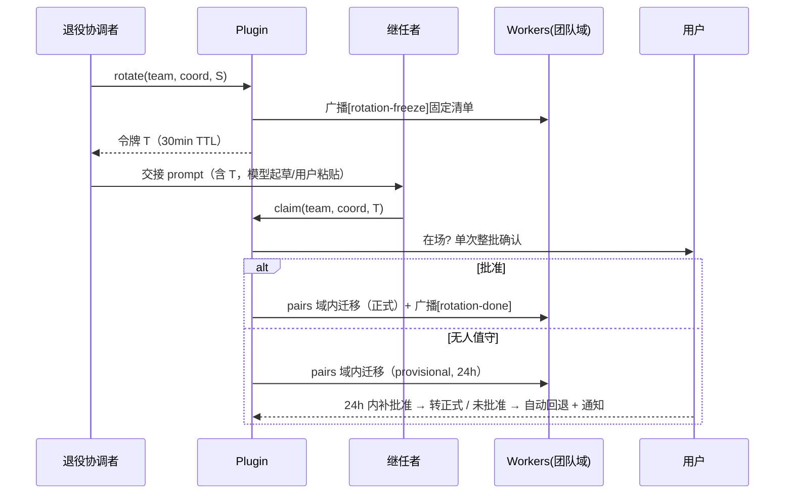
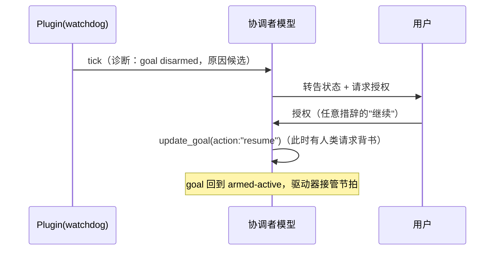

# dsh-team-link 团队升级设计文档（2026-09-17）

> **文档用途**：本文档是 `team-upgrade-research-2026-09-17.md`（下称《调研》）§5 提案的实施级修正设计。对《调研》§7 议题的裁决、DSH 0.1.5 源码验证事实、会诊 #27 的意见处置记录在 §1.2 / §8。机制均带伪代码与 schema；验收标准对齐仓库既有测试形态（`host-half.test.mjs`）。
>
> **状态**：v1.5（2026-09-19：新增「协作增强两项设计」——发送方可见性 **A+D**、`/team_session` 自动建队；**该设计已拆分独立**为 [`collab-enhancements-design-2026-09-19.md`](collab-enhancements-design-2026-09-19.md)，本文 §10 只留指针。**§1–§9 是已发布（0.3.7）的说明书**，一字不动）。v1.4（2026-09-18 增补 §9「收尾修复设计」：settings seam 静默失效与建队引导自锁的修复、清单闭合、发布收尾；**§1–§4、§6、§8 保持 v1.3 原文不变，§5/§7 按 §9.4 增量**——v1.3 的设计评审 PASS 与 token d950e9c5…3209 记录为：10 条 advisory 全部折入：retire 语义 §3.3.2、tick 状态归属与自指拒绝 §3.2.4、pending 过期清扫与回退终态 §3.6.2、provisional 可见面三处 §3.6.2/§5.2、空缺寻址 §3.4、U2 补 dead 分支、数值上限 §4.1、P6 映射 §1.1、《调研》supersession 指针）。更名与 v1.2 沿革见 README「更名通告」。插件版本基线 0.3.0（rename 分支），DSH 0.1.5。

---

## 文档地图与状态（**先读这张表**：分清「已发布的行为」与「本次新增、尚未实施的设计」）

> 本文档是同一份设计文档的连续演进（v1.0 → v1.5）。它**同时**装着两种东西：**已上线功能的说明书**，与**尚未动手的新设计**——先看状态列，再看正文。

| 节 | 内容 | 状态 |
|---|---|---|
| §1–§2 | 背景、痛点、目标与非目标 | 前提，长期有效 |
| §3（§3.0–§3.7） | M1–M4 机制：活性信号 / 看门狗 / roster+黑板 / 广播 fan-out / 信封 / 换届 rotation | ✅ **已实现并发布**（0.3.1–0.3.4，随 0.3.7 发布） |
| §4 | 边界与防偏离 | 长期有效（**红线**） |
| §5 | 验收 U1–U12 | ✅ **已实现**（U9–U11 随 0.3.7） |
| §5 | 验收 **U13–U19**（定义在《协作增强设计》§10.4） | 🚧 **新增，尚未实施** |
| §6 | 实施切片与风险 | 历史记录 |
| §7 | 开放问题（7-1 / 7-2 / 7-3 已定档；7-4 为可选取证） | 已定档 / 声明保留 |
| §8 | 会诊 #27 意见处置 | 历史记录（v1.3 时期） |
| §9（§9.1–§9.7） | 收尾修复设计：settings seam 静默失效、建队引导自举、清单闭合 | ✅ **已实现并发布（0.3.7）**——变更史见 `CHANGELOG.md` |
| **§10 / §11** | **① 发送方可见性（A+D）；② `/team_session` 自动建队；③ 自动换届交接** | 🚧 **本次新增，尚未实施** → **已拆分为独立文档 [`collab-enhancements-design-2026-09-19.md`](collab-enhancements-design-2026-09-19.md)**（节号沿用 §10.x / §11） |

**一句话**：**§1–§9 = 已经上线的东西（0.3.7）**；**§10 / §11 = 还没动手的新设计**（独立文档）。

---

## 1. 背景需求

### 1.1 痛点（继承自《调研》§3.2，编号沿用）

| 痛点 | 一句话 | 本设计对应节 |
|---|---|---|
| P1 | 双端等待时团队静默，无机制叫醒协调者（00:24–00:38 实测 14 分钟） | §3.2 |
| P2 | 星型中转税：跨 worker 信息 O(N) 经 hub，纪律指令成对重发 | §3.3/§3.4 |
| P3 | 指令竞态：发送方看不到接收方正在执行什么，无忙碌可见性 | §3.1/§3.5 |
| P4 | 信任门禁阻塞：未配对直连超时按取消处理，无人值守无法建新通道 | §3.4/§3.6 |
| P5 | 生命周期全手动：24h 内 5 次操作、每次 10–20 分钟、漏步即事故 | §3.6 |
| P6 | 复盘观测性差：还原一次联调要人工拼 6 份日志 | §3.3.3/§3.4（M5 深化） |

### 1.2 DSH 0.1.5 源码验证事实（设计前提，全部已读源码核实）

| # | 事实 | 出处（as-of 0.1.5） |
|---|---|---|
| V1 | goal 续跑由 goal-round-driver 驱动：agent 空闲且 goal 为 active+armed 且轮次未耗尽时，立刻向自身 followup 下一条 `<goal_round>` 消息 | dsh-goal-round-driver/lib/index.js:103-163 |
| V2 | roundsStarted 只在 goal 来源的 user/message 被 admit 进会话日志时递增（要求 source.round === roundsStarted+1）；任何非 goal 消息不消耗轮次 | dsh-goal/lib/index.js:273-279 |
| V3 | 竞态消息进入 nextTurn（跨会话消息、提醒、任何 followup）会把已排队的 goal 轮标记 stale → pre-step 拒绝 → 竞态消息先跑 → 下一次空闲重排同号轮。即：外来消息只 defer goal 轮，不吞轮次 | dsh-goal-round-driver/lib/index.js:240-247, 277-303 |
| V4 | 回合以 max-tokens 结束 → goal 被 disarm（保持 durable，但驱动器不再自动续跑——静默停止）；agent/error 同样 disarm | 同上 :201-203, 264-267 |
| V5 | **activation 不持久化（构造性行为）**：goal 折叠刻意不含 activation（"activation is deliberately absent"），重启后重开的会话按折叠恢复必然 disarmed（dsh-goal:284, 601-602）；加载时存活的 agent 由 driver :344 兜底 disarm——两段因果链同归：**任何重启后必无自动续跑，直到人类 resume**。官方文档把「resume or fork 后 re-arm」定义为正常生命周期（dsh-command-goal/README.md:40） | dsh-goal/lib/index.js:284,601-602 + driver :344 + 会诊 B-1/N3 |
| V6 | 轮次耗尽 → goal 转 blocked（code: round-limit，**留有 durable blockedReason 痕迹**）；resume 校验 roundsStarted >= maxGoalRounds 则拒绝。《调研》§7-7 的「耗尽」假说**应读不应猜**（会诊 F5 修正）：晨间 40/70 只证明恢复时刻未耗尽，形式上不排除夜间先耗尽再被 edit 提额——但耗尽必留 blockedReason，与 disarm（无痕迹）、pause（有痕迹）三种停态**可区分、可诊断**。00:31 静默的机制面归因仍是「当时无 armed-active goal」，具体触发器（max-tokens / 重启 / 配置热更 / pause / 未建）需解压夜班日志复核（§7-4） | driver :125-131 + goal :197 + 会诊 F5/B-2/B-3/N2 |
| V7 | DSH 自带 dsh-schedule 包：会话内持久提醒，空闲后以 followup 投递、绝不打断运行中回合、重复间隔 >=5 分钟、重启存活、冷会话保持逾期直到复活。本 profile 未挂载（需 overlay） | dsh-schedule/README.md |
| V8 | 本插件现状：pairs 配对**同时绕过**发送方审批（gate 1，:691）与接收方 inbound 策略（gate 2，:729）——且 :729 的短路在 receiveMode === "reject" 检查（:731）**之前**，即已配对通道连接收方的显式全拒策略都覆盖；唯一压过 pair 的是显式 block（:669-678）。投递 = steer（运行中）/ followup（空闲） | lib/index.js:680-731 + 会诊 N5 |
| V9 | 客户端契约同时载明 session.create（空白会话，可指定 workspace/cwd，同步可寻址，manager.d.ts:171-184）与 session.fork（继承全 history、可 atSeq 截断，:185-199）；dsh-sdk-protocol 另有「未知 session id 惰性创建」线索（types.d.ts:36，sdk-app 未挂载）。**换届应选 create+交接文档，不选 fork**（fork 背 16h 全量历史，违背换届初衷）。插件侧能否直接调用仍未验证——半自动兜底不依赖它 | 会诊 B-5/N7 |
| V10 | 跨会话消息 source 白名单锁死三成员 {kind, form, senderSessionId}，扩成员会导致整份会话日志迁移拒绝——信封元数据只能走正文 banner | lib/index.js:808-812 |

### 1.3 由 V 系事实得出的三条设计公理

- **A1（goal 感知，四态策略）**：任何「叫醒一个会话」的机制必须先读 goal 状态——armed-active 有自己的续跑节拍（V1），不 tick；**durable-active 但 disarmed 是根因级静默态**（V5），tick 且载荷带诊断；paused/blocked 在等人类决策，tick 只烧回合，不 tick（状态进 list_sessions 信号面）；无 goal 且静默超阈才按 P1 场景 tick（会诊 N1 三分法的四态展开）。
- **A2（不重造定时器，带采用约束）**：会话自身的周期性自我唤醒是 dsh-schedule 的既定职责（V7）。但 schedule 有两条采用约束（会诊 N6）：overlay 须在**会话创建前**启用（存量会话无工具）；reminder 跟随会话不跟随 roster（换届不继承，迁移仍需插件补做）。故本插件：新会话引导用 schedule；存量会话与 roster 感知的唤醒走看门狗；不做通用自 tick 定时器。
- **A3（信任 = pairs，域限定 + 撤销对称）**：自动迁移 pairs 等于零交互预授权一条绕过两道门、**连接收方显式 reject 都覆盖**的通道（V8），其爆炸半径必须被 roster 团队域、TTL 与可撤销性三重限制；且**授予与撤销必须对称**——退役者持有的 pairs/trustedSenders/rememberTargets 同步吊销（会诊 5.4b），否则旧协调者永久保送。
- **A4（唤不醒死会话）**：schedule 与本插件 relay 都只投递存活代理——「活会话节奏维持」是真覆盖面，「失联恢复」不是：观察者/目标已关闭时唯一诚实动作是向用户告警。写入非目标，防交付后被当 bug（会诊 B-6）。

---

## 2. 目标与非目标

### 2.1 目标（按里程碑排序，对应《调研》§7-1 裁决）

| 里程碑 | 内容 | 解决 | 依赖 |
|---|---|---|---|
| M1 | liveness 轻档 + busy 可见性（list_sessions 增强，纯只读）+ 看门狗最小版（按显式 sessionId 列表盯人） | P1 诊断面、P3 预防 | 无 |
| M2 | roster + 团队黑板（读写工具 + 人可读镜像） | P4/P5 身份底座 | 无 |
| M3 | broadcast fan-out + 结构化信封 banner | P2 | M2 |
| M4 | rotation 两阶段（令牌 + 域限定迁移 + 临时信任 + TTL 回退） | P5、P4 的正解 | M2 |
| M5（积压） | receipts 全量（已消费级回执）、sidecar 索引 | P6 深化 | M1–M4 后再评估 |

会话自 tick（心跳重档）：不做插件定时器。文档引导团队启用 dsh-schedule overlay（A2），由协调者自建重复提醒；看门狗负责跨会话失联（schedule 覆盖不了的场景）。

### 2.2 非目标（在《调研》§5.7 四条上新增第六条）

1. 不做自主编排器（自动派活/协商/swarm）——沿用。
2. 不做全连通自由群聊——沿用；v1 同时砍掉进模型上下文的共享总线（裁决见 §8 议题 2；人类可读 feed 由黑板承担）。
3. 不对抗 source 白名单（V10）——沿用。
4. 不并入会诊/多模型评审（thincoder-suite 边界）——沿用。
5. **新增：不做会话内自 tick 定时器**——该职责归 dsh-schedule（A2，带采用约束）；本插件定时器只做跨会话看门狗，且 tick 正文为插件常量（见 §3.2.3）。
6. **新增：不做死会话唤醒/失联恢复**（A4）——schedule 与 relay 都只投递存活代理；目标/观察者已关闭时看门狗只向用户侧信号面标 dead，不承诺恢复。

---

## 3. 具体方案与机制

### 3.0 分层视图（《调研》§5.0 的修正版）

```
roster（身份层：团队→角色→会话，含版本史）          ← 底座
 ├── liveness（活性层）：只读信号 + goal 状态 + 跨会话看门狗   → P1
 ├── broadcast（寻址层）：roster 解析的 fan-out 循环           → P2
 ├── rotation（生命周期层）：令牌 + 两阶段信任迁移              → P5/P4
 └── observability（可观测层）：busy + 信封 banner + 黑板       → P3/P6
（会话内自 tick → 复用 dsh-schedule，不占本插件分层）
```

与《调研》的差异：心跳层改名 liveness 并重定义为「信号 + 看门狗」；群总线从 v1 移除；receipts 降级为 observability 的一部分且全量回执推迟到 M5。

### 3.1 M1a：liveness 轻档与 busy 可见性（list_sessions 增强）

**改动点**：`team_link_list_sessions` 每个会话行增加活性信号行。

**数据来源**（全部已有服务，无新依赖）：
- agent 服务：ctx.agents.get(id)?.status（running / idle / undefined=未运行）——已有；
- ctx.sessionQuery.readSurface(id)：末条 assistant 消息时间、末条入站消息时间——已有；
- goal 状态：ctx.get("goals")（可选解析，缺服务时降级显示 goal:?，不影响插件启动——沿用本插件「运行时解析、优雅降级」的注入风格）。

**schema（list_sessions 每行新增，内部结构）**：

```ts
interface LivenessSignal {
  agent: "running" | "idle" | "not-live";
  lastAssistantAt: number | null;   // surface 末条 assistant/message 时间
  lastInboundAt:   number | null;   // 末条 user/message（含 relay）时间
  turnStartedAt:   number | null;   // running 时当前回合开始时间（surface 末个 turn/start）
  goal: { phase: "active"|"paused"|"blocked"|"complete"|"none";
          activation: "armed"|"disarmed"|"?";
          rounds: string;           // "40/70"
          blockedReason: string | null } | null;  // goals 服务缺失时 null（降级）
  silenceMs: number;                // now - max(lastAssistantAt, lastInboundAt)
  verdict: "ok" | "goal-disarmed" | "silent-idle" | "long-running" | "dead";
}
```

实现注（会诊 N4）：goal-round-driver 的 `inject = ["agents","goals","sessions"]` 证明 goals 是可注入服务；本插件以 `ctx.get("goals")` 可选解析 + `ctx.agents.get(id)` 取代理——**纯服务调用，无需解析日志**，成本趋零。

**verdict 判定伪代码（A1 四态策略）**：

```ts
function verdict(s: LivenessSignal, cfg = { silentMin: 10, runMin: 30 }): Verdict {
  if (s.agent === "not-live") return "dead";
  if (s.agent === "running") {
    if (s.turnStartedAt && now - s.turnStartedAt > cfg.runMin*60_000) return "long-running";
    return "ok";
  }
  // idle：
  const g = s.goal;
  if (g?.phase === "active" && g.activation === "armed") return "ok";          // 有自己的续跑节拍（V1）
  if (g?.phase === "active" && g.activation === "disarmed") return "goal-disarmed"; // 根因级静默态（V5），立即告警不等静默阈
  if (g?.phase === "paused" || g?.phase === "blocked" || g?.phase === "complete")
    return "ok";                                                                // 在等人类决策/已完结：解释了的静默，只展示不告警（B-3）
  if (s.silenceMs > cfg.silentMin*60_000) return "silent-idle";                 // 无 goal 的 P1 场景
  return "ok";
}
```

**防偏离**：list_sessions 输出每行尾部统一附「（读数 2026-09-17 23:42:05，>2min 作废）」——把「陈旧读数作废」的团队纪律固化进工具输出。

### 3.2 M1b：跨会话看门狗（watchdog）

#### 3.2.1 职责边界

只做一件事：注册的观察者会话空闲、且被盯目标出现失联征兆时，向观察者自身 followup 一条固定文案的 tick。观察者醒来后自己决定轮询/转派/上报。

#### 3.2.2 注册 schema（settings 命名空间 team-link 新增键）

```yaml
watchdogs:
  - id: "wd-<uuid>"            # 注册时生成
    team: string | null        # M2 后可填；v1 允许 null（纯 sessionId 列表模式）
    watcherSession: string     # 观察者会话 id（tick 的接收方）
    targets: [string]          # 被盯 sessionId 列表（M2 后支持 "team:<name>/<role>"）
    silentMinutes: int         # 失联阈值，>= 10
    intervalMinutes: int       # 巡检间隔，>= 5，默认 5
    expiresAt: number          # 注册时间 + TTL（默认 12h），到点自动清理
    createdAt: number
```

#### 3.2.3 机制伪代码

```ts
// 插件侧 cordis 定时器（intervalMinutes 粒度）；每个 watcher 独立去抖
async function patrol(w: Watchdog) {
  if (now > w.expiresAt) return removeWatchdog(w.id);         // TTL 自清【最先】（审计 D1 修正：观察者已死/
                                                              // running/armed 的早退不得挡住过期清理，防注册行泄漏）
  const watcher = ctx.agents.get(w.watcherSession);
  if (!watcher) return markWatcherDead(w);                   // 观察者已关闭：只标信号面，不承诺恢复（A4）
  if (watcher.status === "running") return;                  // 绝不打断运行中的观察者（对齐 V7 投递规则）
  if (isArmedActive(w.watcherSession)) return;               // 观察者自己在续跑：不 tick（A1）
  for (const t of resolveTargets(w)) {                        // v1: sessionId 直查；M2: roster 解析
    const s = liveness(t);                                    // §3.1 的信号
    if (s.verdict !== "silent-idle" && s.verdict !== "goal-disarmed" && s.verdict !== "dead") continue;
    if (recentlyTicked(w.id, t)) continue;                    // 同一目标去抖：一个静默期最多一次 tick
    watcher.followup(tickMessage(t, s));
    markTicked(w.id, t, s.silenceMs);
  }
}

function tickMessage(t, s) {                                   // 正文为插件常量模板，模型不可注入载荷
  let text;
  if (s.verdict === "goal-disarmed") {
    // 会诊 B-4 边界：裸 tick 不会 re-arm（drive() 对 disarmed 直接 return），
    // 且模型无权自行 resume（dsh-tool-goal:303 人类请求门）——tick 只告知状态、
    // 引导转告用户；用户授权后模型再 resume。插件绝不直接调 ctx.goals.resume。
    text = "[watchdog] 目标 " + t + " 的 goal 处于 active-but-disarmed（可能原因：max-tokens 回合结束 / "
         + "DSH 重启 / agent error，读数 " + stamp() + "）。该状态不会自愈：请向用户说明并请求授权 resume；"
         + "用户同意后调用 update_goal(action:"resume") 恢复续跑。复核用 team_link_list_sessions。";
  } else {
    text = "[watchdog] 目标 " + t + " 失联征兆：verdict=" + s.verdict
         + " 静默 " + fmt(s.silenceMs) + "（读数 " + stamp() + "）。"
         + "请用 team_link_list_sessions 复核后处置；误报或不再需要盯人可用 team_link_watch clear。";
  }
  return { id: "slp-wd-" + randomUUID(), role: "user",
           source: { kind: "agent-message", form: "relay", senderSessionId: watcherSession },
           content: [{ type: "text", text: banner(text) }] };  // senderSessionId=观察者自身，见注
}
```

> **注（source 合规）**：watchdog 没有会话身份。两个合规选项：(a) senderSessionId 填观察者自身 id（消息形态=「自己注册、自己接收」的 relay；对 goal 栅栏行为与普通 followup 相同，V3 已验证安全）；(b) createUserMessage 普通无 source 用户消息。实现取 (a)，语义诚实且不扩白名单（V10）。开放问题见 §7-2。

#### 3.2.4 注册工具与安全

team_link_watch(action: "register"|"list"|"clear", targets?, silentMinutes?, intervalMinutes?, ttlHours?)

- register 仅允许 exec.agent.id === watcherSession（只能给自己注册）；且**拒绝 watcherSession ∈ targets 的自指注册**（评审 #9：自指 = 变相自 tick 定时器，踩非目标 #5 与公理 A2）；
- **tick 状态归属**（评审 #2 补）：recentlyTicked/markTicked 为插件进程内 Map，**不持久化**——重启即忘，语义 = 同一静默期最多一 tick，重启后若目标仍静默且超过去抖间隔则允许再 tick 一次（宁可一次多余 tick，不做持久状态）。markWatcherDead 同理只写信号面（list_sessions 展示 dead），不改注册；观察者代理在 TTL 内回归则 patrol 自然恢复投递，注册保留至 TTL 自清。
- 防失控：单会话并发注册 <=3；silentMinutes >= 10、intervalMinutes >= 5、TTL <= 24h；tick 正文常量化（防 prompt 注入搭车）；
- 与 goal 的关系（§7-7 落地）：观察者自身若 armed-active，goal 驱动器本就在续跑——patrol 对 running/armed-active 观察者直接跳过，与 A1 一致；对 active-but-disarmed 的目标按 goal-disarmed 告警（tick 文案含诊断与合规 resume 回路，B-4）；
- 覆盖面诚实声明（A4/B-6/N6）：观察者或目标任一方关闭 = 不可达，watchdog 只在信号面标 dead 并等待用户；自 tick 引导采用 dsh-schedule 时须注意两条约束——overlay 需在会话创建前启用（存量会话无工具），reminder 不随 roster 迁移（换届时插件侧补迁移或新协调者重建）。

### 3.3 M2：roster（角色注册表）与团队黑板

#### 3.3.1 roster schema（settings 新增键 + 人可读镜像）

```yaml
teams:
  - name: "night-shift"          # 工作区内唯一；[a-z0-9-]
    createdAt: number
    policy: { writer: "coordinator" }   # coordinator | any：谁能调用 roster 写操作
    roles:
      - role: "coordinator"      # 约定角色名；允许自定义（如 reviewer）
        current: "session-xxx"   # 现任；null=空缺
        pending: null            # 换届中继任者（§3.6），结构见下
        history:                 # 版本史，退役≠删除
          - { session: "session-old", from: number, until: number|null, note?: string }
```

镜像文件 team/<name>/roster.md（与 settings 同一事务内 best-effort 写，读以 settings 为准）。

#### 3.3.2 工具面

- team_link_roster(action: "get"|"upsert-team"|"set-role"|"retire", team?, role?, session?, note?)
- **retire 语义**（评审 #1 补）：仅由现任协调者会话或用户发起；效果 = 该角色 current 置空（vacant）+ history 追加带 note 的退役记录。retire 本身不动 pairs（它不携带信任授予）；但提供可选「顺带清理」：单个用户对话框列出全部指向退役会话的 pairs/trustedSenders/rememberTargets（复用 §3.6.1 原则 3 的对称撤销代码），勾选后清理。不清理也无安全洞（pairs 照旧过门），只是死数据堆积——选择权留给用户。
- 写权限：policy.writer === "coordinator" 时仅 coordinator.current 会话可写（exec.agent.id 校验）；任何会话可读。settings UI 永远可改（用户是超级写者）。
- set-role 副作用：若被替换会话存在 pairs，不自动迁移——迁移只发生在 rotation 流程（§3.6），避免绕过换届令牌。
- **创建即认领（bootstrap，§9.2 落地）**：`upsert-team` 在**创建**路径把调用会话播种为 coordinator 现任（`roles: [{ role: "coordinator", current: caller, ... }]`）。理由：创建路径本就不过 `writerGate`，此刻无在任者可侵犯；否则会产生「团队已存在但 coordinator 空缺 ⇒ 所有会话路径写不进」的死锁（工具路径与设置 UI 路径同时不可用，2026-09-18 实测）。`writerGate` / `retireGate` 既有语义不变——**手写**的空缺行仍然全拒。

#### 3.3.3 黑板（team/ 目录约定）

```
team/<name>/roster.md       # roster 镜像（插件写）
team/<name>/decisions.md    # 裁决账本：只追加，每行 "seq | time | author-session | 正文"
team/<name>/discipline.md   # 纪律条款：整文件替换需带 baseHash（乐观锁）
```

- team_link_team_read(team)：一次返回 roster + decisions 末 K=20 条 + discipline 全文（一次读齐，省轮次）；
- team_link_team_append(team, file, line)：decisions 只追加；discipline 用 baseHash 乐观锁防双写覆盖（P2 场景里两个 worker 并发改稿的实测风险）。

### 3.4 M3：broadcast（角色制 fan-out，无总线）

team_link_send 增加可选参数 targets: string[]，成员为 sessionId 或寻址表达式：

```ts
// 解析优先级：sessionId 直达 > "team:<name>/<role>" > "team:<name>/*"（全队）
function resolveTargets(expr, roster, caller): SessionId[] {
  if (isSessionId(expr)) return [expr];                        // 逐个照旧过两道门（V8 不放宽）
  if (expr === "team:<name>/*") {
    require(caller === roster.coordinator.current);            // 全队广播仅协调者（策展价值，《调研》§5.3 论据 (a)）
    return allLiveMembers(roster, name);
  }
  if (expr === "team:<name>/<role>") {
    const holder = roster.role(role).current;
    if (holder === null) return [{ target: expr, outcome: "no-holder", detail: "该角色当前空缺" }]; // 评审 #7：空缺返回类型化结果，不投 [null]
    return [holder];                                          // 任何人可按角色点对点（仍过门）
  }
}
// fan-out = 循环现有 send 全路径（含双门、配对快路径、blocked 检查），单次 <=8 目标，
// 每目标独立返回 {target, outcome: delivered|refused|no-agent, detail}
```

- **v1 不做共享总线**（§8 议题 2 裁决，理由按会诊 5.3 修正）：总线本身不是错，错在**不声明消费端**——注入模型上下文的总线 = 全员收件箱复制，违背「给 flash worker 省上下文」；人类可读的 UI/黑板级 feed 与策展不冲突且顺手解 P6。v1 的取舍：进上下文的总线不做；人类 feed 由 §3.3.3 黑板承担（team/ 目录 + team_read）；跨 worker 信息仍由协调者策展转发（E1/E5 已证有效）。
- **信封 banner**（V10 约束下的元数据方案，§8 议题 5 裁决）：send 增加 meta?: { type?: "ruling"|"receipt"|"report"|"ask", pri?: "P0"|"P1"|"P2", ref?: string }，渲染为 banner 首行的紧凑字段，正文不变：

```
📨 [跨会话消息 · 来自会话「X」(session-x) · 2026-09-17 23:42:05 · type=ruling pri=P0 ref=slp-a1b2]
```

  不做 sidecar 索引：会破坏导出日志的自包含审计性（本插件自己的 export 是审计载体），且引入第二事实源；一行 banner 的 token 成本相对一次 LLM 回合可忽略。

### 3.5 M3.5：busy 可见性（P3 的预防面）

已并入 §3.1 的 LivenessSignal（agent/turnStartedAt/lastAssistantAt）。send 的返回文案增加预判提示：目标 running 且 steer 在途 → 提示「目标回合已运行 N 分钟，指令将注入当前回合（steer）；若需新回合语义请等待其空闲」。两级回执的「已消费」级推迟到 M5（send 同步返回已是事实上的「已投递」回执）。

### 3.6 M4：rotation 两阶段换届

#### 3.6.1 安全模型（§7-3 的裁决，核心）

**威胁**：错误/恶意的「继任者」会话骗取 coordinator 身份 → 若 pairs 自动迁移，它获得向全体 worker 的免双门注入通道——且该通道连接收方的显式 reject 策略都覆盖（V8/N5，安全论证以此为基线）。

**边界四原则**：
1. **主张权靠令牌**：继任者必须持有退役协调者在 prepare 阶段生成的一次性令牌（经交接 prompt/用户粘贴传递），不能自封。令牌绑定 (team, role, successorSessionId)，30min TTL，claim 幂等（崩溃重试不失效、成功即作废）；
2. **爆炸半径限团队域**：自动迁移的 pairs 仅限「退役者↔同 roster 成员」；退役者与团队外的 pairs 一律随退役清理、不迁移；
3. **授予与撤销对称**（会诊 5.4b）：退役者**持有**的 pairs、trustedSenders（他人信任退役者）与 rememberTargets（退役者信任他人）全部同步吊销/清理——退役协调者会话可存活数天（实测 W2 账龄 9 天），不吊销 = 旧协调者永久保送；
4. **信任授予人在环或可回退**：用户在场→单个换届对话框内列出全部待迁移对，支持逐项勾选 + 整批确认（未勾选项回落到正常首问门，会诊 §7-3 建议；确认收拢一处，不弹 N 个窗）；无人值守→临时（provisional）pairs + TTL 内未批准自动回退。任何时刻可一键撤销（rotationBackup 快照）。

**诚实声明**（会诊 5.4c）：TTL 回退只能阻止**未来**发送；已注入 worker 上下文的消息不可回收。provisional 期间的消息量在 list_sessions 可查，回退后的人工审计以此为凭。

**错峰默认**（《调研》§5.4-4 / §7-4 裁决）：默认「先换协调者→稳定→再换 worker」，任何时刻保留一个活记忆（纪律与协议上下文是 E4 证明的最贵重建物）；「一次全换」提供但强制先跑 FREEZE 清单 + 落盘交接文档。三家会诊一致维持错峰（kimi：18:03–18:25 实证流程本身就是错峰，全换把漏步风险最大化）。

#### 3.6.2 流程与伪代码

```ts
// Phase A：prepare —— 只能由现任协调者会话（或用户经 settings UI）发起
rotate(team, role, successorId | null, note?) {
  require(exec.agent.id === roster[role].current || userInitiated);
  require(rateLimit(team, role, 10min));                       // 防换届风暴
  const token = randomUUID();                                  // 绑定 (team, role, successorId)，一次性
  roster[role].pending = { session: successorId, token, team, role, expiresAt: now + 30min };
  roster.rotationBackup = snapshot(pairs, trustedSenders, rememberTargets, roster); // 撤销依据（对称撤销的完整快照）
  broadcast(team, FREEZE_NOTICE);                               // 固定文案：停哨兵/后台 job→确认无在飞动作→状态冻结回报
  return "换届包已就绪。请将令牌随交接 prompt 交给 " + successorId
       + "：" + token + "（30 分钟内有效）。交接内容（prompt/交接文档）由你起草——机制与判断分离。"
       + "提示继任者：上任首个动作建议 /goal resume 或建新 goal（armed-active = 内建心跳，防重蹈 00:31，会诊 5.4 补）。";
}

// Phase B：claim —— 只能由 pending.session 本身发起，凭令牌；幂等（重试同 token 不重复迁移）
claim(team, role, token) {
  require(exec.agent.id === roster[role].pending.session && pending 未过期);
  require(roster[role].pending.token === token && pending.matches(team, role, exec.agent.id));
  const migrated = pending.migratedPairs ?? [];
  if (migrated.length === 0) {                                 // 首次 claim 才迁移；重试走已迁移清单
    const ratified = tryAskUserOnce(ROTATION_DIALOG(列出全部待迁移对，逐项勾选 + 整批确认));
                                                                // 在场：单对话框整批确认；无人值守：超时→false
    roster[role] = { current: pending.session, history: history.append(旧任), pending: { ...pending, migratedPairs: [...] } };
    for (pair of pairs where 退役者 ∈ pair && 对端 ∈ team && 用户勾选) {
      replaceWith(新任, 对端, { provisional: !ratified, expiresAt: now + 24h }); // 域限定迁移
    }
    dropPairs(touching 退役者, 未迁移的);                        // 团队外/未勾选：不迁移（原则 2）
    revoke(退役者.heldPairs + trustedSenders.listing(退役者) + rememberTargets.of(退役者)); // 对称撤销（原则 3）
    broadcast(team, ROTATION_DONE(新任, ratified ? "已批准" : "待批准(24h)"));
    if (!ratified) scheduleProvisionalExpiry(team, role, 24h);  // TTL 到点：provisional pairs 自动删除 + 通知
  }
}

// 评审 #4 补：prepare 流产（令牌 30min 过期无人 claim）不得让 worker 永久冻结——
// 过期清扫挂在 watchdog patrol 同一定时器上（定时 + roster 触碰时懒检查双保险）
function sweepExpiredPendings() {
  for (const p of expiredPendings(now)) {
    roster[p.team][p.role].pending = null;
    broadcast(p.team, ROTATION_CANCELLED(角色, 旧任仍为 current, "令牌过期未认领，解除冻结"));
  }
}
// 评审 #5 补：provisional TTL 回退后的 roster 终态——新任保持 current（换届事实已成立，
//   降格需用户显式操作），信任回退为过门投递；history 追加 "provisional 未批准过期"；pending 无残留。
// 评审 #3 补：provisional 可见面 = 三处——ROTATION_DONE 广播文案、list_sessions 的 pairs 标记、
//   send 走 provisional pair 时返回文案后缀 "（provisional 通道，24h 内未批准自动回退）"；信封 meta 不扩字段。
```

```js
// ---- 实现评审补丁（0.3.4 代码评审 round 1/2 落地，as-of 2eb6d11）----
// P1（已落定判据）：claim/sweep 的「已落定」信号 = current === pending.session（prepare 拒绝自换保证全新
//     pending 无此态）；migratedPairs 仅作清单，不再是落定判据（空标记落定态曾致重放把继任者当退役者）。
// P2（TTL 双层执行）：pairRecordBetween 视「provisional 且 expiresAt <= now」为无 pair（投递侧守门，活记录
//     优先于同对死记录）；sweep 的 doomed 删除先于 touched 守卫（清扫侧兜底）——手删窗口也不会让过期
//     provisional 对免门存续。
// P3（身份交错）：set-role 把角色交给 pending.session（继任者）时顺手清 pending——令牌随身份显式变更失效，
//     防止后续 claim 误走 replay 跳过对称撤销。
// P4（重放状态词）：claim 落定时把状态词记入 role.rotationStatus（schema 显式声明防 settings 往返抹除），
//     replayClaim 直读记录值，不再从残留字段重推。
```

#### 3.6.3 时序图



#### 3.6.4 半自动兜底（V9 未验证不阻塞）

若插件 API 面最终无法编程创建会话：prepare 阶段额外产出「预填交接 prompt 的新会话打开指引」（深链/复制即用），用户只点创建。机制部分（令牌、迁移、广播、清理）全部保留——消除的是漏步风险，不是点击数。

> **2026-09-19 更新**：V9 的 API 面已证实可用（`agents.create`），**全自动方案见《协作增强设计》§11**。本节这一条随之**降级为「自动创建失败时的退路」**，不再是主路径。

### 3.7 心跳 × goal 交互规范（§7-7 的落地，全源码验证 + 会诊核验）

**goal 停态全景**（比初稿多四条路径，会诊 B-2/B-3/N2；前四条是 disarm，无持久痕迹；后两条有痕迹）：

| 停态 | 触发路径（源码） | 持久痕迹 | verdict |
|---|---|---|---|
| disarm | 回合 max-tokens 结束（driver:264-267） | 无 | goal-disarmed |
| disarm | agent/error（:201-203） | 无 | goal-disarmed |
| disarm | 持久化 checkpoint 失败（:109-114） | 无 | goal-disarmed |
| disarm | turn abort 且轮次未 claimed（:271）；重启/折叠恢复（V5 两段链）；配置热更触发 effect teardown（:345-349，假说级：夜间改配置=团队静默） | 无 | goal-disarmed |
| pause | turn abort 且轮次已 claimed/admitted → 下一次 idle 自动 pause（:222-229）；idle 时 attempt 仍 queued/claimed/cancelled（:218-231） | 有（durable paused） | ok（展示） |
| blocked | 轮次耗尽（:125-131，round-limit）；goal 轮被下游 pre-step 拒绝（:317-324，prompt-rejected） | 有（durable blockedReason） | ok（展示） |

**tick 策略四态表（A1）**：

| goal 状态 | tick？ | 理由 |
|---|---|---|
| armed + active | 永不 | 有自己的续跑节拍（V1）；tick 只稀释节奏（V3） |
| active + disarmed | **必须，立即**（不等静默阈） | 根因级静默态（V5）；裸 tick 不会 re-arm，载荷须带诊断 + 合规 resume 回路 |
| paused / blocked / complete | 不 tick | 在等人类决策/已完结：tick 只烧回合；状态进 list_sessions 信号面（含 blockedReason） |
| 无 goal | 静默超阈才 tick | P1 场景（协调者等 worker 回报） |

**合规 resume 回路**（B-4，关键边界）：模型无权自行 resume（dsh-tool-goal:303 明确 edit/pause/resume 需顶层人类请求）。插件也不得代调 ctx.goals.resume——那是机器绕过人类门 re-arm 自动驾驶，踩 §3.6 同一条红线。完整回路：



- **观察者侧**：watchdog tick 是普通 nextTurn 消息 → 若观察者恰有已排队 goal 轮，goal 轮被 defer 不被吞（V3），节奏稀释一轮即恢复；竞态路径安全 ≠ 零成本（每 tick 占一整回合的 token/延迟，会诊 5.2 注）。
- **引导文案**：团队 onboarding 模板建议协调者为长班值守建 goal（armed-active = 内建心跳），看门狗兜底 disarmed 与 goal-less 两个静默窗口；换届提示继任者首个动作 resume/建 goal（§3.6.2）。

---

## 4. 边界与防偏离设计

### 4.1 安全边界（能力 ↔ 限制成对出现）

| 能力 | 限制（防偏离） |
|---|---|
| watchdog tick 唤醒观察者 | 正文=插件常量模板（goal-disarmed 载荷含诊断与合规 resume 回路，不含任何模型可注入槽位）；只打空闲且未 armed-active 的观察者；paused/blocked 目标不 tick 只展示；同目标一静默期一 tick；注册<=3/会话；TTL<=24h 自清；绝不代调 ctx.goals.resume（B-4） |
| broadcast fan-out | 全队通配仅协调者；逐目标照走双门，fan-out 不放宽任何门（V8）；单次 fan-out <=8 目标 |
| rotation 自动迁移 pairs | 令牌一次性且绑定 (team,role,successor)，claim 幂等 + 团队域限定 + 单对话框逐项勾选/整批确认或 provisional+TTL 回退 + 10min 速率限制 + rotationBackup 可撤销 + 授予与撤销对称（退役者持有的 pairs/trustedSenders/rememberTargets 同步吊销） |
| roster 写入 | writer 策略（默认仅协调者会话）；用户经 settings 永远可写 |
| 信封 meta | 仅 4 个枚举 type + 3 级 pri + ref 短串（≤16 字符，超长截断）；渲染进 banner 首行，不扩 source（V10） |
| 黑板写 | decisions 只追加；discipline 乐观锁；单行长度上限 **500 字符**（防黑板刷屏污染） |

### 4.2 模型行为防偏离（把《调研》§2.3 的自发纪律固化为机制）

- **读数时效**：list_sessions / tick / freeze 通知统一带时间戳与作废窗口提示；
- **回执文化**：send 返回的 msgId（slp- 前缀）可被接收方在回复中引用（ref=），信封首行闭环；
- **收尾清单固化**：FREEZE_NOTICE 是插件常量（停哨兵→确认无在飞→冻结回报→交接），内容槽位才留给模型；
- **机制与判断分离**：换届包的机械部分全插件化，交接内容永远模型起草（E4 证据）。

### 4.3 明确不做（防范围漂移清单）

自 tick 定时器（schedule 职责）· 共享总线 · 自由 mesh · 跨会话分布式锁/事务（P3 的解是可见性+错峰，不是锁）· 自动派活协商 · sidecar 元数据索引（M5 前不做）· 对抗 source 白名单。

---

## 5. 验收标准

### 5.1 单元验收（扩展 host-half.test.mjs，stub 风格沿用）

| # | 断言 | 覆盖 |
|---|---|---|
| U1 | verdict 五态判定表（ok/goal-disarmed/silent-idle/long-running/dead，含 paused/blocked→ok 展示、goals 服务缺失降级） | §3.1 |
| U2 | patrol 四态策略：观察者 running/armed-active→不 tick；目标 armed-active→不 tick；goal-disarmed→立即 tick 且载荷含诊断与 resume 回路文案；paused/blocked→不 tick；silent-idle→tick 恰一次（fake timers）；**观察者代理不存在→不 tick、信号面标 dead、注册保留至 TTL**（评审 #8 补） | §3.2/§3.7 |
| U3 | tick 消息 source 三成员合规 + 正文与注册参数无关（常量化；goal-disarmed 载荷仅状态字段插值） | §3.2.3/V10 |
| U4 | roster 写权限：非协调者会话 set-role 拒绝；upsert-team 幂等 | §3.3 |
| U5 | resolveTargets：通配仅协调者；fan-out 每目标独立过门（unpaired+无确认服务→逐目标 fail-closed，不因批量放宽） | §3.4/V8 |
| U6 | rotate/claim：错令牌/过期令牌/跨 team-role-successor 绑定不匹配→拒绝；非 pending.session 发起→拒绝；claim 幂等（重试不重复迁移）；团队外与未勾选 pairs 不迁移；退役者持有的 pairs/trustedSenders/rememberTargets 对称吊销；provisional TTL 到点回退 | §3.6 |
| U7 | 信封 banner：meta 枚举校验、超长 ref 截断、banner 首行格式 | §3.4 |
| U8 | 既有全部用例不回归（深链/导出/双门/配对/wellFormed） | 回归红线 |
| U9 | settings 时序回归锁（§9.1）：**先跑 apply、之后才提供 settings** → store 最终挂到 settings 且写入落在 stub 的命名空间；同时断言挂载成功留一行 info（修复前此用例必红） | §9.1 |
| U10 | 建队自举（§9.2）：创建路径 → `coordinator.current` = 创建者，且该会话随后 `set-role` 成功；团队已存在时 `roles` 不变（幂等，非现任无法借此劫持）；**手写空缺行**（设置 UI 产出）时仍返回既有的「空缺→设置 UI」提示（U4 语义保留） | §9.2 |
| U11 | 降级红线（§9.1.3）：settings 彻底缺失时全功能仍可用（内存引擎）且**有且仅有一行** warn；goals 缺失仍渲染 `?` | §9.1 / §5.3 |

### 5.2 集成验收（双/多会话手工演练脚本，每项写明期望）

1. **P1 复现→解除**：会话 A（无 goal）发指令后静默 >=10min → 看门狗 tick A → A 轮询 list_sessions 发现 B verdict=silent-idle → A 主动 nudge。全程无人工。
2. **goal 互不打扰**：A 建 goal（armed）后看门狗不再 tick A；A 的 goal 轮正常续跑（日志 goal_round 连续同号递增）。
3. **换届夜航**：C1 prepare→C2 claim（无用户确认）→ workers 收到 freeze/done 通知 → C2 可发消息（**send 返回文案标 provisional**）→ 模拟 24h 到点未批准 → pairs 回退 + C2 发送恢复过门 + roster history 记 "provisional 未批准过期"（评审 #3 修正：banner 不承载 provisional，验证面为 send 返回/广播/list_sessions）。
4. **换届白航**：同上但用户在场单次确认 → pairs 正式迁移 + 旧 pairs/trustedSenders 清理 + roster.md 镜像一致。
5. **广播策展**：worker 尝试 team:night/* → 拒绝；协调者发 → 三 worker 各自独立过门投递。
6. **审计自包含**：export 任一参与会话，信封首行（type/pri/ref）在 md 导出中完整可读。
7. **冷启动自举（§9）**：真实 DSH 冷启动后，在**不手改 YAML** 的前提下完成「建团队（创建会话自动认领 coordinator）→ 派活 → 黑板读写」；随后检查 `profile\settings.yaml` 出现 `team-link:` 段（落盘实证），并确认 `dsh-web.out.log` 有一行 `policy store attached to settings namespace`。

### 5.3 红线（任一破坏即拒绝合并）

- source 白名单三成员不变（V10）；
- fan-out 不绕门、rotation 迁移不出团队域、provisional 必带 TTL；
- 所有新增模型可见输出过 wellFormed 门槛（沿用 textOutput 约定）；
- goals 服务缺失时插件功能完整降级（仅 goal 信号显示 ?）；
- **服务获取不得静默失效**（§9.1.3 / §9.3）：settings 未能立刻挂载时必须留一行 warn，挂载成功留一行 info——不得存在任何第二次静默回退。**粒度是「每个未挂载窗口」**：store 可因 provider 生命周期结束（`detach`）而重新进入未挂载态，此时告警门随窗口复位——否则第二个窗口里的**拒绝**会零告警，与 ③ 的原始缺陷同形。

---

## 6. 实施切片与风险

| 切片 | 规模 | 风险点 |
|---|---|---|
| M1（§3.1+§3.2） | 中；无 schema 迁移冲突（watchdogs 新键） | fake timers 测试；goals 可选注入 |
| M2（§3.3） | 中；settings schema 加 teams 键 | 镜像文件事务性（best-effort 定级） |
| M3（§3.4+§3.5） | 小–中 | fan-out 部分失败的返回文案 |
| M4（§3.6） | 大；两阶段+TTL 回退+速率限制 | 令牌传递 UX；provisional 状态一致性 |

## 7. 开放问题（实施前需确认）

1. ~~V9 的插件侧编程创建会话：客户端契约已证 session.create/session.fork（换届选 create 不选 fork），dsh-sdk-protocol 另有「未知 session id 惰性创建」线索（sdk-app 未挂载）——影响 §3.6.4 是否升级为全自动创建（不阻塞 M4）~~ → **API 面已验证（2026-09-18）**：本版本宿主面 `@deepseek-ai/dsh-agent` 的 agents 服务**暴露** `create(options: CreateAgentOptions): Promise<AgentHandle>`（`lib/types/index.d.ts:279`；实现 `lib/index.js:408-422`），语义是「通过已注册工厂**构造 agent 及其 session**」（与只登记已构造对象的 `register` 相区别）；`CreateAgentOptions` 要求调用方自带 `sessionId: SessionId`，可选 `meta{cwd, parentSession, isSeeded, origin, delegationDepth}`（`:48-72`）。本插件**已注入 `agents`**（lib/index.js:62），故插件侧编程建会话在 0.1.5 上**可达**。**残留（如实标注）**：(a) 运行时工厂是否已注册（`agents.setFactory`）以及 headless 派生会话是否可用，**未做真机验证**；(b) **决策**：2026-09-18 时判为「本轮不升级」；**2026-09-19 已销账**——自动化设计落在《协作增强设计》**§11**（`successor:"auto"` 自建继任者 + 交接文档落黑板；触发**仅限显式发起**，不做传感器自动触发）。选 create 不选 fork，见 V9。
2. ~~watchdog tick 用方案 (a)（relay 形态、senderSessionId=观察者自身）是否被会话格式迁移接受——需在真实日志上跑一次迁移校验（实现 U3 时顺带验证）~~ → **契约层已验证（2026-09-18）**：`@deepseek-ai/dsh-session-format-v2-to-v3` 的迁移校验器要求 `source.kind === "agent-message"` 时成员集**恰为** `{kind, form, senderSessionId}`，且 `form === "relay"`、`senderSessionId` 为非空字符串；未知 kind 与未审计成员一律拒绝（`lib/index.js:29` 白名单、`:125-132` 逐条校验）。与本插件 tick 的投递形态**逐字一致**。**残留（如实标注）**：端到端「在真实日志上跑一次迁移」仍待有真实 tick 落盘后执行——U3 的单测断言是回归锁，不替代端到端。
3. ~~dsh-schedule overlay 是否随 profile 默认启用（影响自 tick 引导文案的默认值；注意 N6 两条采用约束）~~ → **已定档（2026-09-18）**：本 profile **未挂载** schedule——`@deepseek-ai/dsh-schedule` 与 `dsh-client-ui-schedule` 虽在 profile 的 node_modules 中（传递依赖），但既不在 `dsh.profile.bundles`、也无 `cordis.patch.yml` 的 mount 行，且不在 `dsh-base` 的依赖清单内；当前运行时也未暴露 schedule 工具（当次实测）。**决定**：文档引导文案**不得假设 schedule 可用**——自 tick 引导一律以「看门狗 + 自建 goal」为默认路径，schedule 仅作「若你另装了该 overlay」的可选提示；**本轮不改 profile**（是否启用属用户的配置决定；若启用须注意 N6 的两条采用约束：overlay 须在会话创建前启用、reminder 不随 roster 迁移）。
4. （可选取证）解压夜班协调者日志（session-9c05bcaf），复核 00:31 静默的具体触发器（max-tokens / 重启 / 配置热更 / pause / 未建 goal）——机制链已证，触发路径属历史取证，不阻塞实施（会诊 D-1）。
5. ~~GitHub 仓库是否随插件改名~~ → **已改名（2026-09-18）**：`shenhuanageshei/dsh-session-link-pro` → **`shenhuanageshei/dsh-team-link`**（`gh repo rename`；旧地址由 GitHub 自动重定向）。本地 `origin`、README 的克隆地址与 `package.json` 的 `repository.url` 均已同步到新名。

---

## 8. 会诊 #27 意见处置

会诊 #27（4 模型并行只读，2026-09-17）：**3/4 交付**（codex-cli:gpt-6-astra 进程失败，无内容可处置）；三家（glm-5.3 / deepseek-v4-pro / kimi-k3）独立实读源码后**全部确认 V 系事实链，无一条主会话结论被源码证伪**。原始全文见 `docs/consult-minutes/2026-09-17-consult-27-minutes.md` §1。

### 8.1 逐条处置

| 来源 | 意见 | 处置 | 落点 |
|---|---|---|---|
| glm-5.3 B-1 | activation 非持久化是根因级事实（折叠刻意不含 activation，官方文档背书 resume-after-restart 为正常生命周期） | **adopted** | V5 重写（两段因果链 + 官方文档出处） |
| glm-5.3 F5 | 「40/70 ⇒ 未耗尽」推论过强：恢复时刻未耗尽 ≠ 00:31 未耗尽；应「读状态不猜」 | **adopted** | V6 重写（三停态可区分可诊断；触发器取证降为开放问题 §7-4） |
| glm-5.3 B-2/B-3 | prompt-rejected→blocked、abort→pause 两条有痕迹停态须进状态面 | **adopted** | §3.7 停态全景表 |
| glm-5.3 B-4 | 模型无权自行 resume（dsh-tool-goal:303 人类请求门）；tick 只告知状态，插件不得代调 ctx.goals.resume | **adopted** | §3.2.3 诊断文案 + §3.7 合规 resume 回路图 + §4.1 |
| glm-5.3 B-5 | 客户端契约同时有 create/fork；换届选 create+交接文档，不选 fork（fork 背全量历史） | **adopted** | V9 重写 |
| glm-5.3 B-6 | schedule 与 relay 都唤不醒关闭会话；「夜间断联」两路皆无效，须诚实声明 | **adopted** | 公理 A4 + 非目标 #6 + §3.2.4 |
| glm-5.3 §7-3 | 换届永不静默迁移；单对话框列全部待迁移对，逐项勾选+整批确认，未确认回落首问门；确认收拢一处 | **adopted** | §3.6.1 原则 4 + §3.6.2 claim 对话框 |
| deepseek §7-8 | 主会话对《调研》§4 的反驳 2/3 过伸：eng_coder/escalate background 默认 false（前台阻塞）、eng_coder 无 model 参数（继承父模型）——「实施子代理恰是同模型前台」；应按工具分列 | **adopted（修正主会话自身观点）** | 记录于纪要 §2：正确表述=通用 subagent 后台默认可续跑 vs thincoder 系 eng_coder 前台+父模型、escalate/consult 可选模型；《调研》§4 表格对本工作流基本仍成立 |
| deepseek 5.2 | 「active 但 disarmed」应为一级信号（根因检测而非症状 nudge） | **adopted** | verdict 新增 goal-disarmed（立即告警，不等静默阈） |
| deepseek 5.3 | 「总线与策展自相矛盾」理由不严谨：须声明消费端——进模型上下文禁入，人类 feed 可留 | **adopted** | §3.4 理由重写（人类 feed 由黑板承担） |
| deepseek 5.4a | 令牌须一次性+绑定 team/target+TTL+幂等 | **adopted** | §3.6.1 原则 1 + §3.6.2 pending 结构与 migratedPairs 幂等 |
| deepseek 5.4b | 撤销与授予必须对称：退役者持有的 pairs/trustedSenders 也要吊销（会话可存活数天） | **adopted** | 公理 A3 + §3.6.1 原则 3 + rotationBackup 扩为全量快照 |
| deepseek 5.4c | TTL 回退挡不住已注入的消息，须诚实声明 | **adopted** | §3.6.1 诚实声明段 |
| deepseek 5.5 | 「已投递」≠「进哪个回合」；busy 让发送方选择 steer vs followup | **adopted（正文已有，保留）** | §3.5 |
| kimi N1 | 心跳二分法有漏洞应三分：armed-active 不 tick / disarmed 必 tick 且带「需 resume」载荷 / paused·blocked 不 tick | **adopted** | A1 四态策略 + §3.7 tick 策略表 |
| kimi N2 | 四条额外静默路径（agent error / checkpoint 失败 / abort 前段→disarm / abort 后段→pause）+ teardown 假说（配置热更团灭驱动权） | **adopted**（teardown 标注假说级） | §3.7 停态全景表 |
| kimi N3 | F4 因果链是两段（加载兜底 + 折叠恢复缺 activation） | **adopted** | V5 重写 |
| kimi N4 | goals 服务可注入（driver inject 实证）、activation 即最强活性信号、纯服务调用零日志解析 | **adopted** | §3.1 实现注 |
| kimi N5 | pairs 连 receiveMode=reject 都绕过（:729 短路先于 :731），唯一压过者是显式 block | **adopted** | V8 重写（安全论证基线） |
| kimi N6 | schedule 采用约束：overlay 须会话创建前启用；reminder 不随 roster 迁移——插件侧定时器仍有存在价值 | **adopted** | A2 重写（带约束）+ §3.2.4 |
| kimi N7 | dsh-sdk-protocol「未知 session id 惰性创建」是编程创建新线索（sdk-app 未挂载） | **adopted** | V9 + §7-1 |
| kimi 议题 4/5/6 | 错峰默认维持；banner 承逐消息元数据、sidecar 只配黑板级索引；按 3-5 设计、结构不封顶 | **adopted** | §3.6.1 错峰段 / §3.4 信封 / §3.4 fan-out<=8 |
| 三家共同 | 优先序：轻档活性（含 goal 状态）+busy 同一只读 PR → roster → 广播+换届 → 信封/黑板 → 回执全量 | **adopted（与主会话一致）** | §2.1 里程碑表 |
| deepseek D-1 / glm 局限声明 | 00:31 触发器与「晨间 goal 同一性」需解压 zstd 日志取证；「（40/70）」字串为模型转述 | **pending** | §7-4（可选取证，不阻塞实施） |
| codex-cli:gpt-6-astra | 进程失败无输出 | **failed**（无内容可处置，不构成 pending） | — |

### 8.2 修订清单（本节处置对正文的全部落点）

§1.2（V5/V6/V8/V9 重写）· §1.3（A1 四态化、A2 带约束、A3 对称撤销、新增 A4）· §2.2（非目标 #6，标题计数四→六）· §3.1（LivenessSignal 增 blockedReason、verdict 增 goal-disarmed、实现注）· §3.2.3（patrol 四态 + 诊断型 tick + watcher-dead 分支）· §3.2.4（采用约束与覆盖面声明）· §3.4（总线理由重写）· §3.6.1（原则 1/3/4 强化、诚实声明、错峰段）· §3.6.2（令牌绑定与幂等、对称撤销、对话框勾选）· §3.7（停态全景表、tick 四态表、合规 resume 回路图）· §4.1（watchdog/rotation 两行）· §5.1（U1/U2/U6 断言更新）· §7（开放问题 1/3 更新、新增 4）。

---

## 9. 收尾修复设计（2026-09-18，v1.4）

> **本节定位**：0.3.7 收尾迭代的设计。修复 2026-09-18 真实部署中**实测**到的两个功能性阻塞（③ settings 持久化静默失效、④ 建队引导自锁），并闭合发布侧与清单剩余项。**§1–§8 的 M1–M4 机制设计全部不动**，本节只做增量；文中所有实测数字均为当次取值。

### 9.1 缺陷 ③：settings 持久化静默失效

#### 9.1.1 实测现象与取证（先现象，后归因）

| 环节 | 实测 | 判读 |
|---|---|---|
| 写入返回 | `team_link_watch(action="register")` 返回「已注册看门狗 wd-…」；紧接 `action="list"` 可见该条目 | 写**在进程内成功** |
| 磁盘 | `profile\settings.yaml` 的 mtime / 大小在写入前后均未变，全文无 `team-link` 键 | 写**未到 provider** |
| 机制排除 | `dsh-settings-file` 的 `update()` → `await this.persist(ns, section)`（dsh-settings-file/lib/index.js:163-177、dsh-settings/lib/index.js:463），无防抖、无批处理 | 若走 provider 必然落盘 → 说明根本没走 |
| 日志排除 | `dsh-web.out.log` / `dsh-web.err.log` 中**从未**出现本插件的 `settings namespace unavailable` warn | 不是「register 抛错被 catch」那条路径（该路径必留 warn，见 lib/index.js:880） |
| 同进程对照组 | goals 服务按需读取且解析成功：活性行渲染 `goal=none`；若服务缺失应渲染 `?`（lib/index.js:504） | `ctx.get` 本体可用，问题只落在 settings 这一处 |
| 历史取证 | 全部 undo 快照（09-03 / 09-08 / 09-18 各期）与三份 settings 备份**均无** `session-link-pro` 或 `team-link` 段 | 自 0.2.x 起信任数据从未落盘；§9.1.3 的「旧命名空间一次性迁移」（`LEGACY_POLICY_NAMESPACE = "session-link-pro"`）在真实部署中是**空操作** |

#### 9.1.2 根因（源码链）

1. cordis `ctx.get(name, strict = true)` 的语义是「**不需要 inject** 从 store 读服务」（源码注释原文），但 `_getImpl` 里有 `if (strict && impl.fiber.state !== 2) return`——**只返回已 active 的提供方 fiber**（cordis/lib/index.js:762-771）。
2. 本插件在 `apply` 期间**一次性**取服务：lib/index.js:3965 `const policy = createPolicyStore(ctx)`，而 `createPolicyStore` 在 :868 立即执行 `ctx.get?.("settings")`。
3. 此刻 settings provider 的 fiber 若尚未 active（provider 的 `[Service.init]` 要先读盘并 publish，dsh-settings/lib/index.js:246-252），`ctx.get` 返回 `undefined`。
4. :871 的守卫 `settings !== undefined && typeof settings.register === "function"` 不成立 → **静默**切到内存引擎（:883）。此后**无重试、无重绑定、无日志**——:871-882 只在 `register` 抛错时 warn，`settings === undefined` 分支一句日志都没有。
5. 后果：store 永久停在内存引擎 → teams / watchdogs / pairs / rotation 全部不落盘，每次 DSH 重启清零。

**不确定点（如实标注，不用结论冒充证据）**：第 3 步「provider fiber 尚未 active」是**由源码语义 + 日志缺失 + goals 对照组三者共同推出**的，尚未直接观测到那一刻的执行结果。替代假设是「settings 服务与插件处于不同 isolate，故 `ctx[symbols.isolate]["settings"]` 无键」（cordis/lib/index.js:766）。**两种假设指向同一修法族**（有序取服务或惰性取服务），故 §9.1.3 的设计不依赖该判别；而 §9.1.3 的「留痕」要求正是为了让这条判别在修复后能被一行日志一锤定音。

#### 9.1.3 修复方案（三件套：可选有序注入 + 惰性重试 + 失败留痕）

**设计决定**：**不采用**「把 `settings` 加进 `inject` 数组」的单一改法（那会把它变成硬依赖，与 §5.3 红线「服务缺失时插件完整降级」相抵），改用下述组合。

```js
function createPolicyStore(ctx) {
	const memory = structuredClone(DEFAULT_POLICY);
	let scope = null, legacyScope = null;
	let attachWarned = false;            // 未挂载告警的一次性门
	let engine = memoryEngine(memory);   // 默认内存引擎：降级红线保持

	function attach(settings) {           // 幂等：只挂一次
		if (scope !== null) return;
		try {
			scope = settings.register(POLICY_NAMESPACE, PolicyConfig, { base: structuredClone(DEFAULT_POLICY) });
		} catch (error) {
			if (!attachWarned) { attachWarned = true; ctx.logger?.warn?.(`${PLUGIN_LABEL}: settings register failed (${describeError(error)}) — 状态仅存进程内存`); }   // 与 ② 共用一次性门：register 抛错会在惰性重试下反复到达
			return;
		}
		try { legacyScope = settings.register(LEGACY_POLICY_NAMESPACE, PolicyConfig, { base: structuredClone(DEFAULT_POLICY) }); }
		catch (error) {                   // 旧命名空间仍为 best-effort，但失败必须留痕（§5.3 不得静默降级）
			legacyScope = null;
			ctx.logger?.warn?.(`${PLUGIN_LABEL}: legacy namespace "${LEGACY_POLICY_NAMESPACE}" unavailable (${describeError(error)}) — 旧数据不会自动迁移`);
		}
		engine = settingsEngine(scope);
		ctx.logger?.info?.(`${PLUGIN_LABEL}: policy store attached to settings namespace "${POLICY_NAMESPACE}"`);
		void migrateLegacyPolicy();       // 迁移改到「挂上之后」执行，而非 apply 当场
	}

	// ① 立即试一次：同步提供方（测试 stub / 已 active 的 provider）走这条快路
	const immediate = ctx.get?.("settings");
	if (immediate !== undefined && typeof immediate.register === "function") attach(immediate);
	// ② 否则留痕（红线：不得静默）并登记「等服务 active 后回调」的可选有序注入：不阻塞加载、不成为硬依赖
	else {
		ctx.logger?.warn?.(`${PLUGIN_LABEL}: settings not active at activation (${immediate === undefined ? "not yet active" : "no register()"}) — memory-only until it attaches; no persistence meanwhile`);
		if (typeof ctx.inject === "function") {
			ctx.inject(["settings"], (child) => {
				const late = child.get?.("settings");
				if (late !== undefined && typeof late.register === "function") attach(late);
			});
		} else {
			ctx.logger?.warn?.(`${PLUGIN_LABEL}: ctx.inject unavailable — 依赖首次工具调用时的惰性重试兜底`);
		}
	}
	// ③ 惰性兜底：get()/update() 每次调用时若 scope === null 再试一次 ctx.get("settings")；
	//    成功即挂载并记 info；仍失败**不重复告警**——注意「未挂载告警」有**两条到达路径**
	//    （激活时未 active、以及 active 但 register 抛错），二者共用同一个 attachWarned 门，
	//    否则惰性重试会把 warn 变成无上界告警风暴（U11 的「有且仅有一行」按**每个未挂载窗口**计；
	//    窗口边界 = detach，见下「留痕」与「生命周期归属」两条）

	return { get, update, migrateLegacyPolicy };
}
```

要点与理由：

- **确定性**：`ctx.inject(["settings"], cb)` 的回调只在服务 active 后运行（cordis 的注入等待语义），时序竞态被结构性消除；同时它不是硬依赖——服务永缺时插件照常加载并降级。
- **保留快路**：同步提供方（含测试 stub）走 ①，不引入任何异步延迟，既有测试语义不变。
- **数据一致性**：内存引擎只可能在「启动窗口」内被写入，而此刻尚无活动代理能调用工具；挂载时以 settings 为事实源，若内存期确有非默认值则按与 legacy 迁移同形的规则（仅当 settings 为默认时）并入——该窗口理论不可达，此条作为防御性冗余记录。
- **留痕**（防复发，红线级）：任何「未能立刻挂载」必须留一行 warn——**每个未挂载窗口合计恰一行**（「激活时未 active」与「active 但 register 抛错」两条到达路径共用同一一次性门，否则惰性重试会让 warn 无上界）；**窗口的边界是 `detach`**——provider 的注入 fiber 被 dispose 时释放 scope 并**复位该门**，于是回归的 provider 若被拒绝（register 抛错）仍会如实告警（否则第二个窗口零告警＝静默拒绝，正是 ③ 的原形）；挂载成功留一行 info；旧命名空间 register 失败也留一行（best-effort ≠ 静默）。**不得再存在第二次静默回退。**
- **生命周期归属（评审 round-2 🟡 落地）**：晚挂路径上 scope 的生命周期绑到**它自己的注入 fiber**（`owner.effect(() => () => detach())`），与 webServer 站点的 `target.effect(...)` **逐字同一规则**；provider 消失即 `detach`（两个 scope 归零 + 一行 info），store 回到未挂载态，由既有惰性重试在 provider 回归时重挂——**不再以死 scope 冒充已挂载**（那会让 `get()` 静默服务陈旧内存、而 `update()` 每次抛错，读写长期不一致）。**快路（宿主自身 ctx）无需额外处理**：那里的 owner 就是本插件自己的 fiber，store 与工具注册、巡逻 effect 同生共死，死 scope 在该路径上不可达；绑定仍登记，只为 §9.1.3 两个站点的 teardown 行为一致且显式。**已知残留（如实标注）**：provider 在本插件 fiber 存活期间消失、而 scope 取自本插件自身 ctx 时不释放（与 webServer 站点同形，不属本红线）。
- **内存窗口旗标的语义**：`memoryDirty` 在链的**消耗路径**（已并入设置 / 因设置侧非默认而未并入）之后清零；**并入失败时保持置位**——那些写入确实仍在进程内存里，下一个窗口必须重试（清零会漏掉重试）。
- **调用点迁移**：`migrateLegacyPolicy()` 由「apply 当场调用」改为「attach 之后调用」（apply 当场调用在 ③ 未修时恒为 no-op）。
- **同类竞态的第三处（会诊 O6，本设计一并覆盖）**：`registerExportRoute`（lib/index.js:3909-3913）同样在 apply 期取 `ctx.get("webServer")` 时点快照；它已有 warn 与安全降级，但**同样受时序支配**——当前之所以导出路由可用，只是因为 webServer 的提供方恰好先于本插件 active（日志中**从未**出现 `:3912` 的 warn 即为此反证）。同一「晚挂 + 重试」模式覆盖：不可用时 `ctx.inject(["webServer"], child => registerExportRoute(child))`。
- **已评估并否决的备选（会诊 O5）**：把 `"settings"` / `"webServer"` 直接加入 `inject` 数组。否决理由：`inject` 是**硬依赖**——依赖缺失时 cordis 令整个插件 fiber 不激活（`Fiber._refresh` → INACTIVE），本插件会连深链与导出工具一起消失，与 `:3912` 已声明的降级语义相抵；而 `ctx.inject` 与 `inject` 在**确定性**上等价（同样等待 provider 完成 `[Service.init]`，cordis/lib/index.js:1306）。**判决可逆**：若设计评审倾向 `inject`，回退为一行改动。
- **第三处的后续（0.3.9 批次 1，`hardening-and-recovery-design-2026-09-21.md` §4.1 —— 本节的第二半）**：该站点在 0.3.9 被再收紧一层，且这一层的失败语义是 **fail-closed** 而不是降级：**挂载期**要求**双服务齐备**才注册路由——除 `webServer` 外还要 `connection`（平台的信任栅栏，`dsh-client-connection` 的 `requestRejection`：Host/Origin → 403、浏览器鉴权 → 401）。缺任一半（新增 reason code `no-connection` / `no-rejection`）⇒ **不注册路由** + 沿用本节「每个未挂载窗口恰一行 warn」的留痕口径；晚挂从 `ctx.inject(["webServer"])` 改为 `ctx.inject(["webServer", "connection"])`（cordis 在依赖齐备时回调 ⇒ 天然「双到齐才挂」，提供方顺序无关）。**请求期**再加一层纵深：handler 的**首句**实时复检栅栏，取不到或抛错 ⇒ `503` + 不吐数据；非 `GET` ⇒ `405`（`allow: GET`）。**本节的否决理由逐字适用**：`connection` 与 `webServer` 都**不进** `inject` 数组——服务缺失只丢「导出路由」这一个面，导出工具与其余功能照常（设计 §5 B1/B2）。

#### 9.1.4 测试回归锁（说明真实缺口）

现有 stub **已经覆盖 settings 路径**（`host-half.test.mjs:57-72` 的 `makeSettings()`）：当次实测 — **5 处** `useSettings: true` 的 setup（:712 / :816 / :1012 / :1528 / :1752）启用它，全文 **14 处**引用 `env.settings.namespaces`。另须知 `setup()` 的 `useSettings` **默认为 false**（:130），故多数用例走的仍是内存路径。**缺口不是「有没有 settings 服务」，而是「服务的提供时机」**：stub 在 ctx 构造时同步 `provide`，于是永远复现不出「apply 时 provider 尚未 active」这一生产条件。故新增 U9（§5.1）：先构造 ctx 并跑 apply，**之后再**提供 settings 服务，断言 store 最终挂到 settings 且写入落在 stub 的命名空间数据里——这条用例在修复前必须红。**U9 的 stub 必须忠实模拟 `ctx.inject` 的晚激活语义**（先 apply、后提供并触发回调），否则「确定性」就只被实现者自己写的 stub 验证；真机确认由演练 7 承担。

#### 9.1.5 影响面（文件级）

| 文件 | 改动 |
|---|---|
| `lib/index.js` | `createPolicyStore`（服务获取与引擎切换）、apply 内 `migrateLegacyPolicy` 调用点；:56 的 `inject` 数组**不改**（保持可选性） |
| `host-half.test.mjs` | 新增 U9 / U10 / U11（回归仍由 §5.1 的 U8 覆盖） |
| `README.md` | Changelog 增 0.3.7 条目；补「为什么团队状态现在能落盘」一句 |
| 本文档 | §5.1 / §5.2 / §5.3 / §7 增量 + 本节 |

无 schema 变化，无客户端改动。

### 9.2 缺陷 ④：建队后首任协调者无法指定（引导自锁）

#### 9.2.1 现状（代码路径已核）

- `upsert-team` 在团队**不存在**时**跳过** `writerGate`（lib/index.js:1700-1704）→ 任何会话都能创建团队（自举必需）。
- `set-role` **无条件**过 `writerGate`（:1731）。
- `writerGate`（:1356-1367）：`policy.writer === "coordinator"` 且 coordinator 角色空缺时，**对任何会话路径一律拒绝**（:1361）。
- 插件未调用 `installSection`，工具文案却把用户推向「设置 UI」（:1722）——人路径实际要手改 `settings.yaml`，而 ③ 令手改同样读不到。

**结论**：模型能建出团队，但**永远写不进首任协调者** → 团队成为只读对象 → M2–M4 全部功能不可达。这正是「建队即死胡同」。

#### 9.2.2 修复方案（原子自举，且不放宽任何既有门）

`team_link_roster(action="upsert-team", team)` —— **不新增参数**（会诊 O8：无条件认领优于 opt-in，少一个 API 面，且结构性消除「建了却无人可写」的死队）：

- **创建路径**（团队不存在）时：在**同一次写入**里把 `roles` 初始化为 `[{ role: "coordinator", current: <caller>, pending: null, history: [{ session: <caller>, from: now, until: null, note: "创建者自举" }] }]`。落点：`applyTeamUpsert`（lib/index.js:1399）+ `roleRecord`（:1297）产出规范形状；`TeamRoleConfig` 全字段有默认值，settings 往返安全，**PolicyConfig 零改动**（会诊 O9）。
- 团队**已存在**时：`roles` 一律不改（保住 `upsert-team` 的幂等契约，使重试安全）；该路径仍过 `writerGate`，故**非现任不可能借此劫持他人团队**。
- 无 caller（无会话身份）：创建路径本就要求 `exec.agent.id`（:1705 已保证），故不会产生「无人认领的半截团队」；文案随之改为「coordinator 已由创建会话认领」，删除 :1722 的「首任协调者需由用户经设置 UI 指定」。
- **同步项（会诊 O10）**：host 测试 :1038（创建断言补 coordinator 行）、:1053-1056（U4 改用手写空缺 fixture 表达「空缺→全拒」语义）、:1872（rotation 创建流）——**事后核实**：:1872 实测为 no-op（该处 upsert-team 打在既有团队上且现任已置位，既不走创建路径也不读该字段，审计 F5），故实际需同步的是前两处（各含新增断言）。README:390 changelog 补一句；§3.3.2 补 bootstrap 规则行。`writerGate` / `retireGate` **一行不动**（U4 语义保留：手写空缺行仍然全拒并指向设置 UI）。
- **不新增 schema 字段**（`roles`/`history` 结构不变，settings 往返不丢字段的既有断言继续成立）。
- **与 §3.3.2 写权限模型的自洽性**：自举只发生在**创建**这一次、且只把创建者写成现任；创建者此后确实是现任，故与「写操作需现任身份」不冲突，也未新增除用户之外的第二条越权通道。

#### 9.2.3 人路径（⑤）与范围声明

- ③ 修好后 `team-link` 命名空间才**真正注册**；`dsh-settings` 的 `describe()` 会按 schema 描述每个已注册命名空间（dsh-settings/lib/index.js:351-381），设置面因此获得可编辑依据。
- **不引入 `installSection`**：该 API 服务的是「组合配置 + 源钩子」（同文件 :327-343），本插件不需要；引入它会带来 UI 范围漂移。此决定为**显式不做**，不是遗漏。
- **会诊 O3/O4 确认**：⑤ 是 ③ 的**纯下游**——`register` 成功即自动出现在设置面，故**不单列工项**；真机确认列入演练 7（「设置 UI 是否自动渲染全部已注册命名空间」仍属不可验项，见纪要 §5）。
- README 增「自助引导」段：一段可直接粘贴的 `settings.yaml` 片段（`teams`→`roles`→`current`）＋说明——保存后由 `dsh-settings-file` 的 watcher 热加载（**外部手改是否触发 watcher 未经验证**，故同时写明「若不生效则重启 DSH」），作为与模型路径等价的备用入口。

### 9.3 边界与防偏离（增补，接 §4）

- **禁止第二次静默回退**：任何服务获取失败必须留一行 warn；U11 以断言锁死。
- **自举不得放宽任何既有门**：创建者认领只在**创建**路径发生；已存在团队的 upsert 与 `set-role` 仍过 `writerGate`（U10 断言）。
- 不引入 `installSection`、不改 §3 既有机制、不改 source 三成员与双门投递语义、不改任何 schema。

### 9.4 验收增量的落点

本节的验收增量**全部落到 §5.1（U9–U11）与 §5.2（演练 7）**，语义为：U9 = settings 时序回归锁；U10 = 创建者自举与不可劫持；U11 = 降级红线与唯一 warn；既有全部断言零回归仍由 §5.1 的 U8 覆盖；演练 7 = 真实 DSH 冷启动下零手工完成建队→派活，且磁盘出现 `team-link:` 段。

### 9.5 发布收尾（清单 ①②⑥）

**前置序（会诊 O11）**：③（含留痕）→ ④（创建认领 + 文案）→ 复跑全部断言 → 真机验证（演练 7）→ 才做本节（版本 / 合并 / tag / 推送 / 归档）。

- **版本**：`package.json` 0.3.0 → **0.3.7**，与 README changelog 已有的 0.3.1–0.3.6 对齐收口，并新增 0.3.7 条目记录本次修复（消除「版本号 vs changelog」漂移）。
- **合并**：`rename/dsh-team-link` → `main`（先核 `merge-base --is-ancestor`，可快进则 `--ff-only`，保持线性史）。
- **标签**：`v0.3.7`。
- **推送**：`origin` —— 仓库**已改名**为 `dsh-team-link`（§7-5），本地 remote 与文档/清单地址已同步；`main`（485fd03）与标签 `v0.3.7`（05b1f97）均已推送成功（2026-09-18：期间 `github.com:443` 一度不可达，恢复后一次通过）。
- **归档**：旧目录内评审脚手架 `.review/`（6 文件）与 `.review-target.md`（均 untracked）——经用户确认后清理。

### 9.6 清单闭合（逐项，不留未声明尾巴）

| # | 项 | 收口方式 | 落点 |
|---|---|---|---|
| ① | 改名提交未合并未推送 | 合并 + tag + 推送 | §9.5 |
| ② | 版本号漂移 | bump 到 0.3.7 并收口 changelog | §9.5 |
| ③ | settings 持久化静默失效 | 有序注入 + 惰性重试 + 留痕 | §9.1 / U9 / U11 |
| ④ | 建队引导自锁 | 创建路径原子自举 | §9.2.2 / U10 |
| ⑤ | roster 引导无 UI 面 | 模型路径自足 + 文档化人路径 | §9.2.3 / U10 / 演练 7 |
| ⑥ | 旧目录未归档 | 用户确认后清理 | §9.5 |
| ⑦ | M5 积压（回执全量 / sidecar） | 维持 §2.1 积压，不在本轮 | 显式推迟 |
| ⑧ | 2 个 🔵（断言总数自校验、provisional 计数口径） | **并入本轮测试补强阶段**：`host-half.test.mjs` 结尾输出断言总数（供 README 计数自校验）；`list_sessions` 的 provisional 计数措辞对齐。验收 = U8 复跑中可见该输出与措辞 | §9.1.5 / U8 |
| ⑨ | dsh-schedule overlay 默认启用 | **已定档**：本 profile 未挂载（无 mount 行、不在 bundles、不在 dsh-base 依赖）→ 引导文案不假设其可用；是否启用仍属用户配置决定（本轮不改 profile） | §7-3 |
| ⑩ | §7-1 V9 / §7-2 tick source 校验 / §7-4 夜班取证 | §7-1 **API 面已验证**（agents.create/createAgent 存在且插件已注入 agents）；**全自动换届已设计**（《协作增强设计》§11，未实施）；§7-2 **契约层已验**（迁移校验器源码逐条比对），端到端待真实 tick；§7-4 原样保留 | §7 显式不阻塞 |
| ⑪ | 评审 round-4 的两个 🔵：store 返回对象中的死导出 `migrateLegacyPolicy`；webServer 站点的一次性 warn 门是**进程寿命级**（与 settings 站点刚修掉的「门不随窗口复位」同形） | **显式推迟**（记录在案，非静默）。两者均为卫生/一致性项，评审自身判「无阻塞」：⑪-a 无外部消费者，删除只为整洁；⑪-b 的影响面窄——webServer 站点**没有工具调用可重试**，README:368 已声明其重试故事，仅「重挂后又失败」这一窗口受影响。若后续要与 settings 站点完全对称，按评审建议在注入回调 mount 失败后按窗口复位该门 | 本节留档 |

### 9.7 会诊 #36 意见处置

会诊 #36（4 模型并行只读，2026-09-18，预算 20min）：**1/4 交付**（glm-5.3 给出源码级完整答案；deepseek-v4-pro / kimi-k3 / codex-cli:gpt-6-astra 均因预算超时失败，无内容可处置）。逐条裁定见 `docs/consult-minutes/2026-09-18-consult-36-minutes.md` §2（共 12 条：10 采纳 / 1 不采纳附理由 / 1 failed）；**有效数 = 1，交付数 ≠ 有效数**。

对本节正文的落点：

| 会诊意见 | 处置 | 落点 |
|---|---|---|
| `ctx.get` 是 strict 时点快照，apply 期取服务必须按激活时序（O1/O2） | 采纳 | §9.1.2 根因链、§9.1.3 有序化 |
| 失败路径 = A（apply 时未激活），B/C 排除（O2） | 采纳 | §9.1.2 |
| `register` 用法正确、无需改用 `installSection`（O3） | 采纳 | §9.2.3 |
| ⑤ 是 ③ 的纯下游、无需单独工项（O4） | 采纳 | §9.2.3 / §9.6 ⑤ |
| 修法 = 加进 `inject` 数组（O5） | **不采纳（机制层）**，理由见 §9.1.3 末条；判决可逆 | §9.1.3 |
| `webServer`(:3910) 同类竞态（O6） | 采纳 | §9.1.3 第三处 |
| 测试「不破」恰暴露时序缺口（O7） | 采纳并补 U9 | §9.1.4 / §5.1 U9 |
| ④ 创建分支**无条件**认领（O8）+ 落点 `applyTeamUpsert`/`roleRecord`（O9） | 采纳 | §9.2.2 |
| 测试 / README / §3.3.2 同步项（O10） | 采纳 | §9.2.2 同步项 |
| 收尾顺序 ③→④→复跑→真机验证（O11） | 采纳 | §9.5 前置序 + §5.2 演练 7 |


## 10. 协作增强两项设计（2026-09-19）→ 已拆分为独立文档

> **本节内容已移出**：因「已发布的行为」（§1–§9）与「尚未实施的设计」混排难以分辨，§10 于 2026-09-19 **拆分独立**为：
>
> **→ [`collab-enhancements-design-2026-09-19.md`](collab-enhancements-design-2026-09-19.md)** —— 协作增强设计：① 发送方可见性 A+D；② `/team_session` 自动建队。
>
> **状态**：🚧 设计完成、**尚未实施**——它不在已发布的 0.3.7 里。
>
> **节号**：新文档沿用 §10.0–§10.7，故上文 §5 的「U13–U19」与会诊纪要的落点引用**仍解析到同一节号**（只是换了文档）。

