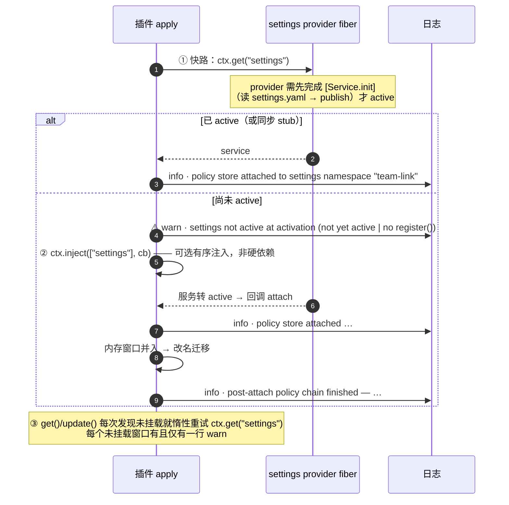

# 验证账本（verification log）

> 本文件是**证据**，不是说明书。说明书看 [`../README.md`](../README.md)；设计看 [`collab-enhancements-design-2026-09-19.md`](collab-enhancements-design-2026-09-19.md)；变更史看 [`../CHANGELOG.md`](../CHANGELOG.md)。
>
> **为什么要拆出来**：本仓库的验收文化要求每一轮都留下「修复前必红 / 修复后全绿」的读数（变异验证），但 2026-09-20 之前这些逐轮证据被塞进了 README，于是 README 从说明书长成了实验记录本。现在证据按**时间顺序**集中在这里，README 只保留读者要用的东西。
>
> **纪律**：本文件**只追加**、不重写历史条目；每轮新证据加在末尾的「## 」小标题下。**当前读数**与运行方式见 README §十。

---

## §7 服务获取与留痕（0.3.7 的关键修复）——完整历程


这一节值得单独读：**0.3.7 修的是一次「静默降级了整整一天没人发现」的故障**。

### 病灶：`ctx.get` 是时点快照

`settings` 与 `webServer` 都是**运行期取**的服务（不在 `inject` 数组里，服务缺失时插件完整降级）。但 cordis 的 `ctx.get(name, strict = true)` 只返回**提供方 fiber 已 active** 的服务：

```
_getImpl(name, strict = true) {
  const impl = key && this.store[key];
  if (!impl) return;
  if (strict && impl.fiber.state !== 2) return;   // ← 只认已激活的提供方
  return impl;
}
```

而 settings provider 要**先完成 `[Service.init]`**（读 `settings.yaml` → publish）才 active。插件 `apply` 的那一刻它可能还没就绪——于是旧版本在这里**一次性取服务**，取不到就**静默**退回进程内存引擎：此后无重试、无日志，**teams / watchdogs / pairs / rotation 全部不落盘**，每次重启清零。

> **当时的实测取证**：`team_link_watch register` 返回成功、`list` 可见条目，但 `profile/settings.yaml` 的 mtime 与全文在写入前后**毫无变化**；日志里也从未出现本插件的任何 warn（另一条注册失败路径必留 warn，故也被排除）。盘上从来没有 `team-link:` 段——**自 0.2.x 起信任数据从未落盘**，所以「改名迁移已完成」这个结论当时是错的。

### 修法：可选有序注入 + 惰性重试 + 留痕



1. **立刻试一次**（提供方已 active，或有同步 stub：走快路，不引入任何异步延迟）；
2. 没拿到 → **留一行 warn**，并登记 `ctx.inject(["settings"], cb)`：provider 转为 active 时回调 attach。这是**可选有序注入**，不是硬依赖——服务永远不出现时插件照常加载并降级；`ctx.inject` 本身不可用时再留第二行 warn；
3. **运行期惰性重试**：`get()` / `update()` 每次发现未挂载就再试一次；成功即挂载并记一行 info。失败**不重复告警**——「未挂载告警」有**两条到达路径**（激活时未 active / active 但 `register()` 抛错），二者共用同一个一次性门，故**一个未挂载窗口有且仅有一行 warn**。

一次性改名迁移（`session-link-pro` → `team-link`）随之从 `apply` 当场移到 **attach 之后执行**（在 ③ 未修时它必然是空操作）。

**明确不采用**的做法：把 `settings` / `webServer` 加进 `inject` 数组。`inject` 是**硬依赖**——依赖缺失时 cordis 令整个插件 fiber 不激活，与「服务缺失时插件完整降级」这条红线相抵；而 `ctx.inject` 与 `inject` 在**确定性**上等价（同样等 provider 完成 `[Service.init]`），故取零功能回归者。

### 三个配套细节

**启动窗口的数据一致性**（防御性冗余）：attach 之前写进去的东西只会落在进程内存里，而这个窗口理论上不可达（那时还没有活动代理能调工具）。万一真发生，attach 时会把这些内存写入按与改名迁移同形的规则并入设置命名空间（**仅当**设置侧仍是默认值；settings 始终是事实源），并留一行 warn——不静默丢写。并入**先于**改名迁移执行，迁移的「当前命名空间已在用」判据因此看到的是最终状态。

**provider 生命周期归属**：晚挂拿到的 scope 与其**注入 fiber 同生共死**——挂载时用 `owner.effect(() => () => detach(), …)` 把释放挂到「取到服务的那个上下文」的 fiber 上（与 `webServer` 站点 `target.effect(() => webServer.register(…))` 同一条归属规则）。provider 的 fiber 被 dispose（配置变更 / 插件重载 / teardown）时，scope 归零并记一行 info，store 回到**未挂载态**，provider 回归时由惰性重试重新挂载。此前这里只有捕获、没有归属：scope 非 null 却已死，于是 `update()` 每次都抛错、而 `get()` **静默改答陈旧内存**——读写长期不一致。**快路（宿主自身 ctx）无需额外处理**：那里的 owner 就是本插件自己的 fiber，store、工具、巡逻定时器与这条 effect 同生共死。

**事后链留痕**：attach 之后的两步（内存窗口并入 → 改名迁移）各自返回结论，attach 结束时统一记一行 info：

```
post-attach policy chain finished — memory window: <none (no writes while unattached)
  | not folded (settings namespace already in use) | folded into settings | fold failed>;
  legacy migration: <no legacy namespace | legacy namespace refused (register failed)
  | legacy read failed | no legacy data | migrated | kept (current namespace in use) | failed>
```

「被拒」不再与「根本没有旧命名空间」同形；内存窗口旗标在结论记录后清零（所以后续窗口不会把同一份已解决的内存态**再并入一次**），只有 `fold failed` 保持置位——那些写入确实仍在内存里，下一次挂载必须重试。

### 红线与回归锁

**红线**：任何「未能立刻挂载」都必须留痕，**不得存在第二次静默回退**。

回归锁都在 `host-half.test.mjs`：**U9**（先 apply、之后 provider 才 active 的时序用例）、**U11**（settings 彻底缺失时全功能可用且**有且仅有一行** warn）、**F1**（provider 已 active 但 `register()` 恒抛错时，多次 `get`/`update` 后该窗口仍**恰一行** warn）；另有三组生命周期锁：provider 晚挂 → **dispose 其真实 cordis fiber** → 再回归（释放行、未挂载写走内存、重挂后读写都跟着新命名空间）；门**随窗口**复位（窗口 2 的拒绝自己留一行，窗口**内**的惰性重试仍只算一行）；事后链三态与 `refused` / `no legacy data` 的取值区分。

---


---

## §10 测试——逐轮红相/绿相账本


```
npm test                    # host 889 项 + client 170 项（合计 1059 项）
node host-half.test.mjs     # 宿主半边，stub 风格（真 cordis Context）
node client-half.test.mjs   # 浏览器半边
```

断言总数由两个套件**各自在结尾打印**（`assertion total: 889 (failed: 0)` / `assertion total: 170 (failed: 0)`），文档里的计数即取自这两行——改测试后请同步本行、下面的徽章与 `CHANGELOG.md`。**不要从「上一版计数 ± 本轮新增条数」反推**：② 收口轮的 WIP 就被这样算成了 640，而那次提交自带的实测是 **639**（`506 + 133`）。

**覆盖地图**（按能力划分）：

| 领域 | 覆盖要点 |
| --- | --- |
| 上游深链 | 9 例解析用例 + 深链快照注入 |
| 工具面 | 注册 / 列表 / 导出 / 发送 / 配对全流程，含拒绝、取消、自发送、死目标守卫 |
| 活性信号 | verdict 五态判定表 + 两个阈值边界、goals 缺失降级、读数时效戳 |
| surface 读取窗口 | 只读前 12 行且调用次数**恰为 12**、12 次读取并行在飞、第 13 行起降级、窗口内一行不可读只降级该行 |
| 看门狗 | 注册校验全表、四态巡逻策略、tick source 三成员与正文常量化、去抖、TTL 自清、观察者 dead 分支、dispose 清理定时器 |
| roster / 黑板 | 写权限三态与现任比对、upsert-team 幂等与 workspace 捕获、set-role 版本史与「不迁移 pairs」、retire 的置空/版本史/两条清理对话框分支、镜像一致性与失败降级、团队名与 file 白名单、decisions seq 与行格式与 500 字符上限、discipline baseHash 乐观锁两路、末 20 条窗口 |
| **U16–U19 `/team_session` 自动建队（§10.2）** | 命令面：可选 `commands` 注入下注册 `/team_session`（descriptor + hint + `recordInput`），**服务缺席/迟到/无 `register()` 三种降级**都只丢这条命令且每个未挂载窗口恰一行 warn，模块级 `inject` 仍 4 项；参数文法（`n` / `count` / `team` / `roles` / `role` / `task` / `preset` / `model=<provider>/<model>` + 位置角色名）与逐类拒绝——**文法面的位置角色名真的进计划**（`bare` 折进 `roles`，不是只收集）、**`task=` 取到行尾/下一个 `key=` 边界**（`task=fix the bug` 不再截成 `fix` 并把 `the`/`bug` 丢进被忽略的桶）、**`key="value"` 剥引号**（`team="t"` / `task="fix the bug"`，半引号一律拒绝）、缺 `team=` 时明确报缺（两处都有**端到端**断言：真跑一条命令，读计划/创建/确认框/启动任务正文）；**两个代码常量**：N ≤ 8、每队成员 ≤ 24（含「恰 24 合法」「把团队顶过 24 拒绝并报两个计数」「同名角色在一批里重复拒绝」），并断言它们不在 settings schema 里；确认框正文含**数量 / 模型 / 预设 / cwd / 保守成本 / 配对授权**，选项恰为「创建 / 取消」，**取消 ⇒ 零创建零 pairs**、无确认服务 ⇒ fail-closed、N > 8 不进对话框；创建：`meta` **恰 `{cwd, agentPreset}`**（无 origin / parentSession / delegationDepth / isSeeded）、无 `parentAgent` / `seed`、id 形如 `team-link-<team>-<role>-<uuid8>`（含代理项与路径分隔符被剥离）、cwd 为调用者绝对路径；**生命周期**：handle 由**插件根 ctx** 的控制器持有（`controller.rootCtx === ctx`，别的 ctx 没有控制器），运行期由既有 registry 面寻址，`list_sessions` 对「盘上有会话但无活代理」读 `✕ 未运行 + verdict=dead`；**驱动**：kickoff 用 `followup`（非 `inject`）、`source` **恰三成员**、正文含团队/角色/任务/cwd/回报方式，且动作日志证明**全部 create 先于任何 followup**；**幂等**：整批重跑零创建零 pairs 且 roster/pairs 逐字节不变、混合批只建缺的角色；**失败即停**：第 k 个 create 失败停住、已建者保留并照常驱动、报告逐行列出每个角色的结局、pairs 只给真正建成的、首个即失败时零创建零 pairs 零 roster；**既有团队走既有 `writerGate`**（非现任在对话框之前就被拒）；**孤儿防护**：`pending-creates` 意图写于 create 之前、成功回填、失败留行，TTL 过期由**插件自身启动清扫**报告「可收编清单」（不判会话是否存在、不删会话、报告即记录）、healthy boot 零行；prepare 文案不再声称「本插件不能编程创建会话」 |
| **U19 红线回归（§10.3）+ 并发纪律（§10.2.6）** | **①/② 红线**：源码级锁定「**本模块自己不长出日志写入面**」——无 `ctx.session` 写入缝（`ctx.*` 的会话接触只有**读**面：`sessionQuery` 的**四个**读方法 `listSessions` / `readSession` / `readSurface` / `readTitleSnapshots`，外加 `sessionReferenceResolver` 与 `agents`），无 `session.append` / `appendEvent` / `writeEvent` / `logEvent` / `ctx.emit`；注意措辞的边界（差异审计修复轮 🔵-1）：插件对会话的写入面**是存在的**——`ctx.agents.create` 与 `agent.followup`——红线不破的理由是那两条路径产生的事件类型由**上游定义**，而这条源码断言**证明不了**事件类型（它证明的是本模块没有 append/emit 面；审计的变异 M6「往模块里放一个日志写入 API → 1 红」证明的正是这个锁会咬）。**导入面是六模块白名单**（新增依赖无法偷渡写入 API；`@deepseek-ai/dsh-session-reference` 是上游深链解析器，不是日志写入器）；客户端半边**零 import** ⇒ ① 同样到不了写入面；真跑一批（2 worker）后回放插件自己的 `agent/pre-step` 监听器 ⇒ 事件只剩**上游深链**一条，运行时状态**只落 settings 命名空间 + `agents.create` + `agent.followup`** 三个既有出口 ⇒ **不产生任何新的日志事件类型**（**旁证**而非判据：那条用例读的是**桩**，结构上观察不到新事件类型）；`source` 仍**恰三成员**（复用 U17 的 kickoff + 新跑一批各一条）；模块级 `inject` 仍 4 项且导出面恰 `apply`/`inject`/`__testing`/`name`；**既有 schema 与投递双门零改动**——policy 命名空间仍恰 8 键（② 自己那一个 `pendingCreates` + 先前七个）、`team_link_send` 参数面仍恰 `message`/`meta`/`targetSessionId`/`targets`（`required:["message"]`）、配对免双门、无配对时双门两次都在、接收方选项表逐字、**整批恰弹一次对话框**（§10.2.4 那个，pairs 而非新旁路）。**G2 并发**：在飞 `agents.create` 峰值由**提供方侧**计数（每次 create 故意加 20ms），断言 **≤2** 且**实测恰 1**（单条 `await` 串行循环；源码面同证：全模块 `agents.create(` 恰一处、无并行组合器） |
| **U30–U34 §10.2.8 三条真机缺陷修订（2026-09-22）** | ① 输入文法（方案 A「参数可省」）：R1 参数区只在行首且谓词闭合（静默结束 ⇒ 归正文；key 未知或取值不合法 ⇒ 整条拒绝）、R2 正文不解析（`N=3` / `pid=384448` / `word=` 逐字保留）、R3 失败点名并给出路；**位置角色名废除**（裸 token 是正文的起点，`roles` 只由 `roles=` 声明）与三个默认值（`team` = 调用会话工作区目录名、`n` = 1、一个 `worker-1`）；**正文逐字送达**（kickoff 与确认框交出去的是同一段）；② 结果可见性 = **通道 1**（复用 D 模式：按 `data.name` 过滤 `command/run`、按见过的 `commandId` 认领 `command/done`、有界 64、成功与失败同一条通道），**不新增任何日志事件类型**；③ 确认框边界：**换槽位**（`question` 一行话 ≤120 码点且无换行，披露正文整段进 `detail` ≤600 码点 / ≤12 换行）、任务预览截断标注、不逐角色展开（前 3 个 + 「…等 N 个」且总数写全）、长 cwd / 长团队名的裁剪标注、必备披露与角色指引在压缩后一字不少；④ `/team_rotate` 回归守卫（位置角色名语法与结果不变）|
| 广播 fan-out | 寻址解析与通配仅协调者、逐目标独立过门与 fail-closed、≤8 上限与整次拒绝（**表达式**数；卡内**行数**另受 §10.1.2 的 24 行上限约束）、去重、no-holder、单目标/广播互斥 |
| 信封 banner | 枚举校验全表、ref 按码点截断并注明、首行格式与部分键、source 仍三成员、fan-out 共享 meta |
| busy 预判 | 运行中分钟数 / 时间戳不可读回退 / 空闲原文案 / fan-out 逐目标 |
| **U13 发送方回执（§10.1.2）** | `presentationMeta` 已声明且仍走 `textOutput` 文案（模型可见文本零改动）；单目标与 fan-out 两条路径的 kind/v/at/senderSessionId/targets/summary/fanout；正文 **2000/2001 边界**、头 1500 + 3 码点标记 + 尾 400、`chars` 记原始码点数、astral 切点无半截代理项、继承来的孤立代理项被修复；信封「给了才有」（含 `meta:{}` 不算）；no-holder 的 `sessionId:null` 与 `expr`；去重计数；**行数上限 24**（一个 `team:<n>/*` 合法展开出 30 行 → 卡内恰 24 行 + `targetsTruncated:{shown:24,total:30}` + 保留行是报告的前 24 行 + **summary 仍 30** + 文本报告仍 30 行 + 30 个目标都真收到；对照：恰 24 行**不**截断且卡与改动前逐键一致）；busy 三态（有分钟 / 读不到 / 空闲）；投递阶段之前的拒绝只投影 `{}`（降级）；**审计 F2**：`sessionId` / `expr` / `meta.ref` 三条路径分别污染 `\uD800` 后 `JSON.stringify(card)` 无孤立代理项（修复前 2 红、修复后全绿），对照组是同一次调用的**模型可见文本本已干净**；**审计 B1（2026-09-20 换锁）**：`meta.ref` 被截断时提示只进文本报告、不进卡内行；**`targets[].detail` 仍留在回执里**（模型可见事实源 + 纯文本降级兜底），只是**不再是 A 面的渲染输入**——取代旧「卡内行 == 报告首行」等式的是**跨半边行为锁**（见下一行） |
| **U14 发送方工具行（§10.1.1 A）** | 槽位 key **逐字** `team_link_send`（近形键不占该行）；有回执 → **A 面**（极简标签「工具名 + 目标数」+ 逐目标行「目标（`expr` 或短 id）+ **outcome 短语** + busy 徽标」——**不渲染 `detail`**，2026-09-20 修订），**且不含**标题/时间/正文/汇总/信封；空目标表仍出标签（0 个目标）；无回执（在飞 / 无 meta / 形状不认识 / 别的工具的 meta / 抛异常的 getter）→ 纯文本行并显示模型可见文案；12 种坏形状都不成卡且不抛错；**`targets` 超过 `SEND_CARD_ROW_LIMIT`（24）的回执照常成卡，但 A 面行数封顶 24 并在卡上标注「已截断——仅显示前 24 行」，标签的总数仍是真的**（round-1 🔵 #2；对照：恰 24 行全画且无标注、普通 3 目标卡不受影响）；**该渲染期判据的触发条件是回执自身超过 24 行，而宿主侧自 §10.1.2 修正轮起就在制卡时裁到 24，所以它现在只在异构实现或手改日志的 `meta` 上生效**；宿主自产的 24 行卡带 `targetsTruncated` 字段，A 面**读它**（2026-09-19 收尾轮补的跨轮读路径）——24 行 + `{shown:24,total:30}` 的宿主形回执照常出标注且标签显示**真值 30**，而标签永远显示的是**真值**、不是画出的行数；zh/en 字典键集一致，且**本轮改写没留下死键**（旧行用过的 `sendBusyMinutes` / `sendBusyUnknown` / `outcomeDelivered` / `outcomeRefused` / `outcomeNoAgent` / `outcomeNoHolder` 六键已从两本字典里消失、新行要用的六键都在两本里） |
| **DEFECT-5 §10.1.5 文本重建（无回执时的 A 面兜底，2026-09-20）** | 三种情形的判定与优先级（有回执 ⇒ 结构；无回执但文本认得 ⇒ 最小卡；都不成 ⇒ 纯文本行）；**① 有 meta 时永远走结构化路径**——一块「有完整回执 + 旁边放一份能解析成**另一张**卡的诱饵文本」的块必须按回执渲染（反过来把重建器改成恒返 `null`，全部既有用例照常出卡）；**② 往返判据（跨半边，落在 `host-half.test.mjs`）**——真跑投递取**真实的报告文本**与**同一次调用的真实回执**，加载真实浏览器 bundle，把两面都过真实 A 面组件渲染，逐目标**身份与结果短语判等**；覆盖单目标（含 `「标题」(id)` 与含 `：` 的标题）、混合广播（delivered/refused/no-holder）、`no-agent` 的**跨行**段落、去重；**敏感性锚点**是一条常驻断言——把同一份真实报告的行分隔符改一个字符，重建即失效（证明这把锁不是空的）；**③ 不伪造**——单目标**被拒**句、寻址/`meta` 拒绝、改写过的行分隔符、汇总与逐行自相矛盾、首行数字不符、缺汇总行、表头计数不符、四种之外的 `outcome`、多出来的行、标签不闭合，**11 种全部回纯文本行且逐字显示**；重建**不读** `busy`（机制句里的「已运行 7 分钟」不长徽标）、不留 `detail`、不产 `at`/发送方/正文，也**永远长不出 D 的顶层卡**；坏输入（非字符串 / 空 / `❌` / `汇总：。`）不抛错 |
| **U15 顶层节点（§10.1.3 D）** | 视图与接收方 `key:"context"` **同槽不同键**并存；definition 只认既有 `tool/call`（名字逐字）与带本插件回执的 `tool/result`，其余事件类型一律不认；顶层节点产出（key/kind/id/target/anchorSeq/location/visibility/data）；**D 面**（标题 + 发送方/时间 + 信封 + 正文 + 截断标注 + 汇总计数）**且无逐目标行、无目标身份**；**窗口截断回退**（tool/call 不在窗口仍出节点、别的工具的 meta 不出）；无回执 / 在飞 / 形状坏 → 不渲染；**审计 F1**：两面可见文本取并集后任一语句**恰好出现一次**（任一面把另一面的块搬回来即红）；**审计 F3**：模块级 `inject` 只有 `slots`/`sessions`/`locale` 三项，`uiConversation` 走 `ctx.inject` 动态注入——缺服务 / callback 从不触发 / ctx 无 `inject` 三种坏境下 `apply()` 都不抛、其余四条注册照常落地，**只丢顶层卡**；**审计 B3**：**四条**槽位注册（header 按钮条 + 三条 §10.1）各自加护栏，任一条 `slots.register`（或 `slots.inject`）抛错都只丢那一行、其余照常，且不牵连 definition——含 header 按钮条（round-1 🔵 #3：它跑在四条最前，未过护栏时一条拒绝会带走其后全部注册） |
| 换届 M4 | 令牌绑定与 TTL、rotationBackup 快照、速率限制、冻结清单、多选对话框逐项勾选、域限定迁移、对称撤销、落定与版本史、令牌掩码、四种拒绝、到期清扫与取消/回退、provisional 可见面、幂等重放、内部广播被屏蔽拦截、`goals.resume` **零调用**红线 |
| **§12.5 跨半边行为锁（outcome 枚举 ↔ 客户端短语，2026-09-20）** | 取代 B1 旧「卡内行 == 报告首行」等式的那把锁：`host-half.test.mjs` 同时读 `lib/index.js` 与 `lib/client.js`——宿主侧按两种**铸值形状**取字面量（`outcome: "…"` 直接构造 + `outcome === "…"` 的 `buildSendCard` 摘要四路分支，实测 **4** 个 token），客户端侧取 `OUTCOME_PHRASES` 字面量（实测 **4** 对），两条断言**判等集合**：① 宿主能铸的每个 token 都有客户端短语（缺一即红，红相报 `unphrased: no-queue`）；② 客户端不得给宿主铸不出的 token 配短语。**客户端半边**另有三条同向锁：映射是源码里的真字面量、键集逐字是那四个且两本字典都声明、每个键在渲染器里真被取用；运行时还钉住「映射外的 token 原样显示（新宿主不吞、不编）」。**这条锁的边界如实声明**：静态读看不到「token 经变量到达 `targets[].outcome` 而该变量不出现在任何字面量站点」的路径——今天不存在这样的路径，且一旦出现，它必然落在上面两种形状之一 |
| **§11 ③a 自动换届（U20–U24 / U28）** | **契约层（§11.9.6）**：五硬节 + 三软节的名单、脚手架、提示语与测试样例是**同一套名字**（名单改一个名字即红）；**同改锁（差异审计修复轮 🟡-3）**：那份完整名单在 `lib/index.js` 里**一处都不许手抄**（真源数组是唯一字面处），三处宣传面（工具 description / `handoff` 参数 / 投递正文）在**运行时**渲染出的就是真源那一份，且 `unknownz`/`missionz`/`inflight`/`taskandgoal`/`firstactions` 这类漏改变体一个都不许出现；**🟡-4**：`/team_rotate` 的**被宣传键集 == 被接受键集**（广告由 `TEAM_ROTATE_KEYS` 渲染），且任何不在广告里的键都被**解析器**拒绝并在文案里点名；**🟡-6**：拒绝文案的路径标签按当次调用的 successor 形态渲染（同一条「缺硬节」分支在 auto 下写 `successor:"auto"`、显式下写「显式 successor」）；标题层级/大小写/下划线/尾冒号都折成同一节名；**缺项阶梯逐条断言**——auto + 正文缺失/空 → 拒绝并给出脚手架；**五个硬节各缺一次、每次只点名缺的那个**；硬节在场但为空也拒绝；软节缺 → 放行 + 点名警告；五节全 `TODO` 也放行（**内容质量不被检查**，诚实原则写进断言）；显式 `successor` + 无正文 → 放行 + 警告。**文档三层**：头部九项字段齐全、只给掩码（明文令牌不进任何落盘文件）、`claimedAt` 位置写明「写于 prepare 之前 / claim 不复验 / 不追写」；事实段与 claim **同源**（freeze 正文用投出去的那条常量、迁移/未迁移/对称撤销行用同一个构造器、provisional 回退窗口用同一个函数，且**四类行模板在 `lib/index.js` 里各只出现一次**这一条由源码级断言锁住）；正文原样保留；时间戳文件名 → 第二份把上一份路径写进事实段；头部的完整性判定与校验器读数同源。**auto 编排**：确认框内容（id / cwd / 模型情形 / 保守成本 / 信任面 / 取消=零副作用 / 不迁移任何 pairs）；建出**根会话**（`meta` 恰 `{cwd, agentPreset}`——`agentPreset` 是 DEFECT-1 修复后**缺省也解析**出来的那一个、id 语法、handle 由插件持有）；令牌绑定到自建 id；文档落盘且头部指向前后任；冻结未被跳过；**followup（非 inject）**、正文含令牌明文 + claim 调用 + 文档路径 + 交接正文，`source` **恰三成员**；pending-create 意图回填；**auto + 空正文 → 零建会话/零令牌/零 freeze/零文档/连确认框都不弹**（读提供方侧的 `agents.create` 计数与 `pending`/成员投递数）；无确认服务 → fail-closed；取消 → 零副作用；**30 分钟未认领 → rotation-cancelled + 额外点名自建继任者**（并有一条对照：手工路径不点名；**🟡-2：点名判据跨激活成立**——持久证据优先（交接文档头部的 `successor:` 行，只认最新那一份 / 落盘的 `pending-create` 意图），内存 handle 只作附加佐证，且点名行自报判据来源；跨激活相用**全新 Context + 空注册表**跑同一次清扫，修复前必红）；create 失败 → 意图留在盘上并被启动清扫报进可收编清单；文档写失败 → **abort-before-prepare**（不铸令牌、不 freeze、会话如实报为孤儿）；**一次完整 auto → claim**：域限定迁移 + 对称吊销 + roster 落定 + `rotation-done`，且宿主动作日志只有 `create`/`followup` 两种（无新日志事件类型）。**`/team_rotate`**：可选 seam 注册（descriptor/hint/`recordInput`）、文法的四类拒绝、现任校验与点名、未知团队、同名角色多团队消歧、速率限制窗口不空转、**命令零副作用**（零创建 / 零 pending / 零 pairs）、投出的指令教的语法就是工具接受的那条（五硬节标题 + `successor="auto"` + `handoff=`）、H3 诚实面、无服务/迟到服务两种降级的行数与其余工具面 |
| **§11 ③b 恢复与诊断面（U25–U27 / U29）** | **诊断面（U25）**：三道门的**签名与返回形状一字未动**（`writerGate` 2 参 / `retireGate` 2 参 / `rotateGate` 3 参，且门本体拿不到 `ctx`）——富化全在有 `ctx` 的工具层；两个派生词 `vacant`（`current=null`，**刻意空缺上不加死亡诊断**）与 `seated-dead`（有席位无活代理）在读取时派生；`set-role` / `upsert-team` / `retire` / `prepare` 四条拒绝路径在死现任下都带「活性诊断 + 恢复梯子」，而**对照组**（现任活着、只是调用者不是他）一个诊断字都不多；`roster get` 的现任行（概要 + 详情各一次，同源）带注记而活着的角色行保持干净；**`roster.md` 镜像里一个活性词都没有**（同时保留 `vacant`——它是用户显式表达的持久状态，不是读数）；启动清扫**新增一行**列出各团队 `current` 无活代理的角色（跨团队、带 id 与梯子），**刻意空缺不误报**，全员活着时零行。**L1 `revive`（U26）**：工具恰两个封闭动词且参数面**只有** `action`/`team`/`role`（没有任何能承载继任者 id 的参数），第三个动词在**参数边界**就被拒（`ToolArgsError`）；插件自建会话（id 文法 `team-link-<team>-<role>-<uuid8>`，**重载后已无 handle**）→ `resume` 同一个 id，身份不变 / roster 不动 / 信任零改动 / `resumeCalls` 参数恰 `{resumeSessionId}`；复活出来的代理**真的进了同一个 `agents.get` 注册表**（`writerGate` 按 id 比对直接放行）；handle 归插件；人类自建会话 → **只给深链指引**（零 resume、零写入，并说清 `ownerCtx` 那条理由）；`resume` 缺失 → **fail-closed** 且零改动；无确认服务 → fail-closed 并点明「刻意没有 provisional」；现任已活着 → 幂等拒绝（连限速戳都不落）；**刻意空缺 ≠ 死亡空缺**（`current=null` 时 revive 说清「没有 id 可复活」）；非 coordinator 角色拒绝；不带 `role` 只输出诊断且零副作用；**三处留痕**逐条断言（role 行 `recoveries` 的 verb/from/to/at/by/note + 同一笔更新占用 `rotationAt`；`roster.md` 的恢复行且**无活性词**；`decisions.md` 的 seq/author/正文），`roster get` 同样呈现恢复记录；10 分钟窗口内的第二次恢复被拒；`policy.writer` 原样（**绝不降级为 any**）；在飞未过期令牌 → 不插队拒绝。**L2 `reappoint`（U27/U29）**：对话框选项就是**本队活成员**（排除死现任那个角色自己）、**单选**（③b 差异审计 B3：`multiSelect` 曾为 true 而调用方只取 `picked[0]`，人类勾的第二位会被静默丢弃——盒子不许承诺代码不会做的选择）、调用方无继任者 id 参数；确认框写清爆炸半径与八条边界；**逐字复用 prepare**（三元组绑定 + 30 分钟 TTL + `rotationBackup` 快照 + freeze 到其余成员）、明文令牌只出现一次且此后掩码；三处留痕（继任者具名）；对话框返回集外 label → 按「没有勾选任何候选人」拒绝；无确认服务 / 取消 → 零令牌零 freeze 零写入（承诺限定在**本次调用自身**——B2，入口清扫可能已真写）；**TOCTOU 两条**（对话框仍开着时现任复活 → 中止；候选死亡 → 中止并说「原地再造一个死结」），其中**身份**复检与**活性**复检**各说各的话**且各有一条只能由它回答的判据（③b Y3：身份复检被删 → 那条调用会一路铸出令牌，立即红）；全队皆死 → 候选集为空 + 三条出路 + 连确认框都不弹；`writer=any` 队照走同一套；`recovery` 行内字段**不改 policy 顶层键**（八项一个不多）。**③b 差异审计新增（Y1/Y2/Y4）**：`revive` 仅 coordinator、`reappoint` **任意角色**（描述与 README 双向锁 + 非 coordinator 角色真铸出令牌的行为锁）；**发起域**（现任成员 ∪ 该角色最近一任前任，域外拒绝并指向设置 UI，三半各有断言）；**入口 `rotation.sweep(...)` 的行为锁**（过期令牌必须在恢复自己的前置检查之前被清掉，短路入口即红——红线⑧） |
| **DEFECT-1 preset 解析与挂载（§10.2.2 模板）** | 真机缺陷 #1 的回归锁：`meta.agentPreset` 与 `agentPresets.mount` 的绑定**按会话 id 配对**（不按位置、不看「有没有建出来」）——**缺省也解析**（`resolve(undefined)` = 宿主 `defaultId`，断言读的是**提供方侧**的调用记录）、`meta` 里那一个与真被挂上的那一个**同源**、每个新建会话**恰挂一次**，且那条 mount 绑的 agentCtx 就是**该会话自己的** setup 上下文（fixture 用 `agentId` 顶替真服务的 `scopeOf(agentCtx)`）；显式 `preset=` 走**同一条**代码（不是第二个分支）；**唯一允许跳过 preset 面的分支**是 `agentPresets` 服务缺席 —— 该分支零 mount、`meta` 只剩 `cwd`、**每个新建会话恰一行 warn 且那行说清后果**（没有 persona-prefix 组装源）、会话照建照驱动；`preset=` 指了一个解析不出来的 id ⇒ **创建失败并如实报原因**（零创建），不静默降级成一个没有组成源的会话。③a 侧同批断言：`successor:"auto"` 建出的继任者**同样**满足上面每一条（含 auto → claim 全流程里「认领并落定的那个会话就是被挂载过 preset 的那个」），且服务缺席时换届不因此失败、仍恰留一行 warn |
| **DEFECT-2 工作区归属（§10.2.2 模板的时序）** | 真机缺陷 #2 的回归锁：判据不是「盘上有会话、cwd 也对」，而是**那份工作区的成员名单里有它**（侧边栏按工作区分组读的就是这个）——`workspaceRegistry.create` 每个新建会话**恰一次**（路径 = 调用会话的 cwd，绝对）、`attachSession` **恰一次**且 id 就是**该会话自己的** id、`meta.cwd` 取自 registry 归一化后的 `path`（模板 `:103`：让 registry 归一化出一个不同的路径，这个读数才可观测）；**唯一允许跳过 workspace 面的分支**是服务缺席 —— 该分支零 create / 零 attach、`meta.cwd` 回落调用方 cwd、会话照建照驱动，且**每个新建会话恰一行 warn** 点名「未挂进工作区，可能不会出现在侧边栏」；**回滚（模板 `:135-147`）**：attach 抛错 ⇒ `detachSession` 恰一次 + handle 被 dispose（代理不在注册表、无 controller handle）+ 批次如实报「创建失败」+ 零 followup + **原错误照抛**，且另有一条**半成品**对照（`attachSession` 已把会话写进成员名单之后才抛 ⇒ detach 仍被调用、名单里不留它——`attached` 标志在这里是 false，靠它就漏掉）；源码锁：全模块 `.attachSession(` / `.detachSession(` / `agents.create(` **各恰一处**。③a 侧同批：`successor:"auto"` 的继任者同样挂进工作区（同一条创建路径、同一份判据），服务缺席时换届不因此失败、仍恰留一行 warn |
| §9 收尾修复 | **U9** settings 时序回归锁（先 apply 后 active）、**U10** 创建即认领与不可劫持、**U11** 降级红线与「有且仅有一行」warn、**F1** 两条到达路径共用一次性门；**U9 扩展（差异审计修复轮 🟡-1）**：内存窗口并入的**写面完整性**——两个 provider 都迟到时，一批 `/team_session`（第 2 个 create 故意失败）在内存窗口内写完 roster + pair + `pending-create` 意图，attach 后并入必须**逐字段带上那条未回填的意图**（修复前必红：并入后 `pendingCreates` 消失），且并入恰是 policy 的**八个** key |
| 字符串安全 | emoji 走遍 0..120 **每一个**切割偏移（其中恰好一个偏移在旧代码上留下半截 emoji）、生产边界、预污染源、导出切点、两处批准提问、投递 banner、深链快照注入、poisoned targetId 回显、**回执卡的全部字符串成员**（正文 + `sessionId` / `expr` / `detail` + `senderSessionId` + 信封 `ref`，按 `JSON.stringify(card)` 判定） |

**两组容易复发的回归锁**，值得单独点名：

- `host-half.test.mjs` 里的 `AUDITED_SOURCE_KINDS` 断言是**迁移契约的回归锁**：它按 `dsh-session-format-v2-to-v3` 的白名单与「恰好三成员」规则检查投递出去的 `source`，改坏了会立刻红；
- `client-half.test.mjs` 锁定「上游相邻代理消息不得被误判成本插件卡片」这条边界。

**变异验证的证据文化**：本仓库的修复都要求给出「修复前必红、修复后全绿」的两次实测输出——例如 0.3.7 收尾修复轮：把 lib 的修复逐条回退后 `506 (failed: 4)`；把 `createPolicyStore` 换回真正的修复前形状则 `506 (failed: 16)`。没有这个证据的修复不算完成（本条自身也是照此执行：② 收口轮的 U19 断言先跑出 `656 (failed: 5)` 的红相再改绿，见下文；该本轮 U19 小节共 **17 条**断言，此前误记为 16，差异审计修复轮 🔵-4 已改）。

§10.1 A/D 轮（当次实测，逐条单点变异、改完全量回退后复跑基线 `543 (failed: 0)` / `104 (failed: 0)`）：**宿主**——去掉 `sendCardMessage` 的截断 → `543 (failed: 5)`；去掉结构化 busy → `543 (failed: 3)`；把 `presentationMeta` 改成恒返 `{}` → 套件当场崩（exit 1：客户端级断言读不到卡）；**客户端**——把 A 的槽位 key 改成近形 `team-link-send` → `104 (failed: 3)`；不读回执（回退恒赢）→ `104 (failed: 12)`；去掉窗口截断回退 → `104 (failed: 2)`；让 `match` 认领每个 `tool/result` → `104 (failed: 1)`；把 D 的内层降级护栏改成 rethrow → `104 (failed: 1)`。

**差异审计分歧修复轮**（当次实测，基线 `552 (failed: 0)` / `121 (failed: 0)`，单点变异跑完即逐条回退再复跑基线）：**宿主**——只把 `targets[].sessionId` 的修复回退 → `552 (failed: 1)`（F2 的 literal id 那条）；只把 `targets[].expr` 的修复回退 → `552 (failed: 1)`（F2 的 no-holder 那条，也就是审计插桩复现的两条路径）；把信封 `sendCardEnvelope` 回退成直传 `request.meta` → `552 (failed: 1)`（`meta.ref` 那条）；两条同时回退（该轮加 B1 断言之前的基线）→ `549 (failed: 2)`；**客户端**——把 A 面退回修复前的形状（head/body/summary/foot 也渲染）→ `121 (failed: 4)`，其中并集断言当场打印出被重复的 head / 正文 / 汇总三句。

**评审 round-1 🔵 收尾轮**（当次实测，逐条先插断言跑红、修完复跑基线）：基线 `552 (failed: 0)` / `121 (failed: 0)`；🔵 #3（header 按钮条并入 `guardedSlot`）——只插断言未修 → `123 (failed: 2)`（「其余三条照常落地」与「definition 不受牵连」两条同时红），修完 → `123 (failed: 0)`；🔵 #2（A 面行数渲染期封顶）——把 `SEND_CARD_ROW_LIMIT` 退回修复前的无界形状（`Infinity`，即原来的 `card.targets.map`）→ `130 (failed: 2)`（「行数有界」与「已截断标注」两条红，对照条仍绿），还原 → `130 (failed: 0)`；🔵 #1 是纯注释修正（`lib/index.js` 文件头的空闲投递语义由 `inject` 改为 `followup`），无断言可变异，其事实由同一文件的 `if (running) target.steer(message); else target.followup(message);` 与 README 的 followup 语义互为对照。

**宿主侧 `targets` 行数界轮（§10.1.2 2026-09-19 修正的收口）**（当次实测：先把 12 条新断言插进**无界**的宿主形状跑一次留证，再补上限复跑）：插入后未修 → `564 (failed: 3)`——「卡内恰 24 行」「卡自身带 `targetsTruncated` 标注」「标注紧跟 `targets`」三条同时红，而对照三条（「恰 24 行不截断」「≤24 行卡不多一个键」「≤24 行的计数与报告行数仍是 24」）与「summary 仍为全量」「文本报告仍 30 行」「30 个目标都真收到」当场全绿；补上 `SEND_CARD_ROW_LIMIT = 24` 的裁剪与标注后 → `564 (failed: 0)`，客户端 `130 (failed: 0)` 零改动零回归。红相里「保留行是报告的前 24 行」「卡仍是无损 JSON」两条本来就是绿的：前者在**无界**形状下对全部 30 行逐一比对了报告里的同一身份（有界后同一条断言只覆盖前 24 行，仍是同一条比较），后者与行数无关。

**跨轮交互缺口收尾轮（客户端读宿主的 `targetsTruncated`，§10.1.2 / U14）**（当次实测：先插 8 条断言、`lib/client.js` 一字未改跑红留证，再补客户端读路径复跑）：红相 → `138 (failed: 3)`——「A 面出截断标注（占位符 24）」「标签显示真值总数 30」「两类超限都能在界面上看出来」三条同时红（宿主自产的 24 行卡只画出 24 行，既不出标注、标签又把已画行数 24 当成了总数），而对照五条当场全绿（「宿主形回执照常成卡」「画出的恰是宿主保留的 24 行」「形状不认的标注被丢弃且不凭空出标注」「标注里的假 `shown` 不得进句子（句子报实际画出的 24）」「无标记且 ≤24 行的卡无标注且标签是自身行数」）；补上 `readTargetsTruncated`、`sendCardTargetTotal` 与 A 面按标注出标注后 → `138 (failed: 0)`，宿主 `564 (failed: 0)` 零改动零回归（本轮未触碰 `lib/index.js`，宿主侧行为零改动）。

**② 收口轮：U19 红线回归 + 并发纪律（§10.3 / §10.2.6，当次实测 `656 (failed: 0)` / `138 (failed: 0)`）**：本轮**只加断言，`lib/index.js` 一字未改**（G2 的约束已经写在树上）。**红相**：断言插入后首跑 → `656 (failed: 5)`，五条全是**断言自身写错**而非实现缺陷——`!/ctx\.session\b/` 被 `ctx.sessionQuery`（只有 `\b` 拦不住字母后缀）误伤；`import.meta.resolve("./lib/index.js")` 按**进程 cwd** 解析，写成相对路径会读到空内容（已改为 `fileURLToPath(new URL("./lib/index.js", import.meta.url))`，并按「换成别的 cwd 跑一次」验证它不再依赖启动目录）；导入面用**黑名单正则**判「无日志包」时误伤 `@deepseek-ai/dsh-session-reference`（上游深链解析器）——改为**六模块白名单**，顺带把「新增依赖偷渡写入 API」也堵上；统计 `参数名` 时按 `parameters.targets...` 取，而真实形状是 `parameters.properties.*`（键名是 `message` 不是 `text`、`required:["message"]`）；把「模块导出键」写成 `apply`/`inject`/`__testing` 三项，实测还有插件 `name`。五条据此逐条改正后 → `656 (failed: 0)`；`lib/index.js` 与 `client-half.test.mjs` 全程零改动，客户端 `138 (failed: 0)` 同期复跑确认零回归（本轮未触碰客户端两个文件，红相与绿相里它都照常全绿）。红相里另外 11 条**当场全绿**（三成员 `source`、`inject` 4 项、schema 8 键、双门三态、并发峰值恰 1），它们的作用是**把红线的判据本身钉住**，而不是重述 U16–U18 的实现断言：读的是**提供方侧**的读数（`agents` 服务桩的在飞计数、注册进去的命名空间 `base`、注册出来的工具 `parameters`），插件自报的形状改坏了也会红。

**并发纪律（§10.2.6「create 与 followup 串行（或 ≤2）」）**：本轮经实测确认该约束**已经在实现里**——`lib/index.js` 的 `createTeamSessions` 是**单条 `await` 串行循环**（全模块 `agents.create(` 恰一个调用点，先全部 create 完再逐个 `followup`），因此**没有新增任何有界队列/信号量**（那会是已绿实现的重复改造）。断言改为**从提供方侧测在飞峰值**：桩的每次 `create` 故意加 20ms，**实测峰值 1 ≤ 2**（若实现改成并行 fan-out，同一条断言会读到 2 而变红）；测试输出把这句读数原样打印出来（`measured peak 1 ≤ 2, N=2`），红相能直接说出它看到的数字，而不只是「越界了」。

**差异审计修复轮（🟡-1 的写面 + 全文计数与措辞，当次实测 `663 (failed: 0)` / `138 (failed: 0)`）**：这是**本仓库第一次在 `lib/index.js` 上做「同一事实两处写、只改了一处」的收口**。断言先落地、修复后补——**红相**（`adoptMemoryWindow` 的补丁仍是七键）→ `663 (failed: 3)`：三条同时红（「窗口内写下的 §10.2.6 意图并入后仍在」「并入的行逐字段完整」「并入恰是那八个 key」），而同组三条**前置**当场全绿——两个 provider 都迟到 ⇒ 整批在内存窗口内跑完；commands 迟到挂载不额外留行；worker-b 的 create 失败 ⇒ 它的意图未被回填。**前置全绿是这轮红相最有价值的部分**：它把「红色＝断言写错了」和「红色＝根本没走到那条路径」区分开。**绿相**：把 `pendingCreates` 补进那笔补丁 → `663 (failed: 0)`（宿主侧唯一改动），客户端 `138 (failed: 0)` 同轮无损。**基线是实测出来的、不是推出来的**：把新增的那一组断言整段从测试文件里摘掉再跑一次 → `656 (failed: 0)`，与 ② 收口轮自报的 656 一致；本轮新增**恰 11 条**（`674 − 663`），与「② 收口轮的 WIP = 640」这种算法无关。本节的分母（656）与分子（663）都取自套件自己在结尾打印的那一行。

**差值的来历（差异审计修复轮第 2 轮，🟡-1 的写面 + 全文计数与措辞）**：那轮新增断言恰 7 条（656 → 663）。**计数勘误（差异审计修复轮 🔵-4）**：本仓库此前的计数习惯是「上一版计数 ± 本轮新增条数」，这个习惯在 ② 收口轮算错过一次——**639 与 640 的差别**（`506 + 133 = 639`，而 `656 − 16 = 640`）就来自这里；那一轮 WIP 提交**自带的 README 记的是 639**（提交时内部自洽），640 只是事后从 656 反推出来的数。本轮起一律以 `assertion total:` 那一行为准；`check(` 调用点个数会略有出入（存在被注释掉或落在未执行分支里的调用点），**不作为计数来源**。

**文法面收尾轮（代码评审的 3 🟡 + 2 🔵，当次实测 `675 (failed: 0)` / `138 (failed: 0)`）**：两条 🟡 是**同一个文法面的两个缺口**，同批修——① `bare` 只收集不消费（`readTeamSessionCommand` 把位置参数收进 `value.bare`，`teamSessionPlan` 只读 `roles`/`n`/`team`，于是 hint / description / 报错文案宣传的「位置参数写角色名」端到端不可用：照着报错提示再输一次，会得到同一个报错）；② `task=` 的注释写「取到行尾」而实现按空白切分，未加引号的多词任务把 `the`/`bug` **静默丢进被忽略的 `bare`**（与 ① 叠加成静默丢数据），带引号的任务又把引号字符留在值里。**修复取「让位置参数真正生效」**（而不是删宣传）：`bare` 折进 `roles`，`team=` 仍是必需 key（首个裸 token **不**兼作团队名——否则「首 token 当团队名」与「用户忘了 team=」无法区分，宁可报错也不猜）；`task=` 的取值读到行尾，遇到下一个**已知 key=** 才收界（所以 `task=… model=… preset=…` 这个从旧版就在的次序照旧成立），整段加一对引号时以闭引号收界且**闭引号之后不得再有内容**（否则报错，不静默丢）；`key="value"` 统一剥引号（半引号一律拒绝）。扫描器的正则另有一处**必须是自己的组**的坑：`(?:a|b|c)+` 的 `+` 只作用于最后一支，`team="t"` 会被切成两个 token。**红绿证据**：把 HEAD 的 `lib/index.js` 导出到 `.test-tmp/old-grammar/`（`git show` 取原始字节，落在仓库内**已 gitignore** 的临时目录里，不碰工作树、不提交）用**同一组断言**对比——红相 `roles=undefined` / 计划报「需要角色列表」、`task="fix"` 且 `bare=["the","bug"]`、`task` 值是 `"fix the bug"`（含两个引号字符）、`team="t"` 原样带引号；绿相全部反转。新增断言 **恰 11 条**（`674 − 663`；那 674 是修好实现后套件的**首跑全绿**读数，此后只再补了 1 条 `plannedId` 的按 role 取 id 断言，终态 `675`）。两道禁令内的取舍：`CHANGELOG.md` 本轮**未同步**（任务明令不得改），计数同步只落 README 三处。

**§11 ③a 自动换届主路径轮（`successor:"auto"` + 交接文档契约 + `/team_rotate`，当次实测 `735 (failed: 0)` / `138 (failed: 0)`，基线 `675`）**：本轮新增 **60 条**断言（`735 − 675`），分三批落盘、每批跑完全绿再往下（交接文档契约 → auto 编排 → 命令与文档面）。**红相不藏**：契约批首跑 `696 (failed: 3)`，三条一次都没猜中——① 头部 `team:` 是 `undefined`、② freeze 正文里的团队名是空的——**两条根因其实是同一个**（`writeHandoffDocument` 没有把 `team.name` 注进渲染器），③ 「事实源锁」读到「对称撤销」前缀在 `rotationFactRows` 的两个分支里各出现一次（把共同前缀抽成 `revokedHead` 后计数=1）；auto 批首跑 `719 (failed: 2)`，两条也都是**测试自己写错**：预期 pairs 字符串把 `a`/`b` 顺序写反、以及另加的对端对压根没进 fixture。**本轮与既有断言的三处「同改」**（都是清单/计数随新面增长，逐条改并留证）：① 第二个命令走进**同一个 `commands` seam** 后，「迟到服务挂上一条命令」变为两条（`definitions.length === 1 → 2`）；② 同因导致 U19 的 info 行数从 3 变 4——那条断言顺势改成**按种类点名**（`attach,chain,cmd-rotate,cmd-session`），比原来的裸计数更紧：多出**任何一类**新 info 行仍会红；③ `rotateEnv` 转发 `omitCommands`/`lateCommands`/`failCreateAt` 三个 fixture 开关。**红线回归照旧全绿**：模块级 `inject` 仍 4 项、`source` 恰三成员、policy 命名空间仍恰 8 键、全模块 `agents.create(` 仍**恰一处**（auto 路径复用同一个 `createRootAgent`）、一次完整 auto → claim 的宿主动作日志只有 `create`/`followup`。**边界**：`CHANGELOG.md` 本轮未同步（任务明令不得改），**该缺口已在后续提交 `7236ce8` 补齐**——0.3.7 的三段未发布条目（① 发送方可见性 / ② `/team_session` / ③ 换届与恢复）现在都在仓库的 `CHANGELOG.md` 里，计数同步只落 README（徽章 + 测试节两处）。

**§11 ③b 恢复工具与诊断面轮（§11.9.3–§11.9.5 / U25–U27 / U29，当次实测 `783 (failed: 0)` / `138 (failed: 0)`，基线 `735`）**：新增 **48 条**断言（`783 − 735`，分三段：诊断面 10 条 / L1 revive 19 条 / L2 reappoint 17 条 + 文档面 2 条），三段落盘（诊断面 → L1 revive → L2 reappoint），每段跑完全绿再往下。**本轮的三处「同改」**（都是清单随新面增长，逐条改并留证，且都有断言锁住）：① `roleRecord` / `normalizeRoles` 新增角色行内字段 `recoveries`，**同一批**必须改到四个读面（`roleRecord`、`normalizeRoles`、`renderRosterMirror`、`roster get` 详情行）——锁是「恢复记录同时出现在镜像与工具读面上」两条断言；② 测试骨架的 `agents` 桩**新增 `resume` 面**（`resumeRecords` / `resumeCalls` / `resumedAgents`，且**复活要同时发布进注册表并解除 `hidden`**，否则「复活后 writerGate 直接放行」这条断言测不到真东西）；③ `rotateEnv` 转发 `omitResume` 与 `extraAgents` 两个 fixture 开关（`REAP_DEAD` 必须先**注册**再隐藏——隐藏一个未注册的 id 是 no-op，`hidden` 只会对真存在的注册项生效）。**红相不藏（本轮实测到的四个）**：① 三处 gate 富化在**第一版只改了调用点、没改 rotate 的入口**——`rotateGate` 的富化没生效，`diagPrepare` 一条诊断字都没有（红后补 `withLiveGateDiagnostic` 到 prepare 的拒绝路径）；② `revive` 的 roster 镜像**读的是 pre-write 的 roster**，于是刚写下的 `recoveries` 在落盘文件里凭空消失（红后改为从**写入后的** roster 渲染）；③ `version-note` 原本把英文的 `seated-dead` 烙进 `roster.md`，与 U25 的「镜像里一个活性词都没有」直接对撞——改成设计自己的理由词 `vacant-due-to-death`（§11.9.5⑦ 原文），活性读数只留在 `decisions.md` 与工具答复这两个**事件面**；④ `reappoint` 走既有 `prepare` 时被 `rotateGate` 挡在门外（死现任的会话不是调用者），红后按 §3.6.2 原文的 `|| userInitiated` 给 `prepareAdmission` 加了 `userInitiated` 开关——**只跳过那一项授权检查，其余（self-succession、速率限制、团队/角色存在）照跑**。**红线回归照旧全绿**：模块级 `inject` 仍 4 项、`source` 恰三成员、policy 顶层键仍八项、`writerGate` 原样、`claim` 一字未改（`reappoint` 复用它，不新增令牌类型）、全模块 `agents.create(` 仍恰一处、恢复路径的宿主动作日志只有既有的 `create`/`followup`/`resume` 三种。**边界**：`CHANGELOG.md` 本轮未同步；真机验证（H1/H4 + ③a 的 H3 + 演练 10）仍未做，与设计 §11.9.9 的「本节不可验项」一致。

---

**DEFECT-1：真机缺陷 #1「会话建得出、跑不起来」修复轮**（真机现象 `本轮运行失败 / prompt variable "{{model}}" has no value for this assembly (section "deployment:persona-prefix")`；当次实测 `793 (failed: 0)` / `138 (failed: 0)`，基线 `783`）：
**根因**：`buildTeamSessionCreateOptions` 只在 `plan.preset !== undefined` 时才写 `meta.agentPreset` 并 `agentPresets.mount(...)` ⇒ 不传 `preset=`（`/team_session` 的默认）时**整条 preset 路径被跳过**，新建 agent **没有任何 persona-prefix 组装源**，首回合起不来。官方模板 `dsh-webhook` 的 `createWebhookSession` 不是这么做的：它 `await ctx.agentPresets.resolve(resolved.agentPreset)` → `standingKeyFor(preset.id)` → `meta:{ cwd, agentPreset: preset.id }` → `setup` 里 `mount(agentCtx, preset.id)`，**总是解析出一个 preset（缺省也解析）并挂载**；本插件把它做成了「有才挂」。
**修法**：按模板改为**缺省也解析**（`resolve(plan.preset)`，`undefined` 即宿主的 `defaultId`）→ `standingKeyFor` → `meta.agentPreset` → `setup` 里 `mount(agentCtx, preset.id)`；`buildTeamSessionCreateOptions` 因此变成 `async`（`meta` 必须在 `agents.create` **之前**拿到真实 preset id），两个调用点同批加 `await`。**唯一允许跳过 preset 面的分支是服务缺席**（仍降级为**每个新建会话一行 warn**，且那行点名「没有 persona-prefix 组装源」）；服务在、`resolve` 抛错（未知 id / 组成装不上）一律**传播**：批次如实报「创建失败」且零创建 —— 宁可不建，也不建一个没有组成源的会话。
**影响面（同批修）**：③a `successor:"auto"` 复用同一个函数 ⇒ 不修则换届会失败在「继任者跑不起来 ⇒ 无法 claim」，而令牌已经投给它、旧任已经冻结（信任迁移路径上的失败）。本轮对 ② 与 ③a 两条路径都补了「不是『建出来了』，而是**同一个会话既在 `meta` 里记着某个 preset、又真被挂到那个 preset 的组成上、且恰一次**」的判据。
**红绿证据（断言先落地、修复后补）**：新增 **11 条**断言、摘掉 **1 条**旧断言（旧的「U18 降级: 无 agentPresets ⇒ 会话照常可用」的前提正是被真机推翻的那句话，由新的降级组取代），净 **+10**（`783 → 793`）。**红相**：断言插入后、`lib/index.js` 一字未改 → `789 (failed: 7)`，七条一次全中（`U20 自建继任者` 的 `meta` 断言 + 缺省解析 / 总是挂载 / 判据是「能用」/ 显式 `preset=` 同一条代码 / 降级分支 / 未知 preset 不静默降级）；**其中「降级那行 warn 说清后果」一条在红相里空转通过**（零条 warn 时 `every()` 恒真）——当场给它补上「恰 2 条」的计数前置条件，红相里它是 0 ≠ 2，同一处判据不再可能空过。**绿相**：修完 `lib/index.js` → `789 (failed: 0)`（② 段），再补 ③a 的四条 → `793 (failed: 0)`（客户端 `138` 全程未触碰）。
**本轮的三处「同改」**（都由同一条事实驱动，逐条改并写进断言）：① `U20 自建继任者` 的 `meta` 断言由 `["cwd"]` 改为 `["agentPreset","cwd"]` —— 设计 §11.4.2 本来就写的是 `meta` 只放 `{cwd, agentPreset}`，是断言跟着当时的实现写窄了；② 测试骨架的 `setup()` **新增 `agentPresets` 服务桩**（默认提供，与 `commands` 同款：`resolve` 把 `undefined` 当宿主 `defaultId`、`mount` 拒绝无身份的上下文并记录 `(agentId, id)` **绑定对**）与 `omitAgentPresets` 降级开关，`teamSessionEnv` / `rotateEnv` 各自转发该开关；`makeAgents` 交给 `setup` 的上下文带上 `agentId`（真服务用 `scopeOf(agentCtx)` 认 agent，桩用同一处身份回答「哪个 agent 被哪个 preset 组成」）；③ 两处确认框文案同改——`teamSessionDialogText` 与 `rotationAutoDialogText` 的「模型/预设」一行在缺省时不再什么都不说，而是写明「宿主缺省 agentPreset（缺省也解析并挂载）」。
**边界**：`CHANGELOG.md` 本轮未同步（任务明令不得改）；`docs/` 由父代理同步；真机复验（按缺陷记录第七节的四步复现）仍需一次用户批准的窗口。

---

**DEFECT-2：真机缺陷 #2「编程创建的会话未挂进工作区」修复轮**（真机现象：H1 探针建的 `team-link-h1-probe-worker-1-<8hex>` **在盘上存在、`cwd` 也对**，但用户在侧边栏看不到，得手动切工作区才找得到；当次实测 `806 (failed: 0)` / `138 (failed: 0)`，基线 `793`）：
**根因**：§10.2.2 的模板引用只给了**形状**（`meta` 只放 `{cwd, agentPreset}`），没给**时序**。`dsh-webhook` 的 `createWebhookSession` 是一串**创建后动作**：`workspaceRegistry.create(path)`（`:96`）→ `meta.cwd = workspace.path`（`:103`）→ `agents.create` → `workspace.attachSession(sessionId)`（`:115`）→（失败）`detachSession` + `dispose`（`:135-147`）。本插件只做了 `meta`，全库 **0 处** `attachSession` ⇒ 会话没有工作区归属，侧边栏按工作区分组时列不出它。与 DEFECT-1 是**同一个成因模式**（模板有一组创建后必须做的事，我们只做了一部分）。
**修法**：把模板时序落成**一个函数**（`createRootAgent(ctx, rootCtx, plan, entry, cwd)` —— 全模块唯一的创建落点，② 与 ③a 共用）：`openTeamSessionWorkspace`（`ctx.get("workspaceRegistry")`，与 `agentPresets` 同款的创建时取用）→ `meta.cwd = workspace.path` → `agents.create` → `attachTeamSession`（attach + 模板回滚）。服务缺席是**唯一**允许跳过 workspace 面的分支，且**每个新建会话恰留一行 warn** 点名「未挂进工作区，可能不会出现在侧边栏」；服务在而 `create` 抛错则**传播**（批次按「失败即停」如实报，零创建）。
**与模板的一处有意差异（已写进代码注释）**：模板用 `attached` 标志门着 detach，这里**无条件**调 `detachSession`（幂等）。理由：真实 `attachSession` 先 `host.rememberSessionPath()` 再写记录，写记录抛错时 `attached` 仍是 false，而会话已在 registry 的路径索引里——那个标志会跳过真正需要的回滚。判据里因此专设一条**半成品**对照（已写进成员名单之后才抛 ⇒ detach 仍被调用、名单里不留它）。
**本轮的「故意不做」清单（模板有、我们不做的每一步与理由，交设计裁定）**：`permissionPresets.resolve/set`（`/team_session` 没有权限档参数，设计契约里也没有——不替用户选档）、`sessionTitle.rename`（设计逐字契约里没有标题，三个 worker 该叫什么属于用户可见的交互决定，不自造）、`agentDefaultModel.currentSelection()`（缺省模型由宿主自己决定，命令确认框写的就是「（本会话默认）」；我们只在调用方给了 `model=` 时才装 `agent/request` 钩子）、`signal.throwIfAborted()`（webhook 注册生命期语义，本路径在一条命令内完成；补它要改两处调用点签名与断言面，属另一轮）、`snapshotDelivery` 与 `WebhookRuntime` 的 6 项 `inject`（webhook 投递侧与本插件的红线——模块级 `inject` 仍 4 项）。
> **⚠️ 前向指针（2026-09-20 补，本清单保持原样——它是那一轮如实上交的记录）**：上面 `agentDefaultModel.currentSelection()` 那一条**后来被真机推翻**：宿主缺省只在宿主**自己的装配流程**里生效，而由 `agents.create` 造出来、不带 `agentOptions` 的 agent 走不到那里 ⇒ `deployment:persona-prefix` 的 `{{model}}` 无值、首回合直接失败（`本轮运行失败 / prompt variable "{{model}}" has no value`）。见真机缺陷记录 **DEFECT-3**（`DEFECT-3-model-selection-missing.md`，落在会话工作区目录 `dsh-session-link-pro/.goal/` 下）与本节的「DEFECT-3 收尾轮」条目（CHANGELOG 的 0.3.9 收尾条目由父代理同批同步）。**教训**：列入「故意不做」的每一条都是**一条未经证实的判断**，「我认为宿主会兜底」不是判据。
> **⚠️ 前向指针 2（2026-09-20 补，DEFECT-4）**：同一份清单里的 `sessionTitle.rename` 那一条**也被真机推翻**——**不设标题不等于不替用户决定**：宿主给新会话的默认标题就是工作区名，于是**同一批 worker 在侧边栏里全部同名、互相无法区分**。现在 ② 与 ③a 共用的那**一个**创建落点会按已有的结构化信息给每个新会话设一个可区分的标题 **`<team> · <role>`**（缺一则回落 `<team>` 或会话 id 短前缀，**绝不回落成工作区名**；`ctx.get("sessionTitle")` 取服务、不进模块级 `inject`，服务缺席或改名失败只留一行 warn、**不阻断创建**——那是呈现面，不像 preset/模型选择那样决定会话能不能跑），并在确认框与回执里**说明设了什么标题**、**想改随时在壳里重命名**。
>
> **标题长度边界（同日补）**：上游 `dsh-session-title` 按 **`maxTitleBytes: 80`（字节）剪尾巴、不追加标记、不拒绝**，而团队名只受 `[a-z0-9-]+` 约束、**没有长度上限** ⇒ 若把 `<team> · <role>` 原样交出去，**超长团队名会把 role 段剪没**，使同队两个 role **撞成同名**（实测 `distinct: 1 of 2`）。因此派生时**团队段先截、role 段完整**（UTF-8 安全截断 + 省略号；团队段连前缀都放不住才退成「只有 role」，**不是**工作区名、也不留空的 `<team> · `）。**未给团队名新增任何长度约束**（那是接口变更）。边界如实：role 自身 >76 字节时任何方案都装不下，此时给非空省略号前缀。
**红绿证据（断言先落地、修复后补；红相在 `%TEMP%` 的独立 harness 里跑「新断言 × 修复前的 `lib/index.js`」快照，绿相在仓库树上跑）**：新增 **13 条**断言（`793 → 806`），**红相** `806 (failed: 11)` —— 11 条一次全中（② 的 create/attach/成员名单/`meta.cwd` 来源/降级 warn + ③a 的继任者与降级 + 回滚两条 + 半成品 + 源码锁），**另外 2 条在红相里就是绿的**（② 的「服务缺席降级不阻断创建」与 ③a 的「同一份判据」——它们描述的是**降级与同源**这两个不变量，修复前的树本来就满足，作用是把判据钉住而不是复述实现），且**修复前的树上 795 条既有断言全绿**（新 fixture 零回归）；**绿相** `806 (failed: 0)`；客户端 `138 (failed: 0)` 全程未触碰。第一版绿相曾 `806 (failed: 2)`：两条**源码级**锁（`.attachSession(` 计数、U19 的 `agents.create(` 计数）被我自己新写的注释文本误伤（注释里写了 `agents.create(...)` 与 `workspace.attachSession(sessionId)`）——改注释措辞而不是放宽锁，锁的严格度不动。
**本轮的三处「同改」**（都由同一条事实驱动）：① 测试骨架新增 `workspaceRegistry` 服务桩（默认提供：`create` 记录路径并返回带 `sessionIds` 成员名单的 workspace、`attachSession`/`detachSession` 记录并改名单；`omitWorkspaceRegistry` 降级开关 + `workspaceRegistryOptions` 透传 `refuseAttach` / `registerThenRefuse` / `normalize` 三种 fixture），`teamSessionEnv` / `rotateEnv` 各自转发；② 新的读数 `workspaceBindingOf` / `workspaceBoundOnce` 按**会话 id** 配对（不按位置），② 与 ③a 共用同一份判据；③ 源码锁从「一处 `agents.create(`」扩到「`.attachSession(` / `.detachSession(` / `agents.create(` 各恰一处」。
**边界**：`CHANGELOG.md` 与 `docs/` 本轮未同步（任务明令不得改；§10.2.2 的「模板完整时序」由父代理写进设计）；真机复验（重启后建一个 worker，看它是否**直接**出现在调用会话所在工作区的侧边栏里，无需手动切）需要一次用户批准的窗口。

**③a 差异审计分歧修复轮（宿主侧 🟡-2/🟡-3/🟡-4/🟡-6 + 🔵-1/🔵-3，当次实测 `820 (failed: 0)` / `138 (failed: 0)`，基线 `806`）**：本轮新增 **14 条**断言（`820 − 806`），逐条对应审计的处置清单（`.goal/round-26-3a-audit-dispositions.md`）。
**🟡-2（唯一实质项）「§11.5 点名插件自建继任者」原来只在一个激活窗口内成立**：判据是内存态 `hasHandle`，而**插件重载会清空 handle 注册表**——盘上的 pending 仍在、清扫照跑、点名行却静默消失（审计实测同窗口 4 行 → 换激活后 3 行），而那**正是设计要防的「没人知道的孤儿」窗口**。修法：判据改为**持久证据优先**——① 交接文档头部 `successor:` 行（读目录，重载不动；**只认最新那一份**，因为一个 token 若还 pending，它必然是最后一次 prepare 的，旧文档里的同名 id 属于已被取代的换届）→ ② 落盘的 `pending-create` 意图（创建前写、prepare 成功后才删；它还在说明收尾那步失败了）→ ③ `hasHandle`（本激活的读数，降为**附加佐证**）。点名行还会**自报判据来源**（「判据取自落盘的交接文档头部 successor 行 / 落盘的 pending-create 意图 / 本激活窗口的 AgentHandle 注册表」），读者一眼能分清耐久证据与内存读数。
**红相（跨激活，修复前必红，实测留证）**：把「持久证据优先」那一支临时短路（其余一字不动）→ 跨激活断言红，报 `{snapshotHadPending:true, documentOnDisk:true, cancelled:1, naming:0, pendingCleared:true, currentKept:true}`——**pending 被正常取消、`rotation-cancelled` 照发、旧任仍为现任，唯独点名行消失**，与审计描述的失败形状（同窗口 4 行 → 换激活后 3 行）逐字一致；恢复后绿。同一红相里「三层来源各司其职」那条也红（`document.evidence` 从 `handoff-document` 掉到 `none`，`handle` 顶上来当了唯一来源——那正是修复前的行为）。
**🟡-3 五个硬节名「一处名字、四处写」，其中两处宣传面无断言**：把真源 `HANDOFF_HARD_SECTIONS` **上提到 §11.2 段首**（`handoffDeliveryMessage` 与 `team_link_rotate` 的 description 都在那一段里读它），并让**投递正文**与**工具 description / handoff 参数**全部经 `handoffSectionsInline()` 渲染。锁是双向的：源码里那份完整名单**一处都不许手抄**（实测 0 处）+ 三处宣传面**运行时**渲染出的就是真源那一份 + `unknownz`/`missionz`/`inflight`/`taskandgoal`/`firstactions` 这类漏改变体一个都不许出现。**红相**：把 `handoff` 参数 description 里的 `unknowns` 改成 `unknownz` → 「三处宣传面」与「没有第二个拼法」两条同时红（修复前这种变异**全绿**）。
**🟡-4 键表只锁单向**：`TEAM_ROTATE_KEY_HINT` 现在**从 `TEAM_ROTATE_KEYS` 渲染**（`TEAM_ROTATE_KEY_HELP` 是每键的说明表），并在测试里加**操作性**的反向锁——任何不在广告里的键都必须被**解析器**拒绝、且拒绝文案印的就是广告那一份。**红相**：给 `TEAM_ROTATE_KEYS` 加一个 `shard`（审计的 M5b 变异）→ `unknownRefused:false` 当场红。**这一轮的红相还暴露了我自己第一版锁的弱点**：只比「广告集合 == 接受集合」是**同义反复**（广告是渲染出来的），所以反向锁必须落在**解析器行为**上，这条修正是本轮值得记下的教训。
**🟡-6 拒绝文案把显式 successor 误标成 `successor:"auto"`**：文案里的路径标签改为**按当次调用的 `successor` 形态渲染**（`options.auto` → `successor:"auto"` / `显式 successor`）。两处阶梯的**缺硬节**那条同时服务两种形态，所以它是这条修正的真判据：auto 下写 `successor:"auto"`、显式下写「显式 successor」，都不被标成对方；而**正文缺失**那条今天只有 auto 会产出拒绝（显式 successor + 无正文 = 放行 + 警告，§11.9.6），这一点也单独断出来，免得把「显式形态在这条上没有拒绝」误读成修正没生效。
**🔵-1 一次改名就让套件崩溃**：`readHandoffArgument(handoffBody(["team-map"]))` 在名单改名后返回 `{error}`（没有 `warnings`），而断言直接读 `.warnings.join()` → `TypeError` 中止进程、**连 `assertion total` 都不打印**（掩盖后续断言）。修法：该处改为对 `undefined` 安全（`(parsed.warnings ?? []).join()`），并**另加一条对照断言**把同一个状态单独说清（「改名后那份正文是缺硬节而不是缺软节」），免得护栏把崩溃变成空过。同一轮里还有三处「红相不是干净红」被一并钉住：`tokenOf` 在无令牌时返回 `""`（原来返回 `undefined`，而工具调用桥不接受 `undefined` 参数——`INVALID_ARGS` 把 FAIL 变成崩溃）、`U21 红线` 与 `U20 意图闭环` 加了判据前置、诊断渲染统一走 `show()`（`JSON.stringify(undefined)` 返回 `undefined`，同样会让 harness 抛 `INVALID_ARGS`）。**红相**：把 `unknowns` 整处改名 → `820 (failed: 41)`，套件**跑到底并打印 `assertion total`**（修复前是 7 条红后 `TypeError` 中止）。
**🔵-3「全模块唯一构造器」措辞偏大**：实测 `{kind:"agent-message", form:"relay"}` 有 **3 处**字面构造（`relayUserMessage` / 看门狗 `tickMessage` / §3.4 `team_link_send` 投递），**三处都恰三成员**。代码注释 `relayUserMessage` 的原文「every relay this plugin **drives**」是准确的，但容易被读成全模块唯一——已改成**带范围**的表述并列出另外两处及其各自不能共用该构造器的理由；README 的「消息形状」一节同批补了同一句话（三处一起改，冒出第四处才是缺陷）。
**本轮的「同改」清单（该类缺陷今晚已出现五次，逐条留证）**：① 真源数组**上提**到 §11.2 段首（读者与真源同段，否则 §11.5 段首的 `handoffDeliveryMessage` 读不到它）；② 两处宣传面由手抄改为**渲染自真源**，连带删掉 `readHandoffArgument` 警告行里那份手抄的 `HANDOFF_HARD_SECTIONS.join(" / ")`；③ `TEAM_ROTATE_KEY_HINT` 由字面量改为**渲染自钥表**；④ 测试骨架新增「重载窗口」最小上下文 fixture（**不能复用 `rotateEnv`**：它的 settings 存根把 `register(namespace)` 与「种入 state」绑在一起，而新策略存储自己会再 register 一次 ⇒ state 被重置成空，那样测的是「另一个空命名空间」而不是「重载后还认不认得」）；⑤ README 计数（徽章 + `npm test` 行 + 判定行）按当次实测同步为 `820`。

**③b 差异审计分歧修复轮（Y1/Y2/Y3/Y4/Y7 + B1/B2/B3/B5/B6/B7，当次实测 `831 (failed: 0)` / `138 (failed: 0)`，基线 `820`）**：本轮新增 **11 条**断言（`831 − 820`），逐条对应 `.goal/round-3b-audit-dispositions.md`。

- **Y1 宣传面 vs 实现面**：工具描述与 README 曾写「本工具**只受理 coordinator**」，而 `reappoint` 接受**任意角色**（窄域检查只在 `reviveIncumbent`）。裁定是**改描述、不改行为**（授权从不源自 coordinator 身份，唯一来源是对话框里人类那一下点击）。两处改成诚实口径（「`revive` 仅 coordinator；`reappoint` 受理任意角色」），并加**一条双向锁**：非 coordinator 角色在 `reappoint` 下真铸出三元组令牌 + 真落 `rotationBackup` + 真广播 freeze（有人给它加回 coordinator 守卫即红），同一角色走 `revive` 仍被窄域拒。
- **Y2 发起域（§11.9.5 正文 469 行）原来是空的**：`caller` 只用于留痕，**与团队无关的活会话、甚至没有会话身份的调用者**都能发起并铸令牌。现在落成硬集合：发起者 ∈ {该角色**最近一任前任**} ∪ {团队**现任成员**}，域外拒绝并**点名现任成员集合 / 该角色前任 / 调用会话**，且指出**设置 UI（R2 级，用户在那里是超级写者）仍是永远可用的出口**。三半各有一条断言（非成员活会话被拒、无身份被拒、前任可发起），`role` 缺省诊断读态不受此限（零写入）。**代价如实声明**：不属于本队的活会话不能发起恢复——有意的收窄。
- **Y3 空锁（该类缺陷第七次出现）**：把 `reapIncumbent` 的**身份**复检删掉曾是 820 全绿——同一句「现任已复活，无需恢复」由幸存的**活性**复检产出。现在两条路径**各说各的话**（身份：「该角色的现任已不是 X（现在是 Y）——本次的身份主张已过期」；活性：「已经有活动代理了——现任已复活，无需恢复」），并加一条**只能由身份复检回答**的判据：现任 id 变了但**新现任是死的**（活性复检对它为假），把身份复检删掉那次调用会一路铸出令牌。
- **Y4 红线⑧ 没有断言咬住**：入口 `rotation.sweep(...)` 换成 `{lines: []}` 曾是 820 全绿。现在有一条**行为**锁：过期的 pending 必须在恢复**自己**的前置检查之前被清扫——断言读「恢复没有被那句『已有在飞的换届令牌』误拒」+「答案里带着清扫自己的取消行」+「盘上那枚过期令牌真的被这一趟清掉了」。
- **Y7 脏红**：`revivePost.recoveries.length` 缺 `?? []` ⇒ 一处 break 就在该行崩、**无 `assertion total`**。补护栏，并**扫了一遍同类未护栏的访问**（`.length` / 下标取值 / `.join`），新增 `at()` 助手把 9 处深链访问收进断言：任何 break 之后套件都跑到底并打印总数。
- **B1**：`recoveryRateLimited` 的后半段与 `rotationRateLimited` 的 `rotationAt` 支**条件完全重合、永不触发**（`RECOVERY_RATE_LIMIT_MS === ROTATION_RATE_LIMIT_MS`）⇒ 删除重复实现，改为委托同一个函数（一条规则一处实现）。**B2**：恢复的拒绝文案写「零写入」，但入口 sweep 可能已真取消过期令牌并写 settings/广播 ⇒ 与 §11.9.6 同款收窄为「**本次恢复调用自身**零写入」。**B3**：候选对话框 `multiSelect: true` 而调用方只取 `picked[0]` ⇒ 改**单选**（盒子不许承诺代码不会做的选择）。**B5**：多处注释称「未声明的字段会被 settings provider 剥掉」——**实测不成立**（`schemastery` 不做 strip，这正是 `recoveries` 能存活的原因），注释按实改准。**B6**：导出块的 `.test-tmp/` 并入收尾清理（此前每跑一次留 2 个文件）。**B7**：README 的「`CHANGELOG.md` 本轮未同步」在 HEAD 已不成立（`7236ce8` 已补）。
- **红/绿证据（实测）**：`reappoint` 加 coordinator 守卫 + 发起域改成恒真 ⇒ `831 (failed: 3)`（Y1 一条 + Y2 两条，对照组全绿）；删身份复检 + 入口 sweep 短路 ⇒ `831 (failed: 2)`（Y3/Y4，套件跑到底并打印总数）；恢复审计行整段摘掉 ⇒ `831 (failed: 7)`。Y7 的护栏另用独立 harness 对照**同一失败状态**两种写法：无护栏 → `TypeError` 中止、**连输出都没有**；有护栏 → 跑到底并打印 `assertion total: 3 (failed: 1)`。恢复首跑全绿（`831 (failed: 0)`）。

**A 面逐目标行措辞轮（2026-09-20 用户决定：改从结构化字段渲染一句人话，设计 §10.1.5 修订 + §12.5；当次实测 `833 (failed: 0)` / `146 (failed: 0)`，打印合计 **979**，基线 `831` / `138`）**：本轮**只改客户端**——`lib/client.js` 的 A 面行从「目标 + outcome + **`target.detail`**」改为「目标 + **outcome 的一句人话短语** + busy 徽标」，`detail` 仍留在回执里；`lib/index.js` **一字未改**（只在红相里被临时注入过一个字面量，见下）。**红相（跨半边锁的「新增枚举值 → 必红」）**：往 `lib/index.js` 的 `buildSendCard` 摘要分支里注入一行 `if (target.outcome === "no-queue") …`（一个**宿主能铸、客户端无短语**的新枚举值，正是「A 面没有它的短语就必须红」的字面场景），实跑 → `833 (failed: 3)`：三条 §12.5 断言同时红，且**报出判据本身而不只是「不等」**——`both halves were really read (host mints 5 literal outcome tokens, the client phrases 4)`、`every outcome token the host can mint has a client phrase — a new enum value without one is RED (unphrased: no-queue; host: delivered,no-agent,no-holder,no-queue,refused; client: delivered,no-agent,no-holder,refused)`、`… the two sets are EQUAL, so neither half can drift alone`；**注入行已逐字回退**（`Select-String` 实测 `no-queue` 0 处）。**绿相**：回退后复跑 → `833 (failed: 0)` / `146 (failed: 0)`。**本轮换掉的锁（不是新增一条空锁）**：B1 那轮钉的「卡内行 == 报告首行」**等式作废**（它锁的是一个已被设计替换的渲染，而且在「同源化」之后**由构造保证永不红**，§12.3 ⑤），换成上面那把**跨半边行为锁**——「新增/改一个 outcome 枚举值而不给客户端短语 → 必红」，红相里它是真的红了。**新增断言（客户端 +8、宿主 +2）**覆盖：行文本逐字改为「已送达 / 未送达——接收方拒绝 / 未送达——该角色当前空缺」且**不含 `detail` 句**；四个 outcome 短语键各不相同、两本字典都声明、键名不漏成文本；**降级路径零回归**（无 meta / 旧形状 / 12 种坏形状 / 抛异常的 getter 仍回退纯文本行）；字典键集一致且**旧行用过的六键已从两本字典消失**（不留死键）；busy 徽标两态（「忙碌 · 已运行 7 分钟」/「忙碌中」）且**不再出现 steer 机制文案**；F1 两面信息分工的并集断言照常全绿（`rowStatements.length === 4` 未变——行仍是一行、明细没回来）。**对照的逐目标行文本（本机实测）**：

```
改前  session-worker-a（via team:night-shift/*） 已投递 已投递到 session-worker-a（已配对通道，免确认自动投递）：目标空闲，已唤醒目标会话并作为新回合处理。
改后  session-worker-a（via team:night-shift/*） 已送达

改前  session-worker-b（via team:night-shift/*） 被拒绝 未投递：目标会话用户未确认接收。
改后  session-worker-b（via team:night-shift/*） 未送达——接收方拒绝

改前  team:night-shift/reviewer 空缺目标 该角色当前空缺
改后  team:night-shift/reviewer 未送达——该角色当前空缺
```

**边界（如实声明）**：该轮的 `CHANGELOG.md` 当时**未同步**（不在其允许清单里）；**父侧已于 `e7a54ea` 补齐**——0.3.8 的「A」条现在写的就是「逐目标行 = 目标身份 + `outcome` 短句 + （忙碌时）徽标；`detail` 仍留在 meta 里、只出现在模型可见的报告」。

**合并代码评审收尾轮（2026-09-20；当次实测 `836 (failed: 0)` / `146 (failed: 0)`，打印合计 **982**，基线 `833` / `146`）**：评审 **PASS**（1 🟡 + 3 🔵），四条全部处置。

- **#1（唯一 🟡）`revive` 侧身份复检的半空锁 → 行为锁**：`reappoint` 侧已有行为锁（Y3），而 `revive` 侧**没有任何断言单独咬住它**。新增**逐字对称**的两条：`Y3-sym`（对话框挂起期间把该角色改任给**另一个（死的）**会话 ⇒ 活性复检读的是 preflight 捕获的 incumbent、响不了 ⇒ **只能由身份复检拒绝**；断言拒绝文案点名「该角色的现任已不是 … / 现在是 …」且**不含**「已经有活动代理了」，并断言 `resumeCalls.length === 0`、零 `recoveries`、零 `rotationAt`）与 `Y7-sym`（现任 id **没变**、只是复活 ⇒ 由**活性**复检回答）。**红相实测**：把身份复检**整段注释掉** → `835 (failed: 1)`，**唯一红的就是 `Y3-sym`，`Y7-sym` 与全部既有 revive 断言仍是 PASS**——这正是「半空锁」的实证。
- **#3 四处机械拼接的排版残留 → 已清理**（`lib/index.js`），附**三层「纯空白」证明**：① 正则 `[;,}]\t+[^\s*]` **4 命中 → 0 命中**；② 逐处「前形态已消失、后形态各恰一次、**空白剥离后逐字相等**」；③ **全文件字节账** `478574 + 8 + 951 = 479533` 等于实测字节数（排除「别处也动了」）。套件零差异通过。同批清掉了测试文件里同类的一处拼接（`host-half.test.mjs` 的 `: undefined;` 与紧邻的 `ctx.provide(...)` 挤在同一行）。
- **#4 `autoHandover` 事实段计数取自对话框前的快照 → 改为确认后重读**：现在在确认框**之后、写文档之前**重读一次 `policy.get()` 再算 `held` / `plan` / `members`，使「文档里的数目 == `prepare` 即将快照的那份状态」；retiree / successor 仍取头部已写明的值，所以「这份文档说的是哪次换届」不随重读漂移。加**行为锁**：对话框挂起期间往 `pairs` 加一条指向退役者的记录（3 → 4）⇒ 文档事实段必须写 **4 条**且不得出现 3；删掉那次重读即回落成 3 ⇒ 红（**红相本轮未跑**，复现方式已记录：`factsView`→`view`、`factsTeam`→`admission.team`）。
- **#2 计数漂移**：由父侧在 `90b2007` 修掉（0.3.8 的验证块改为当次实测，并写明「历轮时点计数保留原文，口径一律以套件自报那两行为准」）。
- **选 ①（重读）而不是指针式的理由**：§11.9.6 的指针口径是给**写文档时不可能知道**的事实（freeze 的逐目标投递结果发生在文档之后）准备的；这三个计数不是那种事实——它本来就是一次**可读的读数**，只是原先读早了。改成指针等于用「去问 `rotationBackup`」换掉审计件里本就该有的数目。

**DEFECT-3 修复轮：缺省模型选择必须解析（2026-09-20；当次实测 `848 (failed: 0)` / `146 (failed: 0)`，打印合计 **994**，基线 `836` / `146`）**：**根因钉到机制层**——`{{model}}` 的值**不是**宿主缺省设置，而是**这个 agent 自己的 `options.model`**（`dsh-agent-loop/lib/index.js:1534` 的 `ctx.systemPrompt.variable("model", (context) => context.agent?.options.model)`），所以「宿主会兜底」**在机制上就不可能成立**；而 `buildTeamSessionCreateOptions` 在未给 model 时让 `agentOptions` 为空、`installTeamSessionModelSelection` 首行返回 ⇒ 编程创建的 agent **没有任何模型选择** ⇒ 首回合报 `prompt variable "{{model}}" has no value for this assembly (section "deployment:persona-prefix")`。**修法**：对齐模板 `dsh-webhook/lib/index.js:30-36` 的缺省分支——未给 model 时用 `ctx.get("agentDefaultModel").currentSelection()` 解析（**不进模块级 `inject`**，红线仍 4 项）写进 `agentOptions`，并把同一份 selection 交给 `setup` 的 `installTeamSessionModelSelection`；**服务缺席或读不出可用的 provider/model ⇒ 抛错、拒绝创建**（`宁可不建，也不建一个跑不起来的会话`，与 preset 那一处同口径；不新增任何日志行，可见性由批次报告/`prepare` 的错误文案承担）。**红相实测**：断言先落地、`lib/index.js` 一字未改 → `848 (failed: 10)`，十条全中且报出判据本身（`hook:"undefined"` = `agentOptions` 与 `setup` 两处都缺），其余 836 条既有断言全绿 ⇒ 修完 `848 (failed: 0)`。**② 与 ③a 两条路径各自断言**（`successor:"auto"` 建的继任者同样受影响，而那是**信任迁移路径**）：② 9 条 + ③a 3 条，另有两条「行为不变」对照（显式给了 `model=` 时**完全不问服务**）。

**DEFECT-3 收尾轮：半条路由、两处确认框文案、无可达空分支（2026-09-20；当次实测 `855 (failed: 0)` / `146 (failed: 0)`，基线 `848` / `146`）**：本轮新增 **7 条**断言（3 条半边路由 + 3 条确认框正文与其反锁 + 1 条形态锁），逐条对应父侧裁定。
- **裁定 1「半条路由」→ `model=X` / `provider=Y` 各一条真判据**：规则从「两侧都没给才解析缺省」改为「**任一侧**缺失就从**同一次** `currentSelection()` 的读数补齐缺的那一半」（两侧都缺 ⇒ 一对全取缺省；两侧都给 ⇒ **完全不问服务**，行为与修复前逐字相同）。两条半边各走一条到得了的路：`model=` 侧端到端跑一条命令（`model=deepseek-v4` 就是文法能表达的形状），provider 侧在文法里不可达（`model=` 只会给出「两侧都给」或「只给 model」）⇒ 直接驱动 §10.2.2 那个**真实的**创建选项构造器（② 与 ③a 共用的唯一落点），为此把 `buildTeamSessionCreateOptions` 加进 `__testing`（测试面，零运行时行为）。**红相实测**：断言先落地、`lib/index.js` 只把解析规则回退成修复前的两侧判据 → `851 (failed: 3)`，**三条一次全中且都是干净红**（报出判据本身：`{"id":"…","model":"deepseek-v4","hook":"undefined"}` / `{"installed":false}` / `{"provider":"someone-else"}`），其余 848 条既有断言全绿、套件跑到底打印 `assertion total`；改回规则 → `851 (failed: 0)`。
- **裁定 2「两处确认框文案按实现改准」**：`teamSessionDialogText` 的模型行从「（本会话默认）」改为**按三种形状如实渲染**（两侧都没给 / 只给一半并**点名缺的是哪一半** / 两侧都给则原样列出那一对且不提缺省解析）；`rotationAutoDialogText` 的模型行从「本路径不指定 provider/model（新会话继承默认选择）」改为「两半都由插件解析并带上宿主缺省模型选择（`agentDefaultModel.currentSelection()`，§10.2.2 模板第 ④ 步）+ 不解析的后果」。README 里逐字复述后者的那处（本文件 §自动换届的「确认」段）同批改。判据落在**人在框里读到的正文**上（② 用导出的 `teamSessionDialogText` 三种形状直接读、③a 读 `autoEnv` 捕获到的确认框正文），另加一条源码级反锁：那句已不成立的话在 `lib/index.js` 里**一处都不剩**。
- **裁定 3「消除不可达的空分支」**：`agentOptions` 改为**无条件传**（与模板 `dsh-webhook:106` 的 `agentOptions: resolved.agentOptions,` 同形）。解析/补齐之后「空对象」已不可达 ⇒ **没有任何行为断言能咬住它**（改回条件式，全部行为读数一字不变），因此如实锁**形态**：`lib/index.js` 里不再有 `Object.keys(agentOptions)`、且存在无条件的 `agentOptions,`。**这条锁第一版只认 `\n`，而本仓库源码是 CRLF ⇒ 它在本该为真的树上误报（`855 (failed: 1)`，红的就是它），且第一版没把读数打进失败信息**——同一处改成 CRLF 容错 + 补上 `{noDeadBranch, unconditional}` 两个读数（下一次变异会直接报出是哪一半为假）后转绿。
- **边界**：`CHANGELOG.md` 与 `docs/` 由父代理同步（任务明令不得改）；真机复验（演练 9：`/team_session` 建 1 个 → 首回合不再报 `prompt variable "{{model}}" has no value`）仍需一次用户批准的重启窗口。

---

## 批次 1（§4.1）导出路由信任栅栏（2026-09-21；当次实测 `903 (failed: 0)` / `170 (failed: 0)`，基线 `889` / `170`）

**本轮新增 14 条断言**（`903 − 889`，宿主半边；客户端半边一字未动）。设计见 `hardening-and-recovery-design-2026-09-21.md` §4.1 / §5 B1–B2 / §6 U1–U6。

### 病灶（修复前必红，实测读数）

断言先落地、`lib/index.js` **一字未改** → `node host-half.test.mjs` = **`903 (failed: 10)`**。十条 FAIL 恰是本次要修的每一面（红相报的是判据本身，不是「不相等」）：

```
FAIL  U1（纯函数）: … `connection + req → 状态码|null` … 503 (fail-closed)   ← __testing 上根本没有这个判定
FAIL  U1: a cross-site request no longer receives data — 403 … `readSession` was never called
FAIL  U1: ... and the refusal came from the PLATFORM fence …                 ← 路由从未调用 requestRejection
FAIL  U1: ... the fence's 401 branch is written back the same way …
FAIL  U1 对照（请求期纵深）: with the fence gone AFTER the mount … 503 …
FAIL  U5: a trusted, authenticated request is served exactly as before …      ← 前两次「拒绝」其实都读走了会话
FAIL  U6: a non-GET method is refused with 405 …
FAIL  U2: with a webServer but NO connection the route is NOT registered …    ← 无门路由真实存在
FAIL  U2 对照: a connection WITHOUT `requestRejection` is the second reason code …
FAIL  U4 前置: webServer alone is still not enough …
assertion total: 903 (failed: 10)
```

其中的**实质**读数（不是措辞差异）：跨站请求（`Host: evil.example:3080` + `Origin: http://evil.example` + `Sec-Fetch-Site: cross-site`）拿到 **200 与整份会话正文**，且 `sessionQuery.readSession` 被调用；非 GET 方法与 GET 同等待遇；「webServer 在、connection 缺」时路由**照样注册**（`routes.length === 1`）——缺陷面不止一处入口。U3 与 U4 的第二半在红相里**本来就是绿的**（它们判的是「既有红线保持不变」与「两服务到齐才挂载」，修复前的树在那两点上并不违反）；这两条的作用是钉住不变量，不是复述实现。

### 修复（绿相）

`lib/index.js` 三处（§4.1 ① 挂载期 / ② 请求期 / ③ 方法白名单）→ **`903 (failed: 0)`**；`node client-half.test.mjs` = `170 (failed: 0)`（未触碰）。

- **挂载期**：`mount(target)` 在 `webServer` 之后读 `connection`，新增 `no-connection` / `no-rejection` 两个 reason code；任一不满足 ⇒ **不注册路由**，`describeMountFailure` 渲染出**点名缺哪一个**的那一行；晚挂改为 `ctx.inject(["webServer", "connection"], …)`（两个提供方任意顺序到齐才回调）。
- **请求期**：handler 首句 `exportGateRejection(target.get?.("connection"), req)`——**实时**取（不是挂载时快照），无栅栏或栅栏抛错 ⇒ `503`，有裁决 ⇒ 原样写回状态码，响应体照官方 `client-connection` 的 RPC 形状（401 `unauthorized` / 403 `forbidden`）。
- **方法白名单**：`req.method !== "GET"` ⇒ `405` + `allow: GET`（对齐官方 `dsh-host-open-in-app` 的写法），任何会话都不读。
- **可测面**：`__testing.exportGateRejection`（纯函数），U1 因此不必依赖 HTTP 夹具。

### 同改清单（都由同一条事实驱动，逐条留证）

1. **测试骨架新增读数 `query.readSessionCalls`**——「被拒时 `readSession` 从未被调用」只有让读本身留痕才可读（此前桩里没有任何痕迹）。
2. **`setup()` 新增 `connection` 服务桩**（默认提供，形状与 `webServer` 同款）+ 四个开关：`connectionStub`（装平台自己的规则，`makeFencedConnection`）、`omitConnection`、`connectionWithoutRejection`、`lateConnection`，并新增 `provideConnection()` 句柄与 `makeRouteCall` / `callRoute` 两个「按真 handler 驱动」的助手。**默认提供**是刻意的：既有 889 条断言全部继续在「栅栏在、照常放行」的形状下跑，本轮不因新服务改动它们的语义。
3. **既有 `/team-link/export` traversal 夹具的 req 补上 `method: "GET"`**——真实 `IncomingMessage` 恒有 `method`，而路由现在有方法白名单；不补则那条既有断言会被 405 误伤（夹具此前省略了一个真实请求必有的字段，不是放宽断言）。
4. **README**：§二 导出段新增「下载路由走平台信任栅栏」一段、§七 契约的服务清单加 `connection`、依赖服务降级表新增 `connection` 行、架构图导出路由节点标注栅栏；`CHANGELOG.md` 新增 0.3.9（未发布）批次 1 条目。

### 如实标注（设计未逐字规定的地方）

- **`503` 的响应体写 `unavailable`**：401/403 严格照官方（`unauthorized` / `forbidden`），而「没有栅栏来裁决」这一支官方没有对应形状。写成 `forbidden` 会把「请求从未被裁决」报告成一次信任判定，故另给一词（代码注释与 CHANGELOG 同批写明）。
- **激活 warn 行的前缀仍是 `webServer service unavailable at activation`**，缺的到底是哪个服务由 `describeMountFailure` 的括号点名（`no connection service` / `connection without requestRejection()`）。这与 §4.1 ①「沿用既有的**一次窗口一行 warn** 模式，`describeMountFailure` 扩两个新 reason 的措辞」逐字一致——设计要扩的是措辞，不是换标语。
- **真机复验点 1（§6 末的三条 curl 组合重放）未执行**：本轮只做单元面（本机 3080 页面的新宿主半边仍需一次重启窗口）。与 0.3.8 同口径，不把未验的说成已验。

---

## 批次 2（§4.2）恢复能力加宽两格（2026-09-21；当次实测 `920 (failed: 0)` / `170 (failed: 0)`，基线 `903` / `170`）

**本轮新增 17 条断言**（`920 − 903`，宿主半边；客户端半边一字未动），并**改写 6 条被语义变更推翻的既有断言**（逐条留证，见下）。设计见 `hardening-and-recovery-design-2026-09-21.md` §4.2 / §5 B3–B6 / §6 U7–U11。

### 病灶（修复前必红，实测读数）

本轮的红相取法是**隔离夹具**：把**本批的新测试文件 + 新 README** 与**批次 1 的 `lib/index.js`**（`git show b48b34e:lib/index.js`）放进 `.test-tmp/s2-red/`（已 gitignore），在**同一目录**里跑——这样红相隔离的正是这一批的实现改动，而不是一个手写的工作树快照。

```
node .test-tmp/s2-red/host-half.test.mjs   →   assertion total: 920 (failed: 21)
```

21 条 FAIL 全部落在本批断言上：

> **计数勘误（批次 4 重跑实测定档）**：本表原先记 U9 = 10、语义变更 = 5，两项**自相矛盾**——加总是 22，与同一次实测的 `920 (failed: 21)` 差一条（差异审计第 4 条）。批次 4 用**同一取法**重跑了这一次红相（`.test-tmp/s2-red/` = `git show 8d40343:host-half.test.mjs` + `git show b48b34e:lib/index.js` + `git show 8d40343:lib/client.js` + `git show 8d40343:README.md`，**在夹具目录里**跑：该版套件的 `TEAM_TMP` 是相对 cwd 的 `.test-tmp`，在仓库根跑会把它自己删掉）⇒

```
node .test-tmp/s2-red/host-half.test.mjs   →   assertion total: 920 (failed: 21)
```

**逐条点数（21 条 FAIL 的实测名单）**：U7 (a) 2 条 · U8 (B3) 1 条 · U9 (c) **9** 条 · U10 1 条 · U11 与收敛性 2 条 · 既有断言的语义变更 **6** 条 = **21**。两处错的根因：① U9 组里的「新建的会话是根会话（meta 里没有 origin / parentSession / delegationDepth / parentAgent）」在修复前**本来就为真**（旧实现从不 `create`，`creates` 为空 ⇒ `creates[0]?.meta?.origin === undefined`），它在红相里是 `PASS`，**不是**红相的一员；② 语义变更那一组实为 **6** 条（原文列了 6 个名字却记 5 条）。计数与列表在本次编辑里同批改准（本仓文档卫生红线）。

| 组 | 条数 | 红相读到的 |
|---|---|---|
| U7 (a) | 2 | 插件自建的死 worker 被**角色门**拒（`本工具只为 coordinator 角色恢复（请求的是 worker-a）`），`resumeCalls === 0` |
| U8 (B3) | 1 | **连所有权门的文案都读不到**——角色门先拒，所以「人类自建 ⇒ 深链指引」这条既有行为在红相里根本走不到（这本身就是「角色门挡在适用域之前」的实证） |
| U9 (c) | **9** | 对话框里没有合成候选；没有创建；没有交接文档；没有三处留痕（连 `role("b").recoveries` 都是空）。**同组里「新建的会话是根会话（meta 无血统字段）」那一条不在红相里**——修复前根本没有 create，`creates` 为空 ⇒ 它的判据（`creates[0]?.meta?.origin === undefined`）**本来就为真**（批次 4 重跑实测：那条 `PASS`） |
| U10 | 1 | 无 `agents.create` 时既没有闸门也没有「零弹框」（连对话框都照常弹） |
| U11 / 收敛性 | 2 | 取消语义里没有合成候选这回事；`reapCandidateRoles` 的返回形状里没有合成项 |
| 既有断言的语义变更 | **6** | U26 角色面（批次 2 改写）/ Y1 对照（批次 2 改写）/ Y1 文档面=实现面（双向锁）/ Y2 宣传面=实现面 / U27 候选由插件算（批次 2 改写）/ U27 全队皆死（批次 2 改写）—— 设计 §9 **A7** 点名的「既有断言可能把『非 coordinator 一律拒』钉死」**实测成立** |
| **合计** | **21** | 与 `920 (failed: 21)` 逐字对上 |

**改写而不是删除**：这 6 条旧锁每一条都改成咬**新语义**（`revive` 不再被角色门拒；候选集含常驻合成候选；全队皆死时对话框照常弹出且唯一候选就是合成候选；README 与工具描述都说「两个动词都受理任意角色」且旧窄域措辞一处不剩），并在注释里写明「旧断言在这里被推翻、为什么」。语义变更本身**不是**缺陷，所以锁要跟着事实走，而不是把事实按锁改写。

**红相是干净的（一次自查）**：首版红跑**崩在** `__testing.selfBuiltHandoffBody(...)` 那一行（旧实现没有这个可测面）⇒ 连 `assertion total` 都不打印，红相说不清自己有多大。按本仓 **Y7 纪律**给两个新可测面加了类型护栏（`typeof f === "function"` 先判再调）后，红跑跑到底并打印 `920 (failed: 21)`——这正是 Y7 存在的理由。

### 修复（绿相）

`node host-half.test.mjs` → **`920 (failed: 0)`**；`node client-half.test.mjs` → `170 (failed: 0)`。

- **(a)**：删除 `reviveIncumbent` 的角色门分支（所有权门 `pluginSessionIdMatches || hasHandle`、`resume` 可用性检查、确认框、两次写前复检**一字未动**）。
- **(c)**：`reapCandidateRoles` 返回「活成员 ∪ 合成候选（`synthetic: true`，label = 插件常量 `SELF_SUCCESSOR_LABEL`）」；答案按 **label** 回读（`candidateLabel`），所以「模型不得指定继任者 id」这条**更强**了——合成候选连 id 都还没有；新增 `appointSelfBuiltSuccessor`（能力闸门 → pending 意图 → `createRootAgent`（与 `/team_session`、`successor:"auto"` **同一处**创建落点）→ 交接文档（`selfBuiltHandoffBody` + `handoffBodyReport`，先于 `prepare`，§11.9.6 abort-before-prepare）→ `prepare` 逐字（带 `recovery` 附加块）→ 清除 pending 意图 → 三处留痕）；删除「候选集为空」的不可达分支。

### 同改清单（都由同一条事实驱动，逐条留证）

1. **宣传面同批**（§10 清单逐条）：工具 description 的两个动词段与角色面段、`action` / `role` 参数文案、`recoveryDiagnosticLines` 的恢复入口行；README 的工具表、§11.9.4 恢复叙述（角色面 + 「选自建继任者时发生什么」新段）、八条硬约束 ③；父设计 `docs/collab-enhancements-design-2026-09-19.md` §11.9.4 / §11.9.5 各一处增补。**工具 description 里刻意不提「旧文案已作废」**——那会把被禁的旧措辞带进模型可见面（`Y1` 双向锁当场抓到过这一点，是「描述面里不该留变更史」的实证）。
2. **测试骨架新增 `omitAgentsCreate`**（`setup` + `rotateEnv` 转发）：U10 的「无 `agents.create`」这一档在桩里必须真的没有那个方法，否则测的是「有这样的方法」而不是「没有」。
3. **`reviveEnv` 的两次既有调用会被 10 分钟限速窗口挡住**：角色体判据改在**新环境**里读（`reviveRoleFaceEnv`），而「不再被角色门拒」这条负向判据仍在原环境上读——两处各读各的面，避免一条断言同时依赖两件事。

### 如实标注（设计未逐字规定、由实现定夺的两处）

- **自建继任者的 cwd**：团队 `workspace` 优先、发起会话 cwd 回落；都拿不到绝对路径 ⇒ fail-closed（零创建）。§4.2 (c) 没写 cwd 从哪来。
- **交接文档写在 `prepare` 之前**：按 §11.9.6 的 abort-before-prepare 与 `successor:"auto"` 同序（§4.2 (c) 的编号是元素清单、不是时序），并把这一点写进了代码注释与 CHANGELOG，免得下一个读者以为是先后写错。
- **真机演练（§6 复验点 2：用 threat-intel 真实 roster 形做一次演练）未执行**：本轮用的是同形夹具（coordinator 活、b/c 人类 id dead）。与 0.3.8 同口径，不把未验的说成已验。

---

## 批次 3（§4.3 侧栏「会话工具」入口 · §4.4 深链聚焦修复）（2026-09-21；当次实测 `257 (failed: 0)` / `920 (failed: 0)`，基线 `170` / `920`）

> **后续变更（批次 4，2026-09-21）**：列表的可见性规则改为**丢弃当前会话**（owner 裁定 ③ / 设计 §4.3.2），因此本节末尾「如实标注」里那条『**列表包含当前会话**』的说明**已被取代**——原文保留（本文件只追加），但**不再**是当前行为。当前行为的判据与读数见文末「批次 4 · 客户端与文档收口」。

**本轮新增 87 条断言**（`257 − 170`，浏览器半边：10 条红相守卫/可测面 + 77 条 §4.3/§4.4 断言），另**改写 9 条既有断言**（新语义下这一次 `apply()` 多了一次槽位注册：`fresh.length` 4→5、`names()` 多一行；逐条留证见下）。设计见 `hardening-and-recovery-design-2026-09-21.md` §4.3 / §4.4 / §5 B7–B9 / §6 U12–U14。

### 病灶（修复前必红，实测读数）

两个隔离夹具（都在 `.test-tmp/`，已 gitignore；红相隔离的正是**本批的实现改动**，而不是一个手写的工作树快照）：

1. **整批红相**：`.test-tmp/s3-red/` = 本批新测试 + `git show 8d40343:lib/client.js`（批次 2 提交时的浏览器半边，既无 §4.3 也无 §4.4）。

```
node .test-tmp/s3-red/client-half.test.mjs  →  assertion total: 193 (failed: 27)
```

27 条 FAIL 全部落在本批断言上（红相报的是判据本身，不是"不相等"）：

| 组 | 条数 | 红相读到的 |
|---|---|---|
| §4.3 红相守卫 | 9 | 入口未注册进 `sidebar.footer.action`；入口/弹窗组件工厂不存在；五条纯规则（选择与排序 / 搜索 / 三句空态 / 有界标注 / 两态状态点 / 相对时间措辞）不存在 |
| §4.3 可测面 | 1 | 导出面上没有冻结的 `__testing` |
| 既有断言的语义改写 | 9 | 旧实现只注册 4 行 ⇒ H2/F3/B3 那 9 条「注册数 / names()」断言全部读不到第 5 行 |
| U14 | 7 | 深链打开后**当前会话 id 不变**、重试循环里聚焦的是不存在的方法、失败无痕、源码里仍是 `ctx.sessions.open(` |

```
FAIL  §4.3 红相守卫: the「会话工具」entry is registered into the official sidebar.footer.action slot
FAIL  §4.3 红相守卫: the entry component factory exists (makeSessionToolsEntry)
FAIL  §4.3 红相守卫: the dialog component factory exists (makeSessionToolsDialog)
FAIL  §4.3 红相守卫: the selection/ordering rule exists (visibleSessionRows)
FAIL  §4.3 红相守卫: the search rule exists (filterSessionRows)
FAIL  §4.3 红相守卫: the three-sentence emptiness rule exists (emptySessionToolsState)
FAIL  §4.3 红相守卫: the bounded-presentation rule exists (sessionToolsBoundNote)
FAIL  §4.3 红相守卫: the two-state status dot rule exists (sessionDotState)
FAIL  §4.3 红相守卫: the relative-time wording helper exists (relativeTimeText)
FAIL  U14 判据: ... and the CURRENT SESSION ID really changed to the target (retainedBy.mainView is the judgement)
assertion total: 193 (failed: 27)
```

2. **U14 单独红相**（设计 §6 点名要求的「修复前深链打开后当前会话 id 不变」）：`.test-tmp/s34-red/` = 本批新测试 + **当前** `lib/client.js`，**只**把 §4.4 那一行还原成 `ctx.sessions.open(id)`（其余一字未动）。

> **复现（两个夹具都可随时重建；`.test-tmp/` 已 gitignore，不在仓里）**：夹具 = 一个含 `lib/client.js` 的目录 + 本批的 `client-half.test.mjs`（测试用相对 `./lib/client.js` 读源码，所以放同一目录即可）。① 的源码来自 `git show 8d40343:lib/client.js`；② 的源码是当前实现**只**改回那一行。注意：PowerShell 的 `>` 默认写 UTF-16，落盘要用 `Set-Content -Encoding utf8`（或 node 的 `fs.writeFileSync`），否则第一行就崩。

```
node .test-tmp/s34-red/client-half.test.mjs  →  assertion total: 257 (failed: 7)
FAIL  U14: the deep link focuses the linked session at boot through the public navigation face
FAIL  U14 判据: ... and the CURRENT SESSION ID really changed to the target (retainedBy.mainView is the judgement)
FAIL  U14 对照: ... while the session the app booted on no longer holds the main view (so the assertion is about movement)
FAIL  U14: the deep link is applied once, not once per retry
FAIL  U14: ... and the frame is focused the moment it appears in the list
FAIL  U14: a navigation that fails leaves exactly ONE trace line and does not break the open flow
FAIL  U14 病灶锁: the silent CALL is gone from the bundle's code (the sessions face has no open() to call)
```

**同一夹具的仪表读数**（与上面同一套桩：会话列表里 `session-here` 持有主视图，深链目标是 `session-target`）：

```
RED   (§4.4 还原)  →  openSession calls: []                  | current session id: session-here
GREEN (本次实现)   →  openSession calls: ["session-target"]  | current session id: session-target
```

即：修复前**深链打开了页面、主视图却停在启动时那个会话上**（`ctx.sessions.open` 在服务上根本不存在，TypeError 被 `try/catch` 吞掉）——这正是 §2.4 描述的静默失效，也是 U14 判据的落点。

### 修复（绿相）

`node client-half.test.mjs` → **`257 (failed: 0)`**；`node host-half.test.mjs` → **`920 (failed: 0)`**（本批未触碰宿主半边，读数与批次 2 相同）。

- **§4.3 入口**：`registerSessionTools(ctx, require)` 注册进官方 list 槽位 `sidebar.footer.action`（`id: team-link-session-tools`、`order: 0`、`locale: dsh-team-link`）——**不改任何官方文件**；`guardedSlot` 多接一个可选的 `consequence` 参数，让这一行的降级文案如实说"入口没挂上"而不是"退回通用渲染器"。
- **§4.3.5 的可选性两半**：先 `ctx.get` **立即读**三个服务（这一读才让"缺任一项 ⇒ 一行 warn"成立——依赖不满足的 `ctx.inject` 回调根本不会跑），再挂 `ctx.inject(["sessions","workspaces","uiWorkspace"], …)` 让迟到的服务把入口补上；`warned` 一次性门保证**一个未就绪窗口只留一行痕**。`Modal` 来自 shell 的 seed 模块（`require("@deepseek-ai/dsh-client-ui-primitives")`，**不写进** `dsh.client.inject`），它缺席也算同一个 gap。
- **弹窗与行**：官方 `Modal`（`open`/`onClose`/`title`/`description`/`closeLabel`/`footer`/`contentClassName`）；`visibleSessionRows` 逐字沿用官方会话浏览器的可见性规则（丢 subagent、丢已归档、blank 行只留当前）与 `updatedAt` 倒序 + id 兜底；两态状态点只读 `SessionSummary.running`。
- **§4.4**：`focusDeepLinkedSession(ctx, id)` → 运行时 `ctx.inject(["uiWorkspace"], …)` → `openSession(id)`；重试循环（`sessions.list` 里出现目标 id 再聚焦、200ms × 50）原样保留；导航抛错只记一行痕，无 `ctx.inject` 时退化为直接读 `ctx.uiWorkspace`。
- **`package.json`**：`dsh.client.inject` 三项新增（ui-workspace / api-session-controller / api-workspace-controller）；模块级 `inject` 仍恒三项。

### 同改清单（都由同一条事实驱动，逐条留证）

1. **测试骨架**：React 桩升级为**最小 hook 运行时**（`mount()`：`instance.tree` 在每次 setState 后重取）——带状态的入口与弹窗必须能被**驱动**（点开、输入、复制），而不是只看初始树；`createElement` 顺手补上 ref 挂载与 `focus()` 记录，供 §4.3.7 的"焦点归还"判据用。既有的直接 `component(props)` 调用在实例上下文外仍然拿到初值 + 空 setter，语义未变。
2. **服务桩的形状**：`sessionsServiceStub` **刻意没有 `open()`**——真实 `ISessions` 面就没有它，这正是 §4.4 的病灶；桩里凭一个不存在的方法把缺陷盖住是不允许的。`applyWith` 的默认上下文改为"所有服务都在"（与它自己的注释同口径），并新增 `get()` / 按 spec 分发的 `inject()`。
3. **9 条既有断言按新语义改写**（`fresh.length` 4→5、`names()` 多 `sidebar.footer.action`）：改写而不是删除，且每条都保留原来的判据意图（"一次拒绝只丢那一行"）。
4. **新增可测面** `module.exports.__testing`（客户端半边的冻结导出面，与宿主半边的 `__testing` 同构）：纯规则（选择与排序 / 搜索 / 三句空态 / 有界标注 / 两态 / 相对时间）、组件工厂（入口 / 弹窗）、四个字面常量与 gap 判定。测试以 Y7 纪律**先判类型再调用**（外加一道显式的 `sessionToolsSurfacePresent` 守卫），所以红相会**跑到底并把断言总数打印出来**，而不是崩在缺失的可测面上——那正是 Y7 存在的理由。
5. **README**：§二 新增「侧栏「会话工具」入口」小节（含三种空态与已知限制）、深链段加聚焦修复指针、§九 加「浏览器半边的模块声明」、§十 读数与**标签口径**纠正（原写「0.3.8 收口时点」并挂着 889/170 两个数——标签是错的，改为「实跑时点」+ 920/257）、设计文档索引登记本档并修正既有的 ③b「未实施」失真、版本徽章 0.3.7→0.3.8、架构图加侧栏入口节点与导出边；`CHANGELOG.md` 新增 0.3.9 批次 3 条目。

### 如实标注（设计未逐字规定、由实现定夺的地方）

- **列表包含当前会话**：§4.3.2 的可见性规则没有任何"排除当前会话"的话，反而明确要求"blank 行只保留当前会话"（以当前会话在列表里为前提）⇒「暂无其他会话」出现在**可见集为空**时。判据因此做成"可见集非空时绝不显示空句"（`session-cur` 单独在场时列表如实显示那一行）。
- **打开成功后关闭弹窗**：导航即回答，关闭顺带把焦点还给入口；只有打开**失败**才保留弹窗 + 一行痕。
- **行结构**：`<li>` + 一个可点 `<button>`（Enter/Space 免费可用），两个动作按钮是**兄弟**而非嵌套（`role="button"` 里嵌按钮是交互内容套交互内容）；"焦点即浮现"由 `:focus-within` 承担。
- **当前工作区的取法**：成员关系优先、其次 `cwd` 匹配；都认不出时回落到「全部工作区」（用未知工作区过滤会给出假的空列表）。
- **列表上限 50**、**入口图标 `IconLinkOutline16/14`**：设计未规定，逐条记在 CHANGELOG 的"如实标注"里。
- **真机复验点 3 未执行**：3080 页面上的宽态 / 收起态 / 标题栏收起态渲染与相对位置需重建客户端 bundle + 刷新页面。与 0.3.8 同口径，不把未验的说成已验。

---

## 批次 4 · 宿主半边（分歧审计 A–D 收口）（2026-09-21；当次实测 `927 (failed: 0)` / `257 (failed: 0)`，基线 `920` / `257`）

**本轮新增/改写 7 条断言**（`927 − 920`，宿主半边；其中 1 条是**改写**——旧 `U10` 断言把「无 `agents.create` ⇒ 零弹框」钉成判据，而那正是审计判为 **N1 回归**的行为），客户端半边在本轮阶段一未动。测面设计见 `hardening-and-recovery-design-2026-09-21.md` §4.2 (c) ①/④、§6 U10。

**四条改动（各对应审计的一条）**：

1. **A 能力闸门收窄**（审计第 5 条 / N1）：`reapIncumbent` 的闸门从**动词入口**移到**「自建继任者」支路**——无 `agents.create` 时**弹框照开**、候选里只列活成员；**仅当活成员候选也为 0** 时才 fail-closed 报告且零弹框。理由：活成员改任**不需要** `agents.create`，放在入口会把它一并拒掉（本批之前不存在的回归）。
2. **B 恢复面文案与实现对齐**（审计第 3 条 / N3）：`recoveryBoundaryText()` 第 ③ 项从「候选由插件从**活成员**计算」改为「**活成员 ∪ 常驻的「自建继任者（新建会话）」**」；同批核过 `team_link_recover` 的 `description`（能力闸门段 + 合成链路收尾）与 `recoveryDiagnosticLines` 的恢复入口行，三处一并改准。
3. **C 合成链路补投递**（审计第 9 条）：`appointSelfBuiltSuccessor` 原来**止于审计留痕**，刚建出的继任者从未收到令牌与交接正文（对照 `successor:"auto"` 的结尾是 `handle.agent.followup(…)`，§11.4.5）⇒ 新建的继任者**空转**。补齐同一条投递（`followup`，不是 `inject`；消息 source 仍恰三成员），回执如实报出投递结果（失败也有自己的文案与出口）。
4. **D 五硬节的 `task-and-goal`**（审计第 8 条）：`selfBuiltHandoffBody` 原来把该节硬编码成「未知」，而它算出的 goals 读数只落到 `in-flight` ⇒ **该节声明的数据源从未被消费**。现在该节渲染 goals 读数（读不到才标未知），`unknowns` 同步改成「读数覆盖不到的那一部分」而不是继续声称 goal 未知。

### 病灶（修复前必红，实测读数）

红相取法是**隔离夹具**：`.test-tmp/s1-red/` = **本轮测试文件**（含新断言）+ `git show HEAD:lib/index.js`（本轮实现改动之前的树，`lib/index.js` 自上批提交后未动）+ 当前 `lib/client.js`（宿主套件会读它做跨半边锁）+ `README.md`；在**夹具目录里**跑（该套件的 `TEAM_TMP` 是相对 cwd 的 `.test-tmp-team`，在仓库根跑会把夹具自己删掉）。

```
node .test-tmp/s1-red/host-half.test.mjs   →   assertion total: 927 (failed: 7)
```

7 条 FAIL 恰是本轮每一条判据（逐条读数）：

| 组 | 条数 | 红相读到的 |
|---|---|---|
| A（U10 改写） | 1 | `实测读数 {"labels":[],"dialogs":0,"creates":0,"pending":null}`，返回文案是「本宿主没有可用的 agents.create……（连确认框都不弹）」——**整动词被闸门拒掉**，「改任给活成员」这条本可用的路消失 |
| A（收窄的另一半） | 1 | 旧文案里没有「任何可改任的活成员」这一格（当时那条路不存在） |
| C | 3 | 继任者建出后 `followedup.length === 0`——令牌与交接正文从未投出（空转），回执里也没有「投递」这一步 |
| D | 2 | `task-and-goal` 一节逐字为「`- 该角色的任务与目标：**未知**——前任没有活动代理，goals 按 agent 取读数，因此取不到；本文件禁止编造。` + 请由人类补写」；`unknowns` 同时声称「前任的 goal」未知 |

（D 的第 3 条是**对照**：读不到时仍标未知——它在红相里本来就是绿的，因为它锁的是**未变**的那一半。）

### 修复（绿相）

`node host-half.test.mjs` → **`927 (failed: 0)`**；`node client-half.test.mjs` → **`257 (failed: 0)`**（阶段一未触碰浏览器半边）。

### 如实标注（设计未逐字规定、由实现定夺的地方）

- **D 的「读到读数」那一支在生产里不可达**：本动词的前提就是前任**没有活动代理**（`recoveryPreflight` 先拒掉活现任），而 goals 按 agent 取读数 ⇒ `ctx.agents.get(incumbent)` 必为 `undefined`，读数取不到。这一支是按 §4.2 (c) ④ 的契约实现的（「读不到**才**标未知」），判据直接驱动**真函数** `selfBuiltHandoffBody`（与既有 `U9 (c) 交接正文` 同一条纪律：读真函数，不抄一份）。真读不到的路径仍如实标未知（既有断言，本轮未改）。
- **合成链路里投递的位置**：排在审计留痕（⑦）之后作为第 ⑧ 步。§4.2 (c) 的编号是**元素清单**不是时序，而 `successor:"auto"` 的顺序是 prepare → 清 pending → followup；两种排法都不影响「令牌落盘之后才投递」这条实质约束，本批取「留痕先、投递后」，并在代码注释里写明。
- **`mission` 节的一句话被改准**：原文写「全队没有可改任的活成员」，那是**收窄之前**的触发形；收窄后合成支路在**有**活成员时也可被选中（事故现场就是这样），所以改为「人类在候选里选的是由插件新建一个会话，而不是改任给某位活成员」。

---

## 批次 4 · 客户端与文档收口（G / E / F / H）（2026-09-21；当次实测 `259 (failed: 0)` / `927 (failed: 0)`，基线 `257` / `920`）

宿主半边的 A–D 见上一节；本节是同一轮的另外四条。

### G 客户端列表丢弃当前会话（审计第 7 条 / owner 裁定 ③ / §4.3.2）

**语义变更**：`visibleSessionRows` 现在**丢弃当前会话**（`retainedBy.mainView > 0` 的那一行）。理由：本面板的用途是「**其他**会话」，当前会话的复制/导出已在会话头部按钮上；把它列进来会让「暂无其他会话」这句话与实际行为不一致。**副作用如实写明**：官方会话浏览器那条「blank 行只在它是当前会话时保留」随之退化为「blank 行一律丢」——那条唯一的例外正是本面板永不列出的那一行。

**红相（隔离夹具，实测留证）**：夹具 = 当前 `client-half.test.mjs` + 当前 `lib/client.js` **只把 §4.3.2 的可见性那一行还原成** `if (row.blank === true && id !== currentId) continue;`（其余一字未动，`.test-tmp/s2g-red/`）：

```
node .test-tmp/s2g-red/client-half.test.mjs   →   assertion total: 259 (failed: 14)
     实测读数 {"empty":"","rows":["session-cur"]}          ← 修复前：那一行真的被画出来了，且不显示空态句
```

14 条 FAIL = **7 条 G 的语义判据**（G 本体 / G 对照 / 当前工作区范围 / 「全部工作区」范围 / 选择与排序 ×2 / 每行一个会话）+ **7 条按行序号索引的跟随断言**（列表从 3 行变 2 行，`[1]` → `[0]` 随事实走：行的标题、两个动作、复制、导出、行内导航）。

**绿相**：`node client-half.test.mjs` → **`259 (failed: 0)`**（基线 257；**净 +2 条**断言，另**改写 10 条**既有断言的表达式——5 条语义/范围/排序/行序期望 + 5 条按行序号索引的跟随表达式）。验收点「工作区里只剩当前会话 ⇒ 显示『暂无其他会话』且一行都不画」由新断言咬住。

### E 批次 2 红相计数按实跑读数重算（审计第 4 条）

见上文**批次 2** 小节里的「计数勘误」：重跑实测定档为 U7 (a) 2 + U8 (B3) 1 + U9 (c) **9** + U10 1 + U11/收敛性 2 + 既有断言语义变更 **6** = **21**（与 `920 (failed: 21)` 逐字对上）。两处错的根因与逐条名单都在那里，计数与列表同一次编辑改准。

### F 跨档同步（审计第 2、6 条 / 设计 §10 清单）

| 档 | 改了什么 |
|---|---|
| `docs/team-upgrade-design-2026-09-17.md` §9.1.3 | 增补**双服务 fail-closed 的挂载语义**（批次 1 要求做、当时未做）：挂载期要求 `webServer` **与** `connection` 齐备才注册路由（缺任一半 ⇒ 不注册 + 一行 warn），晚挂改为 `ctx.inject(["webServer","connection"], …)`；请求期 handler 首句实时复检栅栏（缺席/抛错 ⇒ 503）、非 GET ⇒ 405；并声明本节的否决理由（不把服务写进 `inject`）逐字适用 |
| `docs/collab-enhancements-design-2026-09-19.md` §11.9.5 ③ **条目本体** | 由旧规则「候选由插件从 **live 成员** 计算」改为「**候选由插件计算 = 本队活成员 ∪ 常驻的「自建继任者（新建会话）」**」，并显式标注旧措辞已被取代（审计第 6 条：原文同时陈述新旧两条规则） |
| 同档 §11.9.5 ③ 的 2026-09-21 注解 | 能力闸门口径改准为「**只约束自建继任者支路**；无该服务 ⇒ 弹框照开、该候选不出现；仅当活成员候选也为 0 才 fail-closed 零弹框」 |
| 同档 §11.9.4 增补第 2 条 · 验收表 U27 行 | 同一条事实的两处旧口径（「能力闸门 → … → 审计行」的链路、「候选由插件从 live 成员计算」）一并改准——**同一条事实不再有两处口径** |

### H 真机复验点 1：对运行中的 3080 重放三条 curl（原始读数）

**方法**：`curl.exe`（Windows 自带），对 `http://127.0.0.1:3080` 逐条重放，每条两种标记（**无 token** / **`Host: evil.example:3080`**；导出那一条另加 `Origin: http://evil.example` + `Sec-Fetch-Site: cross-site`）。会话 id 取一个**真实**会话（`team_link_list_sessions` 读出，`d38e2c6f-8c20-4e5f-a623-d51ce0ee0d3a`）。**读数时间**：2026-09-21 18:41（本机时区）。

| 请求 | 无 token | `Host: evil.example:3080`（导出那条另加跨站标记） |
|---|---|---|
| `GET /`（核心路由） | **401**（68 B） | **401**（68 B） |
| `GET /open-in-app/apps`（内置插件，同一 webServer） | **401**（0 B） | **403**（0 B） |
| `GET /team-link/export?session=<真实 id>&format=json` | **200**，**5,479,970 B** | **200**，**5,479,970 B** |

导出那一条的响应头与正文头（跨站标记下）：

```
HTTP/1.1 200 OK
content-type: application/json; charset=utf-8
content-disposition: attachment; filename="d38e2c6f-8c20-4e5f-a623-d51ce0ee0d3a.json"

{"exporter": "dsh-team-link", "exportedAt": "2026-09-21T10:41:51.562Z", "session": { "version": 3, "id": "d38e2c6f-…", …
（正文事件流 2,713 个 `"type":` 记号；本插件导出的 JSON 顶层键正是 exporter / exportedAt / session / title / eventCount / events）
```

**结论（如实报告，不粉饰）**：三条请求里 **`/` 与 `/open-in-app/apps` 与内置路由同判 401/403，而本插件路由在跨站标记下仍返回 200 + 整份会话数据** ——即**运行中的 3080 进程仍是修复前的宿主半边**。这与 0.3.9 的发布状态行一致（**①② 属宿主半边，需 DSH 重启才在真机生效**），也解释了为什么本轮的绿相在本机不可得：**真机点 1 的红相实测留证完成，绿相需要在一次 DSH 重启窗口里复跑同六条**（预期：本插件路由与 `/open-in-app/apps` 同判 401/403，且 `sessionQuery.readSession` 不再被调用）。本轮**刻意不重启**（重启会拆掉运行中的会话代理，属父侧操作）。

**真机复验点 3**（侧栏入口的收起态 / 标题栏收起态两态渲染）：需要驱动浏览器并在 3080 页面上切侧栏形态，本轮无法执行（无浏览器驱动面）——与批次 3 同口径**留给父侧**，不把未验的说成已验。

## 批次 4 · H 真机复验点 1 · 绿相（重启后）（2026-09-21）

**方法**：`curl.exe`（Windows 自带），对 **DSH 重启后**的 `http://127.0.0.1:3080` 逐条重放；每条跑两种 Host 形态（`127.0.0.1` / `evil.example:3080`），**除末行外每一条都带跨站标记**（`-H "Origin: http://evil.example" -H "Sec-Fetch-Site: cross-site"`）。会话 id 上，一条用不存在的 `bogus-id`，另一条取 `team_link_list_sessions` 读出的**真实会话 id**。**读数时间**：2026-09-21（重启后由架构师复跑）。本节是上文「### H 真机复验点 1」小节的**后半**——那一节记的是**同一次复验在重启前的红相**（本插件路由仍 200 + 5,479,970 B），本节是重启后的绿相。

原始读数（逐字）：

```
GET /                        Host 127.0.0.1        -> 401 (68 B)
GET /                        Host evil.example:3080-> 401 (68 B)
GET /open-in-app/apps        Host 127.0.0.1        -> 403 (0 B)
GET /open-in-app/apps        Host evil.example:3080-> 403 (0 B)
GET /team-link/export?session=bogus-id  Host 127.0.0.1        -> 403 (9 B, body forbidden)
GET /team-link/export?session=bogus-id  Host evil.example:3080-> 403 (9 B, body forbidden)
GET /team-link/export?session=<真实 id> Host 127.0.0.1        -> 403 (9 B, body forbidden)
GET /team-link/export?session=<真实 id> Host evil.example:3080-> 403 (9 B, body forbidden)
同源无 token（不加跨站标记）                                 -> 401
```

**判定**：**真实 id 与 bogus id 同判 403** ⇒ 拒绝发生在任何 `readSession` 之前；**403 = Host/Origin 栅栏、401 = 浏览器鉴权**，与设计 §4.1 的两段语义逐字相符。表体的大小也自洽：9 B / 12 B 分别就是官方 `client-connection` 的 RPC 通道写的 `forbidden` / `unauthorized` 两个词——**同源无 token** 那一行走的正是「栅栏放行 → 鉴权拦下」（401 `unauthorized`），而不是栅栏拒绝。

**复跑核对（eng_coder，2026-09-21 21:37，同一读法）**：上表九行**逐字重现**（含 68 B / 0 B / 9 B 的表体大小、`forbidden` 体文，以及末行的 401）；真实 id 另用 `8fff041d-5c31-4d68-a09f-118c25fd1bf7` 与 `4a95884d-97cb-446a-b512-41ecdf315ff7`（`team_link_list_sessions` 读出）各跑一次，与 `bogus-id` **同判 403（9 B）**。

**仍未闭合的两半（如实记，不粉饰）**：① 该点自身的正路径「**同源带 cookie（已登录浏览器）→ 200 全量**」仍**无读数**（需一次已登录浏览器的下载复验）；② **真机复验点 3** 的收起态 / 标题栏收起态两态仍未在真机核对（无浏览器驱动面，与批次 3、批次 4 同口径留给父侧）。

## §10.2.8 三条真机缺陷修订（U30–U34）（2026-09-22；当次实测 `951 (failed: 0)` / `269 (failed: 0)`，基线 `927` / `259`）

**设计（唯一事实源）**：`docs/collab-enhancements-design-2026-09-19.md` **§10.2.8**（§10.2.8.0 现象与证据 / §10.2.8.2 修订后的文法 / §10.2.8.3 结果可见性 / §10.2.8.4 确认框边界 / §10.2.8.6 明确不做 / §10.2.8.7 角色指引）与 **§10.4 的 U30–U34**。本轮的「修了什么 / 为什么」见 `CHANGELOG.md` 的 0.3.10 条目；本节只记**证据**。

### 隔离夹具的构造（红相怎么来的）

真机缺陷是「**新测试 + 旧实现**」的红相，所以夹具是本轮的新测试配 `git show HEAD:` 的旧实现：

```
$d = ".tmp-head"
New-Item -ItemType Directory -Force -Path "$d\lib" | Out-Null
git show HEAD:lib/index.js  | Set-Content -Encoding utf8 "$d\lib\index.js"
git show HEAD:lib/client.js | Set-Content -Encoding utf8 "$d\lib\client.js"
git show HEAD:README.md     | Set-Content -Encoding utf8 "$d\README.md"
git show HEAD:package.json  | Set-Content -Encoding utf8 "$d\package.json"
Copy-Item host-half.test.mjs,client-half.test.mjs $d -Force
cd $d; node host-half.test.mjs; node client-half.test.mjs
```

（新断言按本仓 **Y7 纪律**先做类型守卫，所以红相是**报 FAIL**而不是崩在缺面上——两条套件都跑到底、都打印了 `assertion total`。）

### 病灶（修复前必红，实测读数）

| 套件 | 修复前（新测试 + HEAD 实现） | 修复后（本树） |
| --- | --- | --- |
| `node host-half.test.mjs` | `assertion total: 951 (failed: 30)` | `assertion total: 951 (failed: 0)` |
| `node client-half.test.mjs` | `assertion total: 269 (failed: 22)` | `assertion total: 269 (failed: 0)` |

逐条判据的红/绿（`…` 内是本轮新增的断言组）：

| 判据 | 红相（修复前） | 绿相（修复后） |
| --- | --- | --- |
| **U30（9 条）+ U31（4 条）** | **13 条全红**（宿主侧 30 条 FAIL 中的 13 条） | 13 条全绿 |
| **U33（9 条）** | **9 条全红**；其中「换槽位」两条把旧读数留在案上：`question` = **1068 码点 / 14 换行**，`detail` = **63 码点**（一行话） | 9 条全绿；`question` **≤120 码点且 0 换行**，`detail` **≤600 码点且 ≤12 换行** |
| **U32（10 条，客户端）** | 客户端侧 22 条 FAIL 中 **8 条红**；另 **2 条是负相断言**（「不认别的类型」「状态不可读时不抛错」—— 断言的是**缺席**，缺该 definition 的构建上**本来就会绿**） | 10 条全绿 |
| **U34（2 条，回归守卫）** | **两条都绿**（设计明示：本判据改前改后都应为绿） | 两条都绿 |
| 同批改写的既有断言（宿主 `input.hint` / 三条位置角色名 / 「U16 端到端文法」组 / 5 处披露槽位；客户端 3 条 chat-node 计数 / 1 条 warn 计数 / 若干 `fresh.length` 与 `names()` / `applyWith` 的按 kind 计数） | 这些断言**在旧实现上本来就红**（它们断言的是新语义），是本轮红相的一部分 | 全绿 |

**U33 的两条槽位读数（逐字）**：

- **修复前**：`question` = 那段 1068 码点 / 14 换行的披露正文（正是「长文放在无高度钳制的 header 里」的形状）；`detail` = 63 码点的一行话「本命令是 §10.2.4 的批量动作：…」。
- **修复后**：`question` = 「确认创建 2 个 worker 会话并登记进团队 night-shift？」（**单行、≤120 码点**）；`detail` = 披露正文整段（**逐字等于 `teamSessionDialogText` 的产物**，两个预算都断言）。常规用例实测 **594 / 600 码点、9 / 12 换行**；压力用例（8 会话 + 3000 字正文 / 39 字团队名 / 110 字 cwd / 两者都长）实测 **558 / 565 / 592 / 566 码点、均 9 换行**，全部在预算内，被裁的用例都带「已裁剪至 600 码点 / 12 行上限」标注。

### U34 的红相（回归守卫怎么证明自己是活的）

U34 的绿相是**两端都绿**（改前/改后），所以它的「红」只能由**单点变异**给出：把新文法搬到 `/team_rotate` 的解析器上（`lib/index.js` 的 `readTeamRotateCommand` 内，把「第二个裸 token ⇒ 拒绝」改成 `continue`，即「位置角色名之后的裸 token 一律当正文」）：

- **变异后**：`node host-half.test.mjs` **在 `host-half.test.mjs:4646`（§11.2 的既有文法面）当场崩**（该面直接读 `.error.includes`），整轮 30 条 FAIL —— **守卫是活的**；变异逐字回退后复跑 `951 (failed: 0)`。
- 两条 U34 断言本身（`/team_rotate` 的 `coordinator` / `coordinator team=night-shift` 照旧解析；自由正文仍按位置角色名读并因「只接受一个角色名」拒绝）在**夹具（HEAD 实现）里也是 PASS** —— 与设计 §10.2.8.6 的「两条命令各有自己的解析器，只共用 commands seam」逐字相符。

### 红线回归（本批，运行时/源码级读数）

| 红线 | 读数 |
| --- | --- |
| 不新增任何日志事件类型 | `lib/` 内 `ctx.session`（**单数**）/ `appendEvent` / `session.log` / `.append(` 四条模式 **各 0 命中**（`Select-String` 逐条计数） |
| 模块级 `inject` 仍恰 4 项 | `node -e "import('./lib/index.js').then(m=>console.log(JSON.stringify(m.inject)))"` → `["sessionReferenceResolver","tools","sessionQuery","agents"]` |
| 投递门 / `source` 三成员 / 既有 schema key | 未触碰（U19 与 `AUDITED_SOURCE_KINDS` 的既有断言同批全绿） |
| 通道 1 只读既有事件 | 新 definition 的 `match` 只认 `command/run`（`name` 过滤）与 `command/done`（见过的 `commandId`），其余事件类型一律 `null`（含 `user/message` / `assistant/message` / `turn/*` / `tool/*` / `session/title`） |

### 如实标注

- **未做真机验证**：本批全部读数来自两套单元套件与上述隔离夹具；宿主半边需 DSH 重启、§10.2.8.3 的客户端节点需重建 bundle + 刷新页面。**U33 的「渲染高度不超视口」是设计显式降级的真机项**（依赖窗口宽度），**刻意不作单测断言** —— 本节不声称这一条已验。
- **U32 的两条负相断言在红相里也绿**（见上表），读红相时不要把它们算成「修复前已通过」。
- **通道 1 的实机观察项**：壳可能本来就画出自己的 `kind:"command"` 通用行（`dsh-client-ui-chat` 也注册了一个），本插件无法查询「壳渲染了什么」⇒ 「是否与壳的通用行并存」留作真机观察项。
- **`README.md` 的三处读数仍未同步**（不在本轮文件清单内）：第 7 行 tests 徽章 `927 + 259`、第 863 行「当前读数」、第 880 行「判据 U30–U34，未落码」—— 见 `CHANGELOG.md` 0.3.10 条目的「如实标注」末条。

